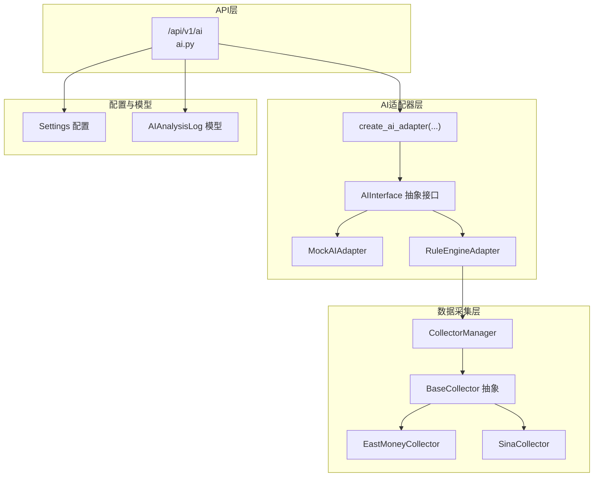
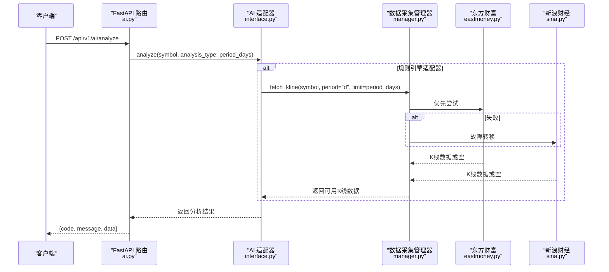
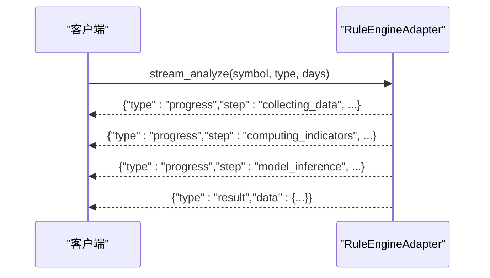
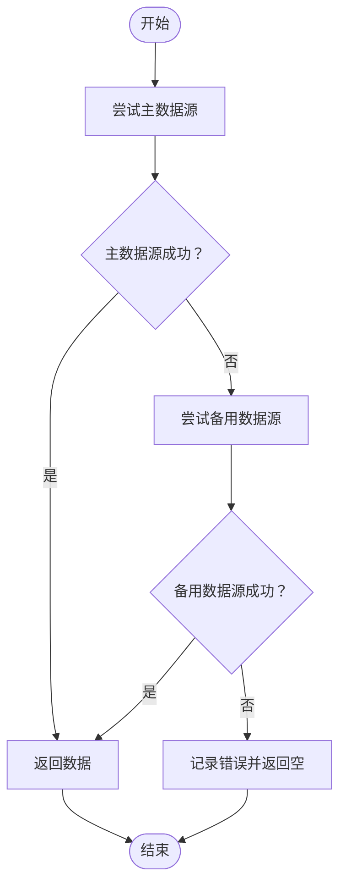
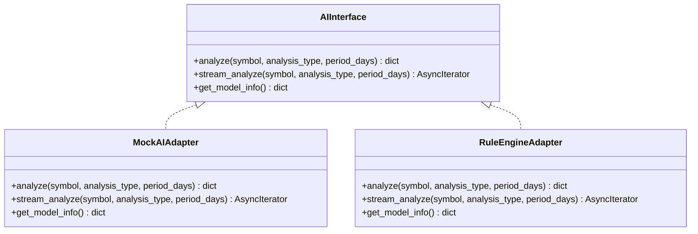
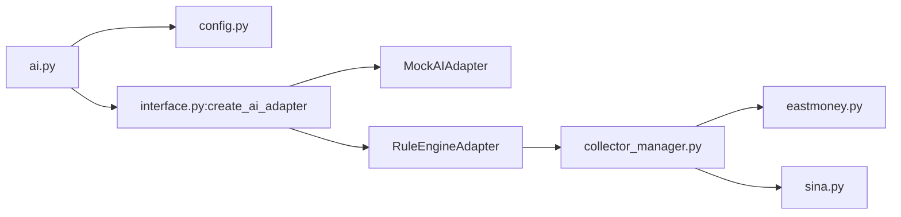

# AI分析API

<cite>
**本文引用的文件**
- [backend/app/api/v1/ai.py](file://backend/app/api/v1/ai.py)
- [backend/app/ai/interface.py](file://backend/app/ai/interface.py)
- [backend/app/schemas/schemas.py](file://backend/app/schemas/schemas.py)
- [backend/app/models/models.py](file://backend/app/models/models.py)
- [backend/app/core/config.py](file://backend/app/core/config.py)
- [backend/app/main.py](file://backend/app/main.py)
- [backend/app/services/collector/manager.py](file://backend/app/services/collector/manager.py)
- [backend/app/services/collector/base.py](file://backend/app/services/collector/base.py)
- [backend/app/services/collector/eastmoney.py](file://backend/app/services/collector/eastmoney.py)
- [backend/app/services/collector/sina.py](file://backend/app/services/collector/sina.py)
</cite>

## 目录
1. [简介](#简介)
2. [项目结构](#项目结构)
3. [核心组件](#核心组件)
4. [架构总览](#架构总览)
5. [详细组件分析](#详细组件分析)
6. [依赖分析](#依赖分析)
7. [性能考虑](#性能考虑)
8. [故障排查指南](#故障排查指南)
9. [结论](#结论)
10. [附录](#附录)

## 简介
本文件为 Stock-View 平台的 AI 智能分析 API 技术文档，覆盖以下内容：
- AI 分析结果查询接口规范：HTTP 方法、URL 路径、请求参数、响应格式
- 分析策略配置与维度：支持的分析类型、时间窗口、可选参数
- 模型信息获取：模型名称、版本、能力范围与状态
- 结果解读：趋势方向、置信度、技术指标、支撑阻力、预测目标与止损、风险等级
- 调用限制、分析延迟与性能优化建议
- 数据来源与适配器设计：Mock、规则引擎、数据采集器自动故障转移

## 项目结构
后端采用 FastAPI 构建，AI 分析相关模块位于 backend/app/api/v1/ai.py，并通过适配器模式对接不同 AI 实现；数据采集由 CollectorManager 统一调度多个数据源。

**图示来源**
- [backend/app/api/v1/ai.py:1-29](file://backend/app/api/v1/ai.py#L1-L29)
- [backend/app/ai/interface.py:26-196](file://backend/app/ai/interface.py#L26-L196)
- [backend/app/services/collector/manager.py:12-94](file://backend/app/services/collector/manager.py#L12-L94)
- [backend/app/services/collector/base.py:5-45](file://backend/app/services/collector/base.py#L5-L45)
- [backend/app/services/collector/eastmoney.py:26-297](file://backend/app/services/collector/eastmoney.py#L26-L297)
- [backend/app/services/collector/sina.py:24-312](file://backend/app/services/collector/sina.py#L24-L312)
- [backend/app/core/config.py:5-43](file://backend/app/core/config.py#L5-L43)
- [backend/app/models/models.py:62-74](file://backend/app/models/models.py#L62-L74)

**章节来源**
- [backend/app/main.py:38-43](file://backend/app/main.py#L38-L43)
- [backend/app/api/v1/ai.py:1-29](file://backend/app/api/v1/ai.py#L1-L29)

## 核心组件
- AI 接口与适配器
  - AIInterface 定义统一异步分析接口、流式分析接口与模型信息查询
  - MockAIAdapter 提供模拟分析结果，便于前端联调与演示
  - RuleEngineAdapter 基于简单技术指标规则进行分析，依赖 CollectorManager 获取K线数据
  - create_ai_adapter 根据配置选择具体适配器实例
- API 路由
  - POST /api/v1/ai/analyze：发起一次 AI 分析
  - GET /api/v1/ai/history：AI 分析历史（预留）
  - GET /api/v1/ai/model-info：获取当前适配器的模型信息
- 配置
  - Settings 中包含 AI_ADAPTER、AI_REQUEST_TIMEOUT、AI_CACHE_ENABLED、AI_CACHE_TTL、AI_RATE_LIMIT 等关键参数
- 数据模型
  - AIAnalysisLog 记录分析日志，包含 symbol、analysis_type、model_version、request_params、result_data、trend、confidence、duration_ms 等字段

**章节来源**
- [backend/app/ai/interface.py:26-196](file://backend/app/ai/interface.py#L26-L196)
- [backend/app/api/v1/ai.py:10-29](file://backend/app/api/v1/ai.py#L10-L29)
- [backend/app/core/config.py:19-25](file://backend/app/core/config.py#L19-L25)
- [backend/app/models/models.py:62-74](file://backend/app/models/models.py#L62-L74)

## 架构总览
AI 分析请求从 API 层进入，经由适配器层执行分析逻辑，必要时通过 CollectorManager 调用数据采集器获取历史K线数据，最终返回统一的响应结构。

**图示来源**
- [backend/app/api/v1/ai.py:10-15](file://backend/app/api/v1/ai.py#L10-L15)
- [backend/app/ai/interface.py:114-170](file://backend/app/ai/interface.py#L114-L170)
- [backend/app/services/collector/manager.py:49-61](file://backend/app/services/collector/manager.py#L49-L61)
- [backend/app/services/collector/eastmoney.py:151-199](file://backend/app/services/collector/eastmoney.py#L151-L199)
- [backend/app/services/collector/sina.py:173-227](file://backend/app/services/collector/sina.py#L173-L227)

## 详细组件分析

### 接口定义与调用规范

- POST /api/v1/ai/analyze
  - 功能：请求 AI 分析
  - 请求参数（查询参数）
    - symbol: 股票代码（必填）
    - analysis_type: 分析类型，默认 comprehensive（可选值见下节）
    - period_days: 分析时间窗口（天），默认 30
  - 响应格式
    - code: 状态码（0 表示成功）
    - message: 描述信息
    - data: 分析结果对象（见“响应数据结构”）
  - 示例
    - 请求：POST /api/v1/ai/analyze?symbol=600036&analysis_type=comprehensive&period_days=30
    - 响应：包含 code、message、data 的 JSON 对象

- GET /api/v1/ai/history
  - 功能：获取 AI 分析历史（预留）
  - 请求参数
    - symbol: 股票代码（可选）
    - page: 页码，默认 1
    - page_size: 每页条数，默认 20
  - 响应格式
    - code: 状态码
    - message: 描述信息
    - data: { items[], total, page, page_size }

- GET /api/v1/ai/model-info
  - 功能：获取当前 AI 适配器的模型信息
  - 响应格式
    - code: 状态码
    - message: 描述信息
    - data: 包含 name、version、description、supported_types、status 的对象

**章节来源**
- [backend/app/api/v1/ai.py:10-29](file://backend/app/api/v1/ai.py#L10-L29)

### 分析类型与维度
- 支持的分析类型（analysis_type）
  - technical：技术分析
  - trend：趋势预测
  - risk：风险评估
  - comprehensive：综合分析
- 时间维度
  - period_days：分析所用的历史数据天数，默认 30
- 可选参数
  - include_kline：是否包含K线数据（当前接口未直接使用该参数，但可在自定义适配器中启用）
  - custom_params：自定义参数字典（当前接口未直接使用该参数，但可在自定义适配器中启用）

**章节来源**
- [backend/app/ai/interface.py:13-18](file://backend/app/ai/interface.py#L13-L18)
- [backend/app/schemas/schemas.py:94-100](file://backend/app/schemas/schemas.py#L94-L100)

### 响应数据结构
- 通用响应结构
  - code: 状态码（0 表示成功）
  - message: 描述信息
  - data: 具体业务数据
- 分析结果对象（示例字段，实际以适配器实现为准）
  - symbol: 股票代码
  - analysis_type: 分析类型
  - trend: 趋势方向（bullish/bearish/neutral）
  - confidence: 置信度（0~1）
  - summary: 分析摘要
  - details: 详细分析
    - technical: 技术分析细节
      - MACD/KDJ/RSI/BOLL 等指标信号、数值与描述
      - 支撑阻力 levels
    - prediction: 预测
      - direction: 方向
      - target_price: 目标价
      - stop_loss: 止损
      - timeframe: 时间窗口
  - indicators: 指标数值
  - risk_level: 风险等级（low/medium/high）
  - timestamp: 分析时间戳
  - model_version: 模型版本号
- 模型信息对象
  - name: 模型名称
  - version: 版本号
  - description: 描述
  - supported_types: 支持的分析类型数组
  - status: 状态（如 active）

**章节来源**
- [backend/app/api/v1/ai.py:10-15](file://backend/app/api/v1/ai.py#L10-L15)
- [backend/app/ai/interface.py:45-87](file://backend/app/ai/interface.py#L45-L87)
- [backend/app/ai/interface.py:101-108](file://backend/app/ai/interface.py#L101-L108)
- [backend/app/ai/interface.py:180-187](file://backend/app/ai/interface.py#L180-L187)

### 流式分析流程（WebSocket/服务端推送）
- 规则引擎适配器提供流式分析接口，按阶段推送进度与最终结果
- 进度事件
  - type: progress
  - step: 步骤标识（collecting_data/computing_indicators/model_inference）
  - progress: 进度百分比（0~1）
  - message: 文本提示
- 结果事件
  - type: result
  - data: 最终分析结果对象

**图示来源**
- [backend/app/ai/interface.py:172-178](file://backend/app/ai/interface.py#L172-L178)

**章节来源**
- [backend/app/ai/interface.py:89-99](file://backend/app/ai/interface.py#L89-L99)
- [backend/app/ai/interface.py:172-178](file://backend/app/ai/interface.py#L172-L178)

### 数据采集与故障转移
- CollectorManager 会优先尝试主数据源，失败时自动切换到备用数据源
- 支持的数据采集接口
  - fetch_quote(symbol)
  - fetch_quote_list(page, page_size, sort_by, sort_order, market)
  - fetch_kline(symbol, period, fq_type, limit)
  - fetch_timeline(symbol)
  - fetch_orderbook(symbol)
- 适配器在规则引擎分析中调用 fetch_kline 获取历史K线用于规则计算

**图示来源**
- [backend/app/services/collector/manager.py:21-33](file://backend/app/services/collector/manager.py#L21-L33)
- [backend/app/services/collector/manager.py:49-61](file://backend/app/services/collector/manager.py#L49-L61)

**章节来源**
- [backend/app/services/collector/manager.py:12-94](file://backend/app/services/collector/manager.py#L12-L94)
- [backend/app/services/collector/base.py:8-34](file://backend/app/services/collector/base.py#L8-L34)
- [backend/app/services/collector/eastmoney.py:69-86](file://backend/app/services/collector/eastmoney.py#L69-L86)
- [backend/app/services/collector/sina.py:64-107](file://backend/app/services/collector/sina.py#L64-L107)

### 类关系图（AI 适配器与接口）

**图示来源**
- [backend/app/ai/interface.py:26-196](file://backend/app/ai/interface.py#L26-L196)

## 依赖分析
- 组件耦合
  - API 路由仅依赖适配器工厂与配置，低耦合
  - 规则引擎适配器依赖 CollectorManager 获取K线数据，形成数据依赖链
- 外部依赖
  - httpx 异步HTTP客户端用于数据源访问
  - Redis 用于缓存与队列（配置项存在）
- 配置项对行为的影响
  - AI_ADAPTER 决定使用哪个适配器
  - AI_REQUEST_TIMEOUT 控制请求超时
  - AI_CACHE_ENABLED/AI_CACHE_TTL 控制缓存策略
  - AI_RATE_LIMIT 控制限流（当前未在路由中实现，可扩展）

**图示来源**
- [backend/app/api/v1/ai.py:10-15](file://backend/app/api/v1/ai.py#L10-L15)
- [backend/app/core/config.py:19-25](file://backend/app/core/config.py#L19-L25)
- [backend/app/ai/interface.py:190-196](file://backend/app/ai/interface.py#L190-L196)
- [backend/app/services/collector/manager.py:12-19](file://backend/app/services/collector/manager.py#L12-L19)
- [backend/app/services/collector/eastmoney.py:26-39](file://backend/app/services/collector/eastmoney.py#L26-L39)
- [backend/app/services/collector/sina.py:24-34](file://backend/app/services/collector/sina.py#L24-L34)

**章节来源**
- [backend/app/api/v1/ai.py:1-29](file://backend/app/api/v1/ai.py#L1-L29)
- [backend/app/ai/interface.py:190-196](file://backend/app/ai/interface.py#L190-L196)
- [backend/app/services/collector/manager.py:12-19](file://backend/app/services/collector/manager.py#L12-L19)

## 性能考虑
- 数据源访问
  - 使用 httpx 异步客户端，合理设置连接池与超时
  - 主备数据源自动故障转移，提升可用性
- 缓存策略
  - 配置项支持缓存与TTL，建议结合热点股票与分析结果进行缓存
- 并发与限流
  - AI_RATE_LIMIT 提供限流参数，可在路由层扩展实现
- 分析延迟
  - 规则引擎适配器会拉取历史K线，period_days 越大，延迟越高
  - 建议前端分页与懒加载，避免一次性请求过多历史数据

[本节为通用性能建议，不直接分析具体文件]

## 故障排查指南
- 适配器未生效
  - 检查 AI_ADAPTER 配置是否正确
  - 确认 create_ai_adapter 返回的实例类型
- 数据为空
  - 检查 CollectorManager 是否成功切换到备用数据源
  - 查看日志中关于“空数据”或“异常”的警告
- 响应格式异常
  - 确认返回的 data 字段是否为适配器实现的结构
  - 核对 AnalysisType 与 TrendDirection 的枚举值
- 日志与审计
  - AIAnalysisLog 记录了分析请求与结果的关键字段，可用于问题定位

**章节来源**
- [backend/app/core/config.py:19-25](file://backend/app/core/config.py#L19-L25)
- [backend/app/services/collector/manager.py:21-33](file://backend/app/services/collector/manager.py#L21-L33)
- [backend/app/models/models.py:62-74](file://backend/app/models/models.py#L62-L74)

## 结论
AI 分析 API 通过适配器模式实现了灵活的分析策略扩展，结合多数据源的自动故障转移，提升了系统的稳定性与可维护性。开发者可通过统一的接口与响应结构快速集成技术分析、趋势预测与风险评估能力，并依据配置项进行性能与可靠性优化。

[本节为总结性内容，不直接分析具体文件]

## 附录

### API 列表与参数对照
- POST /api/v1/ai/analyze
  - 查询参数
    - symbol: 股票代码（必填）
    - analysis_type: 分析类型（默认 comprehensive）
    - period_days: 天数（默认 30）
  - 响应
    - code, message, data（分析结果对象）

- GET /api/v1/ai/history
  - 查询参数
    - symbol: 股票代码（可选）
    - page: 页码（默认 1）
    - page_size: 每页条数（默认 20）
  - 响应
    - code, message, data（分页结构）

- GET /api/v1/ai/model-info
  - 查询参数：无
  - 响应
    - code, message, data（模型信息对象）

**章节来源**
- [backend/app/api/v1/ai.py:10-29](file://backend/app/api/v1/ai.py#L10-L29)

### 配置项参考
- AI_ADAPTER: 适配器名称（mock/rule）
- AI_REQUEST_TIMEOUT: 请求超时秒数
- AI_CACHE_ENABLED: 是否启用缓存
- AI_CACHE_TTL: 缓存过期秒数
- AI_RATE_LIMIT: 速率限制（建议扩展为路由中间件）

**章节来源**
- [backend/app/core/config.py:19-25](file://backend/app/core/config.py#L19-L25)