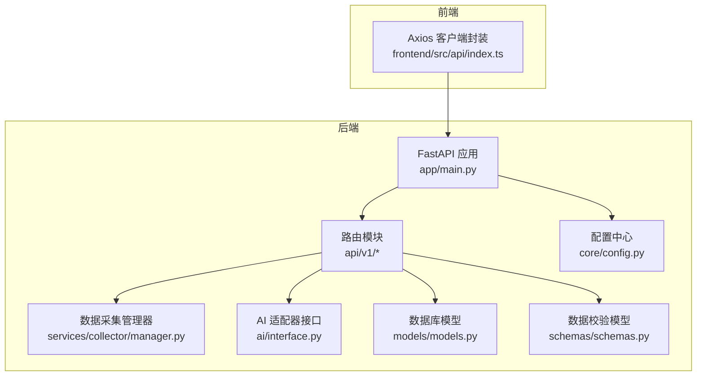
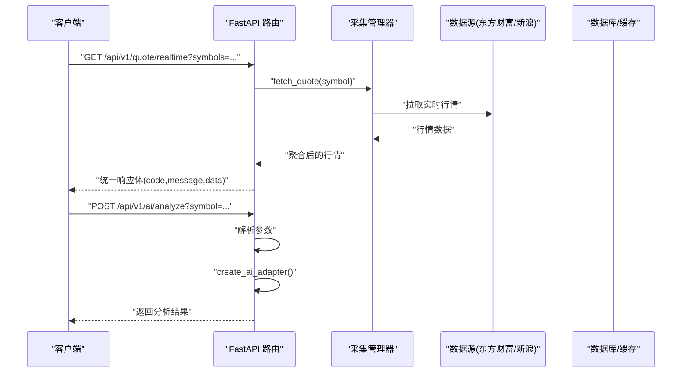
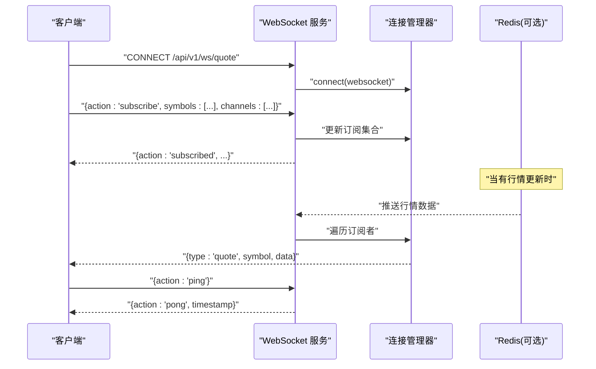
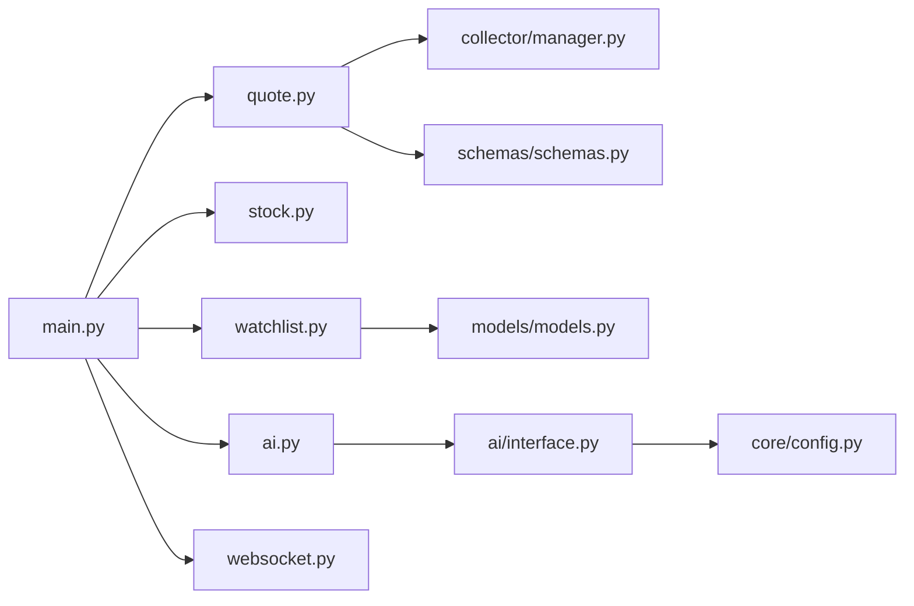

# API接口文档

<cite>
**本文引用的文件**
- [backend/app/main.py](file://backend/app/main.py)
- [backend/app/api/v1/quote.py](file://backend/app/api/v1/quote.py)
- [backend/app/api/v1/stock.py](file://backend/app/api/v1/stock.py)
- [backend/app/api/v1/watchlist.py](file://backend/app/api/v1/watchlist.py)
- [backend/app/api/v1/ai.py](file://backend/app/api/v1/ai.py)
- [backend/app/api/websocket.py](file://backend/app/api/websocket.py)
- [backend/app/services/collector/manager.py](file://backend/app/services/collector/manager.py)
- [backend/app/ai/interface.py](file://backend/app/ai/interface.py)
- [backend/app/models/models.py](file://backend/app/models/models.py)
- [backend/app/schemas/schemas.py](file://backend/app/schemas/schemas.py)
- [backend/app/core/config.py](file://backend/app/core/config.py)
- [frontend/src/api/index.ts](file://frontend/src/api/index.ts)
- [README.md](file://README.md)
</cite>

## 目录
1. [简介](#简介)
2. [项目结构](#项目结构)
3. [核心组件](#核心组件)
4. [架构总览](#架构总览)
5. [详细组件分析](#详细组件分析)
6. [依赖关系分析](#依赖关系分析)
7. [性能考量](#性能考量)
8. [故障排查指南](#故障排查指南)
9. [结论](#结论)
10. [附录](#附录)

## 简介
本文件为 Stock-View 项目的完整 API 接口文档，覆盖后端 RESTful API 与 WebSocket 实时推送接口。内容包括：
- 行情 API：实时报价、K线、分时图、盘口数据
- 股票 API：基本信息与搜索
- 自选股 API：列表管理与排序
- AI 分析 API：分析结果与模型信息
- WebSocket 实时推送：消息格式、事件类型与连接管理
- 认证机制、错误处理与数据验证规则
- 请求/响应示例、SDK 使用指南与客户端集成最佳实践

## 项目结构
后端采用 FastAPI + SQLAlchemy（异步）+ PostgreSQL + Redis 架构；前端使用 Vue 3 + TypeScript + Axios。API 命名空间为 /api/v1，各模块按功能划分。

图表来源
- [backend/app/main.py:1-48](file://backend/app/main.py#L1-L48)
- [backend/app/api/v1/quote.py:1-65](file://backend/app/api/v1/quote.py#L1-L65)
- [backend/app/api/v1/stock.py:1-37](file://backend/app/api/v1/stock.py#L1-L37)
- [backend/app/api/v1/watchlist.py:1-77](file://backend/app/api/v1/watchlist.py#L1-L77)
- [backend/app/api/v1/ai.py:1-29](file://backend/app/api/v1/ai.py#L1-L29)
- [backend/app/api/websocket.py:1-79](file://backend/app/api/websocket.py#L1-L79)
- [backend/app/services/collector/manager.py:1-94](file://backend/app/services/collector/manager.py#L1-L94)
- [backend/app/ai/interface.py:1-196](file://backend/app/ai/interface.py#L1-L196)
- [backend/app/models/models.py:1-74](file://backend/app/models/models.py#L1-L74)
- [backend/app/schemas/schemas.py:1-103](file://backend/app/schemas/schemas.py#L1-L103)
- [backend/app/core/config.py:1-43](file://backend/app/core/config.py#L1-L43)
- [frontend/src/api/index.ts:1-33](file://frontend/src/api/index.ts#L1-L33)

章节来源
- [backend/app/main.py:1-48](file://backend/app/main.py#L1-L48)
- [README.md:92-126](file://README.md#L92-L126)

## 核心组件
- FastAPI 应用与路由注册：统一挂载 /api/v1 下的子路由，并启用 CORS。
- 数据采集管理器：按优先级轮询多个数据源（如东方财富、新浪），实现故障转移。
- AI 分析适配器：抽象接口与多种实现（Mock、规则引擎），支持同步与流式分析。
- 数据模型与校验：Pydantic 模型定义统一响应结构与业务实体字段。
- 配置中心：集中管理数据库、Redis、AI 适配器、JWT 等配置项。

章节来源
- [backend/app/main.py:22-48](file://backend/app/main.py#L22-L48)
- [backend/app/services/collector/manager.py:12-94](file://backend/app/services/collector/manager.py#L12-L94)
- [backend/app/ai/interface.py:26-196](file://backend/app/ai/interface.py#L26-L196)
- [backend/app/schemas/schemas.py:6-103](file://backend/app/schemas/schemas.py#L6-L103)
- [backend/app/core/config.py:5-43](file://backend/app/core/config.py#L5-L43)

## 架构总览
下图展示 API 调用链路与数据流向：

图表来源
- [backend/app/api/v1/quote.py:7-16](file://backend/app/api/v1/quote.py#L7-L16)
- [backend/app/api/v1/ai.py:10-15](file://backend/app/api/v1/ai.py#L10-L15)
- [backend/app/services/collector/manager.py:21-33](file://backend/app/services/collector/manager.py#L21-L33)
- [backend/app/ai/interface.py:190-196](file://backend/app/ai/interface.py#L190-L196)

## 详细组件分析

### 行情 API（/api/v1/quote）
- 统一响应结构
  - 字段：code（数字）、message（字符串，默认“success”）、data（对象或列表）
  - 错误码示例：1002（股票不存在或数据源不可用）、1003（数据源暂不可用）
- 端点与参数
  - GET /quote/realtime
    - 查询参数：symbols（必填，逗号分隔，最多 50 个）
    - 返回：包含 items 的字典
  - GET /quote/list
    - 查询参数：market（all/sh/sz，默认 all）、sort_by（默认 change_pct）、sort_order（asc/desc，默认 desc）、page（>=1，默认 1）、page_size（1..100，默认 20）
    - 返回：分页数据
  - GET /quote/kline
    - 查询参数：symbol（必填）、period（1m/5m/15m/30m/60m/d/w/m，默认 d）、fq_type（none/front/back，默认 front）、limit（1..500，默认 120）
    - 返回：K线数据
  - GET /quote/timeline
    - 查询参数：symbol（必填）
    - 返回：分时数据
  - GET /quote/orderbook
    - 查询参数：symbol（必填）
    - 返回：盘口数据
- 数据验证与限制
  - 参数范围校验（ge/le）与默认值设置
  - 实时行情最多取 50 个符号
- 错误处理
  - 数据源不可用时返回 1003
  - 股票不存在或数据为空时返回 1002

章节来源
- [backend/app/api/v1/quote.py:7-65](file://backend/app/api/v1/quote.py#L7-L65)
- [backend/app/schemas/schemas.py:12-68](file://backend/app/schemas/schemas.py#L12-L68)

### 股票 API（/api/v1/stock）
- GET /stock/search
  - 查询参数：keyword（必填）、limit（1..20，默认 10）
  - 功能：调用东方财富建议接口，过滤 A 股，返回 symbol、name、market、pinyin
  - 返回：包含 items 的字典
- 注意
  - 该接口直接调用外部服务，存在网络超时风险

章节来源
- [backend/app/api/v1/stock.py:10-37](file://backend/app/api/v1/stock.py#L10-L37)

### 自选股 API（/api/v1/watchlist）
- GET /watchlist
  - 功能：按 sort_order 升序返回当前用户（固定 ID=1）的自选股列表
  - 返回：包含 items 的字典
- POST /watchlist
  - 请求体：{ symbol, market（默认 sh） }
  - 功能：添加自选股，自动分配最大排序号+1
  - 返回：成功无 data
  - 错误：若已存在返回 1001
- DELETE /watchlist/{symbol}
  - 功能：删除指定 symbol 的自选股
  - 返回：成功无 data
- PUT /watchlist/sort
  - 请求体：{ items: [{ symbol, sort_order }] }
  - 功能：批量更新排序
  - 返回：成功无 data

章节来源
- [backend/app/api/v1/watchlist.py:13-77](file://backend/app/api/v1/watchlist.py#L13-L77)
- [backend/app/schemas/schemas.py:78-91](file://backend/app/schemas/schemas.py#L78-L91)
- [backend/app/models/models.py:50-60](file://backend/app/models/models.py#L50-L60)

### AI 分析 API（/api/v1/ai）
- POST /ai/analyze
  - 查询参数：symbol（必填）、analysis_type（默认 comprehensive）、period_days（默认 30）
  - 功能：调用 AI 适配器执行分析，返回分析结果
  - 返回：data 为适配器输出
- GET /ai/history
  - 查询参数：symbol（可选）、page（默认 1）、page_size（默认 20）
  - 功能：预留接口，当前返回空列表
- GET /ai/model-info
  - 功能：返回当前适配器的模型信息（名称、版本、描述、支持类型、状态）

AI 适配器
- 支持适配器：mock、rule
- MockAIAdapter：返回模拟分析结果与进度流
- RuleEngineAdapter：基于 K 线规则的简易分析

章节来源
- [backend/app/api/v1/ai.py:10-29](file://backend/app/api/v1/ai.py#L10-L29)
- [backend/app/ai/interface.py:26-196](file://backend/app/ai/interface.py#L26-L196)
- [backend/app/core/config.py:19-24](file://backend/app/core/config.py#L19-L24)

### WebSocket 实时推送（/api/v1/ws/quote）
- 连接与管理
  - 路径：/api/v1/ws/quote
  - 类：ConnectionManager（维护活动连接与订阅集合）
- 客户端消息
  - subscribe：{ action: "subscribe", symbols: [...], channels: [...] }
  - unsubscribe：{ action: "unsubscribe", symbols: [...] }
  - ping：{ action: "ping" } → 服务器回 pong
- 服务器推送
  - 广播消息：{ type: "quote", symbol, data }
  - 订阅确认：{ action: "subscribed", symbols, channels }
- 断开处理
  - 捕获 WebSocketDisconnect，清理连接与订阅

图表来源
- [backend/app/api/websocket.py:39-79](file://backend/app/api/websocket.py#L39-L79)
- [backend/app/api/websocket.py:12-36](file://backend/app/api/websocket.py#L12-L36)

## 依赖关系分析
- 路由与应用
  - app/main.py 注册 /api/v1 下的所有子路由
- 数据采集
  - quote.* 调用 CollectorManager，后者按优先级选择具体采集器
- AI 分析
  - ai.* 调用 create_ai_adapter(settings.AI_ADAPTER)，返回适配器实例
- 数据模型与校验
  - schemas 定义统一响应与业务实体；models 定义数据库表结构

图表来源
- [backend/app/main.py:39-43](file://backend/app/main.py#L39-L43)
- [backend/app/api/v1/quote.py:1-4](file://backend/app/api/v1/quote.py#L1-L4)
- [backend/app/api/v1/stock.py:1-4](file://backend/app/api/v1/stock.py#L1-L4)
- [backend/app/api/v1/watchlist.py:1-8](file://backend/app/api/v1/watchlist.py#L1-L8)
- [backend/app/api/v1/ai.py:1-5](file://backend/app/api/v1/ai.py#L1-L5)
- [backend/app/api/websocket.py:1-9](file://backend/app/api/websocket.py#L1-L9)
- [backend/app/services/collector/manager.py:12-20](file://backend/app/services/collector/manager.py#L12-L20)
- [backend/app/ai/interface.py:190-196](file://backend/app/ai/interface.py#L190-L196)
- [backend/app/core/config.py:19-24](file://backend/app/core/config.py#L19-L24)
- [backend/app/schemas/schemas.py:6-10](file://backend/app/schemas/schemas.py#L6-L10)
- [backend/app/models/models.py:1-3](file://backend/app/models/models.py#L1-L3)

章节来源
- [backend/app/main.py:39-43](file://backend/app/main.py#L39-L43)
- [backend/app/services/collector/manager.py:12-94](file://backend/app/services/collector/manager.py#L12-L94)
- [backend/app/ai/interface.py:190-196](file://backend/app/ai/interface.py#L190-L196)

## 性能考量
- 数据采集与缓存
  - 配置项 QUOTE_CACHE_TTL 控制缓存时间；PRIMARY_DATA_SOURCE 与 FALLBACK_DATA_SOURCE 提供故障转移
- AI 分析
  - AI_CACHE_ENABLED/AI_CACHE_TTL 控制缓存；AI_RATE_LIMIT 限制速率
- 网络超时
  - 股票搜索接口使用短超时（示例 5 秒），避免阻塞
- 建议
  - 前端对高频请求进行去抖/节流
  - WebSocket 订阅按需增减，避免过多 symbol 导致广播压力

章节来源
- [backend/app/core/config.py:29-31](file://backend/app/core/config.py#L29-L31)
- [backend/app/core/config.py:22-25](file://backend/app/core/config.py#L22-L25)
- [backend/app/api/v1/stock.py:16-22](file://backend/app/api/v1/stock.py#L16-L22)

## 故障排查指南
- 常见错误码
  - 1002：股票代码不存在或数据源不可用
  - 1003：数据源暂不可用
  - 1001：已在自选股中（重复添加）
- 日志与可观测性
  - 采集器在切换数据源时记录 warning；所有数据源失败时记录 error
- 建议排查步骤
  - 检查数据源连通性与可用性
  - 核对 symbol 格式与市场前缀
  - 确认 WebSocket 订阅是否正确发送 subscribe 消息
  - 查看后端日志定位异常

章节来源
- [backend/app/api/v1/quote.py:31-33](file://backend/app/api/v1/quote.py#L31-L33)
- [backend/app/api/v1/quote.py:45-47](file://backend/app/api/v1/quote.py#L45-L47)
- [backend/app/api/v1/watchlist.py:38-40](file://backend/app/api/v1/watchlist.py#L38-L40)
- [backend/app/services/collector/manager.py:29-33](file://backend/app/services/collector/manager.py#L29-L33)

## 结论
本文档系统梳理了 Stock-View 的 REST API 与 WebSocket 实时推送接口，明确了端点、参数、响应格式、错误码与数据验证规则，并提供了架构图与流程图帮助理解。建议在生产环境中结合配置项与缓存策略优化性能，并通过日志与监控持续改进稳定性。

## 附录

### 统一响应结构
- 字段
  - code：整数，0 表示成功，非 0 为错误码
  - message：字符串，默认“success”
  - data：对象或数组，具体接口定义详见各模块

章节来源
- [backend/app/schemas/schemas.py:6-10](file://backend/app/schemas/schemas.py#L6-L10)

### SDK 使用指南（前端）
- Axios 封装
  - 基础路径：/api/v1
  - 超时：15 秒
- 接口封装
  - 行情：getRealtime、getList、getKline、getTimeline、getOrderbook
  - 股票：search
  - 自选股：getList、add、remove、sort
  - AI：analyze、getModelInfo
- 使用建议
  - 在组件内通过封装函数发起请求
  - 对错误码进行统一处理（如弹窗提示或重试）

章节来源
- [frontend/src/api/index.ts:3-33](file://frontend/src/api/index.ts#L3-L33)

### 客户端集成最佳实践
- 认证机制
  - 当前未实现鉴权中间件，建议在网关或应用层增加 JWT 或 API Key 鉴权
- 错误处理
  - 对 code 非 0 的响应进行统一拦截与提示
  - 对网络异常与超时进行重试与降级
- 实时推送
  - 建立连接后立即发送 subscribe 消息
  - 对 ping/pong 保持心跳，断线重连
  - 按 symbol 与 channel 粒度订阅，避免广播风暴

章节来源
- [backend/app/main.py:29-36](file://backend/app/main.py#L29-L36)
- [backend/app/api/websocket.py:39-65](file://backend/app/api/websocket.py#L39-L65)

### 请求/响应示例（路径指引）
- 行情实时
  - 请求：GET /api/v1/quote/realtime?symbols=000001,sz000002
  - 响应：参见 [响应结构:6-10](file://backend/app/schemas/schemas.py#L6-L10)
- 行情列表
  - 请求：GET /api/v1/quote/list?page=1&page_size=20&sort_by=change_pct&sort_order=desc&market=all
  - 响应：参见 [QuoteListResponse:30-32](file://backend/app/schemas/schemas.py#L30-L32)
- K线
  - 请求：GET /api/v1/quote/kline?symbol=000001&period=d&fq_type=front&limit=120
  - 响应：参见 [KlineResponse:45-47](file://backend/app/schemas/schemas.py#L45-L47)
- 分时
  - 请求：GET /api/v1/quote/timeline?symbol=000001
  - 响应：参见 [TimelineResponse:56-58](file://backend/app/schemas/schemas.py#L56-L58)
- 盘口
  - 请求：GET /api/v1/quote/orderbook?symbol=000001
  - 响应：参见 [OrderBookResponse:66-68](file://backend/app/schemas/schemas.py#L66-L68)
- 股票搜索
  - 请求：GET /api/v1/stock/search?keyword=贵州茅台&limit=10
  - 响应：参见 [StockSearchItem:71-76](file://backend/app/schemas/schemas.py#L71-L76)
- 自选股
  - 添加：POST /api/v1/watchlist（Body：{ symbol, market }）
  - 删除：DELETE /api/v1/watchlist/{symbol}
  - 排序：PUT /api/v1/watchlist/sort（Body：{ items: [{ symbol, sort_order }] }）
- AI 分析
  - 请求：POST /api/v1/ai/analyze?symbol=000001&analysis_type=comprehensive&period_days=30
  - 响应：参见 [AIAnalysisResponse:102-103](file://backend/app/schemas/schemas.py#L102-L103)
- WebSocket
  - 订阅：{ action: "subscribe", symbols: ["000001"], channels: ["quote"] }
  - 广播：{ type: "quote", symbol: "000001", data: {...} }

章节来源
- [backend/app/api/v1/quote.py:7-65](file://backend/app/api/v1/quote.py#L7-L65)
- [backend/app/api/v1/stock.py:10-37](file://backend/app/api/v1/stock.py#L10-L37)
- [backend/app/api/v1/watchlist.py:13-77](file://backend/app/api/v1/watchlist.py#L13-L77)
- [backend/app/api/v1/ai.py:10-29](file://backend/app/api/v1/ai.py#L10-L29)
- [backend/app/api/websocket.py:39-79](file://backend/app/api/websocket.py#L39-L79)
- [backend/app/schemas/schemas.py:12-103](file://backend/app/schemas/schemas.py#L12-L103)