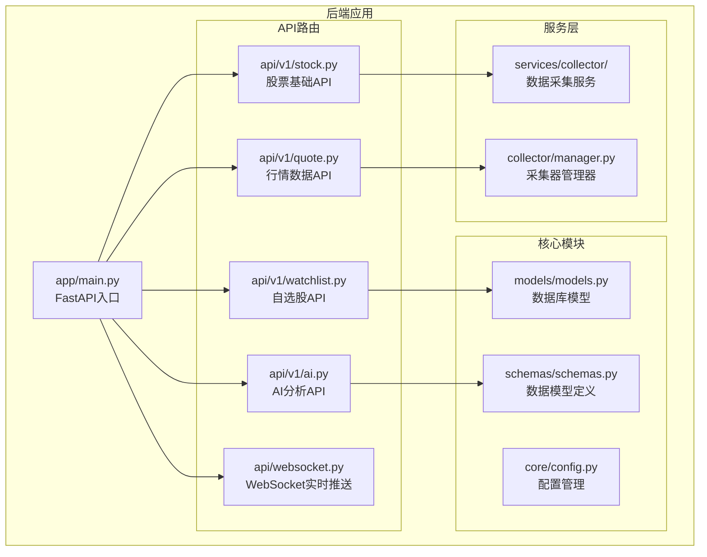
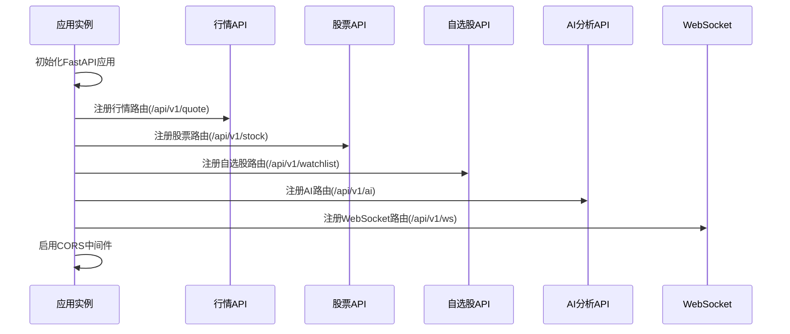
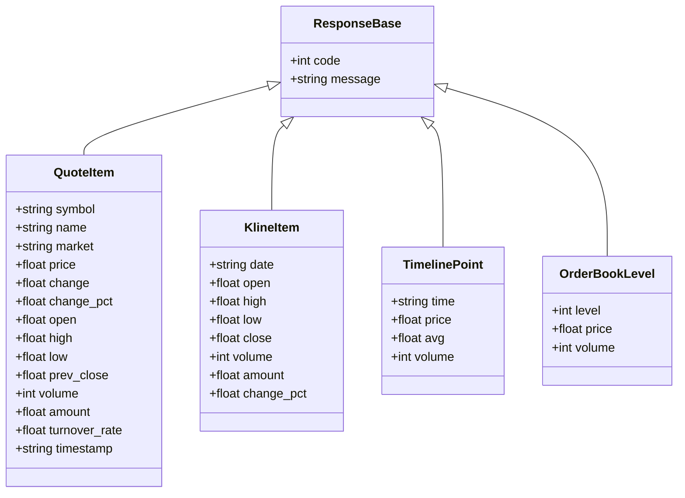
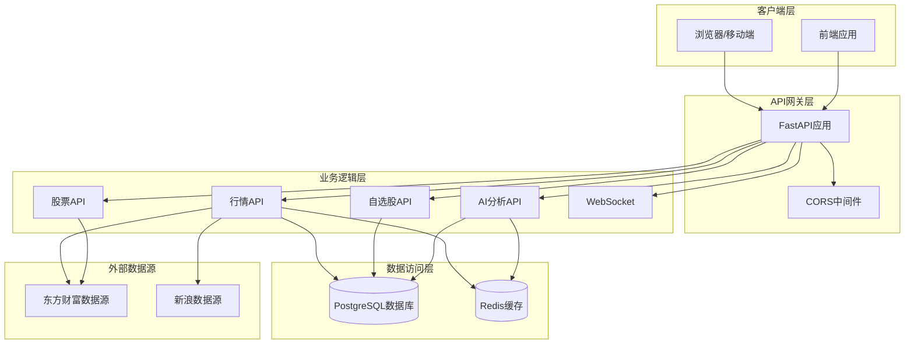
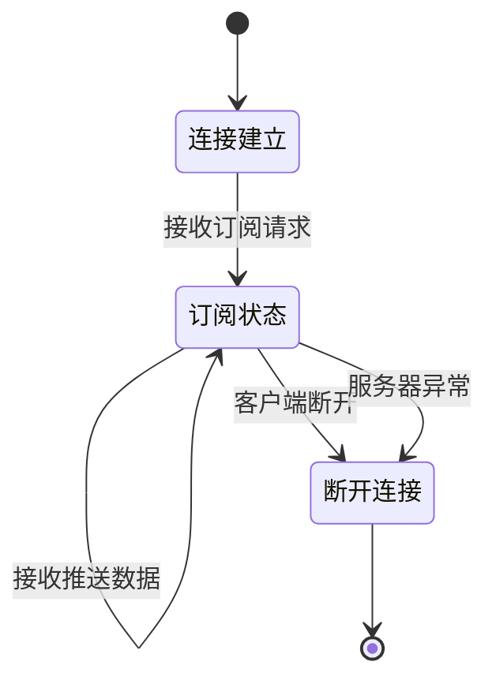
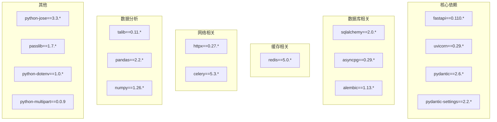
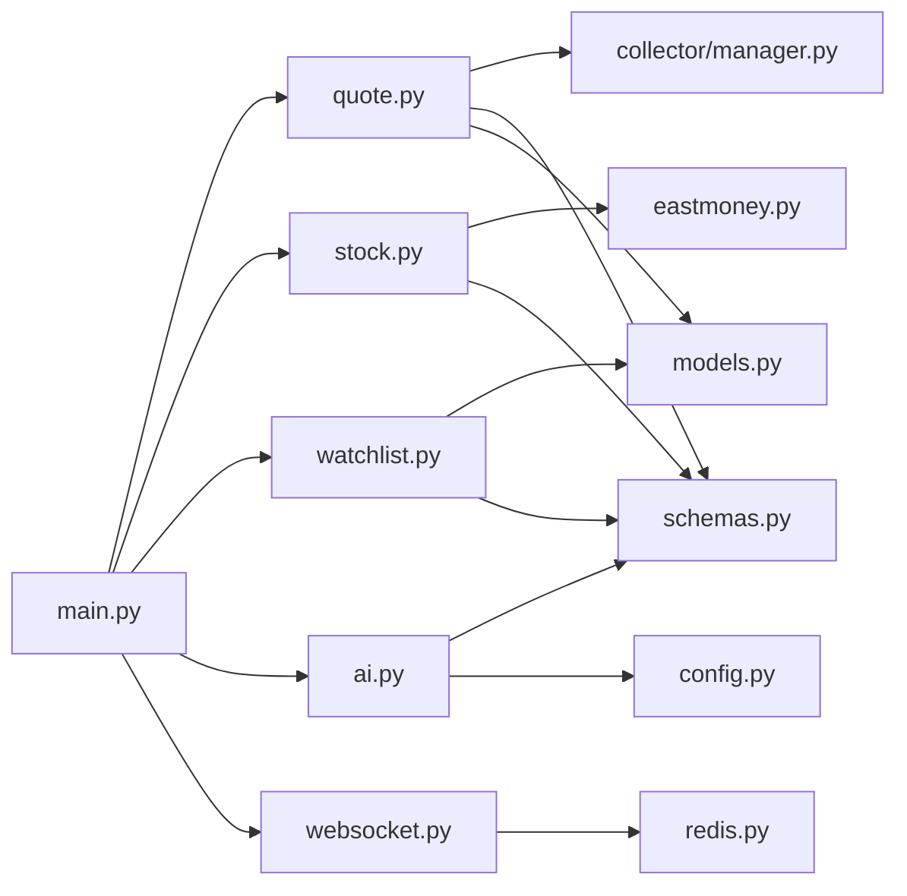
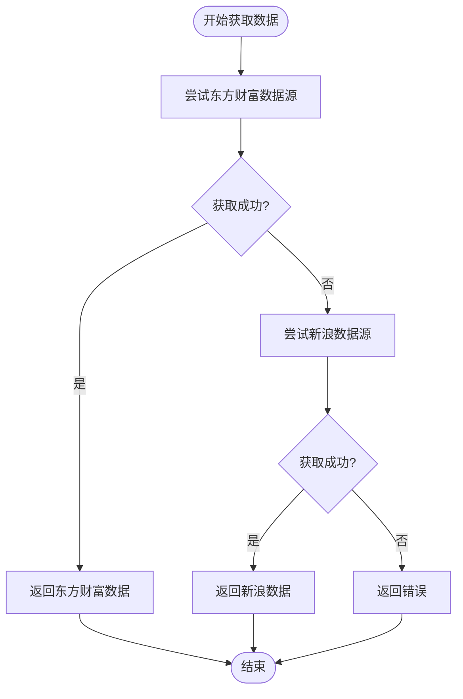
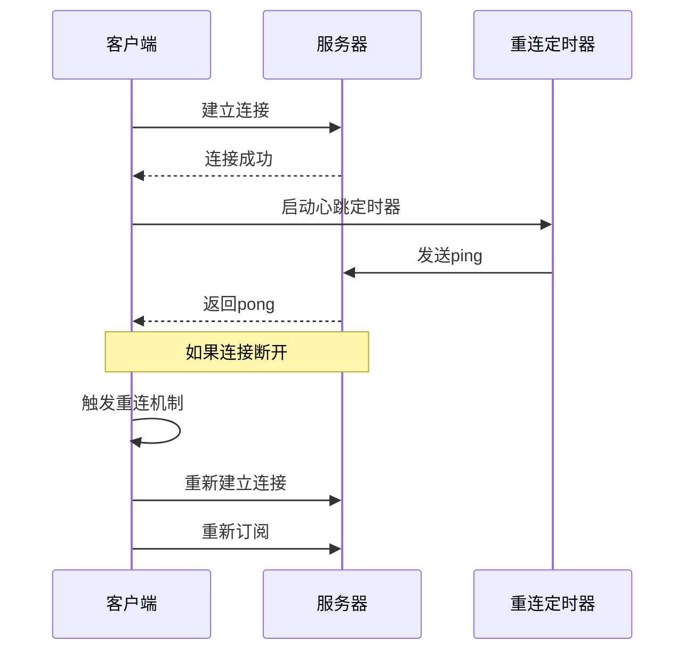

# API接口文档

<cite>
**本文档引用的文件**
- [backend/app/main.py](file://backend/app/main.py)
- [backend/app/api/v1/quote.py](file://backend/app/api/v1/quote.py)
- [backend/app/api/v1/stock.py](file://backend/app/api/v1/stock.py)
- [backend/app/api/v1/watchlist.py](file://backend/app/api/v1/watchlist.py)
- [backend/app/api/v1/ai.py](file://backend/app/api/v1/ai.py)
- [backend/app/api/websocket.py](file://backend/app/api/websocket.py)
- [backend/app/schemas/schemas.py](file://backend/app/schemas/schemas.py)
- [backend/app/models/models.py](file://backend/app/models/models.py)
- [backend/app/services/collector/manager.py](file://backend/app/services/collector/manager.py)
- [backend/app/core/config.py](file://backend/app/core/config.py)
- [backend/requirements.txt](file://backend/requirements.txt)
- [README.md](file://README.md)
</cite>

## 目录
1. [简介](#简介)
2. [项目结构](#项目结构)
3. [核心组件](#核心组件)
4. [架构概览](#架构概览)
5. [详细组件分析](#详细组件分析)
6. [依赖分析](#依赖分析)
7. [性能考虑](#性能考虑)
8. [故障排除指南](#故障排除指南)
9. [结论](#结论)

## 简介

Stock-View是一个基于Python FastAPI框架开发的A股实时行情查看与AI分析平台。该项目参考了东方财富、同花顺等主流股票软件的核心功能，提供了完整的股票行情数据服务、AI分析功能和自选股管理能力。

本项目采用现代化的技术栈：
- **后端**: Python 3.11 + FastAPI + SQLAlchemy 2.0 (async)
- **前端**: Vue 3 + TypeScript + Pinia + ECharts + Element Plus
- **数据库**: PostgreSQL 15 + Redis 7
- **部署**: Docker Compose + Nginx

## 项目结构



**图表来源**
- [backend/app/main.py:1-48](file://backend/app/main.py#L1-L48)
- [backend/app/api/v1/quote.py:1-65](file://backend/app/api/v1/quote.py#L1-L65)
- [backend/app/api/v1/stock.py:1-37](file://backend/app/api/v1/stock.py#L1-L37)
- [backend/app/api/v1/watchlist.py:1-77](file://backend/app/api/v1/watchlist.py#L1-L77)
- [backend/app/api/v1/ai.py:1-29](file://backend/app/api/v1/ai.py#L1-L29)
- [backend/app/api/websocket.py:1-79](file://backend/app/api/websocket.py#L1-L79)

**章节来源**
- [backend/app/main.py:1-48](file://backend/app/main.py#L1-L48)
- [README.md:92-126](file://README.md#L92-L126)

## 核心组件

### API路由注册机制

系统通过FastAPI的路由注册机制统一管理各个功能模块：



**图表来源**
- [backend/app/main.py:38-43](file://backend/app/main.py#L38-L43)

### 数据模型架构

系统采用Pydantic进行数据验证，定义了完整的数据传输对象：



**图表来源**
- [backend/app/schemas/schemas.py:6-68](file://backend/app/schemas/schemas.py#L6-L68)

**章节来源**
- [backend/app/schemas/schemas.py:1-103](file://backend/app/schemas/schemas.py#L1-L103)
- [backend/app/models/models.py:1-74](file://backend/app/models/models.py#L1-L74)

## 架构概览



**图表来源**
- [backend/app/main.py:22-43](file://backend/app/main.py#L22-L43)
- [backend/app/services/collector/manager.py:12-80](file://backend/app/services/collector/manager.py#L12-L80)

## 详细组件分析

### 行情数据API

#### 实时行情接口

**接口定义**
- **路径**: `/api/v1/quote/realtime`
- **方法**: GET
- **功能**: 获取指定股票的实时行情数据

**请求参数**
| 参数名 | 类型 | 必填 | 描述 | 示例 |
|--------|------|------|------|------|
| symbols | string | 是 | 股票代码，多个用逗号分隔 | "000001,600036,300059" |

**响应格式**
```json
{
  "code": 0,
  "message": "success",
  "data": {
    "items": [
      {
        "symbol": "000001",
        "name": "平安银行",
        "market": "sz",
        "price": 15.23,
        "change": 0.12,
        "change_pct": 0.79,
        "open": 15.10,
        "high": 15.30,
        "low": 14.98,
        "prev_close": 15.11,
        "volume": 12345678,
        "amount": 188888888.88,
        "turnover_rate": 0.56,
        "timestamp": "2024-01-01T10:30:00Z"
      }
    ]
  }
}
```

**错误响应示例**
```json
{
  "code": 1003,
  "message": "数据源暂不可用",
  "data": null
}
```

#### 行情列表接口

**接口定义**
- **路径**: `/api/v1/quote/list`
- **方法**: GET
- **功能**: 获取全市场的股票行情列表

**请求参数**
| 参数名 | 类型 | 必填 | 描述 | 默认值 | 示例 |
|--------|------|------|------|--------|------|
| market | string | 否 | 市场类型 | "all" | "sh,sz" |
| sort_by | string | 否 | 排序字段 | "change_pct" | "volume" |
| sort_order | string | 否 | 排序方向 | "desc" | "asc" |
| page | int | 否 | 页码 | 1 | 2 |
| page_size | int | 否 | 每页数量 | 20 | 50 |

**响应格式**
```json
{
  "code": 0,
  "message": "success",
  "data": {
    "items": [...],
    "total": 1000,
    "page": 1,
    "page_size": 20
  }
}
```

#### K线数据接口

**接口定义**
- **路径**: `/api/v1/quote/kline`
- **方法**: GET
- **功能**: 获取指定股票的K线数据

**请求参数**
| 参数名 | 类型 | 必填 | 描述 | 默认值 | 示例 |
|--------|------|------|------|--------|------|
| symbol | string | 是 | 股票代码 | - | "000001" |
| period | string | 否 | K线周期 | "d" | "5m,15m,30m,60m,w,m" |
| fq_type | string | 否 | 复权类型 | "front" | "none,front,back" |
| limit | int | 否 | 返回数量 | 120 | 200 |

**响应格式**
```json
{
  "code": 0,
  "message": "success",
  "data": {
    "symbol": "000001",
    "period": "d",
    "fq_type": "front",
    "items": [
      {
        "date": "2024-01-01",
        "open": 15.10,
        "high": 15.30,
        "low": 14.98,
        "close": 15.23,
        "volume": 12345678,
        "amount": 188888888.88,
        "change_pct": 0.79
      }
    ]
  }
}
```

#### 分时数据接口

**接口定义**
- **路径**: `/api/v1/quote/timeline`
- **方法**: GET
- **功能**: 获取指定股票的分时数据

**请求参数**
| 参数名 | 类型 | 必填 | 描述 | 示例 |
|--------|------|------|------|------|
| symbol | string | 是 | 股票代码 | "000001" |

**响应格式**
```json
{
  "code": 0,
  "message": "success",
  "data": {
    "symbol": "000001",
    "items": [
      {
        "time": "09:30",
        "price": 15.10,
        "avg": 15.05,
        "volume": 100000
      }
    ]
  }
}
```

#### 盘口数据接口

**接口定义**
- **路径**: `/api/v1/quote/orderbook`
- **方法**: GET
- **功能**: 获取指定股票的盘口数据

**请求参数**
| 参数名 | 类型 | 必填 | 描述 | 示例 |
|--------|------|------|------|------|
| symbol | string | 是 | 股票代码 | "000001" |

**响应格式**
```json
{
  "code": 0,
  "message": "success",
  "data": {
    "symbol": "000001",
    "bid_levels": [
      {
        "level": 1,
        "price": 15.22,
        "volume": 1000
      }
    ],
    "ask_levels": [
      {
        "level": 1,
        "price": 15.23,
        "volume": 1500
      }
    ]
  }
}
```

**章节来源**
- [backend/app/api/v1/quote.py:7-65](file://backend/app/api/v1/quote.py#L7-L65)
- [backend/app/schemas/schemas.py:13-67](file://backend/app/schemas/schemas.py#L13-L67)

### 股票基础API

#### 股票搜索接口

**接口定义**
- **路径**: `/api/v1/stock/search`
- **方法**: GET
- **功能**: 搜索股票（支持代码和拼音首字母）

**请求参数**
| 参数名 | 类型 | 必填 | 描述 | 默认值 | 示例 |
|--------|------|------|------|--------|------|
| keyword | string | 是 | 搜索关键词 | - | "平安银行" |
| limit | int | 否 | 返回数量限制 | 10 | 20 |

**响应格式**
```json
{
  "code": 0,
  "message": "success",
  "data": {
    "items": [
      {
        "symbol": "000001",
        "name": "平安银行",
        "market": "sz",
        "pinyin": "payh"
      }
    ]
  }
}
```

**章节来源**
- [backend/app/api/v1/stock.py:10-37](file://backend/app/api/v1/stock.py#L10-L37)
- [backend/app/schemas/schemas.py:71-76](file://backend/app/schemas/schemas.py#L71-L76)

### 自选股管理API

#### 获取自选股列表

**接口定义**
- **路径**: `/api/v1/watchlist`
- **方法**: GET
- **功能**: 获取当前用户的自选股列表

**响应格式**
```json
{
  "code": 0,
  "message": "success",
  "data": {
    "items": [
      {
        "symbol": "000001",
        "name": "",
        "market": "sz",
        "sort_order": 1
      }
    ]
  }
}
```

#### 添加自选股

**接口定义**
- **路径**: `/api/v1/watchlist`
- **方法**: POST
- **功能**: 添加自选股到用户列表

**请求体格式**
```json
{
  "symbol": "000001",
  "market": "sz"
}
```

**响应格式**
```json
{
  "code": 0,
  "message": "success",
  "data": null
}
```

#### 删除自选股

**接口定义**
- **路径**: `/api/v1/watchlist/{symbol}`
- **方法**: DELETE
- **功能**: 从用户自选股列表中删除指定股票

**路径参数**
| 参数名 | 类型 | 必填 | 描述 |
|--------|------|------|------|
| symbol | string | 是 | 股票代码 |

**响应格式**
```json
{
  "code": 0,
  "message": "success",
  "data": null
}
```

#### 调整自选股排序

**接口定义**
- **路径**: `/api/v1/watchlist/sort`
- **方法**: PUT
- **功能**: 批量调整自选股的排序顺序

**请求体格式**
```json
{
  "items": [
    {
      "symbol": "000001",
      "sort_order": 2
    },
    {
      "symbol": "600036",
      "sort_order": 1
    }
  ]
}
```

**响应格式**
```json
{
  "code": 0,
  "message": "success",
  "data": null
}
```

**章节来源**
- [backend/app/api/v1/watchlist.py:13-77](file://backend/app/api/v1/watchlist.py#L13-L77)
- [backend/app/schemas/schemas.py:79-91](file://backend/app/schemas/schemas.py#L79-L91)
- [backend/app/models/models.py:50-60](file://backend/app/models/models.py#L50-L60)

### AI分析API

#### AI分析请求

**接口定义**
- **路径**: `/api/v1/ai/analyze`
- **方法**: POST
- **功能**: 请求AI对指定股票进行分析

**请求参数**
| 参数名 | 类型 | 必填 | 描述 | 默认值 |
|--------|------|------|------|--------|
| symbol | string | 是 | 股票代码 | - |
| analysis_type | string | 否 | 分析类型 | "comprehensive" | "technical,fundamental,risk" |
| period_days | int | 否 | 分析周期天数 | 30 | 60,90 |

**响应格式**
```json
{
  "code": 0,
  "message": "success",
  "data": {
    "symbol": "000001",
    "analysis_type": "comprehensive",
    "period_days": 30,
    "trend": "bullish",
    "confidence": 0.85,
    "recommendation": "hold",
    "indicators": {
      "ma": [15.0, 15.2, 15.1],
      "rsi": [62.3, 61.8, 60.5],
      "macd": [0.12, 0.10, 0.08]
    }
  }
}
```

#### AI模型信息

**接口定义**
- **路径**: `/api/v1/ai/model-info`
- **方法**: GET
- **功能**: 获取AI模型的详细信息

**响应格式**
```json
{
  "code": 0,
  "message": "success",
  "data": {
    "model_name": "stock-analyzer-v1",
    "version": "1.0.0",
    "supported_indicators": ["MA", "RSI", "MACD", "BOLL"],
    "max_period_days": 365,
    "accuracy": 0.85
  }
}
```

**章节来源**
- [backend/app/api/v1/ai.py:10-29](file://backend/app/api/v1/ai.py#L10-L29)
- [backend/app/schemas/schemas.py:94-103](file://backend/app/schemas/schemas.py#L94-L103)

### WebSocket实时推送API

#### 连接建立

**WebSocket路径**: `ws://localhost:8000/api/v1/ws/quote`

#### 订阅消息格式

**订阅请求**
```json
{
  "action": "subscribe",
  "symbols": ["000001", "600036"],
  "channels": ["quote"]
}
```

**取消订阅请求**
```json
{
  "action": "unsubscribe",
  "symbols": ["000001"]
}
```

#### 心跳检测

**客户端发送**
```json
{
  "action": "ping"
}
```

**服务器响应**
```json
{
  "action": "pong",
  "timestamp": "2024-01-01T10:30:00Z"
}
```

#### 行情推送格式

**推送消息**
```json
{
  "type": "quote",
  "symbol": "000001",
  "data": {
    "symbol": "000001",
    "name": "平安银行",
    "market": "sz",
    "price": 15.23,
    "change": 0.12,
    "change_pct": 0.79,
    "timestamp": "2024-01-01T10:30:00Z"
  }
}
```

#### 连接管理



**图表来源**
- [backend/app/api/websocket.py:39-79](file://backend/app/api/websocket.py#L39-L79)

**章节来源**
- [backend/app/api/websocket.py:12-79](file://backend/app/api/websocket.py#L12-L79)

## 依赖分析

### 外部依赖关系



**图表来源**
- [backend/requirements.txt:1-17](file://backend/requirements.txt#L1-L17)

### 内部模块依赖



**图表来源**
- [backend/app/main.py:7-8](file://backend/app/main.py#L7-L8)
- [backend/app/api/v1/quote.py:1-2](file://backend/app/api/v1/quote.py#L1-L2)
- [backend/app/api/v1/stock.py:1-2](file://backend/app/api/v1/stock.py#L1-L2)
- [backend/app/api/v1/watchlist.py:1-6](file://backend/app/api/v1/watchlist.py#L1-L6)
- [backend/app/api/v1/ai.py:1-3](file://backend/app/api/v1/ai.py#L1-L3)

**章节来源**
- [backend/requirements.txt:1-17](file://backend/requirements.txt#L1-L17)
- [backend/app/main.py:7-8](file://backend/app/main.py#L7-L8)

## 性能考虑

### 数据缓存策略

系统采用了多层缓存机制来提升性能：

1. **Redis缓存**: 存储热点数据和临时结果
2. **数据库缓存**: 使用SQLAlchemy的异步特性
3. **API响应缓存**: 对频繁访问的数据进行缓存

### 数据源故障转移



**图表来源**
- [backend/app/services/collector/manager.py:21-32](file://backend/app/services/collector/manager.py#L21-L32)

### 并发处理

- **异步数据库操作**: 使用SQLAlchemy 2.0的异步特性
- **并发数据采集**: 支持多个数据源同时工作
- **WebSocket连接池**: 管理大量并发连接

## 故障排除指南

### 常见错误码

| 错误码 | 描述 | 可能原因 | 解决方案 |
|--------|------|----------|----------|
| 0 | 成功 | 正常响应 | 无需处理 |
| 1001 | 已在自选股中 | 重复添加 | 检查是否已存在 |
| 1002 | 股票代码不存在或数据源暂不可用 | 数据源问题 | 检查股票代码和网络连接 |
| 1003 | 数据源暂不可用 | 数据源故障 | 稍后重试或检查备用数据源 |

### WebSocket连接问题

**连接失败排查**
1. 检查WebSocket服务器是否正常运行
2. 验证URL路径是否正确
3. 确认CORS配置允许跨域连接

**断线重连策略**


**图表来源**
- [backend/app/api/websocket.py:40-65](file://backend/app/api/websocket.py#L40-L65)

### API调用示例

**健康检查**
```bash
curl http://localhost:8000/api/v1/health
```

**获取实时行情**
```bash
curl "http://localhost:8000/api/v1/quote/realtime?symbols=000001,600036"
```

**获取K线数据**
```bash
curl "http://localhost:0000/api/v1/quote/kline?symbol=000001&period=d&limit=60"
```

**添加自选股**
```bash
curl -X POST "http://localhost:8000/api/v1/watchlist" \
  -H "Content-Type: application/json" \
  -d '{"symbol":"000001","market":"sz"}'
```

**章节来源**
- [backend/app/main.py:46-48](file://backend/app/main.py#L46-L48)
- [backend/app/api/v1/quote.py:8-16](file://backend/app/api/v1/quote.py#L8-L16)
- [backend/app/api/v1/watchlist.py:29-51](file://backend/app/api/v1/watchlist.py#L29-L51)

## 结论

Stock-View项目提供了一个完整且功能丰富的A股行情数据服务平台。通过清晰的API设计、完善的错误处理机制和高效的性能优化策略，该系统能够满足现代股票分析应用的各种需求。

主要特点包括：
- **完整的行情数据服务**: 支持实时报价、K线、分时、盘口等多种数据类型
- **灵活的自选股管理**: 提供完整的增删改查和排序功能
- **可扩展的AI分析**: 插件化的AI分析架构，便于后续扩展
- **高性能的实时推送**: 基于WebSocket的实时数据推送
- **健壮的错误处理**: 完善的错误码体系和故障转移机制

该API文档为开发者提供了详细的接口规范和技术实现指导，有助于快速集成和扩展系统功能。