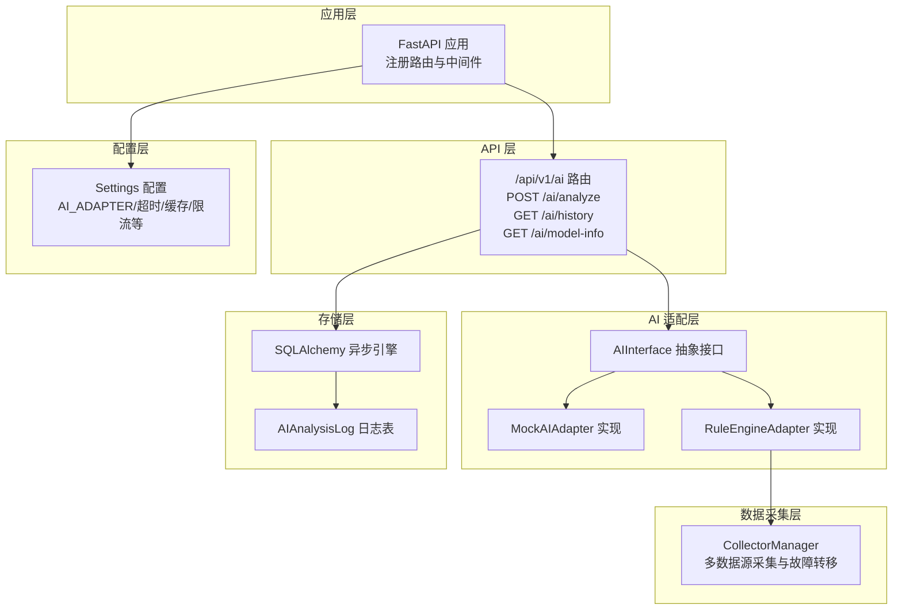
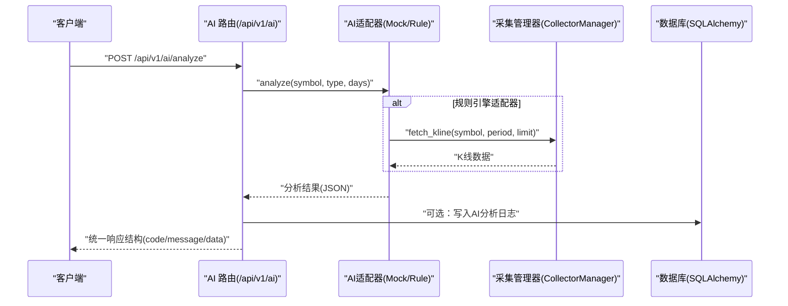
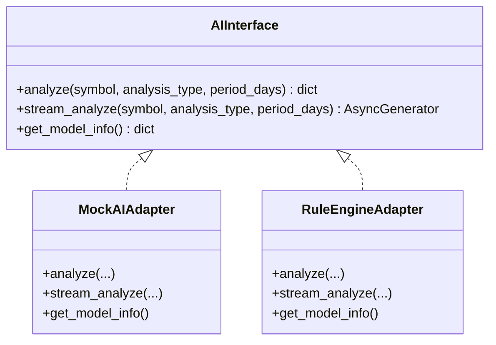
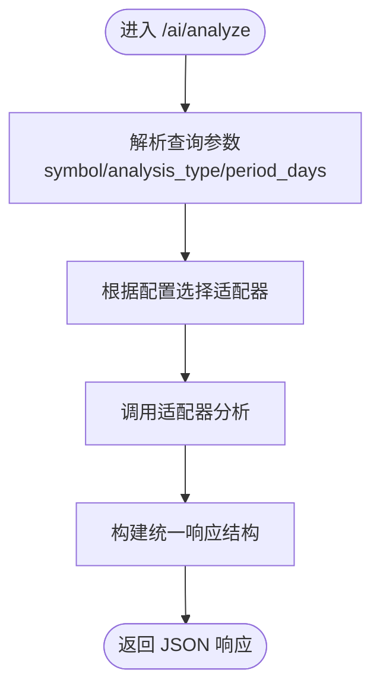
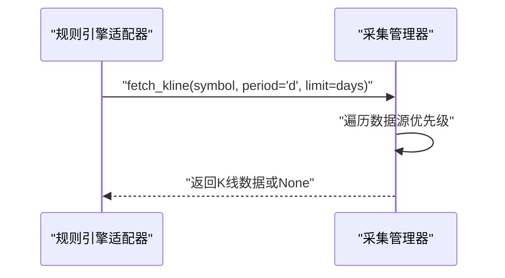
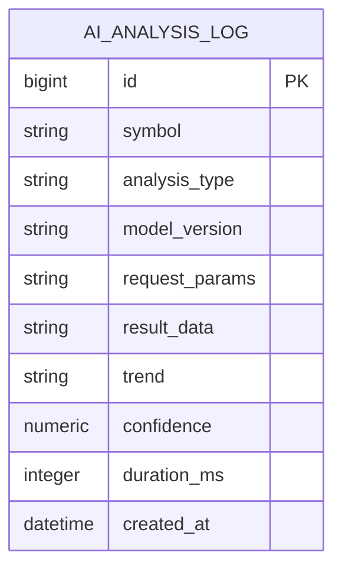
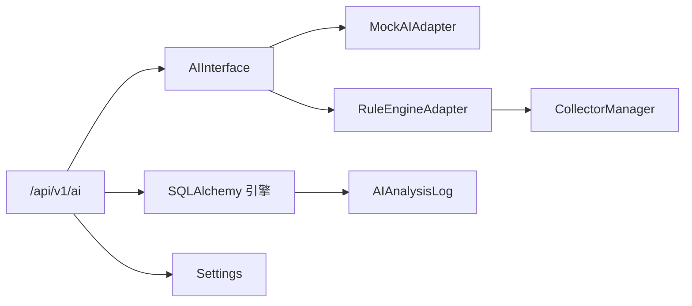

# AI分析API

<cite>
**本文引用的文件**
- [backend/app/ai/interface.py](file://backend/app/ai/interface.py)
- [backend/app/api/v1/ai.py](file://backend/app/api/v1/ai.py)
- [backend/app/schemas/schemas.py](file://backend/app/schemas/schemas.py)
- [backend/app/models/models.py](file://backend/app/models/models.py)
- [backend/app/services/collector/manager.py](file://backend/app/services/collector/manager.py)
- [backend/app/core/config.py](file://backend/app/core/config.py)
- [backend/app/main.py](file://backend/app/main.py)
- [backend/requirements.txt](file://backend/requirements.txt)
</cite>

## 目录
1. [简介](#简介)
2. [项目结构](#项目结构)
3. [核心组件](#核心组件)
4. [架构总览](#架构总览)
5. [详细组件分析](#详细组件分析)
6. [依赖关系分析](#依赖关系分析)
7. [性能考虑](#性能考虑)
8. [故障排查指南](#故障排查指南)
9. [结论](#结论)
10. [附录：接口调用示例与最佳实践](#附录接口调用示例与最佳实践)

## 简介
本文件面向Stock-View项目的AI分析API，系统化梳理已实现与预留的功能点，覆盖接口规范、请求格式、参数校验、响应结构、触发方式、分析类型、参数配置、执行状态查询、历史查询、模型信息获取、集成方式、错误处理与重试机制、插件化扩展点以及性能与成本控制建议。文档严格基于仓库现有代码进行分析与总结。

## 项目结构
AI分析API位于后端FastAPI应用中，采用模块化组织：
- 接口层：API路由定义于v1模块，负责HTTP请求接入与响应封装。
- 适配层：AI适配器抽象与具体实现（Mock与规则引擎），统一对外分析接口。
- 数据采集层：行情与K线数据采集管理器，为分析提供数据支撑。
- 模型与日志：数据库模型中包含AI分析日志表，用于历史与审计。
- 配置与启动：全局配置集中管理，应用启动时注册路由并初始化数据库。

图表来源
- [backend/app/main.py:38-43](file://backend/app/main.py#L38-L43)
- [backend/app/api/v1/ai.py:1-29](file://backend/app/api/v1/ai.py#L1-L29)
- [backend/app/ai/interface.py:26-39](file://backend/app/ai/interface.py#L26-L39)
- [backend/app/services/collector/manager.py:12-80](file://backend/app/services/collector/manager.py#L12-L80)
- [backend/app/models/models.py:62-74](file://backend/app/models/models.py#L62-L74)
- [backend/app/core/config.py:5-25](file://backend/app/core/config.py#L5-L25)

章节来源
- [backend/app/main.py:1-48](file://backend/app/main.py#L1-L48)
- [backend/app/api/v1/ai.py:1-29](file://backend/app/api/v1/ai.py#L1-L29)

## 核心组件
- AI接口抽象与适配器
  - 抽象接口定义了同步与异步分析、流式分析与模型信息获取方法，便于替换不同实现。
  - 提供Mock与规则引擎两种适配器，满足演示与基础规则分析需求。
- AI分析路由
  - 提供“立即分析”“历史查询（预留）”“模型信息”三类接口。
- 数据采集与K线获取
  - 通过采集管理器实现多数据源优先级与故障转移，保障K线数据可用性。
- 数据模型与日志
  - 定义AI分析日志表，记录请求参数、结果、趋势、置信度、耗时等，便于审计与统计。
- 配置中心
  - 统一管理AI适配器名称、服务地址、超时、缓存、限流等参数。

章节来源
- [backend/app/ai/interface.py:26-39](file://backend/app/ai/interface.py#L26-L39)
- [backend/app/ai/interface.py:42-108](file://backend/app/ai/interface.py#L42-L108)
- [backend/app/ai/interface.py:111-187](file://backend/app/ai/interface.py#L111-L187)
- [backend/app/api/v1/ai.py:10-29](file://backend/app/api/v1/ai.py#L10-L29)
- [backend/app/services/collector/manager.py:12-80](file://backend/app/services/collector/manager.py#L12-L80)
- [backend/app/models/models.py:62-74](file://backend/app/models/models.py#L62-L74)
- [backend/app/core/config.py:5-25](file://backend/app/core/config.py#L5-L25)

## 架构总览
AI分析API采用“路由-适配器-采集-存储”的分层架构：
- 路由层接收HTTP请求，解析参数并调用适配器。
- 适配器层负责具体分析逻辑；规则引擎适配器会调用采集管理器获取K线数据。
- 存储层通过SQLAlchemy异步引擎访问数据库，AI日志表用于持久化分析结果。
- 配置层集中管理AI相关参数，影响适配器选择、超时、缓存与限流。

图表来源
- [backend/app/api/v1/ai.py:10-15](file://backend/app/api/v1/ai.py#L10-L15)
- [backend/app/ai/interface.py:114-170](file://backend/app/ai/interface.py#L114-L170)
- [backend/app/services/collector/manager.py:45-54](file://backend/app/services/collector/manager.py#L45-L54)
- [backend/app/models/models.py:62-74](file://backend/app/models/models.py#L62-L74)

## 详细组件分析

### AI接口抽象与适配器
- 抽象接口
  - analyze：同步/异步分析，返回标准化结果字典。
  - stream_analyze：流式进度与最终结果。
  - get_model_info：返回模型元信息（名称、版本、支持类型、状态）。
- Mock适配器
  - 返回随机趋势与置信度，包含技术指标、支撑阻力、预测目标与止损等结构化字段。
  - 支持流式分析，按阶段返回进度消息。
- 规则引擎适配器
  - 基于K线数据计算得分，结合均线与量价规则判断趋势，输出简洁分析结果。
  - 支持流式分析，包含数据采集与指标计算阶段提示。
- 适配器工厂
  - create_ai_adapter根据配置选择具体适配器实例。

图表来源
- [backend/app/ai/interface.py:26-39](file://backend/app/ai/interface.py#L26-L39)
- [backend/app/ai/interface.py:42-108](file://backend/app/ai/interface.py#L42-L108)
- [backend/app/ai/interface.py:111-187](file://backend/app/ai/interface.py#L111-L187)

章节来源
- [backend/app/ai/interface.py:26-39](file://backend/app/ai/interface.py#L26-L39)
- [backend/app/ai/interface.py:42-108](file://backend/app/ai/interface.py#L42-L108)
- [backend/app/ai/interface.py:111-187](file://backend/app/ai/interface.py#L111-L187)
- [backend/app/ai/interface.py:190-196](file://backend/app/ai/interface.py#L190-L196)

### AI分析路由与响应规范
- 统一响应结构
  - 字段：code、message、data。
  - 成功code通常为0，错误时返回非0及错误信息。
- 分析接口
  - POST /api/v1/ai/analyze
  - 查询参数：symbol（必填）、analysis_type（默认comprehensive）、period_days（默认30）。
  - 返回：统一响应结构，data为适配器分析结果。
- 历史查询接口（预留）
  - GET /api/v1/ai/history
  - 查询参数：symbol（可选）、page、page_size。
  - 返回：预留结构，当前为空数组与总数。
- 模型信息接口
  - GET /api/v1/ai/model-info
  - 返回：适配器模型信息（名称、版本、描述、支持类型、状态）。

图表来源
- [backend/app/api/v1/ai.py:10-15](file://backend/app/api/v1/ai.py#L10-L15)
- [backend/app/api/v1/ai.py:18-21](file://backend/app/api/v1/ai.py#L18-L21)
- [backend/app/api/v1/ai.py:24-29](file://backend/app/api/v1/ai.py#L24-L29)

章节来源
- [backend/app/api/v1/ai.py:1-29](file://backend/app/api/v1/ai.py#L1-L29)
- [backend/app/schemas/schemas.py:6-10](file://backend/app/schemas/schemas.py#L6-L10)
- [backend/app/schemas/schemas.py:93-103](file://backend/app/schemas/schemas.py#L93-L103)

### 数据采集与K线获取
- 采集管理器
  - 多数据源优先级：eastmoney优先，sina作为回退。
  - 提供行情、K线、分时、盘口等数据获取方法，并内置异常捕获与日志告警。
- 规则引擎适配器对K线数据的依赖
  - 通过采集管理器获取指定交易日数的K线数据，用于规则计算。

图表来源
- [backend/app/ai/interface.py:114-116](file://backend/app/ai/interface.py#L114-L116)
- [backend/app/services/collector/manager.py:45-54](file://backend/app/services/collector/manager.py#L45-L54)

章节来源
- [backend/app/services/collector/manager.py:12-80](file://backend/app/services/collector/manager.py#L12-L80)
- [backend/app/ai/interface.py:114-116](file://backend/app/ai/interface.py#L114-L116)

### AI分析日志模型与历史查询
- 日志模型
  - 记录分析对象、类型、模型版本、请求参数、结果数据、趋势、置信度、耗时与时间戳。
- 历史查询（预留）
  - 当前返回空列表与总数，未实现分页与筛选逻辑；建议后续对接数据库查询并增加索引优化。

图表来源
- [backend/app/models/models.py:62-74](file://backend/app/models/models.py#L62-L74)

章节来源
- [backend/app/models/models.py:62-74](file://backend/app/models/models.py#L62-L74)
- [backend/app/api/v1/ai.py:18-21](file://backend/app/api/v1/ai.py#L18-L21)

### 配置与启动
- 配置项
  - AI_ADAPTER：选择适配器（mock/rule）。
  - AI_SERVICE_URL：外部AI服务地址（预留）。
  - AI_REQUEST_TIMEOUT：请求超时秒数。
  - AI_CACHE_ENABLED/AI_CACHE_TTL：缓存开关与TTL。
  - AI_RATE_LIMIT：速率限制。
- 应用启动
  - 注册AI路由到/api/v1前缀，加载CORS中间件，初始化数据库。

章节来源
- [backend/app/core/config.py:5-25](file://backend/app/core/config.py#L5-L25)
- [backend/app/main.py:38-43](file://backend/app/main.py#L38-L43)

## 依赖关系分析
- 组件耦合
  - 路由层仅依赖适配器抽象，耦合度低，便于替换实现。
  - 规则引擎适配器依赖采集管理器，形成数据依赖链。
  - 日志模型与路由层无直接耦合，可通过服务层解耦写入。
- 外部依赖
  - FastAPI、SQLAlchemy异步、Celery、Redis、httpx等。
- 潜在循环依赖
  - 未发现直接循环导入；适配器与采集器通过函数调用解耦。

图表来源
- [backend/app/api/v1/ai.py:1-29](file://backend/app/api/v1/ai.py#L1-L29)
- [backend/app/ai/interface.py:26-39](file://backend/app/ai/interface.py#L26-L39)
- [backend/app/services/collector/manager.py:12-80](file://backend/app/services/collector/manager.py#L12-L80)
- [backend/app/models/models.py:62-74](file://backend/app/models/models.py#L62-L74)
- [backend/app/core/config.py:5-25](file://backend/app/core/config.py#L5-L25)

章节来源
- [backend/requirements.txt:1-17](file://backend/requirements.txt#L1-L17)
- [backend/app/api/v1/ai.py:1-29](file://backend/app/api/v1/ai.py#L1-L29)
- [backend/app/ai/interface.py:26-39](file://backend/app/ai/interface.py#L26-L39)
- [backend/app/services/collector/manager.py:12-80](file://backend/app/services/collector/manager.py#L12-L80)
- [backend/app/models/models.py:62-74](file://backend/app/models/models.py#L62-L74)
- [backend/app/core/config.py:5-25](file://backend/app/core/config.py#L5-L25)

## 性能考虑
- 并发与异步
  - 适配器分析与流式分析均采用异步实现，有利于提升并发吞吐。
- 缓存策略
  - 配置中提供缓存开关与TTL，建议对热点分析结果进行缓存，降低重复计算与外部依赖压力。
- 限流与超时
  - 配置中提供速率限制与请求超时参数，建议结合业务场景调整阈值，避免雪崩效应。
- 数据库与索引
  - AI分析日志表建议针对symbol、analysis_type、created_at建立索引，优化历史查询性能。
- 采集与网络
  - 采集管理器具备故障转移能力，建议在网络抖动或上游不稳定时启用回退数据源。

## 故障排查指南
- 常见问题定位
  - 适配器未正确选择：检查AI_ADAPTER配置是否有效。
  - K线数据为空：确认采集管理器是否能从首选数据源获取数据，关注日志告警。
  - 历史查询为空：当前实现为预留接口，尚未对接数据库查询。
- 错误处理与重试
  - 采集管理器对各数据源调用进行异常捕获与日志记录，建议在上层调用处增加指数退避重试。
- 监控与可观测性
  - 建议在适配器分析前后埋点，记录耗时、成功率与错误码，结合日志与指标进行分析。

章节来源
- [backend/app/services/collector/manager.py:21-32](file://backend/app/services/collector/manager.py#L21-L32)
- [backend/app/api/v1/ai.py:18-21](file://backend/app/api/v1/ai.py#L18-L21)
- [backend/app/core/config.py:19-25](file://backend/app/core/config.py#L19-L25)

## 结论
AI分析API在现有代码中提供了清晰的抽象与两条实现路径（Mock与规则引擎），并通过统一的路由与响应结构对外暴露。历史查询与部分高级特性仍为预留状态，建议后续完善日志持久化、分页与筛选、流式分析的客户端消费、以及更丰富的分析类型与模型版本管理。整体架构具备良好的扩展性与可维护性。

## 附录：接口调用示例与最佳实践

### 接口清单与调用要点
- 请求统一响应结构
  - 字段：code、message、data。
  - 成功时code为0，错误时返回非0及错误信息。
- POST /api/v1/ai/analyze
  - 参数：symbol（必填）、analysis_type（默认comprehensive）、period_days（默认30）。
  - 返回：统一响应结构，data为适配器分析结果。
- GET /api/v1/ai/history
  - 参数：symbol（可选）、page、page_size。
  - 返回：预留结构，当前为空数组与总数。
- GET /api/v1/ai/model-info
  - 返回：适配器模型信息（名称、版本、描述、支持类型、状态）。

章节来源
- [backend/app/api/v1/ai.py:10-29](file://backend/app/api/v1/ai.py#L10-L29)
- [backend/app/schemas/schemas.py:6-10](file://backend/app/schemas/schemas.py#L6-L10)
- [backend/app/schemas/schemas.py:93-103](file://backend/app/schemas/schemas.py#L93-L103)

### 参数验证与约束
- 路由层参数
  - 使用FastAPI Query进行参数注入与基本约束（如默认值）。
- Pydantic模型（建议）
  - 可新增AIAnalysisRequest模型用于请求体校验，包含symbol、analysis_type、period_days、include_kline、custom_params等字段，以增强一致性与文档化。

章节来源
- [backend/app/api/v1/ai.py:10-15](file://backend/app/api/v1/ai.py#L10-L15)
- [backend/app/schemas/schemas.py:93-103](file://backend/app/schemas/schemas.py#L93-L103)

### 执行状态查询（流式分析）
- 流式分析流程
  - 适配器stream_analyze按阶段返回进度消息（如collecting_data、computing_indicators、model_inference），最后返回result类型的结果。
- 客户端建议
  - 建议前端轮询或WebSocket订阅流式事件，展示实时进度与最终结果。

章节来源
- [backend/app/ai/interface.py:89-99](file://backend/app/ai/interface.py#L89-L99)
- [backend/app/ai/interface.py:172-178](file://backend/app/ai/interface.py#L172-L178)

### 历史查询接口（预留）
- 数据结构
  - items：历史记录列表（当前为空）。
  - total：总数（当前为0）。
  - page、page_size：分页参数。
- 建议
  - 后续对接数据库查询，增加索引与分页逻辑，支持按symbol、analysis_type、时间范围筛选。

章节来源
- [backend/app/api/v1/ai.py:18-21](file://backend/app/api/v1/ai.py#L18-L21)
- [backend/app/models/models.py:62-74](file://backend/app/models/models.py#L62-L74)

### 模型信息获取接口
- 返回字段
  - name、version、description、supported_types、status。
- 版本管理
  - 建议在适配器中维护版本号，便于灰度与回滚。
- 性能与可用性
  - 可扩展返回更多指标（如延迟、命中率、错误率）以辅助运维决策。

章节来源
- [backend/app/ai/interface.py:101-108](file://backend/app/ai/interface.py#L101-L108)
- [backend/app/ai/interface.py:180-187](file://backend/app/ai/interface.py#L180-L187)
- [backend/app/api/v1/ai.py:24-29](file://backend/app/api/v1/ai.py#L24-L29)

### 集成方式与错误处理
- 集成步骤
  - 在客户端发起HTTP请求至/api/v1/ai/analyze，解析统一响应结构。
  - 如需流式进度，订阅流式事件直至收到result类型数据。
- 错误处理
  - 对非0 code与异常进行捕获与提示；对网络超时与上游不可用进行重试与降级。
- 重试机制
  - 建议采用指数退避与上限次数控制，避免放大下游压力。

章节来源
- [backend/app/api/v1/ai.py:10-15](file://backend/app/api/v1/ai.py#L10-L15)
- [backend/app/services/collector/manager.py:21-32](file://backend/app/services/collector/manager.py#L21-L32)
- [backend/app/core/config.py:19-25](file://backend/app/core/config.py#L19-L25)

### 插件化扩展与自定义分析
- 扩展点
  - 新增AI适配器：实现AIInterface接口，提供analyze、stream_analyze、get_model_info。
  - 工厂函数create_ai_adapter：注册新适配器并支持通过配置切换。
- 自定义分析开发建议
  - 明确分析类型枚举与输入参数，确保与前端一致。
  - 提供流式分析能力，改善用户体验。
  - 记录关键指标（耗时、成功率、错误码）以便监控。

章节来源
- [backend/app/ai/interface.py:26-39](file://backend/app/ai/interface.py#L26-L39)
- [backend/app/ai/interface.py:190-196](file://backend/app/ai/interface.py#L190-L196)

### 性能监控、资源管理与成本控制
- 监控建议
  - 记录分析耗时、成功率、错误码、缓存命中率与上游调用耗时。
  - 对关键路径（采集、推理、写库）埋点并可视化。
- 资源管理
  - 合理设置AI_REQUEST_TIMEOUT与AI_RATE_LIMIT，避免资源争抢。
  - 利用缓存（AI_CACHE_ENABLED/AI_CACHE_TTL）减少重复计算与外部依赖。
- 成本控制
  - 对热点分析结果进行缓存与预热，降低外部服务调用频次。
  - 通过分页与索引优化历史查询，避免全表扫描。

章节来源
- [backend/app/core/config.py:19-25](file://backend/app/core/config.py#L19-L25)
- [backend/app/models/models.py:62-74](file://backend/app/models/models.py#L62-L74)