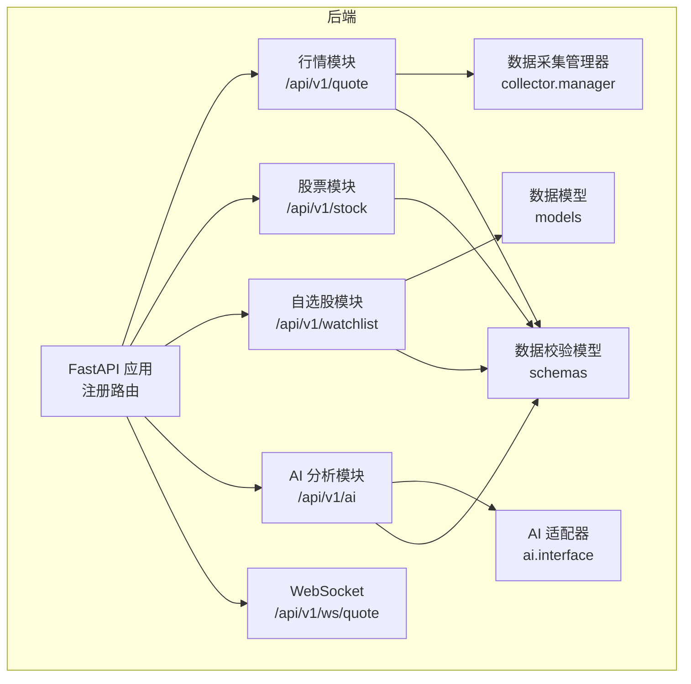
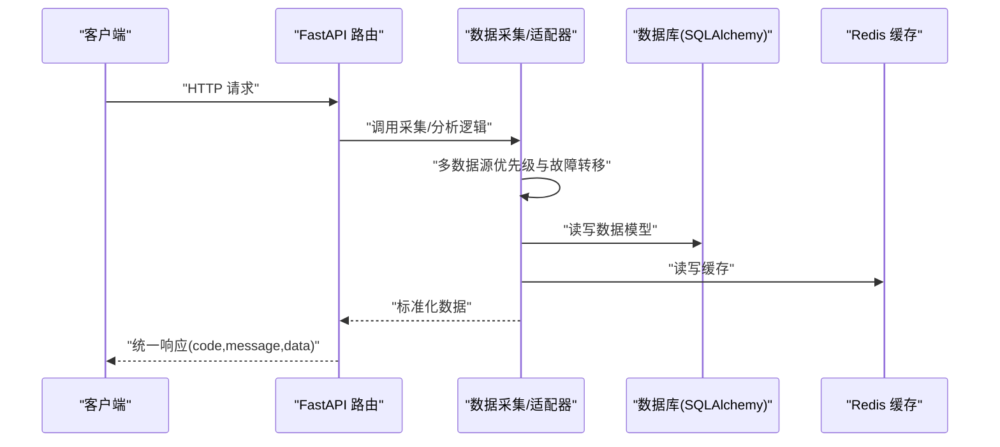
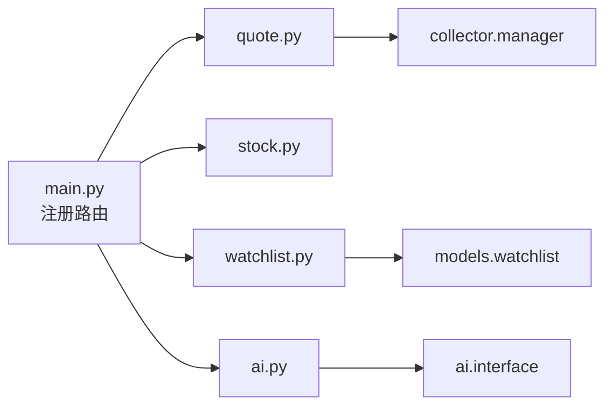

# RESTful API接口

<cite>
**本文引用的文件**
- [backend/app/main.py](file://backend/app/main.py)
- [backend/app/api/v1/quote.py](file://backend/app/api/v1/quote.py)
- [backend/app/api/v1/stock.py](file://backend/app/api/v1/stock.py)
- [backend/app/api/v1/watchlist.py](file://backend/app/api/v1/watchlist.py)
- [backend/app/api/v1/ai.py](file://backend/app/api/v1/ai.py)
- [backend/app/api/websocket.py](file://backend/app/api/websocket.py)
- [backend/app/schemas/schemas.py](file://backend/app/schemas/schemas.py)
- [backend/app/models/models.py](file://backend/app/models/models.py)
- [backend/app/services/collector/manager.py](file://backend/app/services/collector/manager.py)
- [backend/app/ai/interface.py](file://backend/app/ai/interface.py)
- [backend/app/core/config.py](file://backend/app/core/config.py)
- [README.md](file://README.md)
</cite>

## 目录
1. [简介](#简介)
2. [项目结构](#项目结构)
3. [核心组件](#核心组件)
4. [架构总览](#架构总览)
5. [详细组件分析](#详细组件分析)
6. [依赖关系分析](#依赖关系分析)
7. [性能考量](#性能考量)
8. [故障排查指南](#故障排查指南)
9. [结论](#结论)
10. [附录](#附录)

## 简介
本文件为 Stock-View 项目的 RESTful API 接口文档，覆盖以下模块：
- 行情数据：实时报价、K线、分时、盘口
- 股票基础：股票搜索
- 自选股管理：增删改查、排序
- AI 分析：分析请求、历史预留、模型信息
- WebSocket：实时行情推送
- 统一响应格式与数据模型

接口统一通过 /api/v1 前缀暴露，并在后端入口中注册。

**章节来源**
- [backend/app/main.py:39-43](file://backend/app/main.py#L39-L43)
- [README.md:37-41](file://README.md#L37-L41)

## 项目结构
后端采用 FastAPI + SQLAlchemy 异步 ORM，API 按版本与功能分层组织：
- 路由层：/api/v1 下按模块划分（quote、stock、watchlist、ai）
- 业务层：数据采集器与适配器（collector、ai）
- 数据模型：SQLAlchemy 异步模型（models）
- 数据校验：Pydantic 模型（schemas）

**图表来源**
- [backend/app/main.py:39-43](file://backend/app/main.py#L39-L43)
- [backend/app/api/v1/quote.py:4](file://backend/app/api/v1/quote.py#L4)
- [backend/app/api/v1/stock.py:4](file://backend/app/api/v1/stock.py#L4)
- [backend/app/api/v1/watchlist.py:8](file://backend/app/api/v1/watchlist.py#L8)
- [backend/app/api/v1/ai.py:5](file://backend/app/api/v1/ai.py#L5)
- [backend/app/api/websocket.py:9](file://backend/app/api/websocket.py#L9)
- [backend/app/services/collector/manager.py:12](file://backend/app/services/collector/manager.py#L12)
- [backend/app/ai/interface.py:26](file://backend/app/ai/interface.py#L26)
- [backend/app/models/models.py:5](file://backend/app/models/models.py#L5)
- [backend/app/schemas/schemas.py:7](file://backend/app/schemas/schemas.py#L7)

**章节来源**
- [backend/app/main.py:13-27](file://backend/app/main.py#L13-L27)
- [backend/app/main.py:39-43](file://backend/app/main.py#L39-L43)

## 核心组件
- 统一响应格式：所有接口返回包含 code、message 字段的标准结构；成功时 code 为 0，失败时返回业务错误码。
- 数据模型：QuoteItem、KlineItem、TimelinePoint、OrderBookLevel 等用于定义行情与分析数据结构。
- 数据采集：CollectorManager 提供多数据源优先级与故障转移策略。
- AI 适配器：支持 mock 与规则引擎两种适配器，可扩展为真实 AI 服务。

**章节来源**
- [backend/app/schemas/schemas.py:7](file://backend/app/schemas/schemas.py#L7-L10)
- [backend/app/schemas/schemas.py:13](file://backend/app/schemas/schemas.py#L13-L28)
- [backend/app/schemas/schemas.py:34](file://backend/app/schemas/schemas.py#L34-L47)
- [backend/app/schemas/schemas.py:49](file://backend/app/schemas/schemas.py#L49-L57)
- [backend/app/schemas/schemas.py:60](file://backend/app/schemas/schemas.py#L60-L67)
- [backend/app/services/collector/manager.py:12](file://backend/app/services/collector/manager.py#L12-L80)
- [backend/app/ai/interface.py:26](file://backend/app/ai/interface.py#L26-L39)

## 架构总览
下图展示 API 调用链路与关键组件交互。

**图表来源**
- [backend/app/api/v1/quote.py:7-65](file://backend/app/api/v1/quote.py#L7-L65)
- [backend/app/api/v1/stock.py:10-37](file://backend/app/api/v1/stock.py#L10-L37)
- [backend/app/api/v1/watchlist.py:13-77](file://backend/app/api/v1/watchlist.py#L13-L77)
- [backend/app/api/v1/ai.py:10-29](file://backend/app/api/v1/ai.py#L10-L29)
- [backend/app/services/collector/manager.py:21-76](file://backend/app/services/collector/manager.py#L21-L76)
- [backend/app/models/models.py:50-60](file://backend/app/models/models.py#L50-L60)

## 详细组件分析

### 行情数据 API
- 基础信息
  - 前缀：/api/v1/quote
  - 标签：行情数据
- 统一响应
  - 成功：code=0，message="success"
  - 失败：根据具体接口返回业务错误码（如数据源不可用、股票代码不存在等）

1) 实时报价
- 方法与路径：GET /api/v1/quote/realtime
- 查询参数
  - symbols: string，必填，多个股票代码以逗号分隔，最多 50 个
- 返回
  - data.items: 列表，元素为 QuoteItem
- 错误
  - 未找到数据：返回 code=1002 或 1003（取决于实现分支）

2) 行情列表
- 方法与路径：GET /api/v1/quote/list
- 查询参数
  - market: string，默认 "all"，可选 "all"/"sh"/"sz"
  - sort_by: string，默认 "change_pct"
  - sort_order: string，默认 "desc"，可选 "asc"/"desc"
  - page: int，默认 1，≥1
  - page_size: int，默认 20，[1..100]
- 返回
  - data: 列表或分页结构（由采集器返回）
- 错误
  - 数据源不可用：code=1003

3) K线数据
- 方法与路径：GET /api/v1/quote/kline
- 查询参数
  - symbol: string，必填
  - period: string，默认 "d"，可选 "1m"/"5m"/"15m"/"30m"/"60m"/"d"/"w"/"m"
  - fq_type: string，默认 "front"，可选 "none"/"front"/"back"
  - limit: int，默认 120，[1..500]
- 返回
  - data: K线数据结构（日期、开盘、最高、最低、收盘、成交量等）
- 错误
  - 股票不存在或数据源不可用：code=1002

4) 分时数据
- 方法与路径：GET /api/v1/quote/timeline
- 查询参数
  - symbol: string，必填
- 返回
  - data: 分时点序列（时间、价格、均价、成交量）
- 错误
  - 股票不存在或数据源不可用：code=1002

5) 盘口数据
- 方法与路径：GET /api/v1/quote/orderbook
- 查询参数
  - symbol: string，必填
- 返回
  - data: 盘口买卖盘层级数据（档位、价格、量）
- 错误
  - 股票不存在或数据源不可用：code=1002

- 数据模型
  - QuoteItem：实时报价字段集合
  - KlineItem：K线字段集合
  - TimelinePoint：分时点字段集合
  - OrderBookLevel：盘口层级字段集合

- 示例（curl）
  - 实时报价：curl "http://localhost:8000/api/v1/quote/realtime?symbols=000001,600036"
  - 行情列表：curl "http://localhost:8000/api/v1/quote/list?page=1&page_size=20&sort_by=change_pct&sort_order=desc&market=all"
  - K线：curl "http://localhost:8000/api/v1/quote/kline?symbol=000001&period=d&fq_type=front&limit=120"
  - 分时：curl "http://localhost:8000/api/v1/quote/timeline?symbol=000001"
  - 盘口：curl "http://localhost:8000/api/v1/quote/orderbook?symbol=000001"

- JavaScript/Python 调用示例（示意）
  - JavaScript（fetch）：调用 GET /api/v1/quote/realtime，解析返回的 data.items
  - Python（requests）：调用 GET /api/v1/quote/kline，传入 symbol、period、fq_type、limit

**章节来源**
- [backend/app/api/v1/quote.py:7-65](file://backend/app/api/v1/quote.py#L7-L65)
- [backend/app/schemas/schemas.py:13-67](file://backend/app/schemas/schemas.py#L13-L67)
- [backend/app/services/collector/manager.py:21-76](file://backend/app/services/collector/manager.py#L21-L76)

### 股票信息 API
- 基础信息
  - 前缀：/api/v1/stock
  - 标签：股票基础
- 功能：股票搜索（支持代码与拼音首字母），返回 A 股标的列表

1) 股票搜索
- 方法与路径：GET /api/v1/stock/search
- 查询参数
  - keyword: string，必填
  - limit: int，默认 10，[1..20]
- 返回
  - data.items: 列表，元素为 StockSearchItem（包含 symbol、name、market、pinyin）
- 错误
  - 外部接口异常：返回空列表，code=0

- 示例（curl）
  - curl "http://localhost:8000/api/v1/stock/search?keyword=贵州茅台&limit=10"

- JavaScript/Python 调用示例（示意）
  - JavaScript：调用 GET /api/v1/stock/search，解析 data.items
  - Python：调用 GET /api/v1/stock/search，传入 keyword、limit

**章节来源**
- [backend/app/api/v1/stock.py:10-37](file://backend/app/api/v1/stock.py#L10-L37)
- [backend/app/schemas/schemas.py:71-76](file://backend/app/schemas/schemas.py#L71-L76)

### 自选股管理 API
- 基础信息
  - 前缀：/api/v1/watchlist
  - 标签：自选股
  - 默认用户 ID：1（硬编码）
- 数据模型
  - WatchlistAddRequest：新增自选股（symbol、market）
  - WatchlistSortRequest：批量排序（items: [{symbol, sort_order}])

1) 获取自选股
- 方法与路径：GET /api/v1/watchlist
- 返回
  - data.items: 列表，元素包含 symbol、market、sort_order

2) 新增自选股
- 方法与路径：POST /api/v1/watchlist
- 请求体：WatchlistAddRequest
- 返回
  - 已存在：code=1001
  - 成功：code=0

3) 删除自选股
- 方法与路径：DELETE /api/v1/watchlist/{symbol}
- 路径参数：symbol
- 返回：code=0

4) 调整排序
- 方法与路径：PUT /api/v1/watchlist/sort
- 请求体：WatchlistSortRequest
- 返回：code=0

- 示例（curl）
  - 获取：curl "http://localhost:8000/api/v1/watchlist"
  - 新增：curl -X POST "http://localhost:8000/api/v1/watchlist" -H "Content-Type: application/json" -d '{"symbol":"000001","market":"sz"}'
  - 删除：curl -X DELETE "http://localhost:8000/api/v1/watchlist/000001"
  - 排序：curl -X PUT "http://localhost:8000/api/v1/watchlist/sort" -H "Content-Type: application/json" -d '{"items":[{"symbol":"000001","sort_order":1},{"symbol":"600036","sort_order":2}]}'

- JavaScript/Python 调用示例（示意）
  - JavaScript：使用 fetch 发送 POST/PUT/DELETE，解析返回的 code/message
  - Python：使用 requests 发送相同请求

**章节来源**
- [backend/app/api/v1/watchlist.py:13-77](file://backend/app/api/v1/watchlist.py#L13-L77)
- [backend/app/schemas/schemas.py:79-91](file://backend/app/schemas/schemas.py#L79-L91)
- [backend/app/models/models.py:50-60](file://backend/app/models/models.py#L50-L60)

### AI 分析 API
- 基础信息
  - 前缀：/api/v1/ai
  - 标签：AI 分析
  - 适配器：mock、rule（可扩展）
- 统一响应：code=0 表示成功

1) 请求 AI 分析
- 方法与路径：POST /api/v1/ai/analyze
- 查询参数
  - symbol: string，必填
  - analysis_type: string，默认 "comprehensive"
  - period_days: int，默认 30
- 返回
  - data: 分析结果（趋势、置信度、摘要、细节、预测、指标、风险等级等）

2) 获取 AI 分析历史（预留）
- 方法与路径：GET /api/v1/ai/history
- 查询参数
  - symbol: string，可选
  - page: int，默认 1
  - page_size: int，默认 20
- 返回
  - data.items: 列表
  - data.total/page/page_size: 分页信息

3) 获取 AI 模型信息
- 方法与路径：GET /api/v1/ai/model-info
- 返回
  - data: 模型名称、版本、描述、支持类型、状态等

- 示例（curl）
  - curl "http://localhost:8000/api/v1/ai/analyze?symbol=000001&analysis_type=comprehensive&period_days=30"
  - curl "http://localhost:8000/api/v1/ai/history?page=1&page_size=20"
  - curl "http://localhost:8000/api/v1/ai/model-info"

- JavaScript/Python 调用示例（示意）
  - JavaScript：调用 POST /api/v1/ai/analyze，解析 data
  - Python：调用 GET /api/v1/ai/model-info，解析 data

**章节来源**
- [backend/app/api/v1/ai.py:10-29](file://backend/app/api/v1/ai.py#L10-L29)
- [backend/app/ai/interface.py:42-108](file://backend/app/ai/interface.py#L42-L108)
- [backend/app/ai/interface.py:111-187](file://backend/app/ai/interface.py#L111-L187)
- [backend/app/core/config.py:19-24](file://backend/app/core/config.py#L19-L24)

### WebSocket 实时行情推送
- 路由：/api/v1/ws/quote
- 支持动作
  - subscribe：订阅股票与频道（symbols/channels）
  - unsubscribe：取消订阅
  - ping：心跳检测
- 广播：当某股票有行情更新时，向订阅该股票的客户端推送消息

- 示例（WebSocket 客户端）
  - 连接：ws://localhost:8000/api/v1/ws/quote
  - 订阅：发送 {"action":"subscribe","symbols":["000001"],"channels":["quote"]}
  - 心跳：发送 {"action":"ping"}

**章节来源**
- [backend/app/api/websocket.py:39-79](file://backend/app/api/websocket.py#L39-L79)

## 依赖关系分析
- 路由注册
  - 所有模块路由在主应用中统一注册，前缀为 /api/v1
- 数据采集
  - CollectorManager 将多个数据源（如东方财富、新浪）封装为统一接口，具备故障转移能力
- AI 适配器
  - 通过工厂函数按配置选择适配器（mock/rule），便于替换真实 AI 服务
- 数据模型
  - Watchlist 模型承载自选股数据，含用户标识、排序、分组等字段

**图表来源**
- [backend/app/main.py:39-43](file://backend/app/main.py#L39-L43)
- [backend/app/api/v1/quote.py:1-3](file://backend/app/api/v1/quote.py#L1-L3)
- [backend/app/api/v1/stock.py:1-2](file://backend/app/api/v1/stock.py#L1-L2)
- [backend/app/api/v1/watchlist.py:1-6](file://backend/app/api/v1/watchlist.py#L1-L6)
- [backend/app/api/v1/ai.py:1-3](file://backend/app/api/v1/ai.py#L1-L3)
- [backend/app/services/collector/manager.py:12-20](file://backend/app/services/collector/manager.py#L12-L20)
- [backend/app/ai/interface.py:190-196](file://backend/app/ai/interface.py#L190-L196)
- [backend/app/models/models.py:50-60](file://backend/app/models/models.py#L50-L60)

**章节来源**
- [backend/app/main.py:39-43](file://backend/app/main.py#L39-L43)
- [backend/app/services/collector/manager.py:12-20](file://backend/app/services/collector/manager.py#L12-L20)
- [backend/app/ai/interface.py:190-196](file://backend/app/ai/interface.py#L190-L196)
- [backend/app/models/models.py:50-60](file://backend/app/models/models.py#L50-L60)

## 性能考量
- 数据源优先级与故障转移：采集器按优先级尝试不同数据源，提升可用性
- 缓存与限流：AI 模块支持缓存与限流配置，减少重复请求
- 分页与数量限制：行情列表与搜索接口对 page_size 与 limit 设定上限，避免过载
- WebSocket：按需订阅，降低无效推送

**章节来源**
- [backend/app/services/collector/manager.py:9-19](file://backend/app/services/collector/manager.py#L9-L19)
- [backend/app/api/v1/quote.py:24-33](file://backend/app/api/v1/quote.py#L24-L33)
- [backend/app/api/v1/stock.py:17-22](file://backend/app/api/v1/stock.py#L17-L22)
- [backend/app/core/config.py:22-24](file://backend/app/core/config.py#L22-L24)

## 故障排查指南
- 统一错误码
  - 1002：股票代码不存在或数据源不可用
  - 1003：数据源暂不可用
  - 1001：已在自选股中（新增自选股时）
- 常见问题
  - 行情接口返回 1002：检查 symbol 是否正确，或等待数据源恢复
  - 行情列表返回 1003：检查主数据源是否可用
  - 自选股新增返回 1001：确认该股票是否已存在于自选股
- 日志与监控
  - 采集器在切换数据源时会记录警告日志，便于定位问题
  - AI 适配器返回 mock 结果，便于前端联调

**章节来源**
- [backend/app/api/v1/quote.py:31-33](file://backend/app/api/v1/quote.py#L31-L33)
- [backend/app/api/v1/quote.py:45-47](file://backend/app/api/v1/quote.py#L45-L47)
- [backend/app/api/v1/quote.py:54-56](file://backend/app/api/v1/quote.py#L54-L56)
- [backend/app/api/v1/watchlist.py:38-40](file://backend/app/api/v1/watchlist.py#L38-L40)
- [backend/app/services/collector/manager.py:28-31](file://backend/app/services/collector/manager.py#L28-L31)

## 结论
本项目提供了完整的 A 股行情与自选股管理 API，并预留了 AI 分析能力。接口设计遵循统一响应格式与数据模型，具备良好的扩展性与稳定性。通过多数据源与缓存策略，保障了高可用与高性能。

## 附录

### 统一响应结构
- 成功：code=0，message="success"
- 失败：code 非 0，message 为错误描述

**章节来源**
- [backend/app/schemas/schemas.py:7-10](file://backend/app/schemas/schemas.py#L7-L10)

### 数据模型一览
- QuoteItem：实时报价字段集合
- KlineItem：K线字段集合
- TimelinePoint：分时点字段集合
- OrderBookLevel：盘口层级字段集合
- StockSearchItem：搜索结果项
- WatchlistAddRequest/WatchlistSortRequest：自选股请求体
- AIAnalysisRequest/AIAnalysisResponse：AI 分析请求/响应

**章节来源**
- [backend/app/schemas/schemas.py:13-103](file://backend/app/schemas/schemas.py#L13-L103)

### 健康检查
- GET /api/v1/health：返回服务状态与版本

**章节来源**
- [backend/app/main.py:46-48](file://backend/app/main.py#L46-L48)