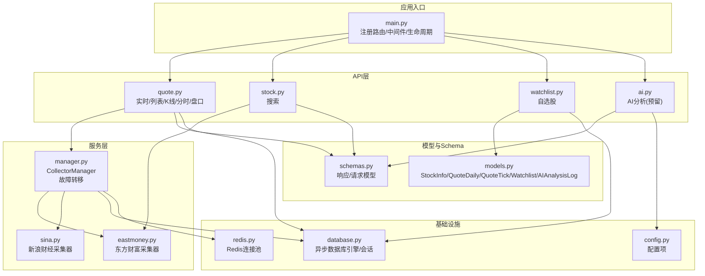
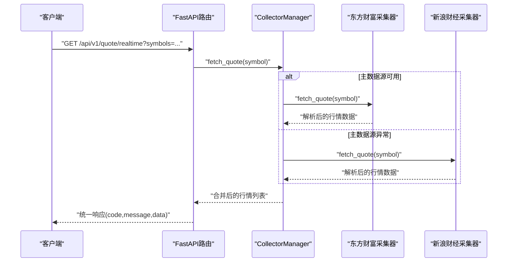
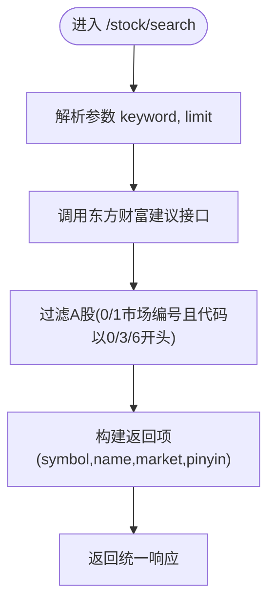
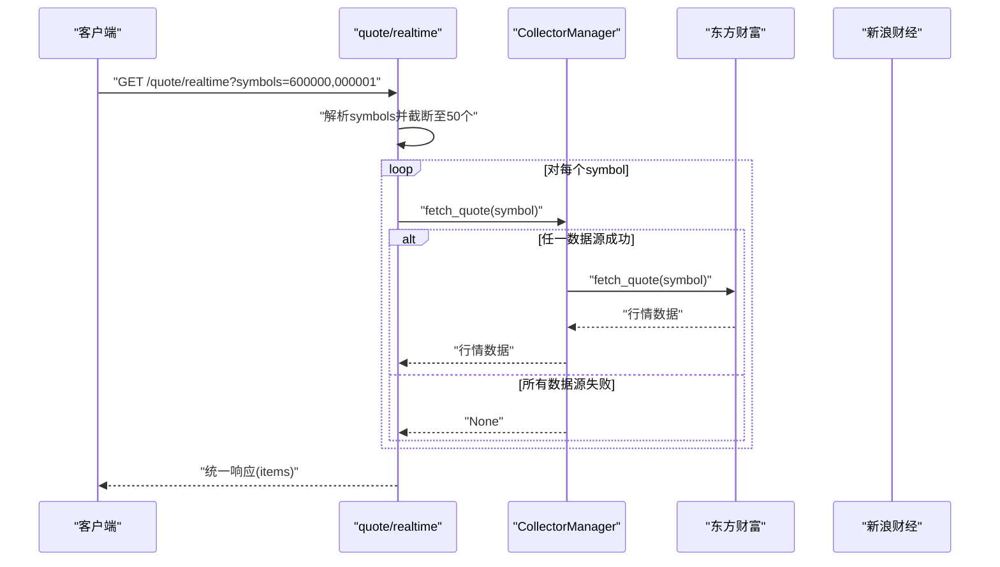
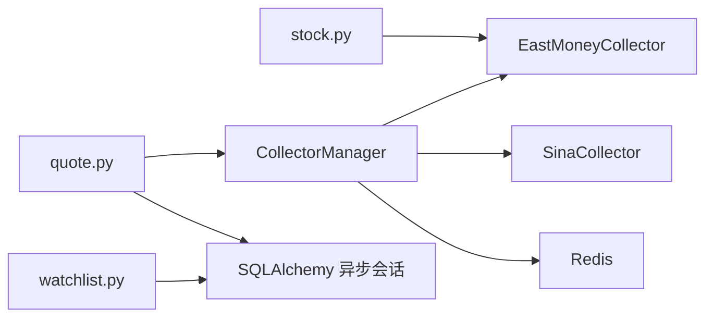

# 股票信息API

<cite>
**本文引用的文件**
- [main.py](file://backend/app/main.py)
- [stock.py](file://backend/app/api/v1/stock.py)
- [quote.py](file://backend/app/api/v1/quote.py)
- [schemas.py](file://backend/app/schemas/schemas.py)
- [models.py](file://backend/app/models/models.py)
- [manager.py](file://backend/app/services/collector/manager.py)
- [eastmoney.py](file://backend/app/services/collector/eastmoney.py)
- [sina.py](file://backend/app/services/collector/sina.py)
- [config.py](file://backend/app/core/config.py)
- [database.py](file://backend/app/core/database.py)
- [redis.py](file://backend/app/core/redis.py)
- [开发文档.md](file://Stock-View 软件开发文档/开发文档.md)
</cite>

## 目录
1. [简介](#简介)
2. [项目结构](#项目结构)
3. [核心组件](#核心组件)
4. [架构总览](#架构总览)
5. [详细组件分析](#详细组件分析)
6. [依赖分析](#依赖分析)
7. [性能考虑](#性能考虑)
8. [故障排查指南](#故障排查指南)
9. [结论](#结论)
10. [附录](#附录)

## 简介
本文件为 Stock-View 项目的股票信息API接口文档，覆盖以下能力：
- 股票基础信息查询：通过实时行情接口获取单只或多只股票的最新报价。
- 股票搜索：基于关键词（股票代码或拼音首字母）进行快速搜索，返回A股标的。
- 股票分类与排行：通过行情列表接口按市场、排序字段与方向、分页参数获取榜单。
- K线、分时、盘口：提供K线周期、复权类型、分时点位、买卖盘口等扩展行情数据。
- 自选股管理：获取、添加、删除、排序自选股。
- AI分析：AI分析接口（预留），可扩展为技术面/趋势/风险等综合分析。

接口统一采用REST风格，响应体遵循统一的“code/message/data”结构；错误码与限流策略以开发文档为准。

## 项目结构
后端采用FastAPI + SQLAlchemy异步ORM + Redis缓存 + 多数据源采集器的架构。API路由集中在v1版本下，数据采集通过CollectorManager统一调度，支持主备数据源自动切换。

图表来源
- [main.py:1-48](file://backend/app/main.py#L1-L48)
- [quote.py:1-65](file://backend/app/api/v1/quote.py#L1-L65)
- [stock.py:1-37](file://backend/app/api/v1/stock.py#L1-L37)
- [manager.py:1-80](file://backend/app/services/collector/manager.py#L1-L80)
- [eastmoney.py:1-240](file://backend/app/services/collector/eastmoney.py#L1-L240)
- [sina.py:1-79](file://backend/app/services/collector/sina.py#L1-L79)
- [schemas.py:1-103](file://backend/app/schemas/schemas.py#L1-L103)
- [models.py:1-74](file://backend/app/models/models.py#L1-L74)
- [config.py:1-43](file://backend/app/core/config.py#L1-L43)
- [database.py:1-25](file://backend/app/core/database.py#L1-L25)
- [redis.py:1-25](file://backend/app/core/redis.py#L1-L25)

章节来源
- [main.py:1-48](file://backend/app/main.py#L1-L48)
- [config.py:1-43](file://backend/app/core/config.py#L1-L43)

## 核心组件
- API路由器：在main.py中注册quote、stock、watchlist、ai四个模块的路由前缀为/api/v1。
- CollectorManager：封装主备数据源（东方财富优先，新浪财经作为备选），自动故障转移。
- Schema模型：定义统一响应结构、行情数据结构、K线/分时/盘口结构、自选股请求结构等。
- 数据模型：StockInfo、QuoteDaily、QuoteTick、Watchlist、AIAnalysisLog等，用于数据库持久化。
- 配置中心：集中管理数据库、Redis、AI服务、采集间隔、缓存TTL、限流等参数。

章节来源
- [main.py:38-43](file://backend/app/main.py#L38-L43)
- [manager.py:12-80](file://backend/app/services/collector/manager.py#L12-L80)
- [schemas.py:6-103](file://backend/app/schemas/schemas.py#L6-L103)
- [models.py:5-74](file://backend/app/models/models.py#L5-L74)
- [config.py:5-43](file://backend/app/core/config.py#L5-L43)

## 架构总览
下图展示从客户端到数据采集器再到数据源的整体调用链路，以及错误处理与回退策略。

图表来源
- [quote.py:7-16](file://backend/app/api/v1/quote.py#L7-L16)
- [manager.py:21-32](file://backend/app/services/collector/manager.py#L21-L32)
- [eastmoney.py:23-37](file://backend/app/services/collector/eastmoney.py#L23-L37)
- [sina.py:19-60](file://backend/app/services/collector/sina.py#L19-L60)

## 详细组件分析

### 股票搜索接口
- 路径：/api/v1/stock/search
- 方法：GET
- 功能：根据关键词（股票代码或拼音首字母）搜索股票，仅返回A股（上交所/深交所）。
- 请求参数
  - keyword：字符串，必填，搜索关键词
  - limit：整数，1-20，默认10
- 响应数据
  - items：数组，元素包含symbol、name、market、pinyin
- 错误处理
  - 采集失败或解析异常时返回空数组，code=0，message="success"
- 示例
  - 请求：GET /api/v1/stock/search?keyword=600000&limit=10
  - 响应：见“附录-请求与响应示例”

图表来源
- [stock.py:10-37](file://backend/app/api/v1/stock.py#L10-L37)

章节来源
- [stock.py:10-37](file://backend/app/api/v1/stock.py#L10-L37)
- [开发文档.md:1434-1463](file://Stock-View 软件开发文档/开发文档.md#L1434-L1463)

### 实时行情接口
- 路径：/api/v1/quote/realtime
- 方法：GET
- 功能：批量获取多只股票的实时行情，最多50只。
- 请求参数
  - symbols：字符串，必填，逗号分隔的股票代码
- 响应数据
  - items：数组，元素为行情对象，包含symbol、name、market、price、change、change_pct、open、high、low、prev_close、volume、amount、turnover_rate、timestamp
- 错误处理
  - 单只股票数据为空则跳过；若所有数据源均失败，返回code=1003（数据源暂不可用）

图表来源
- [quote.py:7-16](file://backend/app/api/v1/quote.py#L7-L16)
- [manager.py:21-32](file://backend/app/services/collector/manager.py#L21-L32)
- [eastmoney.py:23-37](file://backend/app/services/collector/eastmoney.py#L23-L37)
- [sina.py:19-60](file://backend/app/services/collector/sina.py#L19-L60)

章节来源
- [quote.py:7-16](file://backend/app/api/v1/quote.py#L7-L16)
- [schemas.py:13-28](file://backend/app/schemas/schemas.py#L13-L28)
- [开发文档.md:1197-1262](file://Stock-View 软件开发文档/开发文档.md#L1197-L1262)

### 行情列表接口
- 路径：/api/v1/quote/list
- 方法：GET
- 功能：获取A股/沪深市场的行情榜单，支持按字段排序与分页。
- 请求参数
  - market：枚举值，all/sh/sz，默认all
  - sort_by：排序字段，change_pct/volume/amount/turnover，默认change_pct
  - sort_order：asc/desc，默认desc
  - page：页码，>=1
  - page_size：每页数量，1-100，默认20
- 响应数据
  - items：数组，元素为行情对象（同实时行情字段）
  - total/page/page_size：分页信息
- 错误处理
  - 若数据源不可用，返回code=1003

章节来源
- [quote.py:19-33](file://backend/app/api/v1/quote.py#L19-L33)
- [eastmoney.py:39-99](file://backend/app/services/collector/eastmoney.py#L39-L99)
- [开发文档.md:1264-1333](file://Stock-View 软件开发文档/开发文档.md#L1264-L1333)

### K线接口
- 路径：/api/v1/quote/kline
- 方法：GET
- 功能：获取指定周期的K线数据，支持复权类型。
- 请求参数
  - symbol：股票代码，必填
  - period：周期，1m/5m/15m/30m/60m/d/w/m，默认d
  - fq_type：复权类型，none/front/back，默认front
  - limit：返回条数，1-500，默认120
- 响应数据
  - symbol、period、fq_type
  - items：数组，元素包含date/open/high/low/close/volume/amount/change_pct
- 错误处理
  - 无效代码或数据源不可用返回code=1002

章节来源
- [quote.py:36-47](file://backend/app/api/v1/quote.py#L36-L47)
- [eastmoney.py:101-147](file://backend/app/services/collector/eastmoney.py#L101-L147)
- [开发文档.md:1334-1407](file://Stock-View 软件开发文档/开发文档.md#L1334-L1407)

### 分时接口
- 路径：/api/v1/quote/timeline
- 方法：GET
- 功能：获取当日分时数据。
- 请求参数
  - symbol：股票代码，必填
- 响应数据
  - symbol、date、prev_close
  - points：数组，元素包含time/price/avg/volume
- 错误处理
  - 无效代码或数据源不可用返回code=1002

章节来源
- [quote.py:50-56](file://backend/app/api/v1/quote.py#L50-L56)
- [eastmoney.py:149-185](file://backend/app/services/collector/eastmoney.py#L149-L185)
- [开发文档.md:1370-1407](file://Stock-View 软件开发文档/开发文档.md#L1370-L1407)

### 盘口接口
- 路径：/api/v1/quote/orderbook
- 方法：GET
- 功能：获取买卖盘口数据（前五档）。
- 请求参数
  - symbol：股票代码，必填
- 响应数据
  - symbol、timestamp
  - asks/bids：数组，每项包含level/price/volume
- 错误处理
  - 无效代码或数据源不可用返回code=1002

章节来源
- [quote.py:59-65](file://backend/app/api/v1/quote.py#L59-L65)
- [eastmoney.py:187-222](file://backend/app/services/collector/eastmoney.py#L187-L222)
- [开发文档.md:1408-1432](file://Stock-View 软件开发文档/开发文档.md#L1408-L1432)

### 自选股管理接口
- 路径：/api/v1/watchlist
- 方法：GET/POST/DELETE/PUT
- 功能：获取、添加、删除、排序自选股
- 请求参数与响应
  - GET：返回items数组，含symbol/market/sort_order
  - POST：请求体包含symbol与market，返回code/message
  - DELETE：路径参数symbol
  - PUT /sort：请求体为items数组，包含symbol与sort_order
- 错误处理
  - 已存在自选股返回code=1001

章节来源
- [watchlist.py:13-77](file://backend/app/api/v1/watchlist.py#L13-L77)
- [models.py:50-60](file://backend/app/models/models.py#L50-L60)
- [schemas.py:79-91](file://backend/app/schemas/schemas.py#L79-L91)

### AI分析接口（预留）
- 路径：/api/v1/ai/analyze
- 方法：POST
- 功能：请求AI分析（技术面/趋势/风险/综合）
- 请求参数
  - symbol：股票代码
  - analysis_type：分析类型，默认comprehensive
  - period_days：分析周期，默认30
- 响应数据
  - 包含趋势、置信度、摘要、技术指标、支撑阻力、成交量分析、预测目标价等字段（详见附录示例）

章节来源
- [ai.py:10-15](file://backend/app/api/v1/ai.py#L10-L15)
- [config.py:19-24](file://backend/app/core/config.py#L19-L24)
- [开发文档.md:1520-1566](file://Stock-View 软件开发文档/开发文档.md#L1520-L1566)

## 依赖分析
- 组件耦合
  - API层仅依赖CollectorManager与数据库/Redis（自选股接口），耦合度低。
  - CollectorManager对具体采集器实现解耦，便于扩展新数据源。
- 外部依赖
  - 东方财富与新浪财经：实时/历史/分时/K线/盘口数据。
  - PostgreSQL：持久化自选股与AI日志。
  - Redis：缓存与任务队列（由配置项体现）。
- 循环依赖
  - 未发现循环导入；各模块职责清晰。

图表来源
- [quote.py:1-65](file://backend/app/api/v1/quote.py#L1-L65)
- [stock.py:1-37](file://backend/app/api/v1/stock.py#L1-L37)
- [manager.py:1-80](file://backend/app/services/collector/manager.py#L1-L80)
- [eastmoney.py:1-240](file://backend/app/services/collector/eastmoney.py#L1-L240)
- [sina.py:1-79](file://backend/app/services/collector/sina.py#L1-L79)
- [database.py:1-25](file://backend/app/core/database.py#L1-L25)
- [redis.py:1-25](file://backend/app/core/redis.py#L1-L25)

章节来源
- [main.py:38-43](file://backend/app/main.py#L38-L43)
- [manager.py:12-80](file://backend/app/services/collector/manager.py#L12-L80)

## 性能考虑
- 数据源优先级与故障转移
  - CollectorManager优先使用东方财富，失败则自动切换到新浪财经，提升可用性。
- 并发与限流
  - 实时行情symbols最多50个，避免单次请求过大。
  - 配置中定义了行情与AI接口的限流规则（详见开发文档）。
- 缓存策略
  - 配置项包含QUOTE_COLLECT_INTERVAL与QUOTE_CACHE_TTL，建议结合Redis实现热点数据缓存。
- 数据库连接池
  - 异步引擎pool_size与max_overflow已配置，确保高并发下的稳定性。
- 最佳实践
  - 客户端侧批量请求symbols，减少HTTP请求数。
  - 对高频访问的个股行情开启本地缓存，结合TTL刷新。
  - 使用分页与合理limit，避免一次性拉取过多数据。

章节来源
- [manager.py:9-80](file://backend/app/services/collector/manager.py#L9-L80)
- [config.py:29-30](file://backend/app/core/config.py#L29-L30)
- [database.py:7-8](file://backend/app/core/database.py#L7-L8)
- [开发文档.md:1188-1196](file://Stock-View 软件开发文档/开发文档.md#L1188-L1196)

## 故障排查指南
- 常见错误码
  - 0：成功
  - 1001：参数错误/已在自选股
  - 1002：股票代码不存在或数据源不可用
  - 1003：数据源暂不可用
  - 2001/2002：认证失败/请求频率超限
  - 3001/3002：AI服务不可用/分析超时
  - 5000：服务器内部错误
- 排查步骤
  - 检查symbols是否正确（6位数字，A股代码以0/3/6开头）
  - 确认网络可达性与数据源状态
  - 查看CollectorManager日志，确认主/备数据源切换情况
  - 检查数据库连接与Redis连接
  - 根据限流规则控制请求频率

章节来源
- [开发文档.md:1173-1187](file://Stock-View 软件开发文档/开发文档.md#L1173-L1187)
- [manager.py:21-32](file://backend/app/services/collector/manager.py#L21-L32)

## 结论
本API以简洁的REST接口覆盖了股票搜索、实时行情、行情榜单、K线/分时/盘口等核心功能，并通过CollectorManager实现主备数据源的自动切换，具备良好的可用性与扩展性。配合统一响应格式、明确的错误码与限流策略，适合在前端与移动端场景中稳定使用。

## 附录

### 接口清单与规范
- 通用规范
  - Base URL：/api/v1
  - 统一响应格式：{"code": 0, "message": "success", "data": {}}
  - 错误码定义与限流规则详见开发文档

章节来源
- [开发文档.md:1157-1196](file://Stock-View 软件开发文档/开发文档.md#L1157-L1196)

### 请求与响应示例
- 股票搜索
  - 请求：GET /api/v1/stock/search?keyword=600000&limit=10
  - 响应：见“附录-请求与响应示例”
- 实时行情
  - 请求：GET /api/v1/quote/realtime?symbols=600000,000001
  - 响应：见“附录-请求与响应示例”
- 行情列表
  - 请求：GET /api/v1/quote/list?market=all&sort_by=change_pct&sort_order=desc&page=1&page_size=20
  - 响应：见“附录-请求与响应示例”
- K线
  - 请求：GET /api/v1/quote/kline?symbol=600000&period=d&fq_type=front&limit=120
  - 响应：见“附录-请求与响应示例”
- 分时
  - 请求：GET /api/v1/quote/timeline?symbol=600000
  - 响应：见“附录-请求与响应示例”
- 盘口
  - 请求：GET /api/v1/quote/orderbook?symbol=600000
  - 响应：见“附录-请求与响应示例”
- 自选股
  - 获取：GET /api/v1/watchlist
  - 添加：POST /api/v1/watchlist
  - 删除：DELETE /api/v1/watchlist/{symbol}
  - 排序：PUT /api/v1/watchlist/sort
- AI分析（预留）
  - 请求：POST /api/v1/ai/analyze?symbol=600000&analysis_type=comprehensive&period_days=30
  - 响应：见“附录-请求与响应示例”

章节来源
- [开发文档.md:1197-1566](file://Stock-View 软件开发文档/开发文档.md#L1197-L1566)

### 数据模型与字段说明
- 行情数据模型（QuoteItem）
  - 字段：symbol、name、market、price、change、change_pct、open、high、low、prev_close、volume、amount、turnover_rate、timestamp
- K线数据模型（KlineItem）
  - 字段：date、open、high、low、close、volume、amount、change_pct
- 分时数据模型（TimelinePoint）
  - 字段：time、price、avg、volume
- 盘口数据模型（OrderBookLevel）
  - 字段：level、price、volume
- 自选股模型（Watchlist）
  - 字段：user_id、symbol、market、sort_order、group_name、added_at

章节来源
- [schemas.py:13-67](file://backend/app/schemas/schemas.py#L13-L67)
- [models.py:5-74](file://backend/app/models/models.py#L5-L74)

### 数据来源、更新时间与准确性
- 数据来源
  - 主数据源：东方财富（实时/历史/分时/K线/盘口）
  - 备用数据源：新浪财经（实时行情）
- 更新时间
  - 实时行情采集间隔与缓存TTL由配置项控制
- 准确性保证
  - 通过CollectorManager自动故障转移提升可用性；字段映射与解析逻辑在采集器内完成

章节来源
- [config.py:29-30](file://backend/app/core/config.py#L29-L30)
- [eastmoney.py:23-37](file://backend/app/services/collector/eastmoney.py#L23-L37)
- [sina.py:19-60](file://backend/app/services/collector/sina.py#L19-L60)