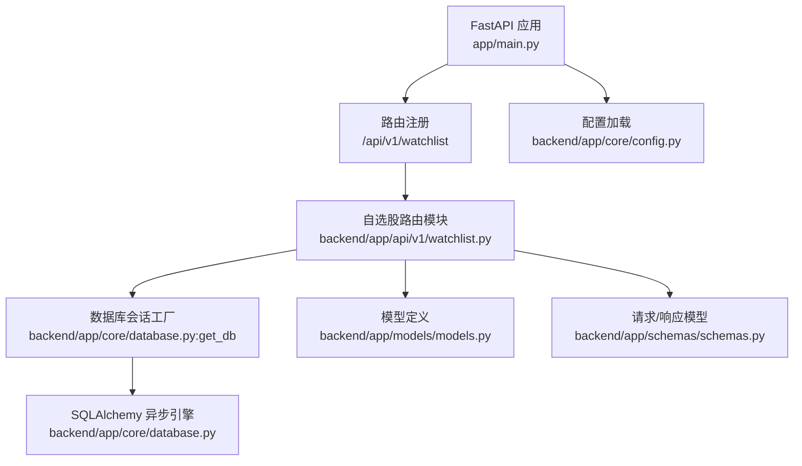
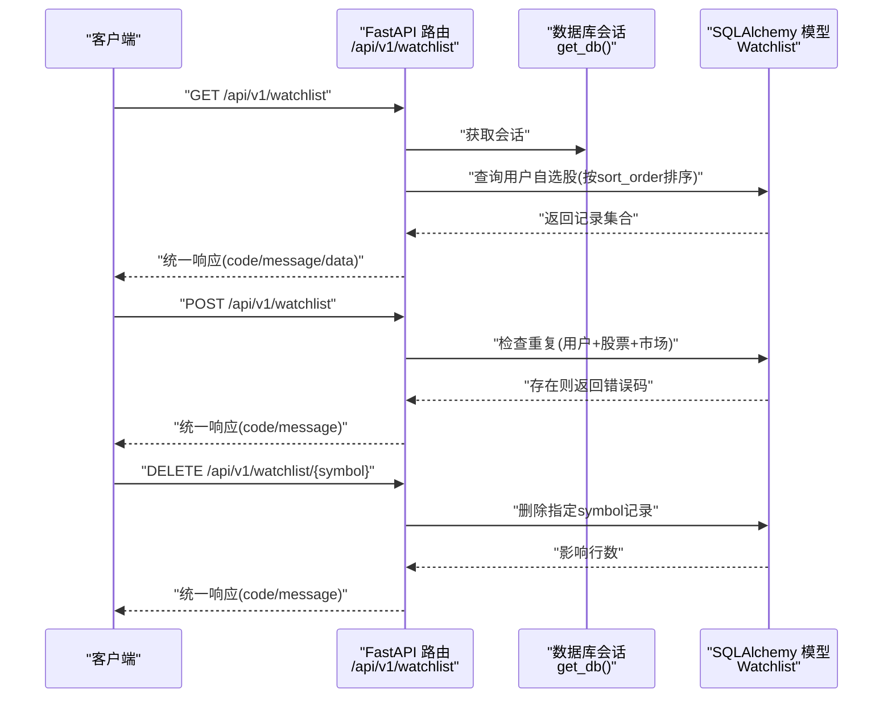
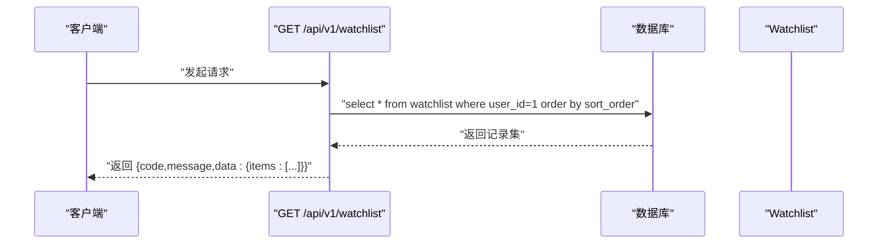
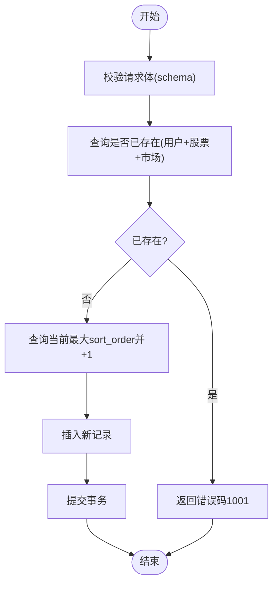
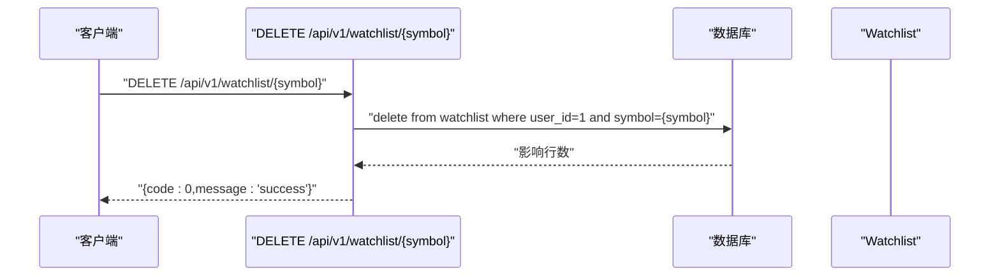
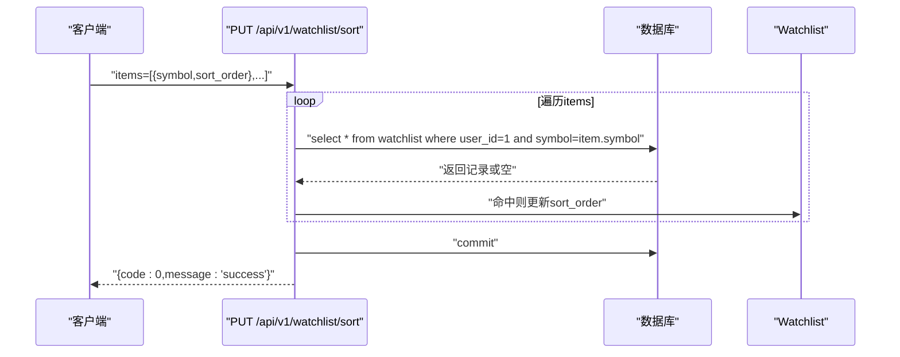
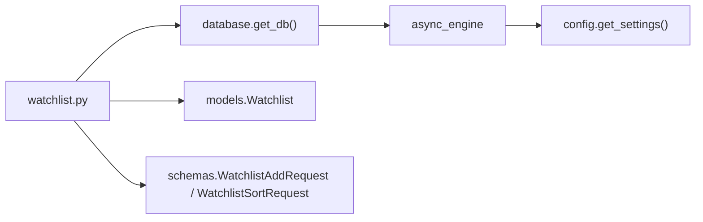
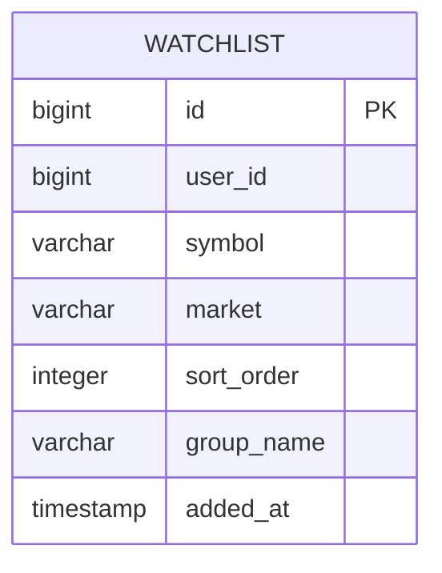

# 自选股管理API

<cite>
**本文档引用的文件**
- [backend/app/api/v1/watchlist.py](file://backend/app/api/v1/watchlist.py)
- [backend/app/models/models.py](file://backend/app/models/models.py)
- [backend/app/schemas/schemas.py](file://backend/app/schemas/schemas.py)
- [backend/app/core/database.py](file://backend/app/core/database.py)
- [backend/app/main.py](file://backend/app/main.py)
- [backend/app/core/config.py](file://backend/app/core/config.py)
- [Stock-View 软件开发文档/开发文档.md](file://Stock-View 软件开发文档/开发文档.md)
</cite>

## 目录
1. [简介](#简介)
2. [项目结构](#项目结构)
3. [核心组件](#核心组件)
4. [架构总览](#架构总览)
5. [详细组件分析](#详细组件分析)
6. [依赖关系分析](#依赖关系分析)
7. [性能考虑](#性能考虑)
8. [故障排查指南](#故障排查指南)
9. [结论](#结论)
10. [附录](#附录)

## 简介
本文件面向Stock-View项目的自选股管理API，提供完整的接口规范与实现解析，覆盖自选股的增删改查、排序、分组等管理能力。文档基于后端FastAPI路由与SQLAlchemy模型的实际实现进行梳理，并结合开发文档中的数据库设计与接口示例，帮助开发者与测试人员准确理解接口行为、数据结构与错误处理机制。

## 项目结构
后端采用FastAPI + SQLAlchemy异步ORM的架构，自选股模块位于API版本路由下，模型定义在统一的models中，请求/响应模型通过schemas定义，数据库连接与会话管理由core模块提供。

**图表来源**
- [backend/app/main.py:38-43](file://backend/app/main.py#L38-L43)
- [backend/app/api/v1/watchlist.py:1-77](file://backend/app/api/v1/watchlist.py#L1-L77)
- [backend/app/core/database.py:15-20](file://backend/app/core/database.py#L15-L20)
- [backend/app/models/models.py:50-60](file://backend/app/models/models.py#L50-L60)
- [backend/app/schemas/schemas.py:78-91](file://backend/app/schemas/schemas.py#L78-L91)
- [backend/app/core/config.py:41-43](file://backend/app/core/config.py#L41-L43)

**章节来源**
- [backend/app/main.py:38-43](file://backend/app/main.py#L38-L43)
- [backend/app/api/v1/watchlist.py:8-10](file://backend/app/api/v1/watchlist.py#L8-L10)
- [backend/app/core/database.py:15-20](file://backend/app/core/database.py#L15-L20)

## 核心组件
- 自选股路由模块：提供获取列表、添加、删除、排序等接口，使用异步数据库会话。
- 数据库模型：Watchlist表包含用户标识、股票代码、市场、排序字段与分组字段。
- 请求/响应模型：定义添加自选股与排序请求的数据结构。
- 数据库会话与引擎：异步连接池配置，确保高并发下的稳定性。

**章节来源**
- [backend/app/api/v1/watchlist.py:13-77](file://backend/app/api/v1/watchlist.py#L13-L77)
- [backend/app/models/models.py:50-60](file://backend/app/models/models.py#L50-L60)
- [backend/app/schemas/schemas.py:78-91](file://backend/app/schemas/schemas.py#L78-L91)
- [backend/app/core/database.py:7-8](file://backend/app/core/database.py#L7-L8)

## 架构总览
自选股API遵循REST风格，通过FastAPI路由暴露，内部使用SQLAlchemy异步查询与事务提交。请求经由路由层进入，访问数据库模型并返回统一响应格式；配置模块负责数据库连接字符串与调试开关。

**图表来源**
- [backend/app/api/v1/watchlist.py:13-77](file://backend/app/api/v1/watchlist.py#L13-L77)
- [backend/app/core/database.py:15-20](file://backend/app/core/database.py#L15-L20)
- [backend/app/models/models.py:50-60](file://backend/app/models/models.py#L50-L60)

## 详细组件分析

### 接口总览
- 基础路径：/api/v1/watchlist
- 默认用户ID：常量1（当前版本未接入鉴权）
- 统一响应结构：code、message、data

**章节来源**
- [backend/app/api/v1/watchlist.py:8-10](file://backend/app/api/v1/watchlist.py#L8-L10)
- [backend/app/schemas/schemas.py:6-10](file://backend/app/schemas/schemas.py#L6-L10)

### 获取自选股列表
- 方法与路径：GET /api/v1/watchlist
- 功能：按sort_order升序返回当前用户的所有自选股
- 响应数据结构：
  - code：状态码
  - message：消息
  - data.items：数组，元素包含symbol、market、sort_order
- 分页：当前实现未提供分页参数与分页返回结构

**图表来源**
- [backend/app/api/v1/watchlist.py:13-26](file://backend/app/api/v1/watchlist.py#L13-L26)
- [backend/app/models/models.py:50-60](file://backend/app/models/models.py#L50-L60)

**章节来源**
- [backend/app/api/v1/watchlist.py:13-26](file://backend/app/api/v1/watchlist.py#L13-L26)
- [Stock-View 软件开发文档/开发文档.md:1466-1486](file://Stock-View 软件开发文档/开发文档.md#L1466-L1486)

### 添加自选股
- 方法与路径：POST /api/v1/watchlist
- 请求体：
  - symbol：股票代码
  - market：市场，默认"sh"
- 参数校验与重复检查：
  - 校验：请求体schema定义了必填字段
  - 重复检查：按用户ID+股票代码+市场唯一约束
- 排序策略：
  - 新增记录的sort_order为当前最大值+1，若无记录则为1
- 错误处理：
  - 重复：返回code=1001，message提示已在自选股中
  - 成功：返回code=0，message为success

**图表来源**
- [backend/app/schemas/schemas.py:78-82](file://backend/app/schemas/schemas.py#L78-L82)
- [backend/app/api/v1/watchlist.py:30-51](file://backend/app/api/v1/watchlist.py#L30-L51)
- [backend/app/models/models.py:50-60](file://backend/app/models/models.py#L50-L60)

**章节来源**
- [backend/app/api/v1/watchlist.py:29-51](file://backend/app/api/v1/watchlist.py#L29-L51)
- [backend/app/schemas/schemas.py:78-82](file://backend/app/schemas/schemas.py#L78-L82)
- [Stock-View 软件开发文档/开发文档.md:1488-1498](file://Stock-View 软件开发文档/开发文档.md#L1488-L1498)

### 删除自选股
- 方法与路径：DELETE /api/v1/watchlist/{symbol}
- 权限与范围：
  - 当前实现限定用户ID=1，未做鉴权校验
- 一致性与级联：
  - 单条删除，未发现级联删除逻辑
- 返回：成功返回code=0

**图表来源**
- [backend/app/api/v1/watchlist.py:54-61](file://backend/app/api/v1/watchlist.py#L54-L61)
- [backend/app/models/models.py:50-60](file://backend/app/models/models.py#L50-L60)

**章节来源**
- [backend/app/api/v1/watchlist.py:54-61](file://backend/app/api/v1/watchlist.py#L54-L61)
- [Stock-View 软件开发文档/开发文档.md:1500-1504](file://Stock-View 软件开发文档/开发文档.md#L1500-L1504)

### 调整自选股排序
- 方法与路径：PUT /api/v1/watchlist/sort
- 请求体：
  - items：数组，每个元素包含symbol与sort_order
- 批量处理：
  - 遍历items，按symbol查找并更新对应sort_order
  - 未命中的symbol会被忽略（不抛错）
- 事务处理：
  - 全部更新完成后一次性提交

**图表来源**
- [backend/app/api/v1/watchlist.py:64-77](file://backend/app/api/v1/watchlist.py#L64-L77)
- [backend/app/schemas/schemas.py:84-91](file://backend/app/schemas/schemas.py#L84-L91)
- [backend/app/models/models.py:50-60](file://backend/app/models/models.py#L50-L60)

**章节来源**
- [backend/app/api/v1/watchlist.py:64-77](file://backend/app/api/v1/watchlist.py#L64-L77)
- [Stock-View 软件开发文档/开发文档.md:1506-1518](file://Stock-View 软件开发文档/开发文档.md#L1506-L1518)

### 分组管理（当前实现与规划）
- 当前实现：
  - 模型具备group_name字段，但API未提供分组创建、重命名、删除、移动等接口
- 规划与建议：
  - 分组创建：新增分组名，校验唯一性
  - 分组重命名：按分组名更新
  - 分组删除：需处理迁移或删除策略
  - 移动到分组：批量更新多个symbol的group_name
  - 建议引入事务与幂等性保障

**章节来源**
- [backend/app/models/models.py:58](file://backend/app/models/models.py#L58)
- [Stock-View 软件开发文档/开发文档.md:1797](file://Stock-View 软件开发文档/开发文档.md#L1797)

## 依赖关系分析
- 路由依赖：watchlist.py依赖数据库会话工厂、模型与请求模型
- 数据库依赖：models.py定义表结构，database.py提供异步引擎与会话
- 配置依赖：config.py提供DATABASE_URL等运行时配置

**图表来源**
- [backend/app/api/v1/watchlist.py:1-6](file://backend/app/api/v1/watchlist.py#L1-L6)
- [backend/app/core/database.py:15-20](file://backend/app/core/database.py#L15-L20)
- [backend/app/models/models.py:50-60](file://backend/app/models/models.py#L50-L60)
- [backend/app/schemas/schemas.py:78-91](file://backend/app/schemas/schemas.py#L78-L91)
- [backend/app/core/config.py:41-43](file://backend/app/core/config.py#L41-L43)

**章节来源**
- [backend/app/api/v1/watchlist.py:1-6](file://backend/app/api/v1/watchlist.py#L1-L6)
- [backend/app/core/database.py:15-20](file://backend/app/core/database.py#L15-L20)
- [backend/app/core/config.py:41-43](file://backend/app/core/config.py#L41-L43)

## 性能考虑
- 连接池与并发：
  - 异步引擎池大小：pool_size=20，max_overflow=10，适合中等并发场景
- 查询优化：
  - 列表查询按sort_order排序，建议在sort_order上建立索引以提升排序效率
  - 唯一索引：(user_id, symbol, market)有助于快速去重
- 写入优化：
  - 批量排序采用单事务提交，减少多次往返
  - 新增时先查最大排序再插入，避免并发竞争导致的冲突
- 缓存与热点：
  - 可考虑Redis缓存用户自选股列表，结合TTL与失效策略

**章节来源**
- [backend/app/core/database.py:7-8](file://backend/app/core/database.py#L7-L8)
- [Stock-View 软件开发文档/开发文档.md:1083](file://Stock-View 软件开发文档/开发文档.md#L1083)

## 故障排查指南
- 常见错误码
  - 1001：已在自选股中（重复添加）
- 排查步骤
  - 检查请求体schema是否符合要求（symbol必填，market默认）
  - 确认唯一约束是否触发（同一用户+股票+市场不可重复）
  - 查看数据库日志与调试开关（APP_DEBUG）
- 并发问题
  - 新增时的最大排序计算在高并发下可能产生竞争，建议在数据库层面使用序列或原子操作
  - 排序接口对未命中的symbol会静默忽略，如需严格校验可在业务层增强

**章节来源**
- [backend/app/api/v1/watchlist.py:38](file://backend/app/api/v1/watchlist.py#L38)
- [backend/app/core/config.py:9](file://backend/app/core/config.py#L9)

## 结论
当前自选股API实现了基础的增删改查与排序能力，结构清晰、扩展性强。后续建议完善鉴权体系、分组管理接口、分页与排序索引优化，并在高并发场景下加强原子性与一致性保障。

## 附录

### 数据模型概览

**图表来源**
- [backend/app/models/models.py:50-60](file://backend/app/models/models.py#L50-L60)
- [Stock-View 软件开发文档/开发文档.md:1075-1087](file://Stock-View 软件开发文档/开发文档.md#L1075-L1087)

### 统一响应结构
- code：整数，0表示成功，非0为错误码
- message：字符串，简要描述
- data：对象或null，承载具体数据

**章节来源**
- [backend/app/schemas/schemas.py:6-10](file://backend/app/schemas/schemas.py#L6-L10)
- [backend/app/api/v1/watchlist.py:20-26](file://backend/app/api/v1/watchlist.py#L20-L26)