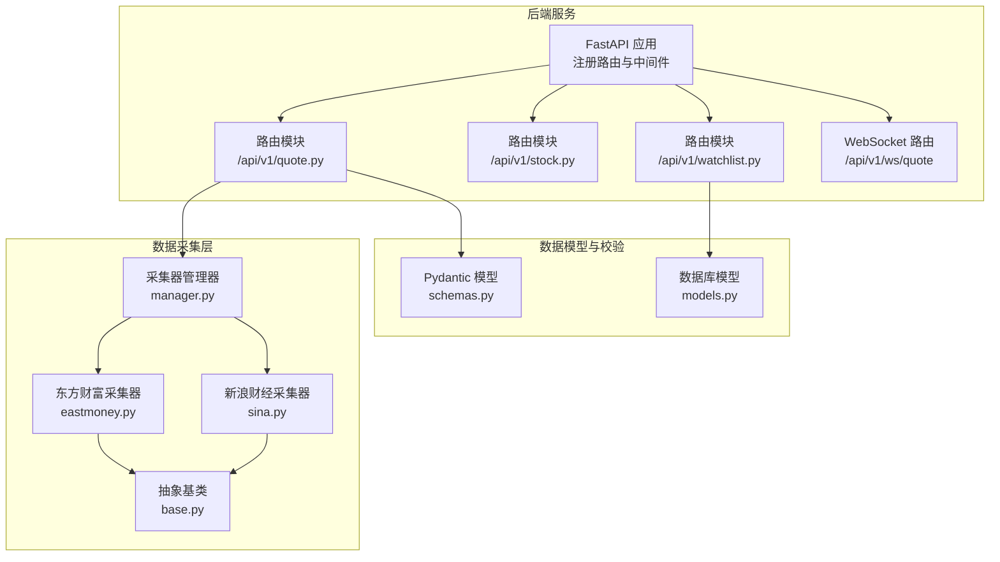
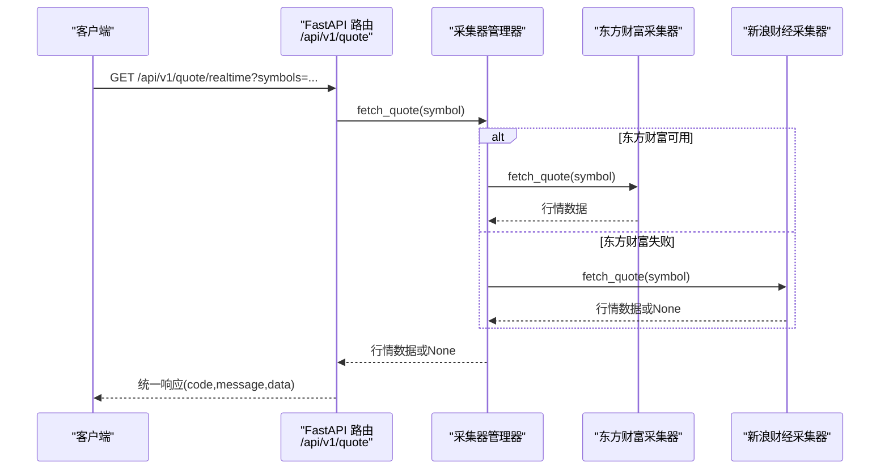
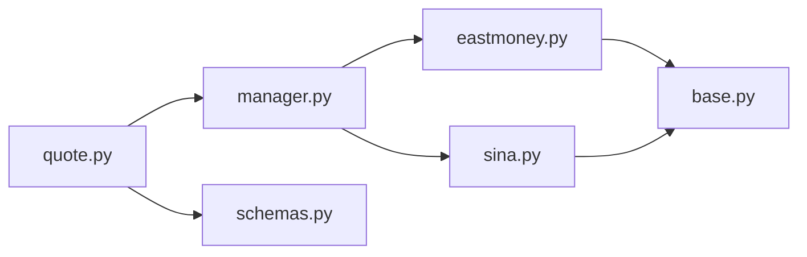

# 行情数据API

<cite>
**本文引用的文件**
- [backend/app/main.py](file://backend/app/main.py)
- [backend/app/api/v1/quote.py](file://backend/app/api/v1/quote.py)
- [backend/app/schemas/schemas.py](file://backend/app/schemas/schemas.py)
- [backend/app/services/collector/base.py](file://backend/app/services/collector/base.py)
- [backend/app/services/collector/eastmoney.py](file://backend/app/services/collector/eastmoney.py)
- [backend/app/services/collector/sina.py](file://backend/app/services/collector/sina.py)
- [backend/app/services/collector/manager.py](file://backend/app/services/collector/manager.py)
- [backend/app/api/websocket.py](file://backend/app/api/websocket.py)
- [backend/app/core/config.py](file://backend/app/core/config.py)
- [backend/requirements.txt](file://backend/requirements.txt)
- [README.md](file://README.md)
</cite>

## 目录
1. [简介](#简介)
2. [项目结构](#项目结构)
3. [核心组件](#核心组件)
4. [架构总览](#架构总览)
5. [详细接口规范](#详细接口规范)
6. [依赖关系分析](#依赖关系分析)
7. [性能与缓存策略](#性能与缓存策略)
8. [故障排查指南](#故障排查指南)
9. [结论](#结论)
10. [附录](#附录)

## 简介
本文件为 Stock-View 项目的行情数据 API 接口文档，覆盖实时报价、行情列表、K线、分时、盘口等接口的完整规范。内容包括：
- 接口 URL、HTTP 方法、请求参数与请求头
- 响应数据结构与字段含义
- 错误码与异常处理
- curl 与 JavaScript/Python 示例
- 数据更新频率、缓存策略与性能优化建议

## 项目结构
后端基于 FastAPI 提供 REST API，行情相关接口集中在 v1 版本路由下，数据采集通过“采集器 + 管理器”的架构实现，支持主备数据源自动故障转移。

图表来源
- [backend/app/main.py:38-43](file://backend/app/main.py#L38-L43)
- [backend/app/api/v1/quote.py:4](file://backend/app/api/v1/quote.py#L4)
- [backend/app/services/collector/manager.py:12-80](file://backend/app/services/collector/manager.py#L12-L80)
- [backend/app/services/collector/base.py:5-45](file://backend/app/services/collector/base.py#L5-L45)
- [backend/app/services/collector/eastmoney.py:11-240](file://backend/app/services/collector/eastmoney.py#L11-L240)
- [backend/app/services/collector/sina.py:10-79](file://backend/app/services/collector/sina.py#L10-L79)
- [backend/app/schemas/schemas.py:6-103](file://backend/app/schemas/schemas.py#L6-L103)

章节来源
- [backend/app/main.py:38-43](file://backend/app/main.py#L38-L43)
- [backend/app/api/v1/quote.py:4](file://backend/app/api/v1/quote.py#L4)
- [backend/app/services/collector/manager.py:12-80](file://backend/app/services/collector/manager.py#L12-L80)

## 核心组件
- FastAPI 应用与路由注册：统一挂载 v1 路由，启用 CORS。
- 行情 API 路由：提供实时、列表、K线、分时、盘口接口。
- 数据采集器：抽象出统一接口，具体实现为东方财富与新浪财经。
- 采集器管理器：按优先级自动故障转移，保证可用性。
- 响应模型：使用 Pydantic 定义统一响应结构与业务数据模型。

章节来源
- [backend/app/main.py:22-48](file://backend/app/main.py#L22-L48)
- [backend/app/api/v1/quote.py:7-65](file://backend/app/api/v1/quote.py#L7-L65)
- [backend/app/services/collector/base.py:5-45](file://backend/app/services/collector/base.py#L5-L45)
- [backend/app/services/collector/manager.py:12-80](file://backend/app/services/collector/manager.py#L12-L80)
- [backend/app/schemas/schemas.py:6-103](file://backend/app/schemas/schemas.py#L6-L103)

## 架构总览
以下序列图展示了“实时行情”接口的典型调用链路，体现从 API 到采集器再到数据源的处理流程。

图表来源
- [backend/app/api/v1/quote.py:7-16](file://backend/app/api/v1/quote.py#L7-L16)
- [backend/app/services/collector/manager.py:21-32](file://backend/app/services/collector/manager.py#L21-L32)
- [backend/app/services/collector/eastmoney.py:23-37](file://backend/app/services/collector/eastmoney.py#L23-L37)
- [backend/app/services/collector/sina.py:19-60](file://backend/app/services/collector/sina.py#L19-L60)

## 详细接口规范

### 通用响应结构
- 所有接口统一返回结构：code、message、data
- code=0 表示成功；非0表示错误
- data 字段随接口不同而异

章节来源
- [backend/app/schemas/schemas.py:7-10](file://backend/app/schemas/schemas.py#L7-L10)
- [backend/app/api/v1/quote.py:16](file://backend/app/api/v1/quote.py#L16)
- [backend/app/api/v1/quote.py:33](file://backend/app/api/v1/quote.py#L33)
- [backend/app/api/v1/quote.py:46](file://backend/app/api/v1/quote.py#L46)
- [backend/app/api/v1/quote.py:55](file://backend/app/api/v1/quote.py#L55)
- [backend/app/api/v1/quote.py:64](file://backend/app/api/v1/quote.py#L64)

### 实时行情 /api/v1/quote/realtime
- 方法：GET
- 功能：获取多只股票的实时行情
- 请求参数
  - symbols: string, 必填, 以逗号分隔的股票代码列表，最多 50 个
- 请求头：无特殊要求
- 响应数据
  - items: array, 每项为单只股票的行情对象
- 行情对象字段
  - symbol: string, 股票代码
  - name: string, 名称
  - market: string, 市场 sh/sz
  - price: number, 最新价
  - change: number, 涨跌额
  - change_pct: number, 涨跌幅%
  - open: number, 开盘价
  - high: number, 最高价
  - low: number, 最低价
  - prev_close: number, 昨收
  - volume: integer, 成交量
  - amount: number, 成交额
  - turnover_rate: number, 换手率
  - timestamp: string, 时间戳
- 错误码
  - 0: 成功
  - 1002: 股票代码不存在或数据源不可用
- 示例
  - curl: curl "http://localhost:8000/api/v1/quote/realtime?symbols=000001,600036"
  - JavaScript: fetch("/api/v1/quote/realtime?symbols=000001,600036")
  - Python: requests.get("http://localhost:8000/api/v1/quote/realtime", params={"symbols": "000001,600036"})

章节来源
- [backend/app/api/v1/quote.py:7-16](file://backend/app/api/v1/quote.py#L7-L16)
- [backend/app/schemas/schemas.py:13-28](file://backend/app/schemas/schemas.py#L13-L28)
- [backend/app/services/collector/eastmoney.py:23-37](file://backend/app/services/collector/eastmoney.py#L23-L37)
- [backend/app/services/collector/sina.py:19-60](file://backend/app/services/collector/sina.py#L19-L60)

### 行情列表 /api/v1/quote/list
- 方法：GET
- 功能：获取全市场或指定市场的股票行情列表
- 请求参数
  - market: string, 可选, all/sh/sz，默认 all
  - sort_by: string, 可选, 排序字段 change_pct/volume/amount/turnover，默认 change_pct
  - sort_order: string, 可选, asc/desc，默认 desc
  - page: integer, 可选, 页码>=1，默认 1
  - page_size: integer, 可选, 1~100，默认 20
- 请求头：无特殊要求
- 响应数据
  - items: array, 每项为行情条目
  - total: integer, 总数
  - page: integer, 当前页
  - page_size: integer, 每页大小
- 行情条目字段
  - symbol: string
  - name: string
  - price: number, 最新价
  - change_pct: number, 涨跌幅%
  - change: number, 涨跌额
  - volume: integer, 成交量
  - amount: number, 成交额
  - amplitude: number, 振幅
  - turnover_rate: number, 换手率
  - high: number, 最高价
  - low: number, 最低价
  - open: number, 开盘价
  - prev_close: number, 昨收
- 错误码
  - 0: 成功
  - 1003: 数据源暂不可用
- 示例
  - curl: curl "http://localhost:8000/api/v1/quote/list?market=all&sort_by=change_pct&page=1&page_size=20"
  - JavaScript: fetch("/api/v1/quote/list?market=sh&sort_by=volume&page=1&page_size=50")
  - Python: requests.get("http://localhost:8000/api/v1/quote/list", params={"market":"sh","sort_by":"volume","page":1,"page_size":50})

章节来源
- [backend/app/api/v1/quote.py:19-33](file://backend/app/api/v1/quote.py#L19-L33)
- [backend/app/schemas/schemas.py:30-32](file://backend/app/schemas/schemas.py#L30-L32)
- [backend/app/services/collector/eastmoney.py:39-99](file://backend/app/services/collector/eastmoney.py#L39-L99)

### K线数据 /api/v1/quote/kline
- 方法：GET
- 功能：获取某只股票的历史 K 线
- 请求参数
  - symbol: string, 必填, 股票代码
  - period: string, 可选, K线周期 1m/5m/15m/30m/60m/d/w/m，默认 d
  - fq_type: string, 可选, 复权 none/front/back，默认 front
  - limit: integer, 可选, 返回数量 1~500，默认 120
- 请求头：无特殊要求
- 响应数据
  - symbol: string
  - period: string
  - fq_type: string
  - items: array, 每项为 K 线条目
- K线条目字段
  - date: string, 日期
  - open: number, 开盘价
  - high: number, 最高价
  - low: number, 最低价
  - close: number, 收盘价
  - volume: integer, 成交量
  - amount: number, 成交额
  - change_pct: number, 涨跌幅%
- 错误码
  - 0: 成功
  - 1002: 股票代码不存在或数据源不可用
- 示例
  - curl: curl "http://localhost:8000/api/v1/quote/kline?symbol=000001&period=d&fq_type=front&limit=120"
  - JavaScript: fetch("/api/v1/quote/kline?symbol=000001&period=1m&limit=60")
  - Python: requests.get("http://localhost:8000/api/v1/quote/kline", params={"symbol":"600036","period":"60m","limit":30})

章节来源
- [backend/app/api/v1/quote.py:36-47](file://backend/app/api/v1/quote.py#L36-L47)
- [backend/app/schemas/schemas.py:34-43](file://backend/app/schemas/schemas.py#L34-L43)
- [backend/app/services/collector/eastmoney.py:101-147](file://backend/app/services/collector/eastmoney.py#L101-L147)

### 分时数据 /api/v1/quote/timeline
- 方法：GET
- 功能：获取某只股票当日分时走势
- 请求参数
  - symbol: string, 必填, 股票代码
- 请求头：无特殊要求
- 响应数据
  - symbol: string
  - date: string, 日期
  - prev_close: number, 昨收
  - points: array, 每项为分时点
- 分时点字段
  - time: string, 时间
  - price: number, 价格
  - avg: number, 均价
  - volume: integer, 该点成交量
- 错误码
  - 0: 成功
  - 1002: 股票代码不存在或数据源不可用
- 示例
  - curl: curl "http://localhost:8000/api/v1/quote/timeline?symbol=000001"
  - JavaScript: fetch("/api/v1/quote/timeline?symbol=600036")
  - Python: requests.get("http://localhost:8000/api/v1/quote/timeline", params={"symbol":"000001"})

章节来源
- [backend/app/api/v1/quote.py:50-56](file://backend/app/api/v1/quote.py#L50-L56)
- [backend/app/schemas/schemas.py:49-57](file://backend/app/schemas/schemas.py#L49-L57)
- [backend/app/services/collector/eastmoney.py:149-185](file://backend/app/services/collector/eastmoney.py#L149-L185)

### 盘口数据 /api/v1/quote/orderbook
- 方法：GET
- 功能：获取某只股票的买卖盘口（深度档位）
- 请求参数
  - symbol: string, 必填, 股票代码
- 请求头：无特殊要求
- 响应数据
  - symbol: string
  - timestamp: string, 盘口时间
  - asks: array, 卖盘（5个档位）
  - bids: array, 买盘（5个档位）
- 档位字段
  - level: integer, 档位编号 1..5
  - price: number, 价格
  - volume: integer, 档位委托量
- 错误码
  - 0: 成功
  - 1002: 股票代码不存在或数据源不可用
- 示例
  - curl: curl "http://localhost:8000/api/v1/quote/orderbook?symbol=000001"
  - JavaScript: fetch("/api/v1/quote/orderbook?symbol=600036")
  - Python: requests.get("http://localhost:8000/api/v1/quote/orderbook", params={"symbol":"000001"})

章节来源
- [backend/app/api/v1/quote.py:59-65](file://backend/app/api/v1/quote.py#L59-L65)
- [backend/app/schemas/schemas.py:60-67](file://backend/app/schemas/schemas.py#L60-L67)
- [backend/app/services/collector/eastmoney.py:187-222](file://backend/app/services/collector/eastmoney.py#L187-L222)

### WebSocket 实时推送 /api/v1/ws/quote
- 协议：WebSocket
- 订阅消息
  - action: subscribe
  - symbols: array, 要订阅的股票代码列表
  - channels: array, 可选通道，如 ["quote"]
- 取消订阅
  - action: unsubscribe
  - symbols: array
- 心跳
  - action: ping
  - 服务端回 pong 并返回当前时间
- 广播
  - 当有行情更新时，服务端向订阅者推送 type=quote 的消息

章节来源
- [backend/app/api/websocket.py:39-79](file://backend/app/api/websocket.py#L39-L79)

## 依赖关系分析
- 外部依赖
  - FastAPI、SQLAlchemy(async)、httpx、redis、celery 等
- 内部依赖
  - API 路由依赖采集器管理器
  - 采集器管理器依赖抽象基类与具体采集器实现
  - 响应模型用于统一返回与数据校验

图表来源
- [backend/app/api/v1/quote.py:1-2](file://backend/app/api/v1/quote.py#L1-L2)
- [backend/app/services/collector/manager.py:1-3](file://backend/app/services/collector/manager.py#L1-L3)
- [backend/app/services/collector/eastmoney.py:1-6](file://backend/app/services/collector/eastmoney.py#L1-L6)
- [backend/app/services/collector/sina.py:1-5](file://backend/app/services/collector/sina.py#L1-L5)
- [backend/app/services/collector/base.py:1-3](file://backend/app/services/collector/base.py#L1-L3)
- [backend/app/schemas/schemas.py:1-3](file://backend/app/schemas/schemas.py#L1-L3)

章节来源
- [backend/requirements.txt:1-17](file://backend/requirements.txt#L1-L17)
- [backend/app/api/v1/quote.py:1-2](file://backend/app/api/v1/quote.py#L1-L2)
- [backend/app/services/collector/manager.py:1-3](file://backend/app/services/collector/manager.py#L1-L3)

## 性能与缓存策略
- 数据更新频率
  - 后端配置项 QUOTE_COLLECT_INTERVAL 控制采集间隔（秒）
  - QUOTE_CACHE_TTL 控制缓存过期时间（秒）
- 缓存与存储
  - 使用 Redis 作为缓存层（配置项 REDIS_URL）
  - 数据库用于持久化（PostgreSQL），模型定义位于 models.py
- 性能优化建议
  - 合理设置 page_size 与 limit，避免一次性拉取过多数据
  - 对高频查询进行客户端侧缓存与去重
  - 使用 WebSocket 订阅增量更新，降低轮询压力
  - 在前端按需渲染，减少不必要的 DOM 更新

章节来源
- [backend/app/core/config.py:29-31](file://backend/app/core/config.py#L29-L31)
- [backend/app/models/models.py:5-74](file://backend/app/models/models.py#L5-L74)
- [README.md:130-142](file://README.md#L130-L142)

## 故障排查指南
- 常见错误码
  - 1002: 股票代码不存在或数据源不可用
  - 1003: 数据源暂不可用
- 排查步骤
  - 确认 symbol 是否为有效的 A 股代码（0/3/6 开头）
  - 检查网络连通性与数据源可用性
  - 查看后端日志定位具体异常
  - 若主数据源失败，系统会自动切换到备用数据源
- 建议
  - 对外暴露统一错误码，便于前端一致化处理
  - 在网关或中间层增加重试与熔断策略

章节来源
- [backend/app/api/v1/quote.py:31-32](file://backend/app/api/v1/quote.py#L31-L32)
- [backend/app/api/v1/quote.py:45-46](file://backend/app/api/v1/quote.py#L45-L46)
- [backend/app/api/v1/quote.py:54-55](file://backend/app/api/v1/quote.py#L54-L55)
- [backend/app/api/v1/quote.py:63-64](file://backend/app/api/v1/quote.py#L63-L64)
- [backend/app/services/collector/manager.py:21-32](file://backend/app/services/collector/manager.py#L21-L32)

## 结论
本接口文档覆盖了 Stock-View 的核心行情能力，采用统一的响应结构与清晰的参数约定，结合主备数据源与缓存策略，可满足实时行情查看与二次开发需求。建议在生产环境中配合缓存、限流与监控体系，确保稳定性与性能。

## 附录
- 健康检查
  - GET /api/v1/health
  - 返回 {"status":"ok","version":"1.0.0"}
- CORS
  - 已启用跨域支持，允许任意来源与方法

章节来源
- [backend/app/main.py:46-48](file://backend/app/main.py#L46-L48)
- [backend/app/main.py:29-36](file://backend/app/main.py#L29-L36)