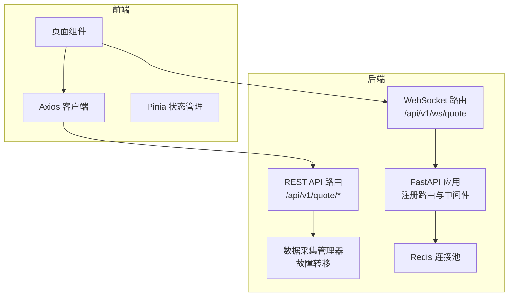
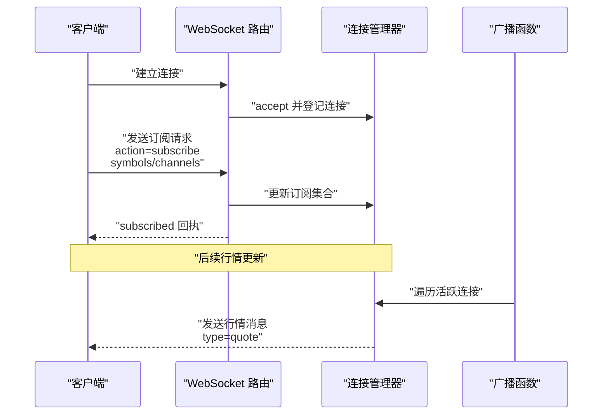
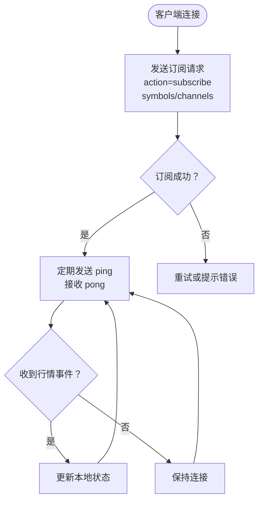
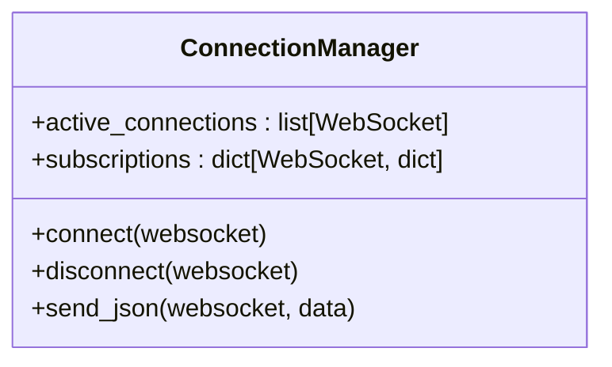
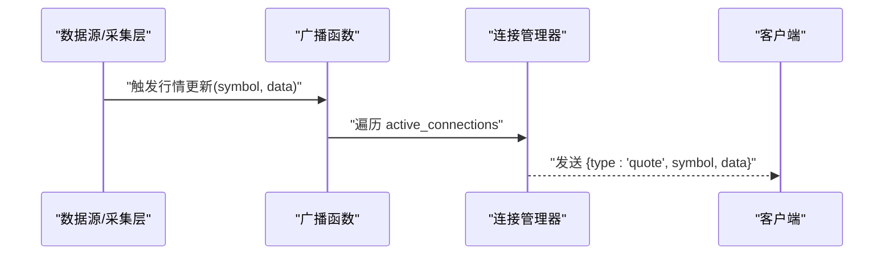
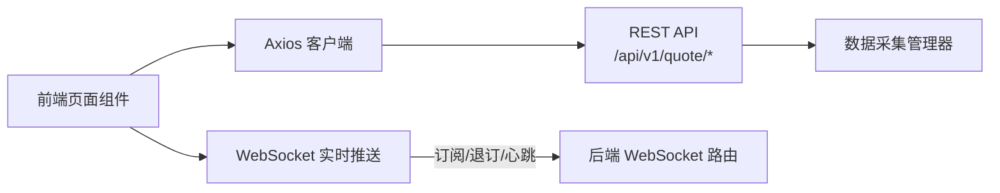
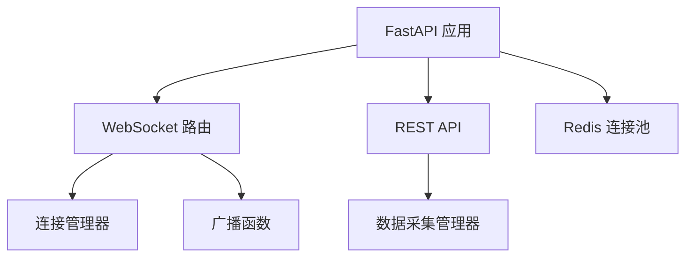

# WebSocket实时推送API

<cite>
**本文引用的文件**
- [backend/app/api/websocket.py](file://backend/app/api/websocket.py)
- [backend/app/main.py](file://backend/app/main.py)
- [backend/app/services/collector/manager.py](file://backend/app/services/collector/manager.py)
- [backend/app/core/redis.py](file://backend/app/core/redis.py)
- [frontend/src/api/index.ts](file://frontend/src/api/index.ts)
- [frontend/src/stores/quote.ts](file://frontend/src/stores/quote.ts)
- [README.md](file://README.md)
</cite>

## 目录
1. [简介](#简介)
2. [项目结构](#项目结构)
3. [核心组件](#核心组件)
4. [架构总览](#架构总览)
5. [详细组件分析](#详细组件分析)
6. [依赖分析](#依赖分析)
7. [性能考虑](#性能考虑)
8. [故障排查指南](#故障排查指南)
9. [结论](#结论)
10. [附录](#附录)

## 简介
本文件面向前端与全栈开发者，系统性文档化 Stock-View 的 WebSocket 实时推送 API。内容涵盖连接建立、消息格式、事件类型、心跳与断线重连、订阅机制、消息序列化与传输安全、以及性能优化与并发连接管理建议。当前后端通过 FastAPI 提供 WebSocket 路由，前端通过 Axios 访问 REST API，并可结合 WebSocket 实现实时行情推送。

## 项目结构
- 后端采用 FastAPI 应用，注册 WebSocket 路由与 REST API 路由；WebSocket 路由位于统一前缀下，便于部署与反向代理整合。
- 前端使用 Axios 作为 REST 客户端，Pinia 管理状态，页面组件负责调用 API 与渲染数据。
- 数据采集层通过多数据源（如东方财富、新浪）进行故障转移，确保行情数据可用性。

图表来源
- [backend/app/main.py:22-43](file://backend/app/main.py#L22-L43)
- [backend/app/api/websocket.py:39-65](file://backend/app/api/websocket.py#L39-L65)
- [backend/app/services/collector/manager.py:12-94](file://backend/app/services/collector/manager.py#L12-L94)
- [backend/app/core/redis.py:10-24](file://backend/app/core/redis.py#L10-L24)
- [frontend/src/api/index.ts:3-14](file://frontend/src/api/index.ts#L3-L14)
- [frontend/src/stores/quote.ts:5-43](file://frontend/src/stores/quote.ts#L5-L43)

章节来源
- [backend/app/main.py:22-43](file://backend/app/main.py#L22-L43)
- [README.md:92-126](file://README.md#L92-L126)

## 核心组件
- WebSocket 连接管理器：维护活动连接与订阅集合，支持订阅/退订、发送 JSON、断开清理。
- WebSocket 路由：提供“/api/v1/ws/quote”端点，处理订阅、退订、心跳与消息广播。
- REST API：提供行情查询接口，用于非实时场景或初始化数据。
- 数据采集管理器：封装多个数据源，按优先级自动故障转移。
- Redis：提供异步连接池，供后端缓存与会话管理使用。

章节来源
- [backend/app/api/websocket.py:12-36](file://backend/app/api/websocket.py#L12-L36)
- [backend/app/api/websocket.py:39-65](file://backend/app/api/websocket.py#L39-L65)
- [backend/app/api/websocket.py:67-79](file://backend/app/api/websocket.py#L67-L79)
- [backend/app/services/collector/manager.py:12-94](file://backend/app/services/collector/manager.py#L12-L94)
- [backend/app/core/redis.py:10-24](file://backend/app/core/redis.py#L10-L24)

## 架构总览
WebSocket 实时推送整体流程：
- 客户端通过 WebSocket 连接到后端指定端点。
- 客户端发送订阅请求，声明需要订阅的股票代码集合与频道。
- 后端将客户端加入连接池与订阅集合，并回执订阅成功。
- 当有行情更新时，后端根据订阅信息向对应客户端广播消息。
- 客户端接收消息后更新本地状态，实现界面实时刷新。

图表来源
- [backend/app/api/websocket.py:19-36](file://backend/app/api/websocket.py#L19-L36)
- [backend/app/api/websocket.py:40-65](file://backend/app/api/websocket.py#L40-L65)
- [backend/app/api/websocket.py:67-79](file://backend/app/api/websocket.py#L67-L79)

## 详细组件分析

### WebSocket 连接与消息协议
- 连接端点：/api/v1/ws/quote
- 握手协议：标准 WebSocket 握手，后端接受连接后进入消息循环。
- 心跳机制：客户端发送 ping，后端回送 pong 并附带时间戳。
- 断线重连：客户端监听连接断开事件，按指数退避策略重连；后端在异常发送失败时主动断开无效连接。
- 订阅/退订：客户端发送 JSON，包含 action（subscribe/unsubscribe）、symbols（股票代码数组）、channels（频道集合）。
- 广播：后端根据订阅集合筛选目标客户端并发送 JSON 消息，消息包含 type、symbol、data 字段。

图表来源
- [backend/app/api/websocket.py:39-65](file://backend/app/api/websocket.py#L39-L65)
- [backend/app/api/websocket.py:67-79](file://backend/app/api/websocket.py#L67-L79)

章节来源
- [backend/app/api/websocket.py:39-65](file://backend/app/api/websocket.py#L39-L65)
- [backend/app/api/websocket.py:67-79](file://backend/app/api/websocket.py#L67-L79)

### 连接管理器与订阅模型
- 连接管理器维护两个结构：
  - 活跃连接列表：用于遍历广播。
  - 订阅映射：每个连接维护 symbols 与 channels 的集合，用于过滤广播。
- 发送 JSON 时若发生异常，立即断开连接，避免资源泄漏。
- 断开时从活跃连接与订阅映射中移除。

图表来源
- [backend/app/api/websocket.py:12-36](file://backend/app/api/websocket.py#L12-L36)

章节来源
- [backend/app/api/websocket.py:12-36](file://backend/app/api/websocket.py#L12-L36)

### 广播与事件类型
- 广播函数根据 symbol 与 channels 进行匹配，向满足条件的客户端发送 JSON。
- 当前事件类型包括：
  - 行情事件：type=quote，携带 symbol 与 data（具体字段由数据采集层提供）。
- 其他事件类型（如自选股变动、系统公告）在当前代码中未实现，可在后续扩展中增加相应 type 与处理逻辑。

图表来源
- [backend/app/api/websocket.py:67-79](file://backend/app/api/websocket.py#L67-L79)

章节来源
- [backend/app/api/websocket.py:67-79](file://backend/app/api/websocket.py#L67-L79)

### REST API 与前端集成
- 前端通过 Axios 客户端访问 REST API，基础路径为 /api/v1。
- 行情相关接口包括：实时行情、行情列表、K线、分时、盘口。
- 前端 Pinia Store 负责管理行情列表、当前行情与加载状态，支持更新指定股票的数据。

图表来源
- [frontend/src/api/index.ts:3-14](file://frontend/src/api/index.ts#L3-L14)
- [frontend/src/stores/quote.ts:5-43](file://frontend/src/stores/quote.ts#L5-L43)
- [backend/app/api/websocket.py:39-65](file://backend/app/api/websocket.py#L39-L65)

章节来源
- [frontend/src/api/index.ts:3-14](file://frontend/src/api/index.ts#L3-L14)
- [frontend/src/stores/quote.ts:5-43](file://frontend/src/stores/quote.ts#L5-L43)
- [backend/app/api/websocket.py:39-65](file://backend/app/api/websocket.py#L39-L65)

## 依赖分析
- WebSocket 路由依赖连接管理器与订阅映射，实现按连接维度的订阅控制。
- 广播函数依赖连接管理器的活跃连接与订阅集合，实现定向推送。
- REST API 依赖数据采集管理器，后者封装多个数据源并执行故障转移。
- Redis 连接池为后端提供异步连接，减少连接开销与提升并发能力。

图表来源
- [backend/app/api/websocket.py:12-36](file://backend/app/api/websocket.py#L12-L36)
- [backend/app/api/websocket.py:67-79](file://backend/app/api/websocket.py#L67-L79)
- [backend/app/services/collector/manager.py:12-94](file://backend/app/services/collector/manager.py#L12-L94)
- [backend/app/core/redis.py:10-24](file://backend/app/core/redis.py#L10-L24)
- [backend/app/main.py:22-43](file://backend/app/main.py#L22-L43)

章节来源
- [backend/app/api/websocket.py:12-36](file://backend/app/api/websocket.py#L12-L36)
- [backend/app/api/websocket.py:67-79](file://backend/app/api/websocket.py#L67-L79)
- [backend/app/services/collector/manager.py:12-94](file://backend/app/services/collector/manager.py#L12-L94)
- [backend/app/core/redis.py:10-24](file://backend/app/core/redis.py#L10-L24)
- [backend/app/main.py:22-43](file://backend/app/main.py#L22-L43)

## 性能考虑
- 连接池与并发
  - 使用 Redis 异步连接池，降低连接建立成本，提升高并发下的响应速度。
  - 连接管理器以字典与集合维护订阅，查找与更新的时间复杂度为 O(1)。
- 广播效率
  - 广播时按订阅集合过滤目标客户端，避免对所有连接进行全量发送。
  - 对发送异常的连接及时断开，减少无效 IO。
- 心跳与保活
  - 客户端应定期发送 ping，后端回送 pong，用于检测连接健康。
  - 若长时间无消息，客户端应主动断开并重连，避免占用资源。
- 压缩与序列化
  - 当前使用标准 JSON 序列化；对于高频行情数据，可考虑二进制序列化或压缩策略（如 gzip）以降低带宽占用。
- 资源回收
  - 应用生命周期结束时关闭 Redis 连接池，释放底层资源。

章节来源
- [backend/app/core/redis.py:10-24](file://backend/app/core/redis.py#L10-L24)
- [backend/app/api/websocket.py:12-36](file://backend/app/api/websocket.py#L12-L36)
- [backend/app/api/websocket.py:67-79](file://backend/app/api/websocket.py#L67-L79)

## 故障排查指南
- 连接失败
  - 检查后端是否正确注册 WebSocket 路由与 CORS 中间件。
  - 确认前端连接 URL 是否为 /api/v1/ws/quote。
- 订阅无效
  - 确认发送的 JSON 包含 action、symbols、channels 字段。
  - 确认 channels 中包含 quote，否则不会收到行情事件。
- 心跳异常
  - 客户端需定时发送 ping；若长时间无响应，后端会断开连接。
- 广播无数据
  - 检查 symbol 是否存在于订阅集合；检查 channels 是否包含 quote。
  - 确认数据采集层正常工作，能够返回有效行情数据。
- 资源泄漏
  - 若出现内存或连接增长，检查异常发送分支是否正确断开连接。

章节来源
- [backend/app/main.py:22-43](file://backend/app/main.py#L22-L43)
- [backend/app/api/websocket.py:39-65](file://backend/app/api/websocket.py#L39-L65)
- [backend/app/api/websocket.py:67-79](file://backend/app/api/websocket.py#L67-L79)

## 结论
Stock-View 的 WebSocket 实时推送 API 已具备基础的连接管理、订阅控制与行情广播能力。建议在生产环境中补充断线重连策略、心跳保活、消息压缩与事件类型扩展（如自选股变动、系统公告），并结合 Redis 连接池与高效广播算法进一步优化性能。

## 附录

### 接口与消息规范

- 连接地址
  - ws://<host>/api/v1/ws/quote
  - 说明：请将 host 替换为实际部署域名或 IP；若通过反向代理，请确保 WebSocket 协议被正确转发。

- 握手协议
  - 使用标准 WebSocket 握手，后端 accept 后进入消息循环。

- 心跳机制
  - 客户端发送 ping，后端回送 pong，并附带时间戳。

- 订阅/退订
  - 请求字段
    - action: subscribe 或 unsubscribe
    - symbols: 股票代码数组
    - channels: 频道集合，当前支持 quote
  - 成功回执
    - action: subscribed
    - symbols: 订阅成功的股票代码数组
    - channels: 订阅成功的频道数组

- 行情事件
  - 消息字段
    - type: quote
    - symbol: 股票代码
    - data: 行情数据对象（字段由数据采集层决定）

- 错误处理
  - 发送失败时，后端断开连接；客户端监听断开事件并重连。
  - 心跳超时或网络异常时，客户端按指数退避策略重连。

章节来源
- [backend/app/api/websocket.py:39-65](file://backend/app/api/websocket.py#L39-L65)
- [backend/app/api/websocket.py:67-79](file://backend/app/api/websocket.py#L67-L79)

### 前端集成要点
- Axios 客户端基础路径为 /api/v1，用于 REST API。
- WebSocket 连接独立于 REST API，使用 /api/v1/ws/quote。
- 建议在页面组件中：
  - 初始化时建立 WebSocket 连接并发送订阅请求。
  - 收到行情事件后更新 Pinia Store 中的对应股票数据。
  - 实现断线重连与心跳保活逻辑。

章节来源
- [frontend/src/api/index.ts:3-14](file://frontend/src/api/index.ts#L3-L14)
- [frontend/src/stores/quote.ts:5-43](file://frontend/src/stores/quote.ts#L5-L43)