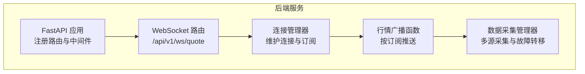
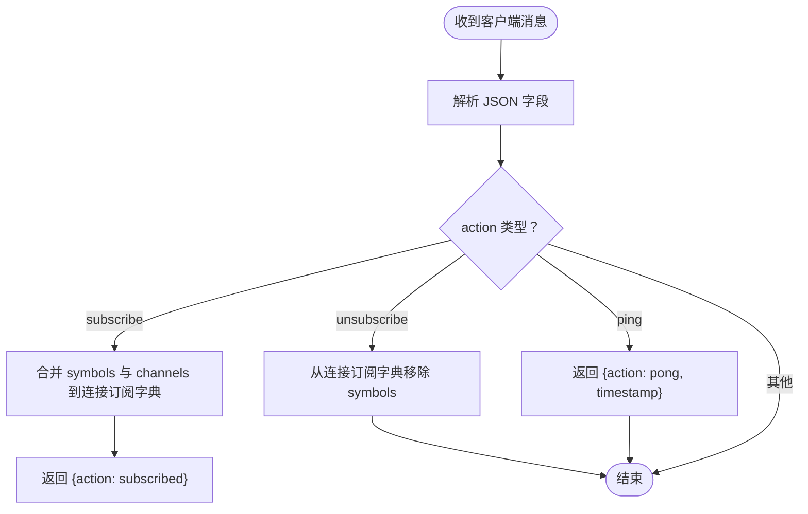
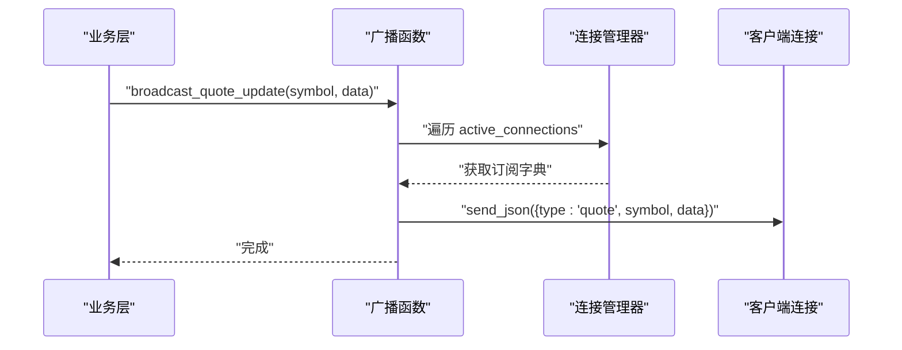

# WebSocket实时推送接口

<cite>
**本文引用的文件**
- [backend/app/api/websocket.py](file://backend/app/api/websocket.py)
- [backend/app/main.py](file://backend/app/main.py)
- [backend/app/core/config.py](file://backend/app/core/config.py)
- [backend/app/schemas/schemas.py](file://backend/app/schemas/schemas.py)
- [backend/app/services/collector/manager.py](file://backend/app/services/collector/manager.py)
- [backend/app/ai/interface.py](file://backend/app/ai/interface.py)
</cite>

## 目录
1. [简介](#简介)
2. [项目结构](#项目结构)
3. [核心组件](#核心组件)
4. [架构总览](#架构总览)
5. [详细组件分析](#详细组件分析)
6. [依赖分析](#依赖分析)
7. [性能考虑](#性能考虑)
8. [故障排查指南](#故障排查指南)
9. [结论](#结论)
10. [附录](#附录)

## 简介
本文件面向Stock-View项目的WebSocket实时推送接口，系统化说明连接建立、消息格式、订阅管理、断线重连策略、推送触发与频率控制、客户端示例以及常见错误与处理建议。当前实现提供“/api/v1/ws/quote”端点用于行情推送，支持订阅/退订、心跳保活与广播推送。

## 项目结构
WebSocket相关代码集中在后端模块中，主要涉及：
- 应用入口与路由注册：FastAPI应用、CORS中间件、路由挂载
- WebSocket端点与连接管理：连接接受、订阅字典维护、消息发送与断开清理
- 行情数据采集：多数据源采集器与优先级切换
- 模型与响应结构：行情项、K线、分时、盘口等数据模型
- 配置中心：采集间隔、缓存TTL、JWT等运行参数



图表来源
- [backend/app/main.py:22-43](file://backend/app/main.py#L22-L43)
- [backend/app/api/websocket.py:12-36](file://backend/app/api/websocket.py#L12-L36)
- [backend/app/api/websocket.py:39-65](file://backend/app/api/websocket.py#L39-L65)
- [backend/app/api/websocket.py:67-79](file://backend/app/api/websocket.py#L67-L79)
- [backend/app/services/collector/manager.py:12-80](file://backend/app/services/collector/manager.py#L12-L80)

章节来源
- [backend/app/main.py:1-48](file://backend/app/main.py#L1-L48)
- [backend/app/api/websocket.py:1-79](file://backend/app/api/websocket.py#L1-L79)
- [backend/app/services/collector/manager.py:1-80](file://backend/app/services/collector/manager.py#L1-L80)

## 核心组件
- 连接管理器（ConnectionManager）
  - 维护活跃连接列表与每个连接的订阅信息（股票集合、频道集合）
  - 提供连接接入、断开清理、JSON消息发送（异常时自动断开）
- WebSocket端点（/api/v1/ws/quote）
  - 接受客户端连接，循环接收JSON消息
  - 支持动作：订阅、退订、心跳（ping/pong）
  - 广播函数根据订阅匹配向客户端推送行情消息
- 行情广播（broadcast_quote_update）
  - 将行情更新封装为统一消息格式，按订阅过滤后发送
- 数据采集（CollectorManager）
  - 多数据源采集器（优先级：东方财富 > 新浪），失败自动切换
  - 提供实时行情、K线、分时、盘口等数据获取能力

章节来源
- [backend/app/api/websocket.py:12-36](file://backend/app/api/websocket.py#L12-L36)
- [backend/app/api/websocket.py:39-65](file://backend/app/api/websocket.py#L39-L65)
- [backend/app/api/websocket.py:67-79](file://backend/app/api/websocket.py#L67-L79)
- [backend/app/services/collector/manager.py:12-80](file://backend/app/services/collector/manager.py#L12-L80)

## 架构总览
WebSocket实时推送的整体流程如下：
- 客户端通过HTTP升级建立WebSocket连接至“/api/v1/ws/quote”
- 服务器接受连接并进入消息循环，等待客户端指令（订阅/退订/心跳）
- 业务层定期或事件驱动地调用广播函数，将行情数据按订阅过滤后推送给对应客户端
- 客户端负责断线重连与消息处理

```mermaid
sequenceDiagram
participant Client as "客户端"
participant WS as "WebSocket端点"
participant CM as "连接管理器"
participant BR as "广播函数"
participant DM as "数据采集管理器"
Client->>WS : "建立连接 /api/v1/ws/quote"
WS->>CM : "connect(websocket)"
CM-->>WS : "接受连接并登记订阅字典"
Client->>WS : "发送 {action : subscribe, symbols : [], channels : []}"
WS->>CM : "更新订阅字典"
WS-->>Client : "{action : subscribed}"
DM-->>BR : "触发行情更新"
BR->>CM : "遍历活跃连接"
CM-->>Client : "发送 {type : quote, symbol, data}"
Client->>WS : "发送 {action : ping}"
WS-->>Client : "{action : pong, timestamp}"
Client--/WS : "断开连接"
WS->>CM : "disconnect(websocket)"
```

图表来源
- [backend/app/api/websocket.py:19-27](file://backend/app/api/websocket.py#L19-L27)
- [backend/app/api/websocket.py:40-65](file://backend/app/api/websocket.py#L40-L65)
- [backend/app/api/websocket.py:67-79](file://backend/app/api/websocket.py#L67-L79)
- [backend/app/services/collector/manager.py:21-32](file://backend/app/services/collector/manager.py#L21-L32)

## 详细组件分析

### 连接与握手
- 连接URL
  - WebSocket端点路径：/api/v1/ws/quote
  - 由FastAPI路由注册，前缀为/api/v1
- 握手协议
  - 使用FastAPI内置WebSocket握手，无需额外自定义协议
- 认证机制
  - 当前WebSocket端点未实现认证拦截；如需鉴权，可在连接建立后增加令牌校验逻辑

章节来源
- [backend/app/main.py:38-43](file://backend/app/main.py#L38-L43)
- [backend/app/api/websocket.py:39-41](file://backend/app/api/websocket.py#L39-L41)

### 消息格式规范
- 通用字段
  - action：字符串，表示操作类型
    - subscribe：请求订阅
    - unsubscribe：请求退订
    - ping：心跳请求
    - subscribed：订阅成功响应
    - pong：心跳响应
  - symbols：数组，目标股票代码集合
  - channels：数组，频道集合（当前实现包含“quote”）
- 广播消息（推送）
  - type：固定值“quote”，标识消息类型
  - symbol：推送的股票代码
  - data：行情数据对象（见下节Schema）

章节来源
- [backend/app/api/websocket.py:40-65](file://backend/app/api/websocket.py#L40-L65)
- [backend/app/api/websocket.py:67-79](file://backend/app/api/websocket.py#L67-L79)

### 订阅与退订机制
- 订阅参数
  - symbols：要订阅的股票代码数组
  - channels：订阅的频道数组（当前实现使用“quote”）
- 订阅ID
  - 当前实现未生成独立订阅ID；订阅状态绑定到WebSocket连接对象
- 退订流程
  - 发送action为“unsubscribe”的消息，携带symbols数组
  - 服务器从该连接的订阅集合中移除对应股票
- 订阅确认
  - 成功订阅后，服务器返回action为“subscribed”的确认消息



图表来源
- [backend/app/api/websocket.py:40-65](file://backend/app/api/websocket.py#L40-L65)

章节来源
- [backend/app/api/websocket.py:40-65](file://backend/app/api/websocket.py#L40-L65)

### 心跳与保活
- 客户端发送action为“ping”的消息
- 服务器返回action为“pong”的消息，包含时间戳
- 建议客户端在长时间无活动时主动发送ping，避免代理/防火墙误判

章节来源
- [backend/app/api/websocket.py:60-61](file://backend/app/api/websocket.py#L60-L61)

### 广播推送与过滤
- 触发条件
  - 业务层调用广播函数（按股票代码与行情数据）
- 过滤逻辑
  - 仅向订阅了该股票且频道包含“quote”的连接推送
- 异常处理
  - 发送失败时自动断开该连接，避免阻塞其他推送



图表来源
- [backend/app/api/websocket.py:67-79](file://backend/app/api/websocket.py#L67-L79)

章节来源
- [backend/app/api/websocket.py:67-79](file://backend/app/api/websocket.py#L67-L79)

### 数据模型与消息体
- 行情项（QuoteItem）
  - 字段：symbol、name、market、price、change、change_pct、open、high、low、prev_close、volume、amount、turnover_rate、timestamp
- K线项（KlineItem）
  - 字段：date、open、high、low、close、volume、amount、change_pct
- 分时点（TimelinePoint）
  - 字段：time、price、avg、volume
- 盘口层级（OrderBookLevel）
  - 字段：level、price、volume

章节来源
- [backend/app/schemas/schemas.py:13-28](file://backend/app/schemas/schemas.py#L13-L28)
- [backend/app/schemas/schemas.py:34-43](file://backend/app/schemas/schemas.py#L34-L43)
- [backend/app/schemas/schemas.py:49-54](file://backend/app/schemas/schemas.py#L49-L54)
- [backend/app/schemas/schemas.py:60-64](file://backend/app/schemas/schemas.py#L60-L64)

### 断线重连策略
- 自动重连
  - 建议客户端在连接断开后进行指数回退重连（例如1s、2s、4s…上限30s）
- 重连间隔设置
  - 可参考配置中的采集间隔与缓存TTL，结合业务需求设定
- 断线检测
  - 服务器端在发送失败时会断开连接；客户端可结合心跳超时判断
- 状态恢复
  - 重连后重新发送订阅请求，恢复订阅状态

章节来源
- [backend/app/api/websocket.py:32-33](file://backend/app/api/websocket.py#L32-L33)
- [backend/app/core/config.py:29-30](file://backend/app/core/config.py#L29-L30)

### 推送频率控制
- 当前实现
  - 广播函数对每个连接逐一发送，未内置速率限制
- 建议策略
  - 增量推送：仅推送变化的字段
  - 批量推送：聚合多个股票的行情后一次性发送
  - 延迟推送：对高频股票设置最小推送间隔（如100ms）
  - 速率限制：对单连接每秒最大推送次数进行限制

章节来源
- [backend/app/api/websocket.py:67-79](file://backend/app/api/websocket.py#L67-L79)
- [backend/app/core/config.py:29-30](file://backend/app/core/config.py#L29-L30)

### 客户端连接示例（路径指引）
以下为各语言的连接与消息处理示例路径，请在对应文件中查看具体实现细节：
- JavaScript（浏览器/Node.js）
  - 连接与消息处理示例：[示例路径:39-65](file://backend/app/api/websocket.py#L39-L65)
- Python（标准库/异步）
  - 连接与消息处理示例：[示例路径:39-65](file://backend/app/api/websocket.py#L39-L65)
- 移动端（Android/iOS）
  - 连接与消息处理示例：[示例路径:39-65](file://backend/app/api/websocket.py#L39-L65)

章节来源
- [backend/app/api/websocket.py:39-65](file://backend/app/api/websocket.py#L39-L65)

### 常见错误与异常处理
- WebSocketDisconnect
  - 服务器端捕获断开异常并清理连接
- 发送异常
  - 发送JSON失败时自动断开连接，避免阻塞
- 心跳异常
  - 客户端应设置心跳超时，超时后执行重连
- 业务错误
  - 行情数据为空时，返回通用响应结构（code/message/data）

章节来源
- [backend/app/api/websocket.py:63-64](file://backend/app/api/websocket.py#L63-L64)
- [backend/app/api/websocket.py:32-33](file://backend/app/api/websocket.py#L32-L33)
- [backend/app/schemas/schemas.py:7-10](file://backend/app/schemas/schemas.py#L7-L10)

## 依赖分析
- WebSocket端点依赖连接管理器维护订阅状态
- 广播函数依赖连接管理器遍历活跃连接
- 业务层通过调用广播函数实现推送
- 数据采集管理器提供行情数据源，支撑推送内容


图表来源
- [backend/app/api/websocket.py:12-36](file://backend/app/api/websocket.py#L12-L36)
- [backend/app/api/websocket.py:39-65](file://backend/app/api/websocket.py#L39-L65)
- [backend/app/api/websocket.py:67-79](file://backend/app/api/websocket.py#L67-L79)
- [backend/app/services/collector/manager.py:12-80](file://backend/app/services/collector/manager.py#L12-L80)

章节来源
- [backend/app/api/websocket.py:12-36](file://backend/app/api/websocket.py#L12-L36)
- [backend/app/api/websocket.py:39-65](file://backend/app/api/websocket.py#L39-L65)
- [backend/app/api/websocket.py:67-79](file://backend/app/api/websocket.py#L67-L79)
- [backend/app/services/collector/manager.py:12-80](file://backend/app/services/collector/manager.py#L12-L80)

## 性能考虑
- 连接数与内存占用
  - 每个连接保存订阅集合，建议限制单用户最大订阅数
- 广播效率
  - 广播函数遍历活跃连接，建议按股票维度缓存订阅者集合
- 发送失败处理
  - 发送异常即断开连接，避免阻塞后续推送
- 采集与推送节奏
  - 结合配置中的采集间隔与缓存TTL，合理设置推送频率

章节来源
- [backend/app/api/websocket.py:67-79](file://backend/app/api/websocket.py#L67-L79)
- [backend/app/core/config.py:29-30](file://backend/app/core/config.py#L29-L30)

## 故障排查指南
- 无法建立连接
  - 检查路由是否正确挂载（/api/v1/ws/quote）
  - 检查CORS配置是否允许跨域
- 订阅无效
  - 确认发送的symbols与channels格式正确
  - 确认频道名称为“quote”
- 心跳失效
  - 客户端应定期发送ping，服务器返回pong
- 推送不到
  - 检查广播函数是否被调用
  - 检查订阅字典中是否包含目标股票与频道
- 发送异常
  - 服务器端会自动断开异常连接，客户端需重连

章节来源
- [backend/app/main.py:29-43](file://backend/app/main.py#L29-L43)
- [backend/app/api/websocket.py:40-65](file://backend/app/api/websocket.py#L40-L65)
- [backend/app/api/websocket.py:67-79](file://backend/app/api/websocket.py#L67-L79)

## 结论
Stock-View的WebSocket实时推送接口提供了简洁高效的连接管理、订阅/退订与心跳保活机制，并以统一的消息格式实现行情广播。建议在生产环境中补充认证、速率限制与断线重连策略，以提升安全性与稳定性。

## 附录
- 运行参数参考
  - 采集间隔：QUOTE_COLLECT_INTERVAL（秒）
  - 缓存TTL：QUOTE_CACHE_TTL（秒）
  - JWT配置：JWT_SECRET_KEY、JWT_ALGORITHM、JWT_EXPIRE_MINUTES

章节来源
- [backend/app/core/config.py:29-34](file://backend/app/core/config.py#L29-L34)