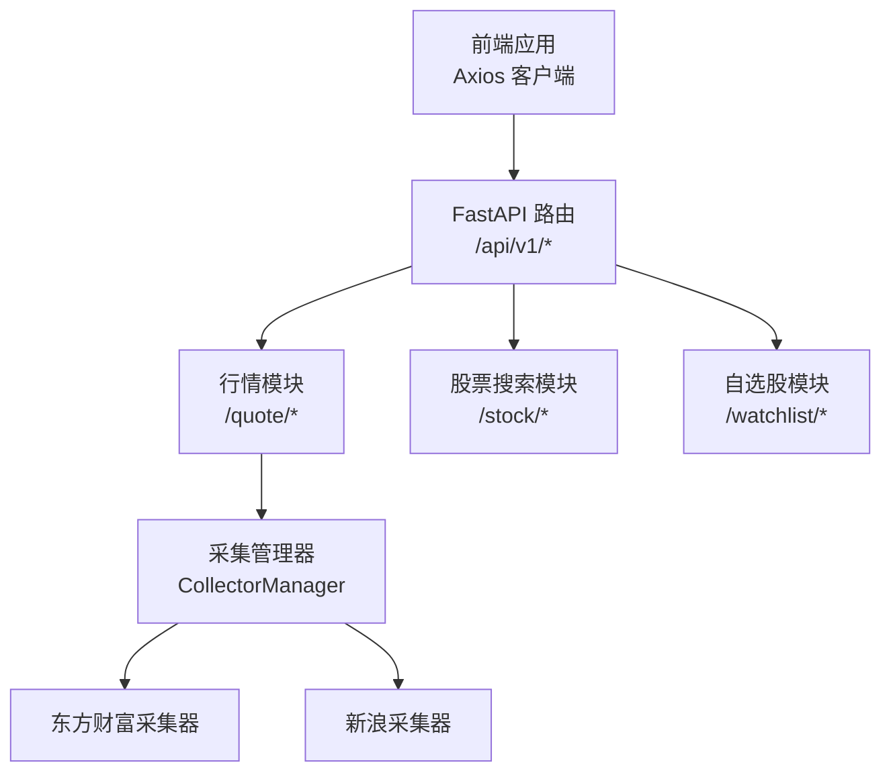
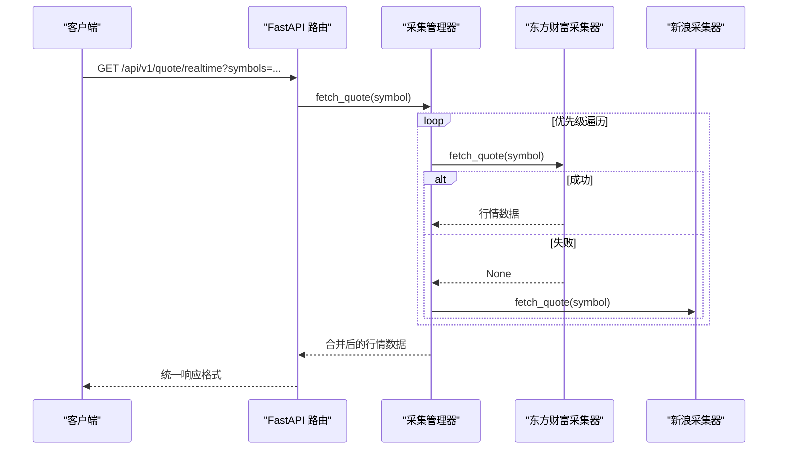
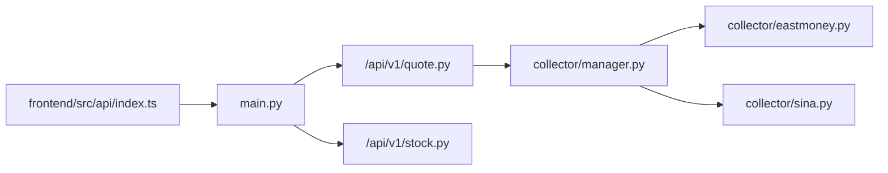

# 股票信息API

<cite>
**本文引用的文件**
- [backend/app/api/v1/stock.py](file://backend/app/api/v1/stock.py)
- [backend/app/api/v1/quote.py](file://backend/app/api/v1/quote.py)
- [backend/app/schemas/schemas.py](file://backend/app/schemas/schemas.py)
- [backend/app/services/collector/manager.py](file://backend/app/services/collector/manager.py)
- [backend/app/services/collector/eastmoney.py](file://backend/app/services/collector/eastmoney.py)
- [backend/app/services/collector/base.py](file://backend/app/services/collector/base.py)
- [backend/app/main.py](file://backend/app/main.py)
- [frontend/src/api/index.ts](file://frontend/src/api/index.ts)
- [frontend/src/pages/SearchPage.vue](file://frontend/src/pages/SearchPage.vue)
- [frontend/src/stores/quote.ts](file://frontend/src/stores/quote.ts)
- [backend/app/core/config.py](file://backend/app/core/config.py)
- [README.md](file://README.md)
</cite>

## 目录
1. [简介](#简介)
2. [项目结构](#项目结构)
3. [核心组件](#核心组件)
4. [架构总览](#架构总览)
5. [详细组件分析](#详细组件分析)
6. [依赖分析](#依赖分析)
7. [性能考虑](#性能考虑)
8. [故障排查指南](#故障排查指南)
9. [结论](#结论)
10. [附录](#附录)

## 简介
本文件面向前端与全栈开发者，系统化梳理 Stock-View 的股票信息 API，重点覆盖“股票搜索”和“股票基本信息查询（实时行情）”两大能力，并补充行情列表、K线、分时、盘口等接口的规范要点。文档明确 HTTP 方法、URL 路径、查询参数、请求格式、响应结构、字段含义、错误处理、分页参数、调用频率限制、缓存策略与性能优化建议，帮助快速、稳定地完成接口集成。

## 项目结构
- 后端基于 FastAPI，路由按模块划分：/api/v1/quote（行情）、/api/v1/stock（股票搜索）、/api/v1/watchlist（自选股）等。
- 前端通过 axios 客户端封装统一的 API 调用，路由前缀为 /api/v1。
- 数据采集层采用多数据源（东方财富、新浪），具备主备自动切换与重试机制。

图表来源
- [backend/app/main.py:39-43](file://backend/app/main.py#L39-L43)
- [backend/app/api/v1/quote.py:1-65](file://backend/app/api/v1/quote.py#L1-L65)
- [backend/app/api/v1/stock.py:1-37](file://backend/app/api/v1/stock.py#L1-L37)
- [backend/app/services/collector/manager.py:12-94](file://backend/app/services/collector/manager.py#L12-L94)

章节来源
- [backend/app/main.py:39-43](file://backend/app/main.py#L39-L43)
- [README.md:92-126](file://README.md#L92-L126)

## 核心组件
- 股票搜索接口：对接第三方搜索建议服务，过滤 A 股，返回标准化结果。
- 实时行情接口：支持批量查询，最多 50 只股票；内置主备数据源自动切换。
- 行情列表、K 线、分时、盘口：统一返回结构，错误码约定清晰。
- 响应统一格式：包含 code、message、data 字段；data 为空时返回 null。
- 错误码：0 成功；1001 参数错误；1002 股票代码不存在；1003 数据源暂不可用；2001 认证失败；2002 请求频率超限；3001/3002 AI 服务相关；5000 服务器内部错误。

章节来源
- [backend/app/api/v1/stock.py:10-37](file://backend/app/api/v1/stock.py#L10-L37)
- [backend/app/api/v1/quote.py:7-65](file://backend/app/api/v1/quote.py#L7-L65)
- [backend/app/schemas/schemas.py:6-103](file://backend/app/schemas/schemas.py#L6-L103)

## 架构总览
后端采用“路由 → 采集管理器 → 多数据源”的分层设计。采集管理器按优先级依次尝试数据源，任一成功即返回；若全部失败则返回空，上层统一映射为错误码。

图表来源
- [backend/app/api/v1/quote.py:8-16](file://backend/app/api/v1/quote.py#L8-L16)
- [backend/app/services/collector/manager.py:21-33](file://backend/app/services/collector/manager.py#L21-L33)
- [backend/app/services/collector/eastmoney.py:69-85](file://backend/app/services/collector/eastmoney.py#L69-L85)

## 详细组件分析

### 股票搜索接口
- 功能：支持通过股票代码或拼音首字母搜索 A 股，返回标准化结果。
- HTTP 方法与路径：GET /api/v1/stock/search
- 查询参数
  - keyword：必填，搜索关键词（股票代码或拼音首字母）
  - limit：可选，默认 10，范围 [1, 20]
- 请求格式：无请求体，查询参数拼接在 URL 上
- 响应结构
  - code：0 成功
  - message："success"
  - data.items：数组，元素包含 symbol、name、market、pinyin
- 股票代码格式与过滤
  - 仅返回 A 股：市场码为 0 或 1，且代码以 0/3/6 开头
  - market 字段：6 代码前缀对应 sh，否则 sz
- 错误处理
  - 外部接口异常时返回空数组，code 仍为 0
- 示例
  - 成功：返回 items 数组，每个元素包含 symbol、name、market、pinyin
  - 失败：外部接口异常时 items 为空数组

章节来源
- [backend/app/api/v1/stock.py:10-37](file://backend/app/api/v1/stock.py#L10-L37)
- [frontend/src/api/index.ts:16-18](file://frontend/src/api/index.ts#L16-L18)
- [frontend/src/pages/SearchPage.vue:28-35](file://frontend/src/pages/SearchPage.vue#L28-L35)

### 股票基本信息查询（实时行情）
- 功能：批量获取实时行情，最多 50 只股票
- HTTP 方法与路径：GET /api/v1/quote/realtime
- 查询参数
  - symbols：必填，逗号分隔的股票代码，最多 50 个
- 请求格式：无请求体，查询参数拼接在 URL 上
- 响应结构
  - code：0 成功
  - message："success"
  - data.items：数组，元素为行情对象
- 行情对象字段
  - symbol：股票代码
  - name：股票名称
  - market：市场 sh/sz
  - price：最新价
  - change：涨跌额
  - change_pct：涨跌幅%
  - open、high、low：开盘、最高、最低
  - prev_close：昨收
  - volume：成交量
  - amount：成交额
  - turnover_rate：换手率
  - timestamp：时间戳
- 错误处理
  - 若某只股票数据为空，将被忽略，最终返回可用项集合
- 示例
  - 成功：返回 items 数组，包含多只股票的实时行情
  - 失败：若所有数据源均不可用，上层逻辑可能映射为错误码（取决于具体调用链）

章节来源
- [backend/app/api/v1/quote.py:7-16](file://backend/app/api/v1/quote.py#L7-L16)
- [backend/app/schemas/schemas.py:13-28](file://backend/app/schemas/schemas.py#L13-L28)
- [frontend/src/api/index.ts:8-14](file://frontend/src/api/index.ts#L8-L14)
- [frontend/src/stores/quote.ts:24-30](file://frontend/src/stores/quote.ts#L24-L30)

### 行情列表（扩展）
- 功能：获取 A 股行情列表，支持分页与排序
- HTTP 方法与路径：GET /api/v1/quote/list
- 查询参数
  - market：可选，all/sh/sz，默认 all
  - sort_by：可选，change_pct/volume/amount/turnover，默认 change_pct
  - sort_order：可选，asc/desc，默认 desc
  - page：可选，页码，>=1
  - page_size：可选，每页数量 [1, 100]，默认 20
- 响应结构
  - data.items：列表项数组
  - data.total/page/page_size：分页信息
- 错误处理
  - 若数据源不可用，返回 code 1003

章节来源
- [backend/app/api/v1/quote.py:19-33](file://backend/app/api/v1/quote.py#L19-L33)

### K 线（扩展）
- 功能：获取 K 线数据
- HTTP 方法与路径：GET /api/v1/quote/kline
- 查询参数
  - symbol：必填，股票代码
  - period：可选，周期 1m/5m/15m/30m/60m/d/w/m，默认 d
  - fq_type：可选，复权 none/front/back，默认 front
  - limit：可选，数量 [1, 500]，默认 120
- 响应结构
  - data.symbol、data.period、data.fq_type
  - data.items：K 线数组，每项包含 date/open/close/high/low/volume/amount/change_pct
- 错误处理
  - 股票不存在或数据源不可用时返回 code 1002

章节来源
- [backend/app/api/v1/quote.py:36-47](file://backend/app/api/v1/quote.py#L36-L47)

### 分时（扩展）
- 功能：获取当日分时数据
- HTTP 方法与路径：GET /api/v1/quote/timeline
- 查询参数
  - symbol：必填，股票代码
- 响应结构
  - data.symbol、data.date、data.prev_close
  - data.points：分时点数组，每项包含 time/price/avg/volume
- 错误处理
  - 股票不存在或数据源不可用时返回 code 1002

章节来源
- [backend/app/api/v1/quote.py:50-56](file://backend/app/api/v1/quote.py#L50-L56)

### 盘口（扩展）
- 功能：获取买卖盘口数据
- HTTP 方法与路径：GET /api/v1/quote/orderbook
- 查询参数
  - symbol：必填，股票代码
- 响应结构
  - data.symbol、data.timestamp
  - data.asks/bids：各 5 档，每档包含 level/price/volume
- 错误处理
  - 股票不存在或数据源不可用时返回 code 1002

章节来源
- [backend/app/api/v1/quote.py:59-65](file://backend/app/api/v1/quote.py#L59-L65)

### 数据模型与响应结构
- 通用响应结构：code/message/data
- 行情项模型：包含价格、成交量、涨跌幅、时间戳等字段
- K 线项模型：包含日期、OHLC、成交量、涨跌幅等
- 分时点模型：包含时间、价格、均价、成交量
- 盘口模型：包含买卖盘各 5 档
- 股票搜索项模型：包含 symbol/name/market/pinyin

章节来源
- [backend/app/schemas/schemas.py:6-103](file://backend/app/schemas/schemas.py#L6-L103)

## 依赖分析
- 路由注册：后端在启动时注册 /api/v1 下的所有模块路由。
- 数据采集：采集管理器聚合多个数据源，按优先级自动切换。
- 前端调用：前端通过 axios 统一封装，统一前缀 /api/v1。

图表来源
- [backend/app/main.py:39-43](file://backend/app/main.py#L39-L43)
- [backend/app/services/collector/manager.py:12-94](file://backend/app/services/collector/manager.py#L12-L94)
- [frontend/src/api/index.ts:1-33](file://frontend/src/api/index.ts#L1-L33)

章节来源
- [backend/app/main.py:39-43](file://backend/app/main.py#L39-L43)
- [backend/app/services/collector/manager.py:12-94](file://backend/app/services/collector/manager.py#L12-L94)

## 性能考虑
- 调用频率限制
  - 行情数据接口：60 次/分钟
  - AI 分析接口：10 次/分钟
  - WebSocket 连接：每用户最多 3 个连接
- 缓存策略
  - 行情缓存 TTL：5 秒
  - AI 分析缓存：启用，TTL 300 秒
- 并发与重试
  - 东方财富采集器使用连接池与并发限制，请求失败自动重试
- 建议
  - 前端对高频搜索与列表刷新进行节流/防抖
  - 合理设置 page_size，避免一次性请求过多数据
  - 使用 symbols 批量查询替代多次单只查询

章节来源
- [backend/app/core/config.py:29-30](file://backend/app/core/config.py#L29-L30)
- [backend/app/core/config.py:22-24](file://backend/app/core/config.py#L22-L24)
- [backend/app/services/collector/eastmoney.py:32-39](file://backend/app/services/collector/eastmoney.py#L32-L39)

## 故障排查指南
- 常见错误码
  - 0：成功
  - 1001：参数错误
  - 1002：股票代码不存在
  - 1003：数据源暂不可用
  - 2001：认证失败
  - 2002：请求频率超限
  - 3001/3002：AI 服务相关
  - 5000：服务器内部错误
- 数据源问题
  - 若实时行情为空，检查 symbols 是否有效、是否超过 50 个
  - 若列表/数据为空，可能是数据源暂时不可用，稍后重试
- 前端集成
  - 确认 baseURL 为 /api/v1，确保代理正确转发
  - 对搜索输入进行防抖，避免频繁请求

章节来源
- [backend/app/api/v1/quote.py:31-33](file://backend/app/api/v1/quote.py#L31-L33)
- [backend/app/api/v1/quote.py:44-47](file://backend/app/api/v1/quote.py#L44-L47)
- [frontend/src/api/index.ts:3-6](file://frontend/src/api/index.ts#L3-L6)

## 结论
Stock-View 提供了简洁稳定的股票信息 API：股票搜索支持 A 股过滤与拼音首字母匹配；实时行情支持批量查询与主备数据源自动切换；其他行情数据接口（列表、K 线、分时、盘口）遵循统一响应格式与错误码约定。结合频率限制与缓存策略，可在保证性能的同时获得可靠的行情数据。

## 附录

### 接口一览表
- 股票搜索
  - 方法：GET
  - 路径：/api/v1/stock/search
  - 参数：keyword（必填）、limit（1-20，默认 10）
  - 响应：code/message/data{ items:[{ symbol,name,market,pinyin }] }
- 实时行情
  - 方法：GET
  - 路径：/api/v1/quote/realtime
  - 参数：symbols（必填，最多 50 个）
  - 响应：code/message/data{ items:[行情对象] }
- 行情列表
  - 方法：GET
  - 路径：/api/v1/quote/list
  - 参数：market（all/sh/sz）、sort_by（change_pct/volume/amount/turnover）、sort_order（asc/desc）、page（>=1）、page_size（1-100，默认 20）
  - 响应：code/message/data{ items,total,page,page_size }
- K 线
  - 方法：GET
  - 路径：/api/v1/quote/kline
  - 参数：symbol（必填）、period（1m/5m/15m/30m/60m/d/w/m，默认 d）、fq_type（none/front/back，默认 front）、limit（1-500，默认 120）
  - 响应：code/message/data{ symbol,period,fq_type,items:[K线对象] }
- 分时
  - 方法：GET
  - 路径：/api/v1/quote/timeline
  - 参数：symbol（必填）
  - 响应：code/message/data{ symbol,date,prev_close,points:[分时点] }
- 盘口
  - 方法：GET
  - 路径：/api/v1/quote/orderbook
  - 参数：symbol（必填）
  - 响应：code/message/data{ symbol,timestamp,asks:[],bids:[] }

章节来源
- [backend/app/api/v1/stock.py:10-37](file://backend/app/api/v1/stock.py#L10-L37)
- [backend/app/api/v1/quote.py:7-65](file://backend/app/api/v1/quote.py#L7-L65)