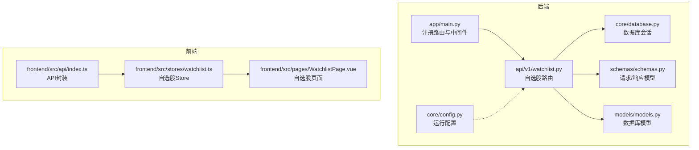
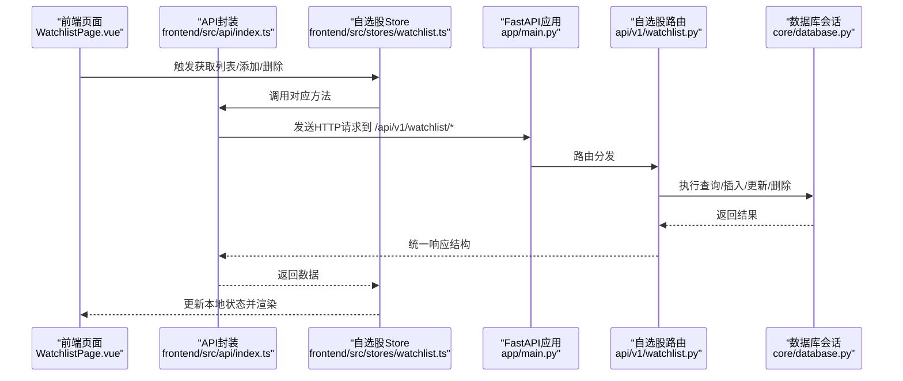
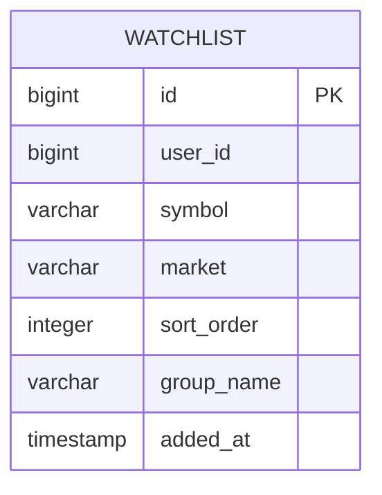
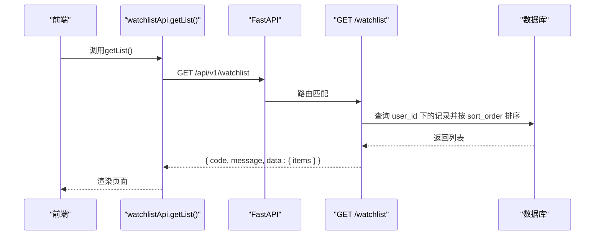
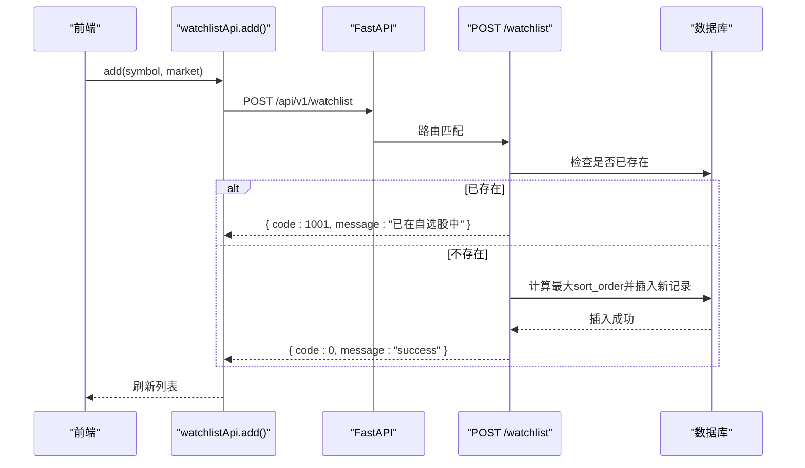
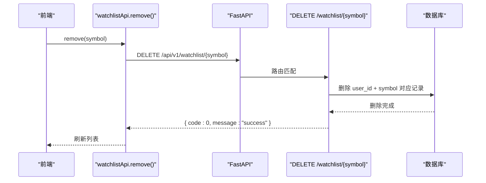
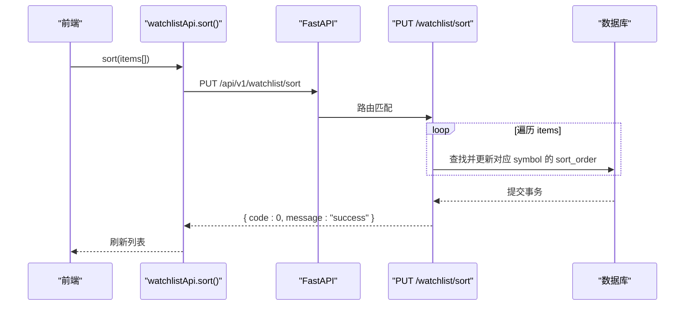
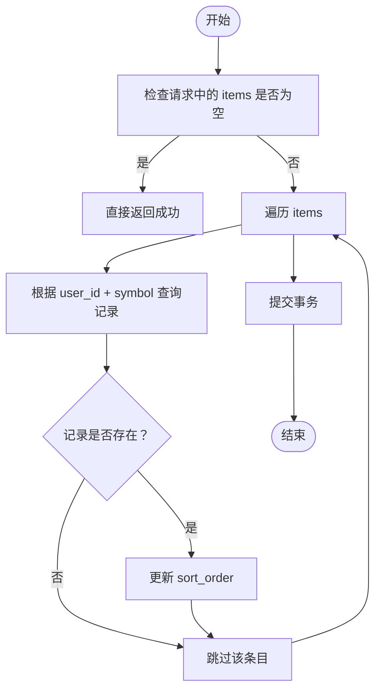
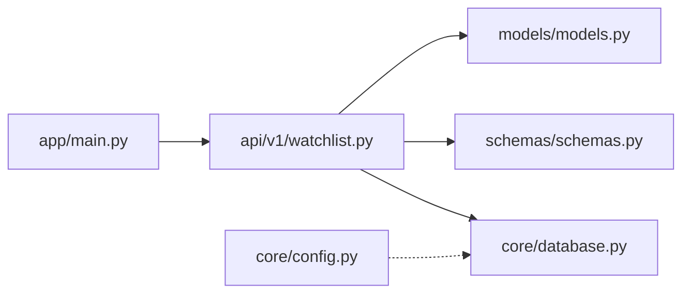

# 自选股API

<cite>
**本文引用的文件**
- [backend/app/api/v1/watchlist.py](file://backend/app/api/v1/watchlist.py)
- [backend/app/schemas/schemas.py](file://backend/app/schemas/schemas.py)
- [backend/app/models/models.py](file://backend/app/models/models.py)
- [backend/app/main.py](file://backend/app/main.py)
- [backend/app/core/database.py](file://backend/app/core/database.py)
- [backend/app/core/config.py](file://backend/app/core/config.py)
- [frontend/src/api/index.ts](file://frontend/src/api/index.ts)
- [frontend/src/stores/watchlist.ts](file://frontend/src/stores/watchlist.ts)
- [frontend/src/pages/WatchlistPage.vue](file://frontend/src/pages/WatchlistPage.vue)
- [backend/Stock-View 软件开发文档/开发文档.md](file://Stock-View 软件开发文档/开发文档.md)
</cite>

## 目录
1. [简介](#简介)
2. [项目结构](#项目结构)
3. [核心组件](#核心组件)
4. [架构总览](#架构总览)
5. [详细组件分析](#详细组件分析)
6. [依赖分析](#依赖分析)
7. [性能考虑](#性能考虑)
8. [故障排查指南](#故障排查指南)
9. [结论](#结论)
10. [附录](#附录)

## 简介
本文件为 Stock-View 平台“自选股”管理API的权威参考，覆盖自选股列表查询、添加、删除、排序调整等能力。文档基于后端FastAPI实现与前端Pinia Store/页面交互进行梳理，明确接口规范、数据模型、错误处理与调用示例，帮助开发者快速集成与扩展。

## 项目结构
后端采用FastAPI + SQLAlchemy异步ORM，路由按功能模块划分；前端使用Vue3 + Pinia进行状态管理与API封装。

图表来源
- [backend/app/main.py:1-48](file://backend/app/main.py#L1-L48)
- [backend/app/api/v1/watchlist.py:1-77](file://backend/app/api/v1/watchlist.py#L1-L77)
- [backend/app/schemas/schemas.py:1-103](file://backend/app/schemas/schemas.py#L1-L103)
- [backend/app/models/models.py:1-74](file://backend/app/models/models.py#L1-L74)
- [backend/app/core/database.py:1-25](file://backend/app/core/database.py#L1-L25)
- [backend/app/core/config.py:1-43](file://backend/app/core/config.py#L1-L43)
- [frontend/src/api/index.ts:1-33](file://frontend/src/api/index.ts#L1-L33)
- [frontend/src/stores/watchlist.ts:1-36](file://frontend/src/stores/watchlist.ts#L1-L36)
- [frontend/src/pages/WatchlistPage.vue:1-79](file://frontend/src/pages/WatchlistPage.vue#L1-L79)

章节来源
- [backend/app/main.py:1-48](file://backend/app/main.py#L1-L48)
- [backend/app/api/v1/watchlist.py:1-77](file://backend/app/api/v1/watchlist.py#L1-L77)
- [frontend/src/api/index.ts:1-33](file://frontend/src/api/index.ts#L1-L33)
- [frontend/src/stores/watchlist.ts:1-36](file://frontend/src/stores/watchlist.ts#L1-L36)
- [frontend/src/pages/WatchlistPage.vue:1-79](file://frontend/src/pages/WatchlistPage.vue#L1-L79)

## 核心组件
- 路由与控制器：自选股API在 watchlist.py 中定义，包含列表查询、添加、删除、排序调整四个接口。
- 数据模型：watchlist 表含用户标识、股票代码、市场、排序、分组、时间戳等字段。
- 请求/响应模型：通过 Pydantic 定义 WatchlistAddRequest、WatchlistSortRequest、WatchlistSortItem 等。
- 前端封装：frontend/src/api/index.ts 提供 getList/add/remove/sort 四个方法；Pinia Store 封装状态与调用流程；页面 WatchlistPage.vue 展示并触发移除操作。

章节来源
- [backend/app/api/v1/watchlist.py:13-77](file://backend/app/api/v1/watchlist.py#L13-L77)
- [backend/app/models/models.py:50-60](file://backend/app/models/models.py#L50-L60)
- [backend/app/schemas/schemas.py:79-91](file://backend/app/schemas/schemas.py#L79-L91)
- [frontend/src/api/index.ts:20-25](file://frontend/src/api/index.ts#L20-L25)
- [frontend/src/stores/watchlist.ts:5-36](file://frontend/src/stores/watchlist.ts#L5-L36)

## 架构总览
自选股API遵循REST风格，统一前缀 /api/v1，路由挂载于主应用。请求经FastAPI路由进入处理器，使用异步数据库会话访问PostgreSQL；响应统一包装为 { code, message, data } 结构。前端通过封装好的API方法调用后端接口，Pinia Store负责刷新本地状态。

图表来源
- [frontend/src/pages/WatchlistPage.vue:49-65](file://frontend/src/pages/WatchlistPage.vue#L49-L65)
- [frontend/src/stores/watchlist.ts:9-29](file://frontend/src/stores/watchlist.ts#L9-L29)
- [frontend/src/api/index.ts:20-25](file://frontend/src/api/index.ts#L20-L25)
- [backend/app/main.py:39-43](file://backend/app/main.py#L39-L43)
- [backend/app/api/v1/watchlist.py:13-77](file://backend/app/api/v1/watchlist.py#L13-L77)
- [backend/app/core/database.py:15-20](file://backend/app/core/database.py#L15-L20)

## 详细组件分析

### 接口清单与规范

- 获取自选股列表
  - 方法与路径：GET /api/v1/watchlist
  - 认证：无需登录（当前默认用户ID常量）
  - 查询参数：无
  - 请求体：无
  - 成功响应字段：code/message/data.items[]
  - data.items[] 字段：symbol、name、market、sort_order
  - 备注：按 sort_order 升序排列

- 添加自选股
  - 方法与路径：POST /api/v1/watchlist
  - 认证：无需登录
  - 查询参数：无
  - 请求体字段：symbol、market（默认值见模型schema）
  - 成功响应：code/message，data为空
  - 错误：若已存在相同 user_id+symbol+market 组合，返回特定错误码

- 删除自选股
  - 方法与路径：DELETE /api/v1/watchlist/{symbol}
  - 认证：无需登录
  - 查询参数：无
  - 请求体：无
  - 成功响应：code/message，data为空

- 调整自选股排序
  - 方法与路径：PUT /api/v1/watchlist/sort
  - 认证：无需登录
  - 查询参数：无
  - 请求体字段：items[]（元素含 symbol、sort_order）
  - 成功响应：code/message，data为空
  - 注意：仅对当前用户下存在的自选股进行排序更新

章节来源
- [backend/app/api/v1/watchlist.py:13-77](file://backend/app/api/v1/watchlist.py#L13-L77)
- [backend/app/schemas/schemas.py:79-91](file://backend/app/schemas/schemas.py#L79-L91)
- [backend/app/models/models.py:50-60](file://backend/app/models/models.py#L50-L60)
- [frontend/src/api/index.ts:20-25](file://frontend/src/api/index.ts#L20-L25)

### 数据模型与字段说明

- 字段说明
  - user_id：用户标识，默认固定值（当前版本未启用多用户）
  - symbol：股票代码
  - market：市场标识（如 sh/sz）
  - sort_order：排序权重，数值越小排得越前
  - group_name：分组名称（默认 default），用于后续分组管理
  - added_at：加入时间

- 约束与索引
  - 唯一约束：user_id + symbol + market
  - 索引：user_id

章节来源
- [backend/app/models/models.py:50-60](file://backend/app/models/models.py#L50-L60)
- [backend/Stock-View 软件开发文档/开发文档.md:1072-1087](file://Stock-View 软件开发文档/开发文档.md#L1072-L1087)

### 请求/响应模型

- WatchlistAddRequest
  - 字段：symbol（必填）、market（默认值来自schema）
- WatchlistSortItem
  - 字段：symbol（必填）、sort_order（必填）
- WatchlistSortRequest
  - 字段：items[]（数组，元素为 WatchlistSortItem）

章节来源
- [backend/app/schemas/schemas.py:79-91](file://backend/app/schemas/schemas.py#L79-L91)

### 接口调用序列图

#### 列表查询

图表来源
- [frontend/src/api/index.ts:20-21](file://frontend/src/api/index.ts#L20-L21)
- [backend/app/api/v1/watchlist.py:13-26](file://backend/app/api/v1/watchlist.py#L13-L26)
- [backend/app/core/database.py:15-20](file://backend/app/core/database.py#L15-L20)

#### 添加自选股

图表来源
- [frontend/src/api/index.ts:22](file://frontend/src/api/index.ts#L22)
- [backend/app/api/v1/watchlist.py:29-51](file://backend/app/api/v1/watchlist.py#L29-L51)
- [backend/app/schemas/schemas.py:79-82](file://backend/app/schemas/schemas.py#L79-L82)

#### 删除自选股

图表来源
- [frontend/src/api/index.ts:23](file://frontend/src/api/index.ts#L23)
- [frontend/src/pages/WatchlistPage.vue:62-65](file://frontend/src/pages/WatchlistPage.vue#L62-L65)
- [backend/app/api/v1/watchlist.py:54-61](file://backend/app/api/v1/watchlist.py#L54-L61)

#### 调整排序

图表来源
- [frontend/src/api/index.ts:24](file://frontend/src/api/index.ts#L24)
- [backend/app/api/v1/watchlist.py:64-77](file://backend/app/api/v1/watchlist.py#L64-L77)

### 排序算法流程

图表来源
- [backend/app/api/v1/watchlist.py:64-77](file://backend/app/api/v1/watchlist.py#L64-L77)

### 权限与安全
- 当前实现未引入鉴权中间件，所有自选股接口均为匿名访问。
- 默认 user_id 固定为常量值，未区分多用户。
- 若需启用鉴权，可在路由层增加依赖注入与令牌校验逻辑。

章节来源
- [backend/app/api/v1/watchlist.py:10](file://backend/app/api/v1/watchlist.py#L10)
- [backend/app/main.py:29-36](file://backend/app/main.py#L29-L36)

### 数据验证与错误处理
- 请求体验证：通过 Pydantic 模型自动校验字段类型与默认值。
- 业务异常：
  - 添加重复：返回特定错误码与提示
  - 排序更新：仅对存在的自选股生效，不存在的条目被忽略
- 响应统一：所有接口返回 { code, message, data } 结构，便于前端一致处理。

章节来源
- [backend/app/api/v1/watchlist.py:38-39](file://backend/app/api/v1/watchlist.py#L38-L39)
- [backend/app/schemas/schemas.py:79-91](file://backend/app/schemas/schemas.py#L79-L91)

### 分组管理与排序优先级
- 分组字段：group_name（默认 default），可用于后续扩展分组管理接口。
- 排序字段：sort_order（数值越小越靠前），支持批量重排。
- ID生成：数据库自增主键，无需客户端参与。

章节来源
- [backend/app/models/models.py:58](file://backend/app/models/models.py#L58)
- [backend/app/api/v1/watchlist.py:42-46](file://backend/app/api/v1/watchlist.py#L42-L46)

### 前端集成示例
- 获取列表：调用 watchlistApi.getList()，Store中解析 data.items 并渲染。
- 添加自选股：watchlistApi.add(symbol, market)，随后刷新列表。
- 删除自选股：watchlistApi.remove(symbol)，随后刷新列表。
- 页面交互：WatchlistPage.vue 在表格中展示并支持点击跳转详情、点击移除。

章节来源
- [frontend/src/api/index.ts:20-25](file://frontend/src/api/index.ts#L20-L25)
- [frontend/src/stores/watchlist.ts:9-29](file://frontend/src/stores/watchlist.ts#L9-L29)
- [frontend/src/pages/WatchlistPage.vue:49-65](file://frontend/src/pages/WatchlistPage.vue#L49-L65)

## 依赖分析
- 路由依赖：主应用在启动时注册 watchlist 路由，前缀为 /api/v1。
- 数据库依赖：watchlist 路由依赖异步会话工厂，确保连接池与生命周期管理。
- 配置依赖：数据库URL、调试开关等由配置模块提供，影响连接池大小与日志输出。

图表来源
- [backend/app/main.py:39-43](file://backend/app/main.py#L39-L43)
- [backend/app/api/v1/watchlist.py:1-8](file://backend/app/api/v1/watchlist.py#L1-L8)
- [backend/app/core/database.py:1-25](file://backend/app/core/database.py#L1-L25)
- [backend/app/core/config.py:1-43](file://backend/app/core/config.py#L1-L43)

章节来源
- [backend/app/main.py:39-43](file://backend/app/main.py#L39-L43)
- [backend/app/core/database.py:1-25](file://backend/app/core/database.py#L1-L25)
- [backend/app/core/config.py:1-43](file://backend/app/core/config.py#L1-L43)

## 性能考虑
- 连接池：数据库引擎初始化时设置池大小与溢出上限，适合并发请求。
- 排序更新：批量更新采用逐条查找与更新，建议在前端控制 items 数量，避免过大批次导致延迟。
- 建议：如需高并发，可考虑在数据库层面进行批量更新以减少往返次数。

章节来源
- [backend/app/core/database.py:7](file://backend/app/core/database.py#L7)
- [backend/app/api/v1/watchlist.py:64-77](file://backend/app/api/v1/watchlist.py#L64-L77)

## 故障排查指南
- 无法获取列表/添加/删除/排序失败
  - 检查后端服务健康状态与数据库连接
  - 查看响应中的 code/message 判断具体错误类型
- 添加时报“已在自选股中”
  - 确认请求体中 symbol 与 market 是否正确
  - 确认当前 user_id（默认值）是否符合预期
- 排序未生效
  - 确认 items 中 symbol 是否存在于当前用户自选股
  - 确认 sort_order 数值是否合理

章节来源
- [backend/app/api/v1/watchlist.py:38-39](file://backend/app/api/v1/watchlist.py#L38-L39)
- [backend/app/api/v1/watchlist.py:64-77](file://backend/app/api/v1/watchlist.py#L64-L77)

## 结论
自选股API提供了简洁稳定的CRUD与排序能力，配合统一响应结构与前端Store封装，易于集成与扩展。当前版本未启用多用户与鉴权，若需要生产环境部署，建议补充用户体系、鉴权与更完善的并发控制策略。

## 附录

### 接口一览表
- GET /api/v1/watchlist
  - 功能：获取自选股列表（按 sort_order 升序）
  - 认证：匿名
  - 响应：{ code, message, data:{ items:[{ symbol, name, market, sort_order }] } }

- POST /api/v1/watchlist
  - 功能：添加自选股
  - 认证：匿名
  - 请求体：{ symbol, market }
  - 响应：{ code, message, data }

- DELETE /api/v1/watchlist/{symbol}
  - 功能：删除自选股
  - 认证：匿名
  - 响应：{ code, message, data }

- PUT /api/v1/watchlist/sort
  - 功能：批量调整排序
  - 认证：匿名
  - 请求体：{ items:[{ symbol, sort_order }] }
  - 响应：{ code, message, data }

章节来源
- [backend/app/api/v1/watchlist.py:13-77](file://backend/app/api/v1/watchlist.py#L13-L77)
- [frontend/src/api/index.ts:20-25](file://frontend/src/api/index.ts#L20-L25)