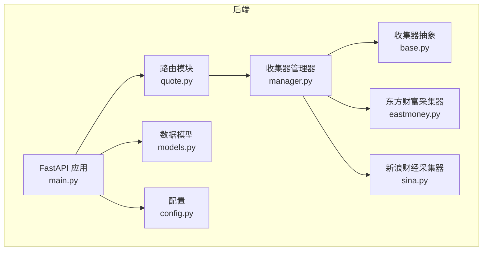
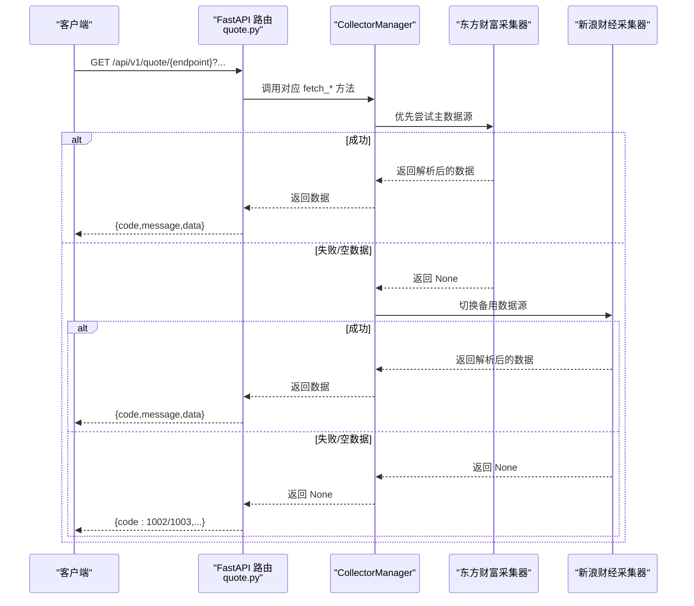
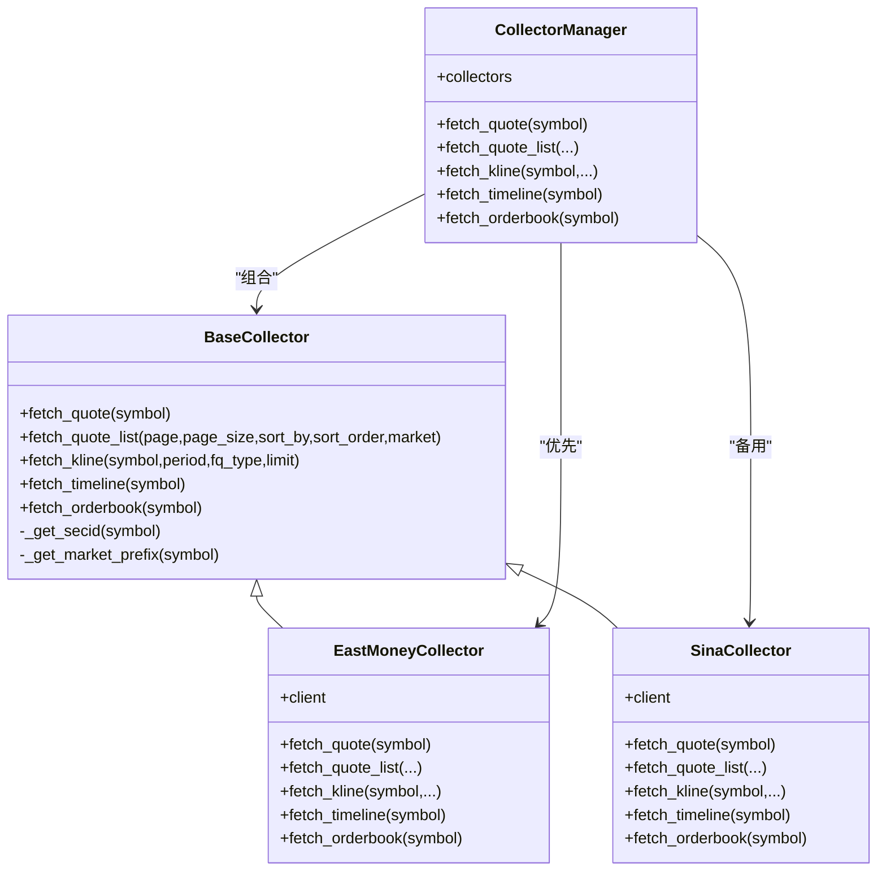

# 行情数据API

<cite>
**本文引用的文件**
- [quote.py](file://backend/app/api/v1/quote.py)
- [schemas.py](file://backend/app/schemas/schemas.py)
- [base.py](file://backend/app/services/collector/base.py)
- [manager.py](file://backend/app/services/collector/manager.py)
- [eastmoney.py](file://backend/app/services/collector/eastmoney.py)
- [sina.py](file://backend/app/services/collector/sina.py)
- [main.py](file://backend/app/main.py)
- [config.py](file://backend/app/core/config.py)
- [models.py](file://backend/app/models/models.py)
- [index.ts](file://frontend/src/api/index.ts)
- [README.md](file://README.md)
</cite>

## 目录
1. [简介](#简介)
2. [项目结构](#项目结构)
3. [核心组件](#核心组件)
4. [架构总览](#架构总览)
5. [详细接口文档](#详细接口文档)
6. [依赖关系分析](#依赖关系分析)
7. [性能考量](#性能考量)
8. [故障排查指南](#故障排查指南)
9. [结论](#结论)

## 简介
本文件为 Stock-View 的行情数据 API 技术参考文档，覆盖以下接口：
- 实时行情接口：/api/v1/quote/realtime
- 行情列表接口：/api/v1/quote/list
- K线数据接口：/api/v1/quote/kline
- 分时数据接口：/api/v1/quote/timeline
- 盘口数据接口：/api/v1/quote/orderbook

文档内容包括：HTTP 方法、URL 参数、请求示例、响应格式、错误码、参数含义、数据结构定义、调用限制、性能考虑与最佳实践，并提供面向后端开发者与 API 使用者的实用建议。

## 项目结构
后端采用 FastAPI + 异步 SQLAlchemy + Redis 缓存 + 多数据源采集器的架构。行情 API 位于 /api/v1/quote，通过 CollectorManager 统一调度多个数据源（东方财富、新浪财经），实现自动故障转移与数据聚合。

图表来源
- [main.py:1-48](file://backend/app/main.py#L1-L48)
- [quote.py:1-65](file://backend/app/api/v1/quote.py#L1-L65)
- [manager.py:1-94](file://backend/app/services/collector/manager.py#L1-L94)
- [base.py:1-45](file://backend/app/services/collector/base.py#L1-L45)
- [eastmoney.py:1-297](file://backend/app/services/collector/eastmoney.py#L1-L297)
- [sina.py:1-312](file://backend/app/services/collector/sina.py#L1-L312)
- [models.py:1-74](file://backend/app/models/models.py#L1-L74)
- [config.py:1-43](file://backend/app/core/config.py#L1-L43)

章节来源
- [main.py:1-48](file://backend/app/main.py#L1-L48)
- [README.md:92-126](file://README.md#L92-L126)

## 核心组件
- FastAPI 路由层：定义各行情接口的 HTTP 方法、参数校验与响应包装。
- Collector 抽象层：统一 fetch_* 接口，屏蔽不同数据源差异。
- CollectorManager：按优先级自动故障转移，保证可用性。
- 数据源采集器：实现具体抓取逻辑（东方财富、新浪财经）。
- 响应模型：基于 Pydantic 的数据结构定义，确保前后端一致的数据契约。

章节来源
- [quote.py:1-65](file://backend/app/api/v1/quote.py#L1-L65)
- [schemas.py:1-103](file://backend/app/schemas/schemas.py#L1-L103)
- [base.py:1-45](file://backend/app/services/collector/base.py#L1-L45)
- [manager.py:1-94](file://backend/app/services/collector/manager.py#L1-L94)
- [eastmoney.py:1-297](file://backend/app/services/collector/eastmoney.py#L1-L297)
- [sina.py:1-312](file://backend/app/services/collector/sina.py#L1-L312)

## 架构总览
下图展示从客户端到数据源的调用链路与错误处理策略。

图表来源
- [quote.py:7-65](file://backend/app/api/v1/quote.py#L7-L65)
- [manager.py:21-89](file://backend/app/services/collector/manager.py#L21-L89)
- [eastmoney.py:69-278](file://backend/app/services/collector/eastmoney.py#L69-L278)
- [sina.py:64-311](file://backend/app/services/collector/sina.py#L64-L311)

## 详细接口文档

### 通用响应格式
所有接口均返回统一结构：
- code: 整数，业务状态码
- message: 字符串，描述信息
- data: 对应接口的数据对象或列表

章节来源
- [schemas.py:7-10](file://backend/app/schemas/schemas.py#L7-L10)
- [quote.py:16](file://backend/app/api/v1/quote.py#L16)
- [quote.py:33](file://backend/app/api/v1/quote.py#L33)
- [quote.py:47](file://backend/app/api/v1/quote.py#L47)
- [quote.py:56](file://backend/app/api/v1/quote.py#L56)
- [quote.py:65](file://backend/app/api/v1/quote.py#L65)

### 错误码定义
- 0：成功
- 1002：股票代码不存在或数据源暂不可用
- 1003：数据源暂不可用

章节来源
- [quote.py:31](file://backend/app/api/v1/quote.py#L31)
- [quote.py:45](file://backend/app/api/v1/quote.py#L45)
- [quote.py:54](file://backend/app/api/v1/quote.py#L54)
- [quote.py:63](file://backend/app/api/v1/quote.py#L63)

### 实时行情接口
- 路径：/api/v1/quote/realtime
- 方法：GET
- 功能：批量获取多只股票的实时行情
- 参数：
  - symbols: 必填，字符串，多个股票代码以逗号分隔；最多支持 50 只
- 响应：
  - data.items: 行情数组，每项为单只股票的行情字典
- 示例请求：
  - GET /api/v1/quote/realtime?symbols=600036,000001,000002
- 示例响应：
  - { "code": 0, "message": "success", "data": { "items": [...] } }

数据结构定义（来自采集器解析）
- QuoteItem 字段：
  - symbol: 股票代码
  - name: 股票名称
  - market: 市场类型（sh/sz）
  - price: 当前价格
  - change: 涨跌额
  - change_pct: 涨跌幅%
  - open: 开盘价
  - high: 最高价
  - low: 最低价
  - prev_close: 昨收
  - volume: 成交量
  - amount: 成交额
  - turnover_rate: 换手率
  - timestamp: 时间戳

章节来源
- [quote.py:7-16](file://backend/app/api/v1/quote.py#L7-L16)
- [schemas.py:13-28](file://backend/app/schemas/schemas.py#L13-L28)
- [eastmoney.py:280-296](file://backend/app/services/collector/eastmoney.py#L280-L296)
- [sina.py:89-104](file://backend/app/services/collector/sina.py#L89-L104)

### 行情列表接口
- 路径：/api/v1/quote/list
- 方法：GET
- 功能：获取全市场或指定市场的股票行情列表
- 参数：
  - market: 可选，枚举值 all/sh/sz，默认 all
  - sort_by: 可选，排序字段，可选 change_pct/volume/amount/turnover，默认 change_pct
  - sort_order: 可选，排序方向 asc/desc，默认 desc
  - page: 可选，页码，>=1，默认 1
  - page_size: 可选，每页数量，1~100，默认 20
- 响应：
  - data: 包含 items、total、page、page_size 的字典
  - items: 行情数组，元素为 QuoteItem 字段集合
- 示例请求：
  - GET /api/v1/quote/list?market=all&sort_by=change_pct&sort_order=desc&page=1&page_size=20
- 示例响应：
  - { "code": 0, "message": "success", "data": { "items": [...], "total": N, "page": 1, "page_size": 20 } }

章节来源
- [quote.py:19-33](file://backend/app/api/v1/quote.py#L19-L33)
- [schemas.py:13-28](file://backend/app/schemas/schemas.py#L13-L28)
- [eastmoney.py:87-149](file://backend/app/services/collector/eastmoney.py#L87-L149)
- [sina.py:109-171](file://backend/app/services/collector/sina.py#L109-L171)

### K线数据接口
- 路径：/api/v1/quote/kline
- 方法：GET
- 功能：获取某只股票的 K 线数据
- 参数：
  - symbol: 必填，股票代码
  - period: 可选，K线周期，1m/5m/15m/30m/60m/d/w/m，默认 d
  - fq_type: 可选，复权类型，none/front/back，默认 front
  - limit: 可选，返回条数，1~500，默认 120
- 响应：
  - data: 包含 symbol、period、fq_type、items 的字典
  - items: KlineItem 数组，每项包含日期、开盘、收盘、最高、最低、成交量、成交额、涨跌幅%
- 示例请求：
  - GET /api/v1/quote/kline?symbol=600036&period=d&fq_type=front&limit=120
- 示例响应：
  - { "code": 0, "message": "success", "data": { "symbol": "...", "period": "d", "fq_type": "front", "items": [...] } }

数据结构定义
- KlineItem 字段：
  - date: 日期
  - open/close/high/low: 价格
  - volume: 成交量
  - amount: 成交额
  - change_pct: 涨跌幅%

章节来源
- [quote.py:36-47](file://backend/app/api/v1/quote.py#L36-L47)
- [schemas.py:34-43](file://backend/app/schemas/schemas.py#L34-L43)
- [eastmoney.py:151-199](file://backend/app/services/collector/eastmoney.py#L151-L199)
- [sina.py:173-227](file://backend/app/services/collector/sina.py#L173-L227)

### 分时数据接口
- 路径：/api/v1/quote/timeline
- 方法：GET
- 功能：获取某只股票当日分时数据
- 参数：
  - symbol: 必填，股票代码
- 响应：
  - data: 包含 symbol、date、prev_close、points 的字典
  - points: TimelinePoint 数组，每项包含时间、价格、均价、成交量
- 示例请求：
  - GET /api/v1/quote/timeline?symbol=600036
- 示例响应：
  - { "code": 0, "message": "success", "data": { "symbol": "...", "date": "YYYYMMDD", "prev_close": ..., "points": [...] } }

数据结构定义
- TimelinePoint 字段：
  - time: 时间点
  - price: 当前价格
  - avg: 均价
  - volume: 成交量

章节来源
- [quote.py:50-56](file://backend/app/api/v1/quote.py#L50-L56)
- [schemas.py:49-54](file://backend/app/schemas/schemas.py#L49-L54)
- [eastmoney.py:201-239](file://backend/app/services/collector/eastmoney.py#L201-L239)
- [sina.py:229-270](file://backend/app/services/collector/sina.py#L229-L270)

### 盘口数据接口
- 路径：/api/v1/quote/orderbook
- 方法：GET
- 功能：获取某只股票的买卖盘口数据（前 5 档）
- 参数：
  - symbol: 必填，股票代码
- 响应：
  - data: 包含 symbol、timestamp、asks、bids 的字典
  - asks/bids: OrderBookLevel 数组，每项包含档位、价格、量
- 示例请求：
  - GET /api/v1/quote/orderbook?symbol=600036
- 示例响应：
  - { "code": 0, "message": "success", "data": { "symbol": "...", "timestamp": "...", "asks": [...], "bids": [...] } }

数据结构定义
- OrderBookLevel 字段：
  - level: 档位（1~5）
  - price: 价格
  - volume: 量

章节来源
- [quote.py:59-65](file://backend/app/api/v1/quote.py#L59-L65)
- [schemas.py:60-67](file://backend/app/schemas/schemas.py#L60-L67)
- [eastmoney.py:241-278](file://backend/app/services/collector/eastmoney.py#L241-L278)
- [sina.py:272-311](file://backend/app/services/collector/sina.py#L272-L311)

## 依赖关系分析
- 路由层依赖 CollectorManager 提供的 fetch_* 方法。
- CollectorManager 内部封装两个采集器：EastMoneyCollector 与 SinaCollector，按优先级自动切换。
- 采集器实现 BaseCollector 抽象，统一了数据字段与市场前缀生成逻辑。
- 响应模型使用 Pydantic 定义，确保前后端一致的数据契约。

图表来源
- [base.py:5-45](file://backend/app/services/collector/base.py#L5-L45)
- [manager.py:12-94](file://backend/app/services/collector/manager.py#L12-L94)
- [eastmoney.py:26-278](file://backend/app/services/collector/eastmoney.py#L26-L278)
- [sina.py:24-311](file://backend/app/services/collector/sina.py#L24-L311)

章节来源
- [quote.py:1-4](file://backend/app/api/v1/quote.py#L1-L4)
- [manager.py:9-9](file://backend/app/services/collector/manager.py#L9-L9)
- [base.py:36-45](file://backend/app/services/collector/base.py#L36-L45)

## 性能考量
- 数据源优先级与故障转移：CollectorManager 以“主数据源优先”的顺序尝试，若失败则自动切换备用数据源，提升可用性与稳定性。
- 请求重试与超时控制：采集器对网络异常进行有限次数重试，并设置连接/读取/写入/池化超时，降低瞬时波动影响。
- 限流与并发：采集器使用连接池限制最大并发连接数，避免对第三方接口造成过大压力。
- 前端调用建议：
  - 批量查询实时行情时，建议控制 symbols 数量不超过 50（接口限制）。
  - 分页查询列表时，合理设置 page_size（1~100），避免一次性拉取过多数据。
  - K线请求 limit 控制在 1~500，结合 period 选择合适的粒度。
- 后端优化建议：
  - 结合 Redis 缓存策略（配置项 QUOTE_CACHE_TTL），减少重复请求。
  - 对高频接口可考虑本地缓存与异步刷新，降低第三方接口依赖。
  - 在高并发场景下，适当调整采集器连接池大小与超时参数。

章节来源
- [manager.py:21-89](file://backend/app/services/collector/manager.py#L21-L89)
- [eastmoney.py:32-39](file://backend/app/services/collector/eastmoney.py#L32-L39)
- [sina.py:27-34](file://backend/app/services/collector/sina.py#L27-L34)
- [config.py:29-30](file://backend/app/core/config.py#L29-L30)
- [quote.py:10](file://backend/app/api/v1/quote.py#L10)

## 故障排查指南
- 常见错误与定位
  - code: 1002：表示股票代码不存在或数据源暂不可用。检查 symbol 是否正确、是否为 A 股代码（sh/sz 前缀规则由采集器内部处理）。
  - code: 1003：表示数据源暂不可用。通常为当前主数据源不可用，系统自动切换备用数据源；若仍失败，请稍后再试。
- 日志与监控
  - 采集器在请求失败、解析异常、空数据等情况会输出警告/错误日志，便于定位问题。
  - 建议在生产环境开启日志轮转与告警，关注失败率与延迟指标。
- 网络与超时
  - 若出现连接/读取超时，可适当增大超时阈值或减少并发请求。
  - 对于频繁调用的接口，建议增加本地缓存与预热策略。
- 前端调用验证
  - 可通过 /api/v1/health 检查后端健康状态。
  - 使用 /docs 或 /redoc 查看接口文档与示例。

章节来源
- [quote.py:31](file://backend/app/api/v1/quote.py#L31)
- [quote.py:45](file://backend/app/api/v1/quote.py#L45)
- [quote.py:54](file://backend/app/api/v1/quote.py#L54)
- [quote.py:63](file://backend/app/api/v1/quote.py#L63)
- [eastmoney.py:41-67](file://backend/app/services/collector/eastmoney.py#L41-L67)
- [sina.py:36-62](file://backend/app/services/collector/sina.py#L36-L62)
- [main.py:46-48](file://backend/app/main.py#L46-L48)

## 结论
本文档系统梳理了 Stock-View 行情数据 API 的接口规范、数据结构、调用流程与故障处理策略。通过统一的 CollectorManager 与双数据源设计，实现了高可用与稳定的行情数据服务。建议在实际使用中遵循参数范围与调用频率限制，结合缓存与异步策略提升性能与用户体验。