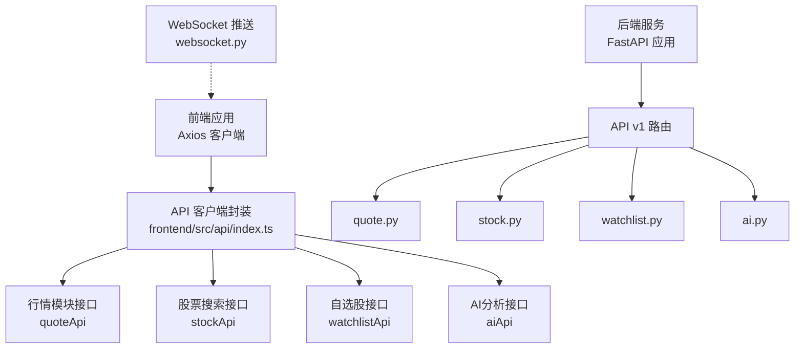
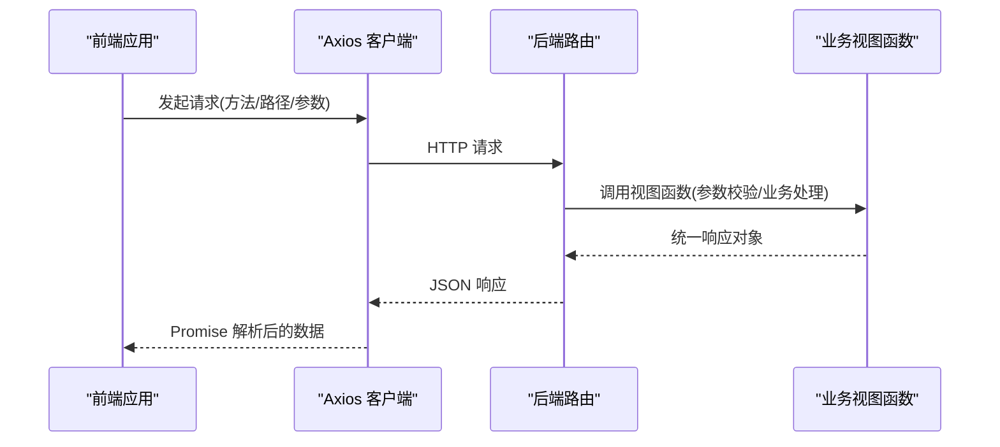
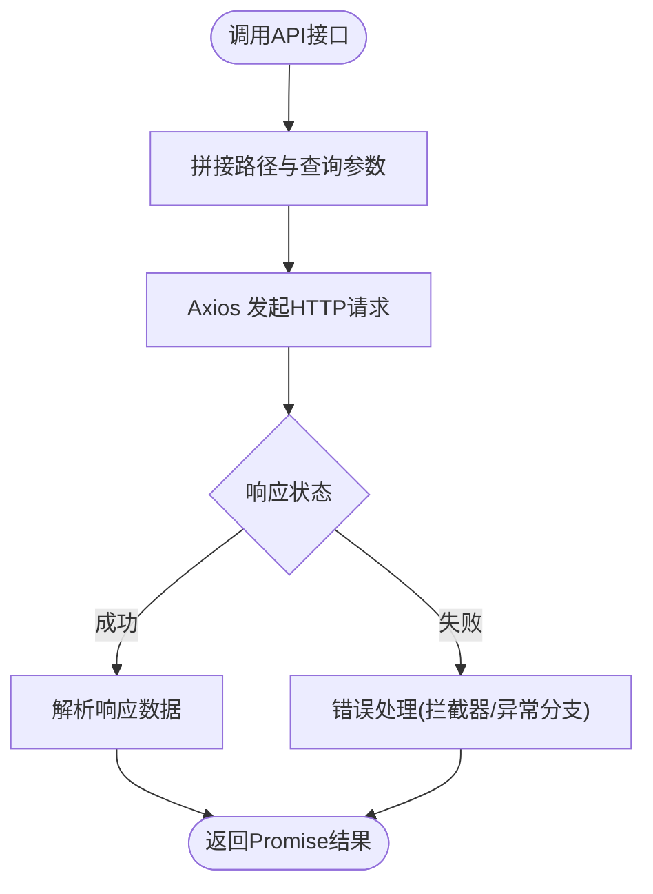
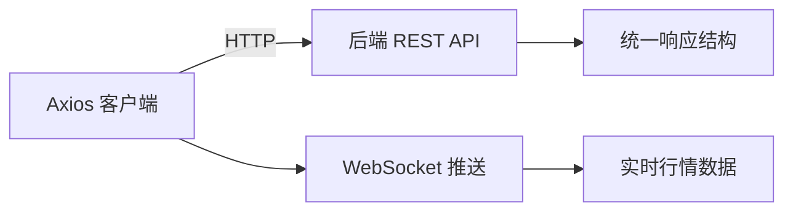

# API客户端

<cite>
**本文引用的文件**
- [frontend/src/api/index.ts](file://frontend/src/api/index.ts)
- [backend/app/api/v1/quote.py](file://backend/app/api/v1/quote.py)
- [backend/app/api/v1/stock.py](file://backend/app/api/v1/stock.py)
- [backend/app/api/v1/watchlist.py](file://backend/app/api/v1/watchlist.py)
- [backend/app/api/v1/ai.py](file://backend/app/api/v1/ai.py)
- [backend/app/api/websocket.py](file://backend/app/api/websocket.py)
- [Stock-View 软件开发文档/开发文档.md](file://Stock-View 软件开发文档/开发文档.md)
- [README.md](file://README.md)
</cite>

## 目录
1. [简介](#简介)
2. [项目结构](#项目结构)
3. [核心组件](#核心组件)
4. [架构总览](#架构总览)
5. [详细组件分析](#详细组件分析)
6. [依赖分析](#依赖分析)
7. [性能考虑](#性能考虑)
8. [故障排查指南](#故障排查指南)
9. [结论](#结论)
10. [附录](#附录)

## 简介
本文件面向前端与后端开发者，系统性梳理该仓库中“API客户端”的设计与实现，重点覆盖以下方面：
- HTTP请求封装与调用方式：GET、POST、PUT、DELETE等请求类型与参数传递
- 请求/响应拦截器与错误处理机制
- 数据转换与验证：统一响应格式、类型检查、错误信息处理
- 客户端配置与扩展：基础URL、超时、重试等
- 性能优化：并发控制、缓存策略、请求去重等最佳实践
- 与后端REST接口及WebSocket推送的对接说明

## 项目结构
前端通过Axios创建统一的API实例，并按模块导出各业务接口；后端提供REST API v1版本的接口定义与文档。

图表来源
- [frontend/src/api/index.ts:1-33](file://frontend/src/api/index.ts#L1-L33)
- [backend/app/api/v1/quote.py:1-200](file://backend/app/api/v1/quote.py)
- [backend/app/api/v1/stock.py:1-200](file://backend/app/api/v1/stock.py)
- [backend/app/api/v1/watchlist.py:1-200](file://backend/app/api/v1/watchlist.py)
- [backend/app/api/v1/ai.py:1-200](file://backend/app/api/v1/ai.py)
- [backend/app/api/websocket.py:1-200](file://backend/app/api/websocket.py)

章节来源
- [frontend/src/api/index.ts:1-33](file://frontend/src/api/index.ts#L1-L33)
- [backend/app/api/v1/quote.py:1-200](file://backend/app/api/v1/quote.py)
- [backend/app/api/v1/stock.py:1-200](file://backend/app/api/v1/stock.py)
- [backend/app/api/v1/watchlist.py:1-200](file://backend/app/api/v1/watchlist.py)
- [backend/app/api/v1/ai.py:1-200](file://backend/app/api/v1/ai.py)
- [backend/app/api/websocket.py:1-200](file://backend/app/api/websocket.py)
- [README.md:76-91](file://README.md#L76-L91)

## 核心组件
- Axios 客户端实例：集中配置基础URL与超时时间，便于后续扩展拦截器与全局行为
- 模块化接口导出：按业务域拆分，便于维护与测试
- 后端路由与视图函数：提供REST接口，统一响应结构，支持参数校验与错误处理

章节来源
- [frontend/src/api/index.ts:1-33](file://frontend/src/api/index.ts#L1-L33)
- [backend/app/api/v1/quote.py:1-200](file://backend/app/api/v1/quote.py)
- [backend/app/api/v1/stock.py:1-200](file://backend/app/api/v1/stock.py)
- [backend/app/api/v1/watchlist.py:1-200](file://backend/app/api/v1/watchlist.py)
- [backend/app/api/v1/ai.py:1-200](file://backend/app/api/v1/ai.py)

## 架构总览
前端Axios客户端负责发起HTTP请求，后端FastAPI路由接收请求并调用业务逻辑，最终返回统一格式的JSON响应。WebSocket用于实时行情推送。

图表来源
- [frontend/src/api/index.ts:1-33](file://frontend/src/api/index.ts#L1-L33)
- [backend/app/api/v1/quote.py:1-200](file://backend/app/api/v1/quote.py)
- [backend/app/api/v1/stock.py:1-200](file://backend/app/api/v1/stock.py)
- [backend/app/api/v1/watchlist.py:1-200](file://backend/app/api/v1/watchlist.py)
- [backend/app/api/v1/ai.py:1-200](file://backend/app/api/v1/ai.py)

## 详细组件分析

### 前端API客户端封装
- 客户端实例
  - 基础URL：/api/v1
  - 超时：15000ms
  - 可扩展点：请求/响应拦截器、错误处理、重试策略
- 接口导出
  - 行情模块：实时、列表、K线、分时、盘口
  - 股票模块：搜索
  - 自选股模块：列表、新增、删除、排序
  - AI模块：分析、模型信息

图表来源
- [frontend/src/api/index.ts:8-31](file://frontend/src/api/index.ts#L8-L31)

章节来源
- [frontend/src/api/index.ts:1-33](file://frontend/src/api/index.ts#L1-L33)

### 请求类型与参数处理
- GET：适用于查询类接口，参数以查询字符串形式传递
  - 示例：行情列表、K线、分时、盘口、自选股列表、AI模型信息
- POST：适用于创建类接口，参数以请求体传递
  - 示例：添加自选股、请求AI分析
- PUT：适用于更新类接口，参数以请求体传递
  - 示例：调整自选股排序
- DELETE：适用于删除类接口，通常无请求体或携带路径参数
  - 示例：删除自选股

章节来源
- [frontend/src/api/index.ts:8-31](file://frontend/src/api/index.ts#L8-L31)

### 错误处理与统一响应
- 后端统一响应结构
  - 字段：code、message、data
  - 成功：code为0，data包含业务数据
  - 失败：code非0，message描述错误信息
- 前端建议
  - 在响应拦截器中解析统一结构，抛出业务异常或转换为可识别错误
  - 对网络异常与超时进行分类处理，必要时触发重试

章节来源
- [Stock-View 软件开发文档/开发文档.md:711-1641](file://Stock-View 软件开发文档/开发文档.md#L711-L1641)

### 数据转换与验证
- 参数校验
  - 后端对输入参数进行类型与范围校验，确保接口健壮性
- 响应格式化
  - 统一返回结构，前端可据此进行UI渲染与状态管理
- 类型检查
  - 建议在前端对关键字段进行类型检查与默认值处理，避免运行时错误

章节来源
- [Stock-View 软件开发文档/开发文档.md:711-1641](file://Stock-View 软件开发文档/开发文档.md#L711-L1641)

### 配置选项与扩展方式
- 基础URL：/api/v1
- 超时：15000ms
- 扩展点
  - 请求拦截器：注入鉴权头、签名、埋点等
  - 响应拦截器：统一解包、错误映射、日志记录
  - 重试机制：对幂等请求进行指数退避重试
  - 并发控制：限制同时请求数量，避免资源争用
  - 缓存策略：基于URL与参数的LRU缓存，命中则直接返回
  - 请求去重：对相同请求键进行去重，等待首个请求完成后再复用结果

章节来源
- [frontend/src/api/index.ts:1-6](file://frontend/src/api/index.ts#L1-L6)

### 与后端接口的对接
- 行情接口
  - 实时、列表、K线、分时、盘口
- 股票搜索
  - 支持关键词与数量限制
- 自选股
  - 列表、新增、删除、排序
- AI分析
  - 支持分析类型与周期参数

章节来源
- [frontend/src/api/index.ts:8-31](file://frontend/src/api/index.ts#L8-L31)
- [backend/app/api/v1/quote.py:1-200](file://backend/app/api/v1/quote.py)
- [backend/app/api/v1/stock.py:1-200](file://backend/app/api/v1/stock.py)
- [backend/app/api/v1/watchlist.py:1-200](file://backend/app/api/v1/watchlist.py)
- [backend/app/api/v1/ai.py:1-200](file://backend/app/api/v1/ai.py)

### WebSocket推送
- 连接地址：ws://hostname/api/v1/ws/quote?token={token}
- 订阅消息：subscribe，包含symbols与channels
- 服务端推送：quote与orderbook两类数据
- 心跳：客户端每30秒发送ping，超过60秒未收到pong则断开

章节来源
- [Stock-View 软件开发文档/开发文档.md:1568-1641](file://Stock-View 软件开发文档/开发文档.md#L1568-L1641)
- [backend/app/api/websocket.py:1-200](file://backend/app/api/websocket.py)

## 依赖分析
- 前端依赖Axios作为HTTP客户端，集中配置基础URL与超时
- 后端依赖FastAPI，提供REST接口与WebSocket服务
- 前后端通过统一的JSON响应结构进行数据交换

图表来源
- [frontend/src/api/index.ts:1-33](file://frontend/src/api/index.ts#L1-L33)
- [backend/app/api/v1/quote.py:1-200](file://backend/app/api/v1/quote.py)
- [backend/app/api/v1/stock.py:1-200](file://backend/app/api/v1/stock.py)
- [backend/app/api/v1/watchlist.py:1-200](file://backend/app/api/v1/watchlist.py)
- [backend/app/api/v1/ai.py:1-200](file://backend/app/api/v1/ai.py)
- [backend/app/api/websocket.py:1-200](file://backend/app/api/websocket.py)

章节来源
- [frontend/src/api/index.ts:1-33](file://frontend/src/api/index.ts#L1-L33)
- [backend/app/api/v1/quote.py:1-200](file://backend/app/api/v1/quote.py)
- [backend/app/api/v1/stock.py:1-200](file://backend/app/api/v1/stock.py)
- [backend/app/api/v1/watchlist.py:1-200](file://backend/app/api/v1/watchlist.py)
- [backend/app/api/v1/ai.py:1-200](file://backend/app/api/v1/ai.py)
- [backend/app/api/websocket.py:1-200](file://backend/app/api/websocket.py)

## 性能考虑
- 并发控制
  - 使用信号量或队列限制同时请求数量，避免阻塞与资源争用
- 缓存策略
  - 对GET请求建立基于URL与参数的LRU缓存，命中即返回，降低后端压力
- 请求去重
  - 对相同请求键进行去重，等待首个请求完成后复用结果
- 超时与重试
  - 合理设置超时阈值，对幂等请求采用指数退避重试
- WebSocket长连接
  - 心跳保活，断线重连，批量订阅减少握手成本

## 故障排查指南
- 网络错误
  - 检查基础URL与代理配置，确认开发服务器已启动并正确代理到后端
  - 查看浏览器网络面板，定位4xx/5xx错误与超时
- 统一响应错误
  - 根据code与message判断业务错误类型，前端在拦截器中统一处理
- 参数校验失败
  - 对照后端参数定义，检查必填项、类型与取值范围
- WebSocket异常
  - 检查token有效性、订阅消息格式与心跳频率

章节来源
- [README.md:76-91](file://README.md#L76-L91)
- [Stock-View 软件开发文档/开发文档.md:711-1641](file://Stock-View 软件开发文档/开发文档.md#L711-L1641)

## 结论
该API客户端以Axios为核心，结合模块化接口导出与后端统一响应结构，提供了清晰、可扩展的前后端交互方案。通过引入请求/响应拦截器、错误处理、缓存与重试等机制，可在保证一致性的同时提升用户体验与系统稳定性。WebSocket补充了实时数据通道，进一步完善了整体架构。

## 附录
- 开发环境启动与代理说明
  - 前端开发服务器默认运行在 http://localhost:5173，Vite 将自动代理 /api/v1 到后端 8000 端口
- 接口文档与示例
  - 参考“软件开发文档”中的REST API与WebSocket部分，了解请求/响应格式与参数定义

章节来源
- [README.md:76-91](file://README.md#L76-L91)
- [Stock-View 软件开发文档/开发文档.md:711-1641](file://Stock-View 软件开发文档/开发文档.md#L711-L1641)