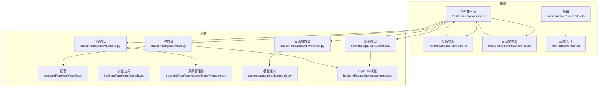
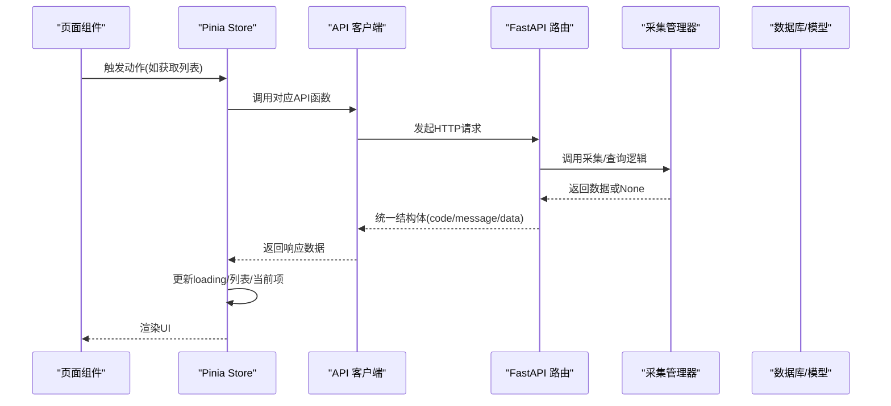
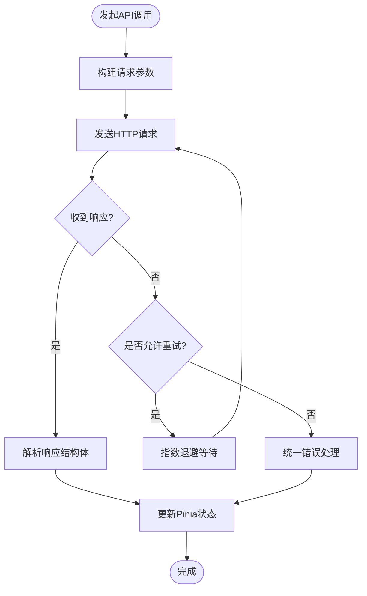
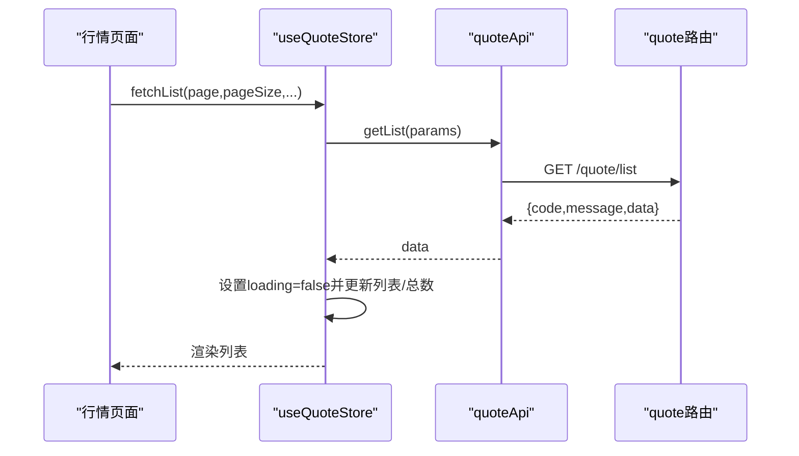
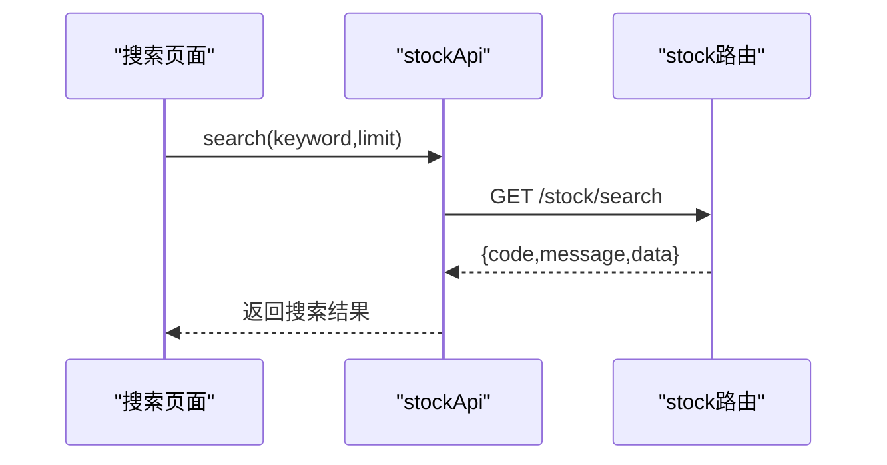
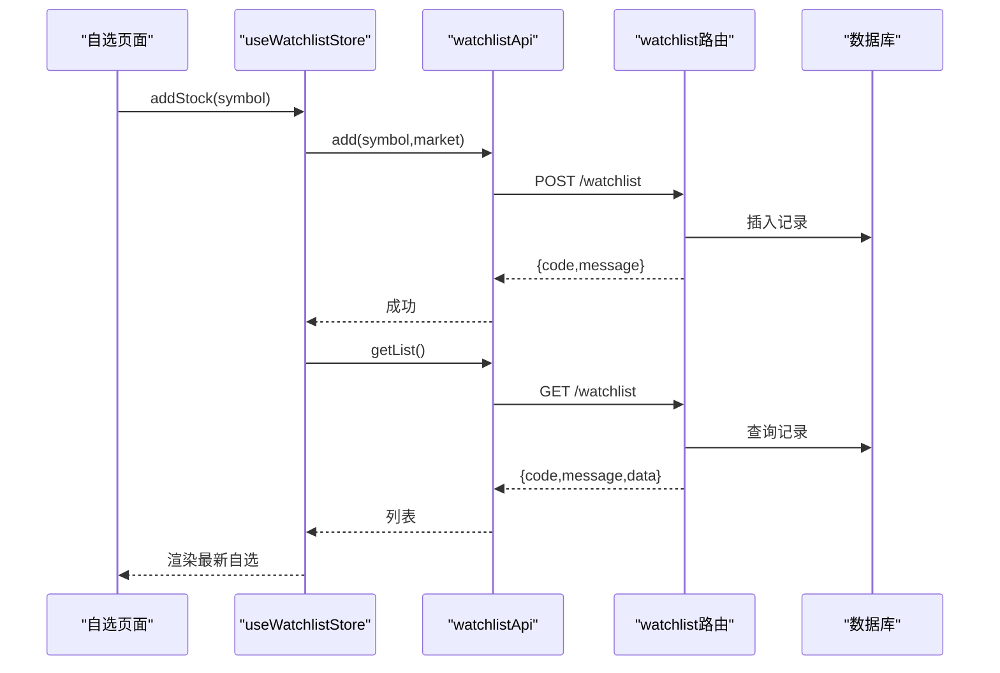
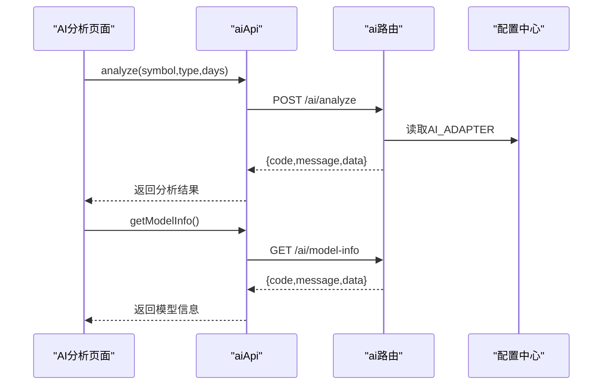
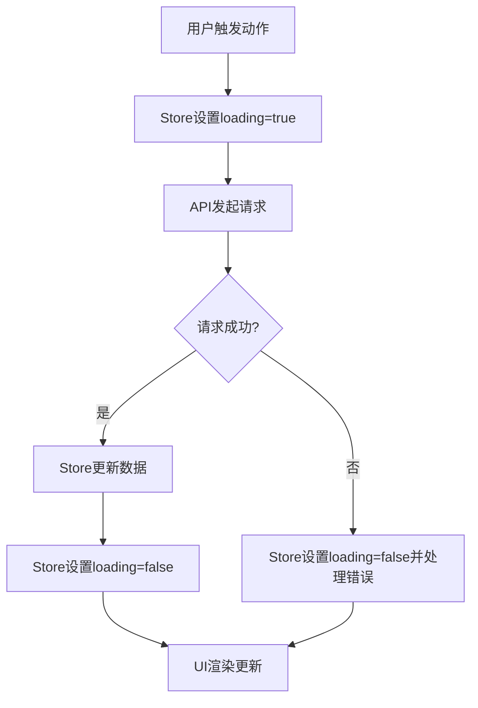
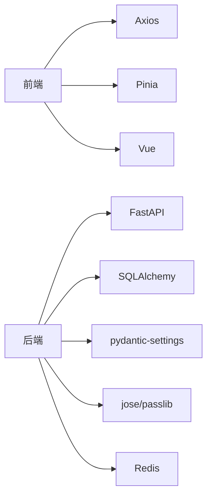

# API客户端

<cite>
**本文引用的文件**
- [frontend/src/api/index.ts](file://frontend/src/api/index.ts)
- [frontend/src/stores/quote.ts](file://frontend/src/stores/quote.ts)
- [frontend/src/stores/watchlist.ts](file://frontend/src/stores/watchlist.ts)
- [frontend/src/router/index.ts](file://frontend/src/router/index.ts)
- [frontend/src/main.ts](file://frontend/src/main.ts)
- [backend/app/api/v1/quote.py](file://backend/app/api/v1/quote.py)
- [backend/app/api/v1/stock.py](file://backend/app/api/v1/stock.py)
- [backend/app/api/v1/watchlist.py](file://backend/app/api/v1/watchlist.py)
- [backend/app/api/v1/ai.py](file://backend/app/api/v1/ai.py)
- [backend/app/core/config.py](file://backend/app/core/config.py)
- [backend/app/core/security.py](file://backend/app/core/security.py)
- [backend/app/services/collector/manager.py](file://backend/app/services/collector/manager.py)
- [backend/app/models/models.py](file://backend/app/models/models.py)
- [backend/app/schemas/schemas.py](file://backend/app/schemas/schemas.py)
</cite>

## 目录
1. [简介](#简介)
2. [项目结构](#项目结构)
3. [核心组件](#核心组件)
4. [架构总览](#架构总览)
5. [详细组件分析](#详细组件分析)
6. [依赖分析](#依赖分析)
7. [性能考量](#性能考量)
8. [故障排查指南](#故障排查指南)
9. [结论](#结论)
10. [附录](#附录)

## 简介
本文件面向Stock-View前端的API客户端，系统性梳理RESTful封装与调用模式，解析请求/响应拦截器、错误处理机制与重试策略的设计现状；详解各API接口（行情、股票、自选股、AI分析）的调用方式；说明API客户端与状态管理（Pinia）的集成、数据缓存策略与并发控制；给出参数校验、错误处理、加载状态管理与数据格式转换的最佳实践；并覆盖API安全、CORS、HTTPS与API版本管理的实现方案，以及测试与Mock策略。

## 项目结构
前端采用Vue + Pinia + Axios组织，后端采用FastAPI + SQLAlchemy + 异步任务栈。API客户端位于frontend/src/api/index.ts，通过统一的Axios实例导出各模块API；状态管理位于frontend/src/stores目录；后端路由在backend/app/api/v1下按功能划分模块。

**图表来源**
- [frontend/src/api/index.ts:1-33](file://frontend/src/api/index.ts#L1-L33)
- [frontend/src/stores/quote.ts:1-43](file://frontend/src/stores/quote.ts#L1-L43)
- [frontend/src/stores/watchlist.ts:1-36](file://frontend/src/stores/watchlist.ts#L1-L36)
- [frontend/src/router/index.ts:1-14](file://frontend/src/router/index.ts#L1-L14)
- [frontend/src/main.ts:1-12](file://frontend/src/main.ts#L1-L12)
- [backend/app/api/v1/quote.py:1-65](file://backend/app/api/v1/quote.py#L1-L65)
- [backend/app/api/v1/stock.py:1-37](file://backend/app/api/v1/stock.py#L1-L37)
- [backend/app/api/v1/watchlist.py:1-77](file://backend/app/api/v1/watchlist.py#L1-L77)
- [backend/app/api/v1/ai.py:1-29](file://backend/app/api/v1/ai.py#L1-L29)
- [backend/app/core/config.py:1-43](file://backend/app/core/config.py#L1-L43)
- [backend/app/core/security.py:1-30](file://backend/app/core/security.py#L1-L30)
- [backend/app/services/collector/manager.py:1-94](file://backend/app/services/collector/manager.py#L1-L94)
- [backend/app/models/models.py:1-74](file://backend/app/models/models.py#L1-L74)
- [backend/app/schemas/schemas.py:1-103](file://backend/app/schemas/schemas.py#L1-L103)

**章节来源**
- [frontend/src/api/index.ts:1-33](file://frontend/src/api/index.ts#L1-L33)
- [frontend/src/stores/quote.ts:1-43](file://frontend/src/stores/quote.ts#L1-L43)
- [frontend/src/stores/watchlist.ts:1-36](file://frontend/src/stores/watchlist.ts#L1-L36)
- [frontend/src/router/index.ts:1-14](file://frontend/src/router/index.ts#L1-L14)
- [frontend/src/main.ts:1-12](file://frontend/src/main.ts#L1-L12)

## 核心组件
- API客户端封装
  - 基于Axios创建统一实例，设置baseURL与超时，集中暴露quoteApi、stockApi、watchlistApi、aiApi等模块化接口。
  - 接口命名与参数传递遵循后端路由约定，便于前后端协作与契约稳定。
- 状态管理集成
  - 使用Pinia Store管理加载态、列表与当前项数据，异步调用API后更新本地状态，保证UI与数据一致。
- 后端服务
  - FastAPI路由按功能拆分，统一返回结构体；数据采集通过CollectorManager实现多数据源优先级与故障转移。
  - 配置中心集中管理AI适配器、缓存TTL、限流、JWT等关键参数。

**章节来源**
- [frontend/src/api/index.ts:1-33](file://frontend/src/api/index.ts#L1-L33)
- [frontend/src/stores/quote.ts:1-43](file://frontend/src/stores/quote.ts#L1-L43)
- [frontend/src/stores/watchlist.ts:1-36](file://frontend/src/stores/watchlist.ts#L1-L36)
- [backend/app/api/v1/quote.py:1-65](file://backend/app/api/v1/quote.py#L1-L65)
- [backend/app/api/v1/stock.py:1-37](file://backend/app/api/v1/stock.py#L1-L37)
- [backend/app/api/v1/watchlist.py:1-77](file://backend/app/api/v1/watchlist.py#L1-L77)
- [backend/app/api/v1/ai.py:1-29](file://backend/app/api/v1/ai.py#L1-L29)
- [backend/app/core/config.py:1-43](file://backend/app/core/config.py#L1-L43)

## 架构总览
前端API客户端通过Axios发起HTTP请求，后端FastAPI路由接收请求，经由业务层（如采集管理器）访问数据源，最终返回统一结构体。Pinia Store负责状态持久与UI渲染，路由驱动页面跳转。

**图表来源**
- [frontend/src/stores/quote.ts:11-30](file://frontend/src/stores/quote.ts#L11-L30)
- [frontend/src/api/index.ts:8-31](file://frontend/src/api/index.ts#L8-L31)
- [backend/app/api/v1/quote.py:19-33](file://backend/app/api/v1/quote.py#L19-L33)
- [backend/app/services/collector/manager.py:35-47](file://backend/app/services/collector/manager.py#L35-L47)

## 详细组件分析

### API客户端封装与调用模式
- 统一实例与模块化导出
  - 在API客户端中创建Axios实例，设置baseURL与超时，避免重复配置。
  - 将不同业务域的接口按模块导出，便于按需引入与测试。
- 请求与响应处理现状
  - 当前未见全局请求/响应拦截器与错误处理钩子，建议在Axios实例上增加拦截器以统一处理认证、错误与重试。
- 并发与重试
  - 当前未实现并发控制与自动重试，建议在拦截器或调用侧加入队列与指数退避重试策略。

**图表来源**
- [frontend/src/api/index.ts:1-33](file://frontend/src/api/index.ts#L1-L33)
- [frontend/src/stores/quote.ts:11-22](file://frontend/src/stores/quote.ts#L11-L22)

**章节来源**
- [frontend/src/api/index.ts:1-33](file://frontend/src/api/index.ts#L1-L33)

### 行情数据接口
- 接口清单
  - 实时行情、行情列表、K线、分时、盘口。
- 参数与约束
  - 列表接口支持市场筛选、排序字段/方向、分页大小限制；K线接口支持周期、复权类型与数量限制；实时接口限制符号数量上限。
- 前端调用与状态更新
  - Store在fetchList中设置loading，成功后更新列表与总数；fetchRealtime返回数据项数组，供组件渲染。

**图表来源**
- [frontend/src/stores/quote.ts:11-22](file://frontend/src/stores/quote.ts#L11-L22)
- [frontend/src/api/index.ts:8-14](file://frontend/src/api/index.ts#L8-L14)
- [backend/app/api/v1/quote.py:19-33](file://backend/app/api/v1/quote.py#L19-L33)

**章节来源**
- [frontend/src/stores/quote.ts:1-43](file://frontend/src/stores/quote.ts#L1-L43)
- [frontend/src/api/index.ts:8-14](file://frontend/src/api/index.ts#L8-L14)
- [backend/app/api/v1/quote.py:1-65](file://backend/app/api/v1/quote.py#L1-L65)

### 股票搜索接口
- 接口说明
  - 支持根据关键词搜索A股股票，返回代码、名称、市场与拼音首字母。
- 数据源与限制
  - 使用东方财富建议接口，限制返回数量与仅A股过滤。
- 前端调用
  - 通过stockApi.search发起请求，Store可直接使用返回结果更新搜索列表。

**图表来源**
- [frontend/src/api/index.ts:16-18](file://frontend/src/api/index.ts#L16-L18)
- [backend/app/api/v1/stock.py:10-37](file://backend/app/api/v1/stock.py#L10-L37)

**章节来源**
- [frontend/src/api/index.ts:16-18](file://frontend/src/api/index.ts#L16-L18)
- [backend/app/api/v1/stock.py:1-37](file://backend/app/api/v1/stock.py#L1-L37)

### 自选股接口
- 接口说明
  - 获取列表、添加、删除、排序。
- 数据持久化
  - 使用SQLAlchemy模型与数据库交互，排序基于sort_order字段维护。
- 前端调用
  - Store在add/remove后立即刷新列表，isWatched用于UI状态判断。

**图表来源**
- [frontend/src/stores/watchlist.ts:21-29](file://frontend/src/stores/watchlist.ts#L21-L29)
- [frontend/src/api/index.ts:20-25](file://frontend/src/api/index.ts#L20-L25)
- [backend/app/api/v1/watchlist.py:13-26](file://backend/app/api/v1/watchlist.py#L13-L26)
- [backend/app/models/models.py:50-59](file://backend/app/models/models.py#L50-L59)

**章节来源**
- [frontend/src/stores/watchlist.ts:1-36](file://frontend/src/stores/watchlist.ts#L1-L36)
- [frontend/src/api/index.ts:20-25](file://frontend/src/api/index.ts#L20-L25)
- [backend/app/api/v1/watchlist.py:1-77](file://backend/app/api/v1/watchlist.py#L1-L77)
- [backend/app/models/models.py:50-59](file://backend/app/models/models.py#L50-L59)

### AI分析接口
- 接口说明
  - 提交分析请求与获取模型信息。
- 配置与适配器
  - 通过配置中心选择AI适配器，支持缓存与限流策略。
- 前端调用
  - aiApi.analyze与aiApi.getModelInfo分别调用后端对应路由。

**图表来源**
- [frontend/src/api/index.ts:27-31](file://frontend/src/api/index.ts#L27-L31)
- [backend/app/api/v1/ai.py:10-29](file://backend/app/api/v1/ai.py#L10-L29)
- [backend/app/core/config.py:19-24](file://backend/app/core/config.py#L19-L24)

**章节来源**
- [frontend/src/api/index.ts:27-31](file://frontend/src/api/index.ts#L27-L31)
- [backend/app/api/v1/ai.py:1-29](file://backend/app/api/v1/ai.py#L1-L29)
- [backend/app/core/config.py:1-43](file://backend/app/core/config.py#L1-L43)

### API客户端与状态管理集成
- 加载状态管理
  - Store在发起请求前设置loading，在finally块中关闭，避免UI卡死。
- 数据更新策略
  - fetchList更新列表与总数；fetchRealtime返回实时数据；updateQuote按符号合并更新。
- 路由与页面联动
  - 路由定义了市场、详情、自选、搜索页面，页面组件通过Store与API协同工作。

**图表来源**
- [frontend/src/stores/quote.ts:11-22](file://frontend/src/stores/quote.ts#L11-L22)
- [frontend/src/stores/watchlist.ts:9-19](file://frontend/src/stores/watchlist.ts#L9-L19)
- [frontend/src/router/index.ts:1-14](file://frontend/src/router/index.ts#L1-L14)
- [frontend/src/main.ts:1-12](file://frontend/src/main.ts#L1-L12)

**章节来源**
- [frontend/src/stores/quote.ts:1-43](file://frontend/src/stores/quote.ts#L1-L43)
- [frontend/src/stores/watchlist.ts:1-36](file://frontend/src/stores/watchlist.ts#L1-L36)
- [frontend/src/router/index.ts:1-14](file://frontend/src/router/index.ts#L1-L14)
- [frontend/src/main.ts:1-12](file://frontend/src/main.ts#L1-L12)

### 错误处理机制与重试策略
- 现状
  - 后端路由对部分接口返回特定错误码（如数据源不可用），前端Store在调用处检查code字段。
- 建议
  - 在Axios拦截器中统一捕获HTTP错误与业务错误，结合指数退避进行有限重试，并提供错误提示与降级策略。

**章节来源**
- [backend/app/api/v1/quote.py:31-33](file://backend/app/api/v1/quote.py#L31-L33)
- [backend/app/api/v1/quote.py:44-47](file://backend/app/api/v1/quote.py#L44-L47)
- [frontend/src/stores/quote.ts:13-21](file://frontend/src/stores/quote.ts#L13-L21)

### 数据缓存策略
- 后端缓存
  - 配置中心提供AI缓存开关与TTL、行情缓存TTL等参数，采集管理器可配合Redis实现缓存。
- 前端缓存
  - 建议在Store中对高频接口（如实时行情）做内存缓存与失效策略，减少重复请求。

**章节来源**
- [backend/app/core/config.py:22-30](file://backend/app/core/config.py#L22-L30)
- [backend/app/services/collector/manager.py:12-94](file://backend/app/services/collector/manager.py#L12-L94)

### 并发请求控制
- 现状
  - 未见显式并发控制与请求去重逻辑。
- 建议
  - 在拦截器或调用侧实现请求去重（基于URL与参数哈希）、并发上限与队列调度，避免风暴与资源争用。

## 依赖分析
- 前端依赖
  - Vue生态：Vue、Pinia、Element Plus。
  - 网络：Axios。
- 后端依赖
  - Web：FastAPI。
  - 数据库：SQLAlchemy + PostgreSQL。
  - 异步：async/await、httpx。
  - 配置：pydantic-settings。
  - 安全：jose、passlib。
  - 缓存：Redis（配置中启用）。

**图表来源**
- [frontend/src/main.ts:1-12](file://frontend/src/main.ts#L1-L12)
- [backend/app/core/config.py:1-43](file://backend/app/core/config.py#L1-L43)
- [backend/app/core/security.py:1-30](file://backend/app/core/security.py#L1-L30)

**章节来源**
- [frontend/src/main.ts:1-12](file://frontend/src/main.ts#L1-L12)
- [backend/app/core/config.py:1-43](file://backend/app/core/config.py#L1-L43)
- [backend/app/core/security.py:1-30](file://backend/app/core/security.py#L1-L30)

## 性能考量
- 请求超时与并发
  - 前端Axios已设置超时；建议增加并发上限与请求去重，避免重复请求。
- 缓存与失效
  - 后端配置了AI与行情缓存TTL；前端可对热点数据做本地缓存与失效策略。
- 数据源优先级与故障转移
  - 采集管理器按优先级轮询数据源，提升可用性与稳定性。

**章节来源**
- [frontend/src/api/index.ts:3-6](file://frontend/src/api/index.ts#L3-L6)
- [backend/app/core/config.py:22-30](file://backend/app/core/config.py#L22-L30)
- [backend/app/services/collector/manager.py:9-33](file://backend/app/services/collector/manager.py#L9-L33)

## 故障排查指南
- 常见问题
  - 接口返回非0 code：检查后端路由返回结构与Store解析逻辑。
  - 数据为空：确认采集管理器是否切换到备用数据源。
  - 路由404：核对baseURL与后端路由前缀是否匹配。
- 建议流程
  - 打印请求URL与参数，查看响应结构；在拦截器中统一记录错误日志；必要时降级为本地缓存或默认值。

**章节来源**
- [backend/app/api/v1/quote.py:31-33](file://backend/app/api/v1/quote.py#L31-L33)
- [backend/app/services/collector/manager.py:21-33](file://backend/app/services/collector/manager.py#L21-L33)
- [frontend/src/api/index.ts:3-6](file://frontend/src/api/index.ts#L3-L6)

## 结论
本API客户端以Axios为核心，模块化封装了行情、股票、自选股与AI分析接口，配合Pinia实现状态管理与UI渲染。后端通过FastAPI与采集管理器提供高可用的数据服务。建议在前端引入拦截器实现统一错误处理与重试、在Store中完善缓存与并发控制，并在后端持续优化数据源优先级与缓存策略，以获得更稳健的用户体验。

## 附录

### 最佳实践清单
- 参数验证
  - 对必填参数进行类型与范围校验，后端路由Query参数已提供描述与约束。
- 错误处理
  - 前端Store检查code字段；拦截器统一捕获HTTP与业务错误，提供用户提示。
- 加载状态管理
  - 在请求开始设置loading，在finally中关闭，避免UI冻结。
- 数据格式转换
  - 使用后端Pydantic模型作为契约，前端Store按结构体映射字段。
- 安全考虑
  - JWT签名与解码在后端完成；前端避免存储敏感信息。
- CORS与HTTPS
  - 后端未显式配置CORS中间件，建议在部署时开启并限定来源；生产环境使用HTTPS。
- API版本管理
  - 后端路由已使用v1前缀，建议保持向后兼容或提供迁移指引。

**章节来源**
- [backend/app/api/v1/quote.py:19-33](file://backend/app/api/v1/quote.py#L19-L33)
- [backend/app/schemas/schemas.py:13-103](file://backend/app/schemas/schemas.py#L13-L103)
- [backend/app/core/security.py:18-29](file://backend/app/core/security.py#L18-L29)
- [backend/app/core/config.py:8-10](file://backend/app/core/config.py#L8-L10)

### 测试与Mock策略
- 单元测试
  - Store方法可独立测试，模拟API返回结构体，断言状态更新。
- Mock数据
  - 使用拦截器替换真实请求，返回预设数据，便于离线调试。
- 网络异常
  - 拦截器中模拟超时、断网与5xx错误，验证错误提示与重试逻辑。

**章节来源**
- [frontend/src/stores/quote.ts:11-30](file://frontend/src/stores/quote.ts#L11-L30)
- [frontend/src/stores/watchlist.ts:9-29](file://frontend/src/stores/watchlist.ts#L9-L29)