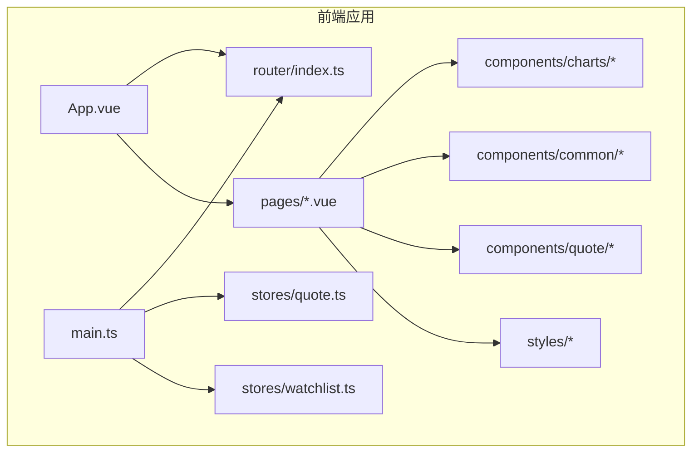
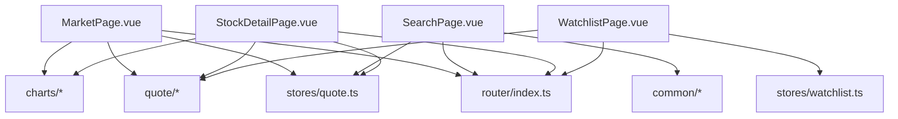
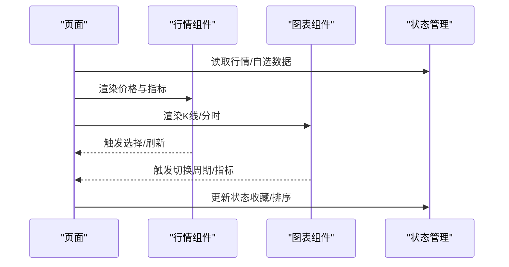
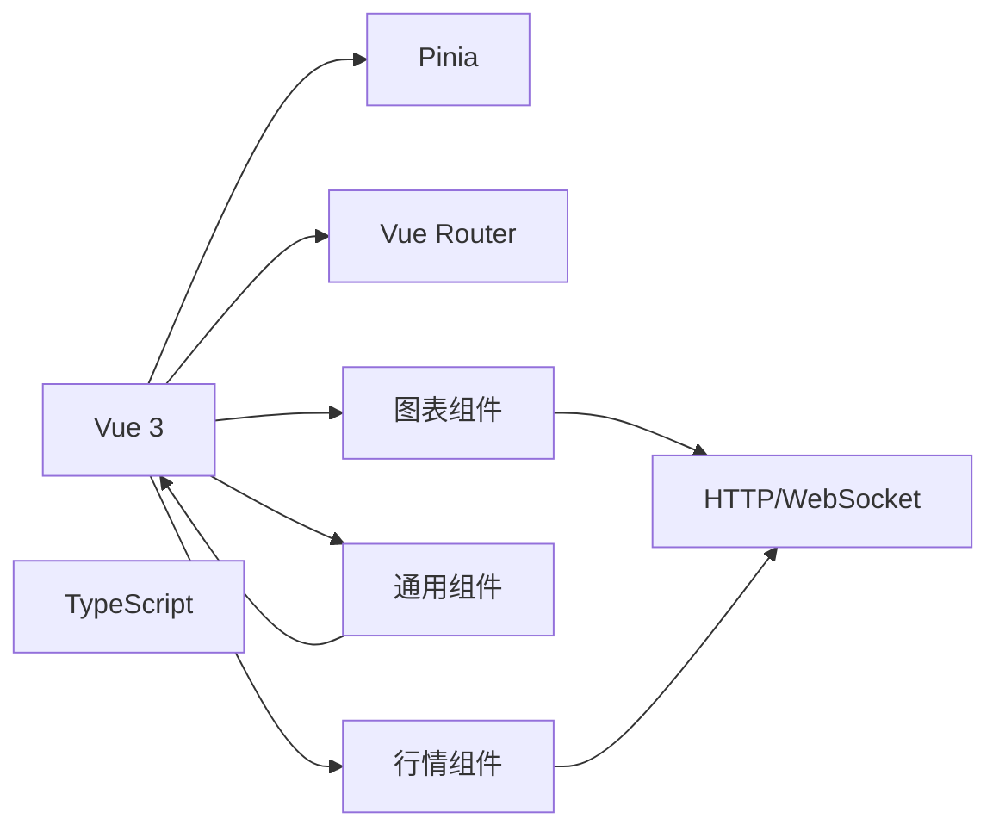

# UI组件

<cite>
**本文引用的文件**
- [README.md](file://README.md)
- [frontend/src/App.vue](file://frontend/src/App.vue)
- [frontend/src/main.ts](file://frontend/src/main.ts)
- [frontend/src/router/index.ts](file://frontend/src/router/index.ts)
- [frontend/src/stores/quote.ts](file://frontend/src/stores/quote.ts)
- [frontend/src/stores/watchlist.ts](file://frontend/src/stores/watchlist.ts)
- [frontend/src/components/charts/](file://frontend/src/components/charts/)
- [frontend/src/components/common/](file://frontend/src/components/common/)
- [frontend/src/components/quote/](file://frontend/src/components/quote/)
- [frontend/src/pages/MarketPage.vue](file://frontend/src/pages/MarketPage.vue)
- [frontend/src/pages/SearchPage.vue](file://frontend/src/pages/SearchPage.vue)
- [frontend/src/pages/StockDetailPage.vue](file://frontend/src/pages/StockDetailPage.vue)
- [frontend/src/pages/WatchlistPage.vue](file://frontend/src/pages/WatchlistPage.vue)
- [frontend/src/styles/](file://frontend/src/styles/)
- [frontend/package.json](file://frontend/package.json)
- [frontend/vite.config.ts](file://frontend/vite.config.ts)
</cite>

## 目录
1. [简介](#简介)
2. [项目结构](#项目结构)
3. [核心组件](#核心组件)
4. [架构总览](#架构总览)
5. [组件详解](#组件详解)
6. [依赖关系分析](#依赖关系分析)
7. [性能考量](#性能考量)
8. [故障排查指南](#故障排查指南)
9. [结论](#结论)
10. [附录](#附录)

## 简介
本项目为一个前后端分离的股票可视化应用，前端采用Vue 3 + TypeScript + Vite构建，后端提供REST与WebSocket接口。UI组件库围绕“图表组件、通用组件、行情相关组件”三大类组织，服务于市场页、搜索页、自选页与个股详情页等页面场景。组件设计强调可复用性、可访问性与跨浏览器一致性，并通过状态管理与路由集成实现数据驱动的交互体验。

## 项目结构
前端工程位于frontend目录，采用按功能域分层的组织方式：
- 组件层：src/components 下分为 charts（图表）、common（通用）、quote（行情）三类
- 页面层：src/pages 提供四大页面入口
- 状态层：src/stores 提供行情与自选状态管理
- 路由层：src/router 集成页面路由
- 样式层：src/styles 统一主题与基础样式
- 入口：src/main.ts 注入应用、挂载路由与状态
- 应用根：src/App.vue 定义全局布局与容器

**图示来源**
- [frontend/src/App.vue](file://frontend/src/App.vue)
- [frontend/src/main.ts](file://frontend/src/main.ts)
- [frontend/src/router/index.ts](file://frontend/src/router/index.ts)
- [frontend/src/stores/quote.ts](file://frontend/src/stores/quote.ts)
- [frontend/src/stores/watchlist.ts](file://frontend/src/stores/watchlist.ts)
- [frontend/src/pages/MarketPage.vue](file://frontend/src/pages/MarketPage.vue)
- [frontend/src/pages/SearchPage.vue](file://frontend/src/pages/SearchPage.vue)
- [frontend/src/pages/StockDetailPage.vue](file://frontend/src/pages/StockDetailPage.vue)
- [frontend/src/pages/WatchlistPage.vue](file://frontend/src/pages/WatchlistPage.vue)
- [frontend/src/components/charts/](file://frontend/src/components/charts/)
- [frontend/src/components/common/](file://frontend/src/components/common/)
- [frontend/src/components/quote/](file://frontend/src/components/quote/)
- [frontend/src/styles/](file://frontend/src/styles/)

**章节来源**
- [frontend/src/main.ts](file://frontend/src/main.ts)
- [frontend/src/App.vue](file://frontend/src/App.vue)
- [frontend/src/router/index.ts](file://frontend/src/router/index.ts)
- [frontend/src/stores/quote.ts](file://frontend/src/stores/quote.ts)
- [frontend/src/stores/watchlist.ts](file://frontend/src/stores/watchlist.ts)

## 核心组件
- 图表组件（charts）
  - 用于展示K线、分时、成交量等金融数据，强调交互性与可读性
  - 设计要点：支持缩放、平移、指标叠加、主题色系切换
- 通用组件（common）
  - 包含按钮、输入框、标签、弹窗、加载态等基础UI元素
  - 设计要点：统一尺寸规范、无障碍属性、键盘导航、焦点管理
- 行情组件（quote）
  - 围绕实时/历史行情数据的展示与交互，如价格、涨跌幅、买卖盘等
  - 设计要点：数据格式化、颜色语义（涨跌）、响应式布局

这些组件通过页面进行编排，配合状态管理与路由实现数据驱动的渲染与交互。

**章节来源**
- [frontend/src/components/charts/](file://frontend/src/components/charts/)
- [frontend/src/components/common/](file://frontend/src/components/common/)
- [frontend/src/components/quote/](file://frontend/src/components/quote/)

## 架构总览
应用采用“页面-组件-状态-路由”的分层架构：
- 页面负责业务编排与数据获取
- 组件负责UI呈现与用户交互
- 状态管理负责跨页面共享的数据（如行情、自选）
- 路由负责页面切换与参数传递

**图示来源**
- [frontend/src/pages/MarketPage.vue](file://frontend/src/pages/MarketPage.vue)
- [frontend/src/pages/SearchPage.vue](file://frontend/src/pages/SearchPage.vue)
- [frontend/src/pages/StockDetailPage.vue](file://frontend/src/pages/StockDetailPage.vue)
- [frontend/src/pages/WatchlistPage.vue](file://frontend/src/pages/WatchlistPage.vue)
- [frontend/src/components/charts/](file://frontend/src/components/charts/)
- [frontend/src/components/common/](file://frontend/src/components/common/)
- [frontend/src/components/quote/](file://frontend/src/components/quote/)
- [frontend/src/stores/quote.ts](file://frontend/src/stores/quote.ts)
- [frontend/src/stores/watchlist.ts](file://frontend/src/stores/watchlist.ts)
- [frontend/src/router/index.ts](file://frontend/src/router/index.ts)

## 组件详解

### 图表组件（charts）
- 设计理念
  - 数据驱动：以标准化的数据结构驱动渲染，支持多周期、多指标
  - 交互友好：提供缩放、平移、标注、指标切换等操作
  - 主题一致：通过CSS变量与主题配置实现深浅色模式适配
- 关键能力
  - K线/分时/成交量渲染
  - 指标叠加（均线、MACD、成交量等）
  - 响应式布局与触摸手势支持
- 使用建议
  - 在页面中通过props传入数据与配置，避免直接操作DOM
  - 结合状态管理更新数据，减少重复渲染
  - 对于大数据量场景，启用虚拟滚动或采样策略

**章节来源**
- [frontend/src/components/charts/](file://frontend/src/components/charts/)

### 通用组件（common）
- 设计理念
  - 可访问性优先：提供ARIA属性、键盘可达、焦点可见
  - 一致性：统一尺寸、间距、字体、颜色体系
  - 可扩展：支持通过类名或样式变量覆盖默认样式
- 关键能力
  - 按钮（主次/禁用/加载态）
  - 输入框（文本/数字/搜索）
  - 标签与徽章
  - 弹窗与抽屉
  - 加载与骨架屏
- 使用建议
  - 为交互元素提供明确的语义与提示
  - 合理使用插槽扩展内容
  - 注意跨浏览器兼容性（如placeholder、focus-ring）

**章节来源**
- [frontend/src/components/common/](file://frontend/src/components/common/)

### 行情组件（quote）
- 设计理念
  - 实时性与准确性：正确映射涨跌、价格、时间等字段
  - 信息层级：通过排版与色彩传达重要程度
  - 一致性：与图表组件在主题与尺寸上保持统一
- 关键能力
  - 实时价格与涨跌幅展示
  - 买卖盘与委托队列
  - 历史K线与分时切换
- 使用建议
  - 与WebSocket或轮询结合，保证数据新鲜度
  - 对数值进行本地化格式化（千分位、小数位）
  - 在移动端优化点击区域与触摸反馈

**章节来源**
- [frontend/src/components/quote/](file://frontend/src/components/quote/)

### 页面与组件编排
- 市场页（MarketPage.vue）
  - 展示综合行情与热门板块，使用图表组件绘制大盘走势，通用组件承载筛选与搜索
- 搜索页（SearchPage.vue）
  - 通过输入框与列表组件实现快速检索，结合通用组件提供加载与空态
- 个股详情页（StockDetailPage.vue）
  - 聚焦个股K线与分时，配合行情组件展示关键指标
- 自选页（WatchlistPage.vue）
  - 列表展示自选股，支持批量操作与排序，使用通用组件承载交互

**图示来源**
- [frontend/src/pages/MarketPage.vue](file://frontend/src/pages/MarketPage.vue)
- [frontend/src/pages/SearchPage.vue](file://frontend/src/pages/SearchPage.vue)
- [frontend/src/pages/StockDetailPage.vue](file://frontend/src/pages/StockDetailPage.vue)
- [frontend/src/pages/WatchlistPage.vue](file://frontend/src/pages/WatchlistPage.vue)
- [frontend/src/components/quote/](file://frontend/src/components/quote/)
- [frontend/src/components/charts/](file://frontend/src/components/charts/)
- [frontend/src/stores/quote.ts](file://frontend/src/stores/quote.ts)
- [frontend/src/stores/watchlist.ts](file://frontend/src/stores/watchlist.ts)

## 依赖关系分析
- 技术栈
  - Vue 3（Composition API）、TypeScript、Vite
  - 状态管理：Pinia（从store文件命名推断）
  - 路由：Vue Router
  - 样式：CSS Modules 或 CSS变量（从样式目录推断）
- 外部依赖
  - 图表库：基于组件封装（如ECharts或自研）
  - HTTP客户端：Axios（从API封装推断）
  - WebSocket：后端提供实时行情推送
- 依赖耦合
  - 页面对组件的依赖为单向数据流
  - 组件对状态管理的依赖通过store注入
  - 路由与页面解耦，便于测试与复用

**图示来源**
- [frontend/src/main.ts](file://frontend/src/main.ts)
- [frontend/src/stores/quote.ts](file://frontend/src/stores/quote.ts)
- [frontend/src/stores/watchlist.ts](file://frontend/src/stores/watchlist.ts)
- [frontend/src/router/index.ts](file://frontend/src/router/index.ts)
- [frontend/src/components/charts/](file://frontend/src/components/charts/)
- [frontend/src/components/common/](file://frontend/src/components/common/)
- [frontend/src/components/quote/](file://frontend/src/components/quote/)

**章节来源**
- [frontend/package.json](file://frontend/package.json)
- [frontend/vite.config.ts](file://frontend/vite.config.ts)
- [frontend/src/main.ts](file://frontend/src/main.ts)
- [frontend/src/stores/quote.ts](file://frontend/src/stores/quote.ts)
- [frontend/src/stores/watchlist.ts](file://frontend/src/stores/watchlist.ts)
- [frontend/src/router/index.ts](file://frontend/src/router/index.ts)

## 性能考量
- 渲染优化
  - 使用虚拟列表渲染长列表
  - 图表组件启用Canvas/虚拟画布，限制同时渲染的元素数量
- 数据更新
  - 采用防抖/节流处理高频交互（如缩放、拖拽）
  - 分批更新状态，避免一次性大量变更
- 资源加载
  - 图表库按需引入，减少首屏体积
  - 图片与图标使用懒加载与SVG矢量图
- 内存管理
  - 组件销毁时清理定时器与订阅
  - 避免闭包持有大对象导致内存泄漏

## 故障排查指南
- 常见问题
  - 图表不显示：检查数据格式是否符合组件要求；确认容器尺寸已就绪
  - 行情数据延迟：检查WebSocket连接状态与后端推送频率
  - 样式异常：确认CSS变量覆盖顺序与作用域；检查主题切换逻辑
  - 键盘无法聚焦：为交互元素添加tabindex与aria-label
- 排查步骤
  - 打开浏览器开发者工具，定位网络请求与控制台错误
  - 在页面中打印当前状态与props，验证数据流向
  - 使用最小可复现示例隔离问题范围
- 修复建议
  - 对外暴露必要的事件回调（如onResize、onSelect），便于上层处理
  - 为关键组件提供默认值与容错逻辑，避免因缺省导致崩溃

**章节来源**
- [frontend/src/components/charts/](file://frontend/src/components/charts/)
- [frontend/src/components/common/](file://frontend/src/components/common/)
- [frontend/src/components/quote/](file://frontend/src/components/quote/)

## 结论
该UI组件库以页面为中心，围绕图表、通用与行情三大组件域构建，通过状态管理与路由实现清晰的数据流与交互链路。组件在可访问性、主题定制与响应式方面具备良好基础，建议在后续迭代中完善组件API文档、测试用例与性能监控，进一步提升可维护性与可扩展性。

## 附录
- 最佳实践
  - 组件组合：将通用组件作为基础，行情组件作为数据载体，图表组件作为展示层
  - 状态传递：通过store集中管理全局状态，页面内局部状态仅保留必要字段
  - 性能优化：对高频更新的数据进行缓存与批处理，合理拆分组件职责
- 可访问性与兼容性
  - 为所有交互元素提供键盘可达与屏幕阅读器支持
  - 使用CSS变量与媒体查询实现主题与响应式适配
  - 在低端设备上降级动画与特效，保证基本功能可用