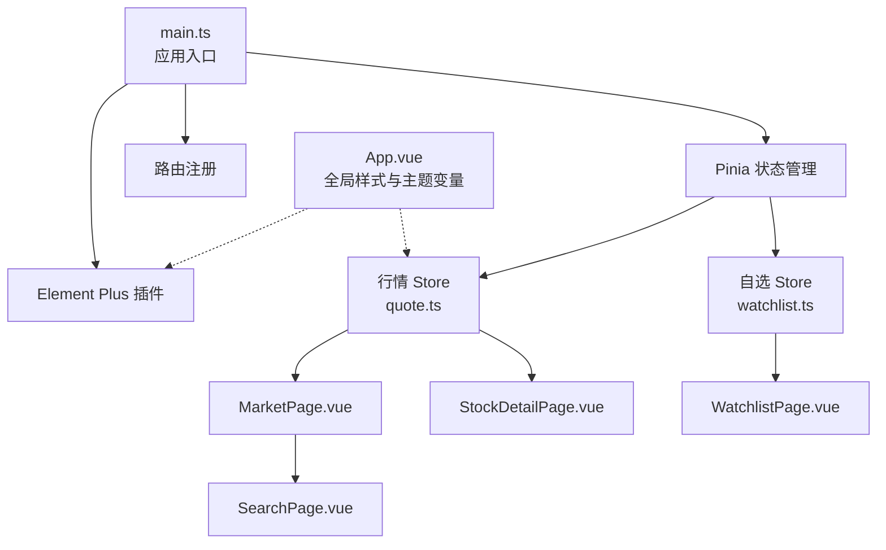
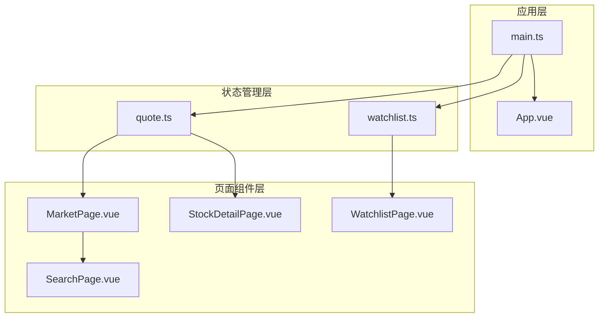
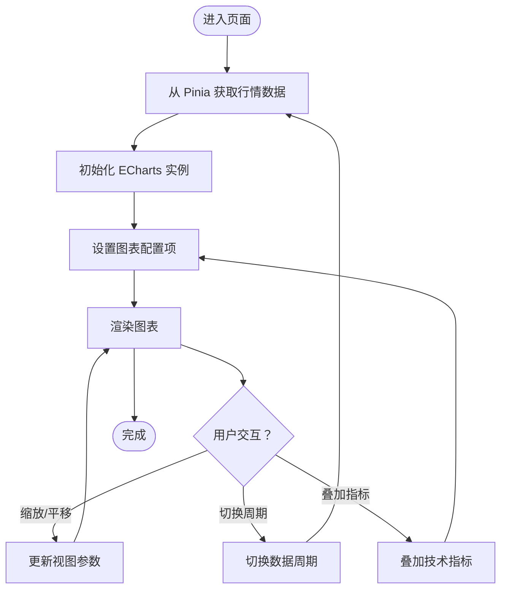
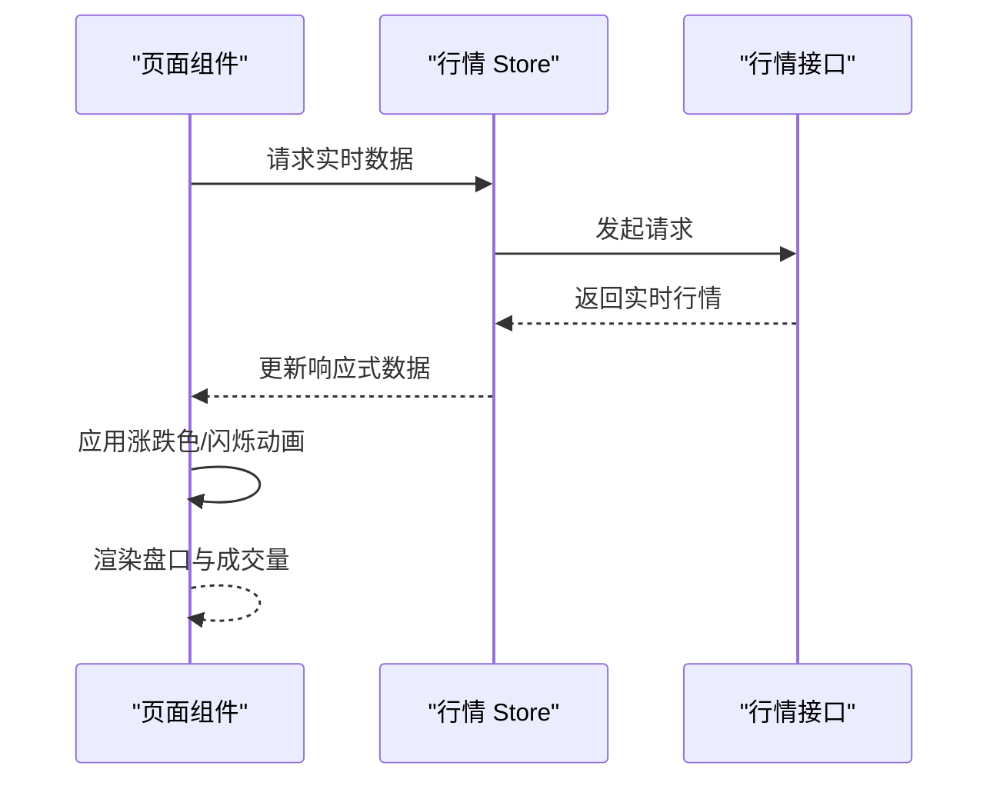
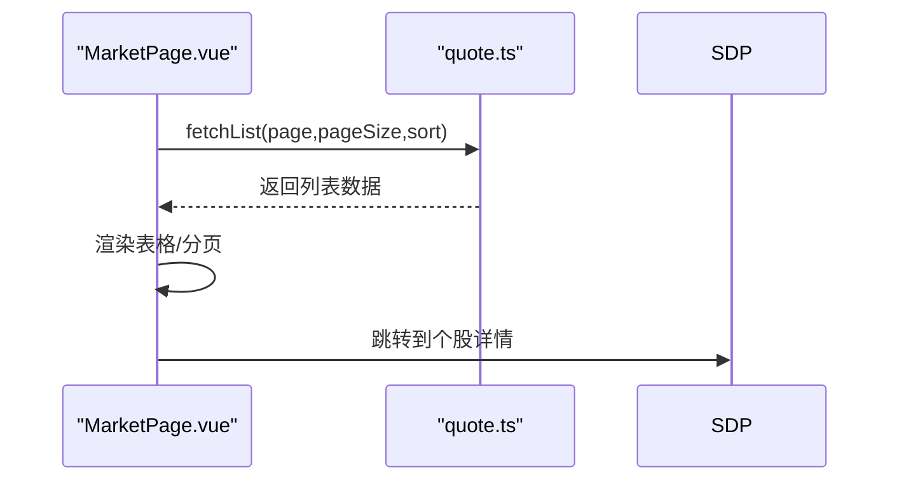
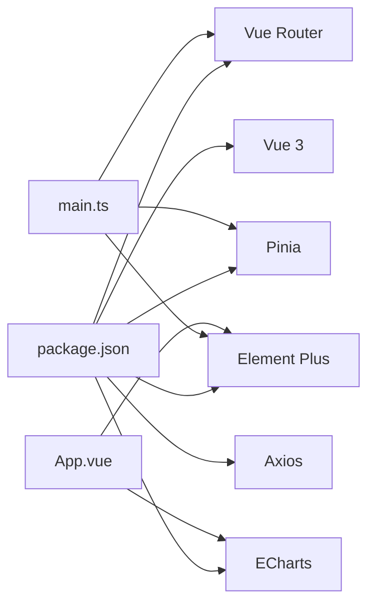

# UI组件库

<cite>
**本文引用的文件**
- [package.json](file://frontend/package.json)
- [main.ts](file://frontend/src/main.ts)
- [App.vue](file://frontend/src/App.vue)
- [quote.ts](file://frontend/src/stores/quote.ts)
- [watchlist.ts](file://frontend/src/stores/watchlist.ts)
- [MarketPage.vue](file://frontend/src/pages/MarketPage.vue)
- [SearchPage.vue](file://frontend/src/pages/SearchPage.vue)
- [StockDetailPage.vue](file://frontend/src/pages/StockDetailPage.vue)
- [WatchlistPage.vue](file://frontend/src/pages/WatchlistPage.vue)
</cite>

## 目录
1. [简介](#简介)
2. [项目结构](#项目结构)
3. [核心组件](#核心组件)
4. [架构总览](#架构总览)
5. [详细组件分析](#详细组件分析)
6. [依赖分析](#依赖分析)
7. [性能考虑](#性能考虑)
8. [故障排查指南](#故障排查指南)
9. [结论](#结论)
10. [附录](#附录)

## 简介
本文件面向Stock-View前端UI组件库，系统化梳理Element Plus与ECharts在项目中的集成方式，结合行情数据驱动的图表组件、通用组件与行情组件的设计模式，给出属性配置、事件处理、样式定制、可访问性与国际化建议，并总结测试策略、性能优化与文档生成最佳实践。由于当前仓库中未包含具体组件源码文件（components目录为空），本文以现有页面与状态管理为依据，对组件库的使用方式进行规范化的文档化说明。

## 项目结构
前端采用Vue 3 + Vite + TypeScript + Pinia + Element Plus + ECharts的组合。应用入口在main.ts中注册Element Plus与路由；主题通过App.vue中的CSS变量与Element Plus深色覆盖实现；行情数据通过Pinia store进行集中管理，页面组件按功能拆分为市场页、自选页、搜索页与个股详情页。

**图示来源**
- [main.ts:1-12](file://frontend/src/main.ts#L1-L12)
- [App.vue:1-234](file://frontend/src/App.vue#L1-L234)
- [quote.ts:1-43](file://frontend/src/stores/quote.ts#L1-L43)
- [watchlist.ts:1-36](file://frontend/src/stores/watchlist.ts#L1-L36)
- [MarketPage.vue](file://frontend/src/pages/MarketPage.vue)
- [StockDetailPage.vue](file://frontend/src/pages/StockDetailPage.vue)
- [WatchlistPage.vue](file://frontend/src/pages/WatchlistPage.vue)
- [SearchPage.vue](file://frontend/src/pages/SearchPage.vue)

**章节来源**
- [main.ts:1-12](file://frontend/src/main.ts#L1-L12)
- [App.vue:1-234](file://frontend/src/App.vue#L1-L234)
- [package.json:1-27](file://frontend/package.json#L1-L27)

## 核心组件
- Element Plus集成与主题定制
  - 在应用入口注册Element Plus插件，并引入全局样式，确保组件库在全站生效。
  - 通过CSS变量定义金融主题色系与暗色背景，配合Element Plus深色覆盖规则，统一表格、分页、按钮、输入框等组件的视觉风格。
  - 提供涨跌色全局工具类，便于在数据更新时添加闪烁动画效果。

- ECharts集成与图表组件
  - 项目依赖ECharts，建议在页面组件中按需引入并初始化图表实例，结合Pinia中的行情数据进行渲染。
  - 图表类型建议包括K线图、分时图与叠加技术指标（如均线、MACD、成交量等），通过配置项控制颜色、坐标轴、工具箱与交互行为。

- 行情数据驱动的页面组件
  - MarketPage.vue：用于展示行情列表，结合Pinia的行情store加载数据、排序与分页。
  - StockDetailPage.vue：个股详情页，展示K线图、分时图与盘口数据。
  - WatchlistPage.vue：自选列表页，展示自选股并支持增删操作。
  - SearchPage.vue：搜索页，提供股票检索与跳转。

**章节来源**
- [main.ts:1-12](file://frontend/src/main.ts#L1-L12)
- [App.vue:47-104](file://frontend/src/App.vue#L47-L104)
- [App.vue:205-234](file://frontend/src/App.vue#L205-L234)
- [quote.ts:1-43](file://frontend/src/stores/quote.ts#L1-L43)
- [watchlist.ts:1-36](file://frontend/src/stores/watchlist.ts#L1-L36)

## 架构总览
下图展示了从应用入口到页面组件的数据流与依赖关系，以及Element Plus与ECharts在其中的角色。

**图示来源**
- [main.ts:1-12](file://frontend/src/main.ts#L1-L12)
- [App.vue:1-234](file://frontend/src/App.vue#L1-L234)
- [quote.ts:1-43](file://frontend/src/stores/quote.ts#L1-L43)
- [watchlist.ts:1-36](file://frontend/src/stores/watchlist.ts#L1-L36)
- [MarketPage.vue](file://frontend/src/pages/MarketPage.vue)
- [StockDetailPage.vue](file://frontend/src/pages/StockDetailPage.vue)
- [WatchlistPage.vue](file://frontend/src/pages/WatchlistPage.vue)
- [SearchPage.vue](file://frontend/src/pages/SearchPage.vue)

## 详细组件分析

### 图表组件（charts）
- 集成方式
  - 通过依赖管理引入ECharts，在页面组件中按需导入并初始化实例。
  - 使用Pinia中的行情数据作为图表数据源，实现动态刷新与交互。
- K线图配置
  - 建议配置主图（K线）与副图（成交量）双轴布局，主图颜色遵循涨跌色变量，副图采用柱状图展示。
  - 支持缩放、平移、工具箱与数据区域选择等交互。
- 分时图绘制
  - 分时图通常叠加均价线，时间轴与价格轴需适配分钟级数据密度。
  - 支持实时更新与滚动视图，提升用户体验。
- 技术指标叠加
  - 常见指标包括均线（MA）、MACD、KDJ、布林带等，建议通过独立系列叠加，避免遮挡主图。
  - 指标计算可在数据到达后本地完成，或由后端返回已计算结果。

[此流程图为概念性示意，不直接映射具体源文件]

### 通用组件（common）
- 设计模式
  - 封装弹窗组件：统一模态框的触发、标题、内容与关闭逻辑，支持可选确认/取消回调。
  - 封装按钮组件：统一尺寸、禁用状态、加载状态与图标，支持多种主题与语义。
  - 封装输入框组件：统一校验、占位符、前缀/后缀与清空功能，支持受控与非受控两种模式。
- 复用策略
  - 通过属性（props）传递配置，通过事件（events）暴露交互结果，减少页面重复代码。
  - 统一命名与默认值，保证跨页面一致性。

[本节为设计模式概述，不直接分析具体文件]

### 行情组件（quote）
- 实时价格显示
  - 使用Pinia的行情store拉取实时数据，页面组件订阅数据变化并在渲染时应用涨跌色与闪烁动画。
- 涨跌标识
  - 通过全局工具类或内联样式为涨跌数字着色，支持百分比与绝对值两种显示格式。
- 成交量展示
  - 成交量通常位于K线图下方作为副图，采用柱状图展示，颜色与涨跌一致。
- 盘口数据组件
  - 展示买卖盘口、委比、委差等字段，建议使用表格组件并启用行高亮与排序。

**图示来源**
- [quote.ts:24-30](file://frontend/src/stores/quote.ts#L24-L30)
- [quote.ts:32-40](file://frontend/src/stores/quote.ts#L32-L40)
- [App.vue:220-227](file://frontend/src/App.vue#L220-L227)

**章节来源**
- [quote.ts:1-43](file://frontend/src/stores/quote.ts#L1-L43)
- [App.vue:228-234](file://frontend/src/App.vue#L228-L234)

### 页面组件与数据流
- MarketPage.vue
  - 加载行情列表，支持排序与分页；点击行进入个股详情页。
- StockDetailPage.vue
  - 展示K线图、分时图与盘口数据；支持周期切换与指标叠加。
- WatchlistPage.vue
  - 展示自选列表，支持添加/删除；点击进入个股详情页。
- SearchPage.vue
  - 提供搜索框与结果列表，支持跳转至个股详情页。

**图示来源**
- [MarketPage.vue](file://frontend/src/pages/MarketPage.vue)
- [quote.ts:11-22](file://frontend/src/stores/quote.ts#L11-L22)

**章节来源**
- [MarketPage.vue](file://frontend/src/pages/MarketPage.vue)
- [StockDetailPage.vue](file://frontend/src/pages/StockDetailPage.vue)
- [WatchlistPage.vue](file://frontend/src/pages/WatchlistPage.vue)
- [SearchPage.vue](file://frontend/src/pages/SearchPage.vue)
- [quote.ts:1-43](file://frontend/src/stores/quote.ts#L1-L43)

## 依赖分析
- 第三方依赖
  - Vue 3、Vue Router、Pinia：提供响应式与状态管理能力。
  - Element Plus：提供UI基础组件与主题系统。
  - ECharts：提供专业图表渲染能力。
  - Axios：提供HTTP请求能力。
  - @vueuse/core：提供常用组合式工具函数。
- 内部依赖
  - main.ts依赖Element Plus与路由；App.vue提供全局样式与主题变量；store负责数据聚合与分发；页面组件消费store并渲染图表。

**图示来源**
- [package.json:11-19](file://frontend/package.json#L11-L19)
- [main.ts:1-12](file://frontend/src/main.ts#L1-L12)
- [App.vue:1-234](file://frontend/src/App.vue#L1-L234)

**章节来源**
- [package.json:1-27](file://frontend/package.json#L1-L27)
- [main.ts:1-12](file://frontend/src/main.ts#L1-L12)

## 性能考虑
- 图表渲染优化
  - 对于大量K线数据，建议启用ECharts的大数据优化选项与虚拟滚动；按需加载数据，避免一次性渲染过多点位。
  - 合理设置重绘频率，使用防抖与节流处理窗口resize与交互事件。
- 状态与渲染优化
  - Pinia store中仅保存必要字段，避免冗余数据；使用计算属性缓存派生数据。
  - 页面组件中使用浅层响应式与懒加载策略，减少不必要的重渲染。
- 主题与样式
  - 将主题变量集中在App.vue中维护，避免在组件内部重复定义；利用CSS变量实现主题切换与暗色模式。
- 网络与缓存
  - 对实时行情数据设置合理的缓存策略与轮询间隔；对历史数据采用分页与增量更新。

[本节为通用性能建议，不直接分析具体文件]

## 故障排查指南
- Element Plus样式异常
  - 确认已在入口正确引入Element Plus插件与全局样式；检查深色覆盖规则是否被其他样式覆盖。
- 图表不显示或渲染缓慢
  - 检查数据格式是否符合ECharts配置要求；确认容器尺寸与resize时机；验证大数据优化开关。
- 行情数据不同步
  - 检查store中的fetchRealtime与updateQuote逻辑；确认WebSocket或轮询是否正常工作；核对symbol匹配与数据合并策略。
- 页面跳转与路由问题
  - 确认路由配置与页面组件路径；检查router-link的to属性与活动状态类名。

**章节来源**
- [main.ts:1-12](file://frontend/src/main.ts#L1-L12)
- [App.vue:205-234](file://frontend/src/App.vue#L205-L234)
- [quote.ts:24-40](file://frontend/src/stores/quote.ts#L24-L40)

## 结论
本UI组件库以Element Plus为基础，结合ECharts实现专业的行情可视化；通过Pinia集中管理行情与自选数据，页面组件围绕数据驱动进行渲染与交互。建议在后续迭代中补充具体组件源码、完善单元测试与文档生成流程，并持续优化图表性能与主题一致性。

## 附录
- 可访问性支持
  - 为按钮与链接提供键盘可达性；为表格与图表提供ARIA标签与描述；确保颜色对比度满足WCAG标准。
- 国际化配置
  - 使用Element Plus的国际化能力与日期/数字格式化工具；在组件中预留文案占位符以便多语言扩展。
- 主题定制方案
  - 基于App.vue中的CSS变量体系扩展更多主题变量；为Element Plus提供自定义CSS覆盖，确保组件风格统一。
- 组件测试策略
  - 单元测试：针对store的异步方法与图表配置进行断言；快照测试：对渲染后的DOM进行快照比对。
  - 集成测试：模拟路由与状态变更，验证页面渲染与交互流程。
- 性能优化技巧
  - 图表：启用大数据优化、虚拟滚动与懒加载；减少重绘与重排。
  - 应用：使用keep-alive缓存页面；按需引入组件与图标；压缩静态资源。
- 组件文档生成最佳实践
  - 使用TypeDoc或Vuese生成API文档；为每个组件提供属性、事件、插槽与示例；建立组件变更日志与迁移指南。

[本节为通用实践建议，不直接分析具体文件]