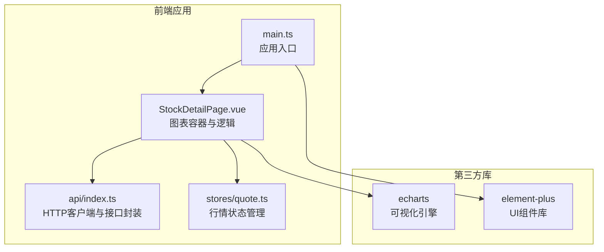
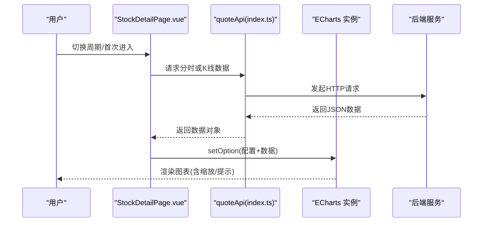
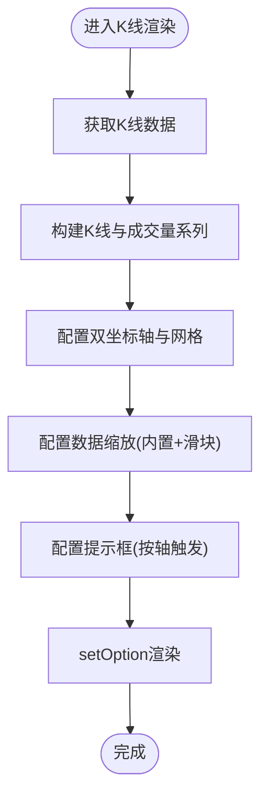
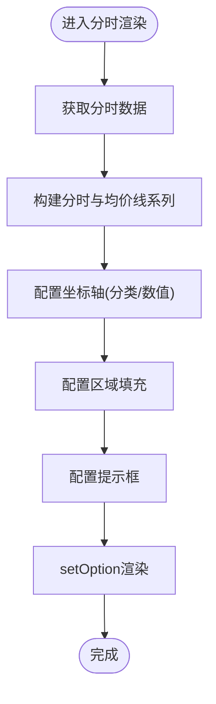
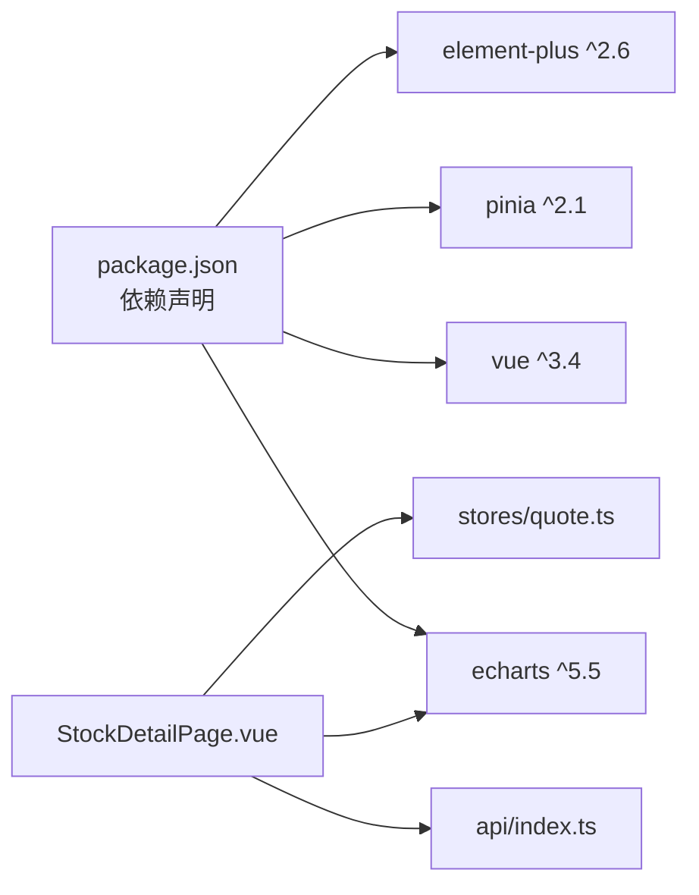

# 图表组件

<cite>
**本文引用的文件**
- [StockDetailPage.vue](file://frontend/src/pages/StockDetailPage.vue)
- [index.ts](file://frontend/src/api/index.ts)
- [quote.ts](file://frontend/src/stores/quote.ts)
- [main.ts](file://frontend/src/main.ts)
- [package.json](file://frontend/package.json)
</cite>

## 目录
1. [简介](#简介)
2. [项目结构](#项目结构)
3. [核心组件](#核心组件)
4. [架构总览](#架构总览)
5. [详细组件分析](#详细组件分析)
6. [依赖分析](#依赖分析)
7. [性能考虑](#性能考虑)
8. [故障排查指南](#故障排查指南)
9. [结论](#结论)
10. [附录](#附录)

## 简介
本文件聚焦于Stock-View前端中基于ECharts的图表组件实现与集成，涵盖以下方面：
- K线图（蜡烛图）绘制、成交量叠加、时间轴配置、缩放与平移
- 分时图设计：分时数据渲染、均价线绘制、交易量显示、实时更新机制
- 技术指标图表组件：MACD、KDJ、RSI等指标的叠加显示、参数配置、颜色主题
- 图表组件的属性配置选项、事件监听、数据更新策略
- 图表性能优化技巧、响应式布局适配、移动端触摸交互支持
- 图表主题定制、国际化支持、无障碍访问功能

## 项目结构
前端采用Vue 3 + Vite + TypeScript + Pinia + Element Plus 构建，图表相关逻辑集中在“股票详情页”中，通过Axios封装的API调用后端接口，获取分时与K线数据并交由ECharts渲染。

**图表来源**
- [main.ts:1-12](file://frontend/src/main.ts#L1-L12)
- [StockDetailPage.vue:140-335](file://frontend/src/pages/StockDetailPage.vue#L140-L335)
- [index.ts:1-33](file://frontend/src/api/index.ts#L1-L33)
- [quote.ts:1-43](file://frontend/src/stores/quote.ts#L1-L43)

**章节来源**
- [package.json:11-18](file://frontend/package.json#L11-L18)
- [main.ts:1-12](file://frontend/src/main.ts#L1-L12)

## 核心组件
- 图表容器与生命周期：在页面挂载时初始化ECharts实例，卸载时释放资源；根据周期切换加载分时或K线数据。
- 数据源与更新：通过API模块获取实时行情、分时、K线与盘口数据；定时刷新实现“准实时”展示。
- 配置项：统一通过setOption传入，包含网格、坐标轴、提示框、数据缩放、系列类型与样式等。
- 交互控制：周期切换按钮、内部缩放与滑块缩放、鼠标悬停提示。

**章节来源**
- [StockDetailPage.vue:140-335](file://frontend/src/pages/StockDetailPage.vue#L140-L335)
- [index.ts:8-14](file://frontend/src/api/index.ts#L8-L14)

## 架构总览
下图展示了从用户操作到图表渲染的关键流程：

**图表来源**
- [StockDetailPage.vue:198-294](file://frontend/src/pages/StockDetailPage.vue#L198-L294)
- [index.ts:8-14](file://frontend/src/api/index.ts#L8-L14)

## 详细组件分析

### K线图组件（蜡烛图 + 成交量）
- 组件职责
  - 初始化ECharts实例，设置画布容器
  - 根据当前周期选择加载分时或K线数据
  - 渲染K线蜡烛图与下方成交量柱状图
  - 配置双坐标轴、数据缩放、提示框与网格
- 关键实现点
  - 容器与初始化：通过ref绑定DOM节点并调用初始化方法
  - K线系列：使用蜡烛图类型，区分涨跌颜色
  - 成交量系列：使用柱状图叠加在第二坐标轴上，涨跌颜色与K线一致
  - 时间轴与网格：双grid与双xAxis，K线主图与成交量副图分离
  - 缩放与平移：内置缩放与滑块缩放，初始显示最近一段时间
  - 提示框：按轴触发，交叉指示器，背景与文字颜色适配深色主题
- 数据更新策略
  - 切换周期时重新拉取数据并setOption
  - 页面挂载后定时轮询实时行情与盘口，保持面板信息最新

**图表来源**
- [StockDetailPage.vue:248-294](file://frontend/src/pages/StockDetailPage.vue#L248-L294)

**章节来源**
- [StockDetailPage.vue:248-294](file://frontend/src/pages/StockDetailPage.vue#L248-L294)

### 分时图组件（分时线 + 均价线 + 交易量）
- 组件职责
  - 展示当日分时走势与即时均价线
  - 显示分时交易量（可选，当前实现未启用）
  - 支持实时刷新，维持与盘口数据同步
- 关键实现点
  - 分时数据：从接口获取points数组，包含时间与价格
  - 均价线：在同一坐标系内绘制另一条折线
  - 区域填充：分时线下方添加渐变填充，提升视觉层次
  - 坐标轴：分类轴用于时间，数值轴用于价格，刻度与分割线适配深色主题
  - 提示框：按轴触发，显示时间与价格信息
- 数据更新策略
  - 页面挂载后定时刷新实时行情与盘口
  - 分时图独立于K线，切换周期不影响其渲染

**图表来源**
- [StockDetailPage.vue:205-246](file://frontend/src/pages/StockDetailPage.vue#L205-L246)

**章节来源**
- [StockDetailPage.vue:205-246](file://frontend/src/pages/StockDetailPage.vue#L205-L246)

### 技术指标图表组件（MACD/KDJ/RSI）
- 当前仓库现状
  - 未发现直接的MACD、KDJ、RSI指标叠加实现
  - 图表容器已具备多系列叠加能力（K线+成交量、分时+均价线）
- 推荐实现思路
  - 指标计算：在后端或前端计算指标值序列，作为series传入
  - 叠加显示：新增series类型（如折线、柱状、双yAxis），与主图叠加
  - 参数配置：通过props传入指标参数（如窗口大小、权重），动态生成option
  - 颜色主题：遵循现有深色主题风格，确保对比度与可读性
- 与现有容器的集成
  - 使用相同setOption模式，仅替换series与axes配置
  - 保持dataZoom与tooltip一致性，避免交互冲突

[本节为概念性指导，不直接分析具体文件，故无“章节来源”]

### 图表组件属性配置、事件监听与数据更新策略
- 属性配置
  - 容器与初始化：容器ref、初始化参数（渲染器等）
  - 选项：网格、坐标轴、系列、提示框、数据缩放、动画开关
  - 主题：背景色、坐标轴颜色、分割线样式、文字颜色
- 事件监听
  - 内置交互：缩放、平移、悬停提示
  - 自定义事件：可通过ECharts事件回调扩展（如点击标注、范围变更）
- 数据更新策略
  - 切换周期：重新setOption，保留动画关闭以避免闪烁
  - 实时刷新：定时器轮询，合并更新多个数据源
  - 错误处理：接口失败时保持上次有效状态，避免图表空白

**章节来源**
- [StockDetailPage.vue:198-294](file://frontend/src/pages/StockDetailPage.vue#L198-L294)
- [StockDetailPage.vue:319-335](file://frontend/src/pages/StockDetailPage.vue#L319-L335)

### 响应式布局与移动端适配
- 布局策略
  - 详情页主体采用flex布局，左侧图表区自适应，右侧面板固定宽度
  - 移动端折叠：当屏幕宽度小于阈值时，右侧面板横向滚动，保证可用性
- 图表适配
  - 坐标轴标签与分割线颜色适配深色背景
  - 内边距（grid.left/right/top/bottom）按小屏调整，避免遮挡
  - dataZoom尺寸与位置在移动端更友好

**章节来源**
- [StockDetailPage.vue:581-590](file://frontend/src/pages/StockDetailPage.vue#L581-L590)
- [StockDetailPage.vue:213-219](file://frontend/src/pages/StockDetailPage.vue#L213-L219)
- [StockDetailPage.vue:254-261](file://frontend/src/pages/StockDetailPage.vue#L254-L261)

### 主题定制、国际化与无障碍访问
- 主题定制
  - 深色主题：背景透明或深色，坐标轴与分割线采用浅灰/深灰对比
  - 颜色体系：涨用红色、跌用绿色、均价线使用强调色，确保高对比度
- 国际化
  - 数字格式化：价格保留两位小数，成交量/金额按单位转换显示
  - 文案与单位：当前以中文为主，可扩展语言包
- 无障碍访问
  - 建议：为图表容器提供aria-label描述；为交互元素提供键盘可达性；为颜色编码提供文本补充说明

**章节来源**
- [StockDetailPage.vue:169-186](file://frontend/src/pages/StockDetailPage.vue#L169-L186)
- [StockDetailPage.vue:210-212](file://frontend/src/pages/StockDetailPage.vue#L210-L212)
- [StockDetailPage.vue:251-257](file://frontend/src/pages/StockDetailPage.vue#L251-L257)

## 依赖分析
- ECharts版本：5.5，提供丰富的图表类型与交互能力
- Vue与生态：Vue 3、Pinia、Element Plus、Vite
- 状态与网络：Pinia管理行情列表与当前报价；Axios封装API接口

**图表来源**
- [package.json:11-18](file://frontend/package.json#L11-L18)
- [StockDetailPage.vue:140-146](file://frontend/src/pages/StockDetailPage.vue#L140-L146)
- [index.ts:1-33](file://frontend/src/api/index.ts#L1-L33)
- [quote.ts:1-43](file://frontend/src/stores/quote.ts#L1-L43)

**章节来源**
- [package.json:11-18](file://frontend/package.json#L11-L18)

## 性能考虑
- 渲染器选择：初始化时指定Canvas渲染器，适合大量数据与频繁更新场景
- 动画控制：关闭动画避免频繁setOption导致的闪烁与重绘开销
- 数据更新：批量更新与去抖，减少不必要的setOption调用
- 缩放策略：内置缩放优先，滑块缩放在移动端更直观
- 内存管理：组件卸载时释放ECharts实例，防止内存泄漏

**章节来源**
- [StockDetailPage.vue:202](file://frontend/src/pages/StockDetailPage.vue#L202)
- [StockDetailPage.vue:211](file://frontend/src/pages/StockDetailPage.vue#L211)
- [StockDetailPage.vue:333-334](file://frontend/src/pages/StockDetailPage.vue#L333-L334)

## 故障排查指南
- 图表不显示
  - 检查容器ref是否正确绑定且可见
  - 确认初始化参数与渲染器配置
- 数据为空
  - 核对API返回码与数据结构，确保分支处理
  - 检查定时器是否正常运行
- 交互异常
  - 确认dataZoom配置与坐标轴索引一致
  - 检查提示框样式与主题色对比度
- 内存泄漏
  - 卸载时务必dispose图表实例

**章节来源**
- [StockDetailPage.vue:198-294](file://frontend/src/pages/StockDetailPage.vue#L198-L294)
- [StockDetailPage.vue:319-335](file://frontend/src/pages/StockDetailPage.vue#L319-L335)

## 结论
本项目在StockDetailPage中实现了基于ECharts的K线图与分时图，具备良好的交互体验与主题适配。后续可在现有容器基础上扩展技术指标叠加、国际化与无障碍访问能力，并持续优化性能与移动端体验。

## 附录
- API接口清单（与图表相关）
  - 获取实时行情：GET /api/v1/quote/realtime
  - 获取K线数据：GET /api/v1/quote/kline
  - 获取分时数据：GET /api/v1/quote/timeline
  - 获取盘口数据：GET /api/v1/quote/orderbook

**章节来源**
- [index.ts:8-14](file://frontend/src/api/index.ts#L8-L14)