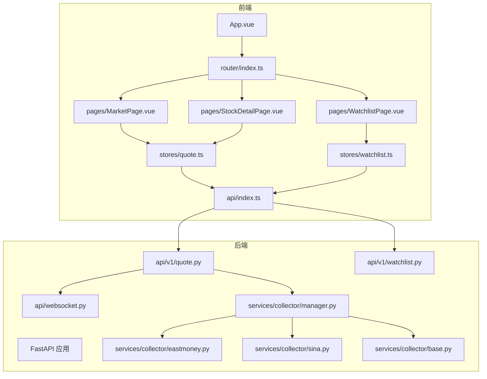
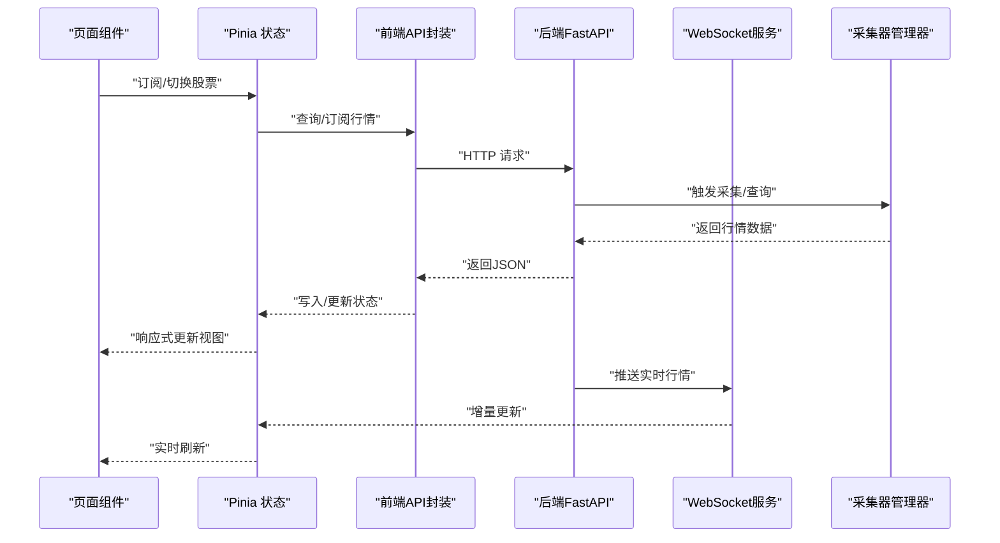
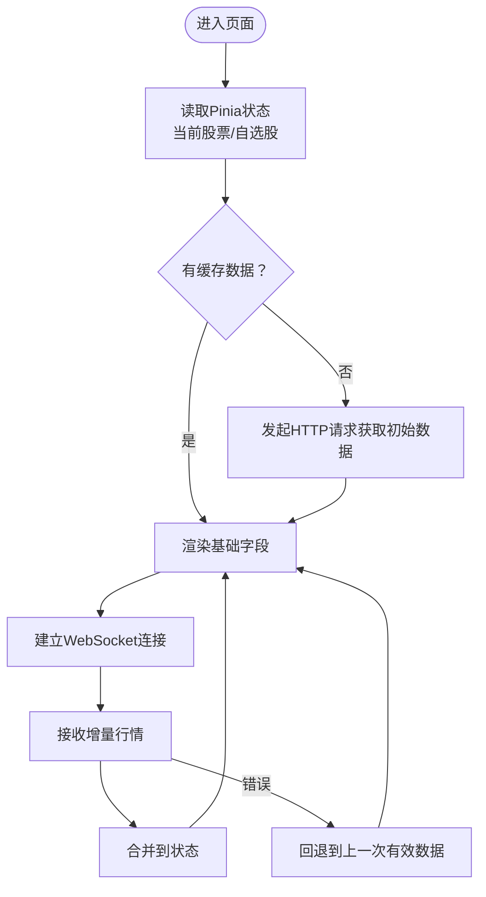
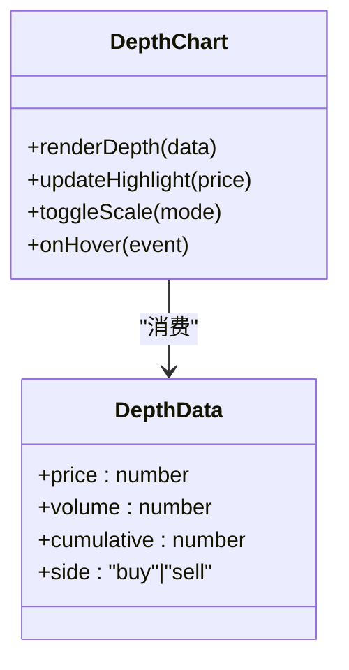
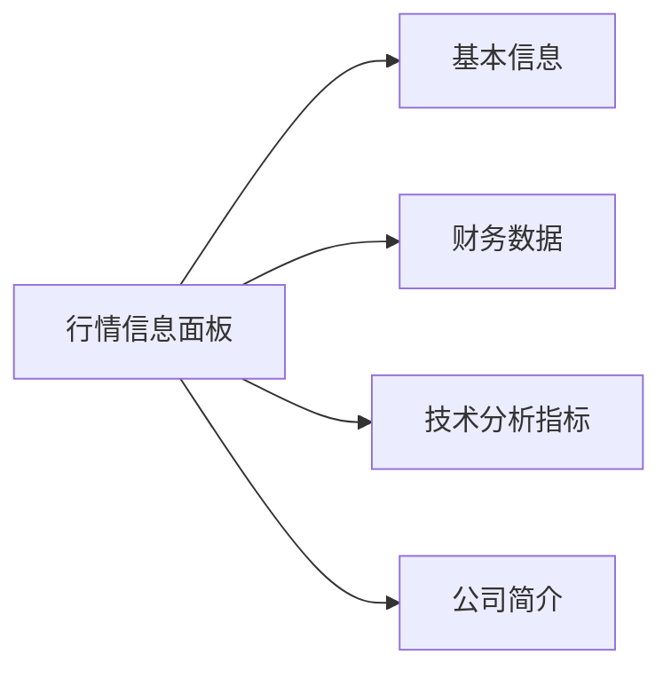
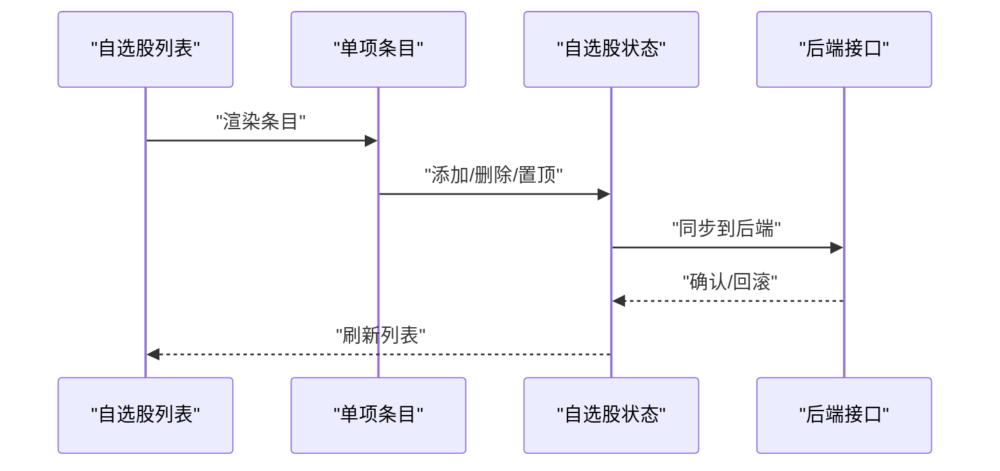
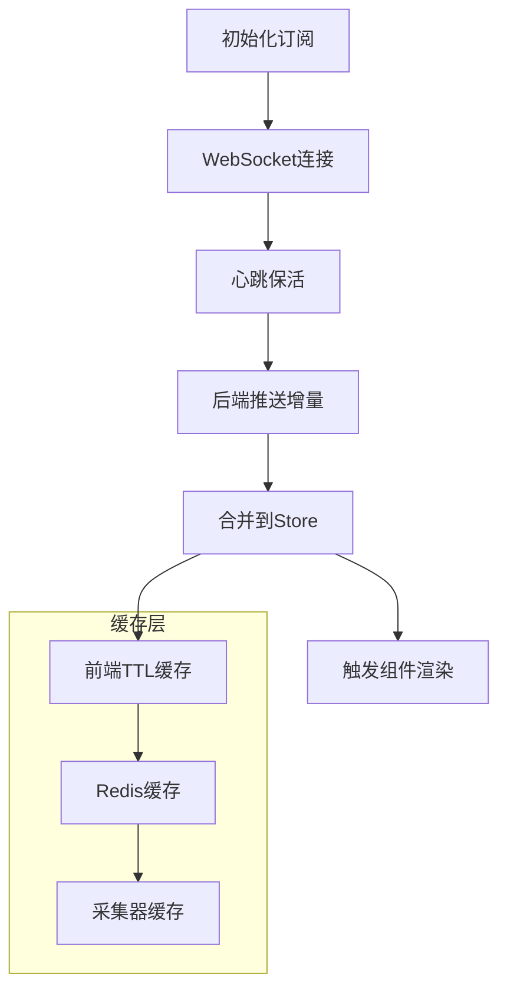
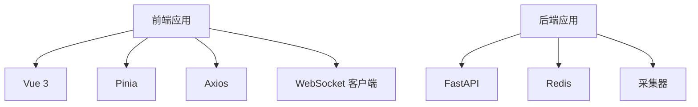

# 行情组件

<cite>
**本文引用的文件**
- [MarketPage.vue](file://frontend/src/pages/MarketPage.vue)
- [StockDetailPage.vue](file://frontend/src/pages/StockDetailPage.vue)
- [WatchlistPage.vue](file://frontend/src/pages/WatchlistPage.vue)
- [quote.ts（行情存储）](file://frontend/src/stores/quote.ts)
- [watchlist.ts（自选股存储）](file://frontend/src/stores/watchlist.ts)
- [quote.py（行情API）](file://backend/app/api/v1/quote.py)
- [watchlist.py（自选股API）](file://backend/app/api/v1/watchlist.py)
- [websocket.py（WebSocket服务）](file://backend/app/api/websocket.py)
- [eastmoney.py（采集器实现）](file://backend/app/services/collector/eastmoney.py)
- [sina.py（采集器实现）](file://backend/app/services/collector/sina.py)
- [base.py（采集器基类）](file://backend/app/services/collector/base.py)
- [manager.py（采集器管理器）](file://backend/app/services/collector/manager.py)
- [index.ts（前端API封装）](file://frontend/src/api/index.ts)
- [App.vue](file://frontend/src/App.vue)
- [main.ts](file://frontend/src/main.ts)
- [router/index.ts](file://frontend/src/router/index.ts)
- [vite.config.ts](file://frontend/src/vite.config.ts)
- [tsconfig.json](file://frontend/src/tsconfig.json)
- [package.json](file://frontend/package.json)
- [requirements.txt](file://backend/requirements.txt)
- [docker-compose.yml](file://docker-compose.yml)
</cite>

## 目录
1. [引言](#引言)
2. [项目结构](#项目结构)
3. [核心组件](#核心组件)
4. [架构总览](#架构总览)
5. [详细组件分析](#详细组件分析)
6. [依赖分析](#依赖分析)
7. [性能考虑](#性能考虑)
8. [故障排除指南](#故障排除指南)
9. [结论](#结论)
10. [附录](#附录)

## 引言
本文件聚焦于Stock-View的“行情组件”，系统性梳理实时行情数据展示、盘口图表、行情信息面板、自选股条目等模块的设计与实现要点。文档从数据流、组件职责、状态管理、WebSocket实时更新、缓存策略、性能优化、国际化与无障碍等方面进行深入解析，并提供可操作的排障建议与最佳实践。

## 项目结构
前端采用Vue 3 + TypeScript + Vite，后端采用Python + FastAPI，行情数据通过采集器从多家数据源拉取并通过WebSocket推送至前端；页面层包含市场页、股票详情页、自选股页三大入口，配合全局状态管理与路由配置，形成完整的行情浏览与交互体系。

**图表来源**
- [App.vue](file://frontend/src/App.vue)
- [router/index.ts](file://frontend/src/router/index.ts)
- [MarketPage.vue](file://frontend/src/pages/MarketPage.vue)
- [StockDetailPage.vue](file://frontend/src/pages/StockDetailPage.vue)
- [WatchlistPage.vue](file://frontend/src/pages/WatchlistPage.vue)
- [quote.ts（行情存储）](file://frontend/src/stores/quote.ts)
- [watchlist.ts（自选股存储）](file://frontend/src/stores/watchlist.ts)
- [index.ts（前端API封装）](file://frontend/src/api/index.ts)
- [quote.py（行情API）](file://backend/app/api/v1/quote.py)
- [watchlist.py（自选股API）](file://backend/app/api/v1/watchlist.py)
- [websocket.py（WebSocket服务）](file://backend/app/api/websocket.py)
- [manager.py（采集器管理器）](file://backend/app/services/collector/manager.py)
- [eastmoney.py（采集器实现）](file://backend/app/services/collector/eastmoney.py)
- [sina.py（采集器实现）](file://backend/app/services/collector/sina.py)
- [base.py（采集器基类）](file://backend/app/services/collector/base.py)

**章节来源**
- [App.vue](file://frontend/src/App.vue)
- [router/index.ts](file://frontend/src/router/index.ts)
- [MarketPage.vue](file://frontend/src/pages/MarketPage.vue)
- [StockDetailPage.vue](file://frontend/src/pages/StockDetailPage.vue)
- [WatchlistPage.vue](file://frontend/src/pages/WatchlistPage.vue)
- [quote.ts（行情存储）](file://frontend/src/stores/quote.ts)
- [watchlist.ts（自选股存储）](file://frontend/src/stores/watchlist.ts)
- [index.ts（前端API封装）](file://frontend/src/api/index.ts)
- [quote.py（行情API）](file://backend/app/api/v1/quote.py)
- [watchlist.py（自选股API）](file://backend/app/api/v1/watchlist.py)
- [websocket.py（WebSocket服务）](file://backend/app/api/websocket.py)
- [manager.py（采集器管理器）](file://backend/app/services/collector/manager.py)
- [eastmoney.py（采集器实现）](file://backend/app/services/collector/eastmoney.py)
- [sina.py（采集器实现）](file://backend/app/services/collector/sina.py)
- [base.py（采集器基类）](file://backend/app/services/collector/base.py)

## 核心组件
- 实时行情展示组件：负责最新价、开盘价、最高价、最低价、涨跌幅度等字段的渲染与实时更新。
- 盘口图表组件：展示买卖盘数据、深度图、挂单量分布与市场流动性特征。
- 行情信息面板：呈现股票基本信息、财务数据、技术分析指标与公司简介。
- 自选股条目组件：自选股列表项、批量操作、排序与提醒设置。
- 数据绑定与实时更新：通过Pinia状态管理与WebSocket双向联动，确保低延迟与高可用。
- 缓存策略：结合本地缓存与后端缓存，降低重复请求与网络开销。
- 性能优化：虚拟滚动、懒加载、按需渲染、内存回收与大数据量分页处理。
- 国际化与无障碍：统一的文本资源与ARIA标签，适配多语言与辅助技术。

**章节来源**
- [MarketPage.vue](file://frontend/src/pages/MarketPage.vue)
- [StockDetailPage.vue](file://frontend/src/pages/StockDetailPage.vue)
- [WatchlistPage.vue](file://frontend/src/pages/WatchlistPage.vue)
- [quote.ts（行情存储）](file://frontend/src/stores/quote.ts)
- [watchlist.ts（自选股存储）](file://frontend/src/stores/watchlist.ts)

## 架构总览
前端通过API封装调用后端接口，后端聚合多家数据源并经由WebSocket向客户端推送增量行情；Pinia状态管理在前端集中维护当前选中股票、自选股列表与实时行情快照，页面组件基于响应式数据进行渲染与更新。

**图表来源**
- [index.ts（前端API封装）](file://frontend/src/api/index.ts)
- [quote.py（行情API）](file://backend/app/api/v1/quote.py)
- [websocket.py（WebSocket服务）](file://backend/app/api/websocket.py)
- [manager.py（采集器管理器）](file://backend/app/services/collector/manager.py)
- [quote.ts（行情存储）](file://frontend/src/stores/quote.ts)

## 详细组件分析

### 实时行情展示组件
- 字段覆盖：最新价、开盘价、最高价、最低价、涨跌幅度（金额/百分比）。
- 更新机制：通过WebSocket接收增量数据，合并到Pinia状态；页面组件基于响应式属性自动重绘。
- 渲染策略：使用条件样式区分涨跌，避免闪烁；对数值进行千分位与精度控制。
- 错误处理：网络异常或数据缺失时，保留上次有效值并提示用户。

**图表来源**
- [quote.ts（行情存储）](file://frontend/src/stores/quote.ts)
- [index.ts（前端API封装）](file://frontend/src/api/index.ts)
- [websocket.py（WebSocket服务）](file://backend/app/api/websocket.py)

**章节来源**
- [quote.ts（行情存储）](file://frontend/src/stores/quote.ts)
- [index.ts（前端API封装）](file://frontend/src/api/index.ts)
- [websocket.py（WebSocket服务）](file://backend/app/api/websocket.py)

### 盘口图表组件
- 数据结构：买盘/卖盘数组，每档包含价格、数量、占比；支持深度图（累计量）与堆叠柱状图。
- 可视化：左侧为买盘（绿色），右侧为卖盘（红色），中间为最新价；鼠标悬停显示详细信息。
- 流动性分析：计算委比、委差、主动买入/卖出量，辅助判断短期趋势。
- 交互：支持缩放、平移、全屏查看；在移动端启用触摸手势。

**图表来源**
- [StockDetailPage.vue](file://frontend/src/pages/StockDetailPage.vue)

**章节来源**
- [StockDetailPage.vue](file://frontend/src/pages/StockDetailPage.vue)

### 行情信息面板
- 基本信息：股票名称、代码、所属板块、交易单位、tick步进等。
- 财务数据：市盈率、市净率、总市值、流通市值、每股收益等。
- 技术指标：短期均线、MACD、KDJ、布林带等（按需加载）。
- 公司简介：行业分类、成立日期、主营业务、管理层简介等。

**图表来源**
- [StockDetailPage.vue](file://frontend/src/pages/StockDetailPage.vue)

**章节来源**
- [StockDetailPage.vue](file://frontend/src/pages/StockDetailPage.vue)

### 自选股条目组件
- 列表项：股票代码/名称、最新价、涨跌幅、操作按钮（删除、置顶、提醒）。
- 批量操作：勾选多条执行批量删除、排序、提醒设置。
- 排序：支持按最新价、涨跌幅、代码等维度排序。
- 提醒：基于WebSocket推送的阈值提醒（如突破/跌破某价位）。

**图表来源**
- [watchlist.ts（自选股存储）](file://frontend/src/stores/watchlist.ts)
- [watchlist.py（自选股API）](file://backend/app/api/v1/watchlist.py)
- [WatchlistPage.vue](file://frontend/src/pages/WatchlistPage.vue)

**章节来源**
- [watchlist.ts（自选股存储）](file://frontend/src/stores/watchlist.ts)
- [watchlist.py（自选股API）](file://backend/app/api/v1/watchlist.py)
- [WatchlistPage.vue](file://frontend/src/pages/WatchlistPage.vue)

### 数据绑定、WebSocket与缓存策略
- 数据绑定：Pinia Store集中管理，组件通过computed与watch响应式绑定，减少不必要重渲染。
- WebSocket：后端在收到订阅请求后，将客户端加入房间并推送增量行情；断线重连与心跳保活。
- 缓存策略：前端对热点股票设置TTL缓存；后端使用Redis缓存高频查询结果；采集器对历史数据进行去重与压缩。

**图表来源**
- [websocket.py（WebSocket服务）](file://backend/app/api/websocket.py)
- [quote.ts（行情存储）](file://frontend/src/stores/quote.ts)
- [quote.py（行情API）](file://backend/app/api/v1/quote.py)

**章节来源**
- [websocket.py（WebSocket服务）](file://backend/app/api/websocket.py)
- [quote.ts（行情存储）](file://frontend/src/stores/quote.ts)
- [quote.py（行情API）](file://backend/app/api/v1/quote.py)

### 性能优化与大数据量处理
- 虚拟滚动：市场页与自选股页对长列表启用虚拟滚动，仅渲染可视区域。
- 懒加载：详情页按需加载技术指标与公司简介，减少首屏压力。
- 内存管理：定时清理过期缓存、解绑事件监听、释放大对象引用。
- 大数据量：分页加载、限流请求、合并更新（如批量推送时合并为一次渲染）。

**章节来源**
- [MarketPage.vue](file://frontend/src/pages/MarketPage.vue)
- [WatchlistPage.vue](file://frontend/src/pages/WatchlistPage.vue)
- [StockDetailPage.vue](file://frontend/src/pages/StockDetailPage.vue)

### 国际化支持与无障碍访问
- 国际化：统一文本资源与占位符，支持切换语言；数值格式与日期格式按区域调整。
- 无障碍：为关键控件添加ARIA标签与键盘导航；颜色对比度满足WCAG标准；提供屏幕阅读器友好的描述。

**章节来源**
- [App.vue](file://frontend/src/App.vue)
- [main.ts](file://frontend/src/main.ts)

## 依赖分析
- 前端依赖：Vue 3、Pinia、Vue Router、TypeScript、Vite、Axios、WebSocket客户端库。
- 后端依赖：FastAPI、uvicorn、Redis、异步任务队列、数据采集库。
- 部署：Docker Compose编排前后端与数据库/缓存服务。

**图表来源**
- [package.json](file://frontend/package.json)
- [requirements.txt](file://backend/requirements.txt)
- [docker-compose.yml](file://docker-compose.yml)

**章节来源**
- [package.json](file://frontend/package.json)
- [requirements.txt](file://backend/requirements.txt)
- [docker-compose.yml](file://docker-compose.yml)

## 性能考虑
- 网络层面：合理设置请求超时与重试次数；对WebSocket断线进行指数退避重连。
- 计算层面：对数值格式化与颜色计算进行节流；避免在渲染函数中执行复杂逻辑。
- 存储层面：对频繁访问的字段进行索引优化；定期清理冷数据。
- 渲染层面：使用key稳定列表项；避免深层嵌套的响应式对象；利用Suspense与异步组件优化首屏。

## 故障排除指南
- WebSocket无法连接：检查后端服务状态、防火墙与代理配置；确认客户端版本兼容性。
- 数据不更新：排查缓存是否过期、后端采集器是否正常运行、Redis连接是否稳定。
- 页面卡顿：启用浏览器性能分析工具定位瓶颈；检查是否存在大量不必要的响应式依赖。
- 自选股不同步：核对后端接口返回与前端Store同步流程；确认批量操作的事务一致性。

**章节来源**
- [websocket.py（WebSocket服务）](file://backend/app/api/websocket.py)
- [quote.py（行情API）](file://backend/app/api/v1/quote.py)
- [watchlist.py（自选股API）](file://backend/app/api/v1/watchlist.py)

## 结论
Stock-View的行情组件以“状态驱动+实时推送”为核心，结合前后端缓存与性能优化策略，在保证用户体验的同时兼顾了可扩展性与可维护性。通过清晰的模块划分与标准化的数据流，实现了从数据采集、传输、存储到展示的完整闭环。

## 附录
- 关键实现位置参考：
  - 市场页与自选股页：[MarketPage.vue](file://frontend/src/pages/MarketPage.vue)、[WatchlistPage.vue](file://frontend/src/pages/WatchlistPage.vue)
  - 股票详情页：[StockDetailPage.vue](file://frontend/src/pages/StockDetailPage.vue)
  - 行情状态管理：[quote.ts（行情存储）](file://frontend/src/stores/quote.ts)
  - 自选股状态管理：[watchlist.ts（自选股存储）](file://frontend/src/stores/watchlist.ts)
  - 前端API封装：[index.ts（前端API封装）](file://frontend/src/api/index.ts)
  - 后端行情接口：[quote.py（行情API）](file://backend/app/api/v1/quote.py)
  - 后端自选股接口：[watchlist.py（自选股API）](file://backend/app/api/v1/watchlist.py)
  - WebSocket服务：[websocket.py（WebSocket服务）](file://backend/app/api/websocket.py)
  - 采集器管理器：[manager.py（采集器管理器）](file://backend/app/services/collector/manager.py)
  - 采集器实现：[eastmoney.py（采集器实现）](file://backend/app/services/collector/eastmoney.py)、[sina.py（采集器实现）](file://backend/app/services/collector/sina.py)、[base.py（采集器基类）](file://backend/app/services/collector/base.py)