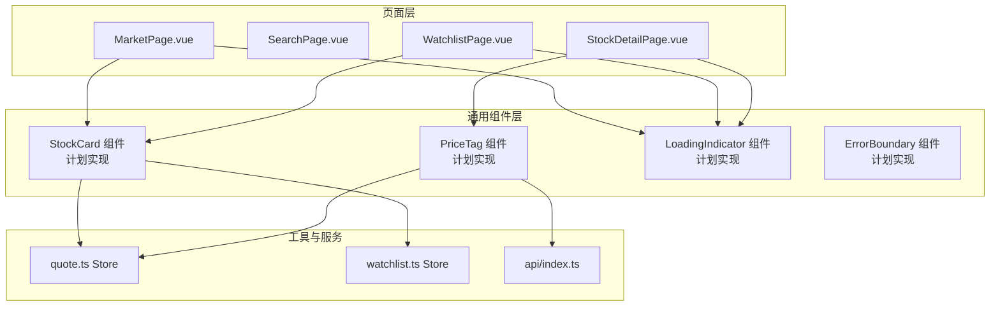
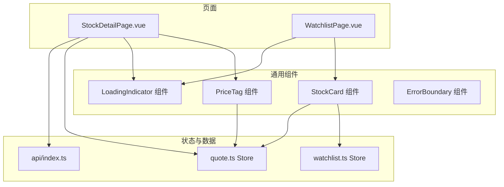
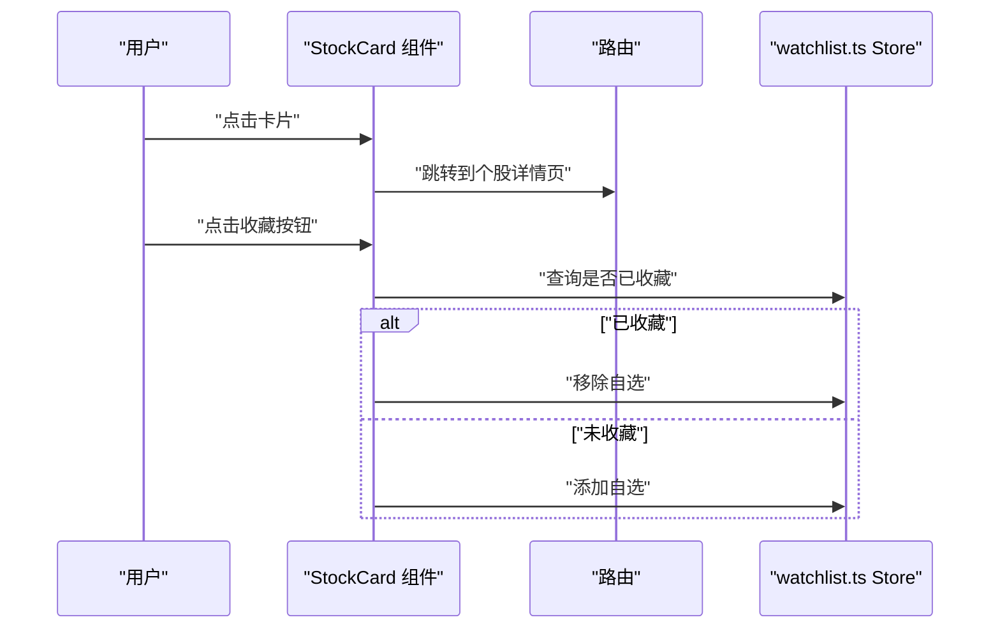
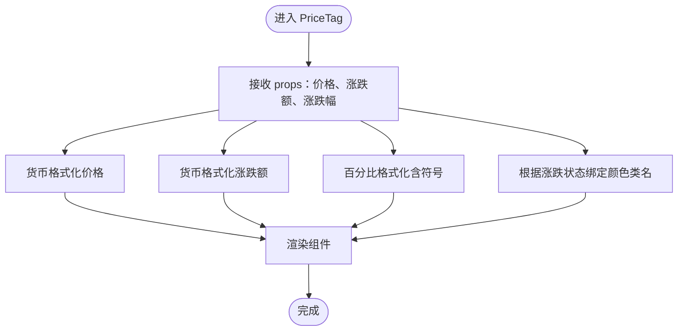
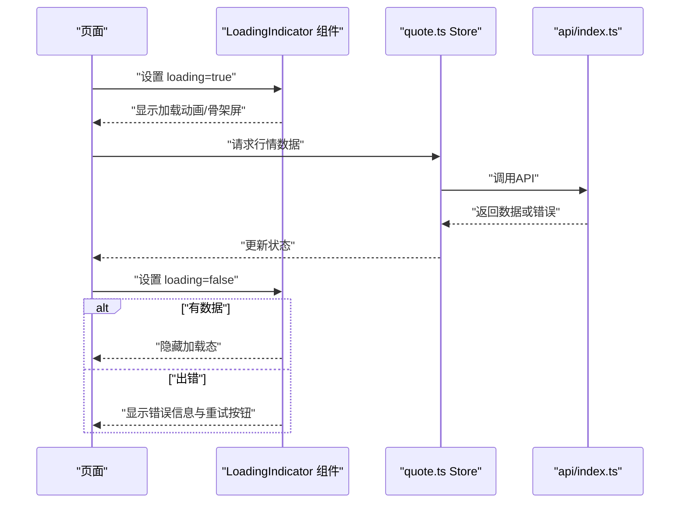
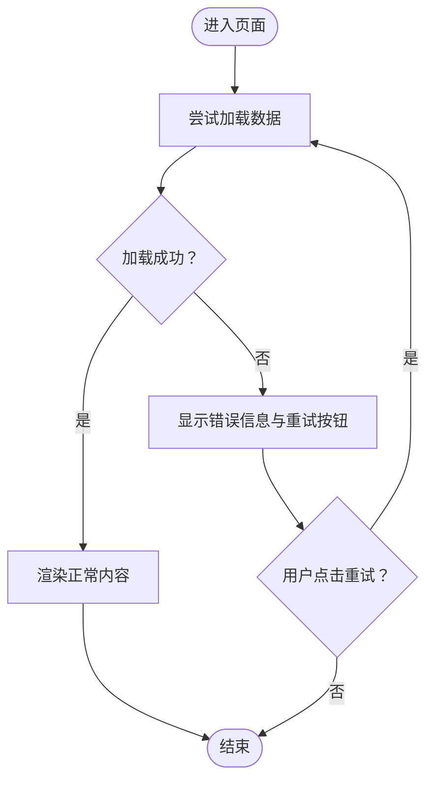
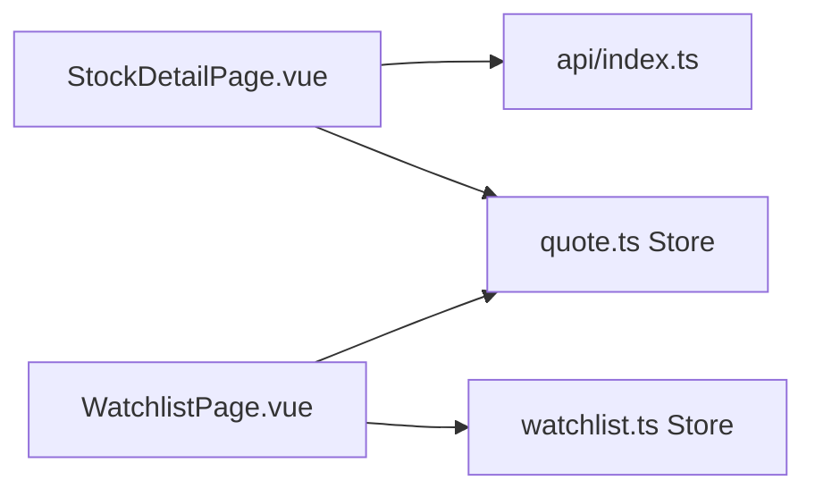

# 通用组件

<cite>
**本文引用的文件**
- [StockDetailPage.vue](file://frontend/src/pages/StockDetailPage.vue)
- [WatchlistPage.vue](file://frontend/src/pages/WatchlistPage.vue)
- [开发文档.md](file://Stock-View 软件开发文档/开发文档.md)
</cite>

## 目录
1. [简介](#简介)
2. [项目结构](#项目结构)
3. [核心组件](#核心组件)
4. [架构总览](#架构总览)
5. [详细组件分析](#详细组件分析)
6. [依赖分析](#依赖分析)
7. [性能考虑](#性能考虑)
8. [故障排查指南](#故障排查指南)
9. [结论](#结论)
10. [附录](#附录)

## 简介
本章节面向Stock-View前端通用组件的设计与使用，重点围绕以下目标展开：
- 元素库（Element Plus）的集成与定制使用
- 股票卡片组件：股票信息展示、涨跌颜色标识、点击跳转功能、收藏状态显示
- 价格标签组件：实时价格显示、涨跌箭头、百分比变化、货币格式化
- 加载指示器组件：加载动画效果、骨架屏实现、错误状态处理
- 错误边界组件：异常捕获机制、错误信息展示、重试功能
- 组件属性配置、事件处理、插槽使用方法
- 样式定制、主题适配、响应式设计
- 可复用性设计、最佳实践、性能优化建议

## 项目结构
前端采用Vue 3 + TypeScript + Vite构建，页面级组件位于pages目录，通用组件位于components目录。通用组件主要在行情列表页、自选股页、个股详情页中被广泛使用。

**图表来源**
- [开发文档.md:1683-1704](file://Stock-View 软件开发文档/开发文档.md#L1683-L1704)

**章节来源**
- [开发文档.md:1667-1704](file://Stock-View 软件开发文档/开发文档.md#L1667-L1704)

## 核心组件
本节对当前已实现的核心组件进行系统化梳理，并给出后续通用组件的规划与落地建议。

- 股票卡片组件（StockCard）
  - 功能要点：展示股票名称、代码、最新价、涨跌额、涨跌幅；支持点击跳转到详情页；支持加入/移除自选。
  - 当前实现位置：行情列表页与自选股页均以卡片形式展示股票数据。
  - Element Plus集成：使用按钮组件实现“加自选/已自选”切换。
  - 颜色标识：通过类名绑定实现涨跌颜色区分。
  - 交互行为：点击卡片跳转至个股详情页；点击右侧按钮切换自选状态。

- 价格标签组件（PriceTag）
  - 功能要点：展示实时价格、涨跌额、涨跌幅；支持货币格式化；根据涨跌状态改变颜色。
  - 当前实现位置：个股详情页头部区域展示当前价、涨跌额、涨跌幅。
  - Element Plus集成：未直接使用组件，但可扩展为独立组件以统一格式与样式。

- 加载指示器组件（LoadingIndicator）
  - 功能要点：全局或局部加载状态提示；骨架屏占位；错误状态展示与重试。
  - 当前实现位置：页面模板中使用v-loading指令实现加载遮罩；部分页面存在空状态与错误状态的条件渲染。
  - Element Plus集成：v-loading为Element Plus内置指令，用于表单、卡片等容器的加载态。

- 错误边界组件（ErrorBoundary）
  - 功能要点：捕获子树异常、展示错误信息、提供重试操作。
  - 当前实现位置：页面内通过try/catch与loading标志位控制错误状态；尚未封装为通用组件。
  - Element Plus集成：可结合ElAlert/ElResult等组件展示错误信息。

**章节来源**
- [StockDetailPage.vue:1-40](file://frontend/src/pages/StockDetailPage.vue#L1-L40)
- [WatchlistPage.vue:24-62](file://frontend/src/pages/WatchlistPage.vue#L24-L62)

## 架构总览
下图展示了页面与通用组件之间的关系，以及与状态管理、API调用的交互：

**图表来源**
- [StockDetailPage.vue:1-40](file://frontend/src/pages/StockDetailPage.vue#L1-L40)
- [WatchlistPage.vue:24-62](file://frontend/src/pages/WatchlistPage.vue#L24-L62)

## 详细组件分析

### 股票卡片组件（StockCard）
- 设计目标
  - 展示股票基本信息与价格动态
  - 提供收藏/取消收藏能力
  - 支持点击跳转至详情页
  - 统一的颜色与排版风格

- 数据模型
  - 名称、代码、最新价、涨跌额、涨跌幅
  - 收藏状态（布尔值）

- 交互流程
  - 点击卡片：路由跳转至个股详情页
  - 点击按钮：切换自选状态（添加/移除）

**图表来源**
- [StockDetailPage.vue:311-317](file://frontend/src/pages/StockDetailPage.vue#L311-L317)
- [WatchlistPage.vue:42-47](file://frontend/src/pages/WatchlistPage.vue#L42-L47)

- 样式与主题
  - 使用CSS变量实现主题适配（如背景、边框、文字颜色）
  - 涨跌颜色通过类名绑定实现（如“color-up/color-down”）
  - 响应式布局：在不同屏幕尺寸下保持可读性与可用性

- 可复用性与最佳实践
  - 将卡片渲染逻辑抽象为独立组件，传入props与事件
  - 使用插槽扩展卡片内容（如图标、操作按钮）
  - 对外暴露点击事件与收藏事件，便于上层页面统一处理

**章节来源**
- [WatchlistPage.vue:24-62](file://frontend/src/pages/WatchlistPage.vue#L24-L62)
- [StockDetailPage.vue:311-317](file://frontend/src/pages/StockDetailPage.vue#L311-L317)

### 价格标签组件（PriceTag）
- 设计目标
  - 实时展示价格、涨跌额、涨跌幅
  - 统一货币格式化规则
  - 根据涨跌状态改变颜色与样式

- 数据模型
  - 当前价、涨跌额、涨跌幅（百分比）

- 渲染逻辑
  - 价格与涨跌额按货币格式化规则展示
  - 百分比带符号显示（正数带“+”）
  - 涨跌颜色通过类名绑定实现

**图表来源**
- [StockDetailPage.vue:15-23](file://frontend/src/pages/StockDetailPage.vue#L15-L23)

- 可复用性与最佳实践
  - 抽象为独立组件，支持传入数值与单位
  - 提供插槽以扩展图标或说明文本
  - 在父组件中集中处理格式化逻辑，降低重复代码

**章节来源**
- [StockDetailPage.vue:15-23](file://frontend/src/pages/StockDetailPage.vue#L15-L23)

### 加载指示器组件（LoadingIndicator）
- 设计目标
  - 全局/局部加载状态提示
  - 骨架屏占位提升感知速度
  - 错误状态展示与重试入口

- 当前实现方式
  - 页面模板使用v-loading指令包裹容器
  - 条件渲染空状态与错误状态
  - 结合store与API调用控制loading标志位

**图表来源**
- [StockDetailPage.vue:2-4](file://frontend/src/pages/StockDetailPage.vue#L2-L4)
- [WatchlistPage.vue:51-62](file://frontend/src/pages/WatchlistPage.vue#L51-L62)

- 可复用性与最佳实践
  - 封装为通用组件，支持局部/全局模式
  - 骨架屏与真实内容之间平滑切换
  - 错误状态统一展示，提供一键重试

**章节来源**
- [StockDetailPage.vue:2-4](file://frontend/src/pages/StockDetailPage.vue#L2-L4)
- [WatchlistPage.vue:51-62](file://frontend/src/pages/WatchlistPage.vue#L51-L62)

### 错误边界组件（ErrorBoundary）
- 设计目标
  - 捕获子树异常，防止应用崩溃
  - 展示友好错误信息与重试按钮
  - 记录错误上下文，便于调试

- 当前实现方式
  - 页面内通过try/catch与loading标志位控制错误状态
  - 条件渲染错误信息与重试按钮
  - 结合store与API调用进行重试

**图表来源**
- [StockDetailPage.vue:301-309](file://frontend/src/pages/StockDetailPage.vue#L301-L309)

- 可复用性与最佳实践
  - 封装为通用组件，自动捕获子树异常
  - 提供错误日志记录与上报接口
  - 统一错误UI风格，增强一致性

**章节来源**
- [StockDetailPage.vue:301-309](file://frontend/src/pages/StockDetailPage.vue#L301-L309)

## 依赖分析
- 页面与组件的关系
  - 行情列表页与自选股页大量使用卡片式布局展示股票数据
  - 个股详情页使用价格标签组件展示实时价格与涨跌信息
  - 页面普遍使用v-loading实现加载状态管理

- 状态与数据流
  - quote.ts Store提供行情数据
  - watchlist.ts Store提供自选股列表与收藏状态
  - api/index.ts提供后端接口访问

**图表来源**
- [StockDetailPage.vue:1-40](file://frontend/src/pages/StockDetailPage.vue#L1-L40)
- [WatchlistPage.vue:24-62](file://frontend/src/pages/WatchlistPage.vue#L24-L62)

**章节来源**
- [StockDetailPage.vue:1-40](file://frontend/src/pages/StockDetailPage.vue#L1-L40)
- [WatchlistPage.vue:24-62](file://frontend/src/pages/WatchlistPage.vue#L24-L62)

## 性能考虑
- 渲染性能
  - 使用虚拟滚动（如已在行情列表中应用）减少DOM节点数量
  - 合理拆分组件，避免不必要的重渲染
  - 对频繁更新的数据使用浅比较或计算属性缓存

- 网络性能
  - 合并请求与批量获取数据，降低请求次数
  - 使用防抖/节流控制高频交互（如搜索、滚动）
  - 缓存热点数据，减少重复请求

- 交互体验
  - 骨架屏与渐进式加载提升感知速度
  - 错误状态快速反馈与一键重试
  - 主题与动效适度，避免影响性能

## 故障排查指南
- 加载失败
  - 检查API接口连通性与鉴权状态
  - 查看store中的loading与error标志位
  - 确认网络请求参数与时间戳

- 数据不一致
  - 校验quote.ts Store中的数据结构与字段映射
  - 确认watchlist.ts Store的收藏状态同步逻辑
  - 关注定时刷新频率与并发控制

- 样式异常
  - 检查CSS变量覆盖与主题切换逻辑
  - 确认颜色类名绑定与媒体查询
  - 排查第三方样式冲突

**章节来源**
- [StockDetailPage.vue:301-309](file://frontend/src/pages/StockDetailPage.vue#L301-L309)
- [WatchlistPage.vue:51-62](file://frontend/src/pages/WatchlistPage.vue#L51-L62)

## 结论
通过将现有页面中的卡片、价格标签、加载与错误处理逻辑抽象为通用组件，可以显著提升代码复用率与维护效率。建议优先实现StockCard、PriceTag、LoadingIndicator与ErrorBoundary四个组件，并配套完善的属性配置、事件处理与插槽设计，确保与Element Plus生态无缝集成，同时兼顾主题适配与响应式设计。

## 附录
- Element Plus集成要点
  - 使用内置指令（如v-loading）简化加载态管理
  - 使用按钮、对话框、通知等组件统一交互风格
  - 借助CSS变量与暗色主题适配实现跨主题兼容

- 最佳实践清单
  - 组件职责单一，避免过度耦合
  - 明确props、events、slots三要素
  - 提供完善的类型定义与文档示例
  - 注重可访问性与键盘导航支持