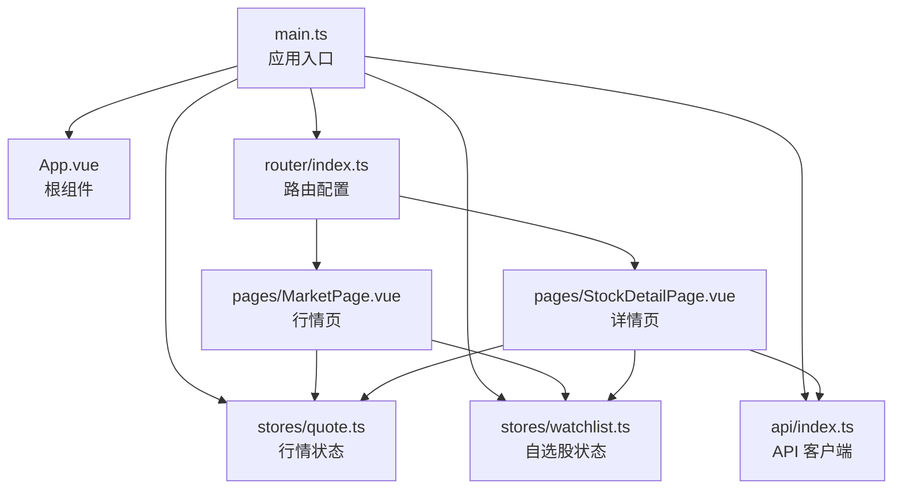
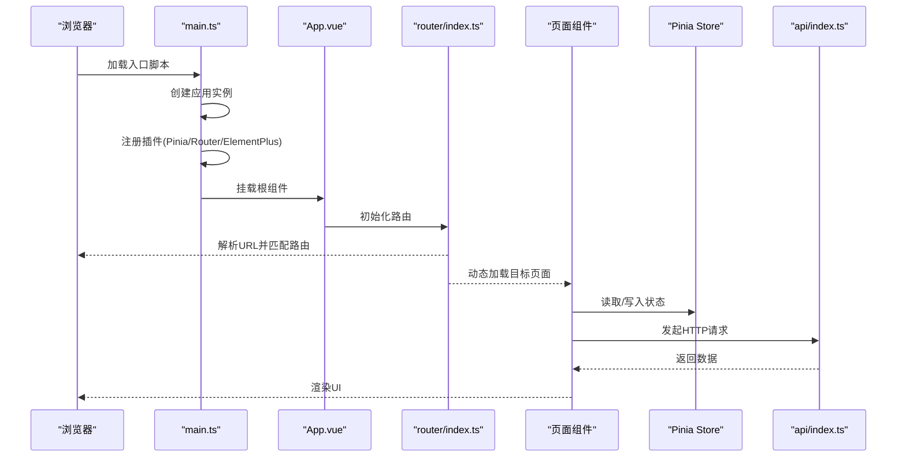
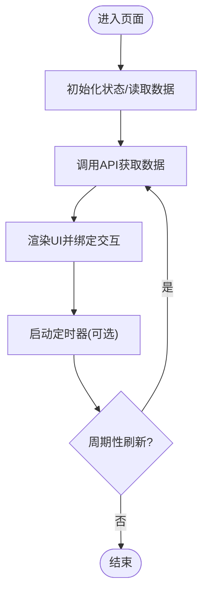
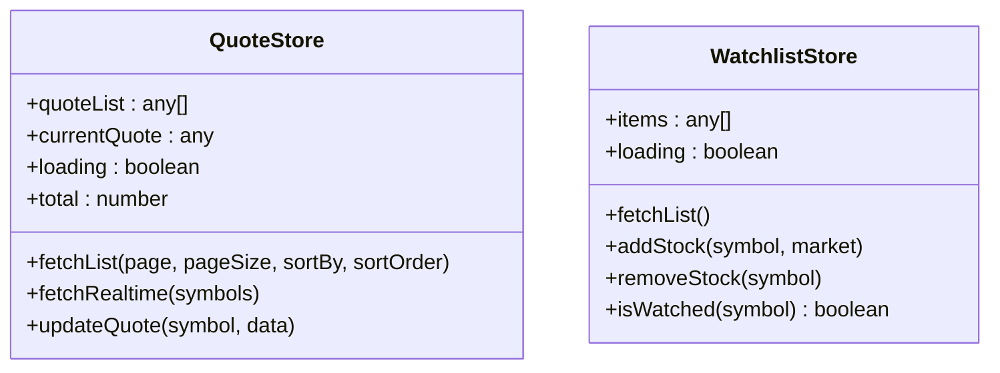
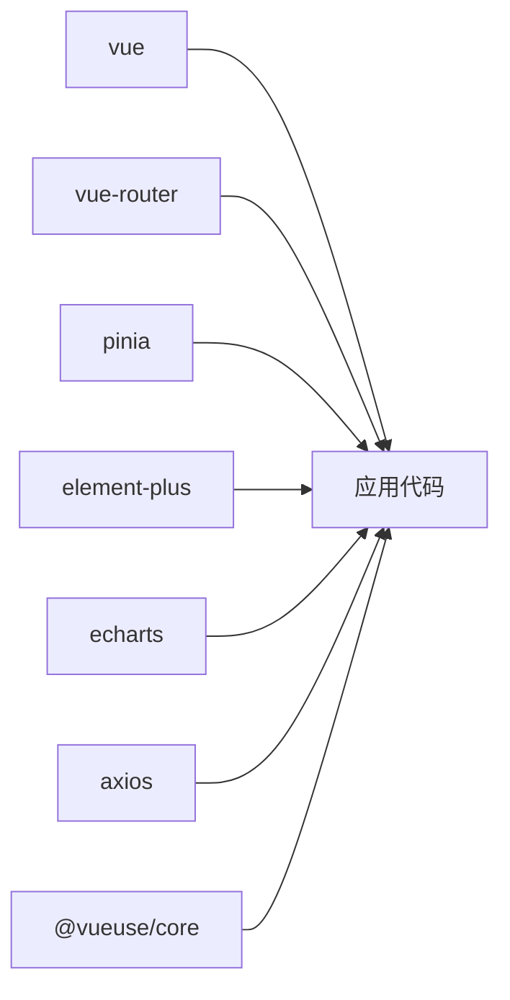

# Vue应用架构

<cite>
**本文引用的文件**
- [main.ts](file://frontend/src/main.ts)
- [App.vue](file://frontend/src/App.vue)
- [router/index.ts](file://frontend/src/router/index.ts)
- [stores/quote.ts](file://frontend/src/stores/quote.ts)
- [stores/watchlist.ts](file://frontend/src/stores/watchlist.ts)
- [api/index.ts](file://frontend/src/api/index.ts)
- [pages/MarketPage.vue](file://frontend/src/pages/MarketPage.vue)
- [pages/StockDetailPage.vue](file://frontend/src/pages/StockDetailPage.vue)
- [env.d.ts](file://frontend/src/env.d.ts)
- [package.json](file://frontend/package.json)
- [vite.config.ts](file://frontend/vite.config.ts)
- [README.md](file://README.md)
</cite>

## 目录
1. [引言](#引言)
2. [项目结构](#项目结构)
3. [核心组件](#核心组件)
4. [架构总览](#架构总览)
5. [详细组件分析](#详细组件分析)
6. [依赖分析](#依赖分析)
7. [性能考虑](#性能考虑)
8. [故障排查指南](#故障排查指南)
9. [结论](#结论)
10. [附录](#附录)

## 引言
本文件系统性梳理该Vue 3应用的前端架构，围绕应用入口、根组件、路由与状态管理、API 客户端、页面组件以及开发环境配置展开，帮助读者快速理解从入口文件到组件渲染的完整启动流程，并提供性能优化、错误处理与调试的最佳实践建议。

## 项目结构
前端采用 Vite + Vue 3 + TypeScript + Pinia + Element Plus + ECharts 的组合，遵循按功能模块划分的目录组织方式：
- 应用入口与根组件：main.ts、App.vue
- 路由：router/index.ts
- 状态管理：stores 下的 quote.ts、watchlist.ts
- API 客户端：api/index.ts
- 页面组件：pages 下的 MarketPage.vue、StockDetailPage.vue 等
- 工具与配置：env.d.ts、package.json、vite.config.ts

图表来源
- [main.ts:1-12](file://frontend/src/main.ts#L1-L12)
- [App.vue:1-23](file://frontend/src/App.vue#L1-L23)
- [router/index.ts:1-14](file://frontend/src/router/index.ts#L1-L14)
- [stores/quote.ts:1-43](file://frontend/src/stores/quote.ts#L1-L43)
- [stores/watchlist.ts:1-36](file://frontend/src/stores/watchlist.ts#L1-L36)
- [api/index.ts:1-33](file://frontend/src/api/index.ts#L1-L33)
- [pages/MarketPage.vue:1-182](file://frontend/src/pages/MarketPage.vue#L1-L182)
- [pages/StockDetailPage.vue:1-249](file://frontend/src/pages/StockDetailPage.vue#L1-L249)

章节来源
- [README.md:92-126](file://README.md#L92-L126)
- [package.json:1-27](file://frontend/package.json#L1-L27)

## 核心组件
本节聚焦应用入口、根组件、路由与状态管理的关键职责与实现要点。

- 应用入口（main.ts）
  - 创建 Vue 应用实例，挂载根组件
  - 注册插件：Pinia、路由、Element Plus
  - 将应用挂载至 DOM 容器
  - 参考路径：[入口文件:1-12](file://frontend/src/main.ts#L1-L12)

- 根组件（App.vue）
  - 提供单一出口容器，通过 router-view 渲染当前路由
  - 定义全局基础样式与 CSS 变量主题体系
  - 参考路径：[根组件:1-23](file://frontend/src/App.vue#L1-L23)

- 路由（router/index.ts）
  - 使用 History 模式
  - 定义首页重定向与主要页面路由
  - 采用动态导入实现按需加载
  - 参考路径：[路由配置:1-14](file://frontend/src/router/index.ts#L1-L14)

- 状态管理（Pinia Store）
  - 行情状态（stores/quote.ts）
    - 维护行情列表、当前行情、加载态与总数
    - 提供分页获取列表、实时行情查询、更新指定行情等方法
    - 参考路径：[行情状态:1-43](file://frontend/src/stores/quote.ts#L1-L43)
  - 自选股状态（stores/watchlist.ts）
    - 维护自选股列表、加载态
    - 提供获取列表、添加、删除、排序与存在性判断
    - 参考路径：[自选股状态:1-36](file://frontend/src/stores/watchlist.ts#L1-L36)

章节来源
- [main.ts:1-12](file://frontend/src/main.ts#L1-L12)
- [App.vue:1-23](file://frontend/src/App.vue#L1-L23)
- [router/index.ts:1-14](file://frontend/src/router/index.ts#L1-L14)
- [stores/quote.ts:1-43](file://frontend/src/stores/quote.ts#L1-L43)
- [stores/watchlist.ts:1-36](file://frontend/src/stores/watchlist.ts#L1-L36)

## 架构总览
下图展示从前端入口到页面渲染的端到端流程，涵盖插件注册、路由导航与页面生命周期：

图表来源
- [main.ts:1-12](file://frontend/src/main.ts#L1-L12)
- [App.vue:1-23](file://frontend/src/App.vue#L1-L23)
- [router/index.ts:1-14](file://frontend/src/router/index.ts#L1-L14)
- [api/index.ts:1-33](file://frontend/src/api/index.ts#L1-L33)

## 详细组件分析

### 应用入口与插件注册（main.ts）
- 关键点
  - 使用应用工厂函数创建实例
  - 顺序注册插件：Pinia、路由、Element Plus
  - 挂载根组件至 DOM
- 最佳实践
  - 插件注册顺序影响全局行为，应保持稳定
  - 在入口集中初始化第三方库，便于统一配置与调试

章节来源
- [main.ts:1-12](file://frontend/src/main.ts#L1-L12)

### 根组件设计（App.vue）
- 关键点
  - 单一出口容器，承载路由视图
  - 全局基础样式与主题变量，统一暗色系风格
- 最佳实践
  - 将通用样式与主题变量收敛于根组件，避免重复定义
  - 通过 CSS 变量实现主题切换的可扩展性

章节来源
- [App.vue:1-23](file://frontend/src/App.vue#L1-L23)

### 路由与页面组件（router/index.ts 与页面）
- 关键点
  - History 模式 + 动态导入，提升首屏性能
  - 页面组件内使用状态管理与 API 客户端
- 页面示例
  - 市场页（MarketPage.vue）
    - 顶部导航、搜索框、自选股侧栏
    - 行情表格、分页与定时刷新
    - 参考路径：[市场页:1-182](file://frontend/src/pages/MarketPage.vue#L1-L182)
  - 股票详情页（StockDetailPage.vue）
    - K线/分时图、五档盘口、AI 分析面板
    - 图表初始化、周期切换、定时刷新与资源清理
    - 参考路径：[详情页:1-249](file://frontend/src/pages/StockDetailPage.vue#L1-L249)

图表来源
- [pages/MarketPage.vue:146-154](file://frontend/src/pages/MarketPage.vue#L146-L154)
- [pages/StockDetailPage.vue:203-216](file://frontend/src/pages/StockDetailPage.vue#L203-L216)

章节来源
- [router/index.ts:1-14](file://frontend/src/router/index.ts#L1-L14)
- [pages/MarketPage.vue:1-182](file://frontend/src/pages/MarketPage.vue#L1-L182)
- [pages/StockDetailPage.vue:1-249](file://frontend/src/pages/StockDetailPage.vue#L1-L249)

### 状态管理（Pinia Store）
- 行情状态（quote.ts）
  - 列表与总数管理、加载态控制
  - 异步获取列表与实时行情，支持更新指定项
  - 参考路径：[行情状态:1-43](file://frontend/src/stores/quote.ts#L1-L43)
- 自选股状态（watchlist.ts）
  - 列表维护、增删改查与存在性判断
  - 与后端接口配合，保证数据一致性
  - 参考路径：[自选股状态:1-36](file://frontend/src/stores/watchlist.ts#L1-L36)

图表来源
- [stores/quote.ts:1-43](file://frontend/src/stores/quote.ts#L1-L43)
- [stores/watchlist.ts:1-36](file://frontend/src/stores/watchlist.ts#L1-L36)

章节来源
- [stores/quote.ts:1-43](file://frontend/src/stores/quote.ts#L1-L43)
- [stores/watchlist.ts:1-36](file://frontend/src/stores/watchlist.ts#L1-L36)

### API 客户端（api/index.ts）
- 关键点
  - 基于 Axios 创建实例，统一前缀与超时
  - 暴露行情、股票、自选股、AI 分析等接口
- 使用建议
  - 将所有后端接口收敛于此，便于统一拦截与错误处理
  - 结合路由参数与查询参数，确保请求幂等与可追踪

章节来源
- [api/index.ts:1-33](file://frontend/src/api/index.ts#L1-L33)

### 类型声明与开发环境（env.d.ts 与 vite.config.ts）
- 类型声明（env.d.ts）
  - 支持 .vue 文件模块声明，便于编辑器识别与类型检查
- 开发服务器（vite.config.ts）
  - 别名映射 @ -> src
  - 本地代理 /api -> 后端 8000 端口
  - 参考路径：[Vite 配置:1-21](file://frontend/vite.config.ts#L1-L21)

章节来源
- [env.d.ts:1-7](file://frontend/src/env.d.ts#L1-L7)
- [vite.config.ts:1-21](file://frontend/vite.config.ts#L1-L21)

## 依赖分析
- 包管理与脚本（package.json）
  - 运行时依赖：Vue 3、Vue Router、Pinia、Element Plus、ECharts、Axios、@vueuse/core
  - 开发依赖：@vitejs/plugin-vue、TypeScript、Vite、vue-tsc
- 依赖关系可视化

图表来源
- [package.json:11-25](file://frontend/package.json#L11-L25)

章节来源
- [package.json:1-27](file://frontend/package.json#L1-L27)

## 性能考虑
- 路由懒加载
  - 通过动态导入减少首屏包体，提升初始渲染速度
  - 参考路径：[路由配置:7-10](file://frontend/src/router/index.ts#L7-L10)
- 图表资源管理
  - 页面卸载时释放 ECharts 实例，避免内存泄漏
  - 参考路径：[详情页资源清理:213-216](file://frontend/src/pages/StockDetailPage.vue#L213-L216)
- 定时刷新策略
  - 合理设置刷新间隔，避免频繁请求造成带宽与 CPU 压力
  - 参考路径：[市场页定时刷新](file://frontend/src/pages/MarketPage.vue#L149)
- 状态更新粒度
  - 使用响应式对象局部更新，减少不必要的重渲染
  - 参考路径：[行情更新:32-40](file://frontend/src/stores/quote.ts#L32-L40)

## 故障排查指南
- 启动失败或白屏
  - 检查入口文件是否正确挂载根组件
  - 参考路径：[入口文件:8-12](file://frontend/src/main.ts#L8-L12)
- 路由不生效
  - 确认路由配置与页面组件路径一致，且使用动态导入
  - 参考路径：[路由配置:1-14](file://frontend/src/router/index.ts#L1-L14)
- 接口请求异常
  - 校验代理配置与后端服务连通性
  - 参考路径：[Vite 代理:14-19](file://frontend/vite.config.ts#L14-L19)
- 图表渲染问题
  - 确保容器元素可见且尺寸有效，图表初始化在 nextTick 或 mounted 后进行
  - 参考路径：[详情页图表初始化:120-122](file://frontend/src/pages/StockDetailPage.vue#L120-L122)
- 内存泄漏
  - 页面卸载时清理定时器与销毁图表实例
  - 参考路径：[详情页资源清理:213-216](file://frontend/src/pages/StockDetailPage.vue#L213-L216)

章节来源
- [main.ts:8-12](file://frontend/src/main.ts#L8-L12)
- [router/index.ts:1-14](file://frontend/src/router/index.ts#L1-L14)
- [vite.config.ts:14-19](file://frontend/vite.config.ts#L14-L19)
- [pages/StockDetailPage.vue:120-122](file://frontend/src/pages/StockDetailPage.vue#L120-L122)
- [pages/StockDetailPage.vue:213-216](file://frontend/src/pages/StockDetailPage.vue#L213-L216)

## 结论
该 Vue 3 应用以清晰的模块化结构与现代化工具链构建，入口集中、路由懒加载、状态与 API 客户端分离，页面组件职责明确。结合合理的性能与故障排查策略，可在保证开发效率的同时获得良好的用户体验。

## 附录
- 环境变量与运行环境
  - 项目提供环境变量说明与示例，便于区分开发与生产环境
  - 参考路径：[环境变量说明:130-142](file://README.md#L130-L142)
- 常用命令
  - 前端开发与构建命令，便于本地快速启动与预览
  - 参考路径：[常用命令:146-162](file://README.md#L146-L162)

章节来源
- [README.md:130-142](file://README.md#L130-L142)
- [README.md:146-162](file://README.md#L146-L162)