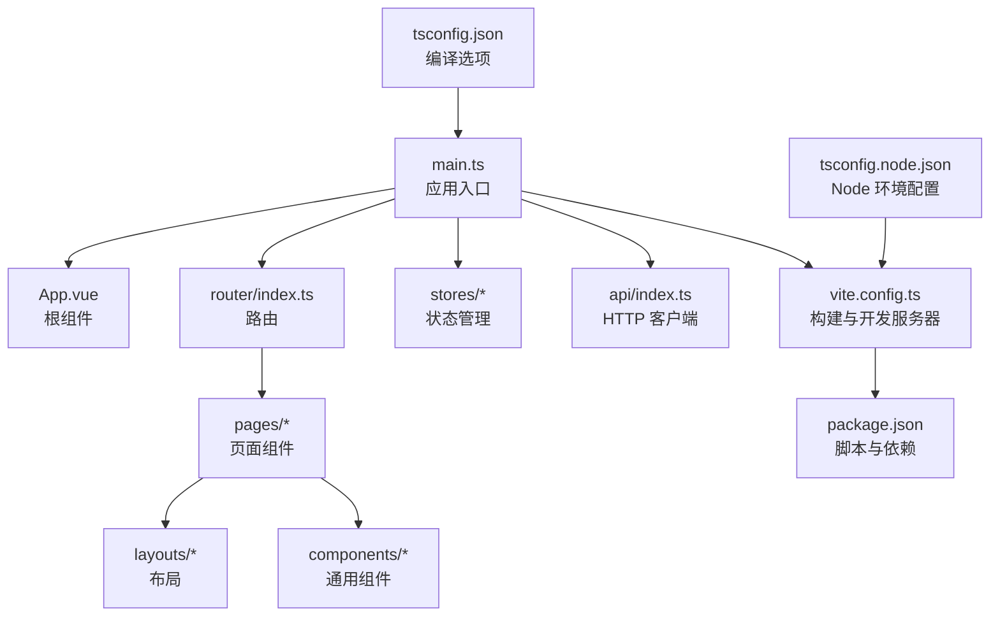
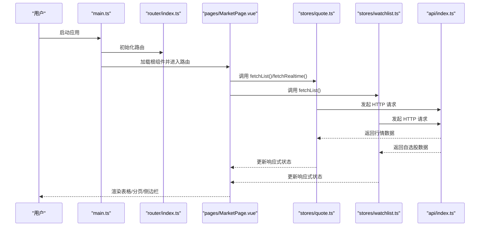
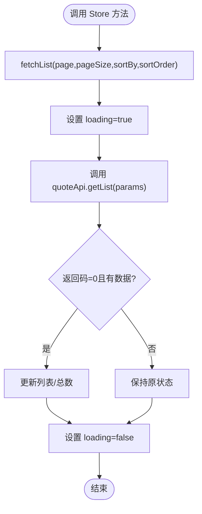
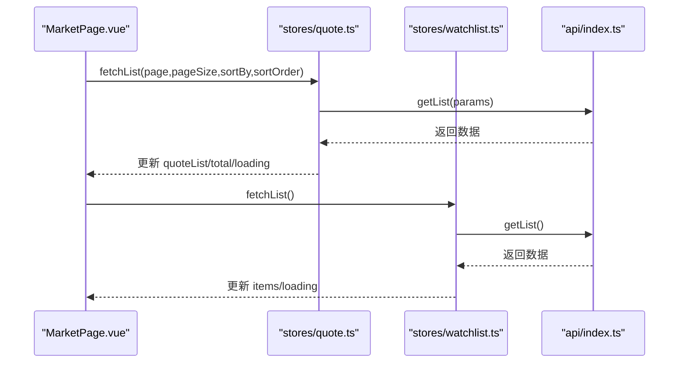
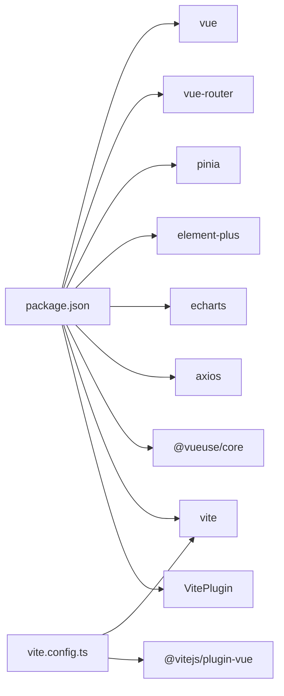

# Vue应用架构

<cite>
**本文引用的文件**
- [frontend/src/main.ts](file://frontend/src/main.ts)
- [frontend/src/App.vue](file://frontend/src/App.vue)
- [frontend/src/router/index.ts](file://frontend/src/router/index.ts)
- [frontend/src/stores/quote.ts](file://frontend/src/stores/quote.ts)
- [frontend/src/stores/watchlist.ts](file://frontend/src/stores/watchlist.ts)
- [frontend/src/api/index.ts](file://frontend/src/api/index.ts)
- [frontend/src/pages/MarketPage.vue](file://frontend/src/pages/MarketPage.vue)
- [frontend/vite.config.ts](file://frontend/vite.config.ts)
- [frontend/package.json](file://frontend/package.json)
- [frontend/tsconfig.json](file://frontend/tsconfig.json)
- [frontend/tsconfig.node.json](file://frontend/tsconfig.node.json)
- [frontend/src/env.d.ts](file://frontend/src/env.d.ts)
</cite>

## 目录
1. [引言](#引言)
2. [项目结构](#项目结构)
3. [核心组件](#核心组件)
4. [架构总览](#架构总览)
5. [详细组件分析](#详细组件分析)
6. [依赖分析](#依赖分析)
7. [性能考虑](#性能考虑)
8. [故障排查指南](#故障排查指南)
9. [结论](#结论)
10. [附录](#附录)

## 引言
本文件系统性梳理 Stock-View 前端（Vue 3 + TypeScript）应用的架构与实现细节，覆盖应用初始化流程、插件与状态管理集成、路由设计、数据访问层、页面组件结构、构建与开发配置、TypeScript 类型体系以及最佳实践建议。目标是帮助开发者快速理解并高效扩展该应用。

## 项目结构
前端采用 Vite + Vue 3 单页应用结构，核心目录与职责如下：
- src：源代码
  - api：统一的后端接口封装
  - components：可复用组件（按功能分组）
  - composables：组合式函数（逻辑复用）
  - layouts：布局模板
  - pages：页面级组件
  - router：路由配置
  - stores：状态管理（Pinia）
  - styles：全局样式
  - types：类型定义
  - utils：工具函数
  - env.d.ts：环境类型声明
  - main.ts：应用入口
  - App.vue：根组件
- 构建与配置
  - vite.config.ts：Vite 配置（别名、代理、插件）
  - package.json：脚本与依赖
  - tsconfig.json、tsconfig.node.json：TypeScript 编译配置
  - index.html：HTML 入口

图表来源
- [frontend/src/main.ts:1-12](file://frontend/src/main.ts#L1-L12)
- [frontend/src/App.vue:1-23](file://frontend/src/App.vue#L1-L23)
- [frontend/src/router/index.ts:1-14](file://frontend/src/router/index.ts#L1-L14)
- [frontend/src/api/index.ts:1-33](file://frontend/src/api/index.ts#L1-L33)
- [frontend/vite.config.ts:1-21](file://frontend/vite.config.ts#L1-L21)
- [frontend/package.json:1-27](file://frontend/package.json#L1-L27)
- [frontend/tsconfig.json:1-24](file://frontend/tsconfig.json#L1-L24)
- [frontend/tsconfig.node.json:1-11](file://frontend/tsconfig.node.json#L1-L11)

章节来源
- [frontend/src/main.ts:1-12](file://frontend/src/main.ts#L1-L12)
- [frontend/src/App.vue:1-23](file://frontend/src/App.vue#L1-L23)
- [frontend/src/router/index.ts:1-14](file://frontend/src/router/index.ts#L1-L14)
- [frontend/src/api/index.ts:1-33](file://frontend/src/api/index.ts#L1-L33)
- [frontend/vite.config.ts:1-21](file://frontend/vite.config.ts#L1-L21)
- [frontend/package.json:1-27](file://frontend/package.json#L1-L27)
- [frontend/tsconfig.json:1-24](file://frontend/tsconfig.json#L1-L24)
- [frontend/tsconfig.node.json:1-11](file://frontend/tsconfig.node.json#L1-L11)

## 核心组件
- 应用入口与初始化
  - 使用应用工厂创建应用实例，依次注册 Pinia、路由、UI 组件库，并挂载到 DOM。
- 根组件
  - 采用单路由视图容器，承载全局样式与主题变量。
- 路由系统
  - 基于 History 模式的动态路由，支持首页重定向与页面懒加载。
- 状态管理
  - Pinia Store 封装行情与自选股列表的数据获取、更新与状态控制。
- API 层
  - 基于 Axios 的统一客户端，集中定义各业务模块的接口方法。
- 页面组件
  - MarketPage 展示行情表格、分页、搜索、自选股侧边栏与定时刷新逻辑。

章节来源
- [frontend/src/main.ts:1-12](file://frontend/src/main.ts#L1-L12)
- [frontend/src/App.vue:1-23](file://frontend/src/App.vue#L1-L23)
- [frontend/src/router/index.ts:1-14](file://frontend/src/router/index.ts#L1-L14)
- [frontend/src/stores/quote.ts:1-43](file://frontend/src/stores/quote.ts#L1-L43)
- [frontend/src/stores/watchlist.ts:1-36](file://frontend/src/stores/watchlist.ts#L1-L36)
- [frontend/src/api/index.ts:1-33](file://frontend/src/api/index.ts#L1-L33)
- [frontend/src/pages/MarketPage.vue:1-182](file://frontend/src/pages/MarketPage.vue#L1-L182)

## 架构总览
下图展示从入口到页面渲染、数据请求与状态更新的关键交互路径。

图表来源
- [frontend/src/main.ts:1-12](file://frontend/src/main.ts#L1-L12)
- [frontend/src/router/index.ts:1-14](file://frontend/src/router/index.ts#L1-L14)
- [frontend/src/pages/MarketPage.vue:1-182](file://frontend/src/pages/MarketPage.vue#L1-L182)
- [frontend/src/stores/quote.ts:1-43](file://frontend/src/stores/quote.ts#L1-L43)
- [frontend/src/stores/watchlist.ts:1-36](file://frontend/src/stores/watchlist.ts#L1-L36)
- [frontend/src/api/index.ts:1-33](file://frontend/src/api/index.ts#L1-L33)

## 详细组件分析

### 应用入口与初始化（main.ts）
- 创建应用实例并注册插件
  - Pinia：集中式状态管理
  - 路由：页面导航与参数传递
  - UI 组件库：提供表格、分页等组件能力
- 挂载根组件到 DOM
- 插件注册顺序影响全局行为，应保持一致性

章节来源
- [frontend/src/main.ts:1-12](file://frontend/src/main.ts#L1-L12)

### 根组件（App.vue）
- 结构
  - 仅包含路由视图，便于在不同页面间切换
- 样式
  - 全局重置与字体设置
  - 主题变量集中定义，便于统一风格
- 设计理念
  - 最小化根组件职责，将布局与样式下沉至页面与组件

章节来源
- [frontend/src/App.vue:1-23](file://frontend/src/App.vue#L1-L23)

### 路由系统（router/index.ts）
- 历史模式与懒加载
  - 页面组件通过动态导入实现按需加载
- 路由表
  - 首页重定向至市场页
  - 支持股票详情、自选股、搜索等页面
- 参数与导航
  - 通过路由参数传递股票代码，便于页面内使用

章节来源
- [frontend/src/router/index.ts:1-14](file://frontend/src/router/index.ts#L1-L14)

### 状态管理（Pinia Store）
- 行情 Store（quote.ts）
  - 状态：列表、当前项、加载态、总数
  - 方法：分页拉取列表、实时行情查询、单项更新
  - 数据来源：API 层封装的 quoteApi
- 自选股 Store（watchlist.ts）
  - 状态：列表、加载态
  - 方法：拉取列表、添加/移除、排序、查询是否已关注
  - 数据来源：API 层封装的 watchlistApi

图表来源
- [frontend/src/stores/quote.ts:1-43](file://frontend/src/stores/quote.ts#L1-L43)

章节来源
- [frontend/src/stores/quote.ts:1-43](file://frontend/src/stores/quote.ts#L1-L43)
- [frontend/src/stores/watchlist.ts:1-36](file://frontend/src/stores/watchlist.ts#L1-L36)

### API 层（api/index.ts）
- 客户端
  - 基于 Axios 创建带基础路径与超时的实例
- 接口分组
  - 行情：实时、列表、K线、分时、买卖盘
  - 股票：搜索
  - 自选股：列表、增删改查
  - AI：分析、模型信息
- 使用建议
  - 在 Store 中统一调用，避免页面直接依赖底层 HTTP 实现

章节来源
- [frontend/src/api/index.ts:1-33](file://frontend/src/api/index.ts#L1-L33)

### 页面组件（MarketPage.vue）
- 结构与布局
  - 顶部工具栏（Logo、标签页、搜索框、导航）
  - 左侧自选股侧边栏
  - 中部行情表格与分页
  - 底部状态栏
- 功能点
  - 标签页切换与排序策略映射
  - 分页加载与列表刷新
  - 搜索跳转与点击行跳转详情
  - 定时刷新（每 10 秒）
- 样式
  - 使用主题变量与深度选择器适配 UI 组件库

图表来源
- [frontend/src/pages/MarketPage.vue:1-182](file://frontend/src/pages/MarketPage.vue#L1-L182)
- [frontend/src/stores/quote.ts:1-43](file://frontend/src/stores/quote.ts#L1-L43)
- [frontend/src/stores/watchlist.ts:1-36](file://frontend/src/stores/watchlist.ts#L1-L36)
- [frontend/src/api/index.ts:1-33](file://frontend/src/api/index.ts#L1-L33)

章节来源
- [frontend/src/pages/MarketPage.vue:1-182](file://frontend/src/pages/MarketPage.vue#L1-L182)

### 构建与开发配置
- Vite 配置
  - 插件：Vue 官方插件
  - 别名：@ -> src
  - 开发服务器：端口 3000，API 代理到后端服务
- TypeScript 配置
  - tsconfig.json：严格模式、模块解析、路径映射、包含范围
  - tsconfig.node.json：Vite 等工具链 Node 环境配置
- 包管理与脚本
  - dev/build/preview 脚本，依赖 Vue 3、Vue Router、Pinia、Element Plus、ECharts、Axios、@vueuse/core

章节来源
- [frontend/vite.config.ts:1-21](file://frontend/vite.config.ts#L1-L21)
- [frontend/tsconfig.json:1-24](file://frontend/tsconfig.json#L1-L24)
- [frontend/tsconfig.node.json:1-11](file://frontend/tsconfig.node.json#L1-L11)
- [frontend/package.json:1-27](file://frontend/package.json#L1-L27)

### TypeScript 类型与模块规范
- 类型声明
  - env.d.ts 声明 .vue 模块类型，使 TS 能识别单文件组件
- 模块导入
  - 使用路径别名 @ 指向 src，提升可读性与迁移稳定性
- 导出规范
  - Store 使用 defineStore 并以 useXxx 命名导出
  - API 方法按业务域拆分导出，便于按需引入

章节来源
- [frontend/src/env.d.ts:1-7](file://frontend/src/env.d.ts#L1-L7)
- [frontend/tsconfig.json:18-20](file://frontend/tsconfig.json#L18-L20)

## 依赖分析
- 运行时依赖
  - Vue 3、Vue Router、Pinia、Element Plus、ECharts、Axios、@vueuse/core
- 开发依赖
  - Vite、@vitejs/plugin-vue、TypeScript、vue-tsc
- 关系图

图表来源
- [frontend/package.json:11-25](file://frontend/package.json#L11-L25)
- [frontend/vite.config.ts:1-21](file://frontend/vite.config.ts#L1-L21)

章节来源
- [frontend/package.json:1-27](file://frontend/package.json#L1-L27)
- [frontend/vite.config.ts:1-21](file://frontend/vite.config.ts#L1-L21)

## 性能考虑
- 路由懒加载
  - 页面组件动态导入减少首屏体积
- 定时刷新策略
  - MarketPage 使用定时器周期刷新，建议结合页面可见性与节流策略降低无效请求
- 列表渲染优化
  - 表格组件按需渲染列内容，避免重复计算；对大数据量场景建议虚拟滚动
- 状态更新粒度
  - Store 内部仅更新受影响字段，减少不必要的响应式开销
- 构建优化
  - 使用 Vite 的预构建与按需打包；生产构建开启压缩与 Tree-shaking

## 故障排查指南
- 开发服务器无法访问
  - 检查端口占用与代理配置是否指向正确后端地址
- 路由跳转异常
  - 确认路由表中路径与页面组件导入是否一致
- API 请求失败
  - 校验 baseURL 与代理规则；检查后端 CORS 与鉴权
- 样式不生效
  - 确认主题变量与深度选择器使用是否正确；检查 scoped 样式作用域
- TypeScript 报错
  - 检查 env.d.ts 是否存在；确保 tsconfig.json 路径别名与包含范围正确

章节来源
- [frontend/vite.config.ts:12-20](file://frontend/vite.config.ts#L12-L20)
- [frontend/src/router/index.ts:6-11](file://frontend/src/router/index.ts#L6-L11)
- [frontend/src/api/index.ts:3-6](file://frontend/src/api/index.ts#L3-L6)
- [frontend/src/env.d.ts:1-7](file://frontend/src/env.d.ts#L1-L7)
- [frontend/tsconfig.json:18-20](file://frontend/tsconfig.json#L18-L20)

## 结论
该 Vue 3 应用以清晰的分层架构实现：入口负责初始化与插件注册，路由驱动页面导航，Store 封装数据与状态，API 层统一网络访问，页面组件聚焦视图与交互。配合 Vite 与 TypeScript 提供良好的开发体验与构建效率。后续可在性能优化、错误边界与监控方面进一步增强，同时完善组件与工具函数的抽象与测试覆盖。

## 附录
- 最佳实践清单
  - 插件注册顺序固定，避免跨插件耦合
  - Store 方法职责单一，错误处理集中在 Store 或拦截器
  - 页面组件尽量无副作用，将副作用逻辑放入 onMounted/onUnmounted
  - 使用组合式函数抽取可复用逻辑，提升可维护性
  - 对外暴露稳定的 API 接口，内部实现可演进