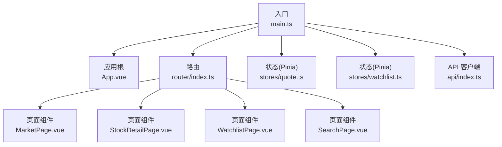
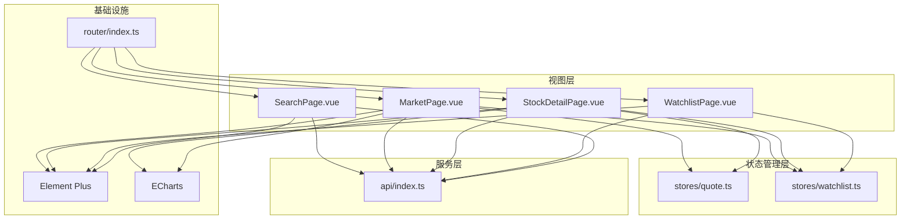
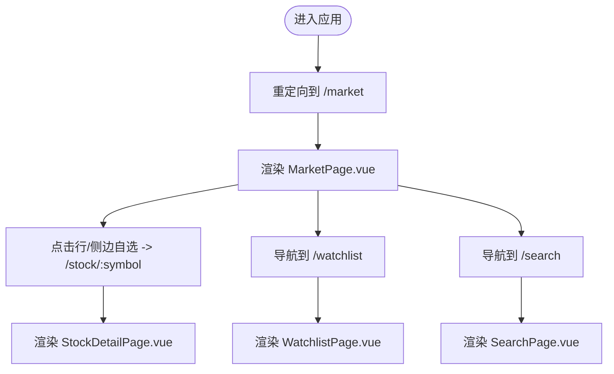
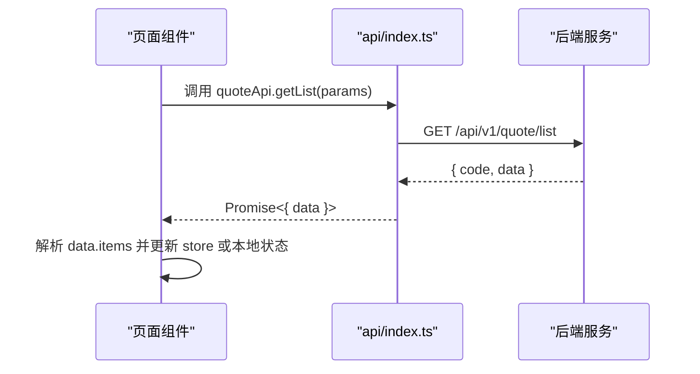
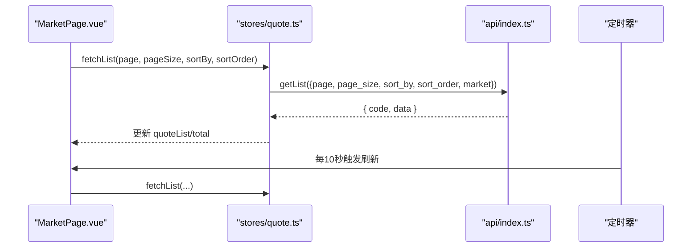
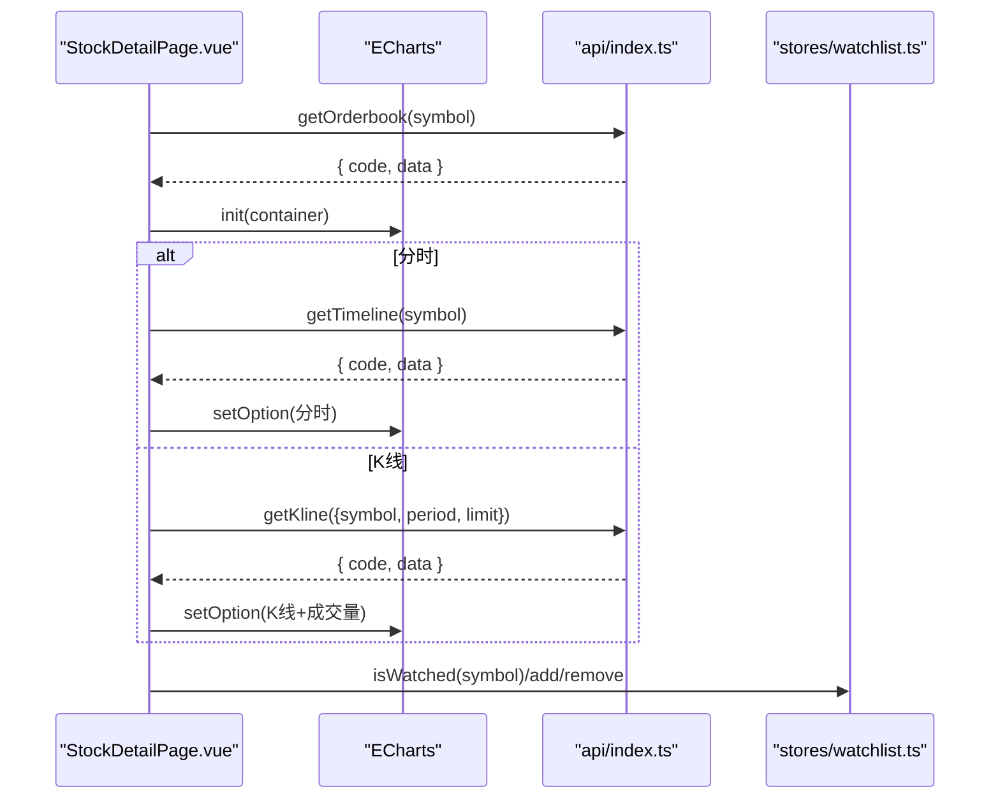
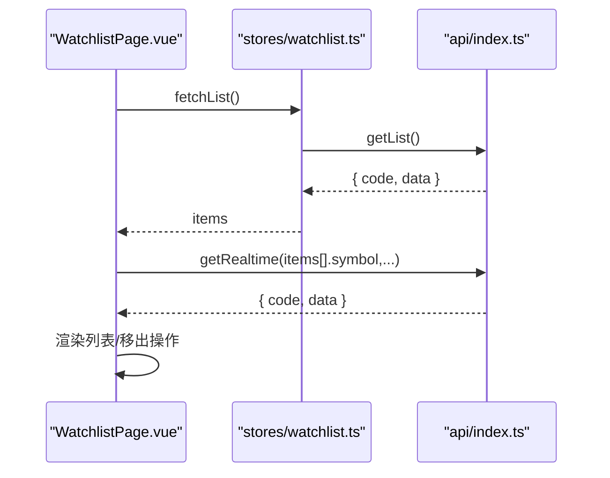
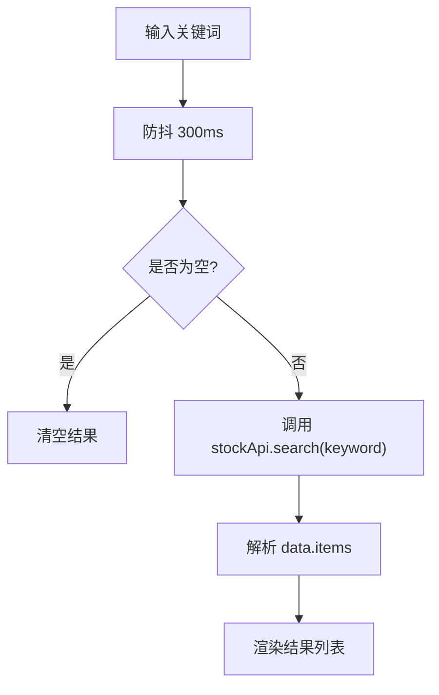
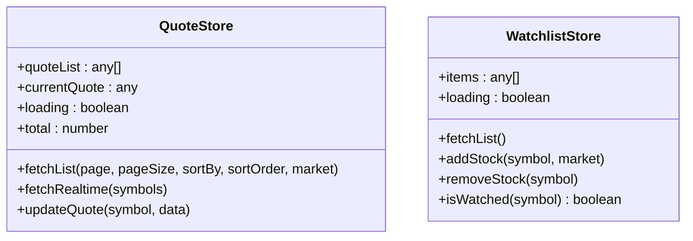
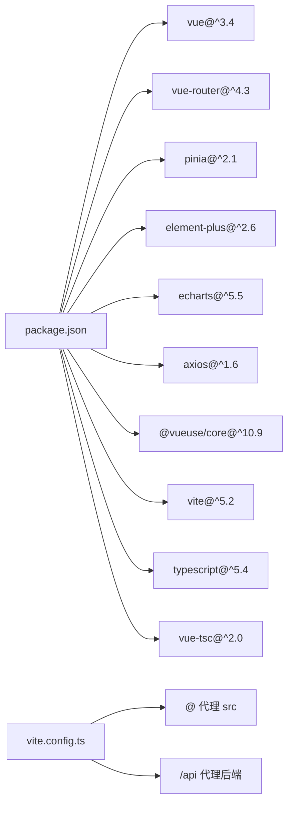

# 前端开发

<cite>
**本文引用的文件**
- [main.ts](file://frontend/src/main.ts)
- [App.vue](file://frontend/src/App.vue)
- [router/index.ts](file://frontend/src/router/index.ts)
- [api/index.ts](file://frontend/src/api/index.ts)
- [MarketPage.vue](file://frontend/src/pages/MarketPage.vue)
- [StockDetailPage.vue](file://frontend/src/pages/StockDetailPage.vue)
- [WatchlistPage.vue](file://frontend/src/pages/WatchlistPage.vue)
- [SearchPage.vue](file://frontend/src/pages/SearchPage.vue)
- [stores/quote.ts](file://frontend/src/stores/quote.ts)
- [stores/watchlist.ts](file://frontend/src/stores/watchlist.ts)
- [vite.config.ts](file://frontend/vite.config.ts)
- [package.json](file://frontend/package.json)
- [tsconfig.json](file://frontend/tsconfig.json)
</cite>

## 目录
1. [简介](#简介)
2. [项目结构](#项目结构)
3. [核心组件](#核心组件)
4. [架构总览](#架构总览)
5. [详细组件分析](#详细组件分析)
6. [依赖分析](#依赖分析)
7. [性能考虑](#性能考虑)
8. [故障排查指南](#故障排查指南)
9. [结论](#结论)
10. [附录](#附录)

## 简介
本文件为 Stock-View 前端开发的完整技术文档，基于 Vue.js 3 + TypeScript 的现代化前端架构，覆盖组件设计模式、路由系统、状态管理（Pinia）、图表与UI库集成、响应式设计、API 客户端封装与错误处理、组件间通信与数据流管理、以及性能优化实践。文档面向前端开发者，提供从架构到实现细节的逐层讲解，并通过可视化图示帮助理解。

## 项目结构
前端采用 Vite + Vue 3 + TypeScript 构建，目录组织遵循“按功能域划分”的模块化思路：
- 入口与应用根：main.ts、App.vue
- 路由：router/index.ts
- 页面组件：pages 下的 MarketPage、StockDetailPage、WatchlistPage、SearchPage
- 状态管理：stores 下的 quote.ts、watchlist.ts
- API 封装：api/index.ts
- 构建配置：vite.config.ts、tsconfig.json、package.json

**图表来源**
- [main.ts:1-12](file://frontend/src/main.ts#L1-L12)
- [App.vue:1-23](file://frontend/src/App.vue#L1-L23)
- [router/index.ts:1-14](file://frontend/src/router/index.ts#L1-L14)
- [stores/quote.ts:1-43](file://frontend/src/stores/quote.ts#L1-L43)
- [stores/watchlist.ts:1-36](file://frontend/src/stores/watchlist.ts#L1-L36)
- [api/index.ts:1-33](file://frontend/src/api/index.ts#L1-L33)
- [MarketPage.vue:1-182](file://frontend/src/pages/MarketPage.vue#L1-L182)
- [StockDetailPage.vue:1-249](file://frontend/src/pages/StockDetailPage.vue#L1-L249)
- [WatchlistPage.vue:1-79](file://frontend/src/pages/WatchlistPage.vue#L1-L79)
- [SearchPage.vue:1-50](file://frontend/src/pages/SearchPage.vue#L1-L50)

**章节来源**
- [main.ts:1-12](file://frontend/src/main.ts#L1-L12)
- [App.vue:1-23](file://frontend/src/App.vue#L1-L23)
- [router/index.ts:1-14](file://frontend/src/router/index.ts#L1-L14)
- [vite.config.ts:1-21](file://frontend/vite.config.ts#L1-L21)
- [tsconfig.json:1-24](file://frontend/tsconfig.json#L1-L24)
- [package.json:1-27](file://frontend/package.json#L1-L27)

## 核心组件
- 应用入口与全局依赖注入：在入口文件中注册 Pinia、路由、Element Plus，并挂载应用。
- 路由系统：使用 History 模式，定义首页重定向与四个页面路由，均采用异步组件按需加载。
- API 客户端：基于 axios 创建带基础路径与超时的实例，导出 quote、stock、watchlist、ai 四类接口方法。
- 状态管理：Pinia Store 封装行情列表、当前报价、自选股列表等，统一处理加载态与数据更新。
- 页面组件：市场页、详情页、自选股页、搜索页分别承担不同职责，配合 Element Plus 表格、分页、按钮等组件。

**章节来源**
- [main.ts:1-12](file://frontend/src/main.ts#L1-L12)
- [router/index.ts:1-14](file://frontend/src/router/index.ts#L1-L14)
- [api/index.ts:1-33](file://frontend/src/api/index.ts#L1-L33)
- [stores/quote.ts:1-43](file://frontend/src/stores/quote.ts#L1-L43)
- [stores/watchlist.ts:1-36](file://frontend/src/stores/watchlist.ts#L1-L36)

## 架构总览
整体架构围绕“页面组件 + 组合式 API + Pinia Store + Axios API 客户端”展开，路由负责导航，状态管理负责数据与加载态，API 客户端负责网络请求，Element Plus 提供 UI 基础能力，ECharts 负责图表渲染。

**图表来源**
- [router/index.ts:1-14](file://frontend/src/router/index.ts#L1-L14)
- [MarketPage.vue:1-182](file://frontend/src/pages/MarketPage.vue#L1-L182)
- [StockDetailPage.vue:1-249](file://frontend/src/pages/StockDetailPage.vue#L1-L249)
- [WatchlistPage.vue:1-79](file://frontend/src/pages/WatchlistPage.vue#L1-L79)
- [SearchPage.vue:1-50](file://frontend/src/pages/SearchPage.vue#L1-L50)
- [stores/quote.ts:1-43](file://frontend/src/stores/quote.ts#L1-L43)
- [stores/watchlist.ts:1-36](file://frontend/src/stores/watchlist.ts#L1-L36)
- [api/index.ts:1-33](file://frontend/src/api/index.ts#L1-L33)

## 详细组件分析

### 路由系统
- 使用 History 模式，根路径重定向至市场页。
- 页面路由采用动态导入，实现按需加载与代码分割。
- 股票详情页使用动态参数 :symbol 进行路由传参。

**图表来源**
- [router/index.ts:1-14](file://frontend/src/router/index.ts#L1-L14)
- [MarketPage.vue:13-144](file://frontend/src/pages/MarketPage.vue#L13-L144)
- [WatchlistPage.vue:8-31](file://frontend/src/pages/WatchlistPage.vue#L8-L31)
- [SearchPage.vue:10-16](file://frontend/src/pages/SearchPage.vue#L10-L16)

**章节来源**
- [router/index.ts:1-14](file://frontend/src/router/index.ts#L1-L14)

### API 客户端封装
- 基于 axios 创建实例，设置基础路径与超时。
- 导出 quoteApi、stockApi、watchlistApi、aiApi 四类接口方法，统一返回 Promise。
- 错误处理策略：调用方根据 data.code 判断成功与否；失败时保持 UI 加载态直至 finally 执行。

**图表来源**
- [api/index.ts:1-33](file://frontend/src/api/index.ts#L1-L33)
- [stores/quote.ts:11-22](file://frontend/src/stores/quote.ts#L11-L22)

**章节来源**
- [api/index.ts:1-33](file://frontend/src/api/index.ts#L1-L33)

### 市场页面（实时行情）
- 功能要点：
  - 顶部标签切换（全部、涨幅榜、跌幅榜、换手榜），触发排序参数变化并重新拉取列表。
  - 顶部搜索框支持回车跳转搜索页。
  - 左侧自选股快捷跳转，右侧行情表格支持行点击跳转详情页。
  - 分页组件控制页码，触发列表加载。
  - 定时器每 10 秒刷新一次行情列表与自选股列表。
- 数据流：
  - 通过 Pinia Quote Store 获取/更新行情列表与总数。
  - 使用 Element Plus 表格组件渲染，支持排序列与格式化显示。
- 性能与交互：
  - 表格行高亮与点击跳转提升交互体验。
  - 数值格式化函数统一处理量能单位显示。

**图表来源**
- [MarketPage.vue:116-138](file://frontend/src/pages/MarketPage.vue#L116-L138)
- [MarketPage.vue:146-154](file://frontend/src/pages/MarketPage.vue#L146-L154)
- [stores/quote.ts:11-22](file://frontend/src/stores/quote.ts#L11-L22)
- [api/index.ts:9-14](file://frontend/src/api/index.ts#L9-L14)

**章节来源**
- [MarketPage.vue:1-182](file://frontend/src/pages/MarketPage.vue#L1-L182)
- [stores/quote.ts:1-43](file://frontend/src/stores/quote.ts#L1-L43)

### 股票详情页面（K线图、分时图、技术分析）
- 功能要点：
  - 头部展示股票名称、最新价、涨跌与加自选/移出按钮。
  - 图表工具栏支持切换周期（分时、日K、周K、月K、5分钟、15分钟）。
  - ECharts 初始化与选项配置：分时图两条线（价格与均价），K线图与成交量双轴。
  - 右侧面板包含五档盘口、基本数据、AI 智能分析按钮与结果展示。
  - 定时器每 10 秒刷新实时报价与委托盘口。
- 数据流：
  - 实时行情与委托盘口通过 quoteApi.getRealtime 与 getOrderbook 获取。
  - K线与分时数据通过 quoteApi.getKline 与 getTimeline 获取。
  - AI 分析通过 aiApi.analyze 触发。
- 图表与交互：
  - 使用 ECharts 实例进行初始化、销毁与选项更新。
  - 周期内切换时复用容器并重新 setOption。

**图表来源**
- [StockDetailPage.vue:110-178](file://frontend/src/pages/StockDetailPage.vue#L110-L178)
- [StockDetailPage.vue:180-183](file://frontend/src/pages/StockDetailPage.vue#L180-L183)
- [StockDetailPage.vue:185-193](file://frontend/src/pages/StockDetailPage.vue#L185-L193)
- [api/index.ts:9-14](file://frontend/src/api/index.ts#L9-L14)
- [api/index.ts:27-31](file://frontend/src/api/index.ts#L27-L31)

**章节来源**
- [StockDetailPage.vue:1-249](file://frontend/src/pages/StockDetailPage.vue#L1-L249)
- [api/index.ts:1-33](file://frontend/src/api/index.ts#L1-L33)
- [stores/watchlist.ts:1-36](file://frontend/src/stores/watchlist.ts#L1-L36)

### 自选股页面（列表管理、分组功能）
- 功能要点：
  - 展示自选股列表，支持点击跳转详情页。
  - 支持移出自选股，移除后同步更新本地渲染数组。
  - 若为空则提示“暂无自选股”，并提供“去添加”跳转。
- 数据流：
  - 通过 Pinia Watchlist Store 获取自选股列表。
  - 批量获取实时行情用于展示最新价与涨跌幅。

**图表来源**
- [WatchlistPage.vue:49-65](file://frontend/src/pages/WatchlistPage.vue#L49-L65)
- [stores/watchlist.ts:9-19](file://frontend/src/stores/watchlist.ts#L9-L19)
- [api/index.ts:9-14](file://frontend/src/api/index.ts#L9-L14)

**章节来源**
- [WatchlistPage.vue:1-79](file://frontend/src/pages/WatchlistPage.vue#L1-L79)
- [stores/watchlist.ts:1-36](file://frontend/src/stores/watchlist.ts#L1-L36)

### 搜索页面（股票搜索、筛选功能）
- 功能要点：
  - 输入框支持防抖（300ms）搜索，清空时清空结果。
  - 结果项点击跳转详情页，未命中时提示“未找到匹配的股票”。
- 数据流：
  - 通过 stockApi.search(keyword) 获取匹配列表。

**图表来源**
- [SearchPage.vue:28-35](file://frontend/src/pages/SearchPage.vue#L28-L35)
- [api/index.ts:16-18](file://frontend/src/api/index.ts#L16-L18)

**章节来源**
- [SearchPage.vue:1-50](file://frontend/src/pages/SearchPage.vue#L1-L50)
- [api/index.ts:16-18](file://frontend/src/api/index.ts#L16-L18)

### 状态管理（Pinia）
- Quote Store：
  - 状态：quoteList、currentQuote、loading、total
  - 方法：fetchList（分页、排序、市场筛选）、fetchRealtime（批量实时）、updateQuote（就地更新）
- Watchlist Store：
  - 状态：items、loading
  - 方法：fetchList、addStock、removeStock、isWatched

**图表来源**
- [stores/quote.ts:1-43](file://frontend/src/stores/quote.ts#L1-L43)
- [stores/watchlist.ts:1-36](file://frontend/src/stores/watchlist.ts#L1-L36)

**章节来源**
- [stores/quote.ts:1-43](file://frontend/src/stores/quote.ts#L1-L43)
- [stores/watchlist.ts:1-36](file://frontend/src/stores/watchlist.ts#L1-L36)

## 依赖分析
- 运行时依赖：Vue 3、Vue Router、Pinia、Element Plus、ECharts、Axios、@vueuse/core
- 构建与类型：Vite、TypeScript、vue-tsc
- 构建别名：@ 指向 src 目录，便于统一路径引用
- 代理配置：/api 代理到后端服务地址，便于前后端联调

**图表来源**
- [package.json:11-25](file://frontend/package.json#L11-L25)
- [vite.config.ts:7-20](file://frontend/vite.config.ts#L7-L20)

**章节来源**
- [package.json:1-27](file://frontend/package.json#L1-L27)
- [vite.config.ts:1-21](file://frontend/vite.config.ts#L1-L21)
- [tsconfig.json:1-24](file://frontend/tsconfig.json#L1-L24)

## 性能考虑
- 组件懒加载与按需导入：路由采用动态导入，减少首屏体积。
- 图表性能：分时图禁用动画，K线图使用 inside/slider 双 dataZoom，避免全量重绘。
- 列表渲染：表格组件开启深色主题变量覆盖，减少样式闪烁；分页与排序参数化，避免重复请求。
- 定时刷新：行情与委托盘口每 10 秒刷新，避免过于频繁导致资源浪费。
- 防抖搜索：搜索输入防抖 300ms，降低请求频率。
- 资源释放：组件卸载时清理定时器与 ECharts 实例，防止内存泄漏。

[本节为通用性能建议，不直接分析具体文件]

## 故障排查指南
- 请求失败与错误处理：
  - API 返回 data.code 非 0 时，保持加载态直至 finally 执行，避免 UI 状态错乱。
  - 建议在调用处增加 try/catch 与错误提示，结合 loading 状态反馈用户。
- 图表异常：
  - 初始化失败或容器不存在时，先判断 ref 是否存在再初始化 ECharts。
  - 切换周期前确保旧实例 dispose，避免重复渲染。
- 路由与参数：
  - 股票详情页使用动态参数 :symbol，确保跳转时参数正确传递。
- 自定义样式与主题：
  - 使用 CSS 变量统一颜色与背景，避免硬编码颜色导致主题不一致。
- 代理与跨域：
  - 确认 /api 代理已启用且目标地址正确，避免 404 或 CORS 问题。

**章节来源**
- [StockDetailPage.vue:203-216](file://frontend/src/pages/StockDetailPage.vue#L203-L216)
- [MarketPage.vue:146-154](file://frontend/src/pages/MarketPage.vue#L146-L154)
- [SearchPage.vue:28-35](file://frontend/src/pages/SearchPage.vue#L28-L35)
- [vite.config.ts:14-19](file://frontend/vite.config.ts#L14-L19)

## 结论
本项目采用现代化前端技术栈，通过清晰的页面职责划分、统一的 API 客户端封装、Pinia 状态管理与 Element Plus/ECharts 的组合，构建了高性能、可维护的股票行情前端应用。建议后续在错误边界、国际化、主题切换与图表扩展方面持续完善。

[本节为总结性内容，不直接分析具体文件]

## 附录
- 开发与构建命令：
  - dev：启动开发服务器（端口 3000，含 /api 代理）
  - build：类型检查与打包
  - preview：预览生产包
- 类型配置：
  - 启用严格模式与模块解析 bundler，路径别名 @ 指向 src

**章节来源**
- [package.json:6-10](file://frontend/package.json#L6-L10)
- [vite.config.ts:12-20](file://frontend/vite.config.ts#L12-L20)
- [tsconfig.json:2-22](file://frontend/tsconfig.json#L2-L22)