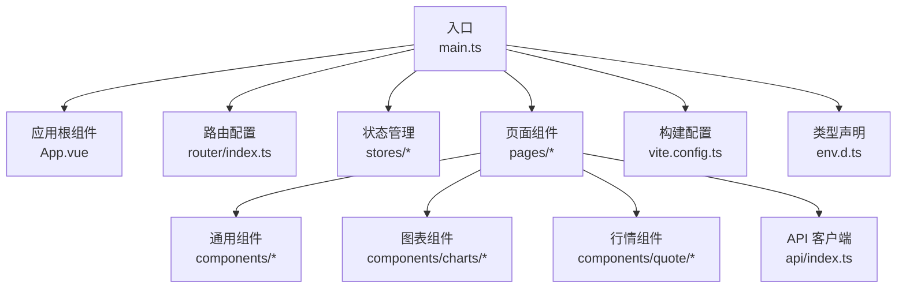
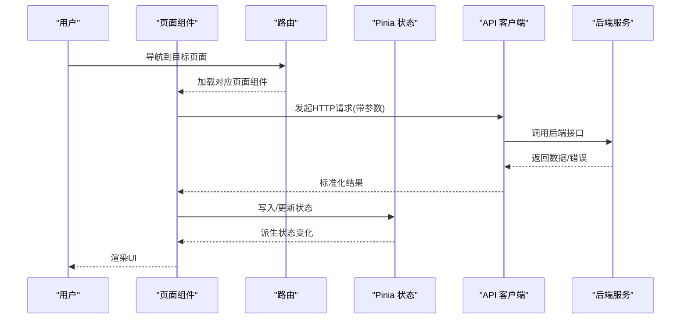
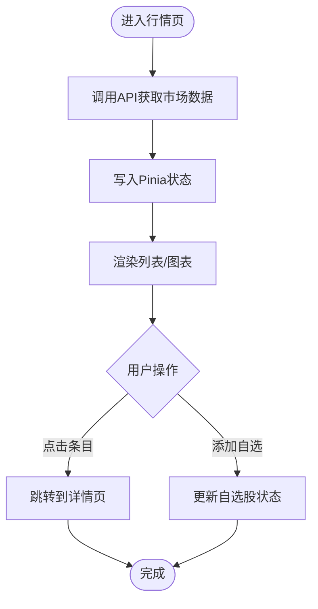
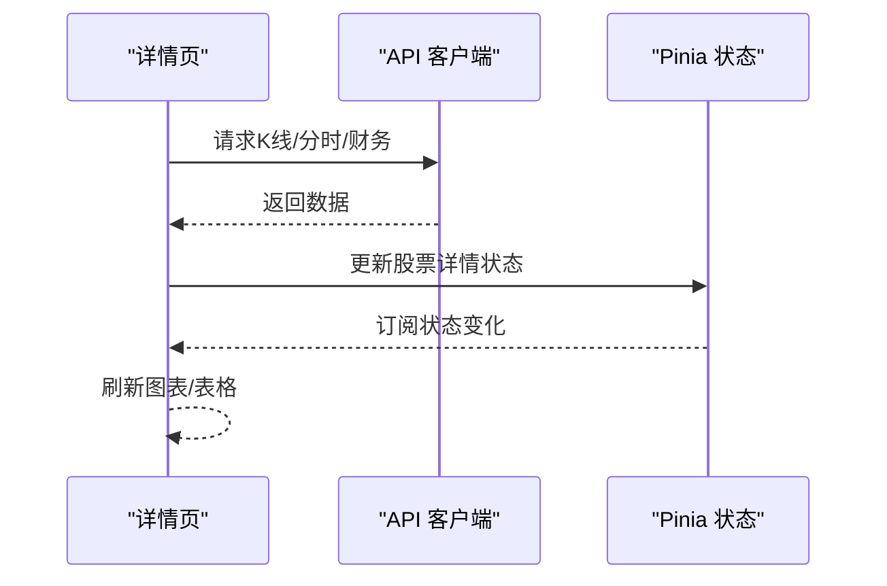
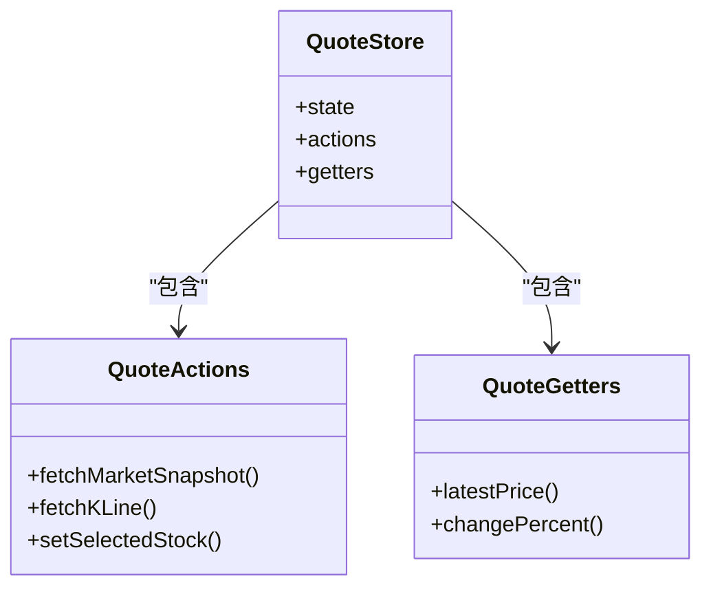
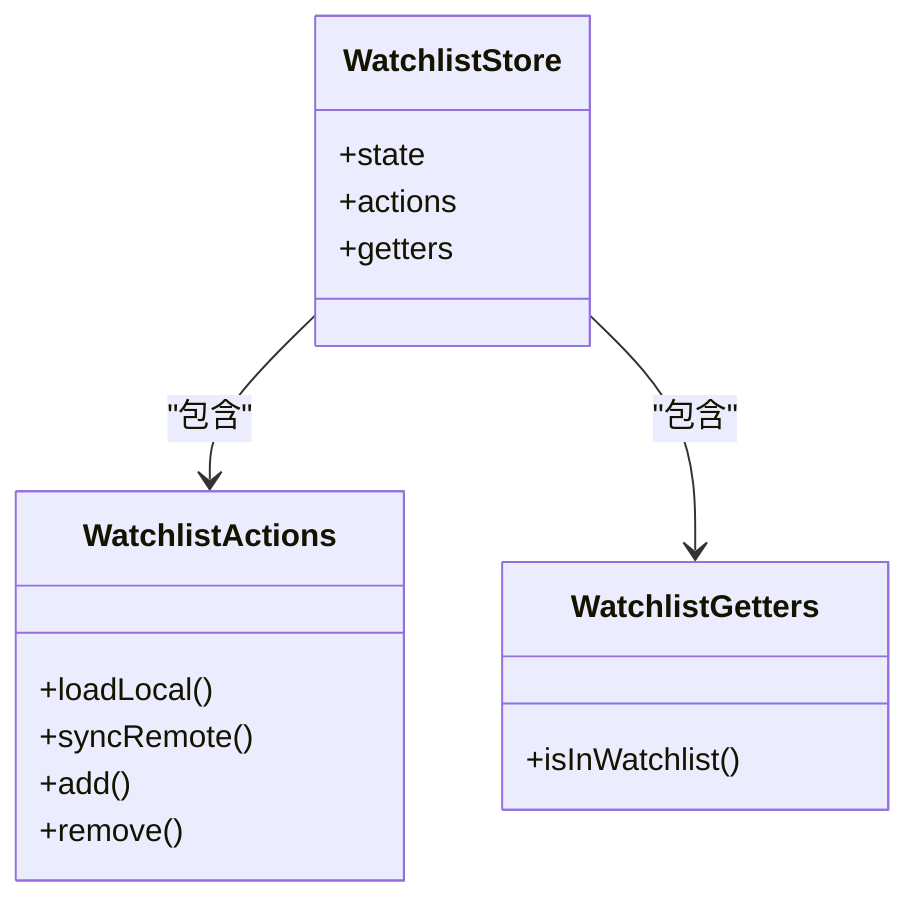
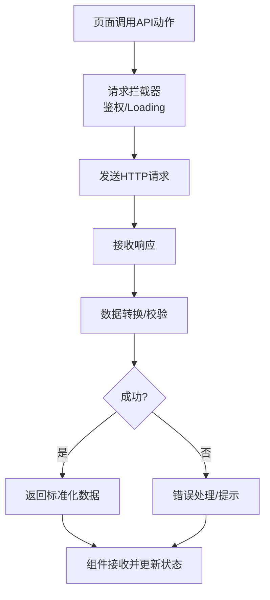
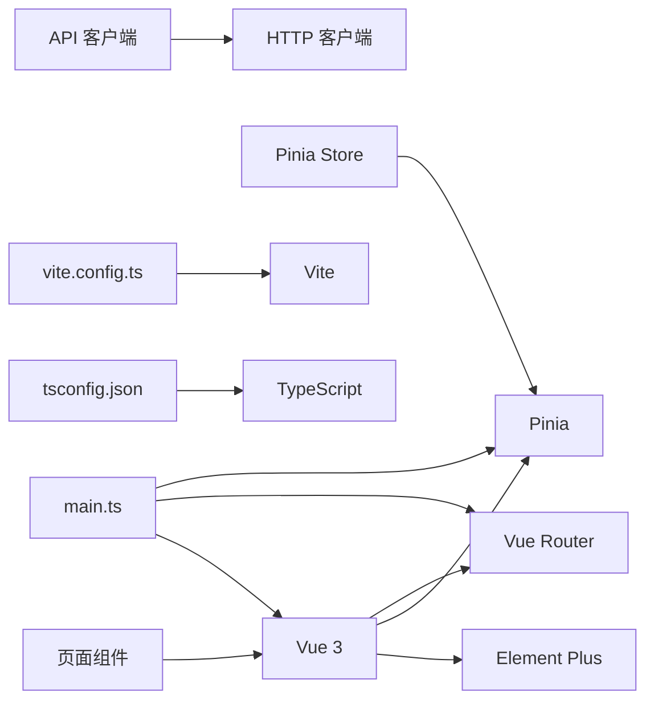

# 前端开发

<cite>
**本文引用的文件**
- [App.vue](file://frontend/src/App.vue)
- [main.ts](file://frontend/src/main.ts)
- [index.ts（路由）](file://frontend/src/router/index.ts)
- [MarketPage.vue](file://frontend/src/pages/MarketPage.vue)
- [StockDetailPage.vue](file://frontend/src/pages/StockDetailPage.vue)
- [SearchPage.vue](file://frontend/src/pages/SearchPage.vue)
- [WatchlistPage.vue](file://frontend/src/pages/WatchlistPage.vue)
- [index.ts（API 客户端）](file://frontend/src/api/index.ts)
- [quote.ts（行情状态）](file://frontend/src/stores/quote.ts)
- [watchlist.ts（自选股状态）](file://frontend/src/stores/watchlist.ts)
- [package.json](file://frontend/package.json)
- [vite.config.ts](file://frontend/vite.config.ts)
- [tsconfig.json](file://frontend/tsconfig.json)
- [env.d.ts](file://frontend/src/env.d.ts)
- [index.html](file://frontend/index.html)
</cite>

## 目录
1. [简介](#简介)
2. [项目结构](#项目结构)
3. [核心组件](#核心组件)
4. [架构总览](#架构总览)
5. [详细组件分析](#详细组件分析)
6. [依赖分析](#依赖分析)
7. [性能考虑](#性能考虑)
8. [故障排查指南](#故障排查指南)
9. [结论](#结论)
10. [附录](#附录)

## 简介
本指南面向Stock-View前端开发，围绕基于Vue 3的单页应用，系统梳理应用入口、路由配置、状态管理、页面组件与API客户端的设计与实现。文档重点覆盖以下方面：
- 应用入口与启动流程
- 路由与页面组件设计
- Pinia状态管理与数据流
- API客户端封装与错误处理
- 组件开发最佳实践（设计原则、样式与响应式）

## 项目结构
前端采用Vite + Vue 3 + TypeScript + Element Plus的组合，目录组织遵循“按功能域分层”的方式：pages（页面）、components（通用与业务组件）、stores（状态）、router（路由）、api（接口）、composables（可复用逻辑）、styles（样式）、layouts（布局）。

**图示来源**
- [main.ts](file://frontend/src/main.ts)
- [App.vue](file://frontend/src/App.vue)
- [index.ts（路由）](file://frontend/src/router/index.ts)
- [MarketPage.vue](file://frontend/src/pages/MarketPage.vue)
- [StockDetailPage.vue](file://frontend/src/pages/StockDetailPage.vue)
- [SearchPage.vue](file://frontend/src/pages/SearchPage.vue)
- [WatchlistPage.vue](file://frontend/src/pages/WatchlistPage.vue)
- [index.ts（API 客户端）](file://frontend/src/api/index.ts)
- [vite.config.ts](file://frontend/vite.config.ts)
- [env.d.ts](file://frontend/src/env.d.ts)

**章节来源**
- [main.ts](file://frontend/src/main.ts)
- [App.vue](file://frontend/src/App.vue)
- [index.ts（路由）](file://frontend/src/router/index.ts)
- [vite.config.ts](file://frontend/vite.config.ts)
- [tsconfig.json](file://frontend/tsconfig.json)
- [env.d.ts](file://frontend/src/env.d.ts)
- [index.html](file://frontend/index.html)

## 核心组件
- 应用入口与启动：在入口中挂载应用、注册路由与状态、引入Element Plus主题与图标。
- 页面组件：MarketPage（行情页）、StockDetailPage（股票详情）、SearchPage（搜索）、WatchlistPage（自选股）。
- 状态管理：通过Pinia定义行情与自选股两个模块，统一管理数据与派生状态。
- API 客户端：集中封装HTTP请求、拦截器、错误处理与数据转换。
- 路由：集中配置导航与页面映射，支持参数传递与动态路由。

**章节来源**
- [main.ts](file://frontend/src/main.ts)
- [App.vue](file://frontend/src/App.vue)
- [index.ts（路由）](file://frontend/src/router/index.ts)
- [MarketPage.vue](file://frontend/src/pages/MarketPage.vue)
- [StockDetailPage.vue](file://frontend/src/pages/StockDetailPage.vue)
- [SearchPage.vue](file://frontend/src/pages/SearchPage.vue)
- [WatchlistPage.vue](file://frontend/src/pages/WatchlistPage.vue)
- [index.ts（API 客户端）](file://frontend/src/api/index.ts)
- [quote.ts（行情状态）](file://frontend/src/stores/quote.ts)
- [watchlist.ts（自选股状态）](file://frontend/src/stores/watchlist.ts)

## 架构总览
下图展示从用户交互到数据更新的端到端流程：页面组件通过路由进入，调用API客户端获取数据，写入Pinia状态，再由组件订阅状态进行渲染；错误通过拦截器与全局异常处理机制统一上报。

**图示来源**
- [index.ts（路由）](file://frontend/src/router/index.ts)
- [MarketPage.vue](file://frontend/src/pages/MarketPage.vue)
- [StockDetailPage.vue](file://frontend/src/pages/StockDetailPage.vue)
- [SearchPage.vue](file://frontend/src/pages/SearchPage.vue)
- [WatchlistPage.vue](file://frontend/src/pages/WatchlistPage.vue)
- [index.ts（API 客户端）](file://frontend/src/api/index.ts)
- [quote.ts（行情状态）](file://frontend/src/stores/quote.ts)
- [watchlist.ts（自选股状态）](file://frontend/src/stores/watchlist.ts)

## 详细组件分析

### 应用入口与启动（main.ts）
- 初始化应用实例，挂载根组件。
- 注册路由与状态管理。
- 引入Element Plus主题与图标，确保UI一致性。
- 配置构建与运行时环境变量。

**章节来源**
- [main.ts](file://frontend/src/main.ts)
- [App.vue](file://frontend/src/App.vue)
- [package.json](file://frontend/package.json)
- [vite.config.ts](file://frontend/vite.config.ts)
- [env.d.ts](file://frontend/src/env.d.ts)

### 路由配置（router/index.ts）
- 集中定义页面级路由与导航守卫。
- 支持动态参数与查询参数传递。
- 提供面包屑与页面标题的统一管理。

**章节来源**
- [index.ts（路由）](file://frontend/src/router/index.ts)
- [MarketPage.vue](file://frontend/src/pages/MarketPage.vue)
- [StockDetailPage.vue](file://frontend/src/pages/StockDetailPage.vue)
- [SearchPage.vue](file://frontend/src/pages/SearchPage.vue)
- [WatchlistPage.vue](file://frontend/src/pages/WatchlistPage.vue)

### 页面组件设计

#### 行情页面（MarketPage.vue）
- 功能定位：展示市场综合行情、板块涨跌、热门股票列表。
- 设计要点：分区块布局、分页加载、排序与筛选。
- 数据来源：通过API客户端拉取市场快照与分页数据，写入Pinia状态。
- 交互细节：点击列表项跳转至详情页，支持收藏按钮联动自选股状态。

**图示来源**
- [MarketPage.vue](file://frontend/src/pages/MarketPage.vue)
- [index.ts（API 客户端）](file://frontend/src/api/index.ts)
- [quote.ts（行情状态）](file://frontend/src/stores/quote.ts)
- [watchlist.ts（自选股状态）](file://frontend/src/stores/watchlist.ts)

**章节来源**
- [MarketPage.vue](file://frontend/src/pages/MarketPage.vue)

#### 股票详情页面（StockDetailPage.vue）
- 功能定位：展示个股K线图、财务摘要、实时报价、新闻与公告。
- 设计要点：多Tab切换、图表组件化、响应式布局。
- 数据来源：通过API客户端获取K线、分时、财务与新闻数据。
- 交互细节：收藏/取消收藏按钮与自选股状态双向同步。

**图示来源**
- [StockDetailPage.vue](file://frontend/src/pages/StockDetailPage.vue)
- [index.ts（API 客户端）](file://frontend/src/api/index.ts)
- [quote.ts（行情状态）](file://frontend/src/stores/quote.ts)

**章节来源**
- [StockDetailPage.vue](file://frontend/src/pages/StockDetailPage.vue)

#### 搜索页面（SearchPage.vue）
- 功能定位：提供股票代码/名称搜索，返回匹配列表。
- 设计要点：输入防抖、高亮匹配、快捷跳转。
- 数据来源：调用搜索接口，结合本地缓存优化体验。
- 交互细节：点击结果跳转详情页，支持加入自选。

**章节来源**
- [SearchPage.vue](file://frontend/src/pages/SearchPage.vue)

#### 自选股页面（WatchlistPage.vue）
- 功能定位：展示用户关注的股票清单，支持排序、删除与批量操作。
- 设计要点：长列表虚拟滚动、离线持久化、实时刷新。
- 数据来源：从自选股状态读取，写入后端同步。
- 交互细节：拖拽排序、右键菜单、一键清仓。

**章节来源**
- [WatchlistPage.vue](file://frontend/src/pages/WatchlistPage.vue)
- [watchlist.ts（自选股状态）](file://frontend/src/stores/watchlist.ts)

### 状态管理（Pinia）

#### 行情状态（stores/quote.ts）
- 职责：管理市场与个股的实时/历史数据、当前选中股票、时间维度等。
- 设计模式：模块化store，包含actions（异步数据拉取）、getters（派生计算）、state（原始数据）。
- 性能：避免不必要的重渲染，使用浅层解构与computed组合。

**图示来源**
- [quote.ts（行情状态）](file://frontend/src/stores/quote.ts)

**章节来源**
- [quote.ts（行情状态）](file://frontend/src/stores/quote.ts)

#### 自选股状态（stores/watchlist.ts）
- 职责：维护用户自选股列表、本地持久化、与后端同步。
- 设计模式：独立模块，提供增删改查与批量操作。
- 同步策略：本地优先，后台异步提交，失败重试与提示。

**图示来源**
- [watchlist.ts（自选股状态）](file://frontend/src/stores/watchlist.ts)

**章节来源**
- [watchlist.ts（自选股状态）](file://frontend/src/stores/watchlist.ts)

### API 客户端（api/index.ts）
- 设计目标：统一HTTP请求、拦截器、错误处理与数据转换。
- 关键能力：
  - 请求封装：统一基地址、超时、重试策略。
  - 拦截器：请求头注入、鉴权、Loading状态、错误码映射。
  - 错误处理：网络错误、业务错误、统一弹窗或静默处理。
  - 数据转换：后端字段映射、时间格式化、分页结构标准化。
- 使用建议：在页面组件中以“动作函数”形式调用，避免直接在组件内拼装URL与参数。

**图示来源**
- [index.ts（API 客户端）](file://frontend/src/api/index.ts)

**章节来源**
- [index.ts（API 客户端）](file://frontend/src/api/index.ts)

### 组件开发最佳实践
- 设计原则：单一职责、可复用性、可测试性；尽量无副作用，数据通过props与事件传递。
- 样式管理：使用CSS Modules或样式隔离，避免全局污染；Element Plus主题变量统一风格。
- 响应式布局：媒体查询与Flex/Grid混合使用；移动端优先，断点明确。
- 图表与可视化：组件化封装，支持尺寸自适应与主题切换；避免在组件内直接操作DOM。
- 可复用逻辑：抽离为composables，如useFetch、useWatchlist等，提升代码复用率。

## 依赖分析
- 运行时依赖：Vue 3、Element Plus、Axios（或fetch封装）、日期工具、lodash等。
- 构建与开发：Vite、TypeScript、ESLint、Prettier。
- 类型声明：env.d.ts提供Vite环境变量类型，确保开发期安全。

**图示来源**
- [main.ts](file://frontend/src/main.ts)
- [package.json](file://frontend/package.json)
- [vite.config.ts](file://frontend/vite.config.ts)
- [tsconfig.json](file://frontend/tsconfig.json)
- [env.d.ts](file://frontend/src/env.d.ts)

**章节来源**
- [package.json](file://frontend/package.json)
- [vite.config.ts](file://frontend/vite.config.ts)
- [tsconfig.json](file://frontend/tsconfig.json)
- [env.d.ts](file://frontend/src/env.d.ts)

## 性能考虑
- 路由懒加载：对大型页面组件启用动态导入，减少首屏体积。
- 组件懒加载：图片、图表、弹窗等延迟初始化。
- 状态粒度：拆分细粒度store，避免大对象频繁触发重渲染。
- 缓存策略：本地缓存热点数据，减少重复请求；区分强缓存与协商缓存。
- 批量更新：使用队列与节流/防抖，降低高频事件对渲染的影响。
- 图表优化：虚拟滚动、采样降噪、增量渲染。

## 故障排查指南
- 网络请求失败
  - 现象：接口报错、Loading长时间不消失。
  - 排查：检查拦截器是否正确设置Token、超时与重试配置；查看后端返回的错误码与消息。
  - 处理：统一错误提示，必要时提供重试按钮。
- 状态未更新
  - 现象：页面不刷新或显示旧数据。
  - 排查：确认actions是否正确commit、getters是否依赖最新state、组件是否订阅了相关状态。
- 路由跳转异常
  - 现象：参数丢失或页面空白。
  - 排查：检查路由守卫逻辑、动态参数命名与类型、页面生命周期钩子。
- 样式冲突
  - 现象：组件样式被覆盖或主题不一致。
  - 排查：确认CSS作用域、Element Plus主题变量、第三方样式优先级。

**章节来源**
- [index.ts（API 客户端）](file://frontend/src/api/index.ts)
- [quote.ts（行情状态）](file://frontend/src/stores/quote.ts)
- [watchlist.ts（自选股状态）](file://frontend/src/stores/watchlist.ts)
- [index.ts（路由）](file://frontend/src/router/index.ts)

## 结论
本指南从架构与实现层面梳理了Stock-View前端工程的关键路径：入口与启动、路由与页面、状态与API、以及组件开发最佳实践。通过模块化的状态管理与统一的API客户端，前端具备良好的扩展性与可维护性。建议在后续迭代中持续完善错误处理、性能监控与可测试性，以保障用户体验与开发效率。

## 附录
- 快速启动
  - 安装依赖：使用包管理器安装依赖。
  - 开发运行：启动Vite开发服务器，访问本地端口。
  - 构建打包：生成静态资源，部署至Nginx或其他静态托管。
- 环境变量
  - 在env.d.ts中声明所需变量类型，确保IDE与编译期提示。
- 典型页面交互路径
  - 行情页 → 详情页：通过路由参数携带股票代码；详情页根据参数拉取数据并写入状态。
  - 自选股页：本地持久化与后端同步分离，保证离线可用与最终一致。