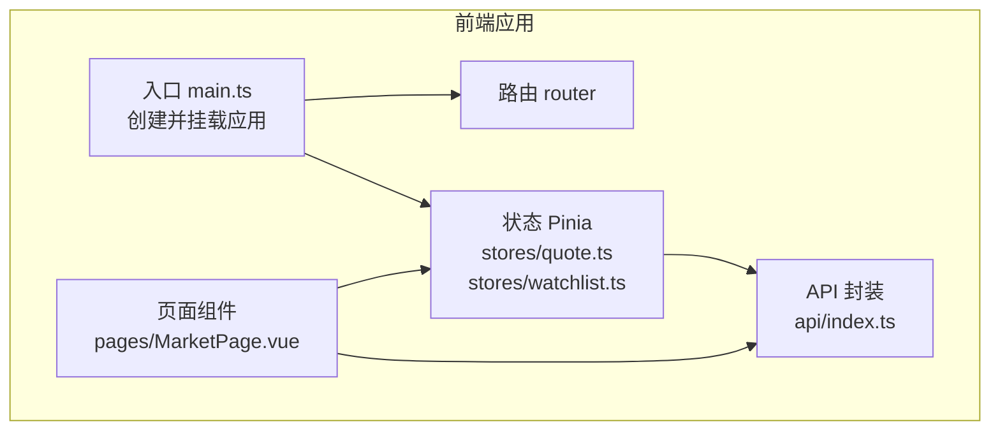
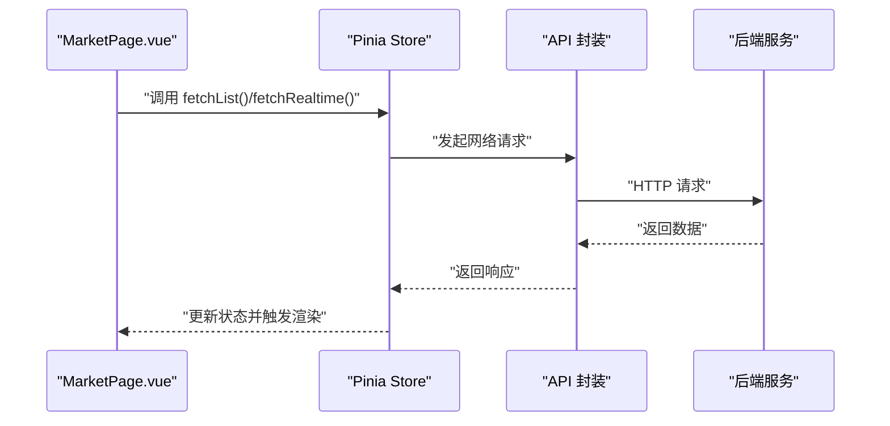
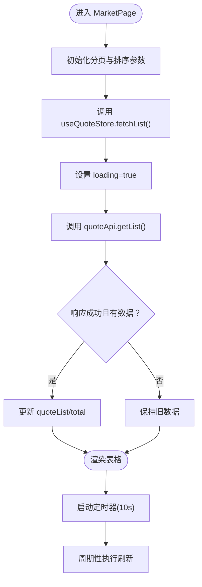

# 工具函数

<cite>
**本文引用的文件**
- [frontend/src/main.ts](file://frontend/src/main.ts)
- [frontend/src/api/index.ts](file://frontend/src/api/index.ts)
- [frontend/src/stores/quote.ts](file://frontend/src/stores/quote.ts)
- [frontend/src/stores/watchlist.ts](file://frontend/src/stores/watchlist.ts)
- [frontend/src/pages/MarketPage.vue](file://frontend/src/pages/MarketPage.vue)
- [backend/app/services/collector/eastmoney.py](file://backend/app/services/collector/eastmoney.py)
- [Stock-View 软件开发文档/开发文档.md](file://Stock-View 软件开发文档/开发文档.md)
</cite>

## 目录
1. [简介](#简介)
2. [项目结构](#项目结构)
3. [核心组件](#核心组件)
4. [架构总览](#架构总览)
5. [详细组件分析](#详细组件分析)
6. [依赖分析](#依赖分析)
7. [性能考量](#性能考量)
8. [故障排查指南](#故障排查指南)
9. [结论](#结论)
10. [附录](#附录)

## 简介
本章节聚焦于 Stock-View 前端工程中的工具函数与辅助能力，系统梳理数据处理工具（数值格式化、时间日期处理、数据转换）、组合式API（自定义 hooks 的设计与使用）、类型定义（接口、枚举、泛型）在项目中的作用与实现方式，并给出测试策略、性能优化建议、代码复用最佳实践，以及国际化、本地存储、加密解密等扩展方向的实现方案与注意事项。

## 项目结构
前端采用 Vue 3 + TypeScript + Vite 架构，核心模块包括：
- 应用入口与全局配置：应用挂载、状态管理、路由与 UI 组件库集成
- API 层：统一对外请求封装
- 状态层：基于 Pinia 的 store，承载行情与自选列表的状态与业务逻辑
- 页面层：市场页、详情页、搜索页等页面组件
- 类型与工具：类型定义与通用工具函数（当前仓库未显式提供独立 utils 目录，但通过 store、页面与 API 层体现工具化能力）

图表来源
- [frontend/src/main.ts:1-12](file://frontend/src/main.ts#L1-L12)
- [frontend/src/stores/quote.ts:1-43](file://frontend/src/stores/quote.ts#L1-L43)
- [frontend/src/stores/watchlist.ts:1-36](file://frontend/src/stores/watchlist.ts#L1-L36)
- [frontend/src/pages/MarketPage.vue:128-222](file://frontend/src/pages/MarketPage.vue#L128-L222)
- [frontend/src/api/index.ts](file://frontend/src/api/index.ts)

章节来源
- [frontend/src/main.ts:1-12](file://frontend/src/main.ts#L1-L12)
- [frontend/src/pages/MarketPage.vue:128-222](file://frontend/src/pages/MarketPage.vue#L128-L222)

## 核心组件
本节从“工具函数”视角，总结项目中已体现的数据处理与状态管理能力，包括：
- 数值格式化：价格、涨跌、成交量等字段的展示格式化
- 时间日期处理：后端返回的时间戳与前端展示格式的转换
- 数据转换：后端接口数据到前端展示模型的映射
- 组合式API：useQuoteStore、useWatchlistStore 的设计与使用
- 类型定义：接口与模型的约束与可维护性保障

章节来源
- [frontend/src/stores/quote.ts:1-43](file://frontend/src/stores/quote.ts#L1-L43)
- [frontend/src/stores/watchlist.ts:1-36](file://frontend/src/stores/watchlist.ts#L1-L36)
- [frontend/src/pages/MarketPage.vue:111-126](file://frontend/src/pages/MarketPage.vue#L111-L126)
- [backend/app/services/collector/eastmoney.py:280-296](file://backend/app/services/collector/eastmoney.py#L280-L296)

## 架构总览
下图展示了页面组件如何通过 store 与 API 进行交互，以及数据在各层之间的流转：

图表来源
- [frontend/src/pages/MarketPage.vue:188-217](file://frontend/src/pages/MarketPage.vue#L188-L217)
- [frontend/src/stores/quote.ts:11-30](file://frontend/src/stores/quote.ts#L11-L30)
- [frontend/src/api/index.ts](file://frontend/src/api/index.ts)

## 详细组件分析

### 数据处理工具：数值格式化、时间日期处理、数据转换
- 数值格式化
  - 价格与涨跌：页面通过格式化函数对价格、涨跌等数值进行展示控制，例如根据涨跌差值决定颜色样式，避免重复计算与硬编码。
  - 成交量与金额：后端返回的成交量与金额通常为整数或高精度小数，前端需按业务规则进行单位换算与保留位数控制。
- 时间日期处理
  - 后端返回的时间戳字符串需转换为本地时间显示；若涉及周期（如分钟线）则需按周期进行聚合或切分。
  - 项目数据库文档中提供了分钟级与分时数据表结构，便于前端理解数据粒度与展示策略。
- 数据转换
  - 后端采集器将第三方数据源映射为统一的报价字段集合，前端 store 对该集合进行进一步清洗与合并，保证表格与图表渲染的一致性。

章节来源
- [frontend/src/pages/MarketPage.vue:111-126](file://frontend/src/pages/MarketPage.vue#L111-L126)
- [backend/app/services/collector/eastmoney.py:280-296](file://backend/app/services/collector/eastmoney.py#L280-L296)
- [Stock-View 软件开发文档/开发文档.md:1028-1070](file://Stock-View 软件开发文档/开发文档.md#L1028-L1070)

### 组合式API：useQuoteStore、useWatchlistStore 的设计与使用
- 设计模式
  - 使用 Composition API 风格的 store 定义，集中管理状态与异步操作，减少重复逻辑。
  - 将“获取列表、实时查询、更新单条记录”等行为封装在 store 中，供页面组件直接调用。
- 使用方法
  - 在页面组件中通过组合式 API 获取 store 实例，绑定分页参数与排序条件，定时轮询刷新。
  - 页面通过 store 的加载状态控制 UI 加载态，提升用户体验。

图表来源
- [frontend/src/pages/MarketPage.vue:188-217](file://frontend/src/pages/MarketPage.vue#L188-L217)
- [frontend/src/stores/quote.ts:11-22](file://frontend/src/stores/quote.ts#L11-L22)

章节来源
- [frontend/src/stores/quote.ts:1-43](file://frontend/src/stores/quote.ts#L1-L43)
- [frontend/src/stores/watchlist.ts:1-36](file://frontend/src/stores/watchlist.ts#L1-L36)
- [frontend/src/pages/MarketPage.vue:128-222](file://frontend/src/pages/MarketPage.vue#L128-L222)

### 类型定义：接口、枚举、泛型的使用
- 接口与模型
  - store 返回的类型为 any[]，在大型项目中建议明确接口定义，以增强类型安全与 IDE 支持。
- 枚举与常量
  - 可通过枚举定义市场类型、排序字段、周期等，避免魔法字符串带来的维护成本。
- 泛型约束
  - 在工具函数中使用泛型约束可提升复用性，例如对数组元素进行统一处理时，确保输入输出类型一致。

章节来源
- [frontend/src/stores/quote.ts:6-7](file://frontend/src/stores/quote.ts#L6-L7)
- [frontend/src/stores/watchlist.ts:6](file://frontend/src/stores/watchlist.ts#L6)

### 国际化工具、本地存储工具、加密解密工具的实现方案
- 国际化（i18n）
  - 建议引入 i18n 框架，将页面文案、数字/日期格式化规则与语言切换解耦，便于多语言扩展。
- 本地存储（localStorage/sessionStorage）
  - 可用于缓存用户偏好（如主题、语言、分页大小）、搜索历史、自选列表等，注意序列化与反序列化、过期策略与容量限制。
- 加密解密
  - 对敏感信息（如用户凭证、密钥）进行加密存储或传输，结合安全的密钥管理与哈希校验，降低泄露风险。

[本节为概念性指导，不直接分析具体文件，故无章节来源]

### 测试策略、性能优化技巧、代码复用最佳实践
- 测试策略
  - 单元测试：针对 store 的异步方法与数据转换函数编写断言，覆盖正常路径与异常路径。
  - 集成测试：模拟 API 返回与路由跳转，验证页面渲染与交互流程。
  - 性能测试：对高频轮询与大数据量渲染进行基准测试，识别瓶颈。
- 性能优化
  - 避免不必要的响应式更新：对大数组采用分页或虚拟滚动。
  - 合理使用防抖/节流：对搜索与窗口尺寸变化进行节流。
  - 缓存策略：对静态数据与远端数据分别设置合理的缓存与失效策略。
- 代码复用
  - 将通用的数据处理函数抽取为独立模块，统一导出与命名空间管理。
  - 使用组合式 API 抽象公共逻辑，减少重复代码。

[本节为通用实践建议，不直接分析具体文件，故无章节来源]

## 依赖分析
- 外部依赖
  - Vue 3、Pinia、Element Plus、dayjs 等广泛使用，为工具函数与组件提供基础能力。
- 内部依赖
  - 页面组件依赖 store 与 API 封装；store 依赖 API 封装；API 封装依赖后端服务。

图表来源
- [frontend/src/pages/MarketPage.vue:128-222](file://frontend/src/pages/MarketPage.vue#L128-L222)
- [frontend/src/stores/quote.ts:1-43](file://frontend/src/stores/quote.ts#L1-L43)
- [frontend/src/api/index.ts](file://frontend/src/api/index.ts)

章节来源
- [frontend/src/main.ts:1-12](file://frontend/src/main.ts#L1-L12)
- [frontend/src/pages/MarketPage.vue:128-222](file://frontend/src/pages/MarketPage.vue#L128-L222)

## 性能考量
- 渲染性能
  - 表格数据量较大时，优先采用虚拟滚动或分页加载，减少 DOM 节点数量。
- 网络性能
  - 合并请求、批量获取实时数据，避免频繁短间隔请求导致带宽与服务器压力。
- 存储性能
  - 本地存储应避免频繁读写，采用批处理与去抖策略，控制存储体积。

[本节提供通用指导，不直接分析具体文件，故无章节来源]

## 故障排查指南
- 数据为空或格式异常
  - 检查后端接口返回结构是否符合预期，store 是否正确解析字段。
- 轮询不生效
  - 确认定时器是否被清理、页面是否卸载、网络请求是否抛错。
- 样式与颜色不生效
  - 检查颜色类名是否正确绑定、CSS 变量是否生效。

章节来源
- [frontend/src/pages/MarketPage.vue:188-222](file://frontend/src/pages/MarketPage.vue#L188-L222)
- [frontend/src/stores/quote.ts:11-30](file://frontend/src/stores/quote.ts#L11-L30)

## 结论
本项目在前端层面已具备较为完善的工具化能力：通过 store 将数据获取与状态管理抽象为可复用的组合式API，页面组件专注于渲染与交互；后端服务提供标准化的数据结构，便于前端进行统一转换与展示。后续可在类型定义、国际化、本地存储与安全方面进一步完善，以提升可维护性与扩展性。

[本节为总结性内容，不直接分析具体文件，故无章节来源]

## 附录
- 文档生成与版本管理
  - 使用工具链生成 API 文档与类型声明，配合语义化版本管理发布变更。
- 兼容性考虑
  - 关注浏览器与移动端兼容性，对新特性进行降级处理或 polyfill。

[本节为通用建议，不直接分析具体文件，故无章节来源]