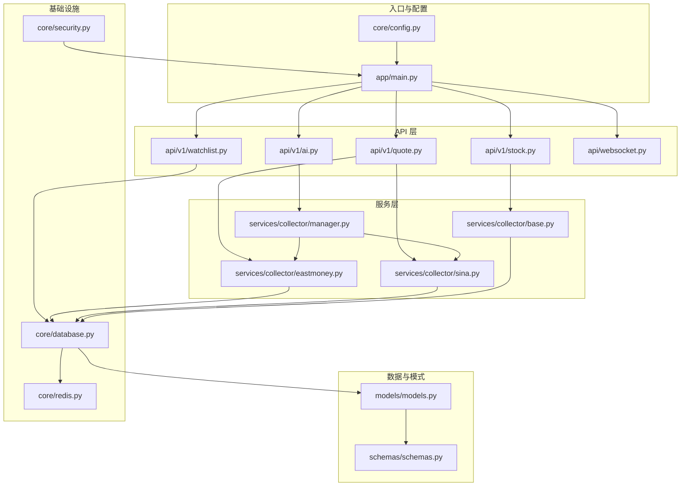
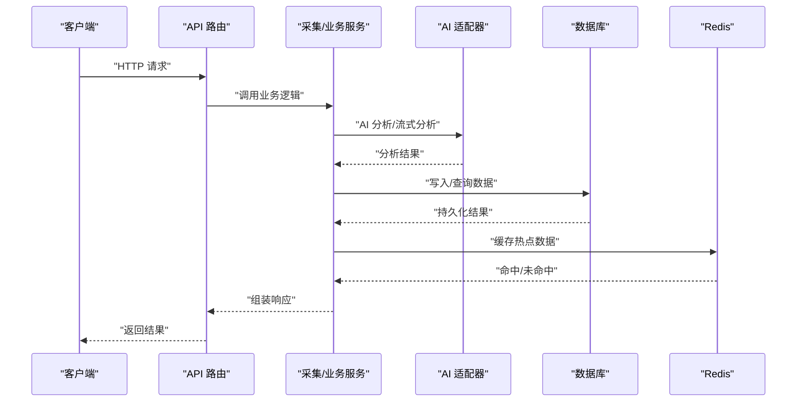
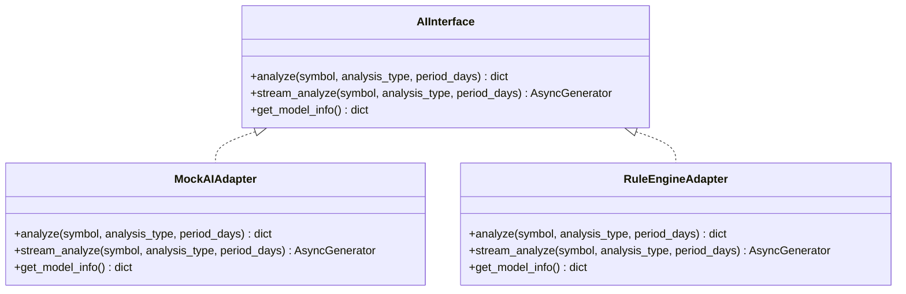
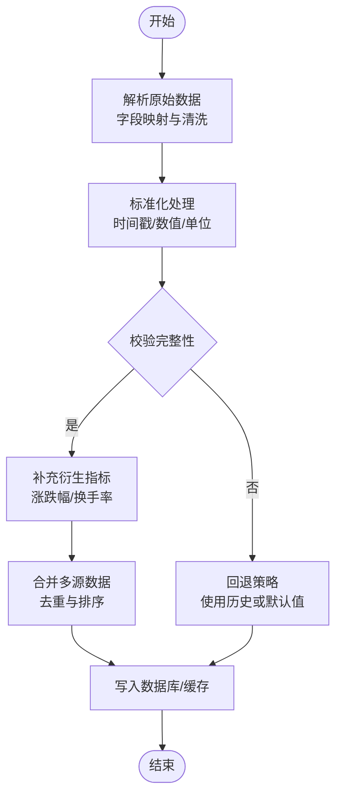
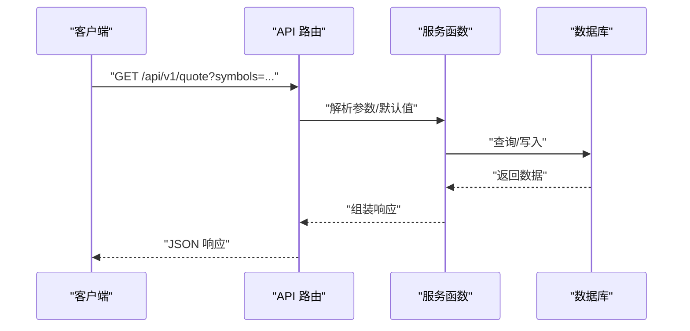
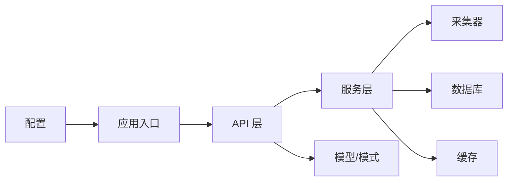

# 工具函数

<cite>
**本文引用的文件**
- [backend/app/ai/interface.py](file://backend/app/ai/interface.py)
- [backend/app/api/v1/ai.py](file://backend/app/api/v1/ai.py)
- [backend/app/api/v1/quote.py](file://backend/app/api/v1/quote.py)
- [backend/app/api/v1/stock.py](file://backend/app/api/v1/stock.py)
- [backend/app/api/v1/watchlist.py](file://backend/app/api/v1/watchlist.py)
- [backend/app/api/websocket.py](file://backend/app/api/websocket.py)
- [backend/app/core/config.py](file://backend/app/core/config.py)
- [backend/app/core/database.py](file://backend/app/core/database.py)
- [backend/app/core/redis.py](file://backend/app/core/redis.py)
- [backend/app/core/security.py](file://backend/app/core/security.py)
- [backend/app/models/models.py](file://backend/app/models/models.py)
- [backend/app/schemas/schemas.py](file://backend/app/schemas/schemas.py)
- [backend/app/services/collector/base.py](file://backend/app/services/collector/base.py)
- [backend/app/services/collector/eastmoney.py](file://backend/app/services/collector/eastmoney.py)
- [backend/app/services/collector/manager.py](file://backend/app/services/collector/manager.py)
- [backend/app/services/collector/sina.py](file://backend/app/services/collector/sina.py)
- [backend/app/tasks/README.md](file://backend/app/tasks/README.md)
- [backend/app/main.py](file://backend/app/main.py)
- [README.md](file://README.md)
</cite>

## 目录
1. [简介](#简介)
2. [项目结构](#项目结构)
3. [核心组件](#核心组件)
4. [架构总览](#架构总览)
5. [详细组件分析](#详细组件分析)
6. [依赖关系分析](#依赖关系分析)
7. [性能考量](#性能考量)
8. [故障排查指南](#故障排查指南)
9. [结论](#结论)
10. [附录](#附录)

## 简介
本文件聚焦于后端工具函数与辅助能力的系统化梳理，覆盖以下方面：
- 数据处理与格式化：如行情字段解析、JSON序列化/反序列化、时间戳处理等
- 计算与统计：如涨跌幅计算、换手率处理、K线聚合等
- 组合式函数（composables）理念与实践：通过服务层抽象与适配器模式实现逻辑复用、状态封装与副作用隔离
- 类型定义与约束：Pydantic 模型、枚举、泛型与类型注解的使用
- 使用示例与最佳实践：参数设计、返回值约定、错误处理与幂等性
- 测试策略与维护建议：可测性设计、边界条件与回归保障

## 项目结构
后端采用分层架构：入口应用负责路由与生命周期；API 层提供对外接口；服务层负责采集与业务逻辑；模型与模式层提供数据结构与校验；核心模块提供配置、数据库、缓存与安全能力。

图表来源
- [backend/app/main.py](file://backend/app/main.py)
- [backend/app/api/v1/ai.py](file://backend/app/api/v1/ai.py)
- [backend/app/api/v1/quote.py](file://backend/app/api/v1/quote.py)
- [backend/app/api/v1/stock.py](file://backend/app/api/v1/stock.py)
- [backend/app/api/v1/watchlist.py](file://backend/app/api/v1/watchlist.py)
- [backend/app/api/websocket.py](file://backend/app/api/websocket.py)
- [backend/app/core/config.py](file://backend/app/core/config.py)
- [backend/app/core/database.py](file://backend/app/core/database.py)
- [backend/app/core/redis.py](file://backend/app/core/redis.py)
- [backend/app/core/security.py](file://backend/app/core/security.py)
- [backend/app/models/models.py](file://backend/app/models/models.py)
- [backend/app/schemas/schemas.py](file://backend/app/schemas/schemas.py)
- [backend/app/services/collector/base.py](file://backend/app/services/collector/base.py)
- [backend/app/services/collector/eastmoney.py](file://backend/app/services/collector/eastmoney.py)
- [backend/app/services/collector/manager.py](file://backend/app/services/collector/manager.py)
- [backend/app/services/collector/sina.py](file://backend/app/services/collector/sina.py)

章节来源
- [backend/app/main.py](file://backend/app/main.py)
- [backend/app/core/config.py](file://backend/app/core/config.py)
- [backend/app/core/database.py](file://backend/app/core/database.py)
- [backend/app/core/redis.py](file://backend/app/core/redis.py)
- [backend/app/core/security.py](file://backend/app/core/security.py)
- [backend/app/models/models.py](file://backend/app/models/models.py)
- [backend/app/schemas/schemas.py](file://backend/app/schemas/schemas.py)
- [backend/app/services/collector/base.py](file://backend/app/services/collector/base.py)
- [backend/app/services/collector/eastmoney.py](file://backend/app/services/collector/eastmoney.py)
- [backend/app/services/collector/manager.py](file://backend/app/services/collector/manager.py)
- [backend/app/services/collector/sina.py](file://backend/app/services/collector/sina.py)
- [backend/app/api/v1/ai.py](file://backend/app/api/v1/ai.py)
- [backend/app/api/v1/quote.py](file://backend/app/api/v1/quote.py)
- [backend/app/api/v1/stock.py](file://backend/app/api/v1/stock.py)
- [backend/app/api/v1/watchlist.py](file://backend/app/api/v1/watchlist.py)
- [backend/app/api/websocket.py](file://backend/app/api/websocket.py)

## 核心组件
- 接口与适配器（AI 分析）
  - 抽象接口定义分析协议、流式分析与模型信息查询
  - 提供模拟适配器与规则引擎适配器，便于替换与扩展
- 采集器（Quote 数据）
  - 基类提供统一采集框架与市场识别
  - 东方财富与新浪采集器实现具体字段解析与数据清洗
  - 管理器协调多源采集与合并策略
- 模式与模型（数据结构）
  - Pydantic 模型用于请求/响应校验与序列化
  - SQLAlchemy 模型映射数据库表结构，含 JSON 字段与数值精度
- API 层（对外接口）
  - 股票搜索、实时行情、K线、分时、买卖盘、自选股管理、AI 分析
  - WebSocket 连接管理器
- 基础设施（配置、数据库、缓存、安全）
  - 配置加载与验证
  - 数据库会话与声明式基类
  - Redis 客户端接入
  - 安全工具（如密码哈希、令牌）

章节来源
- [backend/app/ai/interface.py](file://backend/app/ai/interface.py)
- [backend/app/services/collector/base.py](file://backend/app/services/collector/base.py)
- [backend/app/services/collector/eastmoney.py](file://backend/app/services/collector/eastmoney.py)
- [backend/app/services/collector/sina.py](file://backend/app/services/collector/sina.py)
- [backend/app/services/collector/manager.py](file://backend/app/services/collector/manager.py)
- [backend/app/schemas/schemas.py](file://backend/app/schemas/schemas.py)
- [backend/app/models/models.py](file://backend/app/models/models.py)
- [backend/app/api/v1/stock.py](file://backend/app/api/v1/stock.py)
- [backend/app/api/v1/quote.py](file://backend/app/api/v1/quote.py)
- [backend/app/api/v1/watchlist.py](file://backend/app/api/v1/watchlist.py)
- [backend/app/api/v1/ai.py](file://backend/app/api/v1/ai.py)
- [backend/app/api/websocket.py](file://backend/app/api/websocket.py)
- [backend/app/core/config.py](file://backend/app/core/config.py)
- [backend/app/core/database.py](file://backend/app/core/database.py)
- [backend/app/core/redis.py](file://backend/app/core/redis.py)
- [backend/app/core/security.py](file://backend/app/core/security.py)

## 架构总览
下图展示从 API 到服务层再到数据存储的整体调用链路，体现工具函数在数据处理、格式化与状态封装中的作用。

图表来源
- [backend/app/api/v1/ai.py](file://backend/app/api/v1/ai.py)
- [backend/app/ai/interface.py](file://backend/app/ai/interface.py)
- [backend/app/services/collector/manager.py](file://backend/app/services/collector/manager.py)
- [backend/app/models/models.py](file://backend/app/models/models.py)
- [backend/app/core/redis.py](file://backend/app/core/redis.py)

## 详细组件分析

### AI 分析接口与适配器
- 设计要点
  - 抽象接口定义统一分析协议，支持同步与流式分析，以及模型信息查询
  - 通过工厂函数按名称创建适配器实例，便于切换实现
- 关键流程
  - 参数校验与默认值设置
  - 异步分析执行与结果聚合
  - 流式输出逐段推送
- 复杂度与性能
  - 同步分析为 O(n)（n 为数据点数），流式分析按批次推送，降低首屏延迟
  - 结果缓存与去重可显著提升重复请求性能

图表来源
- [backend/app/ai/interface.py](file://backend/app/ai/interface.py)

章节来源
- [backend/app/ai/interface.py](file://backend/app/ai/interface.py)
- [backend/app/api/v1/ai.py](file://backend/app/api/v1/ai.py)

### 行情采集与格式化工具
- 采集器职责
  - 基类：统一市场识别、日期/时间处理、异常处理与日志
  - 东方财富：解析字段映射、涨跌额/幅度、成交量/成交额、换手率与时钟
  - 新浪：解析字段映射、分时与买卖盘
  - 管理器：协调多源采集、合并与去重
- 数据处理与格式化
  - 字段清洗：空值归零或空字符串，避免下游解析失败
  - 时间戳标准化：统一时区与格式
  - 数值规范化：保留精度、避免浮点误差
- 性能优化
  - 批量请求与并发控制
  - 缓存热点股票的最新报价
  - 增量更新与去重

图表来源
- [backend/app/services/collector/eastmoney.py](file://backend/app/services/collector/eastmoney.py)
- [backend/app/services/collector/sina.py](file://backend/app/services/collector/sina.py)
- [backend/app/services/collector/manager.py](file://backend/app/services/collector/manager.py)
- [backend/app/models/models.py](file://backend/app/models/models.py)

章节来源
- [backend/app/services/collector/base.py](file://backend/app/services/collector/base.py)
- [backend/app/services/collector/eastmoney.py](file://backend/app/services/collector/eastmoney.py)
- [backend/app/services/collector/sina.py](file://backend/app/services/collector/sina.py)
- [backend/app/services/collector/manager.py](file://backend/app/services/collector/manager.py)
- [backend/app/models/models.py](file://backend/app/models/models.py)

### API 层工具函数与组合式函数理念
- 组合式函数（composables）实践
  - 将“查询/写入/流式推送”等操作封装为可复用的服务函数
  - 通过依赖注入（如数据库会话）实现状态封装与副作用隔离
  - 将参数校验、默认值设置、错误包装等横切逻辑集中处理
- 典型场景
  - 股票搜索：关键词匹配、分页限制
  - 实时行情：批量符号解析、字段裁剪
  - 自选股管理：排序、去重、幂等写入
  - WebSocket：连接池管理、消息广播
- 返回值与错误处理
  - 统一响应模型（包含状态码、消息与数据体）
  - 明确异常类型与HTTP状态码映射

图表来源
- [backend/app/api/v1/quote.py](file://backend/app/api/v1/quote.py)
- [backend/app/api/v1/stock.py](file://backend/app/api/v1/stock.py)
- [backend/app/api/v1/watchlist.py](file://backend/app/api/v1/watchlist.py)
- [backend/app/schemas/schemas.py](file://backend/app/schemas/schemas.py)
- [backend/app/core/database.py](file://backend/app/core/database.py)

章节来源
- [backend/app/api/v1/quote.py](file://backend/app/api/v1/quote.py)
- [backend/app/api/v1/stock.py](file://backend/app/api/v1/stock.py)
- [backend/app/api/v1/watchlist.py](file://backend/app/api/v1/watchlist.py)
- [backend/app/api/websocket.py](file://backend/app/api/websocket.py)
- [backend/app/schemas/schemas.py](file://backend/app/schemas/schemas.py)
- [backend/app/core/database.py](file://backend/app/core/database.py)

### 类型定义与约束
- Pydantic 模型
  - 响应基类与各接口响应模型，保证字段存在性与类型一致性
  - 请求模型用于参数校验与默认值设置
- 枚举与常量
  - 分析类型、趋势方向等以枚举形式约束取值范围
- 泛型与类型注解
  - 在服务层与API层广泛使用类型注解，提升IDE体验与静态检查能力
- 数据库模型
  - 数值精度（如百分比、金额）使用定点数类型
  - JSON 字段用于灵活存储结构化数据

章节来源
- [backend/app/schemas/schemas.py](file://backend/app/schemas/schemas.py)
- [backend/app/models/models.py](file://backend/app/models/models.py)
- [backend/app/ai/interface.py](file://backend/app/ai/interface.py)

### 配置、数据库与缓存工具
- 配置加载
  - 通过环境变量与默认值组合，提供统一配置入口
- 数据库工具
  - 声明式基类与会话管理，简化ORM操作
  - 事务与批量写入工具函数
- 缓存工具
  - Redis 客户端封装，提供键空间管理与过期策略
- 安全工具
  - 密码哈希与校验、令牌生成与验证

章节来源
- [backend/app/core/config.py](file://backend/app/core/config.py)
- [backend/app/core/database.py](file://backend/app/core/database.py)
- [backend/app/core/redis.py](file://backend/app/core/redis.py)
- [backend/app/core/security.py](file://backend/app/core/security.py)

## 依赖关系分析
- 模块耦合
  - API 层仅依赖服务层接口，不直接访问数据库，降低耦合
  - 采集器通过管理器统一调度，便于替换与扩展
- 外部依赖
  - HTTP 采集依赖第三方行情源
  - 数据库存储与Redis缓存
- 循环依赖
  - 通过接口与工厂函数避免循环导入

图表来源
- [backend/app/api/v1/ai.py](file://backend/app/api/v1/ai.py)
- [backend/app/api/v1/quote.py](file://backend/app/api/v1/quote.py)
- [backend/app/api/v1/stock.py](file://backend/app/api/v1/stock.py)
- [backend/app/api/v1/watchlist.py](file://backend/app/api/v1/watchlist.py)
- [backend/app/services/collector/manager.py](file://backend/app/services/collector/manager.py)
- [backend/app/models/models.py](file://backend/app/models/models.py)
- [backend/app/core/redis.py](file://backend/app/core/redis.py)
- [backend/app/core/config.py](file://backend/app/core/config.py)
- [backend/app/main.py](file://backend/app/main.py)

章节来源
- [backend/app/main.py](file://backend/app/main.py)
- [backend/app/api/v1/ai.py](file://backend/app/api/v1/ai.py)
- [backend/app/api/v1/quote.py](file://backend/app/api/v1/quote.py)
- [backend/app/api/v1/stock.py](file://backend/app/api/v1/stock.py)
- [backend/app/api/v1/watchlist.py](file://backend/app/api/v1/watchlist.py)
- [backend/app/services/collector/manager.py](file://backend/app/services/collector/manager.py)
- [backend/app/models/models.py](file://backend/app/models/models.py)
- [backend/app/core/redis.py](file://backend/app/core/redis.py)
- [backend/app/core/config.py](file://backend/app/core/config.py)

## 性能考量
- 并发与限流
  - 采集器对第三方接口进行并发控制与指数退避
- 缓存策略
  - 热点数据缓存与失效策略，减少重复请求
- 数据库优化
  - 批量写入、索引设计与查询优化
- 序列化开销
  - Pydantic 模型在解析与序列化时的性能权衡

## 故障排查指南
- 常见问题
  - 第三方接口超时/限流：增加重试与熔断
  - 数据缺失/字段不一致：字段清洗与默认值策略
  - 数据库写入失败：事务回滚与幂等性设计
- 日志与监控
  - 统一日志格式与关键指标埋点
- 回滚与恢复
  - 版本化迁移脚本与备份策略

## 结论
本项目通过清晰的分层架构与组合式函数理念，实现了高内聚、低耦合的工具函数体系。借助Pydantic模型与SQLAlchemy模型，确保了数据结构的一致性与可维护性；通过适配器与管理器模式，提升了扩展性与可测性。建议持续完善测试覆盖与文档，保持类型注解与错误处理的一致性。

## 附录
- 使用示例与最佳实践
  - 函数命名：动词短语，明确输入/输出意图
  - 参数设计：必填项与可选项分离，默认值明确
  - 返回值：统一响应模型，错误码与消息清晰
  - 幂等性：写操作需具备幂等保障
- 测试策略
  - 单元测试：覆盖核心算法与边界条件
  - 集成测试：端到端流程与外部依赖模拟
  - 回归测试：版本升级与配置变更后的回归
- 维护建议
  - 变更评审：涉及数据结构与接口的变更需评审
  - 文档同步：代码变更与文档同步更新
  - 性能基准：定期进行性能回归测试