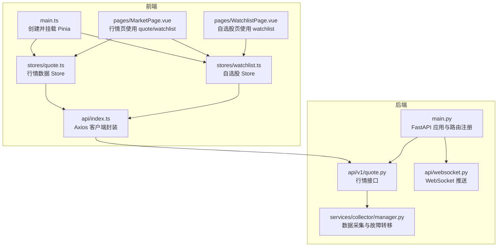
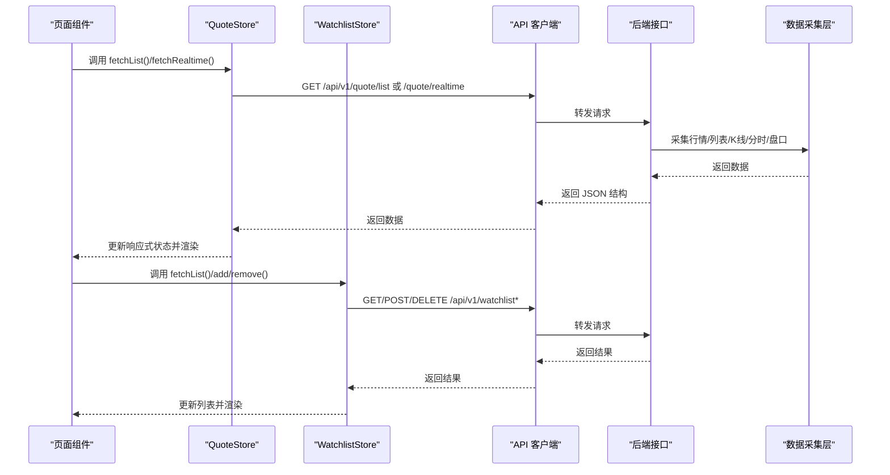
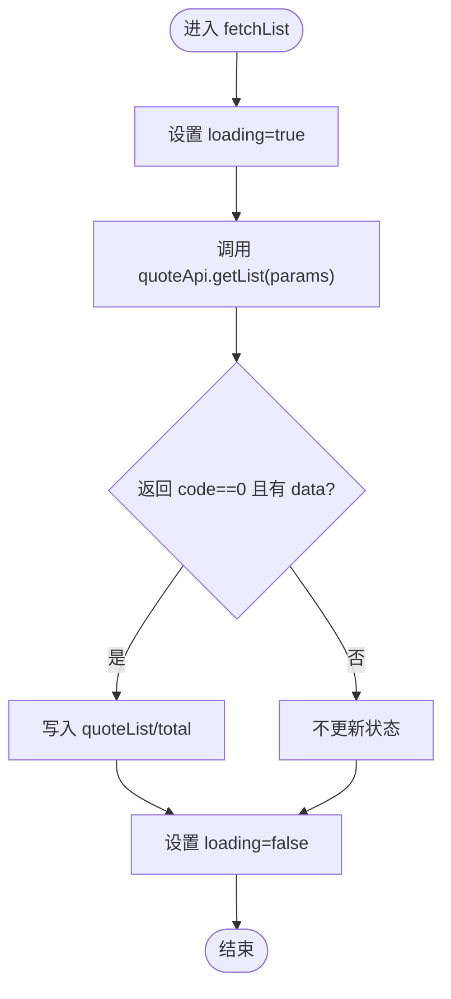
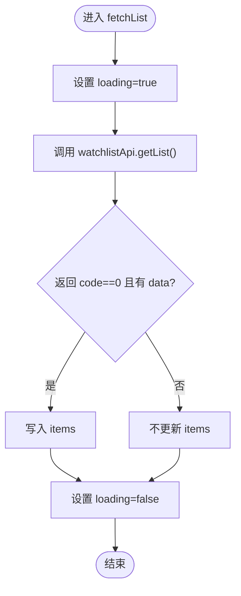
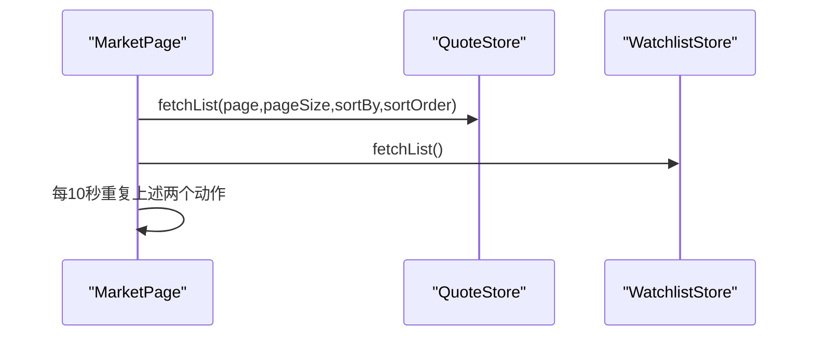
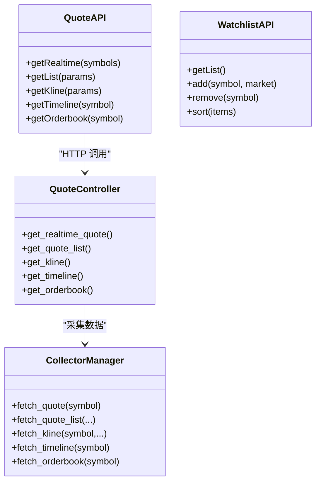
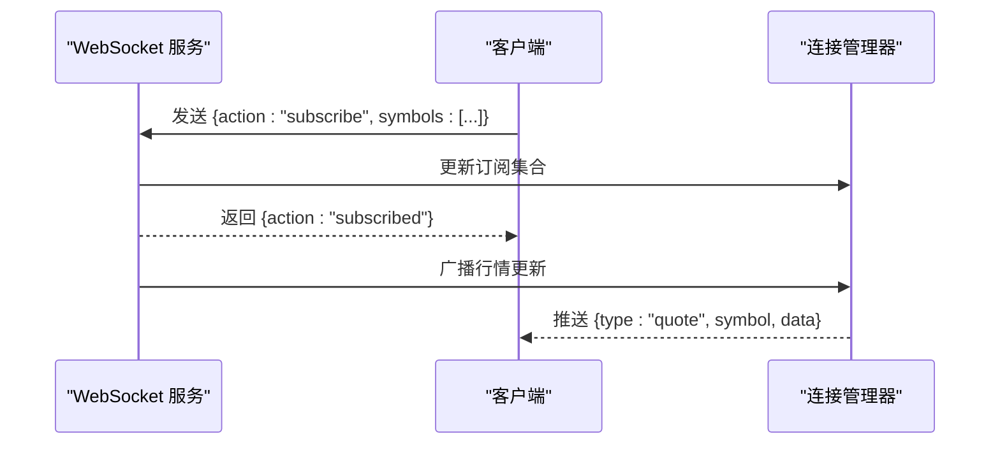
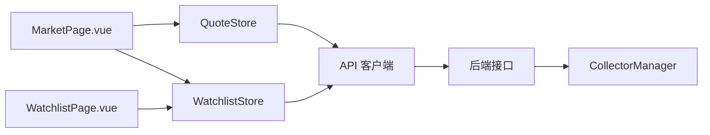

# 状态管理

<cite>
**本文引用的文件**
- [main.ts](file://frontend/src/main.ts)
- [quote.ts](file://frontend/src/stores/quote.ts)
- [watchlist.ts](file://frontend/src/stores/watchlist.ts)
- [index.ts](file://frontend/src/api/index.ts)
- [MarketPage.vue](file://frontend/src/pages/MarketPage.vue)
- [WatchlistPage.vue](file://frontend/src/pages/WatchlistPage.vue)
- [main.py](file://backend/app/main.py)
- [websocket.py](file://backend/app/api/websocket.py)
- [quote.py](file://backend/app/api/v1/quote.py)
- [manager.py](file://backend/app/services/collector/manager.py)
</cite>

## 目录
1. [引言](#引言)
2. [项目结构](#项目结构)
3. [核心组件](#核心组件)
4. [架构总览](#架构总览)
5. [详细组件分析](#详细组件分析)
6. [依赖分析](#依赖分析)
7. [性能考虑](#性能考虑)
8. [故障排查指南](#故障排查指南)
9. [结论](#结论)
10. [附录](#附录)

## 引言
本文件系统性梳理前端基于 Pinia 的状态管理方案，围绕“行情数据”和“自选股”两大 Store 的设计与实现进行深入解析，并结合后端 API、WebSocket 推送与数据采集层，给出响应式更新、数据持久化策略、状态同步、最佳实践与调试优化建议。目标是帮助开发者快速理解并高效扩展状态管理能力。

## 项目结构
前端采用 Vue 3 + TypeScript + Pinia 架构，状态管理集中在 stores 目录；API 客户端封装在 api 目录；页面组件通过组合式 API 使用 Store 并驱动视图渲染。

图表来源
- [main.ts:1-12](file://frontend/src/main.ts#L1-L12)
- [quote.ts:1-43](file://frontend/src/stores/quote.ts#L1-L43)
- [watchlist.ts:1-36](file://frontend/src/stores/watchlist.ts#L1-L36)
- [index.ts:1-33](file://frontend/src/api/index.ts#L1-L33)
- [MarketPage.vue:80-155](file://frontend/src/pages/MarketPage.vue#L80-L155)
- [WatchlistPage.vue:36-68](file://frontend/src/pages/WatchlistPage.vue#L36-L68)
- [main.py:1-48](file://backend/app/main.py#L1-L48)
- [websocket.py:1-79](file://backend/app/api/websocket.py#L1-L79)
- [quote.py:1-65](file://backend/app/api/v1/quote.py#L1-L65)
- [manager.py:1-80](file://backend/app/services/collector/manager.py#L1-L80)

章节来源
- [main.ts:1-12](file://frontend/src/main.ts#L1-L12)
- [index.ts:1-33](file://frontend/src/api/index.ts#L1-L33)
- [MarketPage.vue:80-155](file://frontend/src/pages/MarketPage.vue#L80-L155)
- [WatchlistPage.vue:36-68](file://frontend/src/pages/WatchlistPage.vue#L36-L68)
- [main.py:1-48](file://backend/app/main.py#L1-L48)

## 核心组件
- Pinia 初始化与全局注入：在应用入口创建并挂载 Pinia，确保全局可使用 Store。
- 行情数据 Store（quote）：负责行情列表、当前选择的行情、加载状态与总数；提供拉取列表、拉取实时数据、按符号更新行情等方法。
- 自选股 Store（watchlist）：负责自选股列表、加载状态；提供拉取列表、添加、删除、查询是否已关注等方法。
- API 客户端：统一封装 /api/v1 前缀的请求，便于 Store 调用后端接口。
- 页面组件：在生命周期中调用 Store 方法加载数据，并通过响应式数据驱动表格渲染与交互。

章节来源
- [main.ts:1-12](file://frontend/src/main.ts#L1-L12)
- [quote.ts:1-43](file://frontend/src/stores/quote.ts#L1-L43)
- [watchlist.ts:1-36](file://frontend/src/stores/watchlist.ts#L1-L36)
- [index.ts:1-33](file://frontend/src/api/index.ts#L1-L33)
- [MarketPage.vue:80-155](file://frontend/src/pages/MarketPage.vue#L80-L155)
- [WatchlistPage.vue:36-68](file://frontend/src/pages/WatchlistPage.vue#L36-L68)

## 架构总览
Pinia Store 作为状态中心，通过 API 客户端与后端 REST 接口交互；后端提供行情接口与 WebSocket 推送，数据采集层负责从多个数据源抓取并做故障转移。页面组件在挂载时触发 Store 加载，并定时刷新以保持数据新鲜度。

图表来源
- [MarketPage.vue:146-154](file://frontend/src/pages/MarketPage.vue#L146-L154)
- [WatchlistPage.vue:49-67](file://frontend/src/pages/WatchlistPage.vue#L49-L67)
- [quote.ts:11-30](file://frontend/src/stores/quote.ts#L11-L30)
- [watchlist.ts:9-29](file://frontend/src/stores/watchlist.ts#L9-L29)
- [index.ts:8-25](file://frontend/src/api/index.ts#L8-L25)
- [quote.py:7-65](file://backend/app/api/v1/quote.py#L7-L65)
- [manager.py:21-76](file://backend/app/services/collector/manager.py#L21-L76)

## 详细组件分析

### 行情数据 Store（quote）
- 设计要点
  - 使用组合式 Store（函数式 defineStore），内部以 ref 定义响应式状态：行情列表、当前行情、加载状态、总数。
  - 提供异步动作：拉取列表、拉取实时数据、按符号更新行情。
  - 错误处理：在 fetchList 中通过 try/finally 控制 loading 状态，避免 UI 卡死。
- 关键流程
  - 列表加载：调用 API 获取分页数据，成功后写入列表与总数。
  - 实时数据：按符号批量拉取，返回增量数据用于更新。
  - 状态更新：updateQuote 支持就地合并，保证当前选中项与列表项一致。

图表来源
- [quote.ts:11-22](file://frontend/src/stores/quote.ts#L11-L22)

章节来源
- [quote.ts:1-43](file://frontend/src/stores/quote.ts#L1-L43)

### 自选股 Store（watchlist）
- 设计要点
  - 使用组合式 Store，内部以 ref 定义 items 与 loading。
  - 提供异步动作：拉取列表、添加、删除、查询是否已关注。
  - 一致性保障：添加/删除后立即重新拉取，确保本地状态与后端一致。
- 关键流程
  - 拉取列表：调用 API 获取 items。
  - 添加/删除：调用对应接口后重新拉取，保证 UI 与后端同步。

图表来源
- [watchlist.ts:9-19](file://frontend/src/stores/watchlist.ts#L9-L19)

章节来源
- [watchlist.ts:1-36](file://frontend/src/stores/watchlist.ts#L1-L36)

### 页面组件中的状态使用
- MarketPage
  - 在挂载时加载行情列表与自选股列表，并每 10 秒轮询刷新。
  - 通过表格展示行情，点击行跳转到详情页。
- WatchlistPage
  - 拉取自选股列表后，批量获取实时数据并渲染。
  - 支持移除自选股，同时更新本地列表。

图表来源
- [MarketPage.vue:146-154](file://frontend/src/pages/MarketPage.vue#L146-L154)
- [MarketPage.vue:129-138](file://frontend/src/pages/MarketPage.vue#L129-L138)
- [MarketPage.vue:116-127](file://frontend/src/pages/MarketPage.vue#L116-L127)

章节来源
- [MarketPage.vue:80-155](file://frontend/src/pages/MarketPage.vue#L80-L155)
- [WatchlistPage.vue:36-68](file://frontend/src/pages/WatchlistPage.vue#L36-L68)

### API 客户端与后端接口
- API 客户端
  - 统一前缀 /api/v1，封装 quote、stock、watchlist、ai 等模块的请求方法。
- 后端接口
  - /api/v1/quote/realtime：按符号批量获取实时行情。
  - /api/v1/quote/list：分页获取行情列表，支持排序与筛选。
  - /api/v1/watchlist：获取、新增、删除、排序自选股。
- 数据采集与故障转移
  - CollectorManager 优先尝试主数据源，失败则切换备用数据源，提升可用性。

图表来源
- [index.ts:8-25](file://frontend/src/api/index.ts#L8-L25)
- [quote.py:7-65](file://backend/app/api/v1/quote.py#L7-L65)
- [manager.py:21-76](file://backend/app/services/collector/manager.py#L21-L76)

章节来源
- [index.ts:1-33](file://frontend/src/api/index.ts#L1-L33)
- [quote.py:1-65](file://backend/app/api/v1/quote.py#L1-L65)
- [manager.py:1-80](file://backend/app/services/collector/manager.py#L1-L80)

### WebSocket 实时推送（后端）
- 连接管理：维护活动连接与订阅集合，支持订阅/退订与心跳 ping/pong。
- 广播机制：当某股票有行情更新时，向订阅了该股票的客户端广播消息。
- 与前端集成：前端可通过 WebSocket 订阅感兴趣股票，接收增量更新，减少轮询压力。

图表来源
- [websocket.py:39-79](file://backend/app/api/websocket.py#L39-L79)

章节来源
- [websocket.py:1-79](file://backend/app/api/websocket.py#L1-L79)

## 依赖分析
- 组件耦合
  - 页面组件对 Store 的依赖清晰，Store 对 API 客户端的依赖单一，降低耦合度。
  - API 客户端与后端接口解耦，便于替换或扩展。
- 外部依赖
  - 前端：Pinia、Vue 响应式系统、Axios。
  - 后端：FastAPI、数据采集器、Redis（用于缓存与会话，具体使用点见后端配置）。
- 循环依赖
  - 当前结构未发现循环依赖；若后续引入复杂模块，需注意避免 Store 互相依赖。

图表来源
- [MarketPage.vue:80-155](file://frontend/src/pages/MarketPage.vue#L80-L155)
- [WatchlistPage.vue:36-68](file://frontend/src/pages/WatchlistPage.vue#L36-L68)
- [quote.ts:1-43](file://frontend/src/stores/quote.ts#L1-L43)
- [watchlist.ts:1-36](file://frontend/src/stores/watchlist.ts#L1-L36)
- [index.ts:1-33](file://frontend/src/api/index.ts#L1-L33)
- [quote.py:1-65](file://backend/app/api/v1/quote.py#L1-L65)
- [manager.py:1-80](file://backend/app/services/collector/manager.py#L1-L80)

章节来源
- [MarketPage.vue:80-155](file://frontend/src/pages/MarketPage.vue#L80-L155)
- [WatchlistPage.vue:36-68](file://frontend/src/pages/WatchlistPage.vue#L36-L68)
- [quote.ts:1-43](file://frontend/src/stores/quote.ts#L1-L43)
- [watchlist.ts:1-36](file://frontend/src/stores/watchlist.ts#L1-L36)
- [index.ts:1-33](file://frontend/src/api/index.ts#L1-L33)
- [quote.py:1-65](file://backend/app/api/v1/quote.py#L1-L65)
- [manager.py:1-80](file://backend/app/services/collector/manager.py#L1-L80)

## 性能考虑
- 列表分页与排序
  - 后端支持分页与排序参数，前端按需请求，避免一次性传输大量数据。
- 批量实时数据
  - 自选股页通过批量实时接口一次性获取多只股票数据，减少多次请求开销。
- 轮询频率控制
  - 市场页每 10 秒刷新一次，兼顾实时性与网络负载；可根据业务调整。
- 响应式更新
  - 使用就地合并更新（updateQuote）减少数组重建成本，保持引用稳定有利于 Vue Diff。
- WebSocket 替代轮询
  - 对高频更新场景，建议前端通过 WebSocket 订阅增量更新，显著降低请求频次与带宽消耗。
- 缓存策略
  - 后端可利用 Redis 缓存热点数据；前端可对近期请求结果做短期缓存，避免重复请求。

## 故障排查指南
- 状态未更新
  - 检查 Store 动作是否正确设置 loading 与最终关闭 loading。
  - 确认 API 返回的 code 与 data 结构符合预期，再写入响应式状态。
- 数据不同步
  - 添加/删除自选股后立即重新拉取，确保本地与后端一致。
- 实时数据缺失
  - 确认批量实时接口的符号拼接与后端限制（如最多 50 只）。
- WebSocket 不生效
  - 检查订阅消息格式与符号集合，确认连接管理器中订阅记录存在。
- 后端数据源异常
  - 观察 CollectorManager 的日志输出，确认主/备数据源切换逻辑是否正常工作。

章节来源
- [quote.ts:11-22](file://frontend/src/stores/quote.ts#L11-L22)
- [watchlist.ts:9-19](file://frontend/src/stores/watchlist.ts#L9-L19)
- [index.ts:8-25](file://frontend/src/api/index.ts#L8-L25)
- [websocket.py:39-79](file://backend/app/api/websocket.py#L39-L79)
- [manager.py:21-76](file://backend/app/services/collector/manager.py#L21-L76)

## 结论
本项目采用 Pinia 组合式 Store 将状态与行为解耦，配合 Axios 客户端与后端 REST 接口，实现了清晰的数据流与良好的可维护性。通过批量实时接口与可选的 WebSocket 推送，既能满足高频更新需求，又能控制网络开销。建议在后续迭代中进一步完善类型约束、错误边界与缓存策略，持续提升稳定性与性能。

## 附录
- 最佳实践清单
  - 状态结构设计：扁平化存储，避免深层嵌套；必要时拆分模块化 Store。
  - Action 组织：将复杂流程拆分为多个小动作，便于测试与复用。
  - 副作用处理：集中处理 loading、错误提示与重试逻辑；避免在组件内分散处理。
  - 类型安全：为 Store 状态与 API 返回值定义明确类型，提升开发体验。
  - 调试技巧：利用浏览器 DevTools 的 Vue 插件观察状态变化；必要时打印关键路径日志。
  - 性能优化：合理分页、批量请求、就地更新、WebSocket 订阅、短期缓存。
  - 错误处理：统一错误码与提示；在网络异常或后端返回异常时优雅降级。