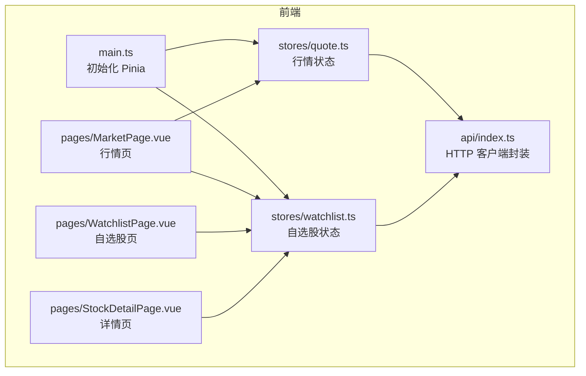
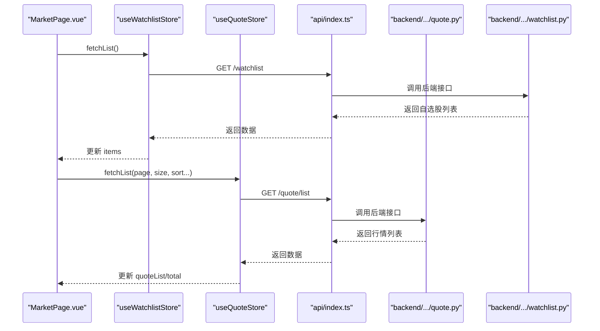
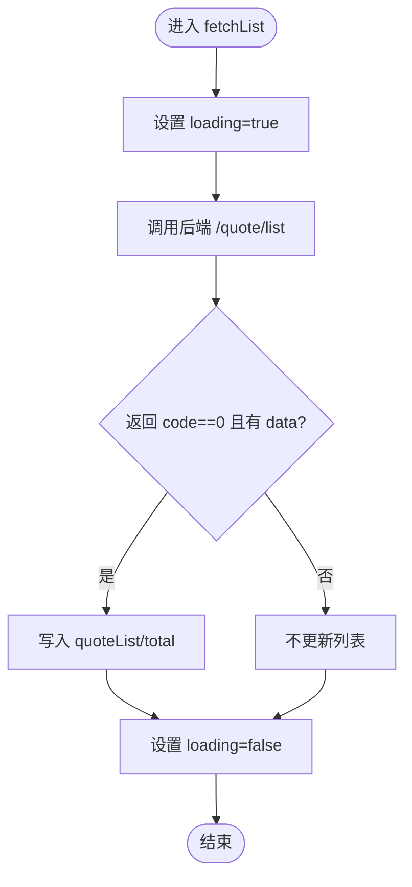
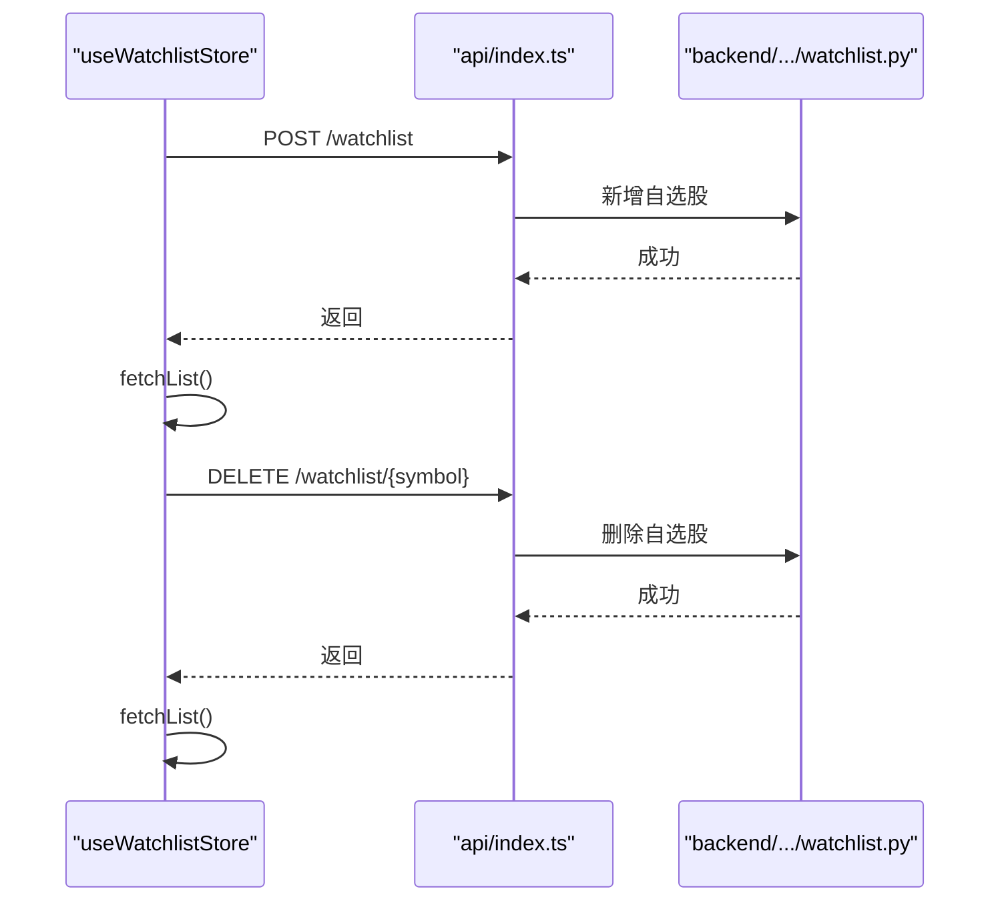
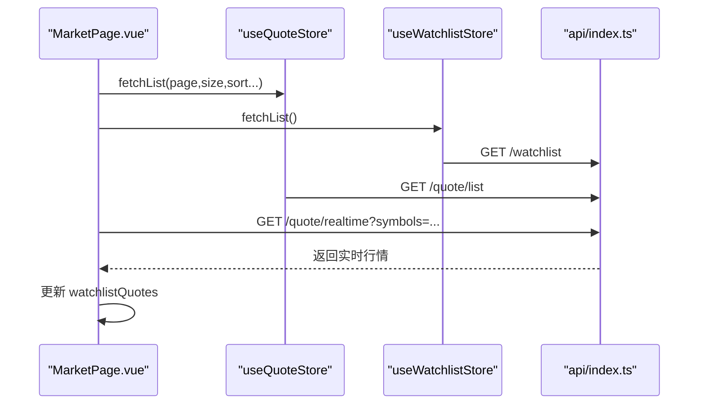
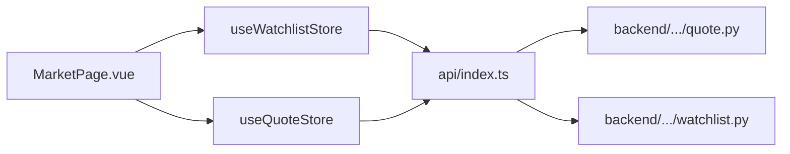

# 状态管理

<cite>
**本文引用的文件**
- [frontend/src/stores/quote.ts](file://frontend/src/stores/quote.ts)
- [frontend/src/stores/watchlist.ts](file://frontend/src/stores/watchlist.ts)
- [frontend/src/api/index.ts](file://frontend/src/api/index.ts)
- [frontend/src/main.ts](file://frontend/src/main.ts)
- [frontend/src/pages/MarketPage.vue](file://frontend/src/pages/MarketPage.vue)
- [frontend/src/pages/WatchlistPage.vue](file://frontend/src/pages/WatchlistPage.vue)
- [frontend/src/pages/StockDetailPage.vue](file://frontend/src/pages/StockDetailPage.vue)
- [backend/app/api/v1/quote.py](file://backend/app/api/v1/quote.py)
- [backend/app/api/v1/watchlist.py](file://backend/app/api/v1/watchlist.py)
</cite>

## 目录
1. [引言](#引言)
2. [项目结构](#项目结构)
3. [核心组件](#核心组件)
4. [架构总览](#架构总览)
5. [详细组件分析](#详细组件分析)
6. [依赖分析](#依赖分析)
7. [性能考虑](#性能考虑)
8. [故障排查指南](#故障排查指南)
9. [结论](#结论)
10. [附录](#附录)

## 引言
本文件系统性梳理 Stock-View 前端的状态管理体系，围绕 Pinia 架构与使用模式，深入解析行情状态管理（quote store）与自选股状态管理（watchlist store）的设计与实现，覆盖实时数据缓存、数据更新机制、状态同步策略、与后端 API 的集成方式、异步操作处理以及跨组件状态共享方案，并给出最佳实践与性能优化建议。

## 项目结构
前端采用 Vue 3 + TypeScript + Pinia 架构，状态管理位于 stores 目录；API 封装在 api 目录；页面组件位于 pages 目录；应用入口在 main.ts 中初始化 Pinia 并挂载应用。

图表来源
- [frontend/src/main.ts:1-12](file://frontend/src/main.ts#L1-L12)
- [frontend/src/stores/quote.ts:1-43](file://frontend/src/stores/quote.ts#L1-L43)
- [frontend/src/stores/watchlist.ts:1-36](file://frontend/src/stores/watchlist.ts#L1-L36)
- [frontend/src/api/index.ts:1-33](file://frontend/src/api/index.ts#L1-L33)
- [frontend/src/pages/MarketPage.vue:128-222](file://frontend/src/pages/MarketPage.vue#L128-L222)
- [frontend/src/pages/WatchlistPage.vue:36-68](file://frontend/src/pages/WatchlistPage.vue#L36-L68)
- [frontend/src/pages/StockDetailPage.vue:77-217](file://frontend/src/pages/StockDetailPage.vue#L77-L217)

章节来源
- [frontend/src/main.ts:1-12](file://frontend/src/main.ts#L1-L12)

## 核心组件
- 行情状态（quote store）
  - 状态：行情列表、当前行情、加载状态、总数
  - 行为：分页获取行情列表、批量获取实时行情、按符号更新行情
- 自选股状态（watchlist store）
  - 状态：自选股列表、加载状态
  - 行为：获取列表、添加、删除、判断是否已关注

章节来源
- [frontend/src/stores/quote.ts:5-42](file://frontend/src/stores/quote.ts#L5-L42)
- [frontend/src/stores/watchlist.ts:5-35](file://frontend/src/stores/watchlist.ts#L5-L35)

## 架构总览
前端通过 Pinia Store 维护全局状态，页面组件通过组合式 API 使用 store 实例，API 层以 axios 封装统一请求，后端提供行情与自选股接口。

图表来源
- [frontend/src/pages/MarketPage.vue:188-191](file://frontend/src/pages/MarketPage.vue#L188-L191)
- [frontend/src/stores/quote.ts:11-22](file://frontend/src/stores/quote.ts#L11-L22)
- [frontend/src/stores/watchlist.ts:9-19](file://frontend/src/stores/watchlist.ts#L9-L19)
- [frontend/src/api/index.ts:8-14](file://frontend/src/api/index.ts#L8-L14)
- [backend/app/api/v1/quote.py:19-33](file://backend/app/api/v1/quote.py#L19-L33)
- [backend/app/api/v1/watchlist.py:13-26](file://backend/app/api/v1/watchlist.py#L13-L26)

## 详细组件分析

### 行情状态管理（quote store）
- 数据结构与复杂度
  - quoteList：数组，用于展示行情表格；分页加载，时间复杂度 O(n) 遍历查找符号索引
  - currentQuote：单条行情快照，读取 O(1)，更新 O(1)
  - loading/total：布尔与整数状态，O(1) 访问
- 更新机制
  - 分页列表：调用后端接口获取列表，成功后写入列表与总数
  - 实时行情：批量查询多个符号，返回映射后的数组
  - 单条更新：根据符号在列表中定位并合并新字段，同时同步当前选中项
- 状态同步策略
  - 列表与当前项分别维护，避免不必要的响应式开销
  - 批量更新通过对象合并减少数组重建成本
- 错误处理
  - 列表加载通过 try/finally 控制 loading 状态，保证 UI 不卡死
  - 实时接口失败时返回空数组，调用方需做空值判断

图表来源
- [frontend/src/stores/quote.ts:11-22](file://frontend/src/stores/quote.ts#L11-L22)

章节来源
- [frontend/src/stores/quote.ts:5-42](file://frontend/src/stores/quote.ts#L5-L42)

### 自选股状态管理（watchlist store）
- 数据结构与复杂度
  - items：数组，增删改查均基于数组遍历，时间复杂度 O(n)
- 功能与流程
  - 获取列表：拉取后端自选股列表，成功则写入 items
  - 添加/删除：调用后端接口，成功后重新拉取列表保持一致性
  - 判断是否已关注：线性查找，O(n)
- 状态同步策略
  - 写入后端即刻刷新本地列表，确保前后端一致
- 错误处理
  - 加载过程设置 loading，finally 清理，避免 UI 堵塞

图表来源
- [frontend/src/stores/watchlist.ts:21-29](file://frontend/src/stores/watchlist.ts#L21-L29)
- [frontend/src/api/index.ts:20-25](file://frontend/src/api/index.ts#L20-L25)
- [backend/app/api/v1/watchlist.py:29-51](file://backend/app/api/v1/watchlist.py#L29-L51)

章节来源
- [frontend/src/stores/watchlist.ts:5-35](file://frontend/src/stores/watchlist.ts#L5-L35)

### 页面与状态的交互
- MarketPage.vue
  - 初始化定时器，周期性触发行情列表与自选股实时行情刷新
  - 使用 quoteStore 和 watchlistStore 的方法与状态
- WatchlistPage.vue
  - 加载自选股列表并批量获取实时行情，渲染表格
- StockDetailPage.vue
  - 加载单只股票实时行情、盘口、K线；定时刷新；支持加入/移出自选股

图表来源
- [frontend/src/pages/MarketPage.vue:188-217](file://frontend/src/pages/MarketPage.vue#L188-L217)
- [frontend/src/stores/quote.ts:11-22](file://frontend/src/stores/quote.ts#L11-L22)
- [frontend/src/stores/watchlist.ts:9-19](file://frontend/src/stores/watchlist.ts#L9-L19)
- [frontend/src/api/index.ts:8-14](file://frontend/src/api/index.ts#L8-L14)

章节来源
- [frontend/src/pages/MarketPage.vue:128-222](file://frontend/src/pages/MarketPage.vue#L128-L222)
- [frontend/src/pages/WatchlistPage.vue:36-68](file://frontend/src/pages/WatchlistPage.vue#L36-L68)
- [frontend/src/pages/StockDetailPage.vue:77-217](file://frontend/src/pages/StockDetailPage.vue#L77-L217)

## 依赖分析
- 前端依赖
  - main.ts 注入 Pinia，使各 store 可用
  - pages 依赖 stores 与 api
  - stores 依赖 api
- 后端依赖
  - quote.py 提供实时、列表、K线、分时、盘口接口
  - watchlist.py 提供自选股增删改查与排序接口

图表来源
- [frontend/src/main.ts:8-9](file://frontend/src/main.ts#L8-L9)
- [frontend/src/pages/MarketPage.vue:131-137](file://frontend/src/pages/MarketPage.vue#L131-L137)
- [frontend/src/stores/quote.ts:1-3](file://frontend/src/stores/quote.ts#L1-L3)
- [frontend/src/stores/watchlist.ts:1-3](file://frontend/src/stores/watchlist.ts#L1-L3)
- [frontend/src/api/index.ts:1-33](file://frontend/src/api/index.ts#L1-L33)
- [backend/app/api/v1/quote.py:1-65](file://backend/app/api/v1/quote.py#L1-L65)
- [backend/app/api/v1/watchlist.py:1-77](file://backend/app/api/v1/watchlist.py#L1-L77)

章节来源
- [frontend/src/main.ts:1-12](file://frontend/src/main.ts#L1-L12)
- [backend/app/api/v1/quote.py:1-65](file://backend/app/api/v1/quote.py#L1-L65)
- [backend/app/api/v1/watchlist.py:1-77](file://backend/app/api/v1/watchlist.py#L1-L77)

## 性能考虑
- 列表分页与批量实时
  - 使用分页参数控制每次请求规模，降低首屏与滚动压力
  - 批量实时接口一次请求多只股票，减少网络往返
- 定时刷新策略
  - MarketPage 与 StockDetailPage 设置定时器定期刷新，注意在组件卸载时清理，避免内存泄漏
- 响应式更新
  - 对象合并更新单条记录，避免重建整个数组，降低渲染成本
- 缓存与去抖
  - 在高频刷新场景下，可引入去抖/节流策略，避免重复请求
- 图表渲染
  - ECharts 初始化一次，切换周期时仅更新配置，避免重复初始化带来的开销

## 故障排查指南
- 状态未更新
  - 检查后端返回 code 是否为 0，前端仅在成功时写入状态
  - 确认 fetchList 后是否再次调用 fetchList 以保持前后端一致
- 定时器泄漏
  - 在组件卸载钩子中清理定时器，确保内存释放
- 实时数据为空
  - 检查 symbols 参数是否正确拼接，后端限制最多 50 只
- 自选股添加失败
  - 检查重复添加逻辑与数据库约束，确认新增后立即刷新列表

章节来源
- [frontend/src/stores/quote.ts:11-22](file://frontend/src/stores/quote.ts#L11-L22)
- [frontend/src/stores/watchlist.ts:21-29](file://frontend/src/stores/watchlist.ts#L21-L29)
- [frontend/src/pages/MarketPage.vue:210-221](file://frontend/src/pages/MarketPage.vue#L210-L221)
- [frontend/src/pages/StockDetailPage.vue:213-216](file://frontend/src/pages/StockDetailPage.vue#L213-L216)
- [backend/app/api/v1/quote.py:8-16](file://backend/app/api/v1/quote.py#L8-L16)
- [backend/app/api/v1/watchlist.py:29-51](file://backend/app/api/v1/watchlist.py#L29-L51)

## 结论
本项目采用 Pinia 管理全局状态，结合后端 REST 接口实现行情与自选股的数据闭环。通过分页列表、批量实时、定时刷新与对象合并更新等策略，兼顾了性能与用户体验。建议在高频刷新场景引入去抖/节流与更细粒度的缓存策略，进一步提升稳定性与响应速度。

## 附录
- 最佳实践清单
  - 状态设计原则：单一职责、扁平化、可序列化
  - Action 组织：按领域拆分（如行情、自选股），避免跨域副作用
  - Getter 使用：将派生状态抽象为 getter，减少模板中的计算逻辑
  - 状态重置：提供 reset 方法或在路由切换时清理临时状态
  - 调试工具：使用浏览器插件观察 Pinia 状态变更；在 store 中打印关键路径
  - 性能优化：批量请求、对象合并、定时器清理、图表懒初始化
  - 跨组件共享：通过 store 共享状态，避免深层 props 传递与事件风暴