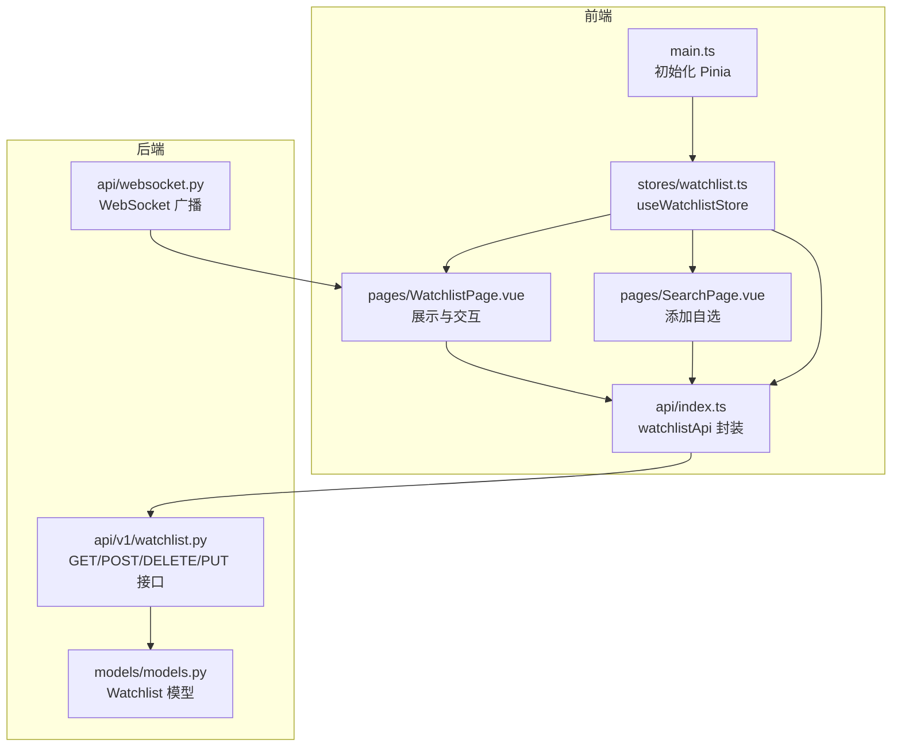
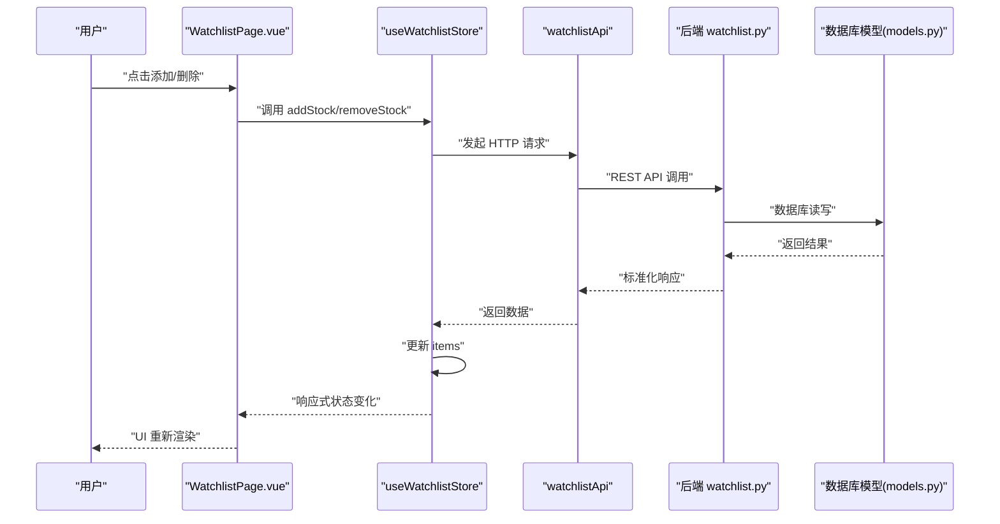
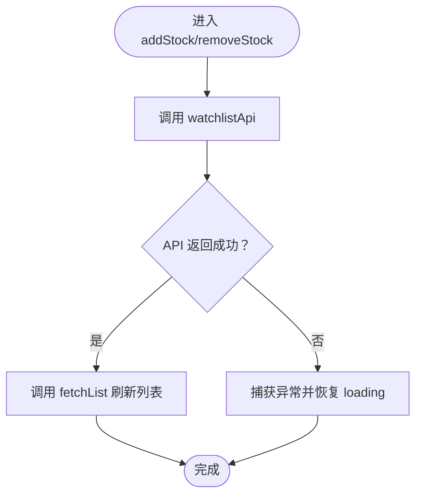
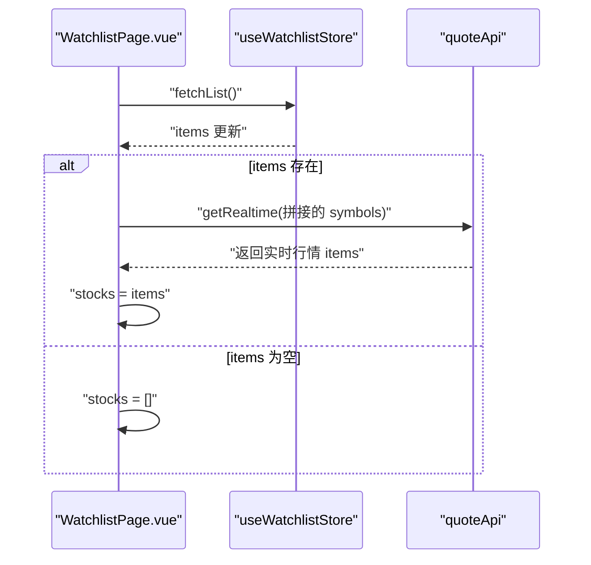
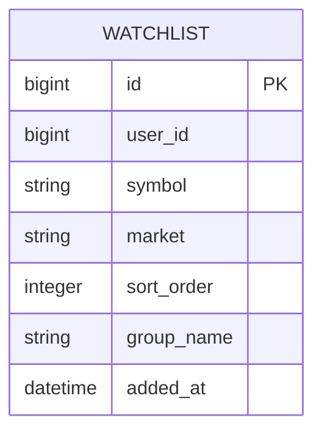
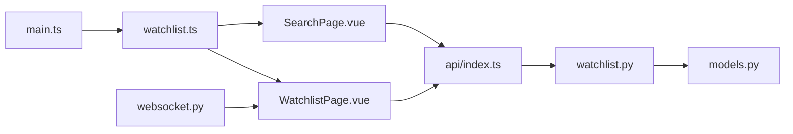

# 自选股状态管理

<cite>
**本文引用的文件**
- [frontend/src/stores/watchlist.ts](file://frontend/src/stores/watchlist.ts)
- [frontend/src/api/index.ts](file://frontend/src/api/index.ts)
- [frontend/src/pages/WatchlistPage.vue](file://frontend/src/pages/WatchlistPage.vue)
- [frontend/src/pages/SearchPage.vue](file://frontend/src/pages/SearchPage.vue)
- [backend/app/api/v1/watchlist.py](file://backend/app/api/v1/watchlist.py)
- [backend/app/models/models.py](file://backend/app/models/models.py)
- [backend/app/api/websocket.py](file://backend/app/api/websocket.py)
- [frontend/src/main.ts](file://frontend/src/main.ts)
</cite>

## 目录
1. [简介](#简介)
2. [项目结构](#项目结构)
3. [核心组件](#核心组件)
4. [架构总览](#架构总览)
5. [详细组件分析](#详细组件分析)
6. [依赖关系分析](#依赖关系分析)
7. [性能考虑](#性能考虑)
8. [故障排查指南](#故障排查指南)
9. [结论](#结论)
10. [附录](#附录)

## 简介
本文件聚焦于 Stock-View 前端的“自选股状态管理”（Watchlist Store），系统性阐述以下主题：
- useWatchlistStore 的核心职责：自选股列表管理、添加/删除操作、加载状态控制
- 本地存储机制：搜索历史的 localStorage 使用现状与可扩展点
- 持久化策略：后端数据库模型与接口设计、去重与排序逻辑
- 操作实现细节：addStock、removeStock 的数据处理、状态同步与错误处理
- 与行情系统的集成：实时价格更新、数据关联与 UI 响应
- 设计模式：响应式数据绑定、计算属性使用建议、状态重置策略
- 性能优化技巧、数据迁移方案与错误恢复机制

## 项目结构
围绕自选股状态管理的关键文件组织如下：
- 前端状态层：Pinia Store（watchlist.ts）
- 前端 API 层：统一 API 导出（index.ts）
- 前端页面层：自选股页（WatchlistPage.vue）、搜索页（SearchPage.vue）
- 后端接口层：自选股 API（watchlist.py）
- 后端模型层：数据库模型（models.py）
- 实时推送层：WebSocket（websocket.py）
- 应用入口：Pinia 初始化（main.ts）

图表来源
- [frontend/src/main.ts:1-12](file://frontend/src/main.ts#L1-L12)
- [frontend/src/stores/watchlist.ts:1-36](file://frontend/src/stores/watchlist.ts#L1-L36)
- [frontend/src/pages/WatchlistPage.vue:1-262](file://frontend/src/pages/WatchlistPage.vue#L1-L262)
- [frontend/src/pages/SearchPage.vue:1-355](file://frontend/src/pages/SearchPage.vue#L1-L355)
- [frontend/src/api/index.ts:1-33](file://frontend/src/api/index.ts#L1-L33)
- [backend/app/api/v1/watchlist.py:1-77](file://backend/app/api/v1/watchlist.py#L1-L77)
- [backend/app/models/models.py:50-60](file://backend/app/models/models.py#L50-L60)
- [backend/app/api/websocket.py:39-79](file://backend/app/api/websocket.py#L39-L79)

章节来源
- [frontend/src/main.ts:1-12](file://frontend/src/main.ts#L1-L12)
- [frontend/src/stores/watchlist.ts:1-36](file://frontend/src/stores/watchlist.ts#L1-L36)
- [frontend/src/api/index.ts:1-33](file://frontend/src/api/index.ts#L1-L33)
- [frontend/src/pages/WatchlistPage.vue:1-262](file://frontend/src/pages/WatchlistPage.vue#L1-L262)
- [frontend/src/pages/SearchPage.vue:1-355](file://frontend/src/pages/SearchPage.vue#L1-L355)
- [backend/app/api/v1/watchlist.py:1-77](file://backend/app/api/v1/watchlist.py#L1-L77)
- [backend/app/models/models.py:50-60](file://backend/app/models/models.py#L50-L60)
- [backend/app/api/websocket.py:39-79](file://backend/app/api/websocket.py#L39-L79)

## 核心组件
- useWatchlistStore（Pinia Store）
  - 状态：items（自选股数组）、loading（加载状态）
  - 方法：fetchList（拉取列表）、addStock（添加）、removeStock（删除）、isWatched（是否已关注）
- API 层（watchlistApi）
  - getList、add、remove、sort（排序）
- 页面层
  - WatchlistPage：渲染自选股卡片、空态、删除交互、调用 watchlistStore.fetchList
  - SearchPage：搜索结果展示、添加到自选、调用 watchlistStore.fetchList

章节来源
- [frontend/src/stores/watchlist.ts:5-36](file://frontend/src/stores/watchlist.ts#L5-L36)
- [frontend/src/api/index.ts:20-25](file://frontend/src/api/index.ts#L20-L25)
- [frontend/src/pages/WatchlistPage.vue:64-103](file://frontend/src/pages/WatchlistPage.vue#L64-L103)
- [frontend/src/pages/SearchPage.vue:70-140](file://frontend/src/pages/SearchPage.vue#L70-L140)

## 架构总览
自选股状态管理采用“前端 Store + 后端 REST API”的分层设计，结合后端 WebSocket 实现实时行情推送。整体流程：
- 用户在 WatchlistPage 或 SearchPage 触发添加/删除操作
- Store 调用 watchlistApi 发起 HTTP 请求
- 后端接口对数据库进行增删改查，并返回标准化响应
- 前端 Store 更新 items，页面重新渲染
- WebSocket 广播行情更新，由 quoteStore 统一维护实时数据

图表来源
- [frontend/src/pages/WatchlistPage.vue:83-102](file://frontend/src/pages/WatchlistPage.vue#L83-L102)
- [frontend/src/pages/SearchPage.vue:123-128](file://frontend/src/pages/SearchPage.vue#L123-L128)
- [frontend/src/stores/watchlist.ts:21-29](file://frontend/src/stores/watchlist.ts#L21-L29)
- [frontend/src/api/index.ts:20-25](file://frontend/src/api/index.ts#L20-L25)
- [backend/app/api/v1/watchlist.py:13-61](file://backend/app/api/v1/watchlist.py#L13-L61)
- [backend/app/models/models.py:50-60](file://backend/app/models/models.py#L50-L60)

## 详细组件分析

### useWatchlistStore（自选股 Store）
- 状态
  - items：当前用户的自选股列表（数组）
  - loading：请求加载状态
- 方法
  - fetchList：调用 getList，成功后将后端返回的 items 赋值给 items；失败时捕获异常并恢复 loading
  - addStock：调用 add，成功后立即刷新列表
  - removeStock：调用 remove，成功后刷新列表
  - isWatched：基于 items.symbol 判断某只股票是否已关注
- 设计要点
  - 使用 ref 包裹响应式状态，确保与 Vue 模板联动
  - fetchList 中 loading 的显式开关，避免 UI 误判
  - addStock/removeStock 在成功后统一 fetchList，保证前后端一致

图表来源
- [frontend/src/stores/watchlist.ts:21-29](file://frontend/src/stores/watchlist.ts#L21-L29)
- [frontend/src/stores/watchlist.ts:9-19](file://frontend/src/stores/watchlist.ts#L9-L19)

章节来源
- [frontend/src/stores/watchlist.ts:5-36](file://frontend/src/stores/watchlist.ts#L5-L36)

### API 层（watchlistApi）
- 提供 getList、add、remove、sort 四个方法，封装 /api/v1/watchlist 相关接口
- 与后端 watchlist.py 对应，遵循统一的 code/message/data 结构

章节来源
- [frontend/src/api/index.ts:20-25](file://frontend/src/api/index.ts#L20-L25)

### WatchlistPage（自选股页面）
- 渲染自选股卡片，支持点击跳转详情、删除按钮
- 首次挂载时调用 watchlistStore.fetchList，随后根据 items 拉取实时行情并填充 stocks
- 删除后本地移除对应项并提示成功

图表来源
- [frontend/src/pages/WatchlistPage.vue:83-94](file://frontend/src/pages/WatchlistPage.vue#L83-L94)
- [frontend/src/api/index.ts:8-14](file://frontend/src/api/index.ts#L8-L14)

章节来源
- [frontend/src/pages/WatchlistPage.vue:64-103](file://frontend/src/pages/WatchlistPage.vue#L64-L103)

### SearchPage（搜索页）
- 支持关键词搜索、显示搜索历史与热门股票
- 添加到自选时，自动推断市场并调用 watchlistApi.add，随后刷新自选股列表

章节来源
- [frontend/src/pages/SearchPage.vue:70-140](file://frontend/src/pages/SearchPage.vue#L70-L140)

### 后端接口与模型（watchlist.py 与 models.py）
- GET /watchlist：按用户 ID 查询自选股，按 sort_order 升序返回
- POST /watchlist：添加自选股前检查重复；若不存在则分配下一个 sort_order
- DELETE /watchlist/{symbol}：按用户 ID 和 symbol 删除
- PUT /watchlist/sort：批量更新排序
- 数据模型 Watchlist：包含 user_id、symbol、market、sort_order 等字段

图表来源
- [backend/app/models/models.py:50-60](file://backend/app/models/models.py#L50-L60)

章节来源
- [backend/app/api/v1/watchlist.py:13-61](file://backend/app/api/v1/watchlist.py#L13-L61)
- [backend/app/models/models.py:50-60](file://backend/app/models/models.py#L50-L60)

### 与行情系统的集成（WebSocket）
- 后端 WebSocket /ws/quote 支持订阅/取消订阅与心跳
- 当行情更新时，后端广播 quote 类型消息
- 前端通过 WebSocket composable（见开发文档）接收并调用 quoteStore.updateQuote 更新实时数据

章节来源
- [backend/app/api/websocket.py:39-79](file://backend/app/api/websocket.py#L39-L79)
- [开发文档.md:1814-1870](file://Stock-View 软件开发文档/开发文档.md#L1814-L1870)

## 依赖关系分析
- 前端
  - main.ts 注册 Pinia，使 useWatchlistStore 可用
  - WatchlistPage 与 SearchPage 依赖 useWatchlistStore 与 watchlistApi
  - quoteApi 用于实时行情拉取
- 后端
  - watchlist.py 依赖 models.py 的 Watchlist 模型
  - WebSocket 服务负责行情广播

图表来源
- [frontend/src/main.ts:1-12](file://frontend/src/main.ts#L1-L12)
- [frontend/src/stores/watchlist.ts:1-36](file://frontend/src/stores/watchlist.ts#L1-L36)
- [frontend/src/pages/WatchlistPage.vue:1-262](file://frontend/src/pages/WatchlistPage.vue#L1-L262)
- [frontend/src/pages/SearchPage.vue:1-355](file://frontend/src/pages/SearchPage.vue#L1-L355)
- [frontend/src/api/index.ts:1-33](file://frontend/src/api/index.ts#L1-L33)
- [backend/app/api/v1/watchlist.py:1-77](file://backend/app/api/v1/watchlist.py#L1-L77)
- [backend/app/models/models.py:50-60](file://backend/app/models/models.py#L50-L60)
- [backend/app/api/websocket.py:39-79](file://backend/app/api/websocket.py#L39-L79)

章节来源
- [frontend/src/main.ts:1-12](file://frontend/src/main.ts#L1-L12)
- [frontend/src/stores/watchlist.ts:1-36](file://frontend/src/stores/watchlist.ts#L1-L36)
- [frontend/src/api/index.ts:1-33](file://frontend/src/api/index.ts#L1-L33)
- [frontend/src/pages/WatchlistPage.vue:1-262](file://frontend/src/pages/WatchlistPage.vue#L1-L262)
- [frontend/src/pages/SearchPage.vue:1-355](file://frontend/src/pages/SearchPage.vue#L1-L355)
- [backend/app/api/v1/watchlist.py:1-77](file://backend/app/api/v1/watchlist.py#L1-L77)
- [backend/app/models/models.py:50-60](file://backend/app/models/models.py#L50-L60)
- [backend/app/api/websocket.py:39-79](file://backend/app/api/websocket.py#L39-L79)

## 性能考虑
- 列表加载
  - fetchList 中 loading 控制，避免重复请求与闪烁
  - WatchlistPage 首屏仅在 items 非空时批量拉取实时行情，减少不必要的网络请求
- 批量请求
  - WatchlistPage 将 items.symbol 拼接为逗号分隔字符串一次性请求，降低请求数量
- 去重与幂等
  - 后端在添加自选股前检查重复，避免数据库冗余
- 排序
  - 新增自选股时分配下一个 sort_order，保持稳定顺序
- WebSocket 实时更新
  - 通过订阅机制仅推送关注的股票，降低带宽与 CPU 开销

章节来源
- [frontend/src/pages/WatchlistPage.vue:83-94](file://frontend/src/pages/WatchlistPage.vue#L83-L94)
- [backend/app/api/v1/watchlist.py:29-51](file://backend/app/api/v1/watchlist.py#L29-L51)

## 故障排查指南
- 添加自选股失败
  - 检查 watchlistApi.add 的返回码与 message，确认是否因重复添加导致
  - 确认后端去重逻辑与 sort_order 分配
- 删除自选股无效
  - 确认 removeStock 是否正确调用并触发 fetchList
  - 检查 WatchlistPage 删除后的本地过滤逻辑
- 列表为空但仍有加载态
  - 确认 fetchList 的 finally 分支是否正确恢复 loading
- 实时行情不更新
  - 检查 WebSocket 连接状态与订阅列表
  - 确认 quoteStore.updateQuote 是否被调用

章节来源
- [frontend/src/stores/watchlist.ts:9-19](file://frontend/src/stores/watchlist.ts#L9-L19)
- [frontend/src/pages/WatchlistPage.vue:96-100](file://frontend/src/pages/WatchlistPage.vue#L96-L100)
- [backend/app/api/v1/watchlist.py:29-61](file://backend/app/api/v1/watchlist.py#L29-L61)
- [开发文档.md:1814-1870](file://Stock-View 软件开发文档/开发文档.md#L1814-L1870)

## 结论
- useWatchlistStore 以简洁的响应式状态与明确的方法边界实现了自选股的增删查控
- 前后端配合完善：后端提供去重与排序保障，前端负责 UI 呈现与实时数据联动
- 当前未发现本地持久化（localStorage）直接用于 watchlist 的实现，但 SearchPage 使用 localStorage 存储搜索历史，可作为扩展参考
- 建议后续增强点：本地缓存策略、批量排序接口的前端调用、错误重试与降级策略

## 附录
- 数据迁移方案建议
  - 若需引入本地 watchlist 缓存，可在初始化时读取 localStorage 并与后端数据合并，冲突时以后端为准
  - 迁移完成后逐步清理旧缓存键
- 错误恢复机制
  - addStock/removeStock 失败时回滚 UI 状态或提示用户重试
  - fetchList 失败时保留上次有效 items，避免清空造成用户困惑