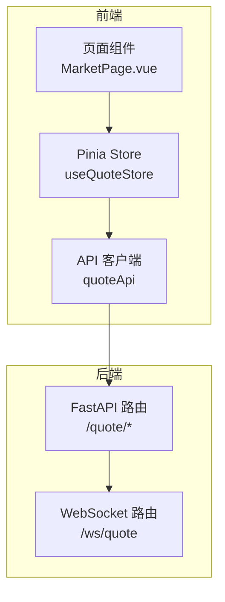
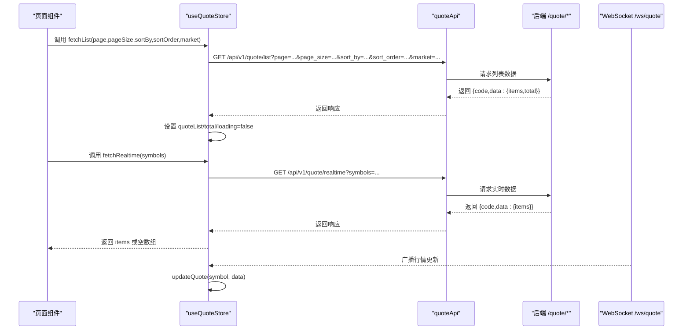
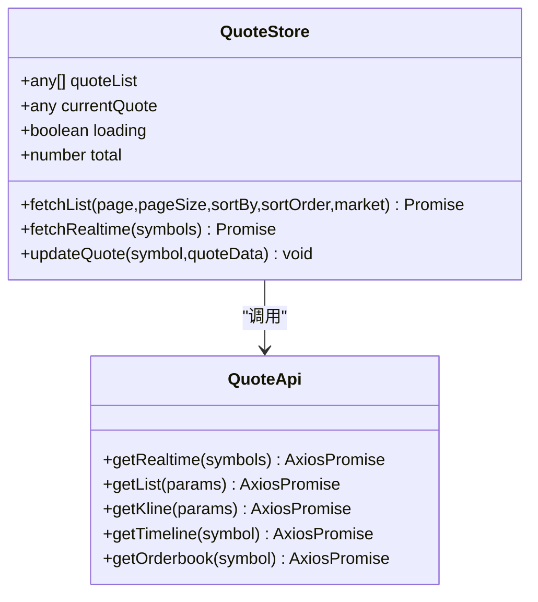
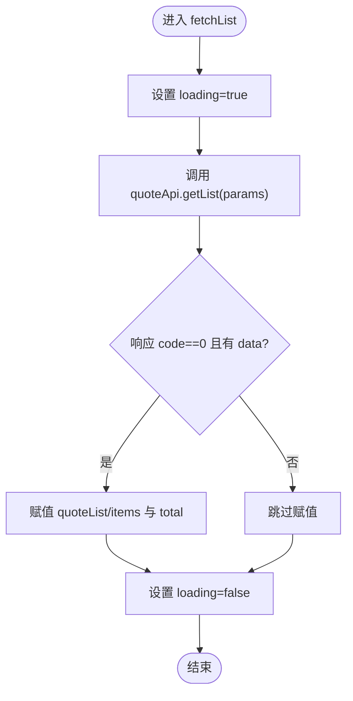
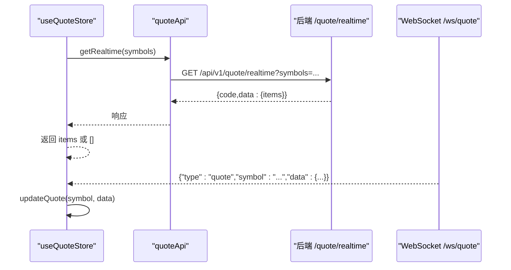
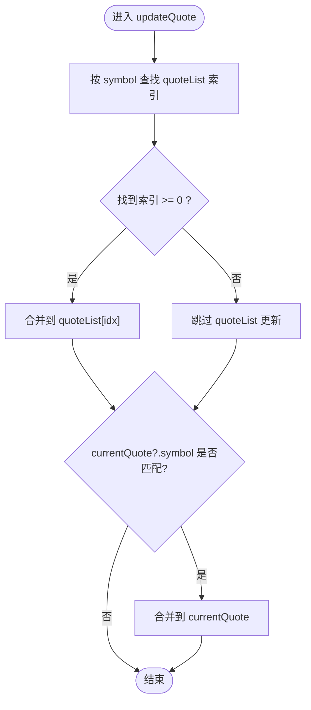

# 行情状态管理

<cite>
**本文引用的文件**
- [frontend/src/stores/quote.ts](file://frontend/src/stores/quote.ts)
- [frontend/src/api/index.ts](file://frontend/src/api/index.ts)
- [backend/app/api/v1/quote.py](file://backend/app/api/v1/quote.py)
- [backend/app/api/websocket.py](file://backend/app/api/websocket.py)
- [frontend/src/pages/MarketPage.vue](file://frontend/src/pages/MarketPage.vue)
</cite>

## 目录
1. [简介](#简介)
2. [项目结构](#项目结构)
3. [核心组件](#核心组件)
4. [架构总览](#架构总览)
5. [详细组件分析](#详细组件分析)
6. [依赖分析](#依赖分析)
7. [性能考虑](#性能考虑)
8. [故障排查指南](#故障排查指南)
9. [结论](#结论)
10. [附录](#附录)

## 简介
本文件聚焦于前端行情状态管理（Quote Store）的设计与实现，围绕 useQuoteStore 的核心能力进行系统化梳理，包括：
- 实时行情数据缓存机制与分页加载逻辑
- 排序与筛选参数处理
- fetchList 方法的分页参数、loading 状态与数据格式转换
- fetchRealtime 方法的实时数据获取流程与 WebSocket 集成
- updateQuote 的智能更新机制：基于 symbol 的查找、对象合并与双向状态同步（quoteList 与 currentQuote）
- 状态管理最佳实践：缓存策略、内存优化、错误处理
- 使用示例与常见问题解决方案

## 项目结构
前端采用 Pinia 管理状态，后端通过 FastAPI 提供行情接口，并在 WebSocket 中实现行情推送。Quote Store 位于前端，负责维护 quoteList、currentQuote、loading、total 等状态，并通过 quoteApi 与后端交互。

图表来源
- [frontend/src/stores/quote.ts:1-43](file://frontend/src/stores/quote.ts#L1-L43)
- [frontend/src/api/index.ts:1-33](file://frontend/src/api/index.ts#L1-L33)
- [backend/app/api/v1/quote.py:1-65](file://backend/app/api/v1/quote.py#L1-L65)
- [backend/app/api/websocket.py:1-79](file://backend/app/api/websocket.py#L1-L79)

章节来源
- [frontend/src/stores/quote.ts:1-43](file://frontend/src/stores/quote.ts#L1-L43)
- [frontend/src/api/index.ts:1-33](file://frontend/src/api/index.ts#L1-L33)
- [backend/app/api/v1/quote.py:1-65](file://backend/app/api/v1/quote.py#L1-L65)
- [backend/app/api/websocket.py:1-79](file://backend/app/api/websocket.py#L1-L79)

## 核心组件
- useQuoteStore：定义 quoteList、currentQuote、loading、total 状态，提供 fetchList、fetchRealtime、updateQuote 三个核心方法。
- quoteApi：封装 /api/v1 前缀下的行情相关接口调用。
- 后端路由：/quote/realtime、/quote/list、/quote/kline、/quote/timeline、/quote/orderbook。
- WebSocket：/ws/quote，支持订阅/退订与心跳 ping/pong，用于实时行情广播。

章节来源
- [frontend/src/stores/quote.ts:1-43](file://frontend/src/stores/quote.ts#L1-L43)
- [frontend/src/api/index.ts:1-33](file://frontend/src/api/index.ts#L1-L33)
- [backend/app/api/v1/quote.py:1-65](file://backend/app/api/v1/quote.py#L1-L65)
- [backend/app/api/websocket.py:1-79](file://backend/app/api/websocket.py#L1-L79)

## 架构总览
前端通过 useQuoteStore 统一管理行情数据；分页列表通过 fetchList 获取，实时数据通过 fetchRealtime 获取；后端提供 REST 接口与 WebSocket 广播通道。页面组件通过 Pinia 访问状态与方法，实现列表渲染与交互。

图表来源
- [frontend/src/stores/quote.ts:11-30](file://frontend/src/stores/quote.ts#L11-L30)
- [frontend/src/api/index.ts:8-14](file://frontend/src/api/index.ts#L8-L14)
- [backend/app/api/v1/quote.py:19-33](file://backend/app/api/v1/quote.py#L19-L33)
- [backend/app/api/websocket.py:39-79](file://backend/app/api/websocket.py#L39-L79)

## 详细组件分析

### useQuoteStore：状态与方法
- 状态
  - quoteList：当前分页列表数据
  - currentQuote：当前选中股票的实时数据
  - loading：请求中的加载状态
  - total：列表总数
- 方法
  - fetchList：分页获取列表，处理分页参数、loading 状态与数据格式转换
  - fetchRealtime：获取实时数据，返回 items 数组
  - updateQuote：按 symbol 智能更新，合并到 quoteList 与 currentQuote

图表来源
- [frontend/src/stores/quote.ts:5-42](file://frontend/src/stores/quote.ts#L5-L42)
- [frontend/src/api/index.ts:8-18](file://frontend/src/api/index.ts#L8-L18)

章节来源
- [frontend/src/stores/quote.ts:5-42](file://frontend/src/stores/quote.ts#L5-L42)
- [frontend/src/api/index.ts:8-18](file://frontend/src/api/index.ts#L8-L18)

### 分页加载逻辑与参数处理（fetchList）
- 参数处理
  - page：默认 1，最小 1
  - page_size：默认 20，范围 1..100
  - sort_by：默认 change_pct
  - sort_order：默认 desc，可选 asc/desc
  - market：默认 all，可选 sh/sz
- 流程
  - 设置 loading=true
  - 调用 quoteApi.getList，传入上述参数
  - 若响应 code 为 0 且存在 data，则写入 quoteList 与 total
  - finally 中设置 loading=false
- 数据格式转换
  - 将 data.data.items 赋给 quoteList
  - 将 data.data.total 赋给 total

图表来源
- [frontend/src/stores/quote.ts:11-22](file://frontend/src/stores/quote.ts#L11-L22)
- [frontend/src/api/index.ts:10](file://frontend/src/api/index.ts#L10)
- [backend/app/api/v1/quote.py:19-33](file://backend/app/api/v1/quote.py#L19-L33)

章节来源
- [frontend/src/stores/quote.ts:11-22](file://frontend/src/stores/quote.ts#L11-L22)
- [backend/app/api/v1/quote.py:19-33](file://backend/app/api/v1/quote.py#L19-L33)

### 实时数据获取与 WebSocket 集成（fetchRealtime 与 WebSocket）
- fetchRealtime
  - 调用 quoteApi.getRealtime(symbols)
  - 解析响应，返回 data.data.items 或空数组
- WebSocket
  - 路由 /ws/quote 支持订阅/退订与心跳
  - 广播函数 broadcast_quote_update 将行情更新推送给订阅者
  - 前端可通过 WebSocket 订阅 symbol，接收实时行情消息

图表来源
- [frontend/src/stores/quote.ts:24-30](file://frontend/src/stores/quote.ts#L24-L30)
- [frontend/src/api/index.ts:9](file://frontend/src/api/index.ts#L9)
- [backend/app/api/v1/quote.py:7-16](file://backend/app/api/v1/quote.py#L7-L16)
- [backend/app/api/websocket.py:39-79](file://backend/app/api/websocket.py#L39-L79)

章节来源
- [frontend/src/stores/quote.ts:24-30](file://frontend/src/stores/quote.ts#L24-L30)
- [frontend/src/api/index.ts:9](file://frontend/src/api/index.ts#L9)
- [backend/app/api/v1/quote.py:7-16](file://backend/app/api/v1/quote.py#L7-L16)
- [backend/app/api/websocket.py:39-79](file://backend/app/api/websocket.py#L39-L79)

### 智能更新机制（updateQuote）
- 查找策略：基于 symbol 在 quoteList 中定位索引
- 对象合并：使用对象合并策略更新 quoteList 中对应项
- 双向同步：若 currentQuote 的 symbol 与目标一致，也进行相同合并
- 适用场景：WebSocket 推送或批量刷新后的局部更新

图表来源
- [frontend/src/stores/quote.ts:32-40](file://frontend/src/stores/quote.ts#L32-L40)

章节来源
- [frontend/src/stores/quote.ts:32-40](file://frontend/src/stores/quote.ts#L32-L40)

### 页面使用示例（MarketPage.vue）
- 导入与实例化：在页面中导入并实例化 useQuoteStore
- 列表加载：调用 fetchList 初始化列表，结合分页控件与排序筛选
- 实时刷新：调用 fetchRealtime 获取最新数据，或通过 WebSocket 接收推送
- 当前选择：根据用户点击更新 currentQuote，配合 updateQuote 保持双向同步

章节来源
- [frontend/src/pages/MarketPage.vue:130-135](file://frontend/src/pages/MarketPage.vue#L130-L135)

## 依赖分析
- 前端依赖
  - Pinia：提供状态容器与响应式状态
  - Vue：响应式 ref 与组件生命周期
  - Axios：HTTP 客户端，统一配置 baseURL 与超时
- 后端依赖
  - FastAPI：提供 REST 接口与 WebSocket
  - Redis：连接管理器（在 WebSocket 中用于连接池与订阅管理）

图表来源
- [frontend/src/stores/quote.ts:1-43](file://frontend/src/stores/quote.ts#L1-L43)
- [frontend/src/api/index.ts:1-33](file://frontend/src/api/index.ts#L1-L33)
- [backend/app/api/v1/quote.py:1-65](file://backend/app/api/v1/quote.py#L1-L65)
- [backend/app/api/websocket.py:1-79](file://backend/app/api/websocket.py#L1-L79)

章节来源
- [frontend/src/stores/quote.ts:1-43](file://frontend/src/stores/quote.ts#L1-L43)
- [frontend/src/api/index.ts:1-33](file://frontend/src/api/index.ts#L1-L33)
- [backend/app/api/v1/quote.py:1-65](file://backend/app/api/v1/quote.py#L1-L65)
- [backend/app/api/websocket.py:1-79](file://backend/app/api/websocket.py#L1-L79)

## 性能考虑
- 缓存策略
  - 利用 quoteList 作为本地缓存，避免重复请求相同分页数据
  - currentQuote 作为当前选中项的缓存，减少重复查询
- 内存优化
  - 控制 page_size，避免一次性加载过多数据
  - 使用对象合并而非整对象替换，降低 Vue 响应式系统的重绘成本
- 错误处理
  - fetchList 在 finally 中关闭 loading，确保 UI 不卡死
  - fetchRealtime 返回空数组兜底，保证调用方健壮性
- 实时性
  - WebSocket 订阅仅推送已订阅 symbol 的增量更新，减少网络与渲染压力

## 故障排查指南
- 列表为空或 total 为 0
  - 检查后端 /quote/list 返回 code 是否为 0
  - 确认 page/page_size/市场筛选参数是否合理
- 实时数据为空
  - 检查 /quote/realtime 返回结构与 symbols 参数
  - 确认 WebSocket 是否成功订阅并收到推送
- 加载状态不消失
  - 确保 fetchList 的 finally 正常执行
- 更新不同步
  - 确认 updateQuote 的 symbol 匹配与对象合并逻辑
  - 检查 currentQuote 是否与 quoteList 中对应项指向同一引用

章节来源
- [frontend/src/stores/quote.ts:11-22](file://frontend/src/stores/quote.ts#L11-L22)
- [frontend/src/stores/quote.ts:24-30](file://frontend/src/stores/quote.ts#L24-L30)
- [frontend/src/stores/quote.ts:32-40](file://frontend/src/stores/quote.ts#L32-L40)
- [backend/app/api/v1/quote.py:19-33](file://backend/app/api/v1/quote.py#L19-L33)
- [backend/app/api/websocket.py:39-79](file://backend/app/api/websocket.py#L39-L79)

## 结论
useQuoteStore 通过简洁的状态与方法设计，实现了行情数据的分页加载、实时获取与智能更新。结合后端 REST 与 WebSocket，能够满足列表浏览与实时监控的典型需求。建议在实际使用中关注参数校验、缓存策略与错误兜底，以获得更稳定的用户体验。

## 附录
- 接口一览
  - GET /api/v1/quote/list：分页列表，支持 market、sort_by、sort_order、page、page_size
  - GET /api/v1/quote/realtime：实时行情，支持 symbols（逗号分隔）
  - GET /api/v1/quote/kline：K线，支持 symbol、period、fq_type、limit
  - GET /api/v1/quote/timeline：分时，支持 symbol
  - GET /api/v1/quote/orderbook：盘口，支持 symbol
  - WS /ws/quote：订阅/退订、心跳、行情推送

章节来源
- [frontend/src/api/index.ts:8-18](file://frontend/src/api/index.ts#L8-L18)
- [backend/app/api/v1/quote.py:7-65](file://backend/app/api/v1/quote.py#L7-L65)
- [backend/app/api/websocket.py:39-79](file://backend/app/api/websocket.py#L39-L79)