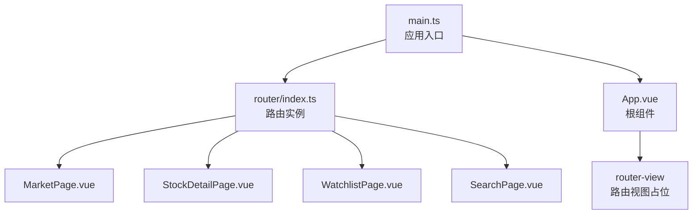
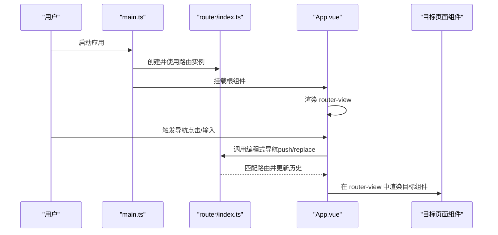
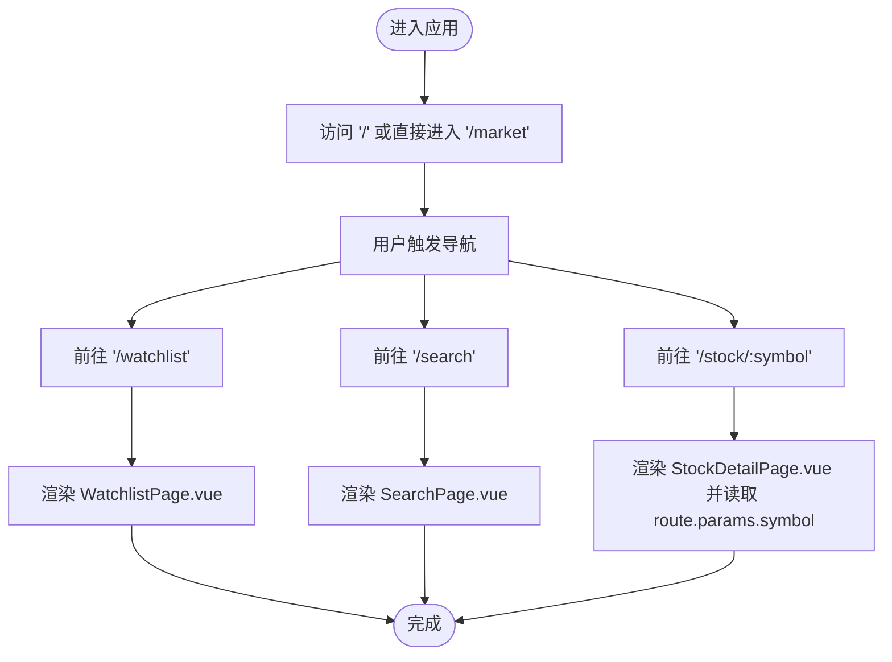
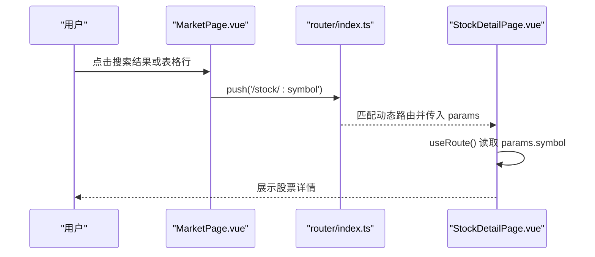
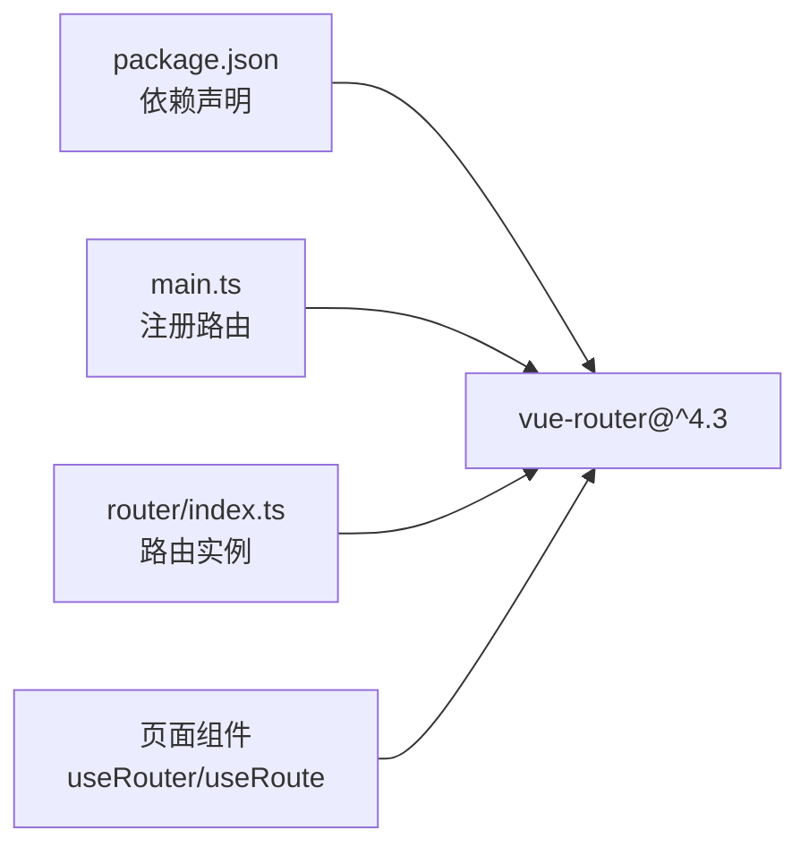

# 路由系统

<cite>
**本文引用的文件**
- [src/router/index.ts](file://frontend/src/router/index.ts)
- [src/main.ts](file://frontend/src/main.ts)
- [src/App.vue](file://frontend/src/App.vue)
- [src/pages/MarketPage.vue](file://frontend/src/pages/MarketPage.vue)
- [src/pages/StockDetailPage.vue](file://frontend/src/pages/StockDetailPage.vue)
- [src/pages/WatchlistPage.vue](file://frontend/src/pages/WatchlistPage.vue)
- [src/pages/SearchPage.vue](file://frontend/src/pages/SearchPage.vue)
- [package.json](file://frontend/package.json)
</cite>

## 目录
1. [简介](#简介)
2. [项目结构](#项目结构)
3. [核心组件](#核心组件)
4. [架构总览](#架构总览)
5. [详细组件分析](#详细组件分析)
6. [依赖分析](#依赖分析)
7. [性能考虑](#性能考虑)
8. [故障排查指南](#故障排查指南)
9. [结论](#结论)
10. [附录](#附录)

## 简介
本文件系统化梳理前端路由系统，围绕 Vue Router 的路由配置、嵌套与动态路由、路由守卫、懒加载与性能优化、参数传递与查询参数处理、路由元信息、导航最佳实践等方面进行深入解析。结合实际代码路径，帮助开发者快速理解并高效使用该路由体系。

## 项目结构
前端采用单页应用（SPA）架构，通过 Vue Router 实现页面级路由切换；应用入口在 main.ts 中挂载路由实例，并在根组件 App.vue 中通过 router-view 渲染当前路由组件。

图表来源
- [src/main.ts:1-12](file://frontend/src/main.ts#L1-L12)
- [src/router/index.ts:1-14](file://frontend/src/router/index.ts#L1-L14)
- [src/App.vue:1-23](file://frontend/src/App.vue#L1-L23)

章节来源
- [src/main.ts:1-12](file://frontend/src/main.ts#L1-L12)
- [src/router/index.ts:1-14](file://frontend/src/router/index.ts#L1-L14)
- [src/App.vue:1-23](file://frontend/src/App.vue#L1-L23)

## 核心组件
- 路由实例：在 router/index.ts 中创建并导出路由实例，包含历史模式与路由表。
- 应用入口：在 main.ts 中注册路由插件，使应用具备路由能力。
- 根组件：App.vue 使用 router-view 占位，承载当前路由组件渲染。
- 页面组件：MarketPage、StockDetailPage、WatchlistPage、SearchPage 作为路由组件，承担业务展示与交互。

章节来源
- [src/router/index.ts:1-14](file://frontend/src/router/index.ts#L1-L14)
- [src/main.ts:1-12](file://frontend/src/main.ts#L1-L12)
- [src/App.vue:1-23](file://frontend/src/App.vue#L1-L23)

## 架构总览
下图展示了从应用启动到路由组件渲染的关键流程，以及页面间导航的典型路径。

图表来源
- [src/main.ts:1-12](file://frontend/src/main.ts#L1-L12)
- [src/router/index.ts:1-14](file://frontend/src/router/index.ts#L1-L14)
- [src/App.vue:1-23](file://frontend/src/App.vue#L1-L23)

## 详细组件分析

### 路由配置与导航
- 历史模式：使用 HTML5 History 模式，支持干净的 URL。
- 路由表：
  - 根路径重定向至市场页；
  - 市场页、自选股页、搜索页均为懒加载组件；
  - 股票详情页为动态路由，参数名为 symbol。
- 导航方式：
  - 模板中使用 router-link 进行声明式导航；
  - 组件内使用 useRouter 获取路由实例，调用 push/replace/back 等方法进行编程式导航；
  - 表格行点击事件触发 push 到股票详情页。

图表来源
- [src/router/index.ts:5-12](file://frontend/src/router/index.ts#L5-L12)
- [src/pages/MarketPage.vue:14-144](file://frontend/src/pages/MarketPage.vue#L14-L144)
- [src/pages/WatchlistPage.vue:7-31](file://frontend/src/pages/WatchlistPage.vue#L7-L31)
- [src/pages/SearchPage.vue:9-16](file://frontend/src/pages/SearchPage.vue#L9-L16)
- [src/pages/StockDetailPage.vue:84-86](file://frontend/src/pages/StockDetailPage.vue#L84-L86)

章节来源
- [src/router/index.ts:1-14](file://frontend/src/router/index.ts#L1-L14)
- [src/pages/MarketPage.vue:14-144](file://frontend/src/pages/MarketPage.vue#L14-L144)
- [src/pages/WatchlistPage.vue:7-31](file://frontend/src/pages/WatchlistPage.vue#L7-L31)
- [src/pages/SearchPage.vue:9-16](file://frontend/src/pages/SearchPage.vue#L9-L16)
- [src/pages/StockDetailPage.vue:84-86](file://frontend/src/pages/StockDetailPage.vue#L84-L86)

### 动态路由与参数传递
- 动态段：/stock/:symbol 在路由表中定义，组件通过 useRoute 读取 params.symbol 获取当前股票代码。
- 参数读取：StockDetailPage.vue 中将 route.params.symbol 强制断言为字符串，用于后续 API 请求与页面渲染。
- 查询参数：MarketPage.vue 中通过 router.push 构造查询字符串 /search?keyword=...，组件可使用 route.query.keyword 获取关键词。

图表来源
- [src/pages/MarketPage.vue:31-31](file://frontend/src/pages/MarketPage.vue#L31-L31)
- [src/pages/MarketPage.vue:140-144](file://frontend/src/pages/MarketPage.vue#L140-L144)
- [src/pages/StockDetailPage.vue:84-86](file://frontend/src/pages/StockDetailPage.vue#L84-L86)

章节来源
- [src/pages/StockDetailPage.vue:84-86](file://frontend/src/pages/StockDetailPage.vue#L84-L86)
- [src/pages/MarketPage.vue:140-144](file://frontend/src/pages/MarketPage.vue#L140-L144)

### 路由懒加载与性能优化
- 懒加载：各页面组件均通过函数返回动态 import 实现按需加载，减少首屏体积与初次渲染时间。
- 性能建议：
  - 将高频访问页面拆分为独立包，结合浏览器缓存提升二次加载速度；
  - 对于图表类组件（如 StockDetailPage.vue 中的 ECharts），在组件卸载时及时释放资源（dispose）以避免内存泄漏；
  - 避免在路由守卫中执行阻塞逻辑，必要时使用异步守卫并提供降级方案。

章节来源
- [src/router/index.ts:7-10](file://frontend/src/router/index.ts#L7-L10)
- [src/pages/StockDetailPage.vue:213-216](file://frontend/src/pages/StockDetailPage.vue#L213-L216)

### 路由守卫（全局/路由独享/组件内）
- 全局守卫：当前仓库未实现全局前置/后置守卫。若需鉴权或埋点，可在 router/index.ts 中扩展 beforeEach/afterEach。
- 路由独享守卫：当前仓库未使用路由级别的 beforeEnter。
- 组件内守卫：当前仓库未使用 beforeRouteEnter/beforeRouteUpdate/beforeRouteLeave。
- 建议：
  - 登录态校验：在全局前置守卫中判断登录状态，未登录则跳转至登录页；
  - 数据预取：在路由独享守卫中拉取关键数据，确保组件渲染前数据可用；
  - 离开确认：对编辑类页面使用 beforeRouteLeave 提示用户保存更改。

章节来源
- [src/router/index.ts:1-14](file://frontend/src/router/index.ts#L1-L14)

### 路由元信息
- 当前仓库未设置路由 meta 字段。可在路由表中为每个路由定义 meta，例如权限标识、标题、图标等，便于统一处理面包屑、侧边栏、标题栏等公共逻辑。

章节来源
- [src/router/index.ts:5-12](file://frontend/src/router/index.ts#L5-L12)

### 编程式导航与监听
- 编程式导航：
  - push/replace：用于跳转到新路由，支持对象形式携带 params/query；
  - back：返回上一页，适合详情页返回列表页。
- 路由监听：
  - 可在组件中监听路由变化（如 watch(route)），在 params 或 query 改变时重新拉取数据；
  - 对于长列表页，建议在路由离开时清理定时器与订阅，防止内存泄漏。

章节来源
- [src/pages/MarketPage.vue:23-31](file://frontend/src/pages/MarketPage.vue#L23-L31)
- [src/pages/StockDetailPage.vue:4-4](file://frontend/src/pages/StockDetailPage.vue#L4-L4)
- [src/pages/WatchlistPage.vue:7-31](file://frontend/src/pages/WatchlistPage.vue#L7-L31)

## 依赖分析
- Vue Router 版本：^4.3，提供组合式 API 与类型支持，适配 Vue 3。
- 应用入口依赖：main.ts 注册路由插件，使 App.vue 的 router-view 生效。
- 页面依赖：各页面通过 useRouter/useRoute 获取路由实例与参数，实现导航与数据联动。

图表来源
- [package.json:11-19](file://frontend/package.json#L11-L19)
- [src/main.ts:6-6](file://frontend/src/main.ts#L6-L6)
- [src/router/index.ts:1-1](file://frontend/src/router/index.ts#L1-L1)

章节来源
- [package.json:11-19](file://frontend/package.json#L11-L19)
- [src/main.ts:6-6](file://frontend/src/main.ts#L6-L6)
- [src/router/index.ts:1-1](file://frontend/src/router/index.ts#L1-L1)

## 性能考虑
- 代码分割：所有页面组件均采用懒加载，降低首屏 JS 体积。
- 资源释放：StockDetailPage.vue 在卸载时释放 ECharts 实例，避免内存泄漏。
- 定时任务：多处页面存在定时刷新逻辑，建议在组件卸载时清理定时器。
- 路由切换：避免在路由守卫中执行耗时同步操作，必要时使用异步守卫并提供降级方案。

章节来源
- [src/router/index.ts:7-10](file://frontend/src/router/index.ts#L7-L10)
- [src/pages/StockDetailPage.vue:213-216](file://frontend/src/pages/StockDetailPage.vue#L213-L216)

## 故障排查指南
- 路由不生效
  - 检查 main.ts 是否正确安装路由插件；
  - 确认 App.vue 中存在 router-view。
- 动态路由参数为空
  - 检查路由表是否正确配置动态段；
  - 在组件中使用 useRoute 读取 params，并进行空值判断。
- 懒加载失败
  - 确认组件路径与文件名一致；
  - 检查打包配置与模块解析规则。
- 内存泄漏
  - 确保在组件卸载时清理定时器与销毁图表实例。

章节来源
- [src/main.ts:10-10](file://frontend/src/main.ts#L10-L10)
- [src/App.vue:1-3](file://frontend/src/App.vue#L1-L3)
- [src/pages/StockDetailPage.vue:213-216](file://frontend/src/pages/StockDetailPage.vue#L213-L216)

## 结论
该路由系统以简洁清晰的方式实现了 SPA 的页面导航，配合懒加载与资源管理，兼顾了首屏性能与运行时体验。建议后续补充路由元信息与路由守卫，以增强权限控制、数据预取与用户体验一致性。

## 附录
- 关键实现位置索引
  - 路由实例与路由表：[src/router/index.ts:1-14](file://frontend/src/router/index.ts#L1-L14)
  - 应用入口注册：[src/main.ts:1-12](file://frontend/src/main.ts#L1-L12)
  - 根组件占位：[src/App.vue:1-23](file://frontend/src/App.vue#L1-L23)
  - 动态路由参数读取：[src/pages/StockDetailPage.vue:84-86](file://frontend/src/pages/StockDetailPage.vue#L84-L86)
  - 编程式导航示例：[src/pages/MarketPage.vue:23-31](file://frontend/src/pages/MarketPage.vue#L23-L31)