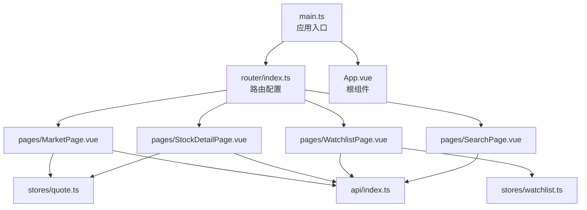
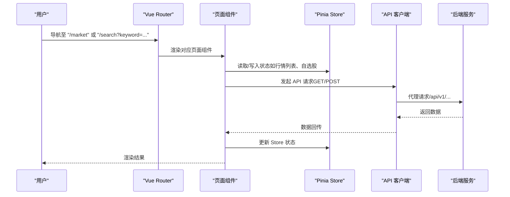
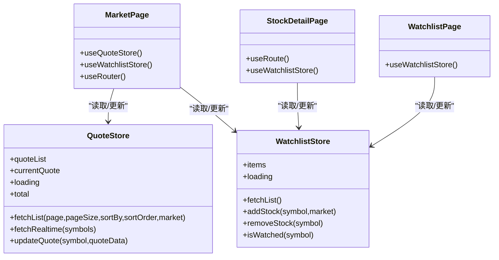
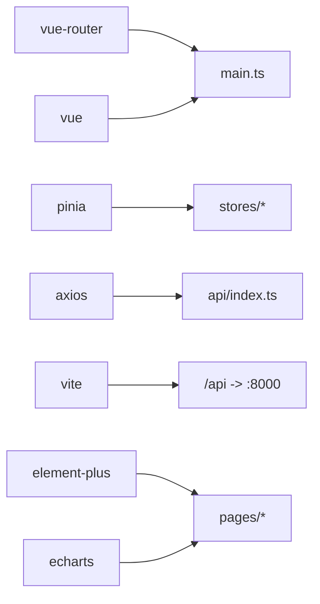

# 路由系统

<cite>
**本文引用的文件**
- [router/index.ts](file://frontend/src/router/index.ts)
- [main.ts](file://frontend/src/main.ts)
- [App.vue](file://frontend/src/App.vue)
- [MarketPage.vue](file://frontend/src/pages/MarketPage.vue)
- [StockDetailPage.vue](file://frontend/src/pages/StockDetailPage.vue)
- [WatchlistPage.vue](file://frontend/src/pages/WatchlistPage.vue)
- [SearchPage.vue](file://frontend/src/pages/SearchPage.vue)
- [quote.ts](file://frontend/src/stores/quote.ts)
- [watchlist.ts](file://frontend/src/stores/watchlist.ts)
- [index.ts](file://frontend/src/api/index.ts)
- [vite.config.ts](file://frontend/vite.config.ts)
- [package.json](file://frontend/package.json)
- [README.md](file://README.md)
</cite>

## 目录
1. [简介](#简介)
2. [项目结构](#项目结构)
3. [核心组件](#核心组件)
4. [架构总览](#架构总览)
5. [详细组件分析](#详细组件分析)
6. [依赖分析](#依赖分析)
7. [性能考虑](#性能考虑)
8. [故障排查指南](#故障排查指南)
9. [结论](#结论)
10. [附录](#附录)

## 简介
本文件系统性梳理 Stock-View 前端的路由体系，覆盖 Vue Router 的配置与使用、路由定义、动态路由匹配、参数传递与查询字符串处理、懒加载与代码分割、路由与状态管理的集成模式、以及路由级别的错误处理机制。文档同时给出与页面组件交互的导航流程、权限控制建议、面包屑与路由动画的实现思路，并提供可扩展的实践建议。

## 项目结构
前端采用标准的单页应用结构，路由集中于 router/index.ts，页面组件位于 pages 目录，状态管理通过 Pinia Store 提供，API 客户端封装在 api/index.ts 中，入口在 main.ts 注册路由与状态管理。

图表来源
- [main.ts:1-12](file://frontend/src/main.ts#L1-L12)
- [router/index.ts:1-14](file://frontend/src/router/index.ts#L1-L14)
- [App.vue:1-23](file://frontend/src/App.vue#L1-L23)

章节来源
- [main.ts:1-12](file://frontend/src/main.ts#L1-L12)
- [router/index.ts:1-14](file://frontend/src/router/index.ts#L1-L14)
- [App.vue:1-23](file://frontend/src/App.vue#L1-L23)

## 核心组件
- 路由器实例：基于 createRouter 与 createWebHistory，定义了首页重定向与四个页面路由。
- 页面组件：MarketPage、StockDetailPage、WatchlistPage、SearchPage，分别承担行情列表、股票详情、自选股管理、搜索功能。
- 状态管理：QuoteStore 与 WatchlistStore，为页面提供数据读取与更新能力。
- API 客户端：统一的 axios 实例与模块化 API 方法，支持查询字符串参数传递。

章节来源
- [router/index.ts:1-14](file://frontend/src/router/index.ts#L1-L14)
- [MarketPage.vue:1-182](file://frontend/src/pages/MarketPage.vue#L1-L182)
- [StockDetailPage.vue:1-249](file://frontend/src/pages/StockDetailPage.vue#L1-L249)
- [WatchlistPage.vue:1-79](file://frontend/src/pages/WatchlistPage.vue#L1-L79)
- [SearchPage.vue:1-50](file://frontend/src/pages/SearchPage.vue#L1-L50)
- [quote.ts:1-43](file://frontend/src/stores/quote.ts#L1-L43)
- [watchlist.ts:1-36](file://frontend/src/stores/watchlist.ts#L1-L36)
- [index.ts:1-33](file://frontend/src/api/index.ts#L1-L33)

## 架构总览
下图展示从用户交互到页面渲染、再到状态管理与 API 调用的整体流程。

图表来源
- [router/index.ts:1-14](file://frontend/src/router/index.ts#L1-L14)
- [MarketPage.vue:140-144](file://frontend/src/pages/MarketPage.vue#L140-L144)
- [SearchPage.vue:28-35](file://frontend/src/pages/SearchPage.vue#L28-L35)
- [index.ts:8-31](file://frontend/src/api/index.ts#L8-L31)
- [vite.config.ts:12-20](file://frontend/vite.config.ts#L12-L20)

## 详细组件分析

### 路由配置与导航
- 基础路由
  - 首页重定向：根路径 '/' 重定向到 '/market'
  - 市场页面：路径 '/market'，组件按需加载
  - 股票详情：路径 '/stock/:symbol'，动态参数 symbol
  - 自选股页面：路径 '/watchlist'，组件按需加载
  - 搜索页面：路径 '/search'，组件按需加载
- 导航方式
  - 组件内使用 $router.push 或 $router.back
  - 使用 <router-link> 进行声明式导航
- 参数与查询
  - 动态路由参数：通过 useRoute().params.symbol 获取
  - 查询字符串：通过 router.push('/search?keyword=...') 传递

章节来源
- [router/index.ts:1-14](file://frontend/src/router/index.ts#L1-L14)
- [MarketPage.vue:140-144](file://frontend/src/pages/MarketPage.vue#L140-L144)
- [StockDetailPage.vue:84-86](file://frontend/src/pages/StockDetailPage.vue#L84-L86)
- [WatchlistPage.vue:8-31](file://frontend/src/pages/WatchlistPage.vue#L8-L31)
- [SearchPage.vue:10](file://frontend/src/pages/SearchPage.vue#L10)

### 页面路由规则与交互

#### 市场页面（/market）
- 功能要点
  - 顶部标签切换（沪深A股/涨幅榜/跌幅榜/换手榜），触发行情列表排序变化
  - 输入框支持回车跳转搜索页，查询字符串 keyword
  - 表格点击或侧边栏点击进入股票详情页
  - 自选股链接跳转至 /watchlist
- 参数与查询
  - 排序参数通过 store.fetchList 的 sortBy/sortOrder 控制
  - 搜索通过 router.push('/search?keyword=...') 触发
- 刷新策略
  - 定时器每 10 秒刷新一次行情数据

章节来源
- [MarketPage.vue:90-144](file://frontend/src/pages/MarketPage.vue#L90-L144)
- [MarketPage.vue:146-154](file://frontend/src/pages/MarketPage.vue#L146-L154)

#### 股票详情页面（/stock/:symbol）
- 功能要点
  - 通过动态参数 symbol 获取当前股票
  - 支持周期切换（分时/日K/周K/月K/5分/15分）
  - 实时报价、盘口数据、K线图、AI 分析按钮
  - 加自选/移出自选按钮与 WatchlistStore 集成
- 参数与查询
  - 动态参数：useRoute().params.symbol
  - 查询字符串：AI 分析接口通过查询参数传参
- 刷新策略
  - 定时器每 10 秒刷新报价与盘口

章节来源
- [StockDetailPage.vue:77-216](file://frontend/src/pages/StockDetailPage.vue#L77-L216)

#### 自选股页面（/watchlist）
- 功能要点
  - 展示自选股列表，支持移出操作
  - 点击条目跳转至股票详情页
  - 空状态提示并引导前往市场页添加
- 参数与查询
  - 无动态参数，纯列表展示
- 刷新策略
  - 首次挂载加载，支持移出后重新拉取

章节来源
- [WatchlistPage.vue:1-79](file://frontend/src/pages/WatchlistPage.vue#L1-L79)

#### 搜索页面（/search）
- 功能要点
  - 输入框防抖搜索，关键词 keyword
  - 结果项点击跳转至股票详情页
  - 无结果提示
- 参数与查询
  - 查询字符串：/search?keyword=...
- 刷新策略
  - 无定时刷新，按需搜索

章节来源
- [SearchPage.vue:1-50](file://frontend/src/pages/SearchPage.vue#L1-L50)

### 路由懒加载与代码分割
- 路由层懒加载
  - 所有页面组件均通过函数式 import 实现按需加载
- Vite 构建
  - 通过 @vitejs/plugin-vue 与默认打包策略实现代码分割
- 性能建议
  - 可结合 Vue 3.4+ 的 Suspense 与 keep-alive 对频繁切换的页面进行缓存
  - 对首屏关键路由（/market）可考虑预加载策略

章节来源
- [router/index.ts:7-10](file://frontend/src/router/index.ts#L7-L10)
- [vite.config.ts:1-21](file://frontend/vite.config.ts#L1-L21)

### 路由与状态管理的集成
- QuoteStore
  - 提供行情列表、实时报价、更新方法，供 MarketPage 与 StockDetailPage 使用
- WatchlistStore
  - 提供自选股列表、增删查方法，供 MarketPage、WatchlistPage 与 StockDetailPage 使用
- 集成模式
  - 页面组件通过 composables/useRoute/useRouter 读取路由参数与执行导航
  - Store 作为数据源，页面组件负责调用 API 并更新 Store
  - API 客户端统一处理 baseURL 与超时

图表来源
- [quote.ts:1-43](file://frontend/src/stores/quote.ts#L1-L43)
- [watchlist.ts:1-36](file://frontend/src/stores/watchlist.ts#L1-L36)
- [MarketPage.vue:80-88](file://frontend/src/pages/MarketPage.vue#L80-L88)
- [StockDetailPage.vue:77-85](file://frontend/src/pages/StockDetailPage.vue#L77-L85)
- [WatchlistPage.vue:36-43](file://frontend/src/pages/WatchlistPage.vue#L36-L43)

### 路由参数传递、查询字符串处理与路由元信息
- 动态路由参数
  - 通过 useRoute().params.symbol 获取股票代码
- 查询字符串
  - MarketPage 通过 router.push('/search?keyword=...') 传递搜索关键词
  - API 客户端通过 GET 查询参数拼接（如 /quote/realtime?symbols=...）
- 路由元信息
  - 当前路由未使用 meta 字段；可在需要时扩展（如权限标识、面包屑标题、动画配置）

章节来源
- [StockDetailPage.vue:84-86](file://frontend/src/pages/StockDetailPage.vue#L84-L86)
- [MarketPage.vue:140-144](file://frontend/src/pages/MarketPage.vue#L140-L144)
- [index.ts:8-31](file://frontend/src/api/index.ts#L8-L31)

### 路由权限控制、面包屑导航与路由动画
- 权限控制
  - 当前路由未实现鉴权逻辑；建议在全局前置守卫中加入登录态校验与白名单放行
- 面包屑导航
  - 当前未实现；可在路由表中增加 meta.breadcrumb 字段，结合布局组件渲染
- 路由动画
  - 当前未实现；可在 <router-view> 上使用 transition 包裹，或在路由表中增加 meta.animation 字段配合过渡类名

章节来源
- [router/index.ts:1-14](file://frontend/src/router/index.ts#L1-L14)

### 路由级别的错误处理机制
- 当前未实现全局错误处理；建议：
  - 在路由表中为关键页面增加错误边界组件
  - 在 API 客户端拦截器中统一处理 4xx/5xx 错误并提示
  - 在页面组件中对异步加载失败进行降级渲染

章节来源
- [index.ts:1-33](file://frontend/src/api/index.ts#L1-L33)

## 依赖分析
- 路由依赖
  - Vue Router 4.x：提供路由实例、导航与历史模式
  - Vue 3 + TypeScript：提供响应式与类型安全
- 状态管理
  - Pinia：提供轻量级状态管理，与 Vue 3 组合式 API 协同
- 构建与代理
  - Vite：提供开发服务器与代理配置，将 /api/v1 代理到后端 8000 端口
- UI 与图表
  - Element Plus：表格、输入框、按钮等基础组件
  - ECharts：K 线与分时图可视化

图表来源
- [package.json:11-25](file://frontend/package.json#L11-L25)
- [main.ts:1-12](file://frontend/src/main.ts#L1-L12)
- [vite.config.ts:12-20](file://frontend/vite.config.ts#L12-L20)
- [index.ts:1-33](file://frontend/src/api/index.ts#L1-L33)

章节来源
- [package.json:11-25](file://frontend/package.json#L11-L25)
- [vite.config.ts:12-20](file://frontend/vite.config.ts#L12-L20)

## 性能考虑
- 懒加载与代码分割
  - 已通过路由级 import 实现按需加载，减少首屏体积
- 预加载策略
  - 可在路由表中为关键页面增加 meta.preload 或使用 link rel="prefetch/preload"
- 缓存与刷新
  - 页面内定时器每 10 秒刷新，注意在组件卸载时清理定时器
- 图表性能
  - ECharts 初始化与销毁需在 onMounted/onUnmounted 中正确处理
- API 超时与重试
  - axios 超时时间 15 秒，建议在业务层增加重试与错误提示

章节来源
- [router/index.ts:7-10](file://frontend/src/router/index.ts#L7-L10)
- [MarketPage.vue:146-154](file://frontend/src/pages/MarketPage.vue#L146-L154)
- [StockDetailPage.vue:203-216](file://frontend/src/pages/StockDetailPage.vue#L203-L216)
- [index.ts:3-6](file://frontend/src/api/index.ts#L3-L6)

## 故障排查指南
- 路由无法跳转
  - 检查路由表是否正确注册，组件是否按需加载成功
  - 确认 <router-view /> 是否存在于根组件
- 动态参数为空
  - 确保使用 useRoute().params.symbol 获取参数
  - 检查导航是否携带参数（如 $router.push('/stock/' + symbol)）
- 搜索无结果
  - 检查查询字符串 keyword 是否正确传递
  - 确认 API 服务端 /api/v1/stock/search 是否可用
- 图表不显示
  - 确认 ECharts 容器存在且在 mounted 后初始化
  - 注意在卸载时 dispose 实例
- API 404/跨域
  - 检查 Vite 代理配置是否正确指向后端 8000 端口
  - 确认 baseURL 与路径拼接是否一致

章节来源
- [App.vue:1-3](file://frontend/src/App.vue#L1-L3)
- [StockDetailPage.vue:84-86](file://frontend/src/pages/StockDetailPage.vue#L84-L86)
- [SearchPage.vue:28-35](file://frontend/src/pages/SearchPage.vue#L28-L35)
- [vite.config.ts:12-20](file://frontend/vite.config.ts#L12-L20)
- [index.ts:8-31](file://frontend/src/api/index.ts#L8-L31)

## 结论
Stock-View 的路由系统简洁清晰，采用 Vue Router 4.x 与按需加载策略，满足当前市场、详情、自选、搜索四大页面的导航需求。通过 Pinia 与 API 客户端的解耦，页面组件职责明确。建议后续引入全局前置守卫、meta 元信息、错误边界与过渡动画，以进一步完善权限控制、导航体验与健壮性。

## 附录
- 快速启动与访问
  - 前端开发服务器默认端口 3000，后端 API 默认端口 8000
  - Vite 开发服务器代理 /api 到后端 8000 端口
- 项目技术栈概览
  - 前端：Vue 3 + TypeScript + Pinia + ECharts + Element Plus
  - 后端：Python 3.11 + FastAPI + SQLAlchemy 2.0 (async)
  - 数据库：PostgreSQL 15 + Redis 7
  - 部署：Docker Compose + Nginx

章节来源
- [README.md:22-42](file://README.md#L22-L42)
- [README.md:92-126](file://README.md#L92-L126)
- [vite.config.ts:12-20](file://frontend/vite.config.ts#L12-L20)