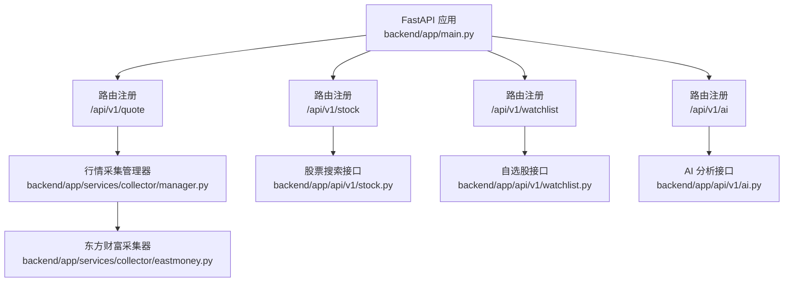
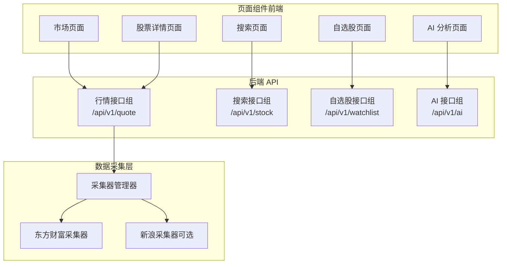
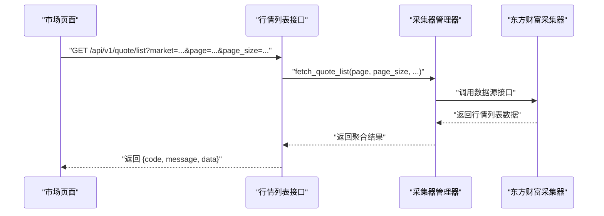
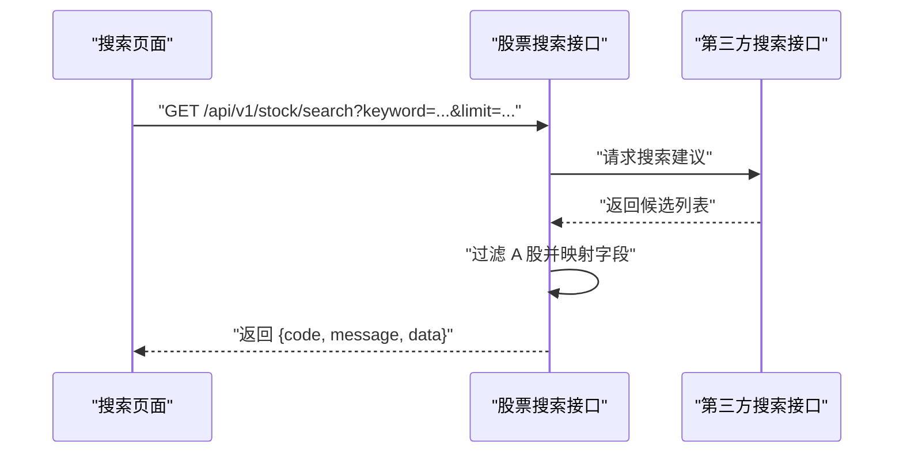
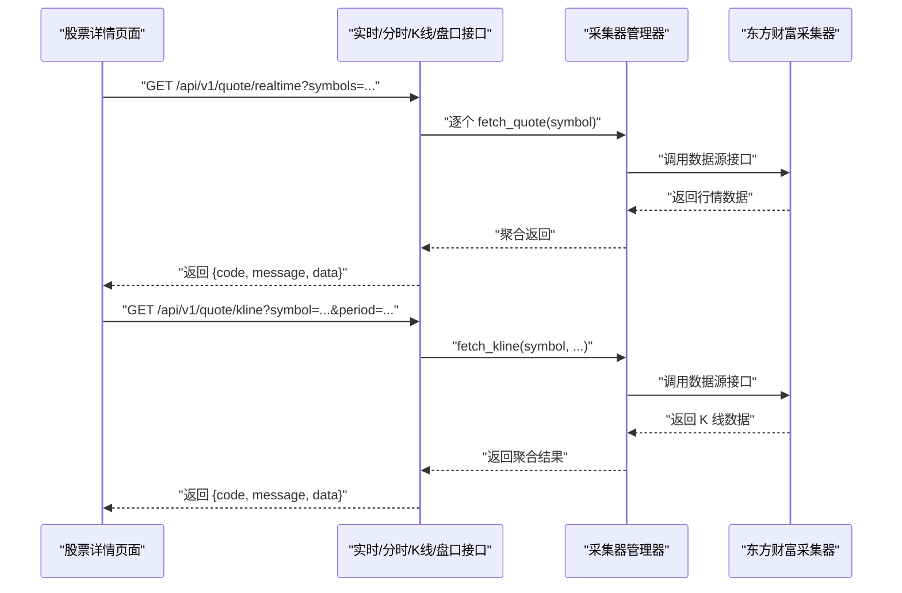
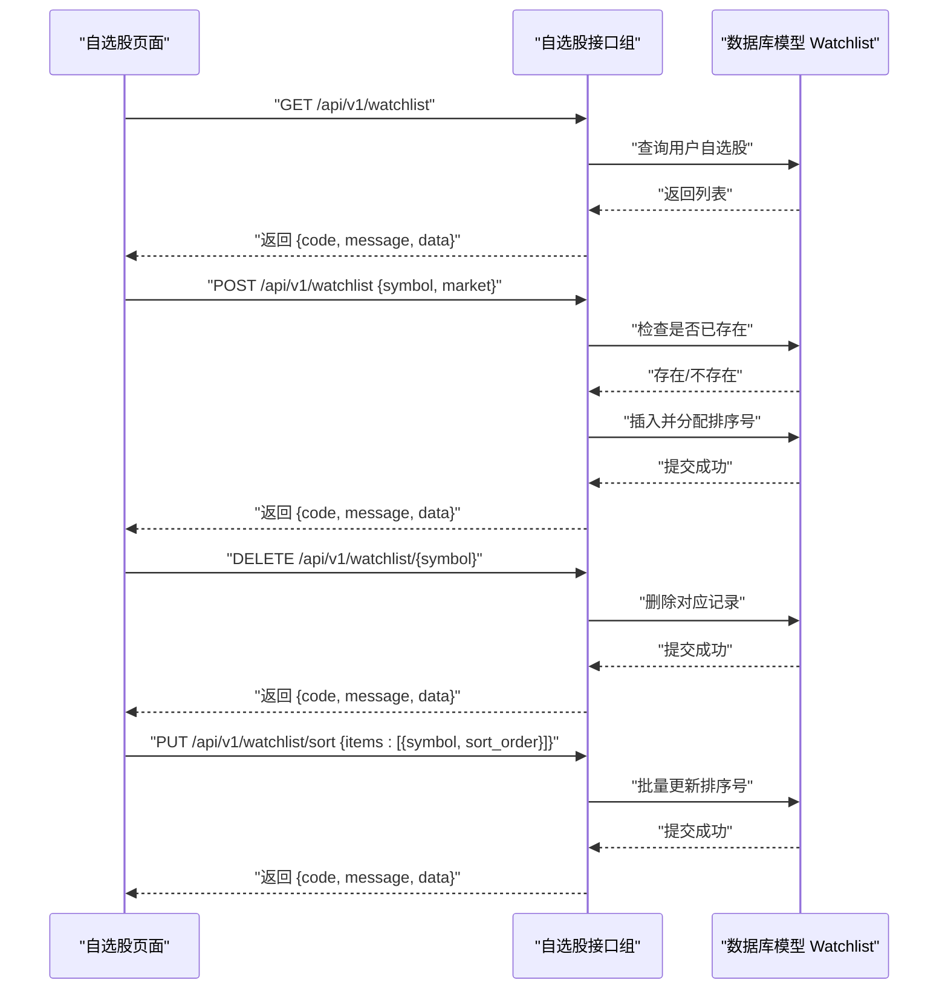
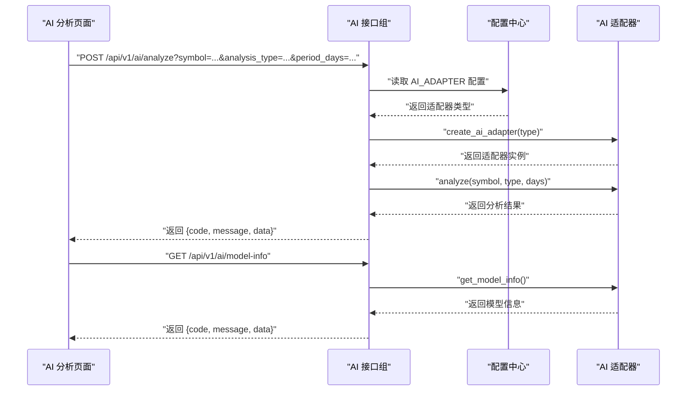
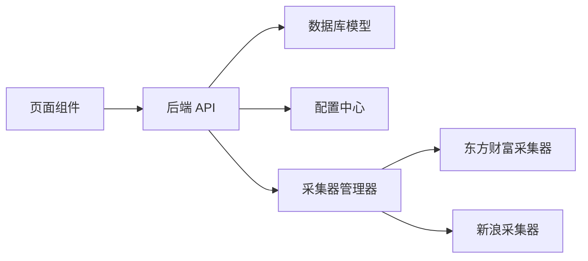

# 页面组件

<cite>
**本文引用的文件**
- [backend/app/main.py](file://backend/app/main.py)
- [backend/app/api/v1/quote.py](file://backend/app/api/v1/quote.py)
- [backend/app/api/v1/stock.py](file://backend/app/api/v1/stock.py)
- [backend/app/api/v1/watchlist.py](file://backend/app/api/v1/watchlist.py)
- [backend/app/api/v1/ai.py](file://backend/app/api/v1/ai.py)
- [backend/app/services/collector/manager.py](file://backend/app/services/collector/manager.py)
- [backend/app/services/collector/eastmoney.py](file://backend/app/services/collector/eastmoney.py)
- [backend/app/models/models.py](file://backend/app/models/models.py)
- [backend/app/schemas/schemas.py](file://backend/app/schemas/schemas.py)
- [backend/app/core/config.py](file://backend/app/core/config.py)
</cite>

## 目录
1. [简介](#简介)
2. [项目结构](#项目结构)
3. [核心组件](#核心组件)
4. [架构总览](#架构总览)
5. [详细组件分析](#详细组件分析)
6. [依赖分析](#依赖分析)
7. [性能考虑](#性能考虑)
8. [故障排查指南](#故障排查指南)
9. [结论](#结论)
10. [附录](#附录)

## 简介
本文件面向前端页面组件的开发者与产品人员，系统化梳理后端提供的页面级能力与数据流，帮助理解市场页面、搜索页面、股票详情页面、自选股页面等主要界面在后端侧的支撑点与调用方式。文档重点覆盖：
- 各页面的数据来源与接口定义
- 状态管理与错误处理策略
- 生命周期与性能优化要点
- 页面间导航与数据流转（通过路由参数与状态共享）
- 组件开发规范与最佳实践

## 项目结构
后端采用 FastAPI 架构，按功能域划分模块，核心入口负责注册路由与中间件；行情、股票搜索、自选股、AI 分析分别由独立 API 路由提供服务；数据采集通过采集器管理器统一调度，支持多数据源自动故障转移。

图表来源
- [backend/app/main.py:22-48](file://backend/app/main.py#L22-L48)
- [backend/app/api/v1/quote.py:1-65](file://backend/app/api/v1/quote.py#L1-L65)
- [backend/app/api/v1/stock.py:1-37](file://backend/app/api/v1/stock.py#L1-L37)
- [backend/app/api/v1/watchlist.py:1-77](file://backend/app/api/v1/watchlist.py#L1-L77)
- [backend/app/api/v1/ai.py:1-29](file://backend/app/api/v1/ai.py#L1-L29)
- [backend/app/services/collector/manager.py:12-80](file://backend/app/services/collector/manager.py#L12-L80)
- [backend/app/services/collector/eastmoney.py:11-240](file://backend/app/services/collector/eastmoney.py#L11-L240)

章节来源
- [backend/app/main.py:1-48](file://backend/app/main.py#L1-L48)

## 核心组件
- 应用入口与中间件：注册 CORS、健康检查、路由前缀与生命周期钩子。
- 行情服务：提供实时行情、行情列表、K线、分时、盘口等接口。
- 股票搜索：基于第三方建议接口的简单搜索。
- 自选股服务：增删改查与排序。
- AI 分析服务：分析请求、历史预留、模型信息。
- 数据采集层：采集器管理器统一调度，优先级与故障转移。
- 数据模型与校验：数据库模型与 Pydantic 响应/请求模型。

章节来源
- [backend/app/main.py:22-48](file://backend/app/main.py#L22-L48)
- [backend/app/api/v1/quote.py:1-65](file://backend/app/api/v1/quote.py#L1-L65)
- [backend/app/api/v1/stock.py:1-37](file://backend/app/api/v1/stock.py#L1-L37)
- [backend/app/api/v1/watchlist.py:1-77](file://backend/app/api/v1/watchlist.py#L1-L77)
- [backend/app/api/v1/ai.py:1-29](file://backend/app/api/v1/ai.py#L1-L29)
- [backend/app/services/collector/manager.py:12-80](file://backend/app/services/collector/manager.py#L12-L80)
- [backend/app/services/collector/eastmoney.py:11-240](file://backend/app/services/collector/eastmoney.py#L11-L240)
- [backend/app/models/models.py:1-74](file://backend/app/models/models.py#L1-L74)
- [backend/app/schemas/schemas.py:1-103](file://backend/app/schemas/schemas.py#L1-L103)

## 架构总览
下图展示页面组件与后端服务的交互路径，以及数据采集层的故障转移策略。

图表来源
- [backend/app/api/v1/quote.py:1-65](file://backend/app/api/v1/quote.py#L1-L65)
- [backend/app/api/v1/stock.py:1-37](file://backend/app/api/v1/stock.py#L1-L37)
- [backend/app/api/v1/watchlist.py:1-77](file://backend/app/api/v1/watchlist.py#L1-L77)
- [backend/app/api/v1/ai.py:1-29](file://backend/app/api/v1/ai.py#L1-L29)
- [backend/app/services/collector/manager.py:12-80](file://backend/app/services/collector/manager.py#L12-L80)
- [backend/app/services/collector/eastmoney.py:11-240](file://backend/app/services/collector/eastmoney.py#L11-L240)

## 详细组件分析

### 市场页面（行情列表）
- 功能概述：展示按涨跌幅、成交量等维度排序的股票行情列表，支持分页与市场筛选。
- 关键接口：GET /api/v1/quote/list
  - 查询参数：market、sort_by、sort_order、page、page_size
  - 返回：分页后的行情项集合与总数
- 数据来源：采集器管理器优先调用指定数据源，失败则自动切换到备选数据源。
- 错误处理：当数据源不可用时返回统一错误码与提示。
- 性能优化：限制每页最大条数，避免一次性拉取过多数据；合理设置缓存 TTL（由配置控制）。

图表来源
- [backend/app/api/v1/quote.py:19-33](file://backend/app/api/v1/quote.py#L19-L33)
- [backend/app/services/collector/manager.py:34-43](file://backend/app/services/collector/manager.py#L34-L43)
- [backend/app/services/collector/eastmoney.py:39-99](file://backend/app/services/collector/eastmoney.py#L39-L99)

章节来源
- [backend/app/api/v1/quote.py:19-33](file://backend/app/api/v1/quote.py#L19-L33)
- [backend/app/services/collector/manager.py:34-43](file://backend/app/services/collector/manager.py#L34-L43)
- [backend/app/services/collector/eastmoney.py:39-99](file://backend/app/services/collector/eastmoney.py#L39-L99)

### 搜索页面（股票搜索）
- 功能概述：根据关键词进行股票搜索，支持拼音首字母与代码匹配，过滤 A 股市场。
- 关键接口：GET /api/v1/stock/search
  - 查询参数：keyword、limit（10~20）
  - 返回：匹配的股票列表（代码、名称、市场、拼音）
- 数据来源：调用第三方“东方财富搜索建议”接口，内部做 A 股过滤与字段映射。
- 错误处理：异常吞吐并返回空列表，保证前端体验稳定。

图表来源
- [backend/app/api/v1/stock.py:10-37](file://backend/app/api/v1/stock.py#L10-L37)

章节来源
- [backend/app/api/v1/stock.py:10-37](file://backend/app/api/v1/stock.py#L10-L37)

### 股票详情页面（实时行情、K线、分时、盘口）
- 功能概述：展示单只股票的实时行情、K线图数据、分时走势、买卖盘口。
- 关键接口：
  - GET /api/v1/quote/realtime?symbols=...
  - GET /api/v1/quote/kline?symbol=...&period=...&fq_type=...&limit=...
  - GET /api/v1/quote/timeline?symbol=...
  - GET /api/v1/quote/orderbook?symbol=...
- 数据来源：采集器管理器按优先级调用数据源，失败自动切换。
- 错误处理：当股票代码不存在或数据源不可用时返回统一错误码与提示。
- 性能优化：限制 symbols 数量上限（最多 50），避免一次请求过多标的。

图表来源
- [backend/app/api/v1/quote.py:7-56](file://backend/app/api/v1/quote.py#L7-L56)
- [backend/app/services/collector/manager.py:21-76](file://backend/app/services/collector/manager.py#L21-L76)
- [backend/app/services/collector/eastmoney.py:23-222](file://backend/app/services/collector/eastmoney.py#L23-L222)

章节来源
- [backend/app/api/v1/quote.py:7-56](file://backend/app/api/v1/quote.py#L7-L56)
- [backend/app/services/collector/manager.py:21-76](file://backend/app/services/collector/manager.py#L21-L76)
- [backend/app/services/collector/eastmoney.py:23-222](file://backend/app/services/collector/eastmoney.py#L23-L222)

### 自选股页面（列表、增删、排序）
- 功能概述：展示当前用户的自选股列表，支持添加、删除与拖拽排序。
- 关键接口：
  - GET /api/v1/watchlist：获取自选股列表（按排序字段升序）
  - POST /api/v1/watchlist：添加自选股（去重并分配排序号）
  - DELETE /api/v1/watchlist/{symbol}：删除自选股
  - PUT /api/v1/watchlist/sort：批量更新排序
- 数据来源：数据库模型 Watchlist，使用默认用户 ID。
- 错误处理：重复添加返回明确错误码；删除成功返回成功状态。
- 性能优化：排序号自动生成，避免并发冲突；批量排序减少多次往返。

图表来源
- [backend/app/api/v1/watchlist.py:13-77](file://backend/app/api/v1/watchlist.py#L13-L77)
- [backend/app/models/models.py:50-60](file://backend/app/models/models.py#L50-L60)

章节来源
- [backend/app/api/v1/watchlist.py:13-77](file://backend/app/api/v1/watchlist.py#L13-L77)
- [backend/app/models/models.py:50-60](file://backend/app/models/models.py#L50-L60)

### AI 分析页面（分析请求、历史预留、模型信息）
- 功能概述：发起对某只股票的 AI 分析，查询分析历史（预留），获取模型信息。
- 关键接口：
  - POST /api/v1/ai/analyze：请求分析（symbol、analysis_type、period_days）
  - GET /api/v1/ai/history：历史记录（预留）
  - GET /api/v1/ai/model-info：模型信息
- 数据来源：通过适配器创建器选择具体 AI 适配器执行分析。
- 错误处理：历史接口当前为空数据结构，便于后续扩展。

图表来源
- [backend/app/api/v1/ai.py:10-29](file://backend/app/api/v1/ai.py#L10-L29)
- [backend/app/core/config.py:19-24](file://backend/app/core/config.py#L19-L24)

章节来源
- [backend/app/api/v1/ai.py:10-29](file://backend/app/api/v1/ai.py#L10-L29)
- [backend/app/core/config.py:19-24](file://backend/app/core/config.py#L19-L24)

## 依赖分析
- 组件耦合：页面组件仅依赖后端 API；数据采集层通过管理器解耦具体实现。
- 外部依赖：HTTP 客户端用于调用第三方数据源；数据库与 Redis 用于持久化与缓存。
- 配置驱动：AI 适配器、数据源优先级、缓存 TTL 等通过配置集中管理。

图表来源
- [backend/app/api/v1/quote.py:1-65](file://backend/app/api/v1/quote.py#L1-L65)
- [backend/app/api/v1/stock.py:1-37](file://backend/app/api/v1/stock.py#L1-L37)
- [backend/app/api/v1/watchlist.py:1-77](file://backend/app/api/v1/watchlist.py#L1-L77)
- [backend/app/api/v1/ai.py:1-29](file://backend/app/api/v1/ai.py#L1-L29)
- [backend/app/models/models.py:1-74](file://backend/app/models/models.py#L1-L74)
- [backend/app/core/config.py:1-43](file://backend/app/core/config.py#L1-L43)
- [backend/app/services/collector/manager.py:12-80](file://backend/app/services/collector/manager.py#L12-L80)
- [backend/app/services/collector/eastmoney.py:11-240](file://backend/app/services/collector/eastmoney.py#L11-L240)

章节来源
- [backend/app/models/models.py:1-74](file://backend/app/models/models.py#L1-L74)
- [backend/app/core/config.py:1-43](file://backend/app/core/config.py#L1-L43)
- [backend/app/services/collector/manager.py:12-80](file://backend/app/services/collector/manager.py#L12-L80)
- [backend/app/services/collector/eastmoney.py:11-240](file://backend/app/services/collector/eastmoney.py#L11-L240)

## 性能考虑
- 请求限流与超时：AI 服务请求超时、速率限制与缓存 TTL 可通过配置调节。
- 数据分页与批量限制：行情列表与实时行情接口限制每页与 symbols 数量，降低网络与计算压力。
- 故障转移：采集器管理器按优先级自动切换数据源，提升可用性。
- 缓存策略：Redis 作为缓存与任务队列，结合 TTL 控制数据新鲜度。

章节来源
- [backend/app/api/v1/quote.py:10-16](file://backend/app/api/v1/quote.py#L10-L16)
- [backend/app/api/v1/quote.py:24-33](file://backend/app/api/v1/quote.py#L24-L33)
- [backend/app/api/v1/quote.py:37-47](file://backend/app/api/v1/quote.py#L37-L47)
- [backend/app/api/v1/quote.py:50-56](file://backend/app/api/v1/quote.py#L50-L56)
- [backend/app/core/config.py:21-30](file://backend/app/core/config.py#L21-L30)
- [backend/app/services/collector/manager.py:21-32](file://backend/app/services/collector/manager.py#L21-L32)

## 故障排查指南
- 健康检查：访问 /api/v1/health 确认服务运行状态。
- 行情接口错误码：
  - 数据源不可用：返回特定错误码与提示，检查采集器与网络。
  - 股票代码不存在：检查输入符号格式与数据源支持范围。
- 搜索接口异常：第三方接口不稳定时会吞吐异常并返回空列表，前端需提示无结果。
- 自选股操作：重复添加会返回明确错误码，确保去重后再提交。
- AI 分析：若分析接口超时或失败，检查 AI 适配器配置与服务可用性。

章节来源
- [backend/app/main.py:46-48](file://backend/app/main.py#L46-L48)
- [backend/app/api/v1/quote.py:31-33](file://backend/app/api/v1/quote.py#L31-L33)
- [backend/app/api/v1/quote.py:44-47](file://backend/app/api/v1/quote.py#L44-L47)
- [backend/app/api/v1/quote.py:54-56](file://backend/app/api/v1/quote.py#L54-L56)
- [backend/app/api/v1/stock.py:35-37](file://backend/app/api/v1/stock.py#L35-L37)
- [backend/app/api/v1/watchlist.py:38-40](file://backend/app/api/v1/watchlist.py#L38-L40)
- [backend/app/api/v1/ai.py:13-15](file://backend/app/api/v1/ai.py#L13-L15)

## 结论
后端为页面组件提供了清晰、稳定的接口边界与一致的响应结构，配合采集器管理器的故障转移与配置化的性能参数，能够满足市场、搜索、详情、自选与 AI 分析等页面的核心需求。前端在页面间导航与状态共享上应遵循统一的路由参数与状态管理模式，以获得一致的用户体验。

## 附录
- 页面间导航与数据流转建议：
  - 路由参数：使用标准查询参数传递筛选条件（如 market、sort_by、page、page_size、symbol、period 等）。
  - 状态共享：通过全局状态管理（如 Redux 或轻量状态库）维护用户偏好、搜索词、自选股列表等跨页面状态。
  - 数据缓存：利用本地缓存与后端缓存 TTL 协同，减少重复请求。
- 组件复用与代码组织：
  - 将通用的请求封装为 Hook 或 Service，避免重复逻辑。
  - 使用统一的响应模型与错误处理拦截器，保持页面组件简洁。
- 样式管理：
  - 采用主题化与原子化样式方案，确保组件一致性与可维护性。
- 最佳实践：
  - 对高耗时接口（如 K 线、AI 分析）增加加载态与骨架屏。
  - 对用户输入（搜索、排序）进行防抖与节流。
  - 在页面卸载时取消未完成的请求，避免内存泄漏。