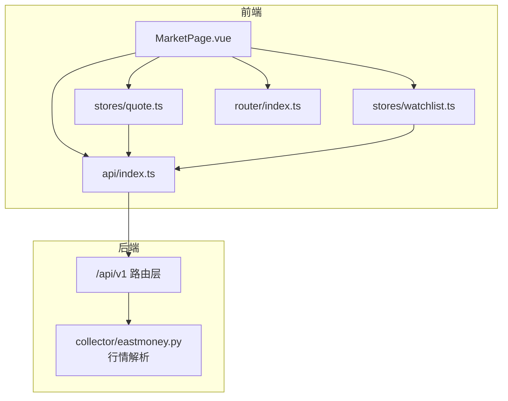
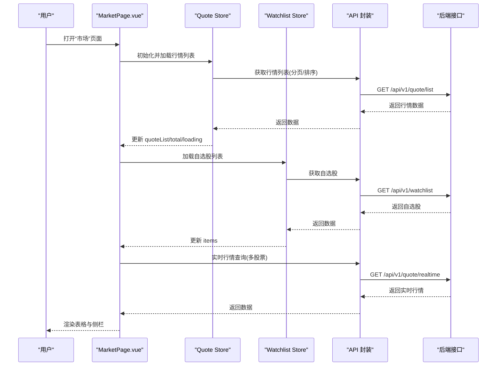
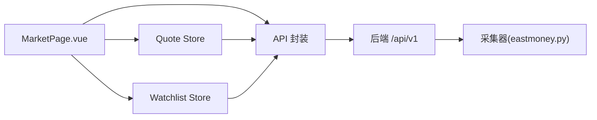

# 市场页面组件

<cite>
**本文引用的文件**
- [MarketPage.vue](file://frontend/src/pages/MarketPage.vue)
- [quote.ts](file://frontend/src/stores/quote.ts)
- [watchlist.ts](file://frontend/src/stores/watchlist.ts)
- [index.ts](file://frontend/src/api/index.ts)
- [index.ts](file://frontend/src/router/index.ts)
- [eastmoney.py](file://backend/app/services/collector/eastmoney.py)
</cite>

## 目录
1. [简介](#简介)
2. [项目结构](#项目结构)
3. [核心组件](#核心组件)
4. [架构总览](#架构总览)
5. [详细组件分析](#详细组件分析)
6. [依赖关系分析](#依赖关系分析)
7. [性能考虑](#性能考虑)
8. [故障排查指南](#故障排查指南)
9. [结论](#结论)
10. [附录](#附录)

## 简介
本文件针对前端 MarketPage.vue 组件进行系统化技术文档梳理，覆盖以下主题：
- 顶部导航栏设计：Logo、标签切换、搜索框、自选股链接
- 左侧自选股侧边栏渲染与交互
- 主内容区行情表格展示与分页
- 页面状态管理（tabs、currentTab、searchKeyword、分页参数）
- 数据获取流程（定时刷新、分页加载、排序切换）
- 用户交互处理（表格点击跳转、搜索功能）
- 与 Pinia 状态管理的集成
- API 调用封装与错误处理、加载状态管理
- 性能优化建议、响应式布局与移动端适配

## 项目结构
MarketPage.vue 所在的前端目录采用按页面/功能模块划分的组织方式，路由在 router 中集中配置，状态通过 Pinia Store 管理，API 请求统一在 api 模块中封装。

图表来源
- [MarketPage.vue:128-222](file://frontend/src/pages/MarketPage.vue#L128-L222)
- [quote.ts:1-43](file://frontend/src/stores/quote.ts#L1-L43)
- [watchlist.ts:1-36](file://frontend/src/stores/watchlist.ts#L1-L36)
- [index.ts:1-33](file://frontend/src/api/index.ts#L1-L33)
- [index.ts:1-14](file://frontend/src/router/index.ts#L1-L14)
- [eastmoney.py:280-296](file://backend/app/services/collector/eastmoney.py#L280-L296)

章节来源
- [MarketPage.vue:1-126](file://frontend/src/pages/MarketPage.vue#L1-L126)
- [index.ts:1-14](file://frontend/src/router/index.ts#L1-L14)

## 核心组件
- MarketPage.vue：负责页面布局、状态管理、数据请求与交互逻辑
- Quote Store（quote.ts）：管理行情列表、当前行情、加载状态与总数
- Watchlist Store（watchlist.ts）：管理自选股列表、加载状态
- API 封装（api/index.ts）：统一的 HTTP 客户端与接口方法
- 路由（router/index.ts）：页面级路由配置

章节来源
- [MarketPage.vue:128-222](file://frontend/src/pages/MarketPage.vue#L128-L222)
- [quote.ts:1-43](file://frontend/src/stores/quote.ts#L1-L43)
- [watchlist.ts:1-36](file://frontend/src/stores/watchlist.ts#L1-L36)
- [index.ts:1-33](file://frontend/src/api/index.ts#L1-L33)
- [index.ts:1-14](file://frontend/src/router/index.ts#L1-L14)

## 架构总览
MarketPage 作为页面入口，使用 Composition API 管理本地状态，并通过 Pinia Store 进行跨组件状态共享。数据流从路由进入，经 API 层调用后端接口，最终更新到 Store 并驱动视图渲染。

图表来源
- [MarketPage.vue:188-222](file://frontend/src/pages/MarketPage.vue#L188-L222)
- [quote.ts:11-22](file://frontend/src/stores/quote.ts#L11-L22)
- [watchlist.ts:9-19](file://frontend/src/stores/watchlist.ts#L9-L19)
- [index.ts:8-14](file://frontend/src/api/index.ts#L8-L14)
- [index.ts:6-11](file://frontend/src/router/index.ts#L6-L11)

## 详细组件分析

### 顶部导航栏与搜索
- 标签切换：支持“沪深A股”“涨幅榜”“跌幅榜”“换手榜”，切换时重置页码并触发数据加载
- 搜索框：支持回车触发跳转至搜索页，关键词非空时进行路由跳转
- 自选股链接：当自选股为空时，引导用户前往搜索页添加

章节来源
- [MarketPage.vue:4-15](file://frontend/src/pages/MarketPage.vue#L4-L15)
- [MarketPage.vue:182-186](file://frontend/src/pages/MarketPage.vue#L182-L186)
- [MarketPage.vue:204-208](file://frontend/src/pages/MarketPage.vue#L204-L208)
- [MarketPage.vue:37-41](file://frontend/src/pages/MarketPage.vue#L37-L41)

### 左侧自选股侧边栏
- 渲染逻辑：遍历自选股列表，显示名称、代码、最新价、涨跌幅；点击项跳转到个股详情页
- 空态提示：当自选股为空时显示提示与“去添加”链接
- 实时行情：根据自选股集合批量请求实时行情，用于侧栏展示

章节来源
- [MarketPage.vue:19-42](file://frontend/src/pages/MarketPage.vue#L19-L42)
- [MarketPage.vue:193-202](file://frontend/src/pages/MarketPage.vue#L193-L202)
- [watchlist.ts:9-19](file://frontend/src/stores/watchlist.ts#L9-L19)
- [index.ts:9-10](file://frontend/src/api/index.ts#L9-L10)

### 主内容区行情表格
- 表格列：包含代码/名称、最新价、涨跌幅、涨跌额、成交量、成交额、换手率、最高、最低、今开等
- 排序：涨跌幅列支持排序，不同标签对应不同的排序字段与顺序
- 行样式：根据涨跌幅动态设置行背景色
- 点击跳转：点击任意行跳转到个股详情页

章节来源
- [MarketPage.vue:44-124](file://frontend/src/pages/MarketPage.vue#L44-L124)
- [MarketPage.vue:156-158](file://frontend/src/pages/MarketPage.vue#L156-L158)
- [MarketPage.vue:175-180](file://frontend/src/pages/MarketPage.vue#L175-L180)
- [index.ts:8-10](file://frontend/src/router/index.ts#L8-L10)

### 状态管理与生命周期
- 本地状态：tabs、currentTab、searchKeyword、page、pageSize、watchlistQuotes
- 生命周期：mounted 时初始化数据并启动定时器；unmounted 时清理定时器
- 定时刷新：每 10 秒刷新一次行情列表与自选股实时行情

章节来源
- [MarketPage.vue:139-149](file://frontend/src/pages/MarketPage.vue#L139-L149)
- [MarketPage.vue:210-221](file://frontend/src/pages/MarketPage.vue#L210-L221)

### 数据获取流程与排序策略
- 分页加载：通过 quoteStore.fetchList(page, pageSize, sortBy, sortOrder) 获取分页数据
- 排序映射：不同标签对应不同的排序键与方向
- 实时行情：批量查询自选股的实时行情，用于侧栏展示

章节来源
- [MarketPage.vue:188-191](file://frontend/src/pages/MarketPage.vue#L188-L191)
- [MarketPage.vue:175-180](file://frontend/src/pages/MarketPage.vue#L175-L180)
- [MarketPage.vue:193-202](file://frontend/src/pages/MarketPage.vue#L193-L202)
- [quote.ts:11-22](file://frontend/src/stores/quote.ts#L11-L22)

### 用户交互处理
- 表格点击：点击行跳转到个股详情页
- 搜索跳转：输入关键词并回车跳转到搜索页
- 标签切换：切换标签后重置页码并重新加载

章节来源
- [MarketPage.vue:47](file://frontend/src/pages/MarketPage.vue#L47)
- [MarketPage.vue:204-208](file://frontend/src/pages/MarketPage.vue#L204-L208)
- [MarketPage.vue:182-186](file://frontend/src/pages/MarketPage.vue#L182-L186)

### 与 Pinia 的集成
- Quote Store：维护 quoteList、currentQuote、loading、total，并提供 fetchList/fetchRealtime/updateQuote
- Watchlist Store：维护 items、loading，并提供 fetchList/addStock/removeStock/isWatched
- 在组件中直接注入并调用，避免重复请求与状态分散

章节来源
- [MarketPage.vue:131-137](file://frontend/src/pages/MarketPage.vue#L131-L137)
- [quote.ts:1-43](file://frontend/src/stores/quote.ts#L1-L43)
- [watchlist.ts:1-36](file://frontend/src/stores/watchlist.ts#L1-L36)

### API 调用封装与错误处理
- API 封装：统一的 axios 实例，提供 quote、stock、watchlist、ai 等接口方法
- 错误处理：Store 内部通过 try/finally 控制 loading 状态，保证 UI 不阻塞
- 加载状态：表格与侧栏均使用 Element Plus 的 v-loading 绑定 Store 的 loading 字段

章节来源
- [index.ts:1-33](file://frontend/src/api/index.ts#L1-L33)
- [quote.ts:11-22](file://frontend/src/stores/quote.ts#L11-L22)
- [watchlist.ts:9-19](file://frontend/src/stores/watchlist.ts#L9-L19)
- [MarketPage.vue:46](file://frontend/src/pages/MarketPage.vue#L46)

### 后端数据模型与解析
- 后端采集器将行情数据标准化为包含 symbol、name、price、change、change_pct、open、high、low、prev_close、volume、amount、turnover_rate 等字段
- 前端据此渲染表格列与侧栏信息

章节来源
- [eastmoney.py:280-296](file://backend/app/services/collector/eastmoney.py#L280-L296)

## 依赖关系分析

图表来源
- [MarketPage.vue:128-222](file://frontend/src/pages/MarketPage.vue#L128-L222)
- [quote.ts:1-43](file://frontend/src/stores/quote.ts#L1-L43)
- [watchlist.ts:1-36](file://frontend/src/stores/watchlist.ts#L1-L36)
- [index.ts:1-33](file://frontend/src/api/index.ts#L1-L33)
- [eastmoney.py:280-296](file://backend/app/services/collector/eastmoney.py#L280-L296)

章节来源
- [MarketPage.vue:128-222](file://frontend/src/pages/MarketPage.vue#L128-L222)
- [quote.ts:1-43](file://frontend/src/stores/quote.ts#L1-L43)
- [watchlist.ts:1-36](file://frontend/src/stores/watchlist.ts#L1-L36)
- [index.ts:1-33](file://frontend/src/api/index.ts#L1-L33)

## 性能考虑
- 定时刷新节流：每 10 秒刷新一次，避免频繁网络请求导致资源浪费
- 批量实时查询：自选股侧栏使用符号拼接一次性请求，减少请求数量
- 表格虚拟化：对于大数据集可考虑启用 Element Plus 的虚拟滚动以降低 DOM 压力
- 图片与大字段懒加载：若后续扩展图片或大文本，建议延迟加载
- 缓存策略：Store 中已具备 loading 状态，可在组件内增加请求缓存避免重复请求
- 防抖搜索：搜索框可加入防抖，减少无效请求
- 分页与排序：保持分页大小稳定，避免一次性拉取过多数据

## 故障排查指南
- 行情列表不更新
  - 检查定时器是否被清理：确认 onUnmounted 是否执行
  - 检查排序映射：确保 currentTab 对应的排序键存在
  - 检查 API 返回格式：确认返回的 data.data.items 结构一致
- 自选股侧栏为空
  - 检查 Watchlist Store 的 fetchList 是否成功
  - 检查实时行情接口是否返回 items
- 表格点击无响应
  - 检查路由配置与路径是否正确
  - 确认 row.symbol 存在且有效
- 加载状态异常
  - 确认 Store 的 loading 在 try/finally 中正确切换
  - 检查 v-loading 绑定是否指向正确的状态字段

章节来源
- [MarketPage.vue:210-221](file://frontend/src/pages/MarketPage.vue#L210-L221)
- [MarketPage.vue:175-180](file://frontend/src/pages/MarketPage.vue#L175-L180)
- [MarketPage.vue:193-202](file://frontend/src/pages/MarketPage.vue#L193-L202)
- [quote.ts:11-22](file://frontend/src/stores/quote.ts#L11-L22)
- [watchlist.ts:9-19](file://frontend/src/stores/watchlist.ts#L9-L19)
- [index.ts:8-10](file://frontend/src/router/index.ts#L8-L10)

## 结论
MarketPage.vue 通过清晰的页面结构、完善的 Pinia 状态管理与 API 封装，实现了行情浏览、自选股侧栏与搜索跳转的完整体验。定时刷新与分页加载保障了数据时效性与性能平衡。建议在后续迭代中引入虚拟滚动、请求缓存与搜索防抖等优化手段，进一步提升用户体验与系统性能。

## 附录

### 响应式布局与移动端适配
- 当屏幕宽度小于等于 768px 时，隐藏左侧自选股侧栏，缩小搜索框宽度，调整内容区内边距
- 建议在更小屏下将表格改为紧凑模式或启用横向滚动条，确保关键列可见

章节来源
- [MarketPage.vue:412-417](file://frontend/src/pages/MarketPage.vue#L412-L417)