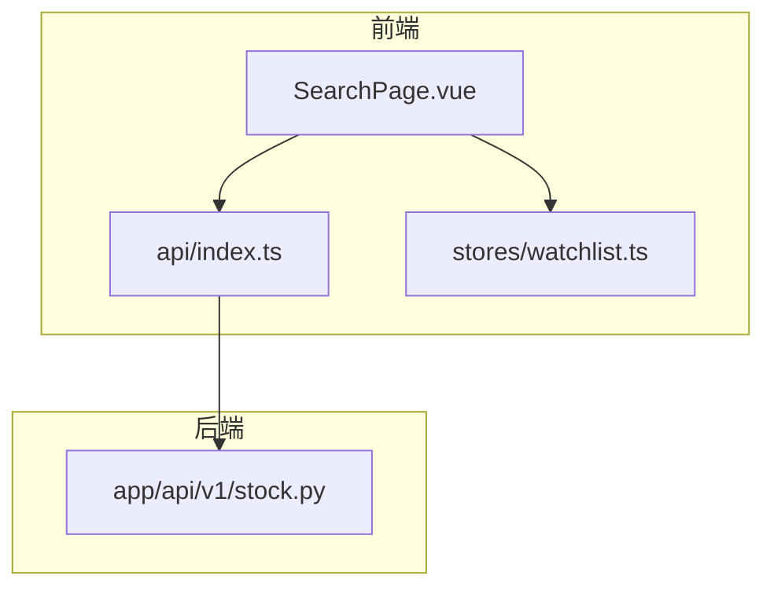
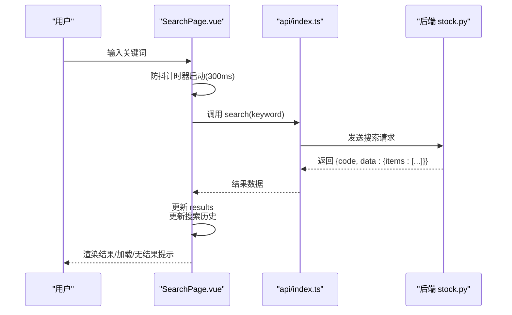
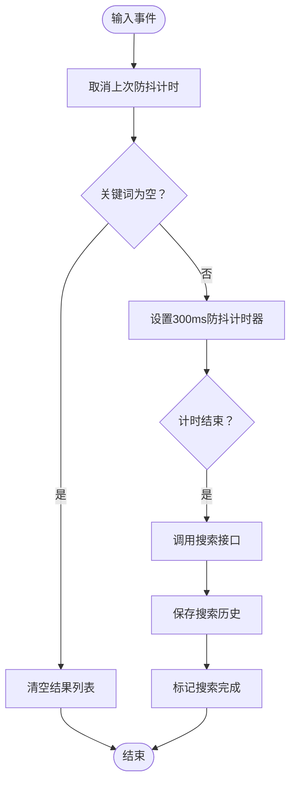
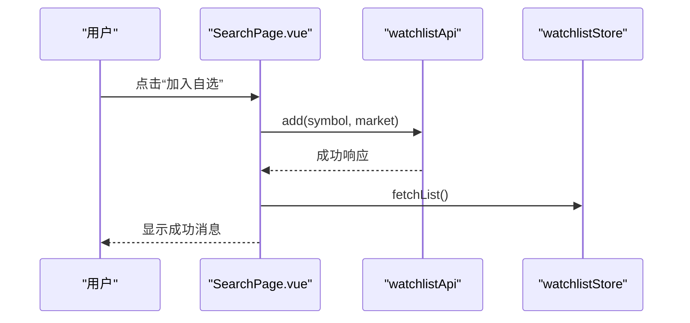
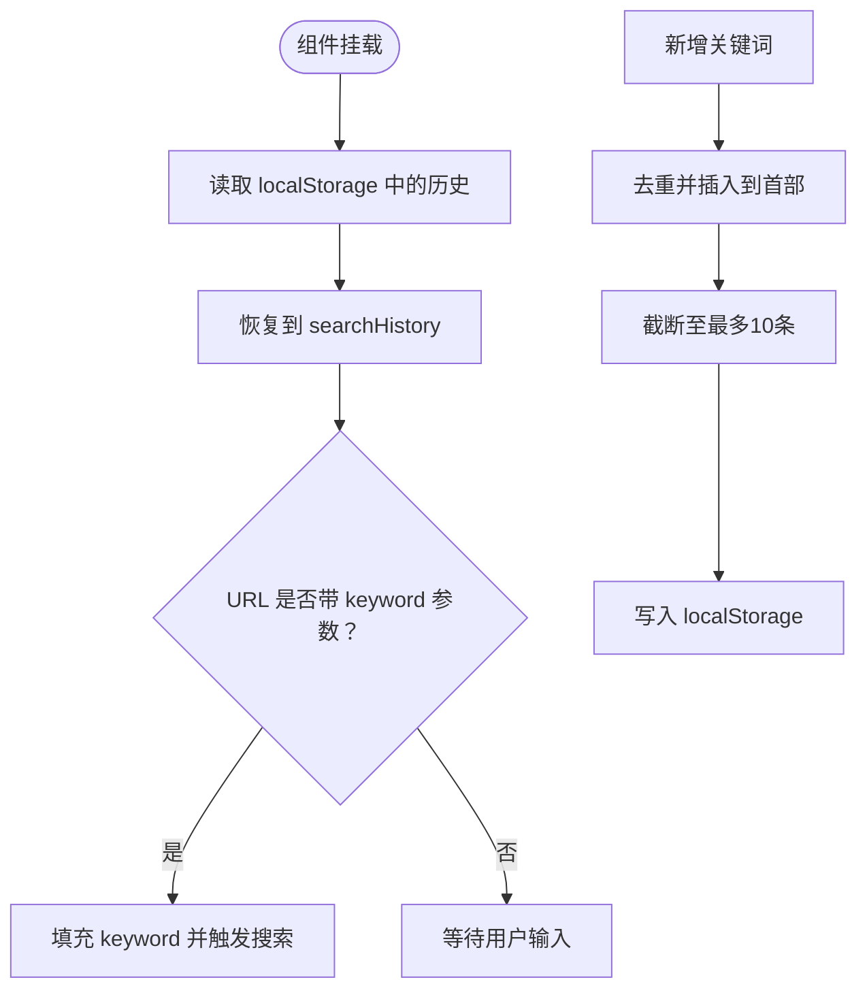
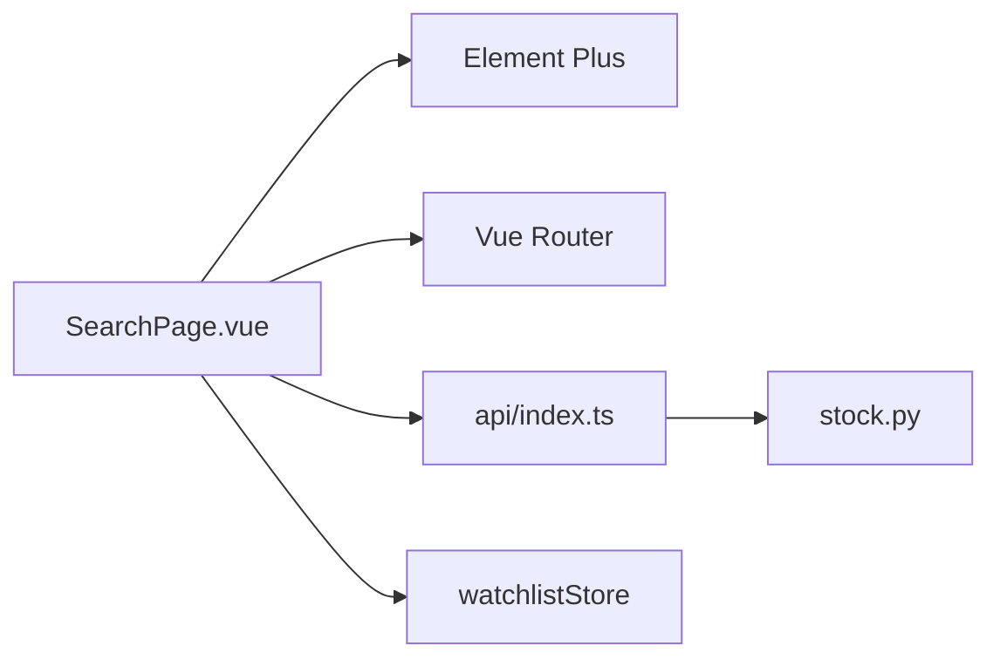

# 搜索页面组件

<cite>
**本文档引用的文件**
- [SearchPage.vue](file://frontend/src/pages/SearchPage.vue)
- [index.ts](file://frontend/src/api/index.ts)
- [stock.ts](file://backend/app/api/v1/stock.py)
</cite>

## 目录
1. [简介](#简介)
2. [项目结构](#项目结构)
3. [核心组件](#核心组件)
4. [架构总览](#架构总览)
5. [详细组件分析](#详细组件分析)
6. [依赖分析](#依赖分析)
7. [性能考虑](#性能考虑)
8. [故障排除指南](#故障排除指南)
9. [结论](#结论)
10. [附录](#附录)

## 简介
本文件针对 Stock-View 前端的搜索页面组件进行系统化技术文档编写，重点围绕 SearchPage.vue 的实现进行深入解析，涵盖以下方面：
- 搜索框设计与输入处理（含防抖）
- 搜索结果展示与交互（列表卡片、跳转、加自选）
- 搜索历史记录管理（本地存储、清空）
- 搜索功能实现细节（实时搜索、模糊匹配、排序）
- 热门搜索词推荐机制
- 性能优化策略（防抖、缓存、索引建议）
- 用户体验优化（加载状态、无结果提示、移动端适配）
- 后端接口对接与数据结构约定

## 项目结构
SearchPage.vue 位于前端页面目录，采用 Vue 3 Composition API 编写，配合 Element Plus 组件库与自定义样式实现交互与视觉效果；通过统一的 API 入口调用后端搜索接口。

**图表来源**
- [SearchPage.vue:1-140](file://frontend/src/pages/SearchPage.vue#L1-L140)
- [index.ts:1-200](file://frontend/src/api/index.ts#L1-L200)
- [stock.ts:1-200](file://backend/app/api/v1/stock.py#L1-L200)

**章节来源**
- [SearchPage.vue:1-140](file://frontend/src/pages/SearchPage.vue#L1-L140)

## 核心组件
- 搜索头部与输入框：支持关键词输入、清空按钮、自动聚焦与实时搜索触发。
- 搜索结果区域：关键词存在时展示股票结果卡片，包含代码、名称、市场标识与“加入自选”按钮；同时显示加载状态与无结果提示。
- 建议区域：当无关键词时展示搜索历史与热门股票推荐，支持一键回填与直达详情页。
- 状态与数据：关键词、结果列表、搜索中状态、搜索历史、热门股票列表。
- 交互行为：点击结果卡片跳转到个股详情页；点击“加入自选”调用自选接口并刷新自选列表；点击历史标签回填关键词并触发搜索。

**章节来源**
- [SearchPage.vue:1-68](file://frontend/src/pages/SearchPage.vue#L1-L68)
- [SearchPage.vue:70-140](file://frontend/src/pages/SearchPage.vue#L70-L140)

## 架构总览
SearchPage.vue 作为页面级组件，负责用户输入与结果展示；通过 API 层发起搜索请求，后端返回标准化数据结构；同时维护本地搜索历史并在路由参数中支持初始关键词注入。

**图表来源**
- [SearchPage.vue:95-109](file://frontend/src/pages/SearchPage.vue#L95-L109)
- [index.ts:1-200](file://frontend/src/api/index.ts#L1-L200)
- [stock.ts:1-200](file://backend/app/api/v1/stock.py#L1-L200)

## 详细组件分析

### 搜索框与输入处理
- 双向绑定关键词：使用 v-model 绑定 keyword，输入事件触发 doSearch。
- 防抖逻辑：每次输入前清理上一次定时器，仅在停止输入 300ms 后发起请求，避免频繁网络请求。
- 关键词为空时清空结果列表，防止残留旧数据。
- 自动聚焦与清空按钮：提升移动端与桌面端的输入体验。

**图表来源**
- [SearchPage.vue:95-109](file://frontend/src/pages/SearchPage.vue#L95-L109)
- [SearchPage.vue:111-116](file://frontend/src/pages/SearchPage.vue#L111-L116)

**章节来源**
- [SearchPage.vue:70-109](file://frontend/src/pages/SearchPage.vue#L70-L109)

### 搜索结果展示与交互
- 结果卡片布局：包含股票代码、名称、市场标识与“加入自选”按钮；鼠标悬停与点击交互增强可发现性。
- 跳转逻辑：点击卡片进入个股详情页；点击“加入自选”调用自选接口并提示成功消息，随后刷新自选列表。
- 加载与无结果状态：搜索中显示脉冲点与提示文本；无结果时提供友好文案与补充建议。

**图表来源**
- [SearchPage.vue:123-128](file://frontend/src/pages/SearchPage.vue#L123-L128)

**章节来源**
- [SearchPage.vue:17-40](file://frontend/src/pages/SearchPage.vue#L17-L40)
- [SearchPage.vue:123-128](file://frontend/src/pages/SearchPage.vue#L123-L128)

### 搜索历史记录管理
- 本地持久化：使用 localStorage 存储最近 10 条历史记录，键名为 search_history。
- 去重与顺序：新关键词插入到首位并去重，保持列表长度不超过 10。
- 清空历史：提供清除按钮，删除本地存储并清空内存中的历史数组。
- 初始化：组件挂载时从本地存储恢复历史，并支持从 URL 查询参数注入初始关键词。

**图表来源**
- [SearchPage.vue:111-116](file://frontend/src/pages/SearchPage.vue#L111-L116)
- [SearchPage.vue:118-121](file://frontend/src/pages/SearchPage.vue#L118-L121)
- [SearchPage.vue:130-139](file://frontend/src/pages/SearchPage.vue#L130-L139)

**章节来源**
- [SearchPage.vue:111-121](file://frontend/src/pages/SearchPage.vue#L111-L121)
- [SearchPage.vue:130-139](file://frontend/src/pages/SearchPage.vue#L130-L139)

### 热门搜索词与推荐机制
- 热门股票列表：在无关键词时展示固定热门股票集合，支持直接点击跳转到详情页。
- 推荐策略：当前为静态列表，后续可替换为基于后端统计的热门榜单或动态权重计算。

**章节来源**
- [SearchPage.vue:84-93](file://frontend/src/pages/SearchPage.vue#L84-L93)
- [SearchPage.vue:55-64](file://frontend/src/pages/SearchPage.vue#L55-L64)

### 数据结构与展示格式
- 搜索结果项字段：symbol（股票代码）、name（公司名称）、market（市场标识，如 sh/sz）。
- 列表渲染：以结果卡片形式展示，支持点击跳转与加入自选。
- 热门项字段：code（代码）、name（名称）。

**章节来源**
- [SearchPage.vue:19-30](file://frontend/src/pages/SearchPage.vue#L19-L30)
- [SearchPage.vue:58-63](file://frontend/src/pages/SearchPage.vue#L58-L63)

### 搜索算法与匹配策略
- 实时搜索：输入即触发防抖搜索，提升交互即时感。
- 匹配类型：当前实现为后端提供的模糊匹配，前端不做额外字符串处理。
- 排序规则：由后端返回 items 数组的顺序决定，前端不进行二次排序。
- 建议：若需更精细的匹配（如拼音首字母、代码前缀），可在后端增加权重排序或前端引入轻量索引（见性能考虑）。

**章节来源**
- [SearchPage.vue:95-109](file://frontend/src/pages/SearchPage.vue#L95-L109)

## 依赖分析
- 组件依赖
  - Element Plus：用于消息提示与按钮组件。
  - Vue Router：用于跳转到个股详情页。
  - 自定义 API 封装：统一管理后端接口调用。
  - 自选 Store：用于刷新自选列表。
- 外部依赖
  - 后端 stock.py 提供搜索接口，返回标准化数据结构。

**图表来源**
- [SearchPage.vue:70-75](file://frontend/src/pages/SearchPage.vue#L70-L75)
- [index.ts:1-200](file://frontend/src/api/index.ts#L1-L200)
- [stock.ts:1-200](file://backend/app/api/v1/stock.py#L1-L200)

**章节来源**
- [SearchPage.vue:70-75](file://frontend/src/pages/SearchPage.vue#L70-L75)

## 性能考虑
- 防抖优化：300ms 防抖有效降低请求频率，建议根据网络与设备性能调整阈值。
- 请求合并：在短时间内连续输入时，确保只保留最后一次请求，避免竞态。
- 缓存策略：对热门关键词与近期结果进行内存缓存，减少重复请求；结合本地存储实现跨会话缓存。
- 索引建立：前端可构建轻量索引（如前缀树/倒排索引）加速本地模糊匹配，降低后端压力。
- 分页与限流：后端应限制单次搜索返回数量并设置速率限制，避免超大响应。
- 图片与渲染：结果卡片中避免不必要的重绘，使用虚拟滚动处理长列表。

[本节为通用性能建议，无需特定文件引用]

## 故障排除指南
- 搜索无结果
  - 检查关键词是否为空或过短；确认后端接口可用与返回码。
  - 查看前端 loading 状态与无结果提示是否正确显示。
- 加入自选失败
  - 确认 watchlist 接口返回状态与错误信息；检查用户登录状态与权限。
  - 观察 Element Plus 消息提示是否正常弹出。
- 历史记录异常
  - 检查 localStorage 写入与读取逻辑；确认去重与截断操作是否按预期执行。
  - 若出现历史为空，确认组件挂载时的初始化流程。
- 移动端体验问题
  - 输入框焦点与软键盘遮挡：确保容器可滚动且输入框可见。
  - 点击反馈：检查 hover 与 active 样式在触摸设备上的表现。

**章节来源**
- [SearchPage.vue:35-39](file://frontend/src/pages/SearchPage.vue#L35-L39)
- [SearchPage.vue:123-128](file://frontend/src/pages/SearchPage.vue#L123-L128)
- [SearchPage.vue:111-116](file://frontend/src/pages/SearchPage.vue#L111-L116)
- [SearchPage.vue:130-139](file://frontend/src/pages/SearchPage.vue#L130-L139)

## 结论
SearchPage.vue 通过简洁的模板与组合式 API 实现了高效的搜索体验：防抖控制请求频率、本地历史持久化提升召回率、结果卡片与热门推荐增强可发现性。建议后续在后端完善搜索排序与权重、前端引入轻量索引与缓存，并持续优化移动端交互细节，以进一步提升性能与用户体验。

[本节为总结性内容，无需特定文件引用]

## 附录
- 接口约定（参考）
  - 搜索接口：接收 keyword，返回 { code, data: { items: [{ symbol, name, market? }] } }
  - 加自选接口：接收 symbol 与 market，返回标准响应
- 最佳实践清单
  - 防抖时间：根据场景选择 200–500ms
  - 历史上限：建议 10–20 条
  - 错误处理：统一拦截与提示，避免静默失败
  - 移动端：增大点击热区、优化键盘遮挡、减少重排重绘

[本节为概念性附录，无需特定文件引用]