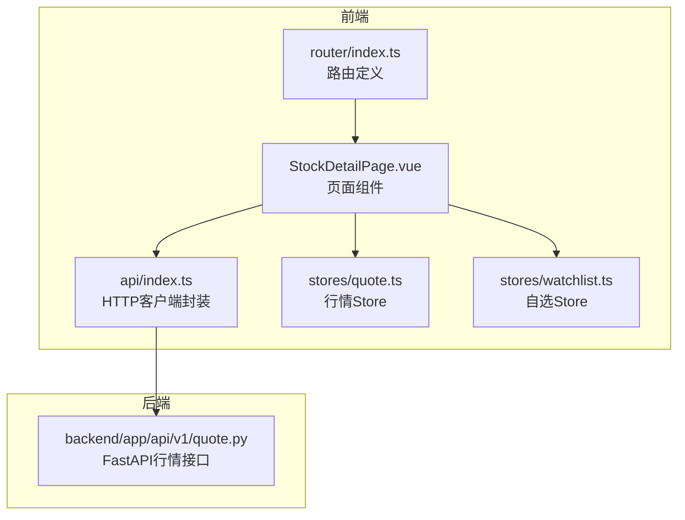
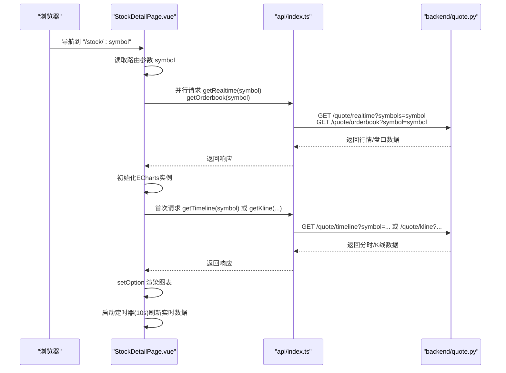
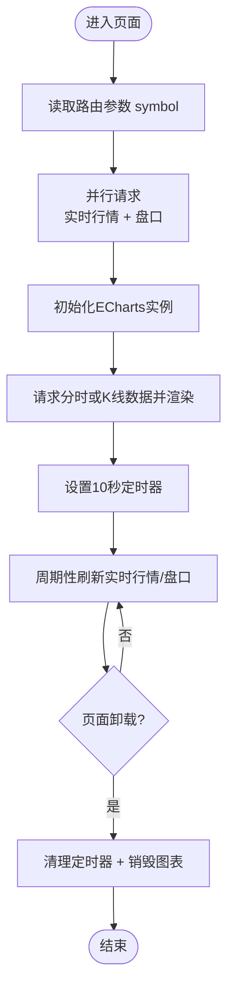
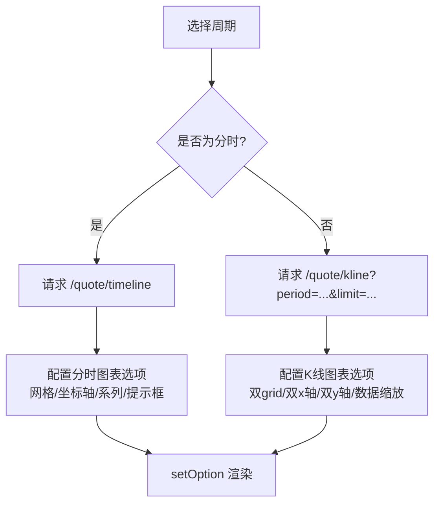
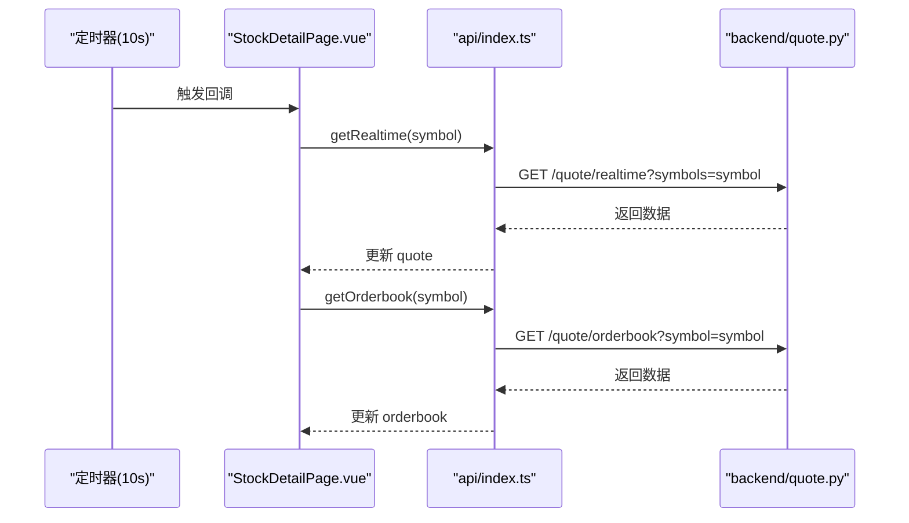
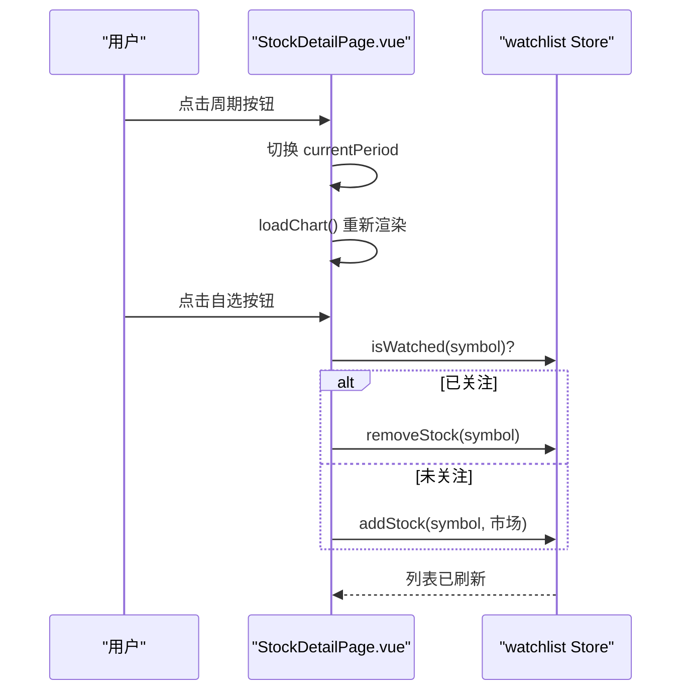
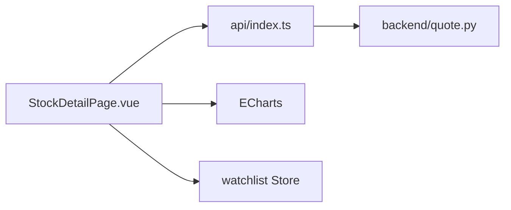

# 股票详情页面组件

<cite>
**本文引用的文件**
- [StockDetailPage.vue](file://frontend/src/pages/StockDetailPage.vue)
- [index.ts](file://frontend/src/api/index.ts)
- [index.ts](file://frontend/src/router/index.ts)
- [quote.ts](file://frontend/src/stores/quote.ts)
- [watchlist.ts](file://frontend/src/stores/watchlist.ts)
- [quote.py](file://backend/app/api/v1/quote.py)
</cite>

## 目录
1. [简介](#简介)
2. [项目结构](#项目结构)
3. [核心组件](#核心组件)
4. [架构总览](#架构总览)
5. [详细组件分析](#详细组件分析)
6. [依赖关系分析](#依赖关系分析)
7. [性能考虑](#性能考虑)
8. [故障排查指南](#故障排查指南)
9. [结论](#结论)
10. [附录](#附录)

## 简介
本文件面向Stock-View项目的“股票详情页面”组件，系统化梳理StockDetailPage.vue的功能与实现，包括：
- 股票基本信息展示与格式化
- 实时行情与盘口数据拉取与展示
- 技术图表集成（分时图与K线图/成交量）
- 数据流与控制流（路由参数 → API → 图表渲染）
- 实时更新机制与用户交互（周期切换、缩放）
- 性能优化、缓存策略、错误处理与加载状态管理

## 项目结构
StockDetailPage.vue位于前端src/pages目录下，作为路由“/stock/:symbol”的页面组件；其通过API层与后端FastAPI服务交互，并使用ECharts进行可视化渲染。

**图表来源**
- [StockDetailPage.vue:140-335](file://frontend/src/pages/StockDetailPage.vue#L140-L335)
- [index.ts:1-33](file://frontend/src/api/index.ts#L1-L33)
- [index.ts:1-14](file://frontend/src/router/index.ts#L1-L14)
- [quote.ts:1-43](file://frontend/src/stores/quote.ts#L1-L43)
- [watchlist.ts:1-36](file://frontend/src/stores/watchlist.ts#L1-L36)
- [quote.py:1-65](file://backend/app/api/v1/quote.py#L1-L65)

**章节来源**
- [StockDetailPage.vue:1-590](file://frontend/src/pages/StockDetailPage.vue#L1-L590)
- [index.ts:1-33](file://frontend/src/api/index.ts#L1-L33)
- [index.ts:1-14](file://frontend/src/router/index.ts#L1-L14)
- [quote.py:1-65](file://backend/app/api/v1/quote.py#L1-L65)

## 核心组件
- 页面主体：包含头部信息区、图表区、右侧面板（五档盘口、行情数据、AI智能分析）。
- 图表容器：通过ECharts初始化并根据周期动态切换分时图或K线图/成交量。
- 数据源：实时行情、分时、K线、盘口均由API封装统一调用。
- 状态管理：自选列表通过Pinia Store维护，支持添加/移除/查询。
- 路由参数：通过路由参数获取股票代码symbol，作为所有请求的关键标识。

**章节来源**
- [StockDetailPage.vue:1-138](file://frontend/src/pages/StockDetailPage.vue#L1-L138)
- [StockDetailPage.vue:140-335](file://frontend/src/pages/StockDetailPage.vue#L140-L335)
- [index.ts:8-14](file://frontend/src/api/index.ts#L8-L14)
- [watchlist.ts:5-36](file://frontend/src/stores/watchlist.ts#L5-L36)

## 架构总览
页面采用“组件内聚合+外部API”的模式：组件在挂载时并行拉取实时行情与盘口，随后初始化图表；定时器每10秒刷新一次实时数据；用户切换周期时重新请求对应数据并重绘图表。

**图表来源**
- [StockDetailPage.vue:188-334](file://frontend/src/pages/StockDetailPage.vue#L188-L334)
- [index.ts:8-14](file://frontend/src/api/index.ts#L8-L14)
- [quote.py:7-65](file://backend/app/api/v1/quote.py#L7-L65)

## 详细组件分析

### 页面数据流与生命周期
- 路由参数获取：从路由参数读取symbol，作为后续所有请求的股票标识。
- 并行加载：进入页面后并行请求实时行情与盘口，提升首屏速度。
- 图表初始化：首次渲染前确保DOM可用，使用canvas渲染器初始化ECharts实例。
- 定时刷新：每10秒刷新一次实时行情与盘口，维持界面信息新鲜度。
- 卸载清理：离开页面时清理定时器与销毁ECharts实例，避免内存泄漏。

**图表来源**
- [StockDetailPage.vue:147-334](file://frontend/src/pages/StockDetailPage.vue#L147-L334)

**章节来源**
- [StockDetailPage.vue:188-334](file://frontend/src/pages/StockDetailPage.vue#L188-L334)

### 图表组件集成与配置
- 分时图（timeline）：单主图，包含分时价格线与均价线，启用面积填充与网格配置，tooltip按轴触发。
- K线图（K线+成交量）：双grid布局，上图为K线与价格轴，下图为成交量与交易量轴；支持内部缩放与滑轨缩放；K线颜色区分涨跌，成交量柱状图随收盘价涨跌变色。
- 交互能力：十字光标、缩放、提示框样式统一为主题色系。

**图表来源**
- [StockDetailPage.vue:198-294](file://frontend/src/pages/StockDetailPage.vue#L198-L294)
- [index.ts:9-13](file://frontend/src/api/index.ts#L9-L13)
- [quote.py:36-65](file://backend/app/api/v1/quote.py#L36-L65)

**章节来源**
- [StockDetailPage.vue:198-294](file://frontend/src/pages/StockDetailPage.vue#L198-L294)

### 实时数据更新机制
- 定时器：每10秒执行一次实时行情与盘口刷新，保证价格与买卖盘口的时效性。
- 刷新策略：仅在页面可见且存在实例时生效，避免后台刷新造成资源浪费。
- 错误容错：API调用失败不影响其他流程，页面保持稳定。

**图表来源**
- [StockDetailPage.vue:319-334](file://frontend/src/pages/StockDetailPage.vue#L319-L334)
- [index.ts:9-13](file://frontend/src/api/index.ts#L9-L13)
- [quote.py:7-16](file://backend/app/api/v1/quote.py#L7-L16)

**章节来源**
- [StockDetailPage.vue:319-334](file://frontend/src/pages/StockDetailPage.vue#L319-L334)

### 用户操作处理
- 时间范围切换：点击周期按钮（分时/5分/15分/日K/周K/月K），切换currentPeriod并重新请求对应数据，随后setOption重绘。
- 图表缩放：内置dataZoom支持平移与缩放，滑轨可微调视图范围。
- 自选操作：点击“加自选/已自选”按钮，调用watchlist Store进行添加或移除，并刷新自选列表。

**图表来源**
- [StockDetailPage.vue:296-317](file://frontend/src/pages/StockDetailPage.vue#L296-L317)
- [watchlist.ts:5-36](file://frontend/src/stores/watchlist.ts#L5-L36)

**章节来源**
- [StockDetailPage.vue:296-317](file://frontend/src/pages/StockDetailPage.vue#L296-L317)
- [watchlist.ts:5-36](file://frontend/src/stores/watchlist.ts#L5-L36)

### 数据格式与展示
- 实时行情：包含名称、代码、当前价、涨跌额、涨跌幅等，支持正负颜色类切换。
- 盘口数据：五档卖盘与五档买盘，分别展示价格与委托量。
- 行情数据：今开、最高、昨收、最低、成交量、成交额、换手率等。
- AI分析：趋势、置信度、摘要与风险等级，按钮触发分析并展示结果。

**章节来源**
- [StockDetailPage.vue:4-137](file://frontend/src/pages/StockDetailPage.vue#L4-L137)
- [StockDetailPage.vue:301-309](file://frontend/src/pages/StockDetailPage.vue#L301-L309)

## 依赖关系分析
- 组件依赖：StockDetailPage.vue依赖路由参数、API封装、ECharts、Pinia Store（自选）。
- API依赖：quoteApi封装了实时、列表、K线、分时、盘口等接口；aiApi用于AI分析。
- 后端依赖：quote.py提供统一的行情数据接口，支持分时、K线、盘口与列表查询。

**图表来源**
- [StockDetailPage.vue:140-335](file://frontend/src/pages/StockDetailPage.vue#L140-L335)
- [index.ts:1-33](file://frontend/src/api/index.ts#L1-L33)
- [quote.py:1-65](file://backend/app/api/v1/quote.py#L1-L65)

**章节来源**
- [StockDetailPage.vue:140-335](file://frontend/src/pages/StockDetailPage.vue#L140-L335)
- [index.ts:1-33](file://frontend/src/api/index.ts#L1-L33)
- [quote.py:1-65](file://backend/app/api/v1/quote.py#L1-L65)

## 性能考虑
- 渲染器选择：使用Canvas渲染器，适合大数据量K线场景，减少GPU压力。
- 动画关闭：禁用动画提升初次渲染与频繁刷新时的流畅度。
- 并行加载：实时行情与盘口并行请求，缩短首屏等待时间。
- 定时刷新节流：10秒间隔平衡实时性与网络负载。
- 图表重绘优化：通过setOption增量更新，避免重复初始化。
- 内存释放：页面卸载时销毁图表实例，防止内存泄漏。

[本节为通用性能建议，不直接分析具体文件，故无“章节来源”]

## 故障排查指南
- 接口返回异常
  - 现象：页面空白或部分区域无数据。
  - 排查：确认后端quote.py接口返回code为0；检查前端API封装中的URL与参数。
  - 参考路径：[quote.py:7-65](file://backend/app/api/v1/quote.py#L7-L65)，[index.ts:8-14](file://frontend/src/api/index.ts#L8-L14)
- 图表不显示
  - 现象：图表容器为空白。
  - 排查：确认chartRef已绑定、DOM已渲染、ECharts实例已初始化；检查setOption传入数据格式。
  - 参考路径：[StockDetailPage.vue:198-294](file://frontend/src/pages/StockDetailPage.vue#L198-L294)
- 实时刷新无效
  - 现象：价格与盘口不更新。
  - 排查：确认定时器存在且未被清理；检查API返回数据结构与字段映射。
  - 参考路径：[StockDetailPage.vue:319-334](file://frontend/src/pages/StockDetailPage.vue#L319-L334)
- 自选操作失败
  - 现象：点击“加自选/已自选”无变化。
  - 排查：确认watchlist Store方法调用成功并刷新列表。
  - 参考路径：[watchlist.ts:5-36](file://frontend/src/stores/watchlist.ts#L5-L36)

**章节来源**
- [quote.py:7-65](file://backend/app/api/v1/quote.py#L7-L65)
- [index.ts:8-14](file://frontend/src/api/index.ts#L8-L14)
- [StockDetailPage.vue:198-294](file://frontend/src/pages/StockDetailPage.vue#L198-L294)
- [StockDetailPage.vue:319-334](file://frontend/src/pages/StockDetailPage.vue#L319-L334)
- [watchlist.ts:5-36](file://frontend/src/stores/watchlist.ts#L5-L36)

## 结论
StockDetailPage.vue通过清晰的数据流设计与ECharts的灵活配置，实现了从路由参数到实时数据再到图表渲染的完整闭环。组件在性能与体验之间取得平衡：并行加载、定时刷新、禁用动画与Canvas渲染器有效降低了渲染成本；同时，周期切换与缩放交互提升了用户的分析效率。建议在后续迭代中引入更细粒度的错误处理与缓存策略，进一步增强稳定性与性能表现。

[本节为总结性内容，不直接分析具体文件，故无“章节来源”]

## 附录
- 路由定义：页面路由“/stock/:symbol”指向StockDetailPage.vue。
- API接口：实时、列表、K线、分时、盘口、自选等接口均在api/index.ts中封装。
- 后端接口：quote.py提供统一的行情数据入口，支持多周期与多类型数据。

**章节来源**
- [index.ts:1-14](file://frontend/src/router/index.ts#L1-L14)
- [index.ts:8-31](file://frontend/src/api/index.ts#L8-L31)
- [quote.py:7-65](file://backend/app/api/v1/quote.py#L7-L65)