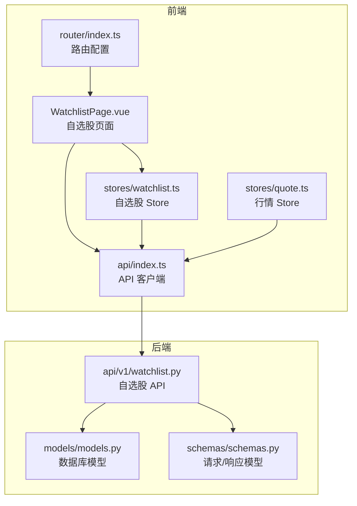
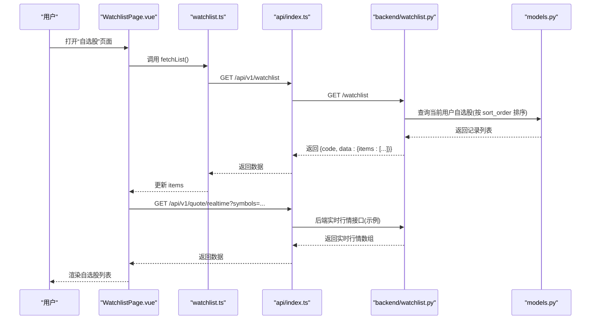
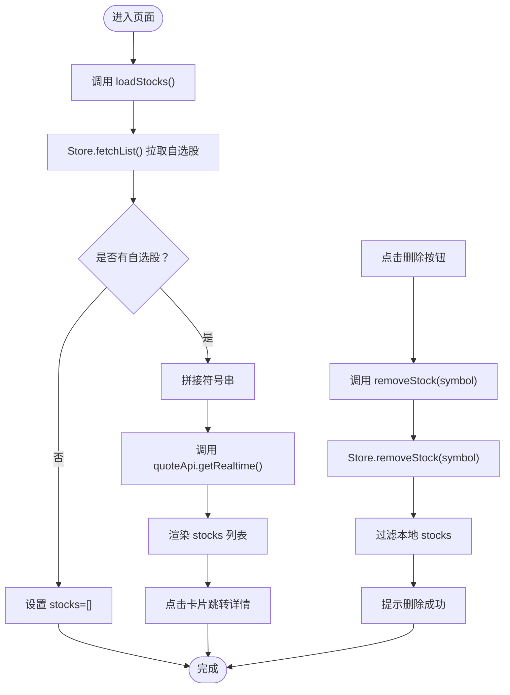
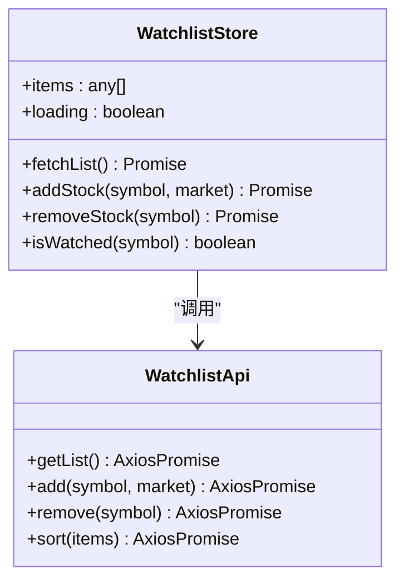
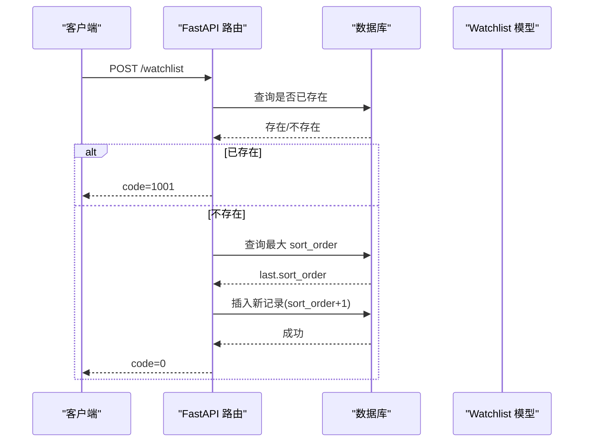
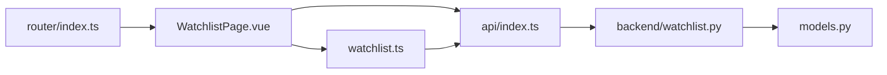

# 自选股页面组件

<cite>
**本文引用的文件**
- [WatchlistPage.vue](file://frontend/src/pages/WatchlistPage.vue)
- [watchlist.ts](file://frontend/src/stores/watchlist.ts)
- [index.ts](file://frontend/src/api/index.ts)
- [watchlist.py](file://backend/app/api/v1/watchlist.py)
- [models.py](file://backend/app/models/models.py)
- [schemas.py](file://backend/app/schemas/schemas.py)
- [MarketPage.vue](file://frontend/src/pages/MarketPage.vue)
- [quote.ts](file://frontend/src/stores/quote.ts)
- [index.ts](file://frontend/src/router/index.ts)
</cite>

## 目录
1. [简介](#简介)
2. [项目结构](#项目结构)
3. [核心组件](#核心组件)
4. [架构总览](#架构总览)
5. [详细组件分析](#详细组件分析)
6. [依赖关系分析](#依赖关系分析)
7. [性能考虑](#性能考虑)
8. [故障排查指南](#故障排查指南)
9. [结论](#结论)
10. [附录](#附录)

## 简介
本文件针对 Stock-View 前端的自选股页面组件进行系统化技术文档编写，重点覆盖以下方面：
- 自选股列表的展示与管理
- 自选股的添加与删除流程
- 自选股的分组与排序能力现状与扩展建议
- 页面状态管理（列表、加载、错误）
- 用户交互处理（点击跳转、单个删除）
- 与后端 API 的交互流程
- 实时行情数据拉取与展示
- 数据一致性与本地存储/同步机制
- 列表性能优化、无限滚动、批量操作与数据一致性保障的技术方案

## 项目结构
自选股页面位于前端目录，采用 Vue 3 + TypeScript + Pinia 架构；后端使用 FastAPI 提供 REST 接口。页面通过路由进入，依赖 Pinia Store 管理自选股状态，并通过 API 模块调用后端接口。

图表来源
- [WatchlistPage.vue:1-262](file://frontend/src/pages/WatchlistPage.vue#L1-L262)
- [watchlist.ts:1-36](file://frontend/src/stores/watchlist.ts#L1-L36)
- [index.ts:1-33](file://frontend/src/api/index.ts#L1-L33)
- [MarketPage.vue:1-200](file://frontend/src/pages/MarketPage.vue#L1-L200)
- [quote.ts:1-43](file://frontend/src/stores/quote.ts#L1-L43)
- [index.ts:1-14](file://frontend/src/router/index.ts#L1-L14)
- [watchlist.py:1-77](file://backend/app/api/v1/watchlist.py#L1-L77)
- [models.py:50-60](file://backend/app/models/models.py#L50-L60)
- [schemas.py:78-91](file://backend/app/schemas/schemas.py#L78-L91)

章节来源
- [WatchlistPage.vue:1-262](file://frontend/src/pages/WatchlistPage.vue#L1-L262)
- [watchlist.ts:1-36](file://frontend/src/stores/watchlist.ts#L1-L36)
- [index.ts:1-33](file://frontend/src/api/index.ts#L1-L33)
- [index.ts:1-14](file://frontend/src/router/index.ts#L1-L14)
- [watchlist.py:1-77](file://backend/app/api/v1/watchlist.py#L1-L77)
- [models.py:50-60](file://backend/app/models/models.py#L50-L60)
- [schemas.py:78-91](file://backend/app/schemas/schemas.py#L78-L91)
- [MarketPage.vue:1-200](file://frontend/src/pages/MarketPage.vue#L1-L200)
- [quote.ts:1-43](file://frontend/src/stores/quote.ts#L1-L43)

## 核心组件
- 自选股页面组件：负责渲染自选股列表、空状态、删除按钮、跳转详情等交互。
- 自选股 Store：封装自选股列表的获取、添加、删除、查询是否已关注等逻辑。
- API 客户端：封装 /api/v1 下的 quote、stock、watchlist 等接口调用。
- 后端自选股 API：提供获取、新增、删除、排序等接口，基于 SQLAlchemy 异步会话访问数据库。
- 数据库模型：包含 Watchlist 表，支持用户 ID、股票符号、市场、排序字段等。
- 路由：将 /watchlist 映射到 WatchlistPage.vue。

章节来源
- [WatchlistPage.vue:64-103](file://frontend/src/pages/WatchlistPage.vue#L64-L103)
- [watchlist.ts:5-36](file://frontend/src/stores/watchlist.ts#L5-L36)
- [index.ts:20-25](file://frontend/src/api/index.ts#L20-L25)
- [watchlist.py:13-77](file://backend/app/api/v1/watchlist.py#L13-L77)
- [models.py:50-60](file://backend/app/models/models.py#L50-L60)
- [index.ts:9](file://frontend/src/router/index.ts#L9)

## 架构总览
自选股页面的数据流从页面挂载开始，先通过 Store 获取自选股列表，再根据列表中的股票符号批量拉取实时行情，最终渲染到页面。删除操作通过 Store 调用后端接口并同步更新本地列表。

图表来源
- [WatchlistPage.vue:83-94](file://frontend/src/pages/WatchlistPage.vue#L83-L94)
- [watchlist.ts:9-19](file://frontend/src/stores/watchlist.ts#L9-L19)
- [index.ts:20-25](file://frontend/src/api/index.ts#L20-L25)
- [watchlist.py:13-26](file://backend/app/api/v1/watchlist.py#L13-L26)
- [models.py:50-60](file://backend/app/models/models.py#L50-L60)

## 详细组件分析

### WatchlistPage.vue 组件
职责与行为
- 展示页面标题、数量统计与“添加自选”入口。
- 使用 v-loading 显示加载状态。
- 遍历 stocks 渲染股票卡片，点击卡片跳转到个股详情页。
- 单个删除：点击“✕”按钮触发 removeStock，调用 Store 删除并同步更新本地列表，提示成功消息。
- 空状态：当列表为空且非加载时显示空状态引导。

关键函数与交互
- loadStocks：拉取自选股列表，拼接符号串调用实时行情接口，填充 stocks。
- removeStock：调用 Store.removeStock，过滤掉被删除的股票并提示。
- getColorClass/formatPrice：用于涨跌颜色与价格格式化。

图表来源
- [WatchlistPage.vue:83-100](file://frontend/src/pages/WatchlistPage.vue#L83-L100)
- [watchlist.ts:26-29](file://frontend/src/stores/watchlist.ts#L26-L29)

章节来源
- [WatchlistPage.vue:1-262](file://frontend/src/pages/WatchlistPage.vue#L1-L262)
- [WatchlistPage.vue:64-103](file://frontend/src/pages/WatchlistPage.vue#L64-L103)

### 自选股 Store（watchlist.ts）
职责与行为
- 维护 items 和 loading 状态。
- 提供 fetchList：调用后端接口获取自选股列表并写入 items。
- 提供 addStock/removeStock：调用后端接口后重新拉取列表以保持一致性。
- 提供 isWatched：判断某股票是否已在自选股中。

图表来源
- [watchlist.ts:5-36](file://frontend/src/stores/watchlist.ts#L5-L36)
- [index.ts:20-25](file://frontend/src/api/index.ts#L20-L25)

章节来源
- [watchlist.ts:1-36](file://frontend/src/stores/watchlist.ts#L1-L36)

### API 客户端（index.ts）
职责与行为
- 创建 axios 实例，统一设置 baseURL 与超时。
- 导出 watchlistApi：提供 getList/add/remove/sort。
- 导出 quoteApi：提供 getRealtime/getList/getKline/getTimeline/getOrderbook。
- 导出 stockApi：提供 search。

章节来源
- [index.ts:1-33](file://frontend/src/api/index.ts#L1-L33)

### 后端自选股 API（watchlist.py）
职责与行为
- GET /watchlist：按用户 ID 查询自选股并按 sort_order 升序返回。
- POST /watchlist：新增自选股，若重复则返回错误码；否则计算最大排序号+1插入。
- DELETE /watchlist/{symbol}：按用户 ID 与符号删除。
- PUT /watchlist/sort：批量更新排序，逐项查找并更新 sort_order。

图表来源
- [watchlist.py:29-51](file://backend/app/api/v1/watchlist.py#L29-L51)

章节来源
- [watchlist.py:1-77](file://backend/app/api/v1/watchlist.py#L1-L77)

### 数据模型与请求/响应（models.py、schemas.py）
- Watchlist 模型包含 user_id、symbol、market、sort_order、group_name、added_at 等字段。
- WatchlistAddRequest 定义新增请求体字段。
- WatchlistSortRequest 定义排序批量请求体，包含 items 列表。

章节来源
- [models.py:50-60](file://backend/app/models/models.py#L50-L60)
- [schemas.py:78-91](file://backend/app/schemas/schemas.py#L78-L91)

### 与行情系统的集成（MarketPage.vue 与 quote.ts）
- MarketPage.vue 中自选股侧栏同样调用 Store.fetchList 并批量拉取实时行情，展示自选股列表。
- quote.ts 提供 fetchList/fetchRealtime/updateQuote 等方法，支持行情列表与实时更新。

章节来源
- [MarketPage.vue:193-200](file://frontend/src/pages/MarketPage.vue#L193-L200)
- [quote.ts:11-30](file://frontend/src/stores/quote.ts#L11-L30)

## 依赖关系分析
- WatchlistPage.vue 依赖 Pinia Store（watchlist.ts）与 API 客户端（index.ts），并通过路由跳转到个股详情页。
- watchlist.ts 依赖 watchlistApi，负责与后端交互并维护本地状态。
- 后端 watchlist.py 依赖数据库会话与 Watchlist 模型，遵循用户维度与排序规则。
- 路由将 /watchlist 映射到 WatchlistPage.vue，确保页面可直接访问。

图表来源
- [WatchlistPage.vue:64-103](file://frontend/src/pages/WatchlistPage.vue#L64-L103)
- [watchlist.ts:1-36](file://frontend/src/stores/watchlist.ts#L1-L36)
- [index.ts:1-33](file://frontend/src/api/index.ts#L1-L33)
- [watchlist.py:1-77](file://backend/app/api/v1/watchlist.py#L1-L77)
- [models.py:50-60](file://backend/app/models/models.py#L50-L60)
- [index.ts:9](file://frontend/src/router/index.ts#L9)

章节来源
- [WatchlistPage.vue:64-103](file://frontend/src/pages/WatchlistPage.vue#L64-L103)
- [watchlist.ts:1-36](file://frontend/src/stores/watchlist.ts#L1-L36)
- [index.ts:1-33](file://frontend/src/api/index.ts#L1-L33)
- [watchlist.py:1-77](file://backend/app/api/v1/watchlist.py#L1-L77)
- [models.py:50-60](file://backend/app/models/models.py#L50-L60)
- [index.ts:1-14](file://frontend/src/router/index.ts#L1-L14)

## 性能考虑
- 列表渲染优化
  - 使用 v-for 渲染股票卡片，结合 key 为 symbol，避免不必要的重排。
  - 将格式化与颜色类计算放在组件内，减少模板复杂度。
- 批量请求与去抖
  - 当前按 items.length 拼接符号串一次性请求实时行情，建议在高频刷新场景下增加防抖或节流策略，避免频繁网络请求。
- 内存与状态
  - Store 中仅缓存 items 与 loading，不缓存大量历史行情，降低内存占用。
- 渲染性能
  - 使用 v-loading 在加载时占位，避免空白闪烁。
  - 点击卡片跳转使用原生 router-link，减少额外事件处理。

[本节为通用性能建议，无需特定文件引用]

## 故障排查指南
- 自选股列表为空
  - 检查 Store.fetchList 是否正确返回 items。
  - 检查后端 GET /watchlist 是否返回 code=0 且 data.items 存在。
- 删除无效
  - 确认 removeStock 调用后 Store.removeStock 已执行并重新 fetchList。
  - 确认前端过滤逻辑已移除对应 symbol。
- 实时行情未更新
  - 确认 WatchlistPage.vue 中 loadStocks 已在 onMounted 触发。
  - 确认 quoteApi.getRealtime 返回的 items 数量与符号匹配。
- 排序与分组
  - 当前 Store 未暴露 sort 接口，页面也不具备拖拽排序 UI；如需排序，可在 Store 中补充 sort 方法并在页面增加拖拽容器组件。

章节来源
- [WatchlistPage.vue:83-100](file://frontend/src/pages/WatchlistPage.vue#L83-L100)
- [watchlist.ts:26-29](file://frontend/src/stores/watchlist.ts#L26-L29)
- [watchlist.py:13-26](file://backend/app/api/v1/watchlist.py#L13-L26)

## 结论
- WatchlistPage.vue 已实现自选股列表的基本展示与删除功能，通过 Store 与 API 客户端完成前后端交互。
- 后端提供完善的自选股 CRUD 与排序接口，遵循用户维度与排序规则。
- 当前页面未实现拖拽排序与分组功能，后续可扩展 Store 的 sort 方法与页面拖拽容器组件。
- 建议引入防抖/节流、批量操作与数据一致性校验，进一步提升用户体验与系统稳定性。

[本节为总结性内容，无需特定文件引用]

## 附录

### 页面状态管理与用户交互
- 状态
  - stocks：当前渲染的自选股列表（来自实时行情接口）。
  - loading：页面加载状态。
  - items：Store 中持久化的自选股列表。
- 交互
  - 点击卡片跳转至个股详情页。
  - 点击“✕”删除单个自选股，成功后提示消息。

章节来源
- [WatchlistPage.vue:71-100](file://frontend/src/pages/WatchlistPage.vue#L71-L100)
- [watchlist.ts:6-36](file://frontend/src/stores/watchlist.ts#L6-L36)

### 与后端 API 的交互流程（要点）
- 获取自选股：GET /api/v1/watchlist → 返回 items。
- 新增自选股：POST /api/v1/watchlist（body：{symbol, market}）。
- 删除自选股：DELETE /api/v1/watchlist/{symbol}。
- 批量排序：PUT /api/v1/watchlist/sort（body：[{symbol, sort_order}]）。

章节来源
- [index.ts:20-25](file://frontend/src/api/index.ts#L20-L25)
- [watchlist.py:13-77](file://backend/app/api/v1/watchlist.py#L13-L77)

### 数据一致性与本地存储/同步机制
- 一致性
  - Store 在新增/删除后立即重新 fetchList，确保 items 与后端一致。
  - 页面在加载时先拉取 items，再批量拉取实时行情，保证渲染数据来源一致。
- 本地存储
  - 当前未发现本地持久化（如 localStorage/sessionStorage）实现；如需离线体验，可在 Store 中增加本地缓存与同步策略。

章节来源
- [watchlist.ts:21-29](file://frontend/src/stores/watchlist.ts#L21-L29)
- [WatchlistPage.vue:83-94](file://frontend/src/pages/WatchlistPage.vue#L83-L94)

### 技术方案建议
- 拖拽排序与分组
  - 在 Store 中新增 sort 方法，调用 PUT /watchlist/sort。
  - 在页面引入拖拽容器组件，支持拖拽后提交排序变更。
- 批量操作
  - 增加批量删除与批量刷新功能，减少多次请求。
- 实时行情更新
  - 在 MarketPage.vue 的定时器基础上，为自选股侧栏与 WatchlistPage.vue 增加统一的行情轮询与去抖策略。
- 无限滚动
  - 若未来列表规模扩大，可考虑在 MarketPage.vue 的分页基础上，为 WatchlistPage.vue 增加虚拟滚动或懒加载策略（当前列表较小，暂不需要）。

[本节为扩展性建议，无需特定文件引用]