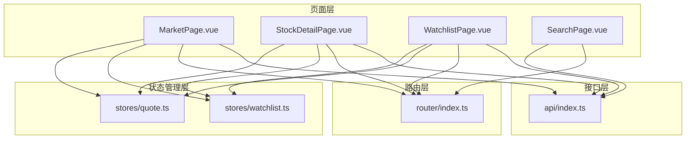
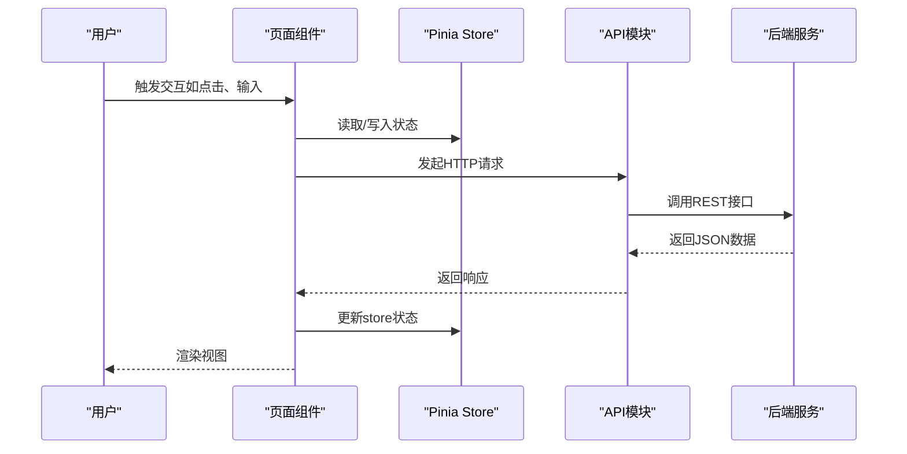
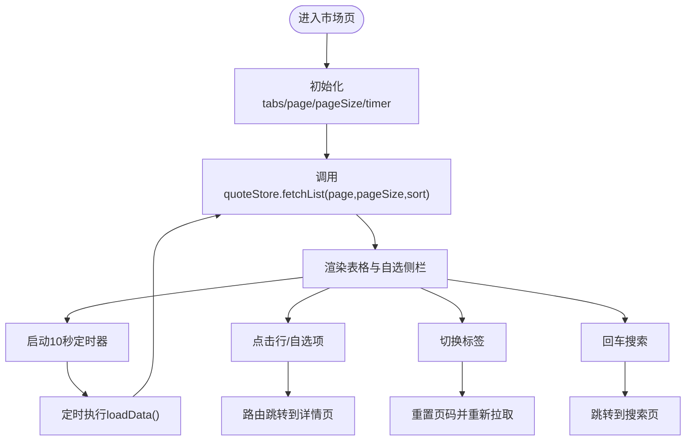
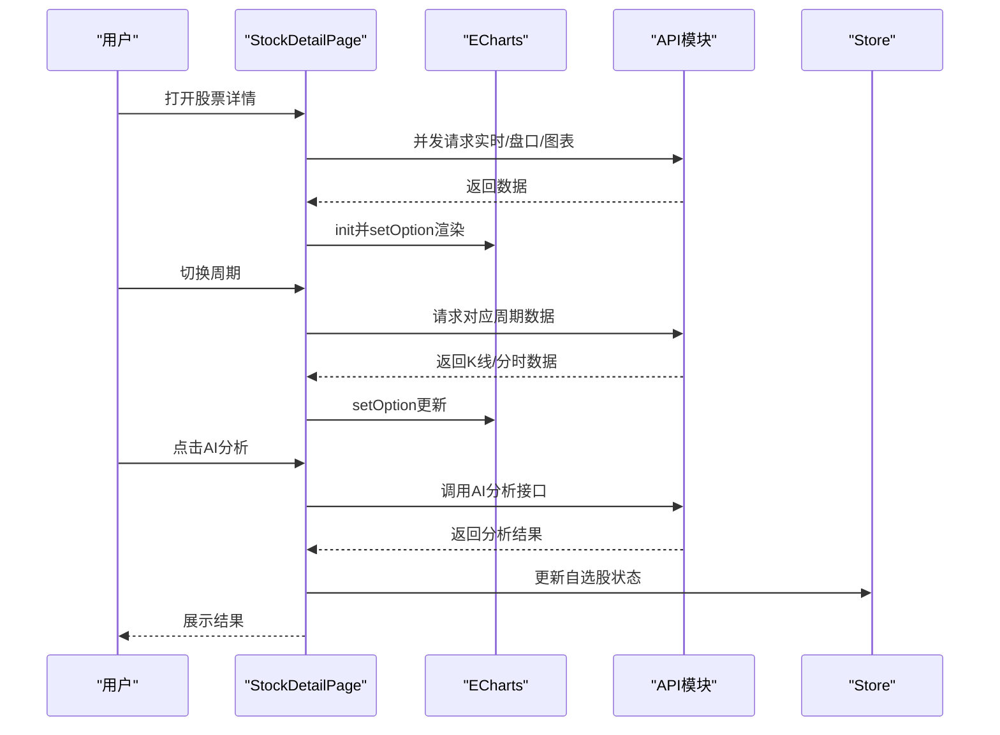
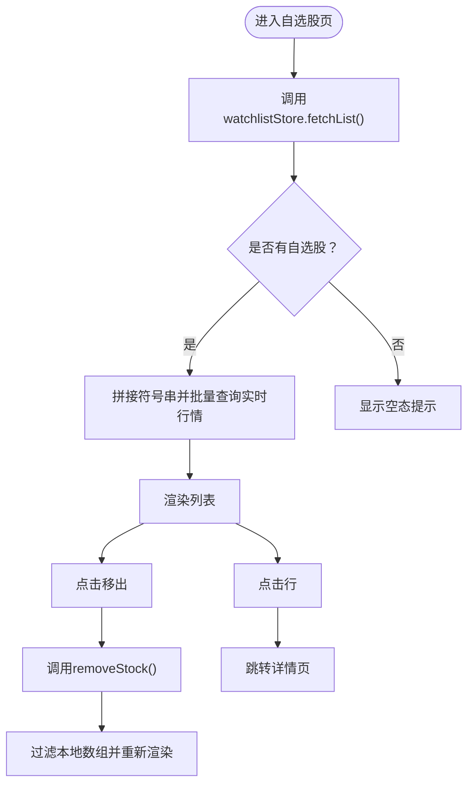
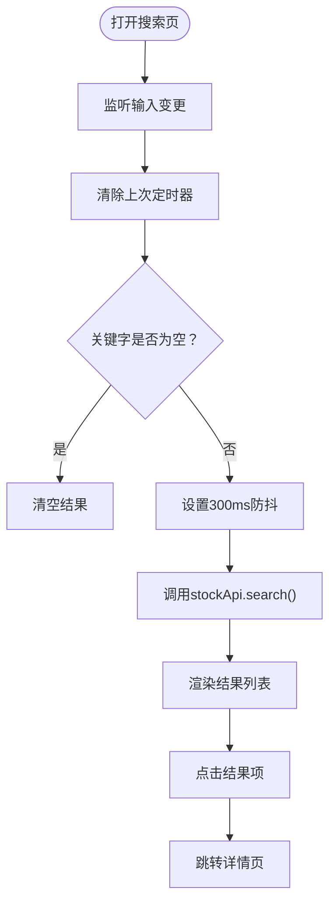
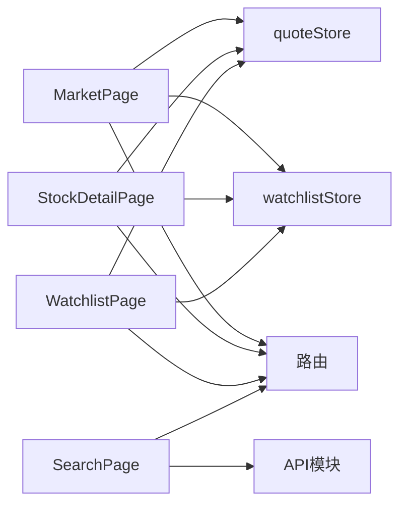

# 页面组件

<cite>
**本文引用的文件**
- [MarketPage.vue](file://frontend/src/pages/MarketPage.vue)
- [StockDetailPage.vue](file://frontend/src/pages/StockDetailPage.vue)
- [WatchlistPage.vue](file://frontend/src/pages/WatchlistPage.vue)
- [SearchPage.vue](file://frontend/src/pages/SearchPage.vue)
- [quote.ts](file://frontend/src/stores/quote.ts)
- [watchlist.ts](file://frontend/src/stores/watchlist.ts)
- [index.ts](file://frontend/src/api/index.ts)
- [index.ts](file://frontend/src/router/index.ts)
</cite>

## 目录
1. [简介](#简介)
2. [项目结构](#项目结构)
3. [核心组件](#核心组件)
4. [架构总览](#架构总览)
5. [详细组件分析](#详细组件分析)
6. [依赖分析](#依赖分析)
7. [性能考虑](#性能考虑)
8. [故障排查指南](#故障排查指南)
9. [结论](#结论)
10. [附录](#附录)

## 简介
本章节面向Stock-View前端页面组件，系统化梳理市场页、股票详情页、自选股页、搜索页的设计与实现，覆盖数据流、状态管理、用户交互、错误处理、加载状态、复用模式、组合式API使用、响应式与移动端适配等主题，并给出性能优化与SEO建议。

## 项目结构
页面组件位于frontend/src/pages目录下，采用按页面拆分的组织方式；状态管理通过Pinia Store集中维护；API封装在frontend/src/api中；路由在frontend/src/router中统一配置。

图示来源
- [MarketPage.vue](file://frontend/src/pages/MarketPage.vue)
- [StockDetailPage.vue](file://frontend/src/pages/StockDetailPage.vue)
- [WatchlistPage.vue](file://frontend/src/pages/WatchlistPage.vue)
- [SearchPage.vue](file://frontend/src/pages/SearchPage.vue)
- [quote.ts](file://frontend/src/stores/quote.ts)
- [watchlist.ts](file://frontend/src/stores/watchlist.ts)
- [index.ts](file://frontend/src/api/index.ts)
- [index.ts](file://frontend/src/router/index.ts)

章节来源
- [MarketPage.vue](file://frontend/src/pages/MarketPage.vue)
- [StockDetailPage.vue](file://frontend/src/pages/StockDetailPage.vue)
- [WatchlistPage.vue](file://frontend/src/pages/WatchlistPage.vue)
- [SearchPage.vue](file://frontend/src/pages/SearchPage.vue)
- [quote.ts](file://frontend/src/stores/quote.ts)
- [watchlist.ts](file://frontend/src/stores/watchlist.ts)
- [index.ts](file://frontend/src/api/index.ts)
- [index.ts](file://frontend/src/router/index.ts)

## 核心组件
- 市场页面：顶部导航、自选侧栏、行情表格（支持分页、排序）、定时刷新、搜索跳转。
- 股票详情页面：头部价格与涨跌、K线/分时切换、五档盘口、AI智能分析、自选股增删。
- 自选股页面：自选股列表、行点击跳转、移出操作、空态提示。
- 搜索页面：输入防抖搜索、结果列表、点击跳转。

章节来源
- [MarketPage.vue](file://frontend/src/pages/MarketPage.vue)
- [StockDetailPage.vue](file://frontend/src/pages/StockDetailPage.vue)
- [WatchlistPage.vue](file://frontend/src/pages/WatchlistPage.vue)
- [SearchPage.vue](file://frontend/src/pages/SearchPage.vue)

## 架构总览
页面组件通过组合式API与路由协作，调用API模块获取数据；Pinia Store负责跨组件共享状态与更新；ECharts用于K线渲染；Element Plus提供UI控件与表格、分页、按钮等。

图示来源
- [MarketPage.vue](file://frontend/src/pages/MarketPage.vue)
- [StockDetailPage.vue](file://frontend/src/pages/StockDetailPage.vue)
- [WatchlistPage.vue](file://frontend/src/pages/WatchlistPage.vue)
- [SearchPage.vue](file://frontend/src/pages/SearchPage.vue)
- [quote.ts](file://frontend/src/stores/quote.ts)
- [watchlist.ts](file://frontend/src/stores/watchlist.ts)
- [index.ts](file://frontend/src/api/index.ts)

## 详细组件分析

### 市场页面（MarketPage.vue）
- 功能要点
  - 顶部导航：标签切换（全部/涨跌/换手）、搜索框、自选股链接。
  - 左侧自选股快捷入口：点击跳转到详情页。
  - 中部行情表格：分页、排序、点击行跳转详情、高亮当前行。
  - 定时刷新：每10秒自动拉取最新列表。
  - 数据格式化：成交量/成交额单位转换。
- 数据流
  - 初始加载与定时刷新：调用quoteStore.fetchList，设置loading。
  - 表格点击：$router.push跳转至股票详情。
  - 自选股侧栏：从watchlistStore.items读取并点击跳转。
- 状态管理
  - quoteStore：quoteList、loading、total、fetchList、fetchRealtime、updateQuote。
  - watchlistStore：items、loading、fetchList、addStock、removeStock、isWatched。
- 用户交互
  - 标签切换：根据tab映射sort参数，重置页码并重新拉取。
  - 分页变更：触发loadData并传入当前页与排序规则。
  - 搜索：回车跳转到搜索页，携带关键词。
- 错误处理与加载
  - 使用表格loading指示器；定时器在卸载时清理。
- 性能与可访问性
  - 表格列宽固定，避免布局抖动；分页减少单次渲染量。
  - 颜色随涨跌变化，提升可读性。

图示来源
- [MarketPage.vue](file://frontend/src/pages/MarketPage.vue)
- [quote.ts](file://frontend/src/stores/quote.ts)
- [watchlist.ts](file://frontend/src/stores/watchlist.ts)

章节来源
- [MarketPage.vue](file://frontend/src/pages/MarketPage.vue)
- [quote.ts](file://frontend/src/stores/quote.ts)
- [watchlist.ts](file://frontend/src/stores/watchlist.ts)

### 股票详情页面（StockDetailPage.vue）
- 功能要点
  - 头部：返回按钮、名称与代码、实时价格与涨跌、自选股按钮。
  - 图表区：周期切换（分时/日K/周K/月K/5分钟/15分钟），ECharts渲染。
  - 右侧面板：五档盘口、基本数据、AI智能分析按钮与结果。
  - 实时刷新：每10秒更新报价与盘口。
- 数据流
  - 初始化：Promise.all并发加载实时报价、盘口、图表。
  - 图表切换：根据周期选择分时或K线接口，动态setOption。
  - AI分析：调用aiApi.analyze，展示趋势、置信度、摘要与风险等级。
  - 自选股：根据是否已关注决定按钮类型与行为。
- 状态管理
  - quoteStore：用于实时行情与列表查询（被API模块直接调用）。
  - watchlistStore：用于自选股增删查。
- 用户交互
  - 周期切换：切换currentPeriod并重新渲染图表。
  - AI分析：按钮loading态，成功后展示结果。
  - 自选股：根据市场前缀自动判断sh/sz。
- 错误处理与加载
  - 加载态：v-loading包裹整体；图表初始化失败保护；接口返回code校验。
  - 卸载清理：清理定时器与销毁ECharts实例。
- 性能与可访问性
  - 图表禁用动画以降低重绘开销；dataZoom滑块与内部缩放提升交互体验。

图示来源
- [StockDetailPage.vue](file://frontend/src/pages/StockDetailPage.vue)
- [index.ts](file://frontend/src/api/index.ts)
- [watchlist.ts](file://frontend/src/stores/watchlist.ts)

章节来源
- [StockDetailPage.vue](file://frontend/src/pages/StockDetailPage.vue)
- [index.ts](file://frontend/src/api/index.ts)
- [watchlist.ts](file://frontend/src/stores/watchlist.ts)

### 自选股页面（WatchlistPage.vue）
- 功能要点
  - 列表展示：代码、名称、最新价、涨跌幅、操作（移出）。
  - 空态：无自选股时提示并引导跳转市场页。
  - 行点击：跳转到详情页。
- 数据流
  - 加载：先拉取自选股列表，再批量请求实时行情，合并渲染。
  - 移出：调用watchlistApi.remove，同步更新本地数组。
- 状态管理
  - watchlistStore：items、loading、fetchList、addStock、removeStock、isWatched。
  - quoteApi：批量实时行情查询。
- 用户交互
  - 行点击跳转详情；移出按钮阻止事件冒泡并删除。
- 错误处理与加载
  - loading指示器；空态友好提示。

图示来源
- [WatchlistPage.vue](file://frontend/src/pages/WatchlistPage.vue)
- [watchlist.ts](file://frontend/src/stores/watchlist.ts)
- [index.ts](file://frontend/src/api/index.ts)

章节来源
- [WatchlistPage.vue](file://frontend/src/pages/WatchlistPage.vue)
- [watchlist.ts](file://frontend/src/stores/watchlist.ts)
- [index.ts](file://frontend/src/api/index.ts)

### 搜索页面（SearchPage.vue）
- 功能要点
  - 输入框：输入时防抖，延迟300ms发起请求。
  - 结果列表：点击跳转到详情页；无结果时提示。
- 数据流
  - 输入变更：清除上次定时器，若关键字非空则延时请求。
  - 接口：调用stockApi.search，返回匹配的股票列表。
- 用户交互
  - 清空与自动聚焦；点击结果跳转详情。
- 错误处理与加载
  - 关键字为空时清空结果；防抖避免频繁请求。

图示来源
- [SearchPage.vue](file://frontend/src/pages/SearchPage.vue)
- [index.ts](file://frontend/src/api/index.ts)

章节来源
- [SearchPage.vue](file://frontend/src/pages/SearchPage.vue)
- [index.ts](file://frontend/src/api/index.ts)

## 依赖分析
- 组件间耦合
  - MarketPage与StockDetailPage均依赖quoteStore与watchlistStore。
  - WatchlistPage依赖watchlistStore与quoteApi。
  - SearchPage依赖stockApi。
- 外部依赖
  - Element Plus：表格、分页、按钮、输入框。
  - ECharts：K线与分时图渲染。
  - Axios：统一HTTP客户端与拦截器（在API模块中配置）。
- 路由集成
  - 四个页面通过路由懒加载注册，路径与组件一一对应。

图示来源
- [MarketPage.vue](file://frontend/src/pages/MarketPage.vue)
- [StockDetailPage.vue](file://frontend/src/pages/StockDetailPage.vue)
- [WatchlistPage.vue](file://frontend/src/pages/WatchlistPage.vue)
- [SearchPage.vue](file://frontend/src/pages/SearchPage.vue)
- [quote.ts](file://frontend/src/stores/quote.ts)
- [watchlist.ts](file://frontend/src/stores/watchlist.ts)
- [index.ts](file://frontend/src/api/index.ts)
- [index.ts](file://frontend/src/router/index.ts)

章节来源
- [MarketPage.vue](file://frontend/src/pages/MarketPage.vue)
- [StockDetailPage.vue](file://frontend/src/pages/StockDetailPage.vue)
- [WatchlistPage.vue](file://frontend/src/pages/WatchlistPage.vue)
- [SearchPage.vue](file://frontend/src/pages/SearchPage.vue)
- [quote.ts](file://frontend/src/stores/quote.ts)
- [watchlist.ts](file://frontend/src/stores/watchlist.ts)
- [index.ts](file://frontend/src/api/index.ts)
- [index.ts](file://frontend/src/router/index.ts)

## 性能考虑
- 渲染优化
  - 表格分页与固定列宽，减少重排与滚动卡顿。
  - 图表禁用动画，降低渲染压力；仅在数据更新时setOption。
- 网络优化
  - 市场页与详情页定时刷新间隔10秒，避免过于频繁的轮询。
  - 搜索页300ms防抖，减少无效请求。
  - 批量查询：自选股页将多个symbol拼接为一个请求，降低RTT。
- 内存与资源
  - 组件卸载时清理定时器与销毁ECharts实例，防止内存泄漏。
- 可访问性
  - 高对比度颜色区分涨跌；键盘可聚焦元素具备清晰焦点样式。
- SEO与移动端
  - 使用语义化HTML与标题；路由基于history模式，利于爬虫抓取。
  - 响应式布局通过CSS变量与flex/grid适配不同屏幕尺寸。

## 故障排查指南
- 常见问题
  - 行情不刷新：检查定时器是否被清理；确认quoteStore.fetchList调用链路。
  - 图表空白：确认chartRef存在且ECharts已初始化；检查接口返回code与data结构。
  - 自选股移不出：检查watchlistApi.remove返回值与fetchList是否成功刷新。
  - 搜索无结果：确认keyword非空且防抖逻辑生效；检查后端search接口可用性。
- 错误处理策略
  - 接口返回code校验：仅当data.code为0时才更新状态。
  - loading状态：在异步请求前后切换，避免UI闪烁。
  - 异常捕获：AI分析等异步任务使用try/finally确保loading恢复。
- 日志与调试
  - 在API模块打印请求URL与响应状态，定位网络问题。
  - 在Store中记录状态变更轨迹，辅助定位数据流异常。

章节来源
- [MarketPage.vue](file://frontend/src/pages/MarketPage.vue)
- [StockDetailPage.vue](file://frontend/src/pages/StockDetailPage.vue)
- [WatchlistPage.vue](file://frontend/src/pages/WatchlistPage.vue)
- [SearchPage.vue](file://frontend/src/pages/SearchPage.vue)
- [quote.ts](file://frontend/src/stores/quote.ts)
- [watchlist.ts](file://frontend/src/stores/watchlist.ts)
- [index.ts](file://frontend/src/api/index.ts)

## 结论
四个页面组件围绕统一的状态与API抽象构建，形成清晰的数据流与交互闭环。通过Pinia集中管理、组合式API与路由解耦、ECharts专业渲染以及防抖与定时刷新等策略，实现了高性能、可维护的股票行情与分析体验。建议后续在SEO与移动端细节上持续优化，进一步提升用户体验与可发现性。

## 附录
- 复用模式
  - 将通用的loading、错误提示、分页逻辑抽取为可复用的组合式函数或指令。
  - 将颜色计算、数值格式化等工具函数抽离到utils模块，供多页面共享。
- 组合式API最佳实践
  - 使用defineStore定义轻量store，避免过度嵌套；在页面内通过ref控制UI状态，通过store管理业务状态。
  - 对于副作用（定时器、图表实例）在onMounted/onUnmounted中成对创建与销毁。
- 响应式与移动端适配
  - 使用CSS媒体查询与相对单位；在小屏设备上折叠右侧面板或改为纵向布局。
  - 控制表格列宽与最小宽度，保证在窄屏下的可读性。
- SEO友好
  - 为关键页面提供静态标题与描述；利用history路由模式便于搜索引擎抓取；图片与图标提供alt文本。