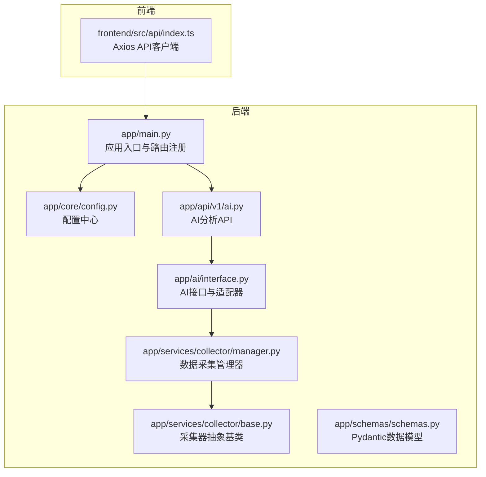
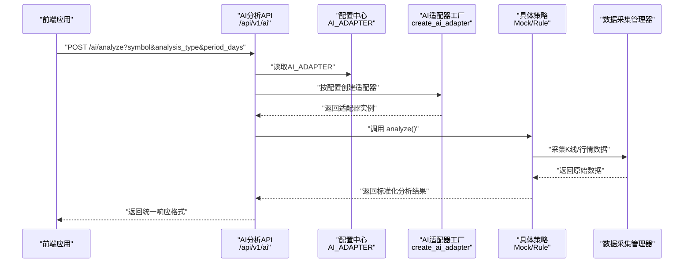
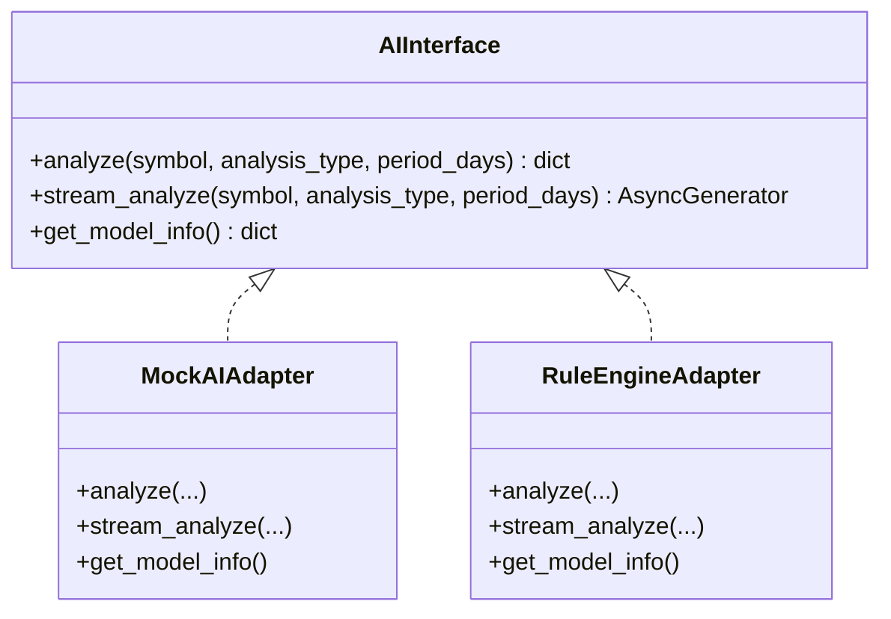
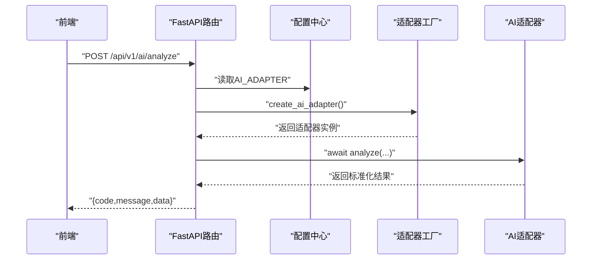
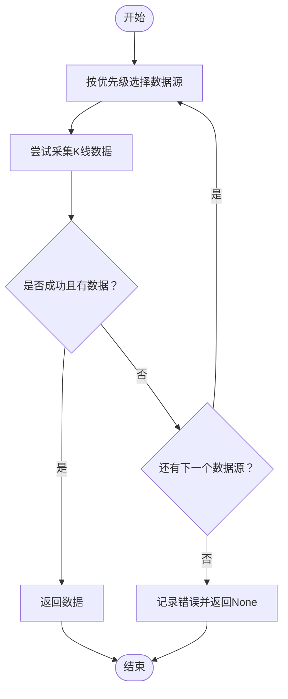
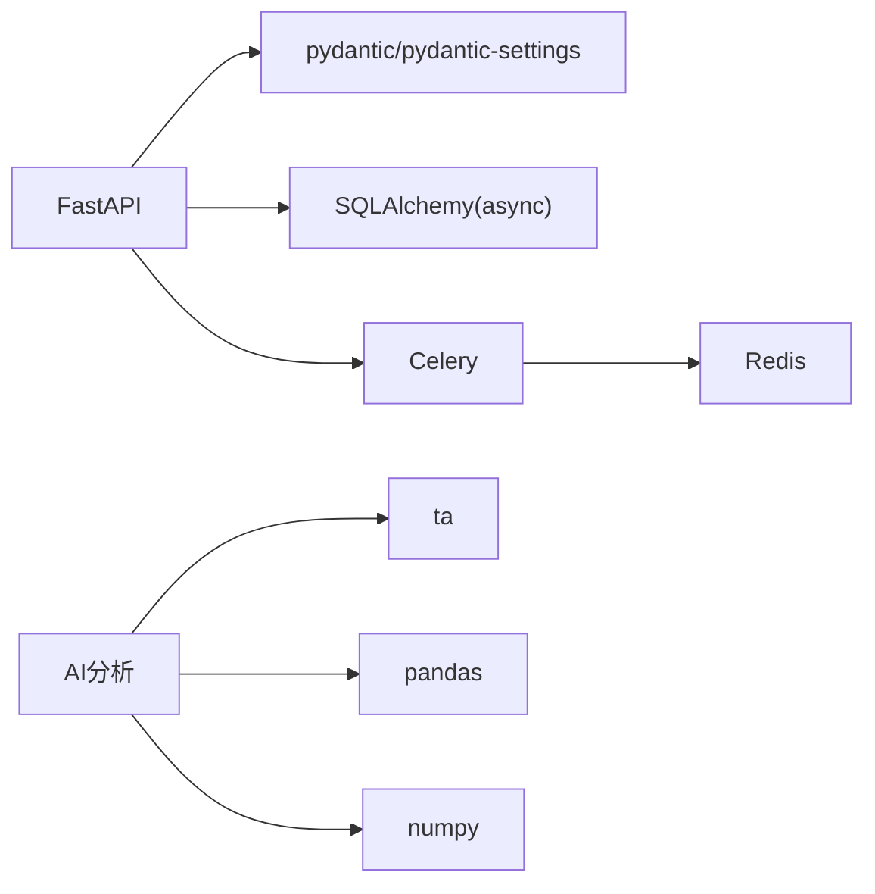

# AI分析系统

<cite>
**本文引用的文件**
- [backend/app/ai/interface.py](file://backend/app/ai/interface.py)
- [backend/app/api/v1/ai.py](file://backend/app/api/v1/ai.py)
- [backend/app/main.py](file://backend/app/main.py)
- [backend/app/core/config.py](file://backend/app/core/config.py)
- [backend/app/services/collector/manager.py](file://backend/app/services/collector/manager.py)
- [backend/app/services/collector/base.py](file://backend/app/services/collector/base.py)
- [backend/app/schemas/schemas.py](file://backend/app/schemas/schemas.py)
- [backend/requirements.txt](file://backend/requirements.txt)
- [frontend/src/api/index.ts](file://frontend/src/api/index.ts)
- [README.md](file://README.md)
</cite>

## 目录
1. [引言](#引言)
2. [项目结构](#项目结构)
3. [核心组件](#核心组件)
4. [架构总览](#架构总览)
5. [详细组件分析](#详细组件分析)
6. [依赖分析](#依赖分析)
7. [性能考虑](#性能考虑)
8. [故障排查指南](#故障排查指南)
9. [结论](#结论)
10. [附录](#附录)

## 引言
本文件为“AI分析系统”的综合技术文档，面向开发者与产品人员，系统性阐述AI分析接口的设计理念、插件化架构、统一接口规范、分析策略扩展机制、模型适配器设计，并深入解析AI分析API的实现思路（技术指标计算、趋势预测算法、风险评估模型）。同时提供AI模型集成指南、自定义分析策略开发步骤、API调用示例、算法优化建议、数据预处理流程与结果解释说明。

## 项目结构
后端采用FastAPI框架，按模块化组织：核心配置、数据采集、AI分析、API路由与WebSocket等。前端通过Axios封装统一API客户端，后端提供REST接口供前端调用。

**图表来源**
- [backend/app/main.py:1-48](file://backend/app/main.py#L1-L48)
- [backend/app/api/v1/ai.py:1-29](file://backend/app/api/v1/ai.py#L1-L29)
- [backend/app/ai/interface.py:1-196](file://backend/app/ai/interface.py#L1-L196)
- [backend/app/services/collector/manager.py:1-94](file://backend/app/services/collector/manager.py#L1-L94)
- [backend/app/services/collector/base.py:1-45](file://backend/app/services/collector/base.py#L1-L45)
- [backend/app/schemas/schemas.py:1-103](file://backend/app/schemas/schemas.py#L1-L103)
- [frontend/src/api/index.ts:1-33](file://frontend/src/api/index.ts#L1-L33)

**章节来源**
- [backend/app/main.py:1-48](file://backend/app/main.py#L1-L48)
- [README.md:92-126](file://README.md#L92-L126)

## 核心组件
- 统一AI接口与适配器
  - 抽象接口定义了异步分析、流式分析与模型信息查询能力，确保不同AI策略以一致方式对外提供服务。
  - 提供Mock与RuleEngine两种适配器，分别用于演示与基础规则分析。
- AI分析API
  - 提供POST /ai/analyze进行一次性分析；GET /ai/model-info获取当前适配器元信息。
  - 通过配置中心选择具体适配器，支持动态切换。
- 数据采集层
  - CollectorManager负责多数据源优先级与故障转移，保障数据可用性。
  - BaseCollector定义采集器抽象，便于扩展新数据源。
- 配置中心
  - 通过环境变量控制AI适配器、缓存、限流、超时等参数，便于部署期灵活调整。
- 前端API客户端
  - 封装Axios实例，提供aiApi.analyze与aiApi.getModelInfo等方法，简化调用。

**章节来源**
- [backend/app/ai/interface.py:26-196](file://backend/app/ai/interface.py#L26-L196)
- [backend/app/api/v1/ai.py:10-29](file://backend/app/api/v1/ai.py#L10-L29)
- [backend/app/core/config.py:5-43](file://backend/app/core/config.py#L5-L43)
- [backend/app/services/collector/manager.py:12-94](file://backend/app/services/collector/manager.py#L12-L94)
- [backend/app/services/collector/base.py:5-45](file://backend/app/services/collector/base.py#L5-L45)
- [frontend/src/api/index.ts:27-31](file://frontend/src/api/index.ts#L27-L31)

## 架构总览
系统采用“插件化适配器 + 统一接口 + 动态配置”的架构，AI分析策略可独立演进与替换，不影响上层API与前端调用。

**图表来源**
- [backend/app/api/v1/ai.py:10-15](file://backend/app/api/v1/ai.py#L10-L15)
- [backend/app/core/config.py:19](file://backend/app/core/config.py#L19)
- [backend/app/ai/interface.py:190-196](file://backend/app/ai/interface.py#L190-L196)
- [backend/app/services/collector/manager.py:49-61](file://backend/app/services/collector/manager.py#L49-L61)

## 详细组件分析

### 统一AI接口与适配器
- 接口职责
  - analyze(symbol, analysis_type, period_days): 返回标准化分析结果，包含趋势、置信度、摘要、细节、指标、风险等级、时间戳与模型版本等字段。
  - stream_analyze(...): 流式返回进度与最终结果，便于UI展示分析过程。
  - get_model_info(): 返回适配器元信息（名称、版本、描述、支持类型、状态）。
- Mock适配器
  - 生成随机趋势与置信度，构造技术指标与支撑阻力位、预测目标价与止损等示例数据，便于前端联调与演示。
- 规则引擎适配器
  - 基于K线数据计算均线与量价规则，给出趋势与置信度，输出规则触发项与预测方向。
- 适配器工厂
  - create_ai_adapter根据配置选择具体适配器，默认mock，支持rule。

**图表来源**
- [backend/app/ai/interface.py:26-196](file://backend/app/ai/interface.py#L26-L196)

**章节来源**
- [backend/app/ai/interface.py:26-196](file://backend/app/ai/interface.py#L26-L196)

### AI分析API
- 路由与行为
  - POST /ai/analyze: 接收symbol、analysis_type、period_days，调用适配器执行分析并返回统一响应。
  - GET /ai/history: 历史记录接口预留。
  - GET /ai/model-info: 返回当前适配器元信息。
- 统一响应
  - 使用ResponseBase作为基础响应结构，包含code与message字段，data承载业务数据。

**图表来源**
- [backend/app/api/v1/ai.py:10-29](file://backend/app/api/v1/ai.py#L10-L29)
- [backend/app/core/config.py:19](file://backend/app/core/config.py#L19)
- [backend/app/ai/interface.py:190-196](file://backend/app/ai/interface.py#L190-L196)

**章节来源**
- [backend/app/api/v1/ai.py:10-29](file://backend/app/api/v1/ai.py#L10-L29)
- [backend/app/schemas/schemas.py:6-103](file://backend/app/schemas/schemas.py#L6-L103)

### 数据采集与故障转移
- CollectorManager
  - 维护多个采集器实例，按优先级依次尝试，遇到异常或空数据则切换至下一个数据源，提升稳定性。
  - 提供fetch_kline等方法，供AI策略使用。
- BaseCollector
  - 定义采集器抽象，约束各数据源实现统一接口。
- 与AI策略的协作
  - RuleEngineAdapter通过collector_manager.fetch_kline获取K线数据，作为规则分析输入。

**图表来源**
- [backend/app/services/collector/manager.py:49-61](file://backend/app/services/collector/manager.py#L49-L61)

**章节来源**
- [backend/app/services/collector/manager.py:12-94](file://backend/app/services/collector/manager.py#L12-L94)
- [backend/app/services/collector/base.py:5-45](file://backend/app/services/collector/base.py#L5-L45)

### 配置中心与动态加载
- 配置项
  - AI_ADAPTER: 选择AI适配器（mock/rule），默认mock。
  - AI_SERVICE_URL、AI_REQUEST_TIMEOUT、AI_CACHE_ENABLED、AI_CACHE_TTL、AI_RATE_LIMIT等为AI相关参数预留。
- 动态加载
  - API在每次请求时读取配置并创建对应适配器实例，实现策略的动态切换。

**章节来源**
- [backend/app/core/config.py:5-43](file://backend/app/core/config.py#L5-L43)
- [backend/app/api/v1/ai.py:13](file://backend/app/api/v1/ai.py#L13)

### 前端API调用示例
- aiApi.analyze(symbol, analysisType='comprehensive', periodDays=30)
- aiApi.getModelInfo()
- 前端通过Axios统一拦截与错误处理，便于扩展。

**章节来源**
- [frontend/src/api/index.ts:27-31](file://frontend/src/api/index.ts#L27-L31)

## 依赖分析
- 后端依赖
  - FastAPI、SQLAlchemy(async)、Celery、Redis、httpx、pydantic/pydantic-settings、ta、pandas、numpy等。
- 关键依赖作用
  - FastAPI提供高性能异步API框架。
  - ta/pandas/numpy为技术指标与数值计算提供基础。
  - Celery/Redis用于异步任务与缓存。
  - pydantic/pydantic-settings用于配置与数据校验。

**图表来源**
- [backend/requirements.txt:1-17](file://backend/requirements.txt#L1-L17)

**章节来源**
- [backend/requirements.txt:1-17](file://backend/requirements.txt#L1-L17)

## 性能考虑
- 并发与异步
  - AI分析与数据采集均采用async/await，提升并发吞吐。
- 缓存与限流
  - 配置中心预留AI_CACHE_ENABLED与AI_CACHE_TTL、AI_RATE_LIMIT，可在生产环境启用以降低重复计算与外部依赖压力。
- 数据源冗余
  - CollectorManager的故障转移减少单点故障影响，提高整体可用性。
- 指标计算优化
  - 使用pandas/ta进行批量向量化计算，避免Python循环；对长周期数据可考虑分页或滑动窗口以控制内存占用。
- I/O与超时
  - AI_REQUEST_TIMEOUT用于限制外部服务响应时间，防止阻塞。

[本节为通用指导，不直接分析具体文件]

## 故障排查指南
- 适配器未生效
  - 检查AI_ADAPTER配置是否正确；确认create_ai_adapter映射表包含所需键值。
- 数据为空或异常
  - 查看CollectorManager日志，确认主备数据源是否均失败；检查网络与第三方接口可用性。
- 响应格式异常
  - 确认AI适配器返回字段符合统一规范；核对ResponseBase与AIAnalysisResponse的使用。
- 前端无法调用
  - 检查CORS配置与路由前缀；确认前端baseURL与后端一致。

**章节来源**
- [backend/app/api/v1/ai.py:10-29](file://backend/app/api/v1/ai.py#L10-L29)
- [backend/app/services/collector/manager.py:21-33](file://backend/app/services/collector/manager.py#L21-L33)
- [backend/app/ai/interface.py:190-196](file://backend/app/ai/interface.py#L190-L196)

## 结论
该AI分析系统通过统一接口与插件化适配器实现了策略的解耦与可替换性；结合配置中心与数据采集层的故障转移机制，具备良好的可维护性与扩展性。建议在生产环境中启用缓存与限流策略，逐步引入更复杂的指标与模型，并完善历史记录与监控体系。

[本节为总结性内容，不直接分析具体文件]

## 附录

### AI模型集成指南
- 新增适配器
  - 实现AIInterface接口，提供analyze/stream_analyze/get_model_info。
  - 在create_ai_adapter映射表中注册新适配器名称。
- 数据输入
  - 通过collector_manager.fetch_kline等方法获取K线数据，按需裁剪周期与复权处理。
- 输出标准化
  - 严格遵循统一字段：趋势、置信度、摘要、细节、指标、风险等级、时间戳、模型版本等。
- 配置切换
  - 通过AI_ADAPTER切换策略；必要时增加AI_SERVICE_URL、AI_REQUEST_TIMEOUT等参数。

**章节来源**
- [backend/app/ai/interface.py:26-196](file://backend/app/ai/interface.py#L26-L196)
- [backend/app/ai/interface.py:190-196](file://backend/app/ai/interface.py#L190-L196)
- [backend/app/services/collector/manager.py:49-61](file://backend/app/services/collector/manager.py#L49-L61)

### 自定义分析策略开发
- 基于规则的策略
  - 参考RuleEngineAdapter，利用均线、成交量、KDJ、RSI等指标构建评分逻辑。
- 基于模型的策略
  - 引入机器学习/深度学习模型，封装为AIInterface实现；注意批量化与序列化。
- 流式分析
  - 实现stream_analyze，分阶段返回进度与中间结果，改善用户体验。

**章节来源**
- [backend/app/ai/interface.py:111-187](file://backend/app/ai/interface.py#L111-L187)

### API调用示例
- 后端
  - POST /api/v1/ai/analyze?symbol=600036&analysis_type=comprehensive&period_days=30
  - GET /api/v1/ai/model-info
- 前端
  - aiApi.analyze('600036', 'comprehensive', 30)
  - aiApi.getModelInfo()

**章节来源**
- [backend/app/api/v1/ai.py:10-29](file://backend/app/api/v1/ai.py#L10-L29)
- [frontend/src/api/index.ts:27-31](file://frontend/src/api/index.ts#L27-L31)

### 算法优化建议
- 指标计算
  - 使用pandas/ta进行向量化计算；对长序列采用滑动窗口与增量更新。
- 风险评估
  - 引入波动率、最大回撤、VaR等指标，结合趋势强度与成交量进行综合打分。
- 预测模型
  - 可采用LSTM/Transformer等序列模型，但需注意过拟合与训练数据质量。
- 结果解释
  - 为每个指标与结论提供简明解释文本，帮助用户理解AI决策依据。

[本节为通用指导，不直接分析具体文件]

### 数据预处理流程
- 数据采集
  - 通过CollectorManager按优先级获取K线数据，处理缺失与异常值。
- 特征工程
  - 计算技术指标（开盘/最高/最低/收盘/成交量）、移动平均、相对强弱指数等。
- 输入归一化
  - 对特征进行标准化或归一化，保证模型输入稳定。
- 序列化与缓存
  - 将特征序列化存储，启用缓存以减少重复计算。

[本节为通用指导，不直接分析具体文件]