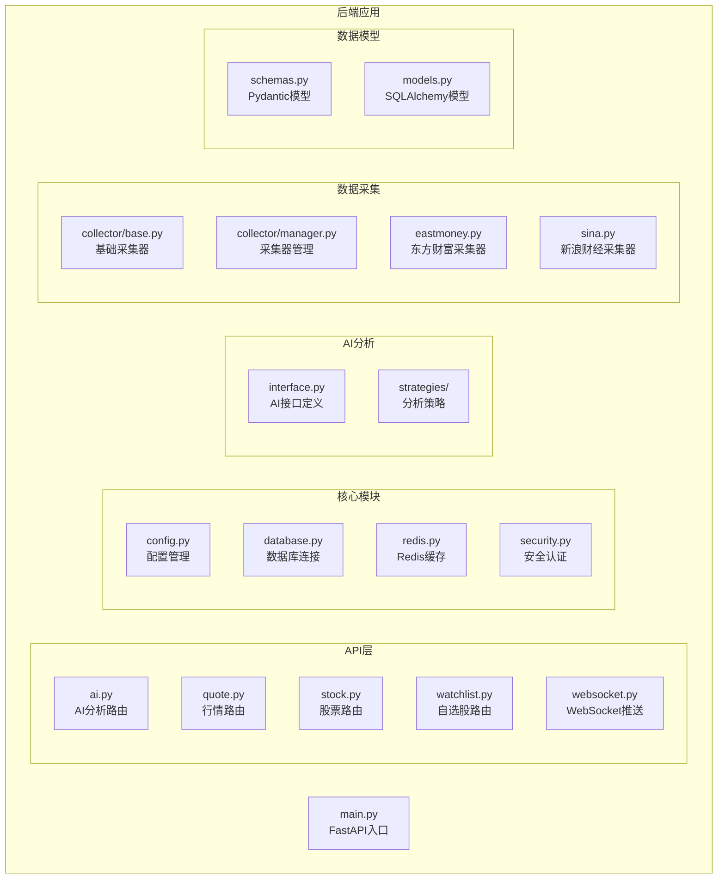
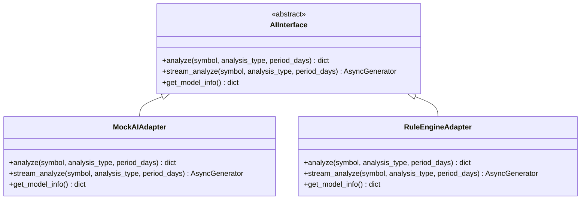
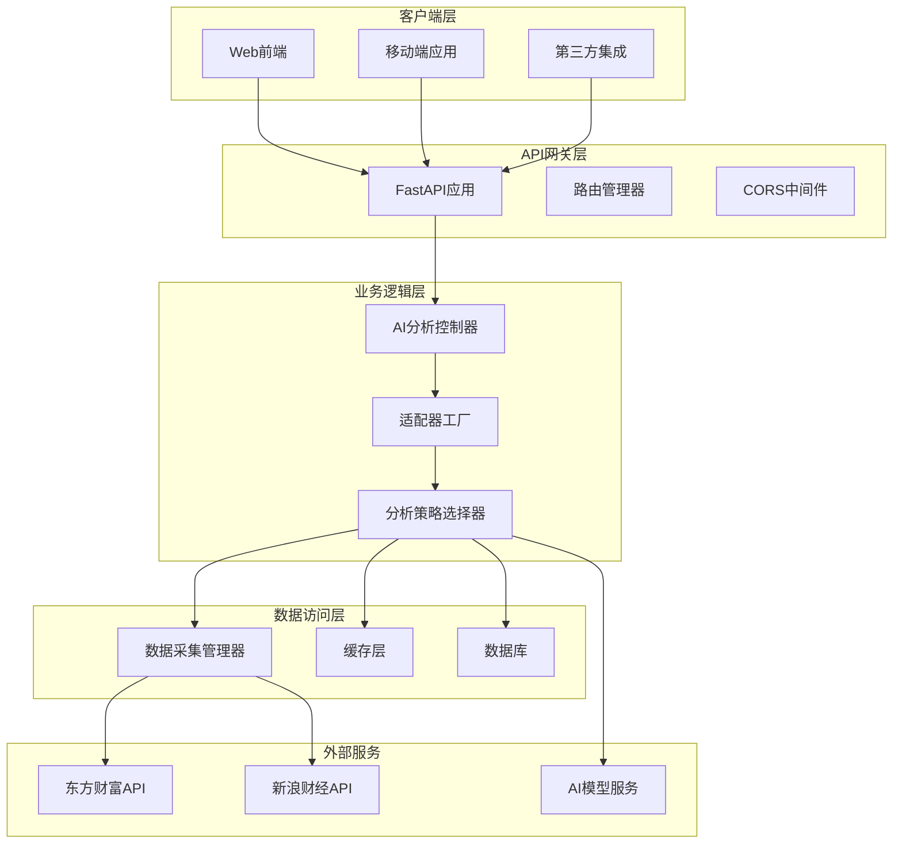
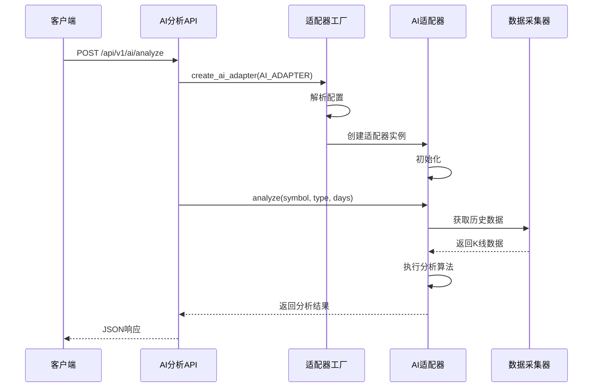
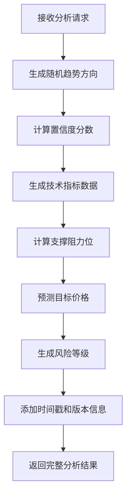
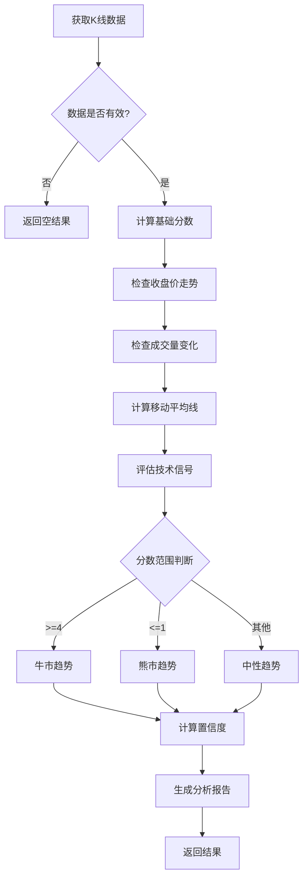
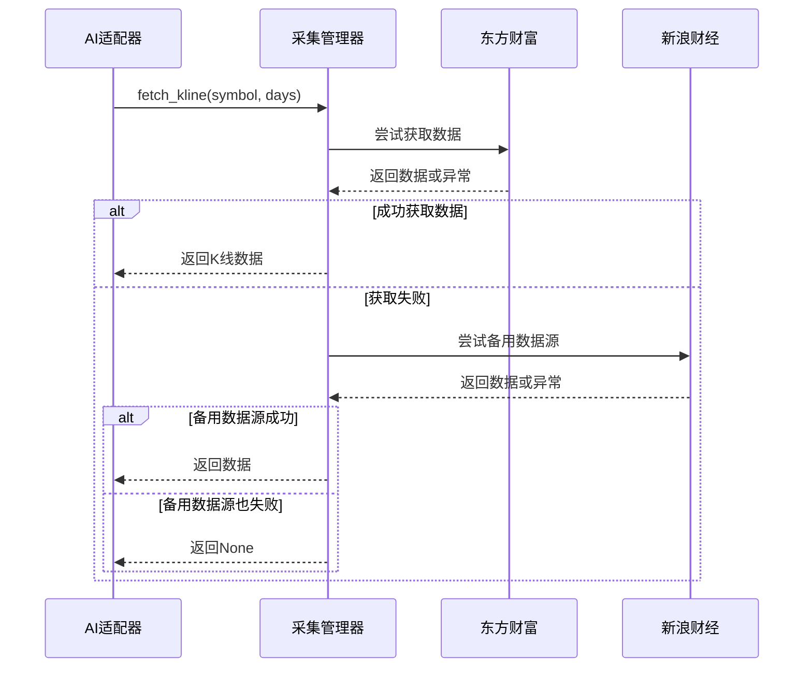
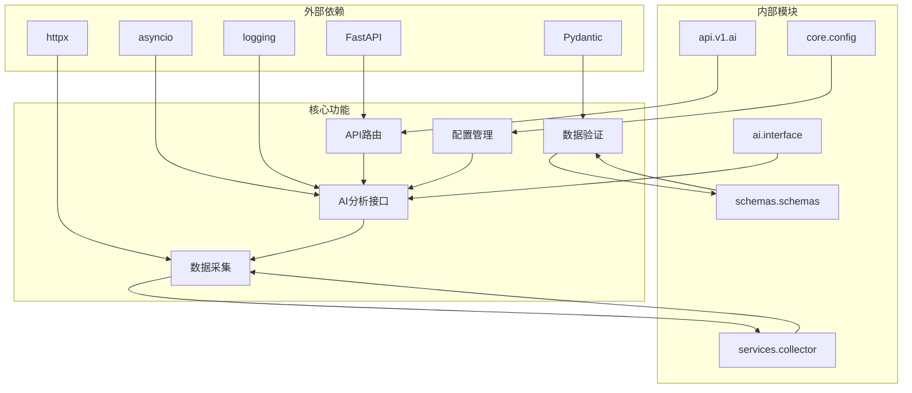
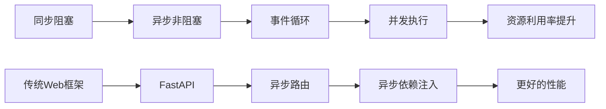
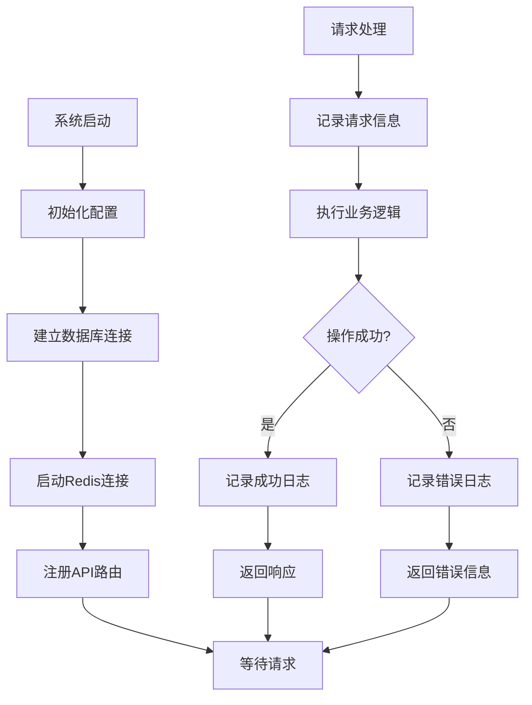

# AI分析API

<cite>
**本文档引用的文件**
- [backend/app/ai/interface.py](file://backend/app/ai/interface.py)
- [backend/app/api/v1/ai.py](file://backend/app/api/v1/ai.py)
- [backend/app/main.py](file://backend/app/main.py)
- [backend/app/schemas/schemas.py](file://backend/app/schemas/schemas.py)
- [backend/app/core/config.py](file://backend/app/core/config.py)
- [backend/app/services/collector/manager.py](file://backend/app/services/collector/manager.py)
- [backend/app/services/collector/base.py](file://backend/app/services/collector/base.py)
- [backend/app/services/collector/eastmoney.py](file://backend/app/services/collector/eastmoney.py)
- [backend/app/services/collector/sina.py](file://backend/app/services/collector/sina.py)
- [backend/app/api/websocket.py](file://backend/app/api/websocket.py)
- [README.md](file://README.md)
</cite>

## 目录
1. [简介](#简介)
2. [项目结构](#项目结构)
3. [核心组件](#核心组件)
4. [架构概览](#架构概览)
5. [详细组件分析](#详细组件分析)
6. [依赖关系分析](#依赖关系分析)
7. [性能考虑](#性能考虑)
8. [故障排除指南](#故障排除指南)
9. [结论](#结论)

## 简介

AI分析API是Stock-View平台的核心功能模块，提供基于人工智能的股票分析服务。该系统采用插件化架构设计，支持多种分析算法和数据源，为用户提供全面的股票投资决策支持。

本系统的主要特点包括：
- **适配器模式实现**：通过统一接口支持多种AI分析算法
- **插件化架构**：可轻松扩展新的分析策略和数据源
- **异步处理**：支持流式分析和实时数据处理
- **多数据源支持**：内置东方财富和新浪财经数据源
- **配置驱动**：通过环境变量灵活配置系统行为

## 项目结构

**图表来源**
- [backend/app/main.py:1-48](file://backend/app/main.py#L1-L48)
- [backend/app/api/v1/ai.py:1-29](file://backend/app/api/v1/ai.py#L1-L29)
- [backend/app/ai/interface.py:1-196](file://backend/app/ai/interface.py#L1-L196)

**章节来源**
- [backend/app/main.py:1-48](file://backend/app/main.py#L1-L48)
- [README.md:92-126](file://README.md#L92-L126)

## 核心组件

### AI分析接口抽象

AI分析系统的核心是统一的抽象接口，定义了所有AI适配器必须实现的方法：

**图表来源**
- [backend/app/ai/interface.py:26-196](file://backend/app/ai/interface.py#L26-L196)

### 分析类型枚举

系统支持多种分析类型，每种类型对应不同的分析策略：

| 分析类型 | 描述 | 支持的适配器 |
|---------|------|-------------|
| technical | 技术分析 | MockAIAdapter, RuleEngineAdapter |
| trend | 趋势预测 | MockAIAdapter, RuleEngineAdapter |
| risk | 风险评估 | MockAIAdapter |
| comprehensive | 综合分析 | MockAIAdapter |

**章节来源**
- [backend/app/ai/interface.py:13-40](file://backend/app/ai/interface.py#L13-L40)

## 架构概览

AI分析API采用分层架构设计，确保了良好的可扩展性和维护性：

**图表来源**
- [backend/app/main.py:22-48](file://backend/app/main.py#L22-L48)
- [backend/app/api/v1/ai.py:1-29](file://backend/app/api/v1/ai.py#L1-L29)
- [backend/app/ai/interface.py:190-196](file://backend/app/ai/interface.py#L190-L196)

## 详细组件分析

### AI适配器工厂

适配器工厂负责根据配置动态创建合适的AI分析适配器：

**图表来源**
- [backend/app/api/v1/ai.py:10-15](file://backend/app/api/v1/ai.py#L10-L15)
- [backend/app/ai/interface.py:190-196](file://backend/app/ai/interface.py#L190-L196)

### MockAIAdapter实现

MockAIAdapter是一个模拟适配器，用于演示AI分析API的功能：

**图表来源**
- [backend/app/ai/interface.py:45-87](file://backend/app/ai/interface.py#L45-L87)

### RuleEngineAdapter实现

RuleEngineAdapter基于简单的技术指标规则进行分析：

**图表来源**
- [backend/app/ai/interface.py:114-170](file://backend/app/ai/interface.py#L114-L170)

### 数据采集管理器

数据采集管理器实现了多数据源的故障转移机制：

**图表来源**
- [backend/app/services/collector/manager.py:45-54](file://backend/app/services/collector/manager.py#L45-L54)

**章节来源**
- [backend/app/ai/interface.py:42-196](file://backend/app/ai/interface.py#L42-L196)
- [backend/app/services/collector/manager.py:12-80](file://backend/app/services/collector/manager.py#L12-L80)

## 依赖关系分析

系统采用模块化设计，各组件之间的依赖关系清晰明确：

**图表来源**
- [backend/app/ai/interface.py:1-10](file://backend/app/ai/interface.py#L1-L10)
- [backend/app/api/v1/ai.py:1-4](file://backend/app/api/v1/ai.py#L1-L4)
- [backend/app/core/config.py:1-43](file://backend/app/core/config.py#L1-L43)

### 组件耦合度分析

- **低耦合设计**：AI适配器与数据采集器通过抽象接口解耦
- **高内聚模块**：每个模块专注于特定功能领域
- **清晰的依赖层次**：从底层数据采集到上层业务逻辑的清晰分层

**章节来源**
- [backend/app/ai/interface.py:26-40](file://backend/app/ai/interface.py#L26-L40)
- [backend/app/services/collector/base.py:5-35](file://backend/app/services/collector/base.py#L5-L35)

## 性能考虑

### 异步处理策略

系统采用异步编程模型以提高并发处理能力：

### 缓存策略

系统实现了多层次的缓存机制：

| 缓存层级 | 类型 | TTL | 用途 |
|---------|------|-----|------|
| 应用层缓存 | 内存缓存 | 5分钟 | 频繁访问的数据 |
| Redis缓存 | 分布式缓存 | 可配置 | 跨实例共享数据 |
| 数据源缓存 | API响应缓存 | 300秒 | 第三方API数据 |
| 浏览器缓存 | 前端缓存 | 可配置 | 前端静态资源 |

### 性能优化建议

1. **连接池管理**：合理配置数据库和Redis连接池大小
2. **批量处理**：对多个股票的分析请求进行批量化处理
3. **预加载策略**：对常用数据进行预加载
4. **限流控制**：实现API请求频率限制防止滥用

## 故障排除指南

### 常见问题及解决方案

| 问题类型 | 症状 | 可能原因 | 解决方案 |
|---------|------|---------|---------|
| AI适配器无法加载 | 返回500错误 | 配置错误或适配器不存在 | 检查AI_ADAPTER配置 |
| 数据源连接失败 | 分析结果为空 | 网络问题或API限制 | 检查网络连接和备用数据源 |
| 性能问题 | 响应时间过长 | 缓存未命中或数据库压力大 | 优化缓存策略和查询 |
| 认证失败 | 返回401错误 | JWT令牌无效或过期 | 重新登录获取新令牌 |

### 日志记录策略

系统实现了完整的日志记录机制：

**章节来源**
- [backend/app/services/collector/manager.py:21-32](file://backend/app/services/collector/manager.py#L21-L32)
- [backend/app/ai/interface.py:45-87](file://backend/app/ai/interface.py#L45-L87)

## 结论

AI分析API展现了现代Python Web应用的最佳实践，通过以下关键特性提供了强大的分析能力：

### 设计优势

1. **高度可扩展性**：插件化架构允许轻松添加新的分析算法
2. **容错性强**：多数据源备份确保服务可用性
3. **性能优异**：异步处理和缓存策略提升响应速度
4. **易于维护**：清晰的模块划分和抽象接口便于代码维护

### 技术亮点

- **适配器模式**：统一接口支持多种AI分析算法
- **工厂模式**：动态创建适配器实例
- **观察者模式**：WebSocket实现实时数据推送
- **策略模式**：灵活的数据采集策略

### 发展前景

该系统为未来的AI分析功能奠定了坚实基础，可以轻松扩展：
- 集成更复杂的机器学习模型
- 支持更多的技术指标和分析算法
- 添加实时交易信号生成功能
- 实现个性化投资建议推荐

通过持续的优化和扩展，AI分析API将成为一个功能完备、性能优异的智能投顾平台核心组件。