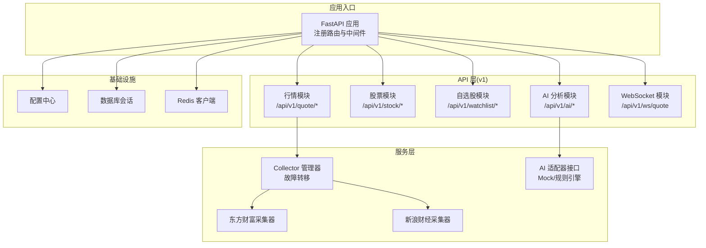
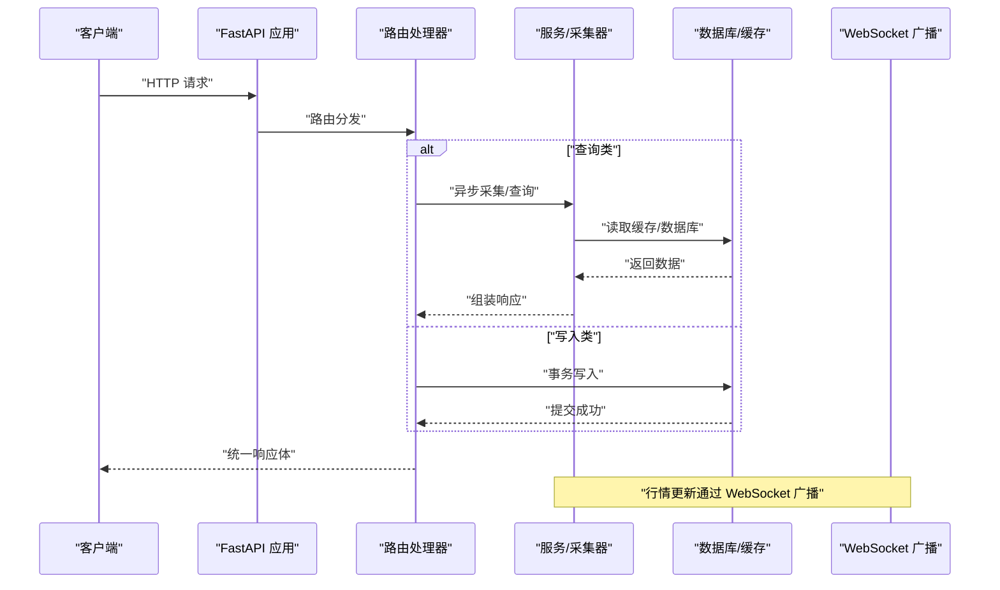
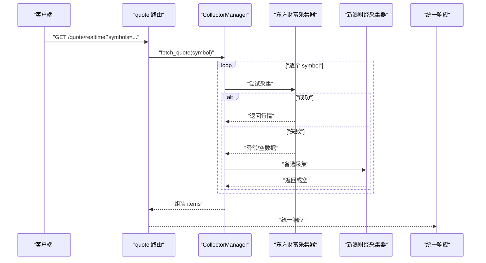
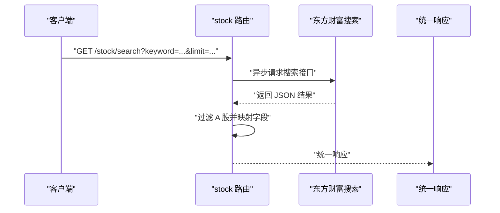
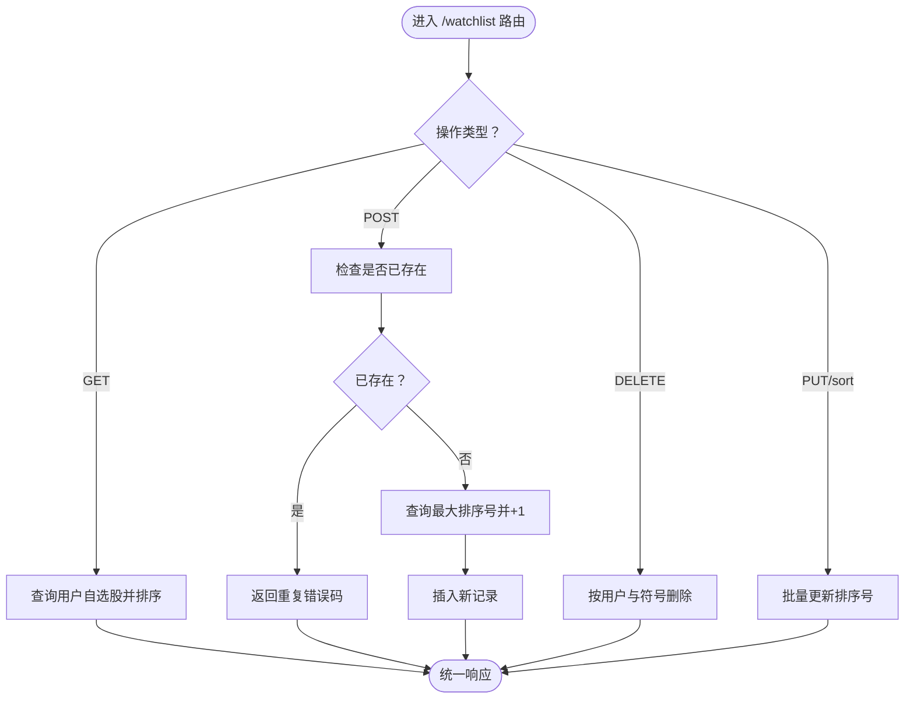
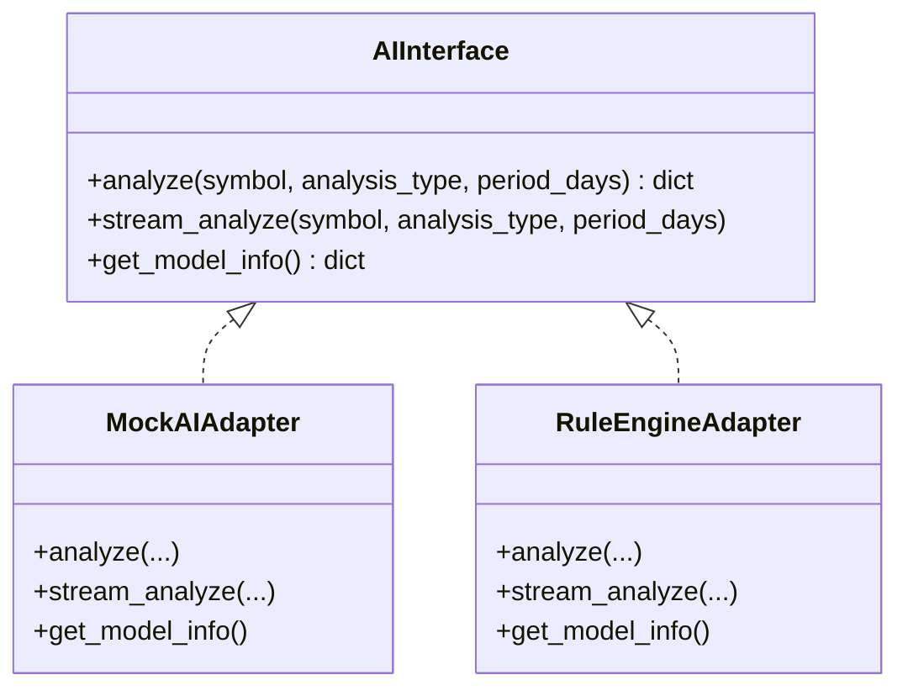
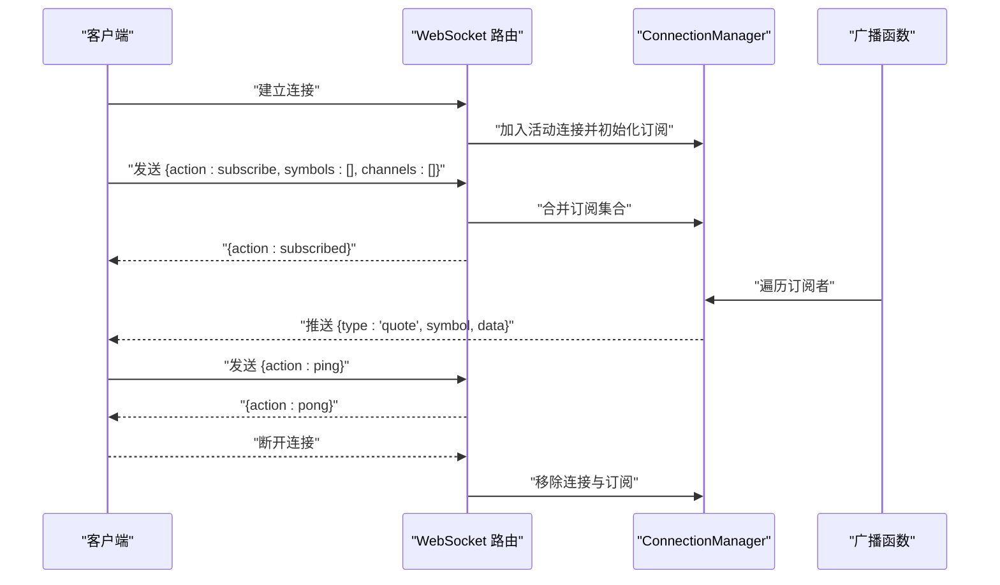
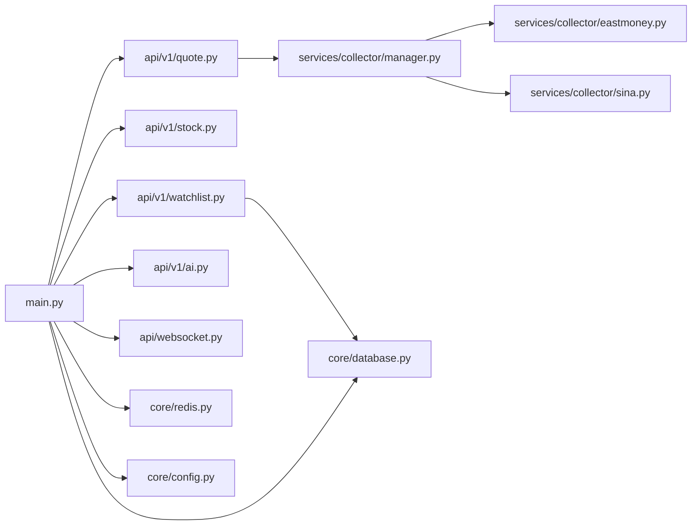

# API接口模块

<cite>
**本文引用的文件**
- [backend/app/main.py](file://backend/app/main.py)
- [backend/app/api/v1/quote.py](file://backend/app/api/v1/quote.py)
- [backend/app/api/v1/stock.py](file://backend/app/api/v1/stock.py)
- [backend/app/api/v1/watchlist.py](file://backend/app/api/v1/watchlist.py)
- [backend/app/api/v1/ai.py](file://backend/app/api/v1/ai.py)
- [backend/app/api/websocket.py](file://backend/app/api/websocket.py)
- [backend/app/schemas/schemas.py](file://backend/app/schemas/schemas.py)
- [backend/app/models/models.py](file://backend/app/models/models.py)
- [backend/app/core/config.py](file://backend/app/core/config.py)
- [backend/app/core/database.py](file://backend/app/core/database.py)
- [backend/app/core/redis.py](file://backend/app/core/redis.py)
- [backend/app/services/collector/manager.py](file://backend/app/services/collector/manager.py)
- [backend/app/services/collector/base.py](file://backend/app/services/collector/base.py)
- [backend/app/services/collector/eastmoney.py](file://backend/app/services/collector/eastmoney.py)
- [backend/app/services/collector/sina.py](file://backend/app/services/collector/sina.py)
- [backend/app/ai/interface.py](file://backend/app/ai/interface.py)
- [backend/app/core/security.py](file://backend/app/core/security.py)
</cite>

## 目录
1. [简介](#简介)
2. [项目结构](#项目结构)
3. [核心组件](#核心组件)
4. [架构总览](#架构总览)
5. [详细组件分析](#详细组件分析)
6. [依赖分析](#依赖分析)
7. [性能考虑](#性能考虑)
8. [故障排查指南](#故障排查指南)
9. [结论](#结论)
10. [附录](#附录)

## 简介
本文件系统化梳理 Stock-View 项目的 API 接口模块，覆盖行情数据、股票信息、自选股管理、AI 分析以及 WebSocket 实时推送等核心能力。文档从 RESTful 设计原则出发，结合项目实际的路由组织、请求处理、响应格式、错误处理、异步与缓存策略、安全与鉴权等技术细节，为开发者提供可操作的参考与最佳实践。

## 项目结构
后端采用 FastAPI 构建，API 路由按版本划分至 v1 子目录，统一通过主入口注册；各模块职责清晰：行情模块负责实时/历史/分时/K线/盘口数据；股票模块提供搜索；自选股模块提供增删改查与排序；AI 模块提供分析与模型信息；WebSocket 提供行情订阅推送；底层通过 Collector 管理器聚合多个数据源，具备故障转移能力；数据库与 Redis 提供持久化与缓存支持；配置中心集中管理运行参数。

图表来源
- [backend/app/main.py:38-43](file://backend/app/main.py#L38-L43)
- [backend/app/api/v1/quote.py:1-65](file://backend/app/api/v1/quote.py#L1-L65)
- [backend/app/api/v1/stock.py:1-37](file://backend/app/api/v1/stock.py#L1-L37)
- [backend/app/api/v1/watchlist.py:1-77](file://backend/app/api/v1/watchlist.py#L1-L77)
- [backend/app/api/v1/ai.py:1-29](file://backend/app/api/v1/ai.py#L1-L29)
- [backend/app/api/websocket.py:1-79](file://backend/app/api/websocket.py#L1-L79)
- [backend/app/services/collector/manager.py:12-80](file://backend/app/services/collector/manager.py#L12-L80)
- [backend/app/ai/interface.py:190-196](file://backend/app/ai/interface.py#L190-L196)
- [backend/app/core/config.py:1-43](file://backend/app/core/config.py#L1-L43)
- [backend/app/core/database.py:1-25](file://backend/app/core/database.py#L1-L25)
- [backend/app/core/redis.py:1-25](file://backend/app/core/redis.py#L1-L25)

章节来源
- [backend/app/main.py:1-48](file://backend/app/main.py#L1-L48)

## 核心组件
- 应用入口与路由注册：统一前缀 /api/v1，启用 CORS，健康检查端点。
- 数据采集与故障转移：CollectorManager 统一调度，优先级策略自动切换。
- 数据模型与响应模型：统一响应体结构，各模块定义专用数据模型。
- 数据库与缓存：异步 SQLAlchemy 会话，Redis 连接池。
- 配置中心：集中管理数据库、Redis、AI、定时任务、JWT 等参数。
- WebSocket：连接管理、订阅/退订、心跳、广播推送。

章节来源
- [backend/app/main.py:22-48](file://backend/app/main.py#L22-L48)
- [backend/app/services/collector/manager.py:12-80](file://backend/app/services/collector/manager.py#L12-L80)
- [backend/app/schemas/schemas.py:6-103](file://backend/app/schemas/schemas.py#L6-L103)
- [backend/app/models/models.py:1-74](file://backend/app/models/models.py#L1-L74)
- [backend/app/core/database.py:1-25](file://backend/app/core/database.py#L1-L25)
- [backend/app/core/redis.py:1-25](file://backend/app/core/redis.py#L1-L25)
- [backend/app/core/config.py:1-43](file://backend/app/core/config.py#L1-L43)
- [backend/app/api/websocket.py:12-79](file://backend/app/api/websocket.py#L12-L79)

## 架构总览
下图展示 API 层与服务层、数据层、基础设施之间的交互关系，体现 RESTful 路由、异步处理、故障转移与实时推送的关键路径。

图表来源
- [backend/app/main.py:38-43](file://backend/app/main.py#L38-L43)
- [backend/app/api/v1/quote.py:7-65](file://backend/app/api/v1/quote.py#L7-L65)
- [backend/app/api/v1/watchlist.py:13-77](file://backend/app/api/v1/watchlist.py#L13-L77)
- [backend/app/api/websocket.py:39-79](file://backend/app/api/websocket.py#L39-L79)
- [backend/app/services/collector/manager.py:21-76](file://backend/app/services/collector/manager.py#L21-L76)
- [backend/app/core/database.py:15-20](file://backend/app/core/database.py#L15-L20)
- [backend/app/core/redis.py:10-18](file://backend/app/core/redis.py#L10-L18)

## 详细组件分析

### 行情数据 API（/api/v1/quote）
- 路由设计
  - GET /realtime：批量实时行情，最多 50 个股票，逗号分隔。
  - GET /list：行情列表，支持市场筛选、排序字段与方向、分页。
  - GET /kline：K 线，支持周期与复权类型，限制返回条数。
  - GET /timeline：分时数据。
  - GET /orderbook：盘口数据。
- 请求处理
  - 参数校验：Query 中使用默认值、范围约束与描述。
  - 异步采集：通过 CollectorManager 调用具体采集器，优先级策略自动故障转移。
  - 数据清洗：采集器返回标准化字典，统一时间戳与数值精度。
- 响应格式
  - 统一响应体：code、message、data；data 为具体业务对象或分页结构。
  - 错误码：如数据源不可用、股票代码不存在等场景返回特定 code。
- 性能与可靠性
  - 多数据源优先级与异常降级，提升可用性。
  - 限流与缓存策略由配置中心控制（如缓存 TTL、采集间隔）。

图表来源
- [backend/app/api/v1/quote.py:7-16](file://backend/app/api/v1/quote.py#L7-L16)
- [backend/app/services/collector/manager.py:21-32](file://backend/app/services/collector/manager.py#L21-L32)
- [backend/app/services/collector/eastmoney.py:23-37](file://backend/app/services/collector/eastmoney.py#L23-L37)
- [backend/app/services/collector/sina.py:19-60](file://backend/app/services/collector/sina.py#L19-L60)

章节来源
- [backend/app/api/v1/quote.py:1-65](file://backend/app/api/v1/quote.py#L1-L65)
- [backend/app/services/collector/manager.py:12-80](file://backend/app/services/collector/manager.py#L12-L80)
- [backend/app/services/collector/eastmoney.py:11-240](file://backend/app/services/collector/eastmoney.py#L11-L240)
- [backend/app/services/collector/sina.py:10-79](file://backend/app/services/collector/sina.py#L10-L79)

### 股票信息 API（/api/v1/stock）
- 功能概述
  - GET /search：基于东方财富建议接口进行股票搜索，过滤 A 股，返回代码、名称、市场、拼音。
- 请求处理
  - 异步 HTTP 客户端访问第三方接口，解析 JSON，构造标准项列表。
  - 异常捕获与空结果兜底。
- 响应格式
  - 统一响应体，data 内含 items 列表。

图表来源
- [backend/app/api/v1/stock.py:10-37](file://backend/app/api/v1/stock.py#L10-L37)
- [backend/app/services/collector/eastmoney.py:14-21](file://backend/app/services/collector/eastmoney.py#L14-L21)

章节来源
- [backend/app/api/v1/stock.py:1-37](file://backend/app/api/v1/stock.py#L1-L37)

### 自选股管理 API（/api/v1/watchlist）
- 功能概述
  - GET /：获取当前用户自选股列表，按排序字段升序排列。
  - POST /：添加自选股，去重并分配递增排序号。
  - DELETE /{symbol}：按符号删除。
  - PUT /sort：批量更新排序。
- 数据模型
  - Watchlist 模型：用户 ID、股票符号、市场、排序号、分组、添加时间。
- 请求处理
  - 使用异步数据库会话，SQL 查询/插入/删除/批量更新。
  - 添加时查询最大排序号，避免冲突。
- 响应格式
  - 统一响应体，data 为 None 或 items 列表。

图表来源
- [backend/app/api/v1/watchlist.py:13-77](file://backend/app/api/v1/watchlist.py#L13-L77)
- [backend/app/models/models.py:50-60](file://backend/app/models/models.py#L50-L60)
- [backend/app/core/database.py:15-20](file://backend/app/core/database.py#L15-L20)

章节来源
- [backend/app/api/v1/watchlist.py:1-77](file://backend/app/api/v1/watchlist.py#L1-L77)
- [backend/app/models/models.py:50-60](file://backend/app/models/models.py#L50-L60)
- [backend/app/core/database.py:1-25](file://backend/app/core/database.py#L1-L25)

### AI 分析 API（/api/v1/ai）
- 功能概述
  - POST /analyze：请求 AI 分析，支持分析类型与周期参数。
  - GET /history：AI 分析历史（预留）。
  - GET /model-info：获取当前 AI 模型信息。
- AI 适配器
  - 抽象接口定义 analyze/stream_analyze/get_model_info。
  - Mock 适配器：返回模拟趋势、置信度与指标。
  - 规则引擎适配器：基于 K 线简单规则打分，输出趋势与预测。
- 请求处理
  - 通过工厂函数按配置创建适配器实例，调用异步分析方法。
  - 返回统一响应体，data 为分析结果或模型信息。

图表来源
- [backend/app/ai/interface.py:26-196](file://backend/app/ai/interface.py#L26-L196)

章节来源
- [backend/app/api/v1/ai.py:1-29](file://backend/app/api/v1/ai.py#L1-L29)
- [backend/app/ai/interface.py:190-196](file://backend/app/ai/interface.py#L190-L196)
- [backend/app/core/config.py:19-24](file://backend/app/core/config.py#L19-L24)

### WebSocket 实时推送（/api/v1/ws/quote）
- 功能概述
  - /ws/quote：行情订阅 WebSocket，支持订阅/退订与心跳。
  - 广播：当行情更新时，向订阅该股票的客户端推送消息。
- 连接管理
  - ConnectionManager 维护活动连接与订阅集合，处理连接/断开与发送 JSON。
- 协议要点
  - 客户端发送动作：subscribe/unsubscribe/ping。
  - 服务器回包：subscribed/pong。
  - 广播消息：type=quote，携带 symbol 与 data。

图表来源
- [backend/app/api/websocket.py:39-79](file://backend/app/api/websocket.py#L39-L79)

章节来源
- [backend/app/api/websocket.py:1-79](file://backend/app/api/websocket.py#L1-L79)

## 依赖分析
- 路由与应用
  - 主应用注册四个 v1 模块与 WebSocket 模块，并设置 CORS。
- 数据采集
  - CollectorManager 统一调度 EastMoneyCollector 与 SinaCollector，优先级策略与异常降级。
- 数据模型与响应
  - Pydantic 模型定义统一响应体与各业务数据结构，确保序列化一致性。
- 数据库与缓存
  - 异步 SQLAlchemy 会话管理，Redis 连接池全局持有，生命周期与应用一致。
- 配置中心
  - 从环境变量加载数据库、Redis、AI、JWT、采集间隔等参数。

图表来源
- [backend/app/main.py:38-43](file://backend/app/main.py#L38-L43)
- [backend/app/api/v1/quote.py:1-65](file://backend/app/api/v1/quote.py#L1-L65)
- [backend/app/api/v1/stock.py:1-37](file://backend/app/api/v1/stock.py#L1-L37)
- [backend/app/api/v1/watchlist.py:1-77](file://backend/app/api/v1/watchlist.py#L1-L77)
- [backend/app/api/v1/ai.py:1-29](file://backend/app/api/v1/ai.py#L1-L29)
- [backend/app/api/websocket.py:1-79](file://backend/app/api/websocket.py#L1-L79)
- [backend/app/services/collector/manager.py:12-80](file://backend/app/services/collector/manager.py#L12-L80)
- [backend/app/services/collector/eastmoney.py:11-240](file://backend/app/services/collector/eastmoney.py#L11-L240)
- [backend/app/services/collector/sina.py:10-79](file://backend/app/services/collector/sina.py#L10-L79)
- [backend/app/core/database.py:1-25](file://backend/app/core/database.py#L1-L25)
- [backend/app/core/redis.py:1-25](file://backend/app/core/redis.py#L1-L25)
- [backend/app/core/config.py:1-43](file://backend/app/core/config.py#L1-L43)

章节来源
- [backend/app/main.py:1-48](file://backend/app/main.py#L1-L48)
- [backend/app/services/collector/manager.py:12-80](file://backend/app/services/collector/manager.py#L12-L80)

## 性能考虑
- 异步 I/O：采集器与数据库、Redis 均采用异步客户端/连接，降低阻塞。
- 故障转移：多数据源优先级与异常降级，提升可用性与稳定性。
- 缓存策略：配置中心提供 AI 缓存开关与 TTL，采集间隔与缓存 TTL 控制刷新频率。
- 连接池：数据库与 Redis 使用连接池，减少频繁创建销毁成本。
- 限流与超时：采集器与 AI 适配器均设置合理超时，避免资源占用。

## 故障排查指南
- 常见错误码
  - 数据源不可用：如 /list 返回特定 code。
  - 股票代码不存在或数据源不可用：如 /kline、/timeline、/orderbook 返回特定 code。
  - 已在自选股中：添加自选股重复时返回特定 code。
- 日志定位
  - 采集器与管理器对异常进行警告日志记录，便于追踪失败原因。
- 健康检查
  - GET /api/v1/health 返回应用状态与版本，用于快速确认服务可用性。

章节来源
- [backend/app/api/v1/quote.py:31-33](file://backend/app/api/v1/quote.py#L31-L33)
- [backend/app/api/v1/quote.py:44-47](file://backend/app/api/v1/quote.py#L44-L47)
- [backend/app/api/v1/quote.py:53-56](file://backend/app/api/v1/quote.py#L53-L56)
- [backend/app/api/v1/quote.py:62-65](file://backend/app/api/v1/quote.py#L62-L65)
- [backend/app/api/v1/watchlist.py:38-40](file://backend/app/api/v1/watchlist.py#L38-L40)
- [backend/app/services/collector/manager.py:28-31](file://backend/app/services/collector/manager.py#L28-L31)
- [backend/app/main.py:46-48](file://backend/app/main.py#L46-L48)

## 结论
本 API 模块遵循 RESTful 设计原则，统一响应体、参数校验与错误码，结合异步与故障转移机制，提供了高可用的行情、股票、自选股与 AI 分析能力，并通过 WebSocket 实现实时推送。配置中心与连接池进一步提升了系统的可维护性与性能。建议在生产环境中开启更严格的鉴权与限流策略，并持续优化数据源与缓存策略以满足高并发场景。

## 附录

### RESTful 设计最佳实践
- HTTP 方法使用
  - GET：查询类接口（如 /realtime、/list、/kline、/timeline、/orderbook、/search、/model-info）。
  - POST：新增类接口（如 /watchlist）。
  - PUT/DELETE：修改与删除（如 /watchlist/sort、DELETE /watchlist/{symbol}）。
- URL 设计规范
  - 使用名词复数形式，层级清晰，前缀统一为 /api/v1/{module}/*。
  - 资源标识符使用路径参数（如 /watchlist/{symbol}）。
- 状态码选择
  - 成功：200；创建成功：201；无内容：204；参数错误：400；未授权：401；禁止：403；未找到：404；服务器错误：500。
- 参数验证
  - 使用 Query 对必填、范围、默认值进行约束，提升接口健壮性。
- 响应格式
  - 统一响应体包含 code、message、data，便于前端一致处理。

### 安全与鉴权
- 当前实现
  - 应用启用了 CORS，未内置鉴权中间件。
- 建议
  - 引入 JWT 中间件，对关键写操作（自选股、AI 历史等）进行身份校验。
  - 对高频接口增加速率限制与 IP 白名单策略。

章节来源
- [backend/app/core/security.py:1-30](file://backend/app/core/security.py#L1-L30)
- [backend/app/main.py:29-36](file://backend/app/main.py#L29-L36)