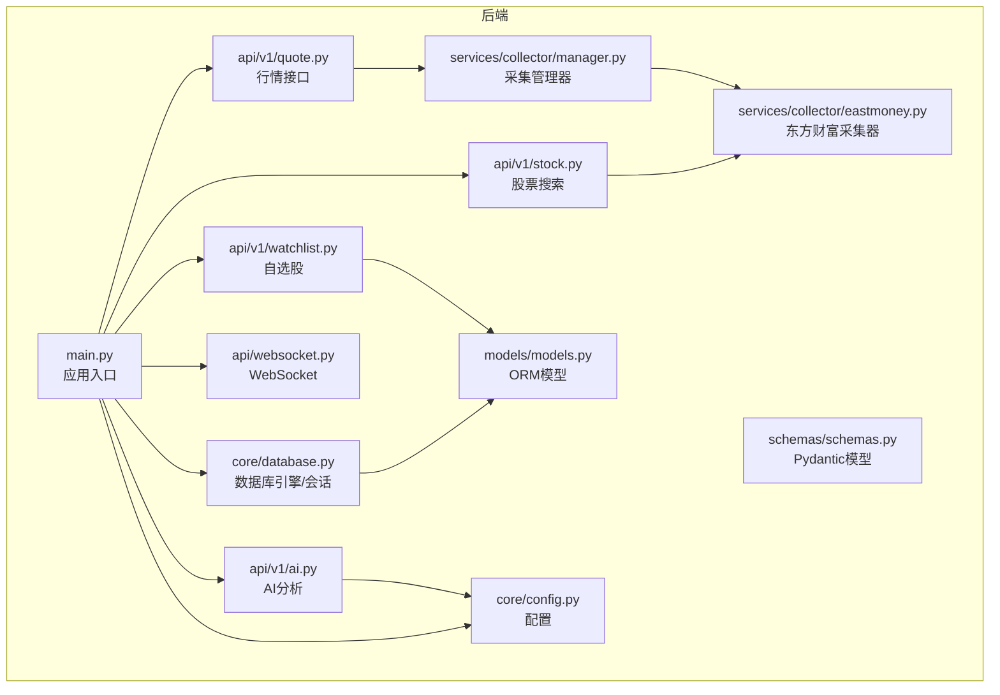
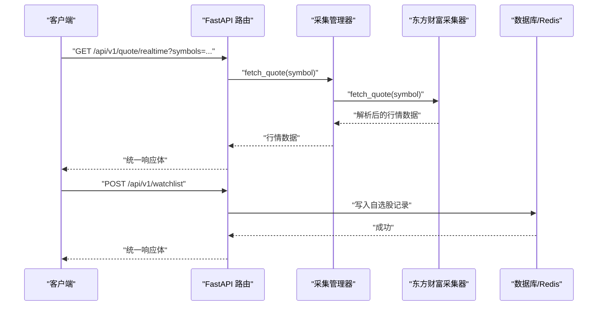
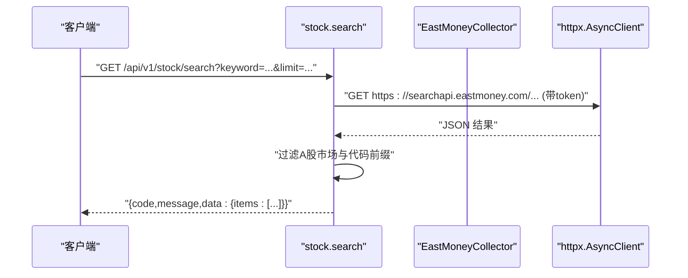
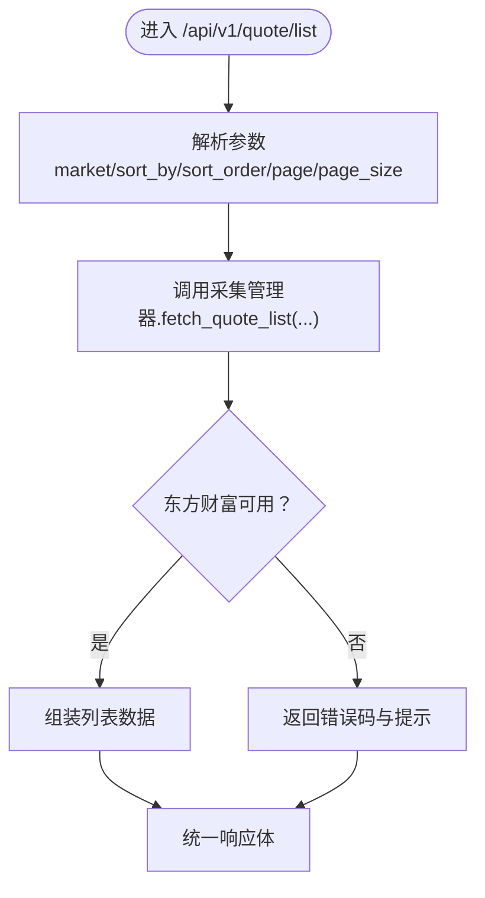
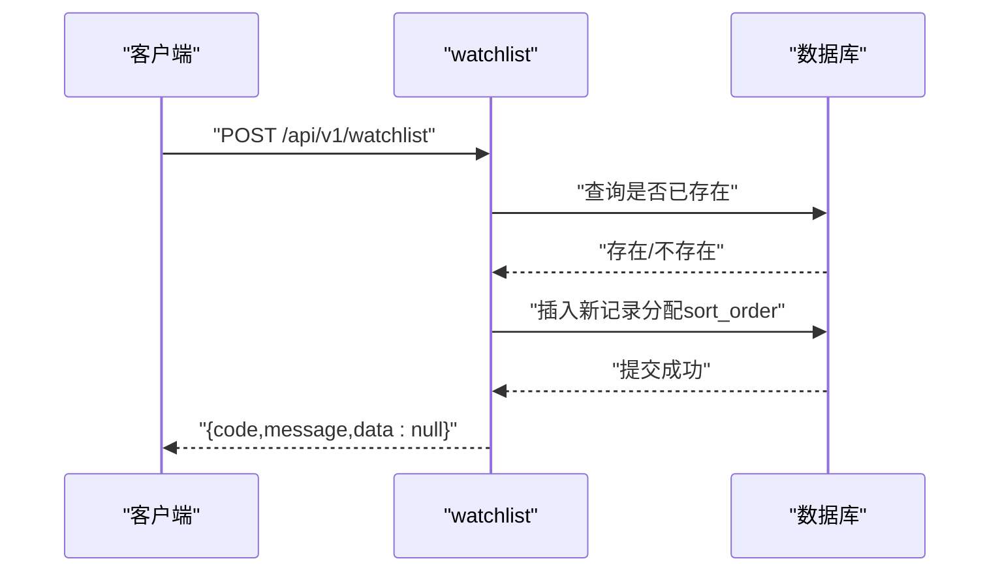
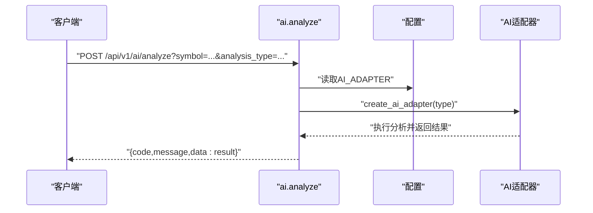
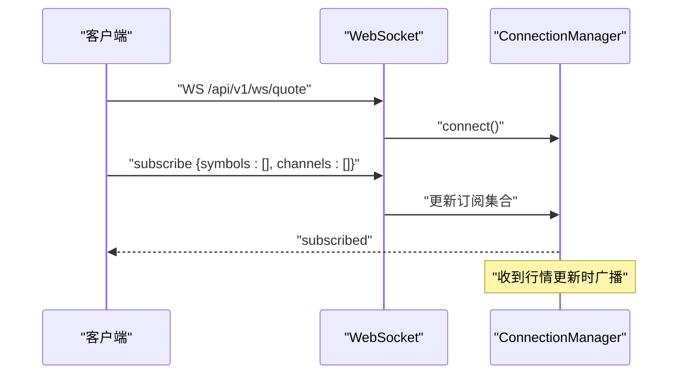
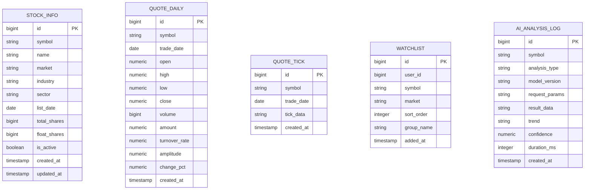
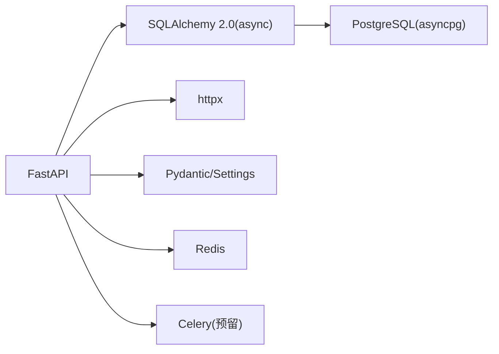

# 股票信息API

<cite>
**本文引用的文件**
- [main.py](file://backend/app/main.py)
- [stock.py](file://backend/app/api/v1/stock.py)
- [quote.py](file://backend/app/api/v1/quote.py)
- [watchlist.py](file://backend/app/api/v1/watchlist.py)
- [ai.py](file://backend/app/api/v1/ai.py)
- [models.py](file://backend/app/models/models.py)
- [schemas.py](file://backend/app/schemas/schemas.py)
- [database.py](file://backend/app/core/database.py)
- [config.py](file://backend/app/core/config.py)
- [manager.py](file://backend/app/services/collector/manager.py)
- [eastmoney.py](file://backend/app/services/collector/eastmoney.py)
- [websocket.py](file://backend/app/api/websocket.py)
- [requirements.txt](file://backend/requirements.txt)
- [README.md](file://README.md)
</cite>

## 目录
1. [简介](#简介)
2. [项目结构](#项目结构)
3. [核心组件](#核心组件)
4. [架构总览](#架构总览)
5. [详细组件分析](#详细组件分析)
6. [依赖分析](#依赖分析)
7. [性能考虑](#性能考虑)
8. [故障排查指南](#故障排查指南)
9. [结论](#结论)
10. [附录](#附录)

## 简介
本项目是一个基于 FastAPI 的 A股实时行情与 AI 分析平台，提供股票基础信息查询、股票搜索、行情数据获取、自选股管理、AI 分析以及 WebSocket 实时推送等能力。后端采用异步 SQLAlchemy 2.0、PostgreSQL 与 Redis，前端通过 API 文档与接口进行对接。本文档聚焦于“股票信息 API”的设计与实现，涵盖数据模型、数据库表结构、字段定义与关系映射，搜索算法实现原理（模糊匹配、关键词索引、搜索排序），以及完整的 API 接口说明、调用示例与响应格式。

## 项目结构
后端采用模块化分层组织，核心目录与职责如下：
- app/main.py：FastAPI 应用入口，注册路由、CORS、健康检查
- app/api/v1/*：REST API 路由模块（股票、行情、自选股、AI）
- app/models/models.py：SQLAlchemy 模型定义（StockInfo、QuoteDaily、QuoteTick、Watchlist、AIAnalysisLog）
- app/schemas/schemas.py：Pydantic 数据校验模型（统一响应体、行情、K线、分时、盘口、搜索、自选股、AI）
- app/core/*：核心基础设施（数据库连接、Redis、配置）
- app/services/collector/*：数据采集器（东方财富、新浪）与采集管理器（故障转移）
- app/api/websocket.py：WebSocket 实时推送
- requirements.txt：依赖清单

图表来源
- [main.py:1-48](file://backend/app/main.py#L1-L48)
- [stock.py:1-37](file://backend/app/api/v1/stock.py#L1-L37)
- [quote.py:1-65](file://backend/app/api/v1/quote.py#L1-L65)
- [watchlist.py:1-77](file://backend/app/api/v1/watchlist.py#L1-L77)
- [ai.py:1-29](file://backend/app/api/v1/ai.py#L1-L29)
- [websocket.py:1-79](file://backend/app/api/websocket.py#L1-L79)
- [manager.py:1-80](file://backend/app/services/collector/manager.py#L1-L80)
- [eastmoney.py:1-240](file://backend/app/services/collector/eastmoney.py#L1-L240)
- [database.py:1-25](file://backend/app/core/database.py#L1-L25)
- [config.py:1-43](file://backend/app/core/config.py#L1-L43)
- [models.py:1-74](file://backend/app/models/models.py#L1-L74)
- [schemas.py:1-103](file://backend/app/schemas/schemas.py#L1-L103)

章节来源
- [README.md:92-126](file://README.md#L92-L126)
- [main.py:1-48](file://backend/app/main.py#L1-L48)

## 核心组件
- 股票搜索接口：基于东方财富搜索建议接口，支持股票代码与拼音首字母模糊匹配，过滤 A 股市场，返回标准化结果。
- 行情接口：实时行情、行情列表、K线、分时、盘口，统一通过采集管理器进行主备数据源故障转移。
- 自选股接口：增删改查、排序调整，基于 PostgreSQL 存储。
- AI 分析接口：适配器模式，支持 mock/rule 等策略，预留外部服务集成。
- WebSocket 接口：订阅/退订行情，按股票与频道广播实时行情更新。
- 数据模型：StockInfo、QuoteDaily、QuoteTick、Watchlist、AIAnalysisLog，统一时间戳与状态字段。

章节来源
- [stock.py:10-37](file://backend/app/api/v1/stock.py#L10-L37)
- [quote.py:7-65](file://backend/app/api/v1/quote.py#L7-L65)
- [watchlist.py:13-77](file://backend/app/api/v1/watchlist.py#L13-L77)
- [ai.py:10-29](file://backend/app/api/v1/ai.py#L10-L29)
- [websocket.py:39-79](file://backend/app/api/websocket.py#L39-L79)
- [models.py:5-74](file://backend/app/models/models.py#L5-L74)

## 架构总览
系统采用“路由层-采集层-存储层-配置层”分层架构，核心流程如下：
- 路由层接收请求，参数校验与限流（如存在），调用采集层或数据库层。
- 采集层通过采集管理器进行主备数据源故障转移，统一解析为内部数据结构。
- 存储层使用异步 SQLAlchemy 与 PostgreSQL，Redis 用于缓存与消息队列。
- 配置层集中管理数据库、Redis、AI 适配器、采集间隔等参数。

图表来源
- [quote.py:7-16](file://backend/app/api/v1/quote.py#L7-L16)
- [manager.py:21-32](file://backend/app/services/collector/manager.py#L21-L32)
- [eastmoney.py:23-37](file://backend/app/services/collector/eastmoney.py#L23-L37)
- [watchlist.py:29-51](file://backend/app/api/v1/watchlist.py#L29-L51)

## 详细组件分析

### 股票搜索组件
- 功能概述：调用东方财富搜索建议接口，过滤 A 股市场（上交所/深交所），返回标准化的股票条目（代码、名称、市场、拼音）。
- 参数与约束：关键词必填；限制返回数量（1-20）。
- 返回结构：统一响应体 + items 列表，每项包含 symbol、name、market、pinyin。
- 错误处理：网络异常/解析失败时返回空列表，不抛出异常。

图表来源
- [stock.py:10-37](file://backend/app/api/v1/stock.py#L10-L37)
- [eastmoney.py:17-22](file://backend/app/services/collector/eastmoney.py#L17-L22)

章节来源
- [stock.py:10-37](file://backend/app/api/v1/stock.py#L10-L37)

### 行情数据组件
- 实时行情：支持批量股票代码（最多 50 个），逐个拉取并聚合返回。
- 行情列表：支持市场筛选（all/sh/sz）、排序字段与方向、分页。
- K线：支持周期（1m/5m/15m/30m/60m/d/w/m）、复权类型、返回条数限制。
- 分时：按交易日获取分时趋势点。
- 盘口：买卖五档盘口数据。
- 故障转移：优先使用主数据源，失败则切换备用数据源。

图表来源
- [quote.py:19-33](file://backend/app/api/v1/quote.py#L19-L33)
- [manager.py:34-43](file://backend/app/services/collector/manager.py#L34-L43)
- [eastmoney.py:39-99](file://backend/app/services/collector/eastmoney.py#L39-L99)

章节来源
- [quote.py:7-65](file://backend/app/api/v1/quote.py#L7-L65)
- [manager.py:12-77](file://backend/app/services/collector/manager.py#L12-L77)
- [eastmoney.py:23-240](file://backend/app/services/collector/eastmoney.py#L23-L240)

### 自选股组件
- 查询：按用户 ID 与排序顺序返回自选股列表。
- 新增：去重判断，自动分配排序序号。
- 删除：按用户 ID 与股票代码删除。
- 排序：批量更新排序序号。

图表来源
- [watchlist.py:29-51](file://backend/app/api/v1/watchlist.py#L29-L51)
- [models.py:50-59](file://backend/app/models/models.py#L50-L59)

章节来源
- [watchlist.py:13-77](file://backend/app/api/v1/watchlist.py#L13-L77)
- [models.py:50-59](file://backend/app/models/models.py#L50-L59)

### AI 分析组件
- 分析请求：支持指定分析类型与周期天数，适配器模式选择具体实现。
- 历史查询：预留接口，当前返回空列表。
- 模型信息：返回适配器的模型信息。

图表来源
- [ai.py:10-15](file://backend/app/api/v1/ai.py#L10-L15)
- [config.py:19-24](file://backend/app/core/config.py#L19-L24)

章节来源
- [ai.py:10-29](file://backend/app/api/v1/ai.py#L10-L29)
- [config.py:19-24](file://backend/app/core/config.py#L19-L24)

### WebSocket 组件
- 订阅：建立连接后发送订阅消息，支持多股票与多频道。
- 广播：根据订阅关系向客户端推送行情更新。
- 心跳：ping/pong 协议维持连接。

图表来源
- [websocket.py:39-79](file://backend/app/api/websocket.py#L39-L79)

章节来源
- [websocket.py:12-79](file://backend/app/api/websocket.py#L12-L79)

### 数据模型与数据库表结构
- StockInfo：股票基础信息，包含代码、名称、市场、行业、板块、上市日期、总股本、流通股本、状态与时间戳。
- QuoteDaily：日线行情，包含日期、开盘/最高/最低/收盘、成交量/成交额、换手率、振幅、涨跌幅等。
- QuoteTick：分时/逐笔行情，以 JSON 字符串存储原始数据。
- Watchlist：自选股，包含用户标识、股票代码、市场、排序序号与分组名。
- AIAnalysisLog：AI 分析日志，包含股票、分析类型、模型版本、请求参数、结果、趋势、置信度、耗时与时间戳。

图表来源
- [models.py:5-74](file://backend/app/models/models.py#L5-L74)

章节来源
- [models.py:5-74](file://backend/app/models/models.py#L5-L74)

## 依赖分析
- FastAPI：路由与异步 Web 框架。
- SQLAlchemy 2.0（async）：异步 ORM，PostgreSQL 驱动 asyncpg。
- Redis：缓存与消息队列。
- httpx：异步 HTTP 客户端，用于调用第三方数据源。
- Pydantic/Settings：数据校验与配置管理。
- Celery/Redis：异步任务队列（预留）。

图表来源
- [requirements.txt:1-17](file://backend/requirements.txt#L1-L17)
- [database.py:7-8](file://backend/app/core/database.py#L7-L8)
- [config.py:12-27](file://backend/app/core/config.py#L12-L27)

章节来源
- [requirements.txt:1-17](file://backend/requirements.txt#L1-L17)
- [database.py:7-25](file://backend/app/core/database.py#L7-L25)
- [config.py:12-43](file://backend/app/core/config.py#L12-L43)

## 性能考虑
- 异步 I/O：使用 httpx 与 SQLAlchemy 异步，减少阻塞。
- 连接池：数据库连接池大小与溢出配置，降低连接开销。
- 缓存：Redis 缓存热点数据与 AI 分析结果，降低重复计算。
- 限流与超时：接口参数约束与第三方请求超时控制，避免雪崩。
- 批量处理：实时行情一次传入多个股票代码，减少多次往返。
- 故障转移：主备数据源自动切换，提升可用性。

章节来源
- [database.py:7-8](file://backend/app/core/database.py#L7-L8)
- [config.py:22-24](file://backend/app/core/config.py#L22-L24)
- [quote.py:10-16](file://backend/app/api/v1/quote.py#L10-L16)
- [manager.py:21-32](file://backend/app/services/collector/manager.py#L21-L32)

## 故障排查指南
- 健康检查：访问 /api/v1/health，确认服务正常。
- CORS 问题：后端已允许任意来源跨域，若仍报错检查前端代理与端口。
- 数据源不可用：行情列表与部分接口返回特定错误码与提示，检查网络与第三方接口状态。
- 数据库连接失败：检查 DATABASE_URL 与 PostgreSQL 服务状态。
- Redis 连接失败：检查 REDIS_URL 与 Redis 服务状态。
- WebSocket 断连：检查 ping/pong 心跳与订阅集合，确认客户端正确处理断线重连。

章节来源
- [main.py:46-48](file://backend/app/main.py#L46-L48)
- [quote.py:31-33](file://backend/app/api/v1/quote.py#L31-L33)
- [config.py:12-14](file://backend/app/core/config.py#L12-L14)

## 结论
本项目提供了完整的股票信息服务 API，覆盖搜索、行情、自选股与 AI 分析等核心能力。通过异步架构、主备数据源与统一响应体设计，具备良好的扩展性与稳定性。建议在生产环境中进一步完善：
- 行情缓存策略与失效控制
- 搜索关键词索引与排序优化
- AI 分析结果持久化与可视化
- WebSocket 订阅去重与离线重连

## 附录

### API 接口一览与规范
- 股票搜索
  - 方法与路径：GET /api/v1/stock/search
  - 请求参数：
    - keyword：搜索关键词（必填）
    - limit：返回数量（1-20，默认 10）
  - 响应：统一响应体 + data.items（包含 symbol、name、market、pinyin）

- 实时行情
  - 方法与路径：GET /api/v1/quote/realtime
  - 请求参数：
    - symbols：逗号分隔的股票代码（最多 50 个）
  - 响应：统一响应体 + data.items（包含实时行情字段）

- 行情列表
  - 方法与路径：GET /api/v1/quote/list
  - 请求参数：
    - market：all/sh/sz（默认 all）
    - sort_by：change_pct/volume/amount/turnover（默认 change_pct）
    - sort_order：asc/desc（默认 desc）
    - page：页码（≥1）
    - page_size：每页数量（1-100，默认 20）
  - 响应：统一响应体 + data（包含 items、total、page、page_size）

- K线
  - 方法与路径：GET /api/v1/quote/kline
  - 请求参数：
    - symbol：股票代码（必填）
    - period：周期（1m/5m/15m/30m/60m/d/w/m，默认 d）
    - fq_type：复权类型（none/front/back，默认 front）
    - limit：返回数量（1-500，默认 120）
  - 响应：统一响应体 + data（包含 symbol、period、fq_type、items）

- 分时
  - 方法与路径：GET /api/v1/quote/timeline
  - 请求参数：symbol（必填）
  - 响应：统一响应体 + data（包含 symbol、date、prev_close、points）

- 盘口
  - 方法与路径：GET /api/v1/quote/orderbook
  - 请求参数：symbol（必填）
  - 响应：统一响应体 + data（包含 symbol、timestamp、asks、bids）

- 自选股
  - GET /api/v1/watchlist：查询自选股列表
  - POST /api/v1/watchlist：新增自选股（请求体：symbol、market）
  - DELETE /api/v1/watchlist/{symbol}：删除自选股
  - PUT /api/v1/watchlist/sort：批量排序（请求体：items[{symbol, sort_order}])

- AI 分析
  - POST /api/v1/ai/analyze：请求分析（参数：symbol、analysis_type、period_days）
  - GET /api/v1/ai/history：历史记录（预留）
  - GET /api/v1/ai/model-info：模型信息

- WebSocket
  - WS /api/v1/ws/quote：订阅/退订/心跳
    - 订阅：{"action":"subscribe","symbols":[],"channels":[]}
    - 退订：{"action":"unsubscribe","symbols":[]}
    - 心跳：{"action":"ping"}

章节来源
- [stock.py:10-37](file://backend/app/api/v1/stock.py#L10-L37)
- [quote.py:7-65](file://backend/app/api/v1/quote.py#L7-L65)
- [watchlist.py:13-77](file://backend/app/api/v1/watchlist.py#L13-L77)
- [ai.py:10-29](file://backend/app/api/v1/ai.py#L10-L29)
- [websocket.py:39-79](file://backend/app/api/websocket.py#L39-L79)

### 数据验证与异常处理
- 参数校验：使用 Query 与 Pydantic 模型对输入参数进行范围与类型约束。
- 异常处理：接口层捕获异常并返回统一响应体，采集层记录警告日志并尝试故障转移。
- 响应格式：统一响应体包含 code、message、data，便于前端一致处理。

章节来源
- [schemas.py:6-10](file://backend/app/schemas/schemas.py#L6-L10)
- [quote.py:31-33](file://backend/app/api/v1/quote.py#L31-L33)
- [eastmoney.py:35-37](file://backend/app/services/collector/eastmoney.py#L35-L37)

### 调用示例与响应格式
- 示例（股票搜索）：
  - 请求：GET /api/v1/stock/search?keyword=贵州茅台&limit=10
  - 响应：{"code":0,"message":"success","data":{"items":[{"symbol":"600519","name":"贵州茅台","market":"sh","pinyin":"guizhoumoutai"}]}}
- 示例（实时行情）：
  - 请求：GET /api/v1/quote/realtime?symbols=600519,000001
  - 响应：{"code":0,"message":"success","data":{"items":[{...},{...}]}}
- 示例（行情列表）：
  - 请求：GET /api/v1/quote/list?market=all&sort_by=change_pct&sort_order=desc&page=1&page_size=20
  - 响应：{"code":0,"message":"success","data":{"items":[{...}], "total":..., "page":1, "page_size":20}}
- 示例（K线）：
  - 请求：GET /api/v1/quote/kline?symbol=600519&period=d&fq_type=front&limit=120
  - 响应：{"code":0,"message":"success","data":{"symbol":"600519","period":"d","fq_type":"front","items":[{...}]}}
- 示例（分时）：
  - 请求：GET /api/v1/quote/timeline?symbol=600519
  - 响应：{"code":0,"message":"success","data":{"symbol":"600519","date":"YYYYMMDD","prev_close":..., "points":[{...}]}}
- 示例（盘口）：
  - 请求：GET /api/v1/quote/orderbook?symbol=600519
  - 响应：{"code":0,"message":"success","data":{"symbol":"600519","timestamp":"...","asks":[{...}],"bids":[{...}]}}
- 示例（自选股）：
  - 新增：POST /api/v1/watchlist，请求体：{"symbol":"600519","market":"sh"}
  - 响应：{"code":0,"message":"success","data":null}
- 示例（AI 分析）：
  - 请求：POST /api/v1/ai/analyze?symbol=600519&analysis_type=comprehensive&period_days=30
  - 响应：{"code":0,"message":"success","data":{...}}
- 示例（WebSocket）：
  - 订阅：{"action":"subscribe","symbols":["600519"],"channels":["quote"]}
  - 响应：{"action":"subscribed","symbols":["600519"],"channels":["quote"]}

章节来源
- [stock.py:10-37](file://backend/app/api/v1/stock.py#L10-L37)
- [quote.py:7-65](file://backend/app/api/v1/quote.py#L7-L65)
- [watchlist.py:29-51](file://backend/app/api/v1/watchlist.py#L29-L51)
- [ai.py:10-15](file://backend/app/api/v1/ai.py#L10-L15)
- [websocket.py:39-79](file://backend/app/api/websocket.py#L39-L79)