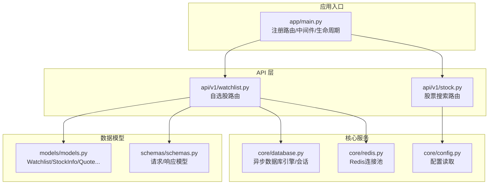
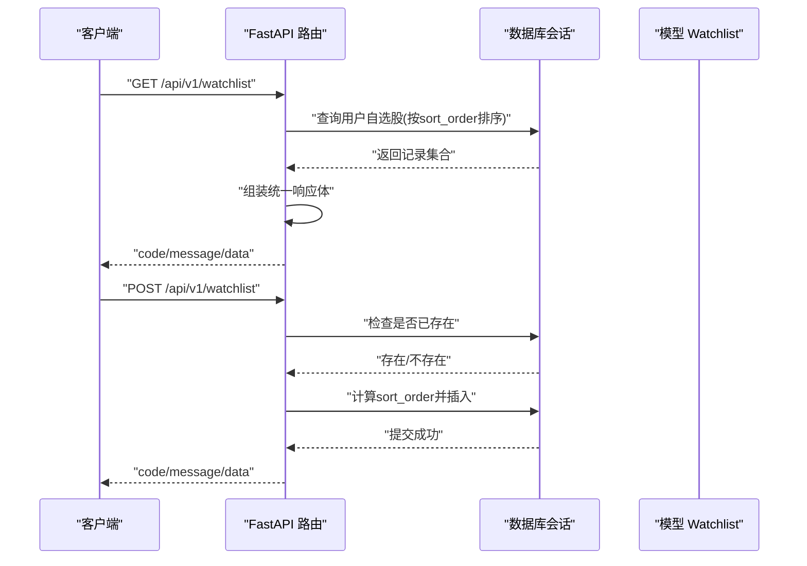
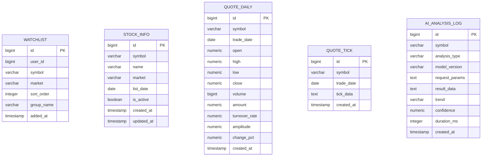
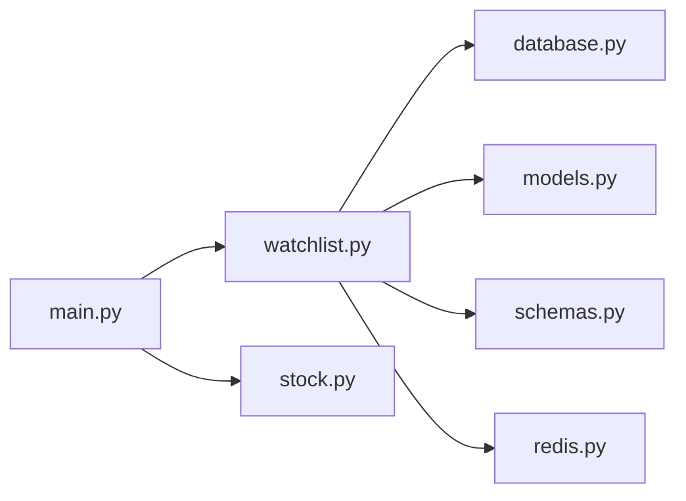

# 自选股管理API

<cite>
**本文引用的文件**
- [backend/app/api/v1/watchlist.py](file://backend/app/api/v1/watchlist.py)
- [backend/app/models/models.py](file://backend/app/models/models.py)
- [backend/app/schemas/schemas.py](file://backend/app/schemas/schemas.py)
- [backend/app/core/database.py](file://backend/app/core/database.py)
- [backend/app/core/redis.py](file://backend/app/core/redis.py)
- [backend/app/core/config.py](file://backend/app/core/config.py)
- [backend/app/main.py](file://backend/app/main.py)
- [backend/app/api/v1/stock.py](file://backend/app/api/v1/stock.py)
</cite>

## 目录
1. [简介](#简介)
2. [项目结构](#项目结构)
3. [核心组件](#核心组件)
4. [架构总览](#架构总览)
5. [详细组件分析](#详细组件分析)
6. [依赖分析](#依赖分析)
7. [性能考虑](#性能考虑)
8. [故障排查指南](#故障排查指南)
9. [结论](#结论)
10. [附录](#附录)

## 简介
本文件面向“自选股管理API”的使用者与维护者，系统化梳理该模块的接口定义、数据模型、业务流程、错误处理与性能优化策略。当前实现聚焦于自选股的增删改查、排序管理与分组能力，并通过统一响应体与FastAPI路由组织对外提供RESTful风格的接口。

## 项目结构
后端采用FastAPI + SQLAlchemy异步ORM + PostgreSQL + Redis的典型架构。自选股模块位于API v1层，数据模型与校验模型分别在models与schemas目录下，数据库与Redis连接在core目录中集中管理。

图表来源
- [backend/app/main.py:1-48](file://backend/app/main.py#L1-L48)
- [backend/app/api/v1/watchlist.py:1-77](file://backend/app/api/v1/watchlist.py#L1-L77)
- [backend/app/api/v1/stock.py:1-37](file://backend/app/api/v1/stock.py#L1-L37)
- [backend/app/core/database.py:1-25](file://backend/app/core/database.py#L1-L25)
- [backend/app/core/redis.py:1-25](file://backend/app/core/redis.py#L1-L25)
- [backend/app/core/config.py:1-43](file://backend/app/core/config.py#L1-L43)
- [backend/app/models/models.py:1-74](file://backend/app/models/models.py#L1-L74)
- [backend/app/schemas/schemas.py:1-103](file://backend/app/schemas/schemas.py#L1-L103)

章节来源
- [backend/app/main.py:1-48](file://backend/app/main.py#L1-L48)
- [backend/app/api/v1/watchlist.py:1-77](file://backend/app/api/v1/watchlist.py#L1-L77)
- [backend/app/core/database.py:1-25](file://backend/app/core/database.py#L1-L25)
- [backend/app/core/redis.py:1-25](file://backend/app/core/redis.py#L1-L25)
- [backend/app/core/config.py:1-43](file://backend/app/core/config.py#L1-L43)
- [backend/app/models/models.py:1-74](file://backend/app/models/models.py#L1-L74)
- [backend/app/schemas/schemas.py:1-103](file://backend/app/schemas/schemas.py#L1-L103)
- [backend/app/api/v1/stock.py:1-37](file://backend/app/api/v1/stock.py#L1-L37)

## 核心组件
- 自选股路由模块：提供获取、新增、删除、排序调整等接口，统一返回结构为包含code/message/data的对象。
- 数据模型：Watchlist表包含用户标识、股票代码、市场、排序字段与分组字段等。
- 请求/响应模型：使用Pydantic定义输入参数与输出格式，确保类型安全与参数校验。
- 数据库与Redis：异步数据库会话由依赖注入提供；Redis用于缓存与消息队列等扩展场景。

章节来源
- [backend/app/api/v1/watchlist.py:13-77](file://backend/app/api/v1/watchlist.py#L13-L77)
- [backend/app/models/models.py:50-60](file://backend/app/models/models.py#L50-L60)
- [backend/app/schemas/schemas.py:78-91](file://backend/app/schemas/schemas.py#L78-L91)
- [backend/app/core/database.py:15-21](file://backend/app/core/database.py#L15-L21)
- [backend/app/core/redis.py:10-18](file://backend/app/core/redis.py#L10-L18)

## 架构总览
自选股API遵循RESTful设计，路径前缀为/api/v1/watchlist，结合FastAPI的依赖注入机制，统一从数据库获取会话并执行CRUD操作。返回体采用统一结构，便于前端一致化处理。

图表来源
- [backend/app/api/v1/watchlist.py:13-51](file://backend/app/api/v1/watchlist.py#L13-L51)
- [backend/app/core/database.py:15-21](file://backend/app/core/database.py#L15-L21)

## 详细组件分析

### 接口规范与行为
- 获取自选股列表
  - 方法与路径：GET /api/v1/watchlist
  - 认证与权限：当前实现固定默认用户ID，未做JWT鉴权
  - 参数：无
  - 返回：统一响应体，data.items包含symbol、market、sort_order等字段
  - 排序：按sort_order升序返回
- 新增自选股
  - 方法与路径：POST /api/v1/watchlist
  - 请求体：包含symbol与market字段
  - 业务逻辑：若已存在则返回重复错误码；否则计算最大sort_order+1作为新顺序，插入记录
  - 错误码：重复时返回特定错误码
- 删除自选股
  - 方法与路径：DELETE /api/v1/watchlist/{symbol}
  - 参数：路径参数symbol
  - 行为：按用户ID与symbol删除对应记录
- 调整排序
  - 方法与路径：PUT /api/v1/watchlist/sort
  - 请求体：items数组，每项包含symbol与sort_order
  - 行为：逐项更新sort_order并提交事务

章节来源
- [backend/app/api/v1/watchlist.py:13-77](file://backend/app/api/v1/watchlist.py#L13-L77)
- [backend/app/schemas/schemas.py:78-91](file://backend/app/schemas/schemas.py#L78-L91)

### 数据模型与数据库结构
- Watchlist表
  - 字段：id、user_id、symbol、market、sort_order、group_name、added_at
  - 默认值：user_id默认为1；sort_order默认为0；group_name默认"default"
  - 约束：非空字段与默认值保证基本一致性
- 其他相关表
  - StockInfo：股票基础信息
  - QuoteDaily/QuoteTick：行情数据
  - AIAnalysisLog：AI分析日志

图表来源
- [backend/app/models/models.py:50-74](file://backend/app/models/models.py#L50-L74)

章节来源
- [backend/app/models/models.py:50-60](file://backend/app/models/models.py#L50-L60)

### 请求/响应模型与参数校验
- WatchlistAddRequest：新增自选股的输入模型，包含symbol与market字段，默认market为"sh"
- WatchlistSortItem：排序项模型，包含symbol与sort_order
- WatchlistSortRequest：排序请求模型，包含items数组
- 统一响应基类：ResponseBase，包含code与message字段

章节来源
- [backend/app/schemas/schemas.py:78-91](file://backend/app/schemas/schemas.py#L78-L91)
- [backend/app/schemas/schemas.py:6-10](file://backend/app/schemas/schemas.py#L6-L10)

### 依赖注入与数据库连接
- get_db：异步数据库会话生成器，使用依赖注入在每个请求内提供session
- init_db：应用启动时初始化所有表结构
- 引擎配置：异步驱动、连接池大小、溢出数量等

章节来源
- [backend/app/core/database.py:15-25](file://backend/app/core/database.py#L15-L25)

### 缓存与Redis集成
- get_redis：全局Redis连接池，首次调用时建立连接
- close_redis：应用关闭时释放连接池
- 配置项：REDIS_URL、AI_CACHE_ENABLED/AI_CACHE_TTL等

章节来源
- [backend/app/core/redis.py:10-25](file://backend/app/core/redis.py#L10-L25)
- [backend/app/core/config.py:14-24](file://backend/app/core/config.py#L14-L24)

### 股票搜索辅助接口
- GET /api/v1/stock/search：基于第三方接口的股票搜索，返回符合A股条件的结果
- 用途：为自选股添加提供候选股票

章节来源
- [backend/app/api/v1/stock.py:10-37](file://backend/app/api/v1/stock.py#L10-L37)

## 依赖分析
- 模块耦合
  - watchlist路由依赖数据库会话、模型与请求模型
  - 应用入口负责注册路由与中间件，统一暴露各模块
- 外部依赖
  - FastAPI：路由与依赖注入
  - SQLAlchemy异步：ORM与会话管理
  - Redis：缓存与消息队列
  - Pydantic：请求/响应模型校验

图表来源
- [backend/app/main.py:39-43](file://backend/app/main.py#L39-L43)
- [backend/app/api/v1/watchlist.py:1-8](file://backend/app/api/v1/watchlist.py#L1-L8)
- [backend/app/core/database.py:1-2](file://backend/app/core/database.py#L1-L2)
- [backend/app/core/redis.py:1-2](file://backend/app/core/redis.py#L1-L2)
- [backend/app/models/models.py:1-2](file://backend/app/models/models.py#L1-L2)
- [backend/app/schemas/schemas.py:1-3](file://backend/app/schemas/schemas.py#L1-L3)
- [backend/app/api/v1/stock.py:1-4](file://backend/app/api/v1/stock.py#L1-L4)

章节来源
- [backend/app/main.py:39-43](file://backend/app/main.py#L39-L43)
- [backend/app/api/v1/watchlist.py:1-8](file://backend/app/api/v1/watchlist.py#L1-L8)

## 性能考虑
- 数据库连接池：异步引擎配置了连接池大小与溢出，适合高并发场景
- 查询优化：按sort_order排序与按用户过滤，建议在user_id与sort_order上建立索引以提升查询效率
- 批量排序：排序接口一次提交多条记录，减少往返次数
- 缓存策略：Redis可用于热点数据缓存与限流，配置项支持开启与TTL设置
- 建议
  - 在Watchlist表上为user_id、symbol建立复合索引或唯一索引，避免重复添加
  - 对高频查询结果进行Redis缓存，设置合理TTL
  - 对排序更新采用批量写入，避免多次事务开销

章节来源
- [backend/app/core/database.py:7-8](file://backend/app/core/database.py#L7-L8)
- [backend/app/core/config.py:22-24](file://backend/app/core/config.py#L22-L24)
- [backend/app/models/models.py:54-58](file://backend/app/models/models.py#L54-L58)

## 故障排查指南
- 常见错误与处理
  - 重复添加：当symbol已存在于当前用户自选中，返回特定错误码，提示已在自选股中
  - 数据库异常：查询或提交失败时，需检查数据库连接与事务提交
  - 参数缺失：请求体不满足Pydantic模型要求时，FastAPI会返回422错误
- 排查步骤
  - 确认用户ID与symbol是否正确
  - 检查数据库表结构与索引是否存在
  - 查看Redis连接状态与配置
  - 使用健康检查接口确认服务可用

章节来源
- [backend/app/api/v1/watchlist.py:38-40](file://backend/app/api/v1/watchlist.py#L38-L40)
- [backend/app/main.py:46-48](file://backend/app/main.py#L46-L48)

## 结论
当前自选股管理API实现了基础的增删改查与排序功能，数据模型清晰、接口简洁。后续可扩展的方向包括：用户认证与授权、分组管理、批量操作、缓存与性能优化、以及更完善的错误码与日志体系。建议尽快补齐用户上下文注入与权限控制，以适配多用户场景。

## 附录

### 接口清单与调用示例（路径参考）
- 获取自选股列表
  - 方法：GET
  - 路径：/api/v1/watchlist
  - 示例：curl -i "http://localhost:8000/api/v1/watchlist"
  - 返回：统一响应体，data.items为股票列表
- 新增自选股
  - 方法：POST
  - 路径：/api/v1/watchlist
  - 请求体：{"symbol": "...", "market": "sh|sz"}
  - 示例：curl -i -X POST "http://localhost:8000/api/v1/watchlist" -H "Content-Type: application/json" -d '{"symbol":"000001","market":"sz"}'
  - 返回：code=0表示成功，重复时返回特定错误码
- 删除自选股
  - 方法：DELETE
  - 路径：/api/v1/watchlist/{symbol}
  - 示例：curl -i -X DELETE "http://localhost:8000/api/v1/watchlist/000001"
  - 返回：code=0表示成功
- 调整排序
  - 方法：PUT
  - 路径：/api/v1/watchlist/sort
  - 请求体：{"items":[{"symbol":"000001","sort_order":1},{"symbol":"600036","sort_order":2}]}
  - 示例：curl -i -X PUT "http://localhost:8000/api/v1/watchlist/sort" -H "Content-Type: application/json" -d '{"items":[{"symbol":"000001","sort_order":1}]}'
  - 返回：code=0表示成功

章节来源
- [backend/app/api/v1/watchlist.py:13-77](file://backend/app/api/v1/watchlist.py#L13-L77)
- [backend/app/schemas/schemas.py:78-91](file://backend/app/schemas/schemas.py#L78-L91)