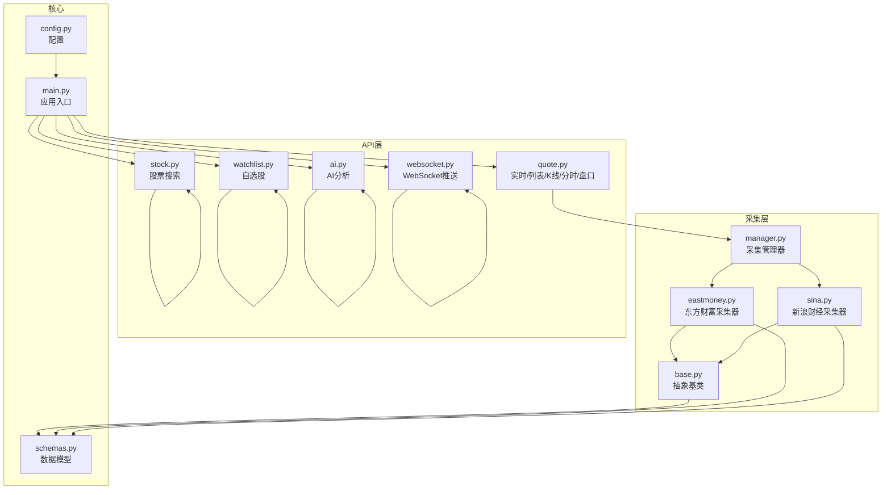
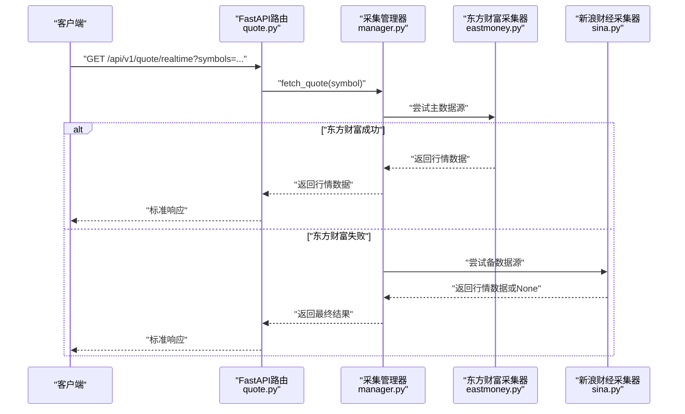
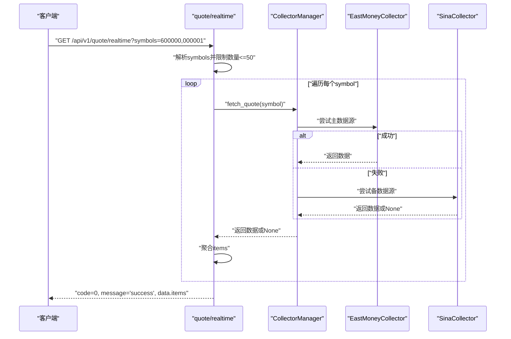
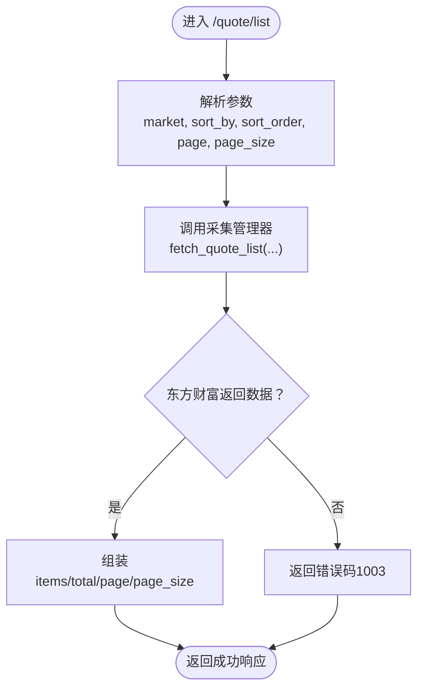
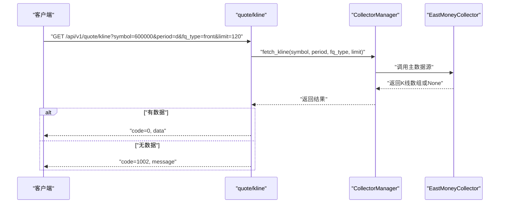
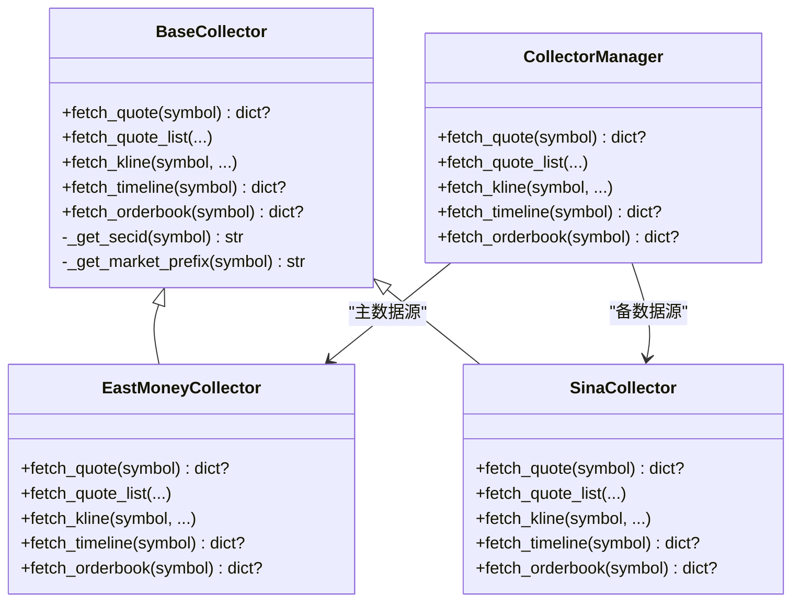

# 行情数据API

<cite>
**本文引用的文件**
- [backend/app/main.py](file://backend/app/main.py)
- [backend/app/api/v1/quote.py](file://backend/app/api/v1/quote.py)
- [backend/app/api/v1/stock.py](file://backend/app/api/v1/stock.py)
- [backend/app/api/v1/watchlist.py](file://backend/app/api/v1/watchlist.py)
- [backend/app/api/v1/ai.py](file://backend/app/api/v1/ai.py)
- [backend/app/api/websocket.py](file://backend/app/api/websocket.py)
- [backend/app/services/collector/manager.py](file://backend/app/services/collector/manager.py)
- [backend/app/services/collector/base.py](file://backend/app/services/collector/base.py)
- [backend/app/services/collector/eastmoney.py](file://backend/app/services/collector/eastmoney.py)
- [backend/app/services/collector/sina.py](file://backend/app/services/collector/sina.py)
- [backend/app/schemas/schemas.py](file://backend/app/schemas/schemas.py)
- [backend/app/core/config.py](file://backend/app/core/config.py)
- [README.md](file://README.md)
- [Stock-View 软件开发文档/开发文档.md](file://Stock-View 软件开发文档/开发文档.md)
</cite>

## 目录
1. [简介](#简介)
2. [项目结构](#项目结构)
3. [核心组件](#核心组件)
4. [架构总览](#架构总览)
5. [详细组件分析](#详细组件分析)
6. [依赖分析](#依赖分析)
7. [性能考虑](#性能考虑)
8. [故障排查指南](#故障排查指南)
9. [结论](#结论)
10. [附录](#附录)

## 简介
本文件为“行情数据API”的权威技术文档，覆盖实时行情、K线数据、分时数据、盘口数据等核心接口的设计与实现。内容包括：
- 接口功能、参数规范、请求格式、响应结构与错误处理
- 数据获取流程：数据源选择、故障转移、异步处理
- 缓存策略与性能优化建议
- 完整调用示例与业务逻辑（如股票代码校验、数据过滤、排序规则）

## 项目结构
后端采用FastAPI框架，按功能模块组织：
- API层：/api/v1 下的 quote.py、stock.py、watchlist.py、ai.py、websocket.py
- 采集层：/services/collector 下的抽象基类与具体采集器（东方财富、新浪财经）
- 核心配置：/core/config.py
- 数据模型与响应结构：/schemas/schemas.py
- 应用入口与路由注册：/main.py

图表来源
- [backend/app/main.py:1-48](file://backend/app/main.py#L1-L48)
- [backend/app/api/v1/quote.py:1-65](file://backend/app/api/v1/quote.py#L1-L65)
- [backend/app/api/v1/stock.py:1-37](file://backend/app/api/v1/stock.py#L1-L37)
- [backend/app/api/v1/watchlist.py:1-77](file://backend/app/api/v1/watchlist.py#L1-L77)
- [backend/app/api/v1/ai.py:1-29](file://backend/app/api/v1/ai.py#L1-L29)
- [backend/app/api/websocket.py:1-79](file://backend/app/api/websocket.py#L1-L79)
- [backend/app/services/collector/manager.py:1-80](file://backend/app/services/collector/manager.py#L1-L80)
- [backend/app/services/collector/base.py:1-45](file://backend/app/services/collector/base.py#L1-L45)
- [backend/app/services/collector/eastmoney.py:1-240](file://backend/app/services/collector/eastmoney.py#L1-L240)
- [backend/app/services/collector/sina.py:1-79](file://backend/app/services/collector/sina.py#L1-L79)
- [backend/app/schemas/schemas.py:1-103](file://backend/app/schemas/schemas.py#L1-L103)
- [backend/app/core/config.py:1-43](file://backend/app/core/config.py#L1-L43)

章节来源
- [backend/app/main.py:1-48](file://backend/app/main.py#L1-L48)
- [README.md:92-126](file://README.md#L92-L126)

## 核心组件
- API路由器：在quote.py中定义了实时行情、行情列表、K线、分时、盘口五个端点；在stock.py中定义了股票搜索端点；在watchlist.py中定义了自选股管理端点；在ai.py中定义了AI分析端点；在websocket.py中定义了WebSocket推送通道。
- 采集管理器：CollectorManager负责按优先级选择数据源并进行故障转移，封装统一的异步采集接口。
- 采集器实现：EastMoneyCollector与SinaCollector分别对接不同数据源，实现抽象基类定义的统一方法。
- 数据模型：schemas.py中定义了通用响应结构与各接口的数据模型（QuoteItem、KlineItem、TimelinePoint、OrderBookLevel等）。

章节来源
- [backend/app/api/v1/quote.py:1-65](file://backend/app/api/v1/quote.py#L1-L65)
- [backend/app/api/v1/stock.py:1-37](file://backend/app/api/v1/stock.py#L1-L37)
- [backend/app/api/v1/watchlist.py:1-77](file://backend/app/api/v1/watchlist.py#L1-L77)
- [backend/app/api/v1/ai.py:1-29](file://backend/app/api/v1/ai.py#L1-L29)
- [backend/app/api/websocket.py:1-79](file://backend/app/api/websocket.py#L1-L79)
- [backend/app/services/collector/manager.py:1-80](file://backend/app/services/collector/manager.py#L1-L80)
- [backend/app/services/collector/base.py:1-45](file://backend/app/services/collector/base.py#L1-L45)
- [backend/app/schemas/schemas.py:1-103](file://backend/app/schemas/schemas.py#L1-L103)

## 架构总览
系统采用“API层 → 采集管理器 → 具体采集器”的分层架构，支持主备数据源自动故障转移，统一异步HTTP请求，返回标准化数据模型。

图表来源
- [backend/app/api/v1/quote.py:7-16](file://backend/app/api/v1/quote.py#L7-L16)
- [backend/app/services/collector/manager.py:21-32](file://backend/app/services/collector/manager.py#L21-L32)
- [backend/app/services/collector/eastmoney.py:23-37](file://backend/app/services/collector/eastmoney.py#L23-L37)
- [backend/app/services/collector/sina.py:19-60](file://backend/app/services/collector/sina.py#L19-L60)

## 详细组件分析

### 实时行情接口
- 端点：GET /api/v1/quote/realtime
- 功能：批量获取多只股票的实时行情，最多支持50个股票代码。
- 参数：
  - symbols：字符串，必填，逗号分隔的股票代码列表
  - 字段筛选：可扩展（当前实现未做字段过滤）
- 请求格式：查询参数
- 响应结构：通用响应 + data.items（每项为QuoteItem）
- 错误处理：
  - 单个股票无数据时跳过，返回部分成功
  - 无可用数据源时返回“数据源暂不可用”（代码1003）
- 业务逻辑：
  - 对symbols进行去重与长度限制（最多50）
  - 逐个调用采集管理器fetch_quote，聚合结果
  - 若所有数据源均失败，返回错误码1003

图表来源
- [backend/app/api/v1/quote.py:7-16](file://backend/app/api/v1/quote.py#L7-L16)
- [backend/app/services/collector/manager.py:21-32](file://backend/app/services/collector/manager.py#L21-L32)
- [backend/app/services/collector/eastmoney.py:23-37](file://backend/app/services/collector/eastmoney.py#L23-L37)
- [backend/app/services/collector/sina.py:19-60](file://backend/app/services/collector/sina.py#L19-L60)

章节来源
- [backend/app/api/v1/quote.py:7-16](file://backend/app/api/v1/quote.py#L7-L16)
- [backend/app/schemas/schemas.py:13-28](file://backend/app/schemas/schemas.py#L13-L28)

### 行情列表接口
- 端点：GET /api/v1/quote/list
- 功能：分页获取A股行情列表，支持按字段排序与市场过滤。
- 参数：
  - market：all/sh/sz，默认all
  - sort_by：change_pct/volume/amount/turnover，默认change_pct
  - sort_order：asc/desc，默认desc
  - page：≥1，默认1
  - page_size：1-100，默认20
- 请求格式：查询参数
- 响应结构：通用响应 + data（包含items、total、page、page_size）
- 错误处理：若主数据源不可用，返回“数据源暂不可用”（代码1003）

图表来源
- [backend/app/api/v1/quote.py:19-33](file://backend/app/api/v1/quote.py#L19-L33)
- [backend/app/services/collector/manager.py:34-43](file://backend/app/services/collector/manager.py#L34-L43)
- [backend/app/services/collector/eastmoney.py:39-99](file://backend/app/services/collector/eastmoney.py#L39-L99)

章节来源
- [backend/app/api/v1/quote.py:19-33](file://backend/app/api/v1/quote.py#L19-L33)
- [backend/app/services/collector/eastmoney.py:42-47](file://backend/app/services/collector/eastmoney.py#L42-L47)
- [backend/app/services/collector/eastmoney.py:51-55](file://backend/app/services/collector/eastmoney.py#L51-L55)
- [backend/app/schemas/schemas.py:30-32](file://backend/app/schemas/schemas.py#L30-L32)

### K线数据接口
- 端点：GET /api/v1/quote/kline
- 功能：获取指定周期的K线数据，支持前/后/不复权。
- 参数：
  - symbol：必填
  - period：1m/5m/15m/30m/60m/d/w/m，默认d
  - fq_type：none/front/back，默认front
  - limit：1-500，默认120
- 请求格式：查询参数
- 响应结构：通用响应 + data（包含symbol、period、fq_type、items）
- 错误处理：若股票不存在或数据源不可用，返回“股票代码不存在或数据源暂不可用”（代码1002）

图表来源
- [backend/app/api/v1/quote.py:36-47](file://backend/app/api/v1/quote.py#L36-L47)
- [backend/app/services/collector/manager.py:45-54](file://backend/app/services/collector/manager.py#L45-L54)
- [backend/app/services/collector/eastmoney.py:101-147](file://backend/app/services/collector/eastmoney.py#L101-L147)

章节来源
- [backend/app/api/v1/quote.py:36-47](file://backend/app/api/v1/quote.py#L36-L47)
- [backend/app/services/collector/eastmoney.py:104-105](file://backend/app/services/collector/eastmoney.py#L104-L105)
- [backend/app/schemas/schemas.py:45-47](file://backend/app/schemas/schemas.py#L45-L47)

### 分时数据接口
- 端点：GET /api/v1/quote/timeline
- 功能：获取当日分时数据（含均价、成交量）。
- 参数：
  - symbol：必填
- 请求格式：查询参数
- 响应结构：通用响应 + data（包含symbol、date、prev_close、points）
- 错误处理：若股票不存在或数据源不可用，返回“股票代码不存在或数据源暂不可用”（代码1002）

章节来源
- [backend/app/api/v1/quote.py:50-56](file://backend/app/api/v1/quote.py#L50-L56)
- [backend/app/services/collector/manager.py:56-65](file://backend/app/services/collector/manager.py#L56-L65)
- [backend/app/services/collector/eastmoney.py:149-185](file://backend/app/services/collector/eastmoney.py#L149-L185)
- [backend/app/schemas/schemas.py:56-58](file://backend/app/schemas/schemas.py#L56-L58)

### 盘口数据接口
- 端点：GET /api/v1/quote/orderbook
- 功能：获取买卖盘口（前五档）。
- 参数：
  - symbol：必填
- 请求格式：查询参数
- 响应结构：通用响应 + data（包含symbol、timestamp、asks、bids）
- 错误处理：若股票不存在或数据源不可用，返回“股票代码不存在或数据源暂不可用”（代码1002）

章节来源
- [backend/app/api/v1/quote.py:59-65](file://backend/app/api/v1/quote.py#L59-L65)
- [backend/app/services/collector/manager.py:67-76](file://backend/app/services/collector/manager.py#L67-L76)
- [backend/app/services/collector/eastmoney.py:187-222](file://backend/app/services/collector/eastmoney.py#L187-L222)
- [backend/app/schemas/schemas.py:66-68](file://backend/app/schemas/schemas.py#L66-L68)

### 股票搜索接口
- 端点：GET /api/v1/stock/search
- 功能：基于关键词搜索A股（支持代码与拼音首字母），返回匹配的股票列表。
- 参数：
  - keyword：必填
  - limit：1-20，默认10
- 请求格式：查询参数
- 响应结构：通用响应 + data.items（包含symbol、name、market、pinyin）
- 业务逻辑：调用东方财富建议接口，过滤A股并组装返回字段

章节来源
- [backend/app/api/v1/stock.py:10-37](file://backend/app/api/v1/stock.py#L10-L37)
- [backend/app/schemas/schemas.py:70-76](file://backend/app/schemas/schemas.py#L70-L76)

### 自选股管理接口
- 端点：GET/POST/DELETE/PUT /api/v1/watchlist
- 功能：获取、添加、删除、排序自选股
- 请求格式：查询参数或JSON请求体
- 响应结构：通用响应 + data（根据接口不同而定）
- 业务逻辑：基于数据库表操作，添加时自动分配排序序号

章节来源
- [backend/app/api/v1/watchlist.py:13-77](file://backend/app/api/v1/watchlist.py#L13-L77)

### AI分析接口
- 端点：POST /api/v1/ai/analyze
- 功能：请求AI对某股票进行分析
- 参数：
  - symbol：必填
  - analysis_type：分析类型（默认comprehensive）
  - period_days：分析周期（默认30）
- 请求格式：查询参数
- 响应结构：通用响应 + data（AI分析结果）
- 业务逻辑：通过适配器创建器加载AI适配器并执行分析

章节来源
- [backend/app/api/v1/ai.py:10-15](file://backend/app/api/v1/ai.py#L10-L15)

### WebSocket推送接口
- 端点：/api/v1/ws/quote
- 功能：订阅/退订实时行情推送，支持心跳检测
- 协议：WebSocket
- 交互：客户端发送订阅消息，服务端广播行情更新

章节来源
- [backend/app/api/websocket.py:39-79](file://backend/app/api/websocket.py#L39-L79)

## 依赖分析
- API层依赖采集管理器，采集管理器再依赖具体采集器实现
- 采集器实现依赖抽象基类，统一字段映射与市场前缀生成
- 数据模型统一于schemas.py，确保响应一致性
- 配置通过config.py集中管理，包括数据源、缓存与限流参数

图表来源
- [backend/app/services/collector/base.py:5-45](file://backend/app/services/collector/base.py#L5-L45)
- [backend/app/services/collector/eastmoney.py:11-240](file://backend/app/services/collector/eastmoney.py#L11-L240)
- [backend/app/services/collector/sina.py:10-79](file://backend/app/services/collector/sina.py#L10-L79)
- [backend/app/services/collector/manager.py:12-80](file://backend/app/services/collector/manager.py#L12-L80)

章节来源
- [backend/app/services/collector/base.py:1-45](file://backend/app/services/collector/base.py#L1-L45)
- [backend/app/services/collector/manager.py:1-80](file://backend/app/services/collector/manager.py#L1-L80)

## 性能考虑
- 异步HTTP客户端：采集器使用httpx.AsyncClient，提升并发性能
- 故障转移：主备数据源自动切换，降低单点故障影响
- 限流与缓存：配置中提供采集间隔与缓存TTL参数，建议结合Redis实现缓存与限流
- 分页与字段裁剪：列表接口支持分页与排序，减少一次性传输数据量
- WebSocket推送：按需订阅，避免全量广播造成带宽浪费

章节来源
- [backend/app/core/config.py:29-30](file://backend/app/core/config.py#L29-L30)
- [backend/app/services/collector/eastmoney.py:17-21](file://backend/app/services/collector/eastmoney.py#L17-L21)
- [backend/app/services/collector/sina.py:13-17](file://backend/app/services/collector/sina.py#L13-L17)

## 故障排查指南
- 常见错误码
  - 0：成功
  - 1001：参数错误
  - 1002：股票代码不存在
  - 1003：数据源暂不可用
  - 2001：认证失败
  - 2002：请求频率超限
  - 3001：AI服务暂不可用
  - 3002：AI分析超时
  - 5000：服务器内部错误
- 排查步骤
  - 确认symbols格式正确且数量不超过上限
  - 检查数据源是否可达（日志中会记录警告）
  - 核对市场过滤参数与排序字段是否合法
  - 检查限流与缓存配置是否合理
  - 使用健康检查端点确认服务状态

章节来源
- [Stock-View 软件开发文档/开发文档.md:1173-1187](file://Stock-View 软件开发文档/开发文档.md#L1173-L1187)
- [backend/app/api/v1/quote.py:31-32](file://backend/app/api/v1/quote.py#L31-L32)
- [backend/app/api/v1/quote.py:45-46](file://backend/app/api/v1/quote.py#L45-L46)
- [backend/app/api/v1/quote.py:54-55](file://backend/app/api/v1/quote.py#L54-L55)
- [backend/app/api/v1/quote.py:63-64](file://backend/app/api/v1/quote.py#L63-L64)

## 结论
本API以清晰的分层架构实现了A股行情数据的统一采集与对外服务，具备良好的扩展性与容错能力。通过主备数据源与异步处理，保障了高可用与高性能；通过标准化响应与严格参数校验，提升了易用性与稳定性。建议在生产环境中结合Redis实现缓存与限流，并持续监控数据源可用性与响应质量。

## 附录
- 通用响应格式
  - code：整数，0表示成功
  - message：字符串，默认“success”
  - data：对象或数组，按接口定义返回
- 限流规则
  - 行情数据接口：60次/分钟
  - AI分析接口：10次/分钟
  - WebSocket连接：每用户最多3个连接

章节来源
- [Stock-View 软件开发文档/开发文档.md:1163-1171](file://Stock-View 软件开发文档/开发文档.md#L1163-L1171)
- [Stock-View 软件开发文档/开发文档.md:1188-1196](file://Stock-View 软件开发文档/开发文档.md#L1188-L1196)