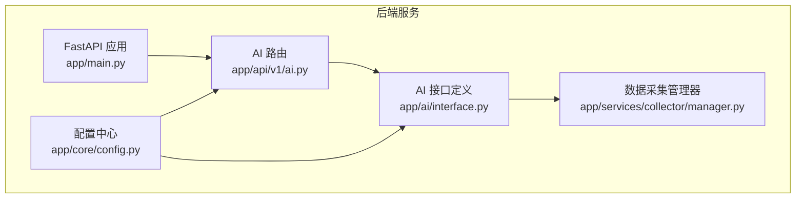
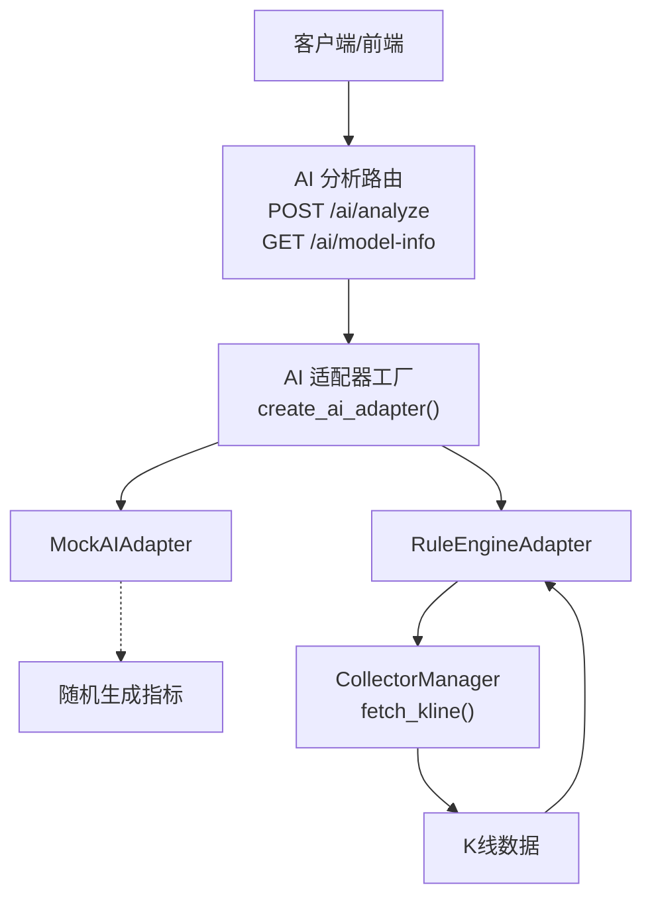
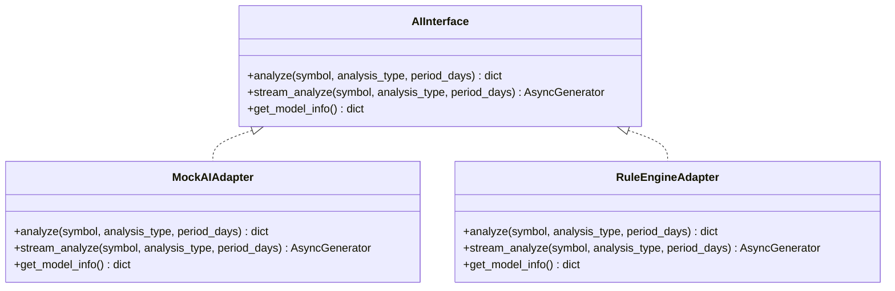
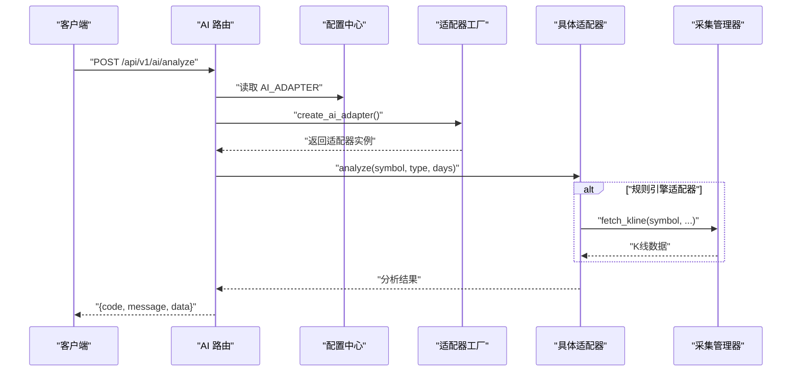
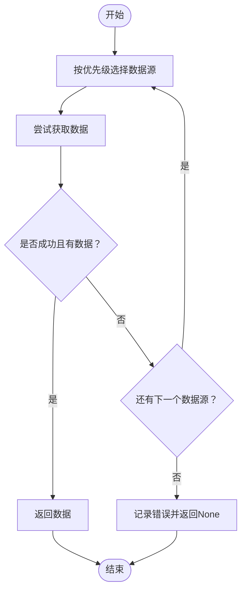
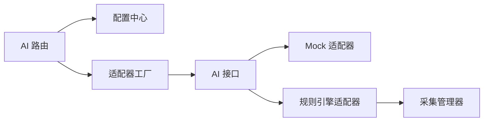

# AI分析API模块

<cite>
**本文引用的文件**
- [backend/app/ai/interface.py](file://backend/app/ai/interface.py)
- [backend/app/api/v1/ai.py](file://backend/app/api/v1/ai.py)
- [backend/app/core/config.py](file://backend/app/core/config.py)
- [backend/app/main.py](file://backend/app/main.py)
- [backend/app/services/collector/manager.py](file://backend/app/services/collector/manager.py)
- [README.md](file://README.md)
</cite>

## 目录
1. [简介](#简介)
2. [项目结构](#项目结构)
3. [核心组件](#核心组件)
4. [架构总览](#架构总览)
5. [详细组件分析](#详细组件分析)
6. [依赖分析](#依赖分析)
7. [性能考虑](#性能考虑)
8. [故障排查指南](#故障排查指南)
9. [结论](#结论)
10. [附录](#附录)

## 简介
本文件为“AI分析API模块”的综合技术文档，面向后端开发者与运维人员，系统阐述AI智能分析功能的API设计、策略调用机制、模型选择逻辑、结果格式化规范，以及插件化架构与动态加载策略。同时提供完整的接口调用示例、参数配置、结果解读与性能监控方案，并覆盖模型版本管理、错误恢复与调试工具使用指南。

## 项目结构
AI分析模块位于后端Python工程的AI子目录下，采用插件化适配器架构，通过统一接口对外暴露分析能力；API层负责路由与参数校验，配置层提供运行期参数，采集层提供数据源与故障转移能力。

图表来源
- [backend/app/main.py:1-48](file://backend/app/main.py#L1-L48)
- [backend/app/api/v1/ai.py:1-29](file://backend/app/api/v1/ai.py#L1-L29)
- [backend/app/ai/interface.py:1-196](file://backend/app/ai/interface.py#L1-L196)
- [backend/app/core/config.py:1-43](file://backend/app/core/config.py#L1-L43)
- [backend/app/services/collector/manager.py:1-94](file://backend/app/services/collector/manager.py#L1-L94)

章节来源
- [backend/app/main.py:1-48](file://backend/app/main.py#L1-L48)
- [backend/app/api/v1/ai.py:1-29](file://backend/app/api/v1/ai.py#L1-L29)
- [backend/app/ai/interface.py:1-196](file://backend/app/ai/interface.py#L1-L196)
- [backend/app/core/config.py:1-43](file://backend/app/core/config.py#L1-L43)
- [backend/app/services/collector/manager.py:1-94](file://backend/app/services/collector/manager.py#L1-L94)
- [README.md:1-163](file://README.md#L1-L163)

## 核心组件
- AI接口与适配器
  - 统一抽象接口定义了分析、流式分析与模型信息查询能力。
  - 提供Mock与规则引擎两类适配器，支持动态切换。
- API路由
  - 提供分析请求、历史记录占位、模型信息查询三个端点。
- 配置中心
  - 支持AI适配器类型、服务地址、超时、缓存、限流等参数。
- 数据采集管理器
  - 提供多数据源优先级与故障转移，保障数据可用性。

章节来源
- [backend/app/ai/interface.py:26-196](file://backend/app/ai/interface.py#L26-L196)
- [backend/app/api/v1/ai.py:10-29](file://backend/app/api/v1/ai.py#L10-L29)
- [backend/app/core/config.py:19-25](file://backend/app/core/config.py#L19-L25)
- [backend/app/services/collector/manager.py:12-94](file://backend/app/services/collector/manager.py#L12-L94)

## 架构总览
AI分析模块采用“API层-适配器层-数据采集层”的分层架构，通过配置中心控制适配器选择与运行参数，确保可插拔与可扩展。

图表来源
- [backend/app/api/v1/ai.py:10-29](file://backend/app/api/v1/ai.py#L10-L29)
- [backend/app/ai/interface.py:190-196](file://backend/app/ai/interface.py#L190-L196)
- [backend/app/ai/interface.py:114-170](file://backend/app/ai/interface.py#L114-L170)
- [backend/app/services/collector/manager.py:49-61](file://backend/app/services/collector/manager.py#L49-L61)

## 详细组件分析

### AI接口与适配器
- 抽象接口
  - analyze(symbol, analysis_type, period_days): 返回标准化分析结果字典。
  - stream_analyze(symbol, analysis_type, period_days): 流式进度与最终结果。
  - get_model_info(): 返回模型元信息。
- Mock适配器
  - 生成随机趋势、置信度与技术指标，便于演示与联调。
  - 支持进度流式输出，包含数据收集、指标计算、模型推理阶段。
- 规则引擎适配器
  - 基于K线数据计算得分，结合均线与量价规则判定趋势。
  - 使用采集管理器获取K线数据，具备故障转移能力。
- 工厂函数
  - create_ai_adapter(adapter_name): 根据配置动态选择适配器，默认mock。

图表来源
- [backend/app/ai/interface.py:26-196](file://backend/app/ai/interface.py#L26-L196)

章节来源
- [backend/app/ai/interface.py:26-196](file://backend/app/ai/interface.py#L26-L196)

### API路由与调用流程
- POST /api/v1/ai/analyze
  - 参数：symbol（必填）、analysis_type（默认comprehensive）、period_days（默认30）。
  - 行为：根据配置选择适配器执行分析，返回统一格式数据。
- GET /api/v1/ai/model-info
  - 行为：返回当前适配器的模型信息。
- GET /api/v1/ai/history
  - 行为：历史记录占位接口，当前返回空列表。

图表来源
- [backend/app/api/v1/ai.py:10-15](file://backend/app/api/v1/ai.py#L10-L15)
- [backend/app/ai/interface.py:190-196](file://backend/app/ai/interface.py#L190-L196)
- [backend/app/ai/interface.py:114-170](file://backend/app/ai/interface.py#L114-L170)
- [backend/app/services/collector/manager.py:49-61](file://backend/app/services/collector/manager.py#L49-L61)

章节来源
- [backend/app/api/v1/ai.py:10-29](file://backend/app/api/v1/ai.py#L10-L29)
- [backend/app/core/config.py:19-25](file://backend/app/core/config.py#L19-L25)

### 数据采集与故障转移
- 采集管理器按优先级顺序尝试多个数据源，遇到异常或空数据则切换至下一个数据源。
- 提供quote、kline、timeline、orderbook等接口的故障转移封装。

图表来源
- [backend/app/services/collector/manager.py:12-94](file://backend/app/services/collector/manager.py#L12-L94)

章节来源
- [backend/app/services/collector/manager.py:12-94](file://backend/app/services/collector/manager.py#L12-L94)

### 结果格式化与字段说明
- 通用字段
  - symbol：股票代码
  - analysis_type：分析类型（technical/trend/risk/comprehensive）
  - trend：趋势方向（bullish/bearish/neutral）
  - confidence：置信度（0~1）
  - summary：简要结论摘要
  - risk_level：风险等级（low/medium/high）
  - timestamp：分析时间戳
  - model_version：模型版本号
- details
  - technical：技术分析要点（如规则得分、触发规则等）
  - support_resistance：支撑/阻力位列表（Mock示例）
  - prediction：预测方向、目标价、止损、时间窗（Mock示例）
  - volume_analysis：量能分析（Mock示例）
- indicators
  - MACD/KDJ/RSI/BOLL等指标数值（Mock示例）

章节来源
- [backend/app/ai/interface.py:45-170](file://backend/app/ai/interface.py#L45-L170)

## 依赖分析
- 组件耦合
  - API层仅依赖配置中心与适配器工厂，低耦合高内聚。
  - 适配器层依赖采集管理器进行数据获取，规则引擎适配器直接使用。
  - 配置中心集中管理AI相关参数，避免硬编码。
- 外部依赖
  - 数据采集依赖外部数据源（如东方财富、新浪），通过管理器实现故障转移。
- 潜在循环依赖
  - 当前结构未发现循环导入；若新增策略文件需保持与接口层的单向依赖。

图表来源
- [backend/app/api/v1/ai.py:10-29](file://backend/app/api/v1/ai.py#L10-L29)
- [backend/app/ai/interface.py:190-196](file://backend/app/ai/interface.py#L190-L196)
- [backend/app/services/collector/manager.py:12-94](file://backend/app/services/collector/manager.py#L12-L94)

章节来源
- [backend/app/api/v1/ai.py:10-29](file://backend/app/api/v1/ai.py#L10-L29)
- [backend/app/ai/interface.py:190-196](file://backend/app/ai/interface.py#L190-L196)
- [backend/app/services/collector/manager.py:12-94](file://backend/app/services/collector/manager.py#L12-L94)

## 性能考虑
- 并发与异步
  - 适配器分析与流式输出均为异步实现，提升并发吞吐。
- 缓存与限流
  - 配置项包含AI_CACHE_ENABLED/AI_CACHE_TTL/AI_RATE_LIMIT，建议结合Redis实现结果缓存与请求限流。
- 超时控制
  - AI_REQUEST_TIMEOUT用于控制外部请求超时，避免阻塞。
- 数据源优化
  - 采集管理器的故障转移减少单点失败影响，提高整体可用性。

章节来源
- [backend/app/core/config.py:21-24](file://backend/app/core/config.py#L21-L24)
- [backend/app/ai/interface.py:34-35](file://backend/app/ai/interface.py#L34-L35)

## 故障排查指南
- 适配器选择问题
  - 检查环境变量AI_ADAPTER是否正确设置为mock或rule。
- 数据获取失败
  - 查看采集管理器日志，确认数据源优先级与故障转移是否生效。
- 超时与限流
  - 调整AI_REQUEST_TIMEOUT与AI_RATE_LIMIT，观察接口响应时间与错误码。
- 结果为空或异常
  - 使用GET /api/v1/ai/model-info确认当前适配器状态与支持类型。
- 日志与调试
  - 启用APP_DEBUG，结合后端日志定位问题。

章节来源
- [backend/app/core/config.py:19-25](file://backend/app/core/config.py#L19-L25)
- [backend/app/services/collector/manager.py:21-33](file://backend/app/services/collector/manager.py#L21-L33)
- [README.md:130-142](file://README.md#L130-L142)

## 结论
AI分析API模块以插件化适配器为核心，结合统一接口与配置中心，实现了灵活可扩展的分析能力。Mock与规则引擎两种适配器满足演示与基础分析需求；通过采集管理器与故障转移机制保障数据稳定性。建议在生产环境中启用缓存与限流策略，并持续完善策略注册与动态加载机制，以支持更多AI模型与算法的无缝接入。

## 附录

### 接口调用示例
- 分析请求
  - 方法：POST
  - 路径：/api/v1/ai/analyze
  - 参数：
    - symbol：股票代码（必填）
    - analysis_type：分析类型（默认comprehensive）
    - period_days：分析周期（默认30）
  - 成功响应：包含code、message与data（标准化分析结果）
- 模型信息
  - 方法：GET
  - 路径：/api/v1/ai/model-info
  - 响应：包含适配器名称、版本、描述、支持类型与状态
- 历史记录
  - 方法：GET
  - 路径：/api/v1/ai/history
  - 响应：占位接口，当前返回空列表

章节来源
- [backend/app/api/v1/ai.py:10-29](file://backend/app/api/v1/ai.py#L10-L29)

### 参数配置清单
- AI_ADAPTER：AI适配器类型（mock/rule）
- AI_SERVICE_URL：AI服务地址（预留）
- AI_REQUEST_TIMEOUT：请求超时秒数
- AI_CACHE_ENABLED：是否启用缓存
- AI_CACHE_TTL：缓存过期时间（秒）
- AI_RATE_LIMIT：每分钟请求数限制

章节来源
- [backend/app/core/config.py:19-25](file://backend/app/core/config.py#L19-L25)
- [README.md:130-142](file://README.md#L130-L142)

### 结果解读要点
- trend与confidence：判断趋势方向与可信程度
- summary：快速了解结论与关键依据
- details.technical：规则得分与触发条件
- details.prediction：预测方向与时间窗
- risk_level：风险提示等级
- model_version：模型版本，便于回溯与灰度

章节来源
- [backend/app/ai/interface.py:45-170](file://backend/app/ai/interface.py#L45-L170)

### 模型版本管理与策略注册
- 版本管理
  - 每个适配器维护独立model_version，便于追踪与回滚。
- 策略注册
  - 通过create_ai_adapter(adapter_name)集中注册，新增策略只需实现AIInterface并加入映射表。
- 动态加载
  - 通过AI_ADAPTER环境变量动态切换，无需重启服务。

章节来源
- [backend/app/ai/interface.py:190-196](file://backend/app/ai/interface.py#L190-L196)
- [backend/app/core/config.py:19](file://backend/app/core/config.py#L19)

### 错误恢复与调试工具
- 故障转移
  - 采集管理器自动切换数据源，降低单点故障影响。
- 调试建议
  - 启用APP_DEBUG，查看后端日志；使用GET /api/v1/ai/model-info核对适配器状态。
- 性能监控
  - 建议埋点分析耗时、命中率与错误率，结合缓存与限流参数优化。

章节来源
- [backend/app/services/collector/manager.py:12-94](file://backend/app/services/collector/manager.py#L12-L94)
- [README.md:130-142](file://README.md#L130-L142)