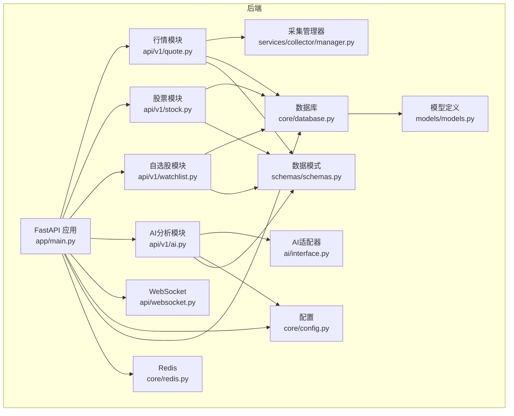
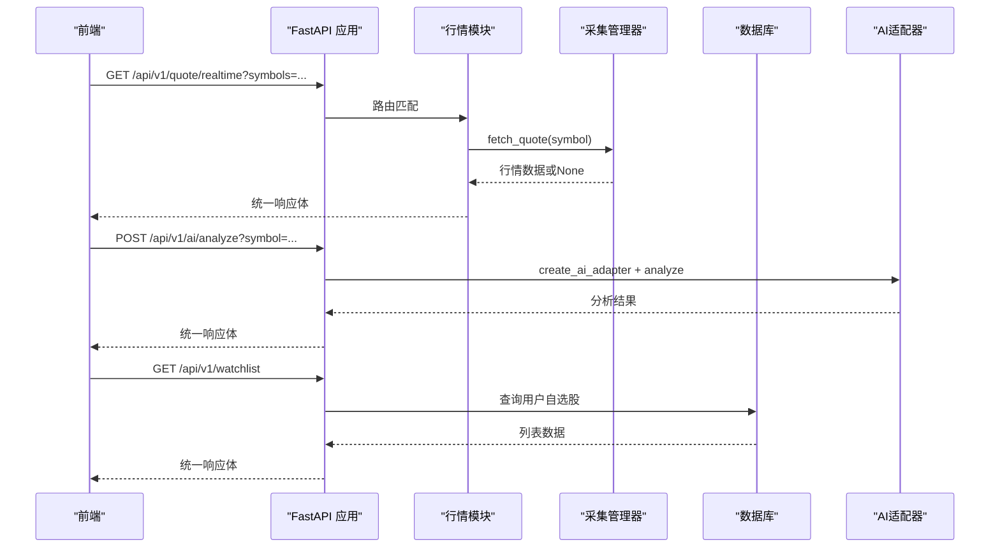
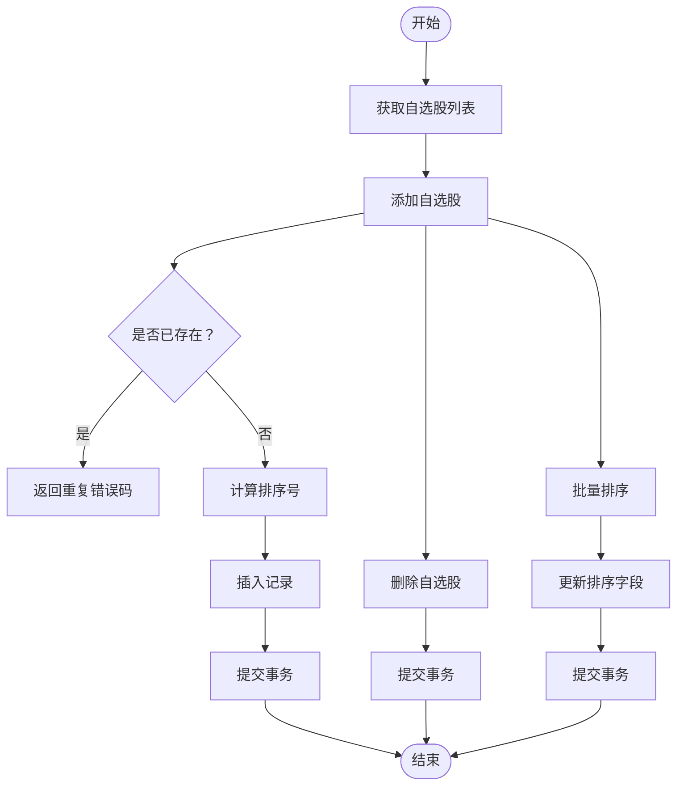
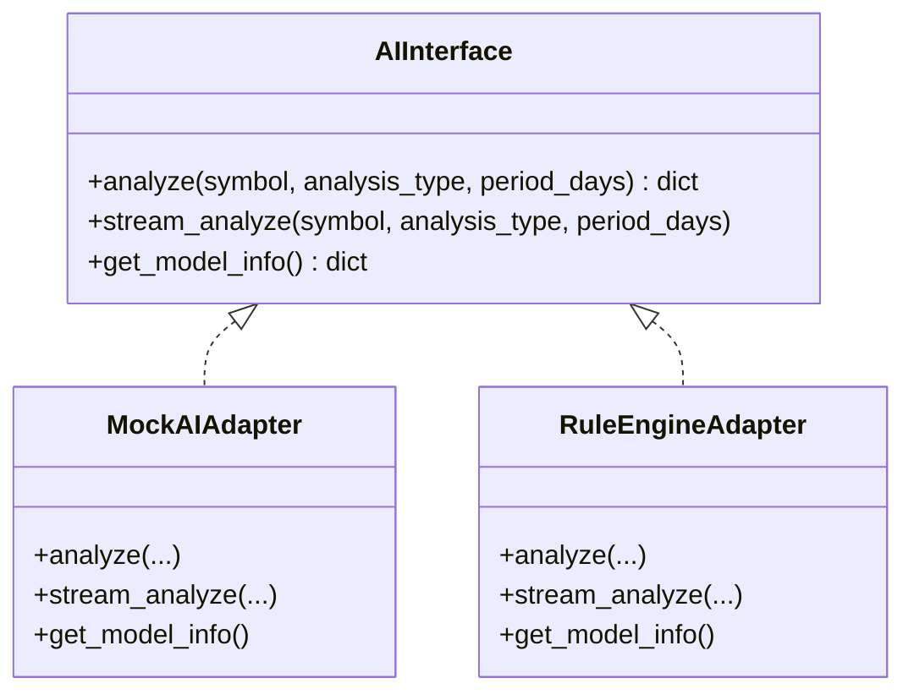
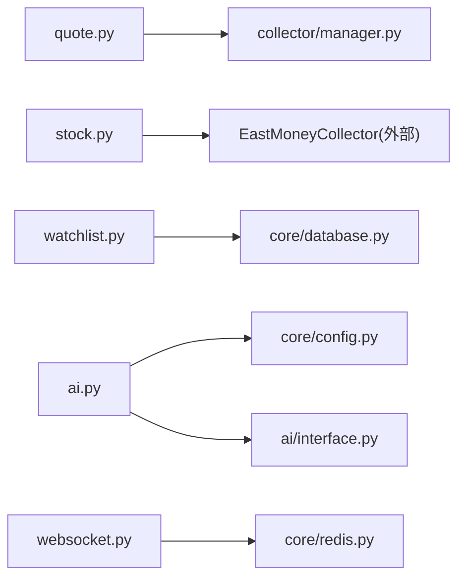

# API路由系统

<cite>
**本文引用的文件**
- [backend/app/main.py](file://backend/app/main.py)
- [backend/app/api/v1/quote.py](file://backend/app/api/v1/quote.py)
- [backend/app/api/v1/stock.py](file://backend/app/api/v1/stock.py)
- [backend/app/api/v1/watchlist.py](file://backend/app/api/v1/watchlist.py)
- [backend/app/api/v1/ai.py](file://backend/app/api/v1/ai.py)
- [backend/app/api/websocket.py](file://backend/app/api/websocket.py)
- [backend/app/core/config.py](file://backend/app/core/config.py)
- [backend/app/core/database.py](file://backend/app/core/database.py)
- [backend/app/core/redis.py](file://backend/app/core/redis.py)
- [backend/app/core/security.py](file://backend/app/core/security.py)
- [backend/app/models/models.py](file://backend/app/models/models.py)
- [backend/app/schemas/schemas.py](file://backend/app/schemas/schemas.py)
- [backend/app/services/collector/manager.py](file://backend/app/services/collector/manager.py)
- [backend/app/ai/interface.py](file://backend/app/ai/interface.py)
- [frontend/src/api/index.ts](file://frontend/src/api/index.ts)
- [README.md](file://README.md)
</cite>

## 目录
1. [简介](#简介)
2. [项目结构](#项目结构)
3. [核心组件](#核心组件)
4. [架构总览](#架构总览)
5. [详细组件分析](#详细组件分析)
6. [依赖分析](#依赖分析)
7. [性能考量](#性能考量)
8. [故障排查指南](#故障排查指南)
9. [结论](#结论)
10. [附录](#附录)

## 简介
本文件为“API路由系统”的综合技术文档，聚焦后端FastAPI实现的四个主要API模块：行情API（quote）、股票API（stock）、自选股API（watchlist）、AI分析API（ai）。文档覆盖RESTful设计原则、路由组织方式、HTTP方法映射、请求参数验证、响应数据格式、错误处理机制、版本管理、安全与性能优化策略，并提供接口规范、参数说明、返回值定义与使用示例。

## 项目结构
后端采用模块化组织，API路由统一挂载在 /api/v1 前缀下，各模块通过独立文件实现清晰的职责分离；数据库与Redis连接通过依赖注入提供；AI分析采用插件化适配器；WebSocket用于实时行情推送。

图表来源
- [backend/app/main.py:38-43](file://backend/app/main.py#L38-L43)
- [backend/app/api/v1/quote.py:4](file://backend/app/api/v1/quote.py#L4)
- [backend/app/api/v1/stock.py:4](file://backend/app/api/v1/stock.py#L4)
- [backend/app/api/v1/watchlist.py:8](file://backend/app/api/v1/watchlist.py#L8)
- [backend/app/api/v1/ai.py:5](file://backend/app/api/v1/ai.py#L5)
- [backend/app/api/websocket.py:9](file://backend/app/api/websocket.py#L9)
- [backend/app/core/config.py:5-43](file://backend/app/core/config.py#L5-L43)
- [backend/app/core/database.py:15-25](file://backend/app/core/database.py#L15-L25)
- [backend/app/core/redis.py:10-25](file://backend/app/core/redis.py#L10-L25)
- [backend/app/schemas/schemas.py:6-103](file://backend/app/schemas/schemas.py#L6-L103)
- [backend/app/models/models.py:5-74](file://backend/app/models/models.py#L5-L74)
- [backend/app/services/collector/manager.py:12-94](file://backend/app/services/collector/manager.py#L12-L94)
- [backend/app/ai/interface.py:26-196](file://backend/app/ai/interface.py#L26-L196)

章节来源
- [backend/app/main.py:38-43](file://backend/app/main.py#L38-L43)
- [README.md:92-126](file://README.md#L92-L126)

## 核心组件
- 应用入口与版本前缀：应用在生命周期内初始化数据库与Redis，注册四个v1模块路由与WebSocket路由，统一前缀为 /api/v1，并提供健康检查端点。
- 配置中心：集中管理数据库、Redis、AI适配器、限流与缓存、JWT等配置项。
- 数据层：异步SQLAlchemy 2.0连接池，提供依赖注入的会话；模型定义涵盖行情、自选股、AI分析日志等。
- 数据采集：采集管理器按优先级轮询多个数据源，实现故障转移。
- AI适配器：抽象接口与多种实现（Mock、规则引擎），支持同步与流式分析。
- WebSocket：连接管理器与订阅机制，支持实时行情广播。

章节来源
- [backend/app/main.py:13-48](file://backend/app/main.py#L13-L48)
- [backend/app/core/config.py:5-43](file://backend/app/core/config.py#L5-L43)
- [backend/app/core/database.py:15-25](file://backend/app/core/database.py#L15-L25)
- [backend/app/models/models.py:5-74](file://backend/app/models/models.py#L5-L74)
- [backend/app/services/collector/manager.py:12-94](file://backend/app/services/collector/manager.py#L12-L94)
- [backend/app/ai/interface.py:26-196](file://backend/app/ai/interface.py#L26-L196)
- [backend/app/api/websocket.py:12-79](file://backend/app/api/websocket.py#L12-L79)

## 架构总览
以下序列图展示请求从客户端到后端模块的典型流程，以及AI分析的适配器调用链。

图表来源
- [backend/app/main.py:38-43](file://backend/app/main.py#L38-L43)
- [backend/app/api/v1/quote.py:7-16](file://backend/app/api/v1/quote.py#L7-L16)
- [backend/app/api/v1/ai.py:10-15](file://backend/app/api/v1/ai.py#L10-L15)
- [backend/app/api/v1/watchlist.py:13-26](file://backend/app/api/v1/watchlist.py#L13-L26)
- [backend/app/services/collector/manager.py:21-33](file://backend/app/services/collector/manager.py#L21-L33)
- [backend/app/ai/interface.py:190-196](file://backend/app/ai/interface.py#L190-L196)

## 详细组件分析

### 行情API（quote）
- 路由前缀：/api/v1/quote
- 设计原则：RESTful命名与资源化，GET方法用于查询类操作，参数通过查询字符串传递。
- 方法与路径
  - GET /realtime：批量实时行情，最多处理50个股票代码，逗号分隔。
  - GET /list：分页行情列表，支持市场筛选、排序字段与方向。
  - GET /kline：K线数据，支持周期与复权类型，限制返回条数。
  - GET /timeline：分时数据。
  - GET /orderbook：盘口数据。
- 参数验证
  - 使用Query进行必填与范围约束，如page/page_size的最小/最大值。
  - 实时批量接口对符号列表做去重与截断。
- 错误处理
  - 当采集器返回空或异常时，返回统一错误码与消息，避免直接抛出异常。
- 响应格式
  - 统一包装：code、message、data；data为具体业务对象或字典。
- 性能与可靠性
  - 采集器具备主备数据源与故障转移逻辑，提升可用性。
  - 可结合Redis缓存与限流策略进一步优化。

章节来源
- [backend/app/api/v1/quote.py:7-65](file://backend/app/api/v1/quote.py#L7-L65)
- [backend/app/services/collector/manager.py:12-94](file://backend/app/services/collector/manager.py#L12-L94)
- [backend/app/schemas/schemas.py:12-68](file://backend/app/schemas/schemas.py#L12-L68)

### 股票API（stock）
- 路由前缀：/api/v1/stock
- 设计原则：提供股票搜索能力，支持代码与拼音首字母匹配。
- 方法与路径
  - GET /search：关键词搜索，限制返回数量。
- 参数验证
  - 关键词必填，返回数量有上下界。
- 错误处理
  - 外部接口异常时返回空列表而非中断，保证健壮性。
- 响应格式
  - 统一包装，data包含items数组，元素包含symbol、name、market、pinyin等字段。
- 集成说明
  - 使用东方财富建议接口，过滤A股市场。

章节来源
- [backend/app/api/v1/stock.py:10-37](file://backend/app/api/v1/stock.py#L10-L37)
- [backend/app/schemas/schemas.py:70-76](file://backend/app/schemas/schemas.py#L70-L76)

### 自选股API（watchlist）
- 路由前缀：/api/v1/watchlist
- 设计原则：以用户为中心的资源管理，支持增删改查与排序调整。
- 方法与路径
  - GET /：获取当前用户自选股列表，按排序字段升序排列。
  - POST /：添加自选股，若重复则返回重复错误码。
  - DELETE /{symbol}：按符号删除。
  - PUT /sort：批量调整排序顺序。
- 参数与数据模型
  - 添加请求体：symbol、market（默认上交所）。
  - 排序请求体：items数组，包含symbol与sort_order。
- 数据持久化
  - 使用异步会话依赖注入，写入数据库表watchlist。
- 错误处理
  - 重复添加返回特定错误码；成功操作返回统一成功响应。

图表来源
- [backend/app/api/v1/watchlist.py:13-77](file://backend/app/api/v1/watchlist.py#L13-L77)
- [backend/app/schemas/schemas.py:78-91](file://backend/app/schemas/schemas.py#L78-L91)
- [backend/app/models/models.py:50-60](file://backend/app/models/models.py#L50-L60)

章节来源
- [backend/app/api/v1/watchlist.py:13-77](file://backend/app/api/v1/watchlist.py#L13-L77)
- [backend/app/schemas/schemas.py:78-91](file://backend/app/schemas/schemas.py#L78-L91)
- [backend/app/models/models.py:50-60](file://backend/app/models/models.py#L50-L60)

### AI分析API（ai）
- 路由前缀：/api/v1/ai
- 设计原则：插件化适配器，支持不同分析策略；提供模型信息查询。
- 方法与路径
  - POST /analyze：触发AI分析，支持分析类型与时间窗口参数。
  - GET /history：分析历史（预留）。
  - GET /model-info：查询当前适配器模型信息。
- 参数与验证
  - analyze接口接收symbol、analysis_type、period_days等查询参数。
  - 使用配置中心选择适配器名称，动态创建适配器实例。
- 响应格式
  - 统一包装，data为适配器返回的具体分析结果或模型信息。
- 适配器实现
  - Mock适配器：返回模拟分析结果与进度流。
  - 规则引擎适配器：基于K线数据与简单规则评分生成趋势判断。

图表来源
- [backend/app/ai/interface.py:26-196](file://backend/app/ai/interface.py#L26-L196)

章节来源
- [backend/app/api/v1/ai.py:10-29](file://backend/app/api/v1/ai.py#L10-L29)
- [backend/app/core/config.py:19-24](file://backend/app/core/config.py#L19-L24)
- [backend/app/ai/interface.py:190-196](file://backend/app/ai/interface.py#L190-L196)

### WebSocket（实时行情）
- 路由：/api/v1/ws/quote
- 功能：订阅/取消订阅股票行情，心跳检测，向订阅者广播行情更新。
- 订阅机制：客户端发送动作消息（subscribe/unsubscribe/ping），服务端维护连接与订阅集合。
- 广播：根据订阅关系向对应WebSocket推送行情数据。

章节来源
- [backend/app/api/websocket.py:39-79](file://backend/app/api/websocket.py#L39-L79)

## 依赖分析
- 模块耦合
  - 路由模块仅依赖服务层（采集管理器）与数据层（数据库会话），保持低耦合。
  - AI模块通过配置中心解耦具体适配器实现。
- 外部依赖
  - 数据采集依赖外部数据源（东方财富、新浪）。
  - 数据存储依赖PostgreSQL与Redis。
- 循环依赖
  - 未发现循环导入；模块间通过函数/类调用与依赖注入解耦。

图表来源
- [backend/app/api/v1/quote.py:1-3](file://backend/app/api/v1/quote.py#L1-L3)
- [backend/app/api/v1/stock.py:1-3](file://backend/app/api/v1/stock.py#L1-L3)
- [backend/app/api/v1/watchlist.py:1-7](file://backend/app/api/v1/watchlist.py#L1-L7)
- [backend/app/api/v1/ai.py:1-4](file://backend/app/api/v1/ai.py#L1-L4)
- [backend/app/api/websocket.py:4-6](file://backend/app/api/websocket.py#L4-L6)
- [backend/app/core/config.py:5-43](file://backend/app/core/config.py#L5-L43)
- [backend/app/services/collector/manager.py:3-6](file://backend/app/services/collector/manager.py#L3-L6)
- [backend/app/ai/interface.py:26-196](file://backend/app/ai/interface.py#L26-L196)

## 性能考量
- 连接池与并发
  - 数据库使用异步连接池，合理设置池大小与溢出上限，减少连接开销。
- 缓存策略
  - 配置中提供AI缓存开关与TTL，可结合Redis实现热点数据缓存。
- 限流与降级
  - 配置中提供AI限流参数，可扩展至API级别限流；采集器已具备故障转移。
- 前端代理
  - 前端Axios统一指向 /api/v1，便于反向代理与跨域处理。

章节来源
- [backend/app/core/database.py:7-8](file://backend/app/core/database.py#L7-L8)
- [backend/app/core/config.py:22-24](file://backend/app/core/config.py#L22-L24)
- [frontend/src/api/index.ts:3-6](file://frontend/src/api/index.ts#L3-L6)

## 故障排查指南
- 健康检查
  - 访问 /api/v1/health，确认服务状态与版本。
- CORS问题
  - 应用已启用CORS中间件，允许任意来源；若仍出现跨域，请检查代理与浏览器策略。
- 数据不可用
  - 行情接口在数据源不可用时返回特定错误码；检查采集器日志与网络连通性。
- 数据库连接
  - 初始化数据库在应用启动阶段执行；若连接失败，检查DATABASE_URL与数据库状态。
- Redis连接
  - Redis连接池按需创建；关闭时释放资源；检查REDIS_URL与Redis服务状态。

章节来源
- [backend/app/main.py:46-48](file://backend/app/main.py#L46-L48)
- [backend/app/main.py:29-36](file://backend/app/main.py#L29-L36)
- [backend/app/api/v1/quote.py:31-33](file://backend/app/api/v1/quote.py#L31-L33)
- [backend/app/core/database.py:23-25](file://backend/app/core/database.py#L23-L25)
- [backend/app/core/redis.py:21-25](file://backend/app/core/redis.py#L21-L25)

## 结论
本API路由系统遵循RESTful设计原则，模块边界清晰，通过依赖注入与插件化架构实现了高内聚、低耦合。统一的响应格式与错误码提升了前端集成体验；采集器的故障转移与配置中心为扩展与运维提供了便利。建议后续完善鉴权、速率限制、缓存与监控体系，持续提升稳定性与可观测性。

## 附录

### 接口规范与使用示例

- 健康检查
  - 方法：GET
  - 路径：/api/v1/health
  - 示例：curl http://localhost:8000/api/v1/health

- 行情API（quote）
  - GET /api/v1/quote/realtime?symbols=...
    - 描述：批量获取实时行情，最多50个符号
    - 响应：统一包装，data包含items数组
  - GET /api/v1/quote/list?market=...&sort_by=...&sort_order=...&page=...&page_size=...
    - 描述：分页获取行情列表
    - 响应：统一包装，data为分页结构
  - GET /api/v1/quote/kline?symbol=...&period=...&fq_type=...&limit=...
    - 描述：获取K线数据
    - 响应：统一包装，data为K线结构
  - GET /api/v1/quote/timeline?symbol=...
    - 描述：获取分时数据
    - 响应：统一包装，data为分时结构
  - GET /api/v1/quote/orderbook?symbol=...
    - 描述：获取盘口数据
    - 响应：统一包装，data为盘口结构

- 股票API（stock）
  - GET /api/v1/stock/search?keyword=...&limit=...
    - 描述：搜索股票（代码/拼音首字母）
    - 响应：统一包装，data包含items数组

- 自选股API（watchlist）
  - GET /api/v1/watchlist
    - 描述：获取自选股列表
    - 响应：统一包装，data包含items数组
  - POST /api/v1/watchlist
    - 描述：添加自选股
    - 请求体：{ symbol, market }
    - 响应：统一包装
  - DELETE /api/v1/watchlist/{symbol}
    - 描述：删除自选股
    - 响应：统一包装
  - PUT /api/v1/watchlist/sort
    - 描述：批量调整排序
    - 请求体：{ items: [{ symbol, sort_order }] }
    - 响应：统一包装

- AI分析API（ai）
  - POST /api/v1/ai/analyze?symbol=...&analysis_type=...&period_days=...
    - 描述：触发AI分析
    - 响应：统一包装，data为分析结果
  - GET /api/v1/ai/history?page=...&page_size=...
    - 描述：获取分析历史（预留）
    - 响应：统一包装
  - GET /api/v1/ai/model-info
    - 描述：获取模型信息
    - 响应：统一包装，data为模型信息

- WebSocket（实时行情）
  - 路径：/api/v1/ws/quote
  - 客户端动作：
    - subscribe：{ action: "subscribe", symbols: [...], channels: [...] }
    - unsubscribe：{ action: "unsubscribe", symbols: [...] }
    - ping：{ action: "ping" }
  - 服务端响应：
    - subcribed：确认订阅
    - quote：行情推送

章节来源
- [backend/app/main.py:38-48](file://backend/app/main.py#L38-L48)
- [backend/app/api/v1/quote.py:7-65](file://backend/app/api/v1/quote.py#L7-L65)
- [backend/app/api/v1/stock.py:10-37](file://backend/app/api/v1/stock.py#L10-L37)
- [backend/app/api/v1/watchlist.py:13-77](file://backend/app/api/v1/watchlist.py#L13-L77)
- [backend/app/api/v1/ai.py:10-29](file://backend/app/api/v1/ai.py#L10-L29)
- [backend/app/api/websocket.py:39-79](file://backend/app/api/websocket.py#L39-L79)
- [frontend/src/api/index.ts:8-31](file://frontend/src/api/index.ts#L8-L31)

### 统一响应格式
- 字段
  - code: 整数，业务状态码（0表示成功）
  - message: 字符串，描述信息
  - data: 对象或数组，具体业务数据

章节来源
- [backend/app/schemas/schemas.py:6-10](file://backend/app/schemas/schemas.py#L6-L10)

### 错误码约定（示例）
- 0：成功
- 1001：已在自选股中
- 1002：股票代码不存在或数据源暂不可用
- 1003：数据源暂不可用

章节来源
- [backend/app/api/v1/watchlist.py:38-39](file://backend/app/api/v1/watchlist.py#L38-L39)
- [backend/app/api/v1/quote.py:31-33](file://backend/app/api/v1/quote.py#L31-L33)
- [backend/app/api/v1/quote.py:44-47](file://backend/app/api/v1/quote.py#L44-L47)
- [backend/app/api/v1/quote.py:53-56](file://backend/app/api/v1/quote.py#L53-L56)
- [backend/app/api/v1/quote.py:62-65](file://backend/app/api/v1/quote.py#L62-L65)

### 安全与鉴权
- JWT工具：提供密码哈希、令牌生成与解码能力，可用于后续接入认证中间件。
- 建议：在路由层增加鉴权中间件与权限控制，结合JWT实现登录态管理。

章节来源
- [backend/app/core/security.py:10-30](file://backend/app/core/security.py#L10-L30)

### 版本管理
- 路由前缀：/api/v1，便于未来升级时保留旧版本接口。
- 应用版本：在应用元数据中声明，健康检查端点返回版本信息。

章节来源
- [backend/app/main.py:22-27](file://backend/app/main.py#L22-L27)
- [backend/app/main.py:46-48](file://backend/app/main.py#L46-L48)