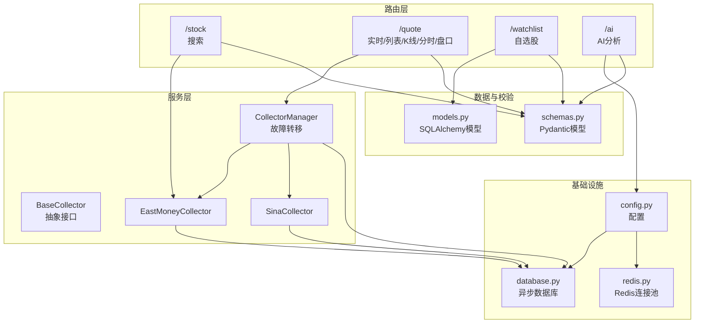
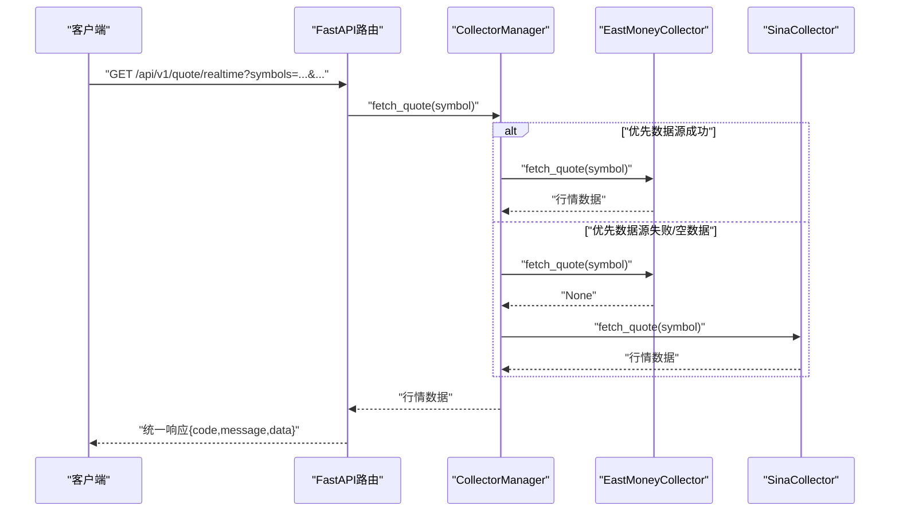
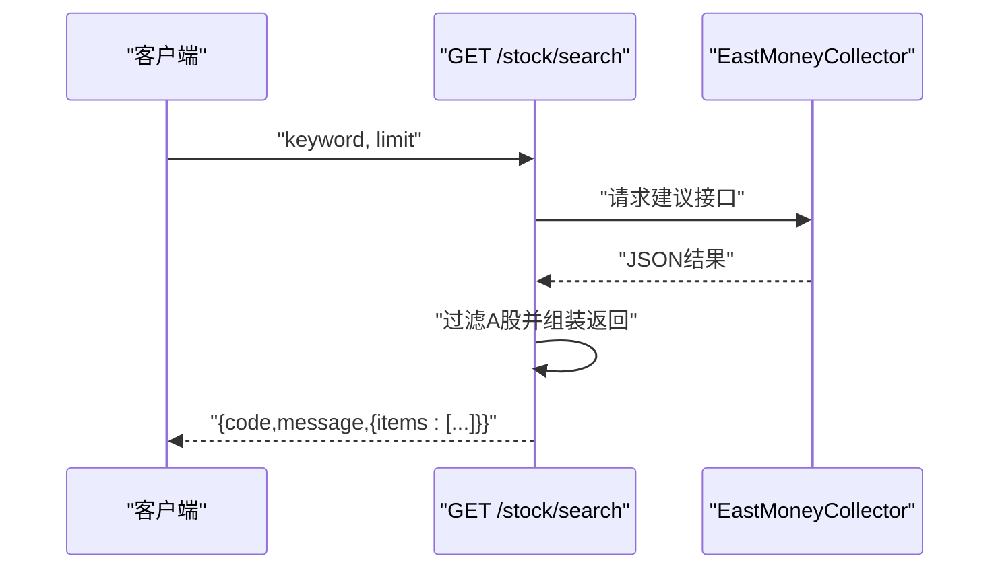
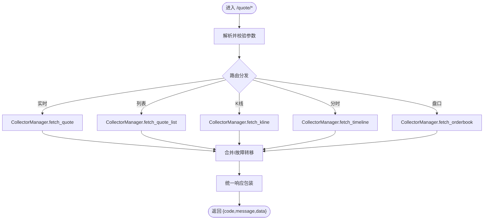
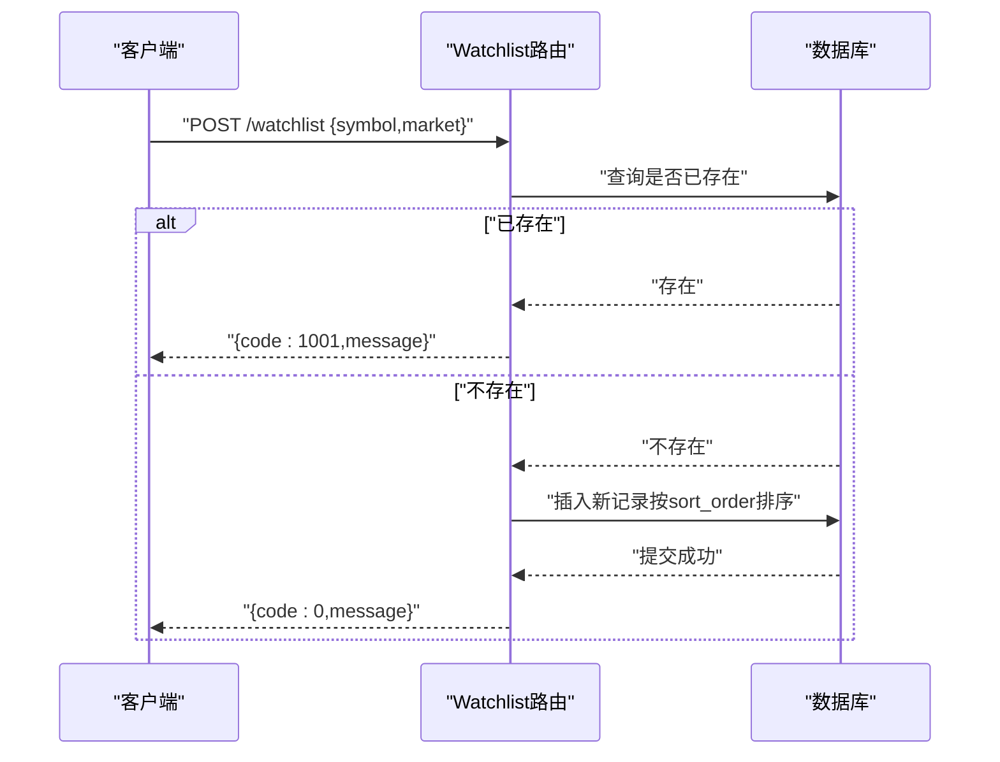
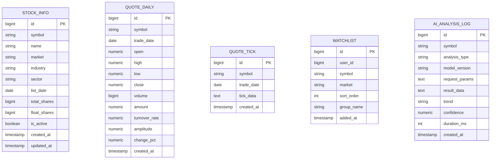
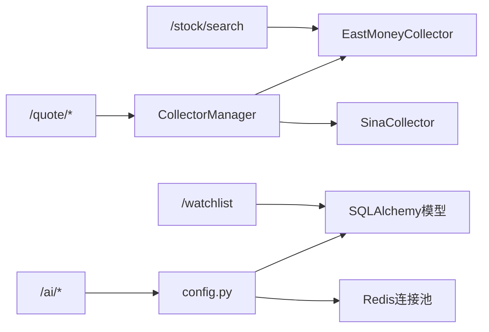

# 股票API模块

<cite>
**本文引用的文件**
- [backend/app/main.py](file://backend/app/main.py)
- [backend/app/api/v1/stock.py](file://backend/app/api/v1/stock.py)
- [backend/app/api/v1/quote.py](file://backend/app/api/v1/quote.py)
- [backend/app/api/v1/watchlist.py](file://backend/app/api/v1/watchlist.py)
- [backend/app/api/v1/ai.py](file://backend/app/api/v1/ai.py)
- [backend/app/services/collector/base.py](file://backend/app/services/collector/base.py)
- [backend/app/services/collector/manager.py](file://backend/app/services/collector/manager.py)
- [backend/app/services/collector/eastmoney.py](file://backend/app/services/collector/eastmoney.py)
- [backend/app/services/collector/sina.py](file://backend/app/services/collector/sina.py)
- [backend/app/models/models.py](file://backend/app/models/models.py)
- [backend/app/schemas/schemas.py](file://backend/app/schemas/schemas.py)
- [backend/app/core/config.py](file://backend/app/core/config.py)
- [backend/app/core/database.py](file://backend/app/core/database.py)
- [backend/app/core/redis.py](file://backend/app/core/redis.py)
- [README.md](file://README.md)
</cite>

## 目录
1. [简介](#简介)
2. [项目结构](#项目结构)
3. [核心组件](#核心组件)
4. [架构总览](#架构总览)
5. [详细组件分析](#详细组件分析)
6. [依赖分析](#依赖分析)
7. [性能考虑](#性能考虑)
8. [故障排查指南](#故障排查指南)
9. [结论](#结论)
10. [附录](#附录)

## 简介
本文件为“股票API模块”的综合技术文档，聚焦于以下目标：
- 股票基本信息查询、股票搜索、股票详情（实时行情、K线、分时、盘口）等核心功能的API设计与实现要点
- RESTful路由结构、HTTP方法映射、参数验证机制、统一响应格式
- 股票数据模型、字段定义、数据来源与更新频率
- 接口规范、使用示例与错误处理策略
- 搜索算法优化、数据缓存机制与性能调优方案

该模块基于FastAPI构建，采用异步数据采集器（东方财富、新浪财经）与故障转移策略，结合Pydantic模型进行参数与响应校验，并通过统一的响应包装保证前后端一致性。

## 项目结构
后端采用分层架构：
- 路由层：位于 api/v1 下，按功能划分 stock、quote、watchlist、ai 四个模块
- 服务层：collector 抽象与具体实现（东方财富、新浪财经），以及 CollectorManager 管理器
- 模型层：SQLAlchemy 异步模型（StockInfo、QuoteDaily、QuoteTick、Watchlist、AIAnalysisLog）
- 校验层：Pydantic 模型（响应与请求体）
- 配置与基础设施：配置读取、数据库连接、Redis 连接池

图表来源
- [backend/app/main.py:38-44](file://backend/app/main.py#L38-L44)
- [backend/app/api/v1/stock.py:4](file://backend/app/api/v1/stock.py#L4)
- [backend/app/api/v1/quote.py:4](file://backend/app/api/v1/quote.py#L4)
- [backend/app/api/v1/watchlist.py:8](file://backend/app/api/v1/watchlist.py#L8)
- [backend/app/api/v1/ai.py:5](file://backend/app/api/v1/ai.py#L5)
- [backend/app/services/collector/manager.py:12](file://backend/app/services/collector/manager.py#L12)
- [backend/app/services/collector/base.py:5](file://backend/app/services/collector/base.py#L5)
- [backend/app/services/collector/eastmoney.py:26](file://backend/app/services/collector/eastmoney.py#L26)
- [backend/app/services/collector/sina.py:24](file://backend/app/services/collector/sina.py#L24)
- [backend/app/models/models.py:5](file://backend/app/models/models.py#L5)
- [backend/app/schemas/schemas.py:6](file://backend/app/schemas/schemas.py#L6)
- [backend/app/core/config.py:5](file://backend/app/core/config.py#L5)
- [backend/app/core/database.py:1](file://backend/app/core/database.py#L1)
- [backend/app/core/redis.py:1](file://backend/app/core/redis.py#L1)

章节来源
- [backend/app/main.py:38-44](file://backend/app/main.py#L38-L44)
- [README.md:92-126](file://README.md#L92-L126)

## 核心组件
- 路由与入口
  - 应用入口注册了四个v1模块路由，统一前缀为/api/v1；同时提供健康检查端点
- 数据采集器
  - BaseCollector 定义统一接口（实时、列表、K线、分时、盘口）
  - EastMoneyCollector 与 SinaCollector 提供具体实现，包含请求重试、超时控制与反爬策略
  - CollectorManager 实现故障转移与空数据回退
- 数据模型与校验
  - models.py 定义 StockInfo、QuoteDaily、QuoteTick、Watchlist、AIAnalysisLog
  - schemas.py 定义统一响应基类与各接口的数据结构
- 基础设施
  - config.py 读取环境变量，集中管理数据库、Redis、AI、缓存与采集间隔等配置
  - database.py 与 redis.py 提供异步数据库与Redis连接池

章节来源
- [backend/app/main.py:13-48](file://backend/app/main.py#L13-L48)
- [backend/app/services/collector/base.py:5-45](file://backend/app/services/collector/base.py#L5-L45)
- [backend/app/services/collector/manager.py:12-94](file://backend/app/services/collector/manager.py#L12-L94)
- [backend/app/models/models.py:5-74](file://backend/app/models/models.py#L5-L74)
- [backend/app/schemas/schemas.py:6-103](file://backend/app/schemas/schemas.py#L6-L103)
- [backend/app/core/config.py:5-43](file://backend/app/core/config.py#L5-L43)
- [backend/app/core/database.py:1-25](file://backend/app/core/database.py#L1-L25)
- [backend/app/core/redis.py:1-25](file://backend/app/core/redis.py#L1-L25)

## 架构总览
下图展示API请求到数据采集与返回的整体流程，包括参数校验、采集器选择与故障转移、统一响应封装。

图表来源
- [backend/app/api/v1/quote.py:7-16](file://backend/app/api/v1/quote.py#L7-L16)
- [backend/app/services/collector/manager.py:21-33](file://backend/app/services/collector/manager.py#L21-L33)
- [backend/app/services/collector/eastmoney.py:69-86](file://backend/app/services/collector/eastmoney.py#L69-L86)
- [backend/app/services/collector/sina.py:64-107](file://backend/app/services/collector/sina.py#L64-L107)

## 详细组件分析

### 股票搜索模块（/stock/search）
- 功能概述
  - 基于东方财富建议接口进行关键词搜索，过滤A股市场，返回符号、名称、市场与拼音首字母
- 参数与校验
  - keyword：必填，字符串
  - limit：可选，默认10，范围[1,20]
- 错误处理
  - 异常捕获与空结果返回，保证接口稳定
- 性能与优化
  - 使用异步HTTP客户端，限制超时时间
  - 建议：前端输入防抖、结果缓存、拼音索引优化

图表来源
- [backend/app/api/v1/stock.py:10-37](file://backend/app/api/v1/stock.py#L10-L37)
- [backend/app/services/collector/eastmoney.py:11-68](file://backend/app/services/collector/eastmoney.py#L11-L68)

章节来源
- [backend/app/api/v1/stock.py:10-37](file://backend/app/api/v1/stock.py#L10-L37)

### 实时行情与行情列表（/quote）
- 实时行情（GET /quote/realtime）
  - 参数：symbols（逗号分隔，最多50个）
  - 流程：逐个调用采集器，聚合返回
- 行情列表（GET /quote/list）
  - 参数：market（all/sh/sz）、sort_by、sort_order、page、page_size
  - 返回：分页数据与统计信息
- K线（GET /quote/kline）
  - 参数：symbol、period（1m/5m/15m/30m/60m/d/w/m）、fq_type（none/front/back）、limit（1-500）
- 分时（GET /quote/timeline）
  - 参数：symbol
- 盘口（GET /quote/orderbook）
  - 参数：symbol

图表来源
- [backend/app/api/v1/quote.py:7-65](file://backend/app/api/v1/quote.py#L7-L65)
- [backend/app/services/collector/manager.py:21-89](file://backend/app/services/collector/manager.py#L21-L89)

章节来源
- [backend/app/api/v1/quote.py:7-65](file://backend/app/api/v1/quote.py#L7-L65)
- [backend/app/services/collector/manager.py:12-94](file://backend/app/services/collector/manager.py#L12-L94)

### 自选股模块（/watchlist）
- 获取自选股（GET /watchlist）
- 添加自选股（POST /watchlist）
- 删除自选股（DELETE /watchlist/{symbol}）
- 排序调整（PUT /watchlist/sort）

图表来源
- [backend/app/api/v1/watchlist.py:13-77](file://backend/app/api/v1/watchlist.py#L13-L77)

章节来源
- [backend/app/api/v1/watchlist.py:13-77](file://backend/app/api/v1/watchlist.py#L13-L77)

### AI分析模块（/ai）
- 请求分析（POST /ai/analyze）
  - 参数：symbol、analysis_type、period_days
  - 通过适配器调用AI服务，返回统一响应
- 历史记录（GET /ai/history）
- 模型信息（GET /ai/model-info）

章节来源
- [backend/app/api/v1/ai.py:10-29](file://backend/app/api/v1/ai.py#L10-L29)

### 数据模型与字段定义
- StockInfo：股票基础信息（代码、名称、市场、行业、板块、上市日期、总股本、流通股本、状态）
- QuoteDaily：日线行情（日期、开盘/最高/最低/收盘、成交量/成交额、换手率、振幅、涨跌幅）
- QuoteTick：分笔数据（日期、tick数据JSON）
- Watchlist：自选股（用户ID、代码、市场、排序、分组）
- AIAnalysisLog：AI分析日志（股票、分析类型、模型版本、请求参数、结果、趋势、置信度、耗时）

图表来源
- [backend/app/models/models.py:5-74](file://backend/app/models/models.py#L5-L74)

章节来源
- [backend/app/models/models.py:5-74](file://backend/app/models/models.py#L5-L74)

### 统一响应与数据结构
- 统一响应基类：code（默认0）、message（默认"success"）
- 行情相关：QuoteItem、QuoteListResponse、KlineItem、KlineResponse、TimelinePoint、TimelineResponse、OrderBookLevel、OrderBookResponse
- 股票搜索：StockSearchItem
- 自选股：WatchlistAddRequest、WatchlistSortItem、WatchlistSortRequest
- AI分析：AIAnalysisRequest、AIAnalysisResponse

章节来源
- [backend/app/schemas/schemas.py:6-103](file://backend/app/schemas/schemas.py#L6-L103)

## 依赖分析
- 路由到服务
  - /stock/search → EastMoneyCollector
  - /quote/* → CollectorManager → BaseCollector → EastMoneyCollector/SinaCollector
  - /watchlist → SQLAlchemy 模型与数据库
  - /ai → 配置与AI适配器
- 配置与基础设施
  - config.py 提供数据库、Redis、AI、缓存与采集间隔等配置
  - database.py 提供异步引擎与会话
  - redis.py 提供Redis连接池

图表来源
- [backend/app/api/v1/stock.py:7](file://backend/app/api/v1/stock.py#L7)
- [backend/app/api/v1/quote.py:2](file://backend/app/api/v1/quote.py#L2)
- [backend/app/services/collector/manager.py:12](file://backend/app/services/collector/manager.py#L12)
- [backend/app/api/v1/watchlist.py:5](file://backend/app/api/v1/watchlist.py#L5)
- [backend/app/api/v1/ai.py:3](file://backend/app/api/v1/ai.py#L3)
- [backend/app/core/config.py:5](file://backend/app/core/config.py#L5)
- [backend/app/core/redis.py:10](file://backend/app/core/redis.py#L10)

章节来源
- [backend/app/api/v1/stock.py:7](file://backend/app/api/v1/stock.py#L7)
- [backend/app/api/v1/quote.py:2](file://backend/app/api/v1/quote.py#L2)
- [backend/app/services/collector/manager.py:12-94](file://backend/app/services/collector/manager.py#L12-L94)
- [backend/app/api/v1/watchlist.py:5](file://backend/app/api/v1/watchlist.py#L5)
- [backend/app/api/v1/ai.py:3](file://backend/app/api/v1/ai.py#L3)
- [backend/app/core/config.py:5-43](file://backend/app/core/config.py#L5-L43)
- [backend/app/core/redis.py:10-25](file://backend/app/core/redis.py#L10-L25)

## 性能考虑
- 采集器并发与限流
  - httpx.AsyncClient 限制最大连接数与保活连接数，避免资源耗尽
  - 重试策略与指数退避，降低上游不稳定影响
- 缓存策略
  - 配置项 QUOTE_CACHE_TTL 控制行情缓存时间
  - Redis 连接池复用，减少连接开销
- 批量与分页
  - /quote/realtime 对symbols数量限制，避免单次请求过大
  - /quote/list 支持分页与排序字段映射，减少一次性传输
- 搜索优化
  - 前端输入防抖、结果缓存、拼音首字母索引
- 数据库连接池
  - 异步引擎配置池大小与溢出，提升并发吞吐

章节来源
- [backend/app/services/collector/eastmoney.py:32-39](file://backend/app/services/collector/eastmoney.py#L32-L39)
- [backend/app/services/collector/sina.py:27-34](file://backend/app/services/collector/sina.py#L27-L34)
- [backend/app/core/config.py:29-30](file://backend/app/core/config.py#L29-L30)
- [backend/app/core/redis.py:10-18](file://backend/app/core/redis.py#L10-L18)
- [backend/app/api/v1/quote.py:10](file://backend/app/api/v1/quote.py#L10)
- [backend/app/core/database.py:7](file://backend/app/core/database.py#L7)

## 故障排查指南
- 采集器失败
  - 现象：返回空数据或统一错误码
  - 处理：CollectorManager 自动切换至备用数据源；检查上游状态码与异常日志
- 参数校验失败
  - 现象：参数越界或缺失导致校验错误
  - 处理：核对Query参数范围与必填项
- 数据源不可用
  - 现象：统一错误码提示数据源暂不可用
  - 处理：检查网络连通性、上游接口可用性与重试日志
- 数据库/Redis异常
  - 现象：自选股操作失败或连接异常
  - 处理：确认连接串、容器编排与服务状态

章节来源
- [backend/app/services/collector/manager.py:21-89](file://backend/app/services/collector/manager.py#L21-L89)
- [backend/app/api/v1/quote.py:31-32](file://backend/app/api/v1/quote.py#L31-L32)
- [backend/app/api/v1/quote.py:44-46](file://backend/app/api/v1/quote.py#L44-L46)
- [backend/app/api/v1/quote.py:53-55](file://backend/app/api/v1/quote.py#L53-L55)
- [backend/app/api/v1/watchlist.py:14-26](file://backend/app/api/v1/watchlist.py#L14-L26)

## 结论
本模块以清晰的分层架构实现了股票搜索、实时行情、K线、分时与盘口等核心能力，配合故障转移与参数校验确保稳定性与一致性。通过统一响应格式与Pydantic模型，前后端协作更加高效。建议在生产环境中进一步完善缓存策略、搜索索引与监控告警体系，持续优化采集与渲染性能。

## 附录

### 接口规范与使用示例（路径指引）
- 股票搜索
  - GET /api/v1/stock/search?keyword=...&limit=...
  - 示例路径：[backend/app/api/v1/stock.py:10-37](file://backend/app/api/v1/stock.py#L10-L37)
- 实时行情
  - GET /api/v1/quote/realtime?symbols=...
  - 示例路径：[backend/app/api/v1/quote.py:7-16](file://backend/app/api/v1/quote.py#L7-L16)
- 行情列表
  - GET /api/v1/quote/list?market=...&sort_by=...&sort_order=...&page=...&page_size=...
  - 示例路径：[backend/app/api/v1/quote.py:19-33](file://backend/app/api/v1/quote.py#L19-L33)
- K线
  - GET /api/v1/quote/kline?symbol=...&period=...&fq_type=...&limit=...
  - 示例路径：[backend/app/api/v1/quote.py:36-47](file://backend/app/api/v1/quote.py#L36-L47)
- 分时
  - GET /api/v1/quote/timeline?symbol=...
  - 示例路径：[backend/app/api/v1/quote.py:50-56](file://backend/app/api/v1/quote.py#L50-L56)
- 盘口
  - GET /api/v1/quote/orderbook?symbol=...
  - 示例路径：[backend/app/api/v1/quote.py:59-65](file://backend/app/api/v1/quote.py#L59-L65)
- 自选股
  - GET /api/v1/watchlist
  - POST /api/v1/watchlist
  - DELETE /api/v1/watchlist/{symbol}
  - PUT /api/v1/watchlist/sort
  - 示例路径：[backend/app/api/v1/watchlist.py:13-77](file://backend/app/api/v1/watchlist.py#L13-L77)
- AI分析
  - POST /api/v1/ai/analyze?symbol=...&analysis_type=...&period_days=...
  - GET /api/v1/ai/history?symbol=...&page=...&page_size=...
  - GET /api/v1/ai/model-info
  - 示例路径：[backend/app/api/v1/ai.py:10-29](file://backend/app/api/v1/ai.py#L10-L29)

### 数据来源与更新频率
- 数据来源
  - 主数据源：东方财富（实时、列表、K线、分时、盘口）
  - 备用数据源：新浪财经（实时、列表、K线、分时、盘口）
- 更新频率
  - 采集间隔由配置项 QUOTE_COLLECT_INTERVAL 控制（秒）
  - 行情缓存由 QUOTE_CACHE_TTL 控制（分钟）

章节来源
- [backend/app/services/collector/eastmoney.py:29-31](file://backend/app/services/collector/eastmoney.py#L29-L31)
- [backend/app/services/collector/sina.py:24-34](file://backend/app/services/collector/sina.py#L24-L34)
- [backend/app/core/config.py:29-30](file://backend/app/core/config.py#L29-L30)