# 自选股API模块

<cite>
**本文档引用的文件**
- [backend/app/api/v1/watchlist.py](file://backend/app/api/v1/watchlist.py)
- [backend/app/models/models.py](file://backend/app/models/models.py)
- [backend/app/schemas/schemas.py](file://backend/app/schemas/schemas.py)
- [backend/app/core/database.py](file://backend/app/core/database.py)
- [backend/app/core/config.py](file://backend/app/core/config.py)
- [backend/app/main.py](file://backend/app/main.py)
- [frontend/src/api/index.ts](file://frontend/src/api/index.ts)
- [frontend/src/stores/watchlist.ts](file://frontend/src/stores/watchlist.ts)
- [frontend/src/pages/WatchlistPage.vue](file://frontend/src/pages/WatchlistPage.vue)
- [backend/app/api/websocket.py](file://backend/app/api/websocket.py)
</cite>

## 目录
1. [简介](#简介)
2. [项目结构](#项目结构)
3. [核心组件](#核心组件)
4. [架构概览](#架构概览)
5. [详细组件分析](#详细组件分析)
6. [依赖关系分析](#依赖关系分析)
7. [性能考虑](#性能考虑)
8. [故障排除指南](#故障排除指南)
9. [结论](#结论)

## 简介

自选股API模块是Stock-View项目中的核心功能模块，为用户提供股票自选股管理能力。该模块实现了完整的自选股CRUD操作，包括自选股列表获取、添加删除、排序调整等核心功能。系统采用FastAPI构建后端服务，使用SQLAlchemy进行数据持久化，前端采用Vue.js和Pinia进行状态管理。

## 项目结构

自选股API模块位于后端项目的API版本化目录结构中，遵循RESTful API设计原则：

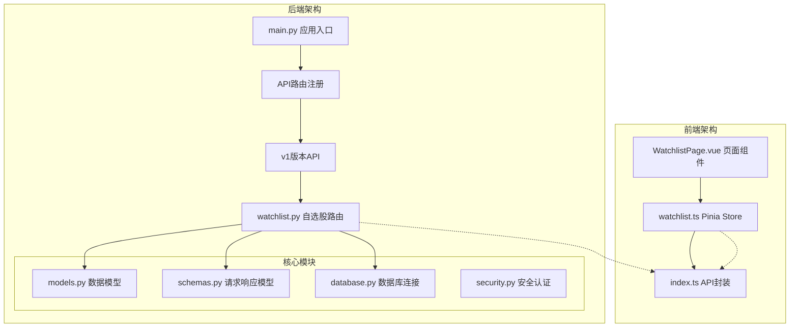

**图表来源**
- [backend/app/main.py:1-48](file://backend/app/main.py#L1-L48)
- [backend/app/api/v1/watchlist.py:1-77](file://backend/app/api/v1/watchlist.py#L1-L77)

**章节来源**
- [backend/app/main.py:1-48](file://backend/app/main.py#L1-L48)
- [backend/app/api/v1/watchlist.py:1-77](file://backend/app/api/v1/watchlist.py#L1-L77)

## 核心组件

### 数据模型设计

自选股模块的核心数据模型基于SQLAlchemy ORM实现，主要包含以下实体：

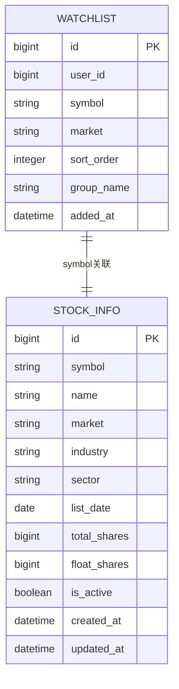

**图表来源**
- [backend/app/models/models.py:50-60](file://backend/app/models/models.py#L50-L60)
- [backend/app/models/models.py:5-20](file://backend/app/models/models.py#L5-L20)

### API接口设计

系统提供四个核心API接口，采用统一的响应格式：

| 接口 | 方法 | 路径 | 功能描述 |
|------|------|------|----------|
| 获取自选股列表 | GET | `/api/v1/watchlist` | 获取当前用户的自选股列表 |
| 添加自选股 | POST | `/api/v1/watchlist` | 添加新的自选股到用户列表 |
| 删除自选股 | DELETE | `/api/v1/watchlist/{symbol}` | 从用户列表中删除指定股票 |
| 调整排序 | PUT | `/api/v1/watchlist/sort` | 批量调整自选股排序顺序 |

**章节来源**
- [backend/app/api/v1/watchlist.py:13-77](file://backend/app/api/v1/watchlist.py#L13-L77)
- [backend/app/schemas/schemas.py:78-91](file://backend/app/schemas/schemas.py#L78-L91)

## 架构概览

自选股API模块采用分层架构设计，确保关注点分离和代码可维护性：

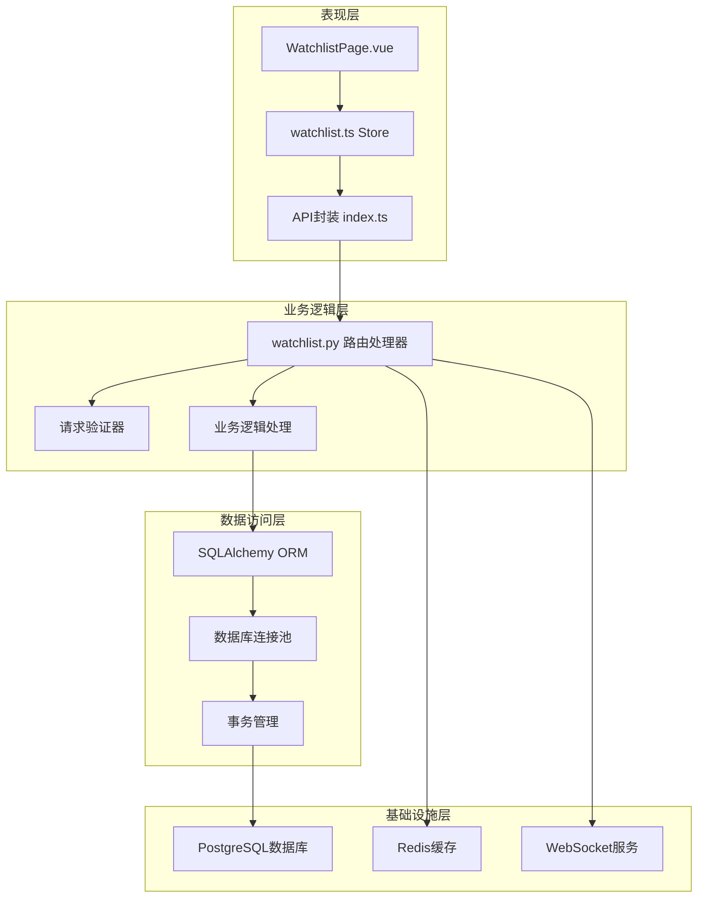

**图表来源**
- [backend/app/api/v1/watchlist.py:1-77](file://backend/app/api/v1/watchlist.py#L1-L77)
- [backend/app/core/database.py:1-25](file://backend/app/core/database.py#L1-L25)
- [backend/app/core/config.py:1-43](file://backend/app/core/config.py#L1-L43)

## 详细组件分析

### 数据模型分析

#### Watchlist模型详解

Watchlist模型是自选股功能的核心数据结构，包含以下字段：

| 字段名 | 类型 | 约束 | 描述 |
|--------|------|------|------|
| id | BigInteger | 主键 | 自增标识符 |
| user_id | BigInteger | 非空，默认1 | 用户标识符 |
| symbol | String(10) | 非空 | 股票代码 |
| market | String(10) | 非空 | 市场类型（如sh、sz） |
| sort_order | Integer | 默认0 | 排序权重 |
| group_name | String(20) | 默认"default" | 分组名称 |
| added_at | DateTime | 自动时间戳 | 添加时间 |

#### 数据模型关系图

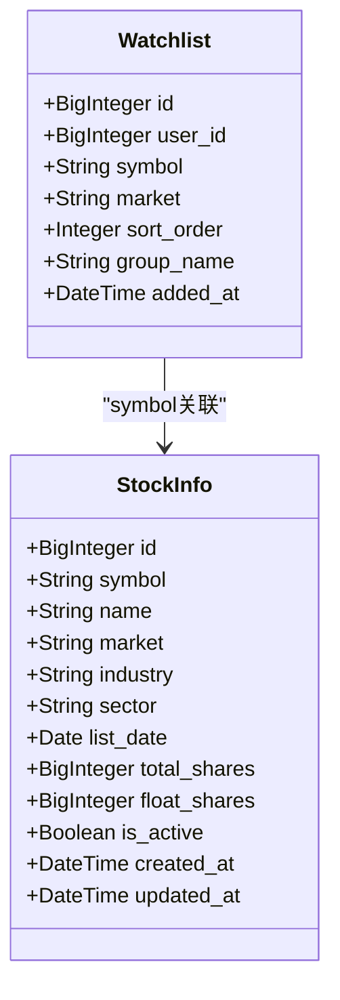

**图表来源**
- [backend/app/models/models.py:50-60](file://backend/app/models/models.py#L50-L60)
- [backend/app/models/models.py:5-20](file://backend/app/models/models.py#L5-L20)

**章节来源**
- [backend/app/models/models.py:50-60](file://backend/app/models/models.py#L50-L60)

### API接口实现分析

#### 获取自选股列表接口

该接口实现用户自选股列表的查询功能：

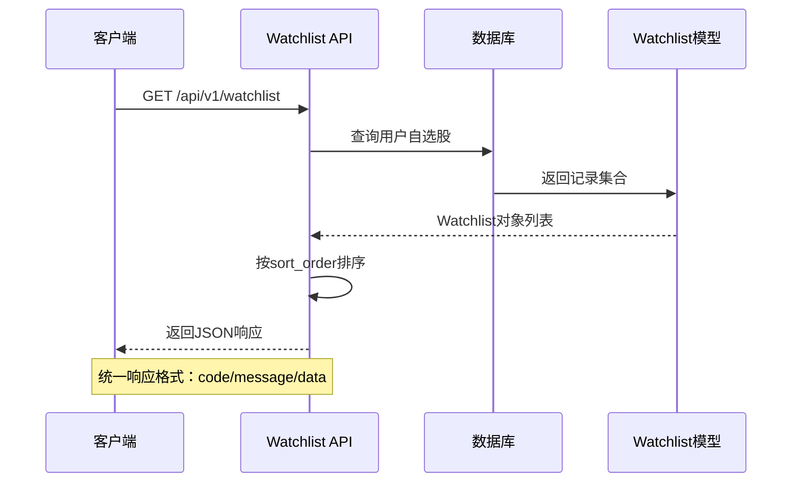

**图表来源**
- [backend/app/api/v1/watchlist.py:13-26](file://backend/app/api/v1/watchlist.py#L13-L26)

#### 添加自选股接口

添加自选股时包含重复检查和排序号自动分配：

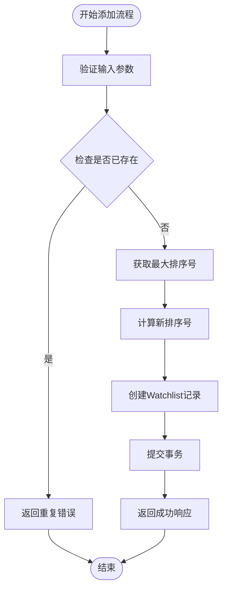

**图表来源**
- [backend/app/api/v1/watchlist.py:29-51](file://backend/app/api/v1/watchlist.py#L29-L51)

#### 删除自选股接口

删除操作采用批量删除策略，确保数据一致性：

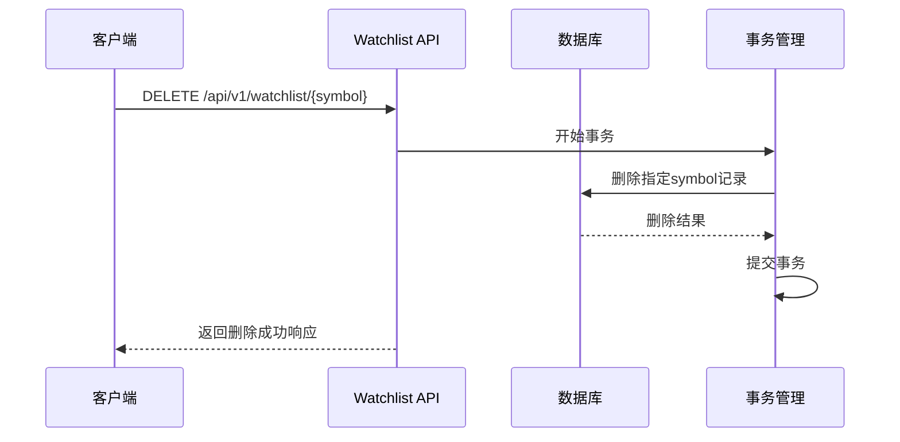

**图表来源**
- [backend/app/api/v1/watchlist.py:54-61](file://backend/app/api/v1/watchlist.py#L54-L61)

#### 排序调整接口

批量排序调整支持复杂的排序变更需求：

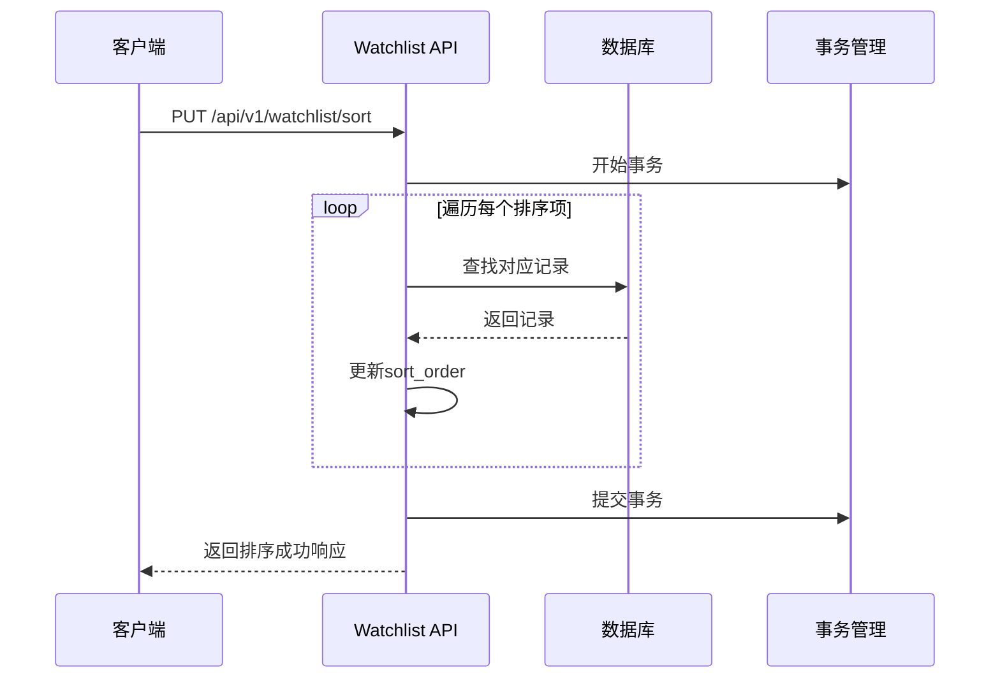

**图表来源**
- [backend/app/api/v1/watchlist.py:64-77](file://backend/app/api/v1/watchlist.py#L64-L77)

**章节来源**
- [backend/app/api/v1/watchlist.py:13-77](file://backend/app/api/v1/watchlist.py#L13-L77)

### 前端集成分析

#### Vue.js组件架构

前端采用Vue 3 Composition API和Pinia状态管理：

```mermaid
graph TB
subgraph "Watchlist页面组件"
A[WatchlistPage.vue]
B[WatchlistStore]
C[API封装]
end
subgraph "状态管理"
D[items: 股票列表]
E[loading: 加载状态]
F[fetchList(): 获取列表]
G[addStock(): 添加股票]
H[removeStock(): 删除股票]
end
A --> B
B --> C
B --> D
B --> E
B --> F
B --> G
B --> H
```

**图表来源**
- [frontend/src/pages/WatchlistPage.vue:64-103](file://frontend/src/pages/WatchlistPage.vue#L64-L103)
- [frontend/src/stores/watchlist.ts:5-36](file://frontend/src/stores/watchlist.ts#L5-L36)

#### API调用流程

前端通过封装的API接口与后端交互：

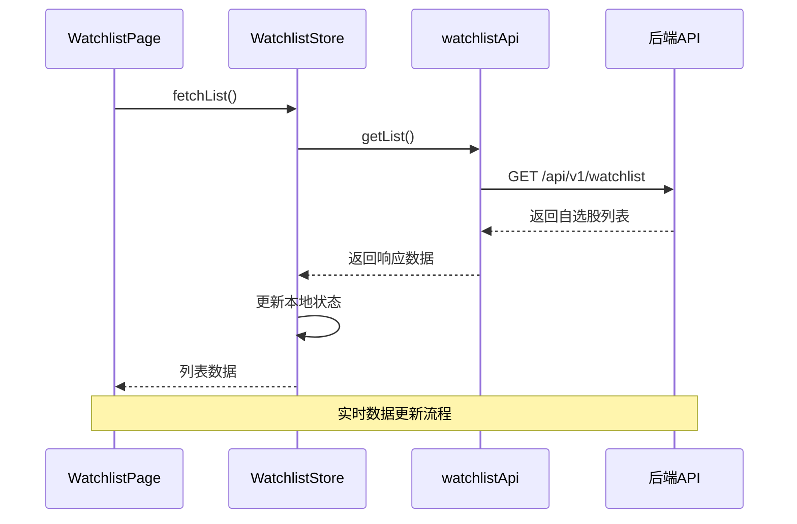

**图表来源**
- [frontend/src/stores/watchlist.ts:9-19](file://frontend/src/stores/watchlist.ts#L9-L19)
- [frontend/src/api/index.ts:20-25](file://frontend/src/api/index.ts#L20-L25)

**章节来源**
- [frontend/src/pages/WatchlistPage.vue:64-103](file://frontend/src/pages/WatchlistPage.vue#L64-L103)
- [frontend/src/stores/watchlist.ts:5-36](file://frontend/src/stores/watchlist.ts#L5-L36)
- [frontend/src/api/index.ts:20-25](file://frontend/src/api/index.ts#L20-L25)

## 依赖关系分析

### 后端依赖关系

自选股API模块的依赖关系清晰明确：

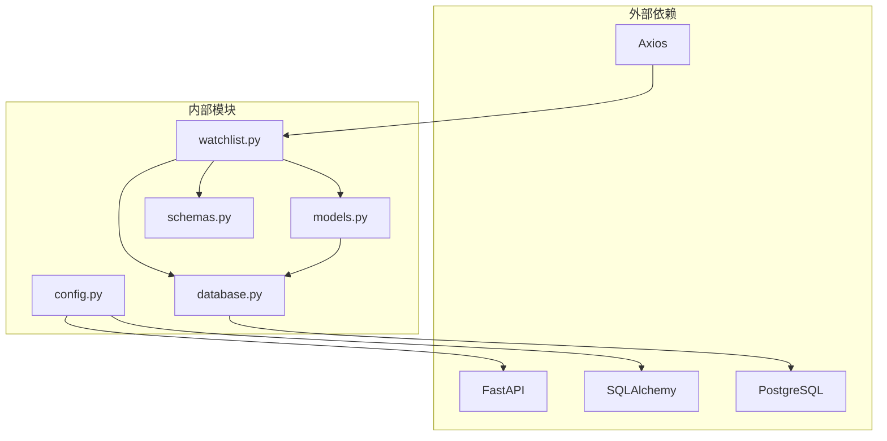

**图表来源**
- [backend/app/api/v1/watchlist.py:1-77](file://backend/app/api/v1/watchlist.py#L1-L77)
- [backend/app/core/database.py:1-25](file://backend/app/core/database.py#L1-L25)
- [backend/app/core/config.py:1-43](file://backend/app/core/config.py#L1-L43)

### 数据库连接池配置

系统采用异步数据库连接池配置，优化数据库性能：

| 配置项 | 值 | 描述 |
|--------|-----|------|
| pool_size | 20 | 连接池大小 |
| max_overflow | 10 | 最大溢出连接数 |
| echo | settings.APP_DEBUG | 是否输出SQL日志 |
| DATABASE_URL | PostgreSQL连接字符串 | 数据库连接地址 |

**章节来源**
- [backend/app/core/database.py:7-8](file://backend/app/core/database.py#L7-L8)
- [backend/app/core/config.py:12](file://backend/app/core/config.py#L12)

## 性能考虑

### 数据库性能优化

1. **索引策略**：建议在以下字段建立索引以提升查询性能
   - `watchlist.user_id` - 用户查询过滤
   - `watchlist.symbol` - 股票代码查询
   - `watchlist.sort_order` - 排序查询

2. **查询优化**：
   - 使用`LIMIT 1`优化最大排序号查询
   - 采用批量操作减少数据库往返次数

3. **连接池优化**：
   - 异步连接池避免阻塞
   - 连接复用减少连接开销

### 缓存策略

虽然当前版本未实现缓存，但建议的缓存策略：

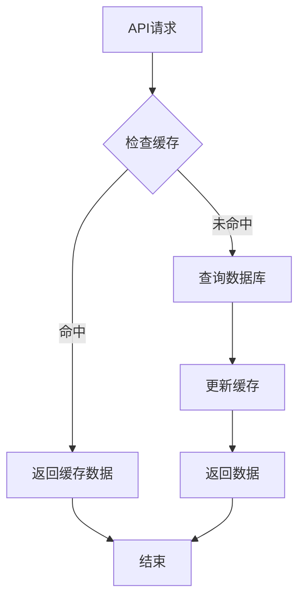

### WebSocket实时同步

系统支持WebSocket实时推送，用于行情数据的实时更新：

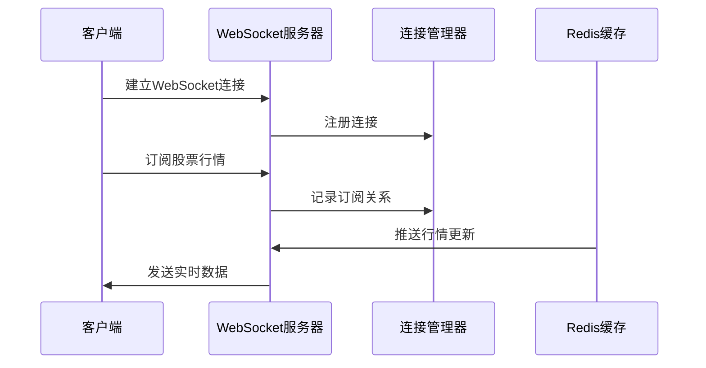

**图表来源**
- [backend/app/api/websocket.py:39-79](file://backend/app/api/websocket.py#L39-L79)

## 故障排除指南

### 常见错误处理

#### 数据库连接问题

1. **连接超时**：检查数据库连接池配置和网络连通性
2. **连接泄漏**：确保所有数据库会话正确关闭
3. **事务冲突**：检查并发操作的事务隔离级别

#### API响应错误

系统采用统一的响应格式，便于错误处理：

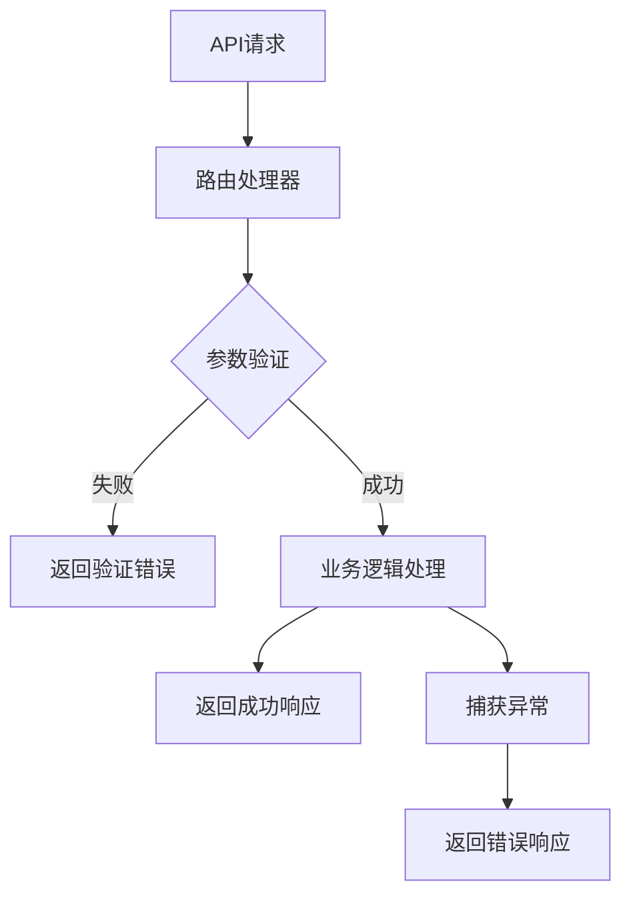

#### 前端状态同步问题

1. **数据不同步**：检查API调用时机和状态更新逻辑
2. **加载状态异常**：确保异步操作的Promise正确处理
3. **UI渲染问题**：验证响应数据结构的一致性

**章节来源**
- [backend/app/api/v1/watchlist.py:38-39](file://backend/app/api/v1/watchlist.py#L38-L39)
- [frontend/src/stores/watchlist.ts:9-19](file://frontend/src/stores/watchlist.ts#L9-L19)

## 结论

自选股API模块展现了现代Web应用的良好实践，具有以下特点：

1. **清晰的架构设计**：分层架构确保了代码的可维护性和可扩展性
2. **完善的API设计**：RESTful接口设计符合行业标准
3. **前后端分离**：采用现代化的前端技术栈
4. **异步处理**：使用异步编程模式提升性能
5. **统一响应格式**：便于前端处理和错误管理

未来可以考虑的改进方向：
- 实现用户认证和授权机制
- 添加Redis缓存层提升性能
- 增加批量操作接口
- 实现分组管理功能
- 添加排序调整的批量操作

该模块为Stock-View项目提供了稳定可靠的自选股管理基础，为后续功能扩展奠定了坚实的技术基础。