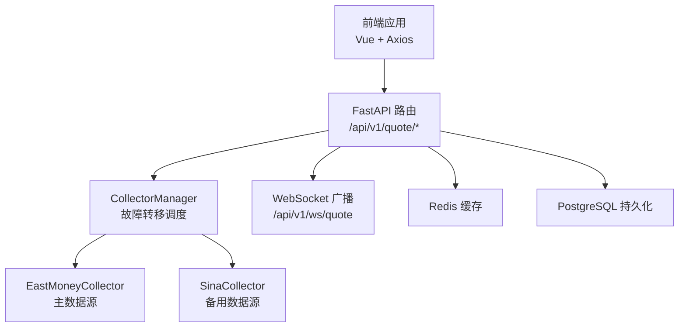
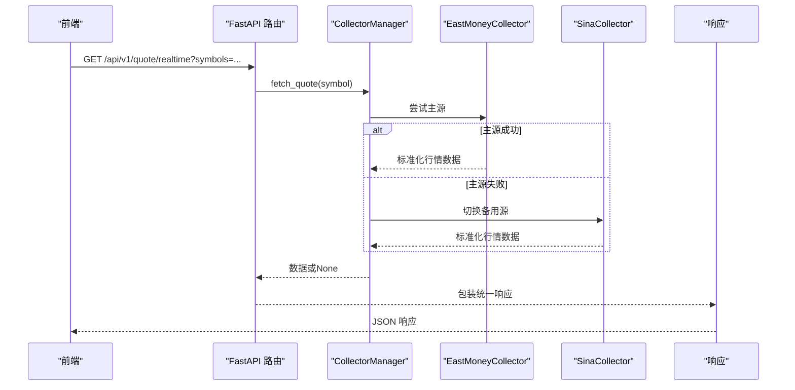
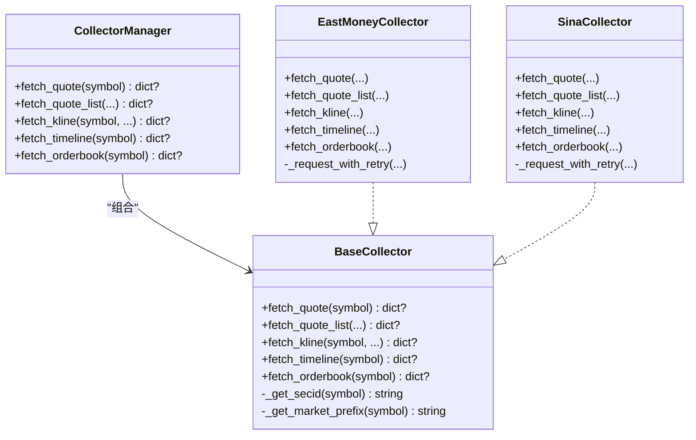
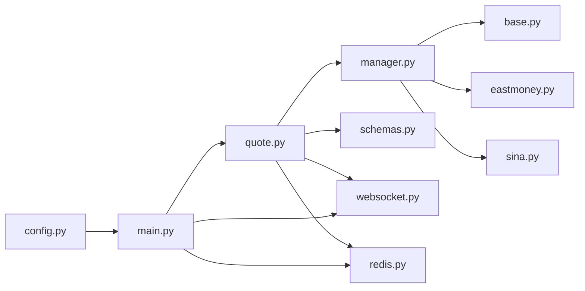

# 行情API模块

<cite>
**本文引用的文件**
- [quote.py](file://backend/app/api/v1/quote.py)
- [manager.py](file://backend/app/services/collector/manager.py)
- [base.py](file://backend/app/services/collector/base.py)
- [eastmoney.py](file://backend/app/services/collector/eastmoney.py)
- [sina.py](file://backend/app/services/collector/sina.py)
- [schemas.py](file://backend/app/schemas/schemas.py)
- [redis.py](file://backend/app/core/redis.py)
- [websocket.py](file://backend/app/api/websocket.py)
- [main.py](file://backend/app/main.py)
- [config.py](file://backend/app/core/config.py)
- [index.ts](file://frontend/src/api/index.ts)
- [quote.ts](file://frontend/src/stores/quote.ts)
</cite>

## 目录
1. [简介](#简介)
2. [项目结构](#项目结构)
3. [核心组件](#核心组件)
4. [架构总览](#架构总览)
5. [详细组件分析](#详细组件分析)
6. [依赖关系分析](#依赖关系分析)
7. [性能考量](#性能考量)
8. [故障排查指南](#故障排查指南)
9. [结论](#结论)
10. [附录](#附录)

## 简介
本文件为“行情API模块”的权威技术文档，面向后端开发者与前端集成人员，系统阐述以下接口的设计与实现：实时行情接口（/realtime）、行情列表接口（/list）、K线数据接口（/kline）、分时数据接口（/timeline）、盘口数据接口（/orderbook）。文档覆盖HTTP方法、URL参数、请求验证规则、响应数据结构；解释数据采集器的使用方式、错误处理机制、数据缓存策略；提供完整的接口调用示例、参数说明、返回值格式与常见问题解决方案，并给出性能优化建议与最佳实践。

## 项目结构
后端采用FastAPI框架，行情API位于v1版本路由下，数据采集通过CollectorManager统一调度，底层由EastMoney与Sina两个采集器实现，支持自动故障转移与重试机制。前端通过Axios封装统一调用。

图示来源
- [main.py:39-43](file://backend/app/main.py#L39-L43)
- [quote.py:7-65](file://backend/app/api/v1/quote.py#L7-L65)
- [manager.py:12-94](file://backend/app/services/collector/manager.py#L12-L94)
- [eastmoney.py:26-297](file://backend/app/services/collector/eastmoney.py#L26-L297)
- [sina.py:24-312](file://backend/app/services/collector/sina.py#L24-L312)
- [websocket.py:39-79](file://backend/app/api/websocket.py#L39-L79)
- [redis.py:10-25](file://backend/app/core/redis.py#L10-L25)

章节来源
- [main.py:1-48](file://backend/app/main.py#L1-L48)
- [quote.py:1-65](file://backend/app/api/v1/quote.py#L1-L65)

## 核心组件
- 路由层：定义各行情接口的HTTP方法、路径与参数校验。
- 采集管理层：负责按优先级选择采集器、执行数据抓取、异常处理与故障转移。
- 采集器实现：分别对接东方财富与新浪财经，完成数据抓取、解析与标准化。
- 响应模型：基于Pydantic定义统一响应结构与业务数据模型。
- 缓存与广播：Redis用于缓存，WebSocket用于实时推送。

章节来源
- [quote.py:7-65](file://backend/app/api/v1/quote.py#L7-L65)
- [manager.py:12-94](file://backend/app/services/collector/manager.py#L12-L94)
- [base.py:5-45](file://backend/app/services/collector/base.py#L5-L45)
- [schemas.py:6-103](file://backend/app/schemas/schemas.py#L6-L103)

## 架构总览
行情API的请求处理链路如下：前端发起HTTP请求 → FastAPI路由处理 → CollectorManager按优先级调用采集器 → 采集器访问外部数据源并解析 → 返回标准化数据 → 统一包装响应 → 前端消费。

图示来源
- [quote.py:7-16](file://backend/app/api/v1/quote.py#L7-L16)
- [manager.py:21-33](file://backend/app/services/collector/manager.py#L21-L33)
- [eastmoney.py:69-85](file://backend/app/services/collector/eastmoney.py#L69-L85)
- [sina.py:64-107](file://backend/app/services/collector/sina.py#L64-L107)

## 详细组件分析

### 实时行情接口 /realtime
- HTTP方法与路径
  - 方法：GET
  - 路径：/api/v1/quote/realtime
- URL参数
  - symbols: string, 必填；多个股票代码以逗号分隔，最多50个
- 请求验证规则
  - 对symbols进行去空白与截断至最多50个
- 处理逻辑
  - 遍历symbols，逐个调用采集器获取行情
  - 任一采集器返回有效数据即加入结果集
  - 返回统一响应结构
- 响应数据结构
  - data.items: 数组，元素为标准化行情对象
- 错误处理
  - 若所有采集器均失败，仍返回统一响应，由上层业务判断

章节来源
- [quote.py:7-16](file://backend/app/api/v1/quote.py#L7-L16)
- [manager.py:21-33](file://backend/app/services/collector/manager.py#L21-L33)
- [eastmoney.py:69-85](file://backend/app/services/collector/eastmoney.py#L69-L85)
- [sina.py:64-107](file://backend/app/services/collector/sina.py#L64-L107)
- [schemas.py:12-28](file://backend/app/schemas/schemas.py#L12-L28)

### 行情列表接口 /list
- HTTP方法与路径
  - 方法：GET
  - 路径：/api/v1/quote/list
- URL参数
  - market: string, 可选；all/sh/sz，默认all
  - sort_by: string, 可选；change_pct/volume/amount/turnover，默认change_pct
  - sort_order: string, 可选；asc/desc，默认desc
  - page: int, 可选；≥1，默认1
  - page_size: int, 可选；1..100，默认20
- 处理逻辑
  - 调用采集器获取列表数据
  - 若返回None，表示数据源不可用，返回特定错误码
- 响应数据结构
  - data.items: 列表项数组
  - data.total/page/page_size: 分页信息

章节来源
- [quote.py:19-33](file://backend/app/api/v1/quote.py#L19-L33)
- [manager.py:35-47](file://backend/app/services/collector/manager.py#L35-L47)
- [eastmoney.py:87-149](file://backend/app/services/collector/eastmoney.py#L87-L149)
- [sina.py:109-171](file://backend/app/services/collector/sina.py#L109-L171)

### K线数据接口 /kline
- HTTP方法与路径
  - 方法：GET
  - 路径：/api/v1/quote/kline
- URL参数
  - symbol: string, 必填
  - period: string, 可选；1m/5m/15m/30m/60m/d/w/m，默认d
  - fq_type: string, 可选；none/front/back，默认front
  - limit: int, 可选；1..500，默认120
- 处理逻辑
  - 调用采集器获取K线数据
  - 若返回None，表示股票不存在或数据源不可用，返回特定错误码
- 响应数据结构
  - data.symbol/period/fq_type
  - data.items: K线条目数组，含date/open/close/high/low/volume/amount/change_pct等

章节来源
- [quote.py:36-47](file://backend/app/api/v1/quote.py#L36-L47)
- [manager.py:49-61](file://backend/app/services/collector/manager.py#L49-L61)
- [eastmoney.py:151-199](file://backend/app/services/collector/eastmoney.py#L151-L199)
- [sina.py:173-227](file://backend/app/services/collector/sina.py#L173-L227)

### 分时数据接口 /timeline
- HTTP方法与路径
  - 方法：GET
  - 路径：/api/v1/quote/timeline
- URL参数
  - symbol: string, 必填
- 处理逻辑
  - 调用采集器获取分时数据
  - 若返回None，表示股票不存在或数据源不可用，返回特定错误码
- 响应数据结构
  - data.symbol/date/prev_close
  - data.points: 分时点数组，含time/price/avg/volume

章节来源
- [quote.py:50-56](file://backend/app/api/v1/quote.py#L50-L56)
- [manager.py:63-75](file://backend/app/services/collector/manager.py#L63-L75)
- [eastmoney.py:201-239](file://backend/app/services/collector/eastmoney.py#L201-L239)
- [sina.py:229-270](file://backend/app/services/collector/sina.py#L229-L270)

### 盘口数据接口 /orderbook
- HTTP方法与路径
  - 方法：GET
  - 路径：/api/v1/quote/orderbook
- URL参数
  - symbol: string, 必填
- 处理逻辑
  - 调用采集器获取盘口数据
  - 若返回None，表示股票不存在或数据源不可用，返回特定错误码
- 响应数据结构
  - data.symbol/timestamp
  - data.asks/bids: 五档买卖盘数组，含level/price/volume

章节来源
- [quote.py:59-65](file://backend/app/api/v1/quote.py#L59-L65)
- [manager.py:77-89](file://backend/app/services/collector/manager.py#L77-L89)
- [eastmoney.py:241-278](file://backend/app/services/collector/eastmoney.py#L241-L278)
- [sina.py:272-311](file://backend/app/services/collector/sina.py#L272-L311)

### 数据采集器与故障转移
- 设计模式
  - 抽象基类定义统一接口
  - 两个具体采集器实现不同数据源
  - CollectorManager按优先级轮询，遇错自动切换
- 重试与超时
  - 每个采集器对HTTP请求实现带退避的重试
  - 设置连接/读取/写入/池化超时
- 字段映射与标准化
  - 采集器负责将外部字段映射为统一模型

图示来源
- [base.py:5-45](file://backend/app/services/collector/base.py#L5-L45)
- [eastmoney.py:26-297](file://backend/app/services/collector/eastmoney.py#L26-L297)
- [sina.py:24-312](file://backend/app/services/collector/sina.py#L24-L312)
- [manager.py:12-94](file://backend/app/services/collector/manager.py#L12-L94)

### WebSocket 实时推送
- 路由：/api/v1/ws/quote
- 功能：订阅/取消订阅指定symbol的行情更新，服务端在收到更新时广播
- 订阅消息格式：包含action（subscribe/unsubscribe/ping）与symbols/channels
- 广播消息格式：包含type（quote）、symbol与data

章节来源
- [websocket.py:39-79](file://backend/app/api/websocket.py#L39-L79)

### 响应模型与统一格式
- 通用响应结构：code/message/data
- 行情相关模型：QuoteItem/KlineItem/TimelinePoint/OrderBookLevel
- 便于前后端一致处理与类型约束

章节来源
- [schemas.py:6-103](file://backend/app/schemas/schemas.py#L6-L103)

### 前端调用示例与最佳实践
- 前端封装
  - 使用Axios创建实例，统一baseURL为/api/v1
  - 提供quoteApi封装各接口调用
- 前端store
  - quote.ts中封装列表、实时行情、当前行情等状态与方法
- 最佳实践
  - 控制symbols数量（/realtime最多50个）
  - 合理设置分页参数（/list）
  - 对高频请求结合本地缓存与节流
  - 使用WebSocket订阅关键symbol以降低轮询成本

章节来源
- [index.ts:8-18](file://frontend/src/api/index.ts#L8-L18)
- [quote.ts:11-30](file://frontend/src/stores/quote.ts#L11-L30)

## 依赖关系分析
- 路由依赖CollectorManager，后者再依赖具体采集器
- 采集器依赖httpx异步HTTP客户端与日志
- 应用启动时初始化数据库连接，关闭时释放Redis连接
- 配置文件提供缓存TTL、采集间隔等参数

图示来源
- [quote.py:1-4](file://backend/app/api/v1/quote.py#L1-L4)
- [manager.py:1-7](file://backend/app/services/collector/manager.py#L1-L7)
- [base.py:1-3](file://backend/app/services/collector/base.py#L1-L3)
- [eastmoney.py:1-6](file://backend/app/services/collector/eastmoney.py#L1-L6)
- [sina.py:1-7](file://backend/app/services/collector/sina.py#L1-L7)
- [schemas.py:1-3](file://backend/app/schemas/schemas.py#L1-L3)
- [websocket.py:1-7](file://backend/app/api/websocket.py#L1-L7)
- [redis.py:1-4](file://backend/app/core/redis.py#L1-L4)
- [main.py:1-8](file://backend/app/main.py#L1-L8)
- [config.py:1-6](file://backend/app/core/config.py#L1-L6)

章节来源
- [main.py:13-27](file://backend/app/main.py#L13-L27)
- [config.py:29-30](file://backend/app/core/config.py#L29-L30)

## 性能考量
- 采集频率与缓存
  - 配置项提供采集间隔与缓存TTL，建议与业务需求匹配
- 异步与并发
  - 采集器使用httpx.AsyncClient，具备连接池与超时控制
- 故障转移
  - 主备源自动切换，提升可用性与稳定性
- 前端优化
  - 使用WebSocket订阅热点symbol，减少HTTP轮询
  - 合理分页与批量请求，避免单次symbols过多

章节来源
- [config.py:29-30](file://backend/app/core/config.py#L29-L30)
- [eastmoney.py:32-39](file://backend/app/services/collector/eastmoney.py#L32-L39)
- [sina.py:27-34](file://backend/app/services/collector/sina.py#L27-L34)
- [websocket.py:39-79](file://backend/app/api/websocket.py#L39-L79)

## 故障排查指南
- 常见错误码
  - 1002：股票代码不存在或数据源不可用
  - 1003：数据源暂不可用
- 排查步骤
  - 确认symbol格式正确且存在
  - 检查网络连通性与外部数据源状态
  - 查看采集器日志中的重试与异常信息
  - 核对参数范围（如page/page_size/limit）
- 建议
  - 在调用方增加重试与降级策略
  - 对高频接口增加本地缓存与节流

章节来源
- [quote.py:31-32](file://backend/app/api/v1/quote.py#L31-L32)
- [quote.py:45-46](file://backend/app/api/v1/quote.py#L45-L46)
- [quote.py:54-55](file://backend/app/api/v1/quote.py#L54-L55)
- [quote.py:63-64](file://backend/app/api/v1/quote.py#L63-L64)

## 结论
行情API模块通过清晰的路由层、可扩展的采集器体系与统一的响应模型，实现了高可用、易维护的A股行情服务能力。配合WebSocket与缓存策略，可在保证实时性的前提下显著降低后端压力。建议在生产环境中结合配置参数与前端优化策略，持续监控与迭代。

## 附录

### 接口调用示例（路径与参数）
- 实时行情
  - GET /api/v1/quote/realtime?symbols=600000,000001
- 行情列表
  - GET /api/v1/quote/list?market=all&sort_by=change_pct&sort_order=desc&page=1&page_size=20
- K线数据
  - GET /api/v1/quote/kline?symbol=600000&period=d&fq_type=front&limit=120
- 分时数据
  - GET /api/v1/quote/timeline?symbol=600000
- 盘口数据
  - GET /api/v1/quote/orderbook?symbol=600000

章节来源
- [index.ts:9-13](file://frontend/src/api/index.ts#L9-L13)
- [quote.ts:11-22](file://frontend/src/stores/quote.ts#L11-L22)