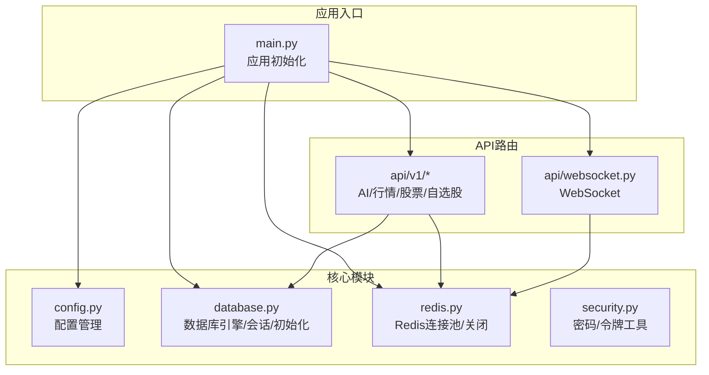
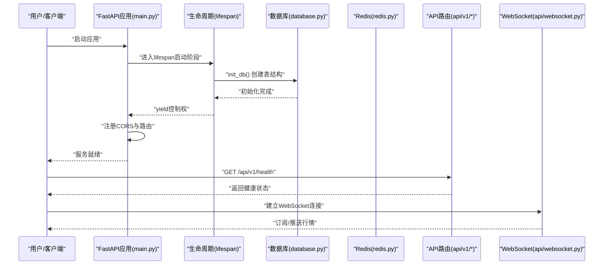
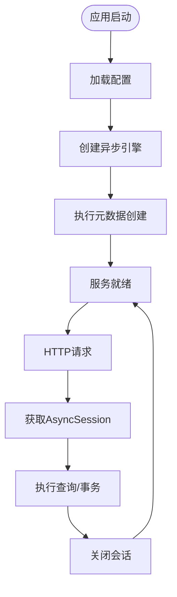
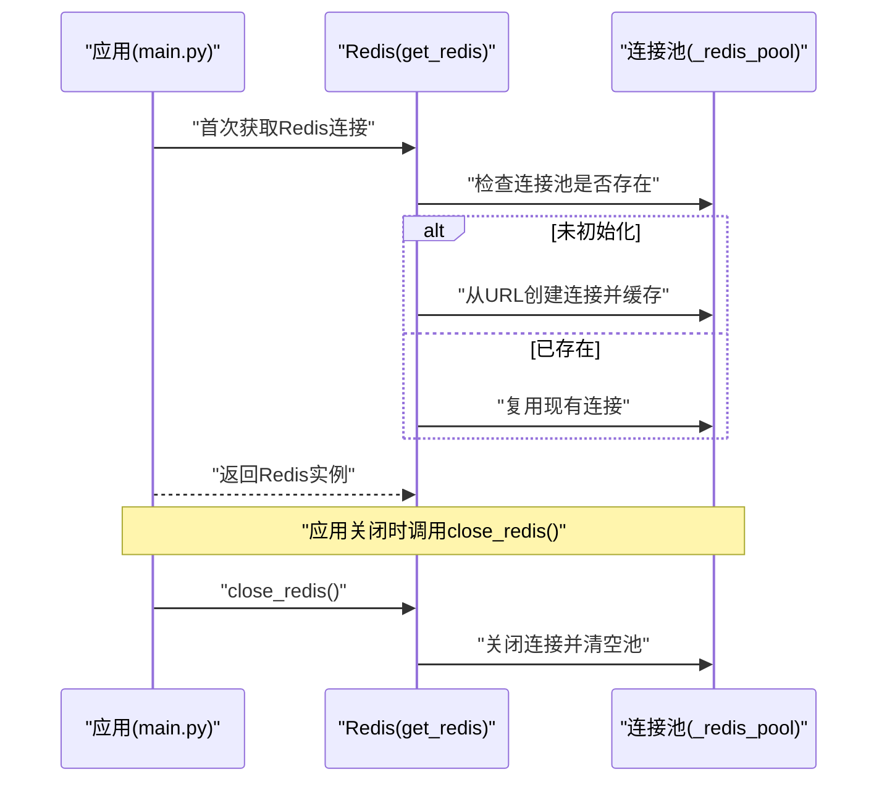
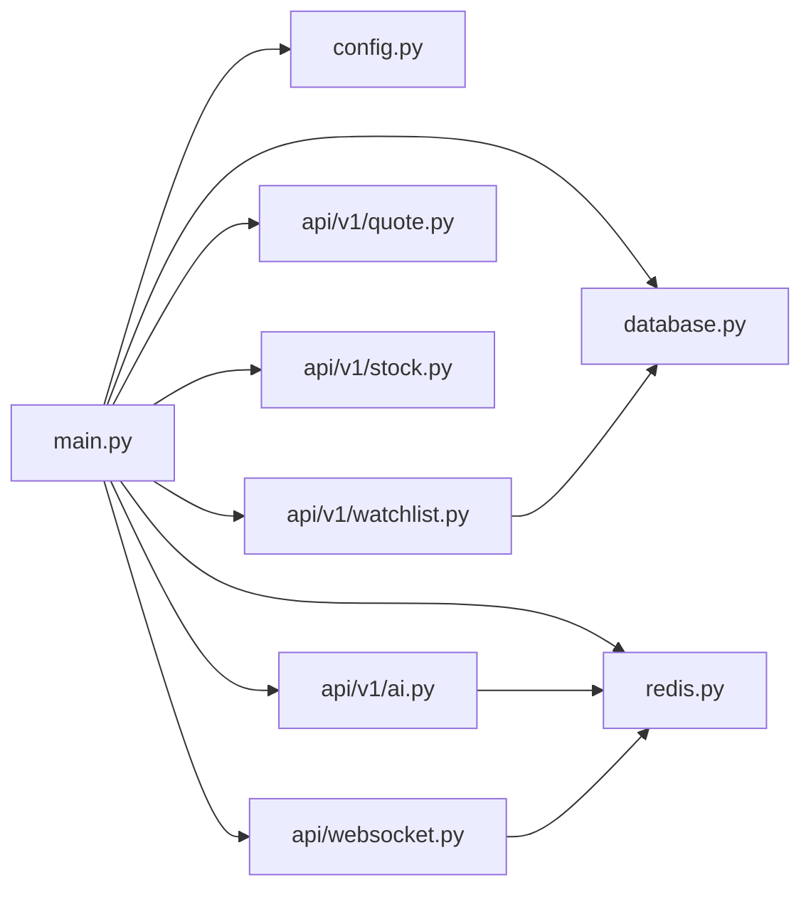

# FastAPI应用架构

<cite>
**本文档引用的文件**
- [backend/app/main.py](file://backend/app/main.py)
- [backend/app/core/config.py](file://backend/app/core/config.py)
- [backend/app/core/database.py](file://backend/app/core/database.py)
- [backend/app/core/redis.py](file://backend/app/core/redis.py)
- [backend/app/core/security.py](file://backend/app/core/security.py)
- [backend/app/api/v1/ai.py](file://backend/app/api/v1/ai.py)
- [backend/app/api/v1/quote.py](file://backend/app/api/v1/quote.py)
- [backend/app/api/v1/stock.py](file://backend/app/api/v1/stock.py)
- [backend/app/api/v1/watchlist.py](file://backend/app/api/v1/watchlist.py)
- [backend/app/api/websocket.py](file://backend/app/api/websocket.py)
</cite>

## 目录
1. [简介](#简介)
2. [项目结构](#项目结构)
3. [核心组件](#核心组件)
4. [架构总览](#架构总览)
5. [详细组件分析](#详细组件分析)
6. [依赖分析](#依赖分析)
7. [性能考虑](#性能考虑)
8. [故障排查指南](#故障排查指南)
9. [结论](#结论)

## 简介
本文件系统性梳理Stock-View项目的FastAPI应用架构，重点围绕应用初始化流程中的生命周期管理(lifespan)、CORS跨域配置、路由注册机制展开；同时深入解析数据库连接初始化、Redis缓存连接管理、中间件配置等关键环节。文档还总结了异步上下文管理器的使用模式、资源的正确初始化与清理策略，并给出应用配置管理的最佳实践，包括环境变量加载、配置验证与运行时更新的技术要点。为便于理解，文中提供了多幅架构图与流程图，并以“章节来源”标注具体实现位置。

## 项目结构
后端采用按功能域划分的模块化组织方式：核心能力位于core目录（配置、数据库、Redis、安全），业务API位于api/v1目录（AI分析、行情、股票、自选股），WebSocket位于独立模块，服务层位于services目录（采集器与管理器）。主入口在main.py中完成应用实例创建、生命周期钩子、CORS与路由注册。

**图表来源**
- [backend/app/main.py:1-48](file://backend/app/main.py#L1-L48)
- [backend/app/core/config.py:1-43](file://backend/app/core/config.py#L1-L43)
- [backend/app/core/database.py:1-25](file://backend/app/core/database.py#L1-L25)
- [backend/app/core/redis.py:1-25](file://backend/app/core/redis.py#L1-L25)
- [backend/app/api/v1/ai.py:1-29](file://backend/app/api/v1/ai.py#L1-L29)
- [backend/app/api/v1/quote.py:1-65](file://backend/app/api/v1/quote.py#L1-L65)
- [backend/app/api/v1/stock.py:1-37](file://backend/app/api/v1/stock.py#L1-L37)
- [backend/app/api/v1/watchlist.py:1-77](file://backend/app/api/v1/watchlist.py#L1-L77)
- [backend/app/api/websocket.py:1-79](file://backend/app/api/websocket.py#L1-L79)

**章节来源**
- [backend/app/main.py:1-48](file://backend/app/main.py#L1-L48)
- [backend/app/core/config.py:1-43](file://backend/app/core/config.py#L1-L43)

## 核心组件
- 应用实例与生命周期
  - 使用asynccontextmanager定义lifespan，启动阶段调用数据库初始化，关闭阶段释放Redis连接。
  - 通过FastAPI构造函数注入lifespan，确保资源在应用启动与关闭时正确管理。
- CORS跨域配置
  - 在应用上注册CORSMiddleware，允许任意来源、凭证、方法与头，满足前端开发调试需求。
- 路由注册机制
  - 将各模块的APIRouter按前缀/api/v1统一注册，形成清晰的版本化API命名空间。
- 健康检查端点
  - 提供/api/v1/health用于快速检测服务状态。

**章节来源**
- [backend/app/main.py:13-48](file://backend/app/main.py#L13-L48)

## 架构总览
下图展示了应用启动的关键路径：配置加载、数据库初始化、Redis连接建立、CORS与路由注册，以及健康检查端点暴露。

**图表来源**
- [backend/app/main.py:13-48](file://backend/app/main.py#L13-L48)
- [backend/app/core/database.py:23-25](file://backend/app/core/database.py#L23-L25)
- [backend/app/core/redis.py:21-25](file://backend/app/core/redis.py#L21-L25)
- [backend/app/api/v1/ai.py:1-29](file://backend/app/api/v1/ai.py#L1-L29)
- [backend/app/api/v1/quote.py:1-65](file://backend/app/api/v1/quote.py#L1-L65)
- [backend/app/api/v1/stock.py:1-37](file://backend/app/api/v1/stock.py#L1-L37)
- [backend/app/api/v1/watchlist.py:1-77](file://backend/app/api/v1/watchlist.py#L1-L77)
- [backend/app/api/websocket.py:1-79](file://backend/app/api/websocket.py#L1-L79)

## 详细组件分析

### 配置管理（Settings与环境变量加载）
- 配置类Settings继承自BaseSettings，从.env文件加载键值，包含应用环境、数据库URL、Redis地址、AI适配器与服务参数、Celery消息队列、行情采集间隔与缓存TTL、JWT密钥与算法等。
- 使用lru_cache装饰的工厂函数get_settings，避免重复解析配置，提升性能。
- 最佳实践
  - 将敏感信息（如数据库密码、JWT密钥）置于环境变量或容器机密中，不直接写入代码仓库。
  - 在生产环境设置APP_ENV=production，禁用APP_DEBUG，确保日志与SQL回显仅在开发环境开启。
  - 对关键配置项进行默认值设定与范围约束，结合异常处理保证启动失败可定位。

**章节来源**
- [backend/app/core/config.py:5-43](file://backend/app/core/config.py#L5-L43)

### 数据库连接与初始化
- 引擎与会话
  - 使用异步引擎create_async_engine，连接字符串来自配置；会话工厂async_sessionmaker提供AsyncSession实例，expire_on_commit=False减少对象过期带来的问题。
- 会话依赖
  - get_db提供基于上下文管理的异步生成器，确保每次请求创建新会话并在finally中关闭，避免连接泄漏。
- 初始化流程
  - init_db在lifespan启动阶段执行，使用engine.begin()连接并调用Base.metadata.create_all创建所有表，确保应用启动即具备完整Schema。
- 最佳实践
  - 生产环境适当增大pool_size与max_overflow，结合连接超时与重试策略。
  - 在事务边界明确commit/rollback，避免长时间持有会话导致锁竞争。

**图表来源**
- [backend/app/core/database.py:7-25](file://backend/app/core/database.py#L7-L25)
- [backend/app/core/config.py:12-12](file://backend/app/core/config.py#L12-L12)

**章节来源**
- [backend/app/core/database.py:1-25](file://backend/app/core/database.py#L1-L25)

### Redis缓存连接管理
- 连接池
  - get_redis通过全局变量维护aioredis连接池，首次调用时解析REDIS_URL并创建连接，后续复用以降低握手开销。
- 生命周期清理
  - close_redis在lifespan关闭阶段调用，确保应用退出时释放Redis连接，避免进程悬挂。
- 最佳实践
  - 在高并发场景下，合理设置连接池大小与超时时间；对键空间进行命名规范，便于运维与清理。
  - 对需要持久化的缓存数据，配合TTL与过期策略，避免无限增长。

**图表来源**
- [backend/app/core/redis.py:10-25](file://backend/app/core/redis.py#L10-L25)
- [backend/app/main.py:13-27](file://backend/app/main.py#L13-L27)

**章节来源**
- [backend/app/core/redis.py:1-25](file://backend/app/core/redis.py#L1-L25)

### CORS跨域与中间件配置
- CORS配置
  - 允许任意来源、凭证、方法与头，满足前端开发调试与跨域访问需求。
- 中间件注册
  - 通过add_middleware注册CORSMiddleware，作为应用级中间件对所有路由生效。
- 最佳实践
  - 生产环境应限制allow_origins为可信域名列表，避免安全风险。
  - 明确允许的方法与头，减少预检请求的复杂度。

**章节来源**
- [backend/app/main.py:29-36](file://backend/app/main.py#L29-L36)

### 路由注册与API设计
- 版本化命名空间
  - 所有API路由均以/api/v1为前缀，便于未来版本演进与兼容性管理。
- 路由模块
  - AI分析、行情、股票、自选股分别定义独立的APIRouter，职责清晰。
- 依赖注入
  - 自选股模块通过Depends(get_db)注入AsyncSession，体现依赖倒置与测试友好性。
- 最佳实践
  - 统一响应结构（code/message/data），便于前端一致处理。
  - 对外部API调用设置合理超时与重试，避免阻塞请求线程。

**章节来源**
- [backend/app/main.py:38-43](file://backend/app/main.py#L38-L43)
- [backend/app/api/v1/ai.py:1-29](file://backend/app/api/v1/ai.py#L1-L29)
- [backend/app/api/v1/quote.py:1-65](file://backend/app/api/v1/quote.py#L1-L65)
- [backend/app/api/v1/stock.py:1-37](file://backend/app/api/v1/stock.py#L1-L37)
- [backend/app/api/v1/watchlist.py:1-77](file://backend/app/api/v1/watchlist.py#L1-L77)

### WebSocket与实时推送
- 连接管理
  - ConnectionManager维护活动连接与订阅关系，支持订阅/退订与心跳ping/pong。
- 广播机制
  - broadcast_quote_update根据订阅关系向客户端推送行情更新，异常断连自动清理。
- 最佳实践
  - 对消息格式进行校验与限流，防止恶意订阅与广播风暴。
  - 结合Redis或任务队列实现跨节点广播，扩展至分布式部署。

**章节来源**
- [backend/app/api/websocket.py:1-79](file://backend/app/api/websocket.py#L1-L79)

### 安全与认证辅助
- 密码哈希与校验
  - 使用bcrypt进行密码哈希与验证，保障用户凭据安全。
- JWT工具
  - 支持基于配置的密钥与算法生成/解码访问令牌，便于后续鉴权中间件集成。
- 最佳实践
  - 生产环境使用强随机密钥与安全算法，定期轮换。
  - 对令牌有效期与刷新策略进行统一管理。

**章节来源**
- [backend/app/core/security.py:1-30](file://backend/app/core/security.py#L1-L30)

## 依赖分析
- 组件耦合
  - main.py集中协调配置、数据库、Redis与路由，是应用的编排中心。
  - API模块依赖数据库会话与Redis连接，体现清晰的依赖注入。
- 外部依赖
  - SQLAlchemy异步ORM、aioredis、FastAPI中间件生态。
- 循环依赖
  - 当前结构未见循环导入；若后续引入共享模型或工具模块，需注意模块拆分与延迟导入。

**图表来源**
- [backend/app/main.py:1-48](file://backend/app/main.py#L1-L48)
- [backend/app/core/config.py:1-43](file://backend/app/core/config.py#L1-L43)
- [backend/app/core/database.py:1-25](file://backend/app/core/database.py#L1-L25)
- [backend/app/core/redis.py:1-25](file://backend/app/core/redis.py#L1-L25)
- [backend/app/api/v1/ai.py:1-29](file://backend/app/api/v1/ai.py#L1-L29)
- [backend/app/api/v1/quote.py:1-65](file://backend/app/api/v1/quote.py#L1-L65)
- [backend/app/api/v1/stock.py:1-37](file://backend/app/api/v1/stock.py#L1-L37)
- [backend/app/api/v1/watchlist.py:1-77](file://backend/app/api/v1/watchlist.py#L1-L77)
- [backend/app/api/websocket.py:1-79](file://backend/app/api/websocket.py#L1-L79)

**章节来源**
- [backend/app/main.py:1-48](file://backend/app/main.py#L1-L48)

## 性能考虑
- 连接池优化
  - 数据库：合理设置pool_size与max_overflow，结合连接超时与重试策略，避免峰值拥塞。
  - Redis：复用连接池，避免频繁创建/销毁；对高并发场景评估连接上限。
- 异步I/O
  - 使用异步数据库驱动与HTTP客户端，减少阻塞；对外部服务调用设置超时与重试。
- 缓存策略
  - 行情与AI分析结果结合TTL与缓存键空间管理，降低上游依赖压力。
- 路由与中间件
  - 将CORS等通用中间件前置，避免重复计算；按需启用调试日志，生产关闭SQL回显。

## 故障排查指南
- 启动失败
  - 检查DATABASE_URL与REDIS_URL是否可达；确认配置文件路径与编码正确。
  - 查看lifespan启动阶段的数据库初始化错误与Redis连接异常。
- 请求异常
  - 数据库：确认get_db生成器是否正确yield与关闭；检查事务提交/回滚时机。
  - Redis：确认连接池未被提前关闭；检查键空间命名与TTL设置。
- WebSocket
  - 观察ConnectionManager的订阅集合与断连清理逻辑；排查消息格式与异常吞没。
- 响应一致性
  - 统一code/message/data结构，便于前端快速定位错误码与业务异常。

**章节来源**
- [backend/app/core/database.py:15-25](file://backend/app/core/database.py#L15-L25)
- [backend/app/core/redis.py:21-25](file://backend/app/core/redis.py#L21-L25)
- [backend/app/api/websocket.py:12-79](file://backend/app/api/websocket.py#L12-L79)

## 结论
Stock-View的FastAPI应用采用清晰的模块化架构：以main.py为中心编排配置、数据库与Redis资源，在lifespan中完成启动与清理；通过CORS与路由注册提供开放的API与WebSocket能力。该设计遵循依赖注入与异步I/O原则，具备良好的可扩展性与可维护性。建议在生产环境中进一步收紧CORS白名单、强化配置校验与密钥管理，并完善监控与告警体系以支撑稳定运行。